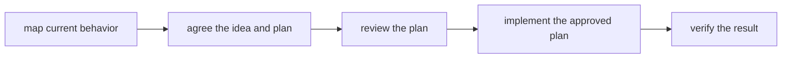

# Contributing

Read [README.md](README.md) for what wheelchair does. Before changing a directory,
read the root [AGENTS.md](AGENTS.md) and the nearest `AGENTS.md` below it. Those
routers say what the directory owns, its boundaries, and which source is authoritative.

Navigate in this order:

1. Read the applicable router.
2. Search the tree for the words used by the rule or behavior.
3. Use graphify only for cross-file blast radius, paths between distant concepts, or
   community structure, then confirm its results in source. A graph may be stale and
   never decides where a rule lives.

## Sources of truth

- `protocol/` holds the workflow's canonical rules. If behavior changes, change it
  there.
- `docs/plans/<slug>/` holds per-feature state. It is not a source of general rules.
- `skills/` and `codex/prompts/` are harness adapters. A wrapper points to one
  `protocol/` file; it does not repeat that file's rules.
- `AGENTS.md` files are maintained routing documents. Update them when a change moves
  ownership or makes a file-to-role entry false.
- `graphify-out/` is a disposable, gitignored snapshot. Do not treat it as
  documentation.

For feature work, the persistent documents carry the work from planning through
verification:



The `status:` field in `docs/plans/<slug>/PLAN.md` is the workflow's state machine:
`planning -> ready-for-review -> approved -> implementing -> verifying -> done`.
Do not edit it to skip a stage. Use `/adopt` when a plan was written outside this
workflow.

## Editing conventions

- Keep wrappers thin. Adding a command requires both `skills/<command>/SKILL.md` and
  `codex/prompts/<command>.md`; `install.sh` discovers both automatically.
- Keep rules in one place. In particular, lane commands belong only in
  `protocol/lanes.md`, and template changes are contract changes that must agree with
  the stage which consumes the template.
- Do not hand-edit the wheelchair-owned block in `~/.claude/CLAUDE.md` or
  `~/.codex/AGENTS.md`. `sensitivity/set.sh` is its only writer, and the next run
  overwrites that block.
- When ownership moves between directories, update the routers on both sides in the
  same change. Do not reformat an existing router to match `protocol/routers.md`; that
  file guides creation, not conformance.
- Keep human-facing prose direct and grounded. Specific claims carry `file:line`, and
  anything not checked is named as unchecked rather than inferred. The full rules are
  in [protocol/writing.md](protocol/writing.md).
- Do not commit `node_modules/`, `graphify-out/`, `viewer/test/.tmp/`, or
  `test-results/`.

## Installation and generated files

Run `./install.sh` after cloning, after changing a wrapper, or after installing another
harness. It renders wrappers into the harness homes, installs the viewer dependencies
and Chromium, then updates the diagram-sensitivity block. This reaches outside the
clone; the fixture suites below do not.

Edits under `protocol/` normally take effect immediately because installed wrappers
point back to this checkout. The exception is the delimited region in
`protocol/sensitivity.md`; run `sensitivity/set.sh` or `./install.sh` after changing it.
Restart running harness sessions after adding or changing command registrations.

## Validation

Run the checks for the area you changed, then run the full set before handing off a
cross-cutting change:

```bash
bash spine/test/run.sh
bash sensitivity/test/run.sh
bash install/test/run.sh
./install.sh && ./install.sh
node --test 'viewer/test/*.test.js'
npm --prefix viewer run test:browser
```

The quoted glob in the Node test command is required. Protocol documents have no test
suite; review their rendered output and make sure each stage still produces the input
the next stage expects.

Do not validate viewer changes against a manually started default server: it may reuse
an older process. Use the suites, or start an isolated server with both `--port` and
`--cache-root`.
