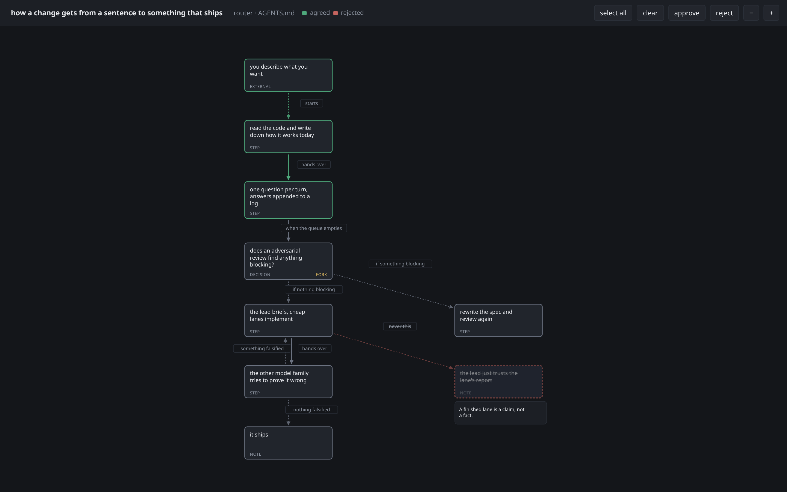

# wheelchair

Agents are good at writing code and bad at being held to a plan. This is the harness that holds
them to one: map how the code works, agree what good looks like, plan against it one question at a
time, have a **different model family** try to tear the plan apart — or, on one account, a fresh
reviewer that never saw the conversation — build it with cheap worker lanes, then have a second
one try to prove the result wrong.

The documents are the state. Not a context window, not a conversation — a directory per feature
holding the map, the north star, the decision log, the spec, every review round, and what actually
got built. A stage refuses to run out of order, so you can close the laptop mid-plan and pick it up
a week later.

The same problem runs the other way. An agent needs a harness to stay on a plan; the person
reviewing its work needs one just as much. Left alone, both model families report in one flat
register — paragraphs of hedged, evenly-weighted prose where nothing reads as more important than
anything else, so you can't skim it and you can't tell what you already agreed to. The protocol
constrains the reporting as hard as it constrains the work: rules for how anything a person reads
gets written, and a picture whenever the answer has a shape.

It runs the same from Claude Code and from the Codex CLI, through wrappers that are pointers and
nothing else.

## Answering with a picture

Prose is a bad medium for a shape. Ask how something works, or let a plan propose a flow, and an
agent draws it and opens it — and says what it's showing you, in the panel above the picture:



You drag the boxes until it reads, then **approve or strike in bulk** — select a region, one
gesture. Green is approved, dashed red struck, grey not yet ruled on. The next agent turn reads
your verdicts before it asks its next question, and at the end of planning the spec has to account
in prose for everything you struck. The panel is the agent's, not yours: it says what the picture
shows, what to look at, and what it leaves out, and it gets rewritten every redraw — one click
collapses it and hands the canvas back.

You don't have to ask for any of this. `/diagram-sensitivity` sets how eagerly a picture turns
up on an ordinary question, and the words still carry the whole answer at every setting.

The rules that make that safe to share with an agent: it can restructure a graph freely, but it can
never alter something you struck, never reuse its id, and never mark its own work approved. It
*can* supersede something you approved when the design moves — but only by resetting it to unruled
and saying so, and the reset is recorded in the file, so a resumed session can tell "you reset
this" from "nobody has looked at this yet."

## Layout

```
protocol/        canonical stage definitions — the single source of truth
  lanes.md             how every stage spawns a subagent (codex exec / Claude)
  adopt.md             on-ramp: fast-forward an externally-written plan in
  map.md               how to explain existing code: flow first, grounded, no filler
  writing.md           how anything user-facing is written: sized by the reader, labels
                       re-grounded, above the code, no AI tells
  diagrams.md          where a diagram goes and what keeps it true: Mermaid on rendered
                       surfaces, arrow chains in terminals, redundant with its prose
  graphs.md            the graph format read by both harnesses: schema, verdicts,
                       preservation, how the viewer starts
  sensitivity.md       the diagram-sensitivity dial: the region rendered into both
                       harnesses' always-on files, and what each level draws
  routers.md           the router document format: what a directory owns, what must never
                       happen there, where to go next — guidance for creation, not a test
  spine.md             /spine: propose routers for a repo that has none, list every write
                       first, and write nothing until a person confirms
  planning.md          Stage 1: map the code, set the north star, one question at a time
  plan-review.md       Stage 2: two independent reviewers, cross-family when available
  implementation.md    Stage 3: lead + cheap worker lanes from whichever family is present
                       (escalation only on evidence)
  verification.md      Stage 4: blind verify, cross-family when available, + remediation loop
  templates/           MAP.md, IDEA.md, PLAN.md, COMPLETION.md skeletons
spine/           scan.sh: resolves routing documents through symlinks, read-only, JSON out
  test/run.sh          fixture assertions; builds its tree under the system temp directory
sensitivity/     set.sh: the only writer of whichever harness files are present,
                 all-or-nothing across them
  test/run.sh          fixture assertions; never touches the real ~/.claude or ~/.codex
skills/          Claude Code wrappers → rendered into ~/.claude/skills/ when claude is present
codex/prompts/   Codex CLI wrappers → rendered into ~/.codex/prompts/ when codex is present
docs/plans/      one directory per feature; the only mutable state
viewer/          index.html and server.js — the browser viewer a graph opens in
install.sh       renders the wrappers, installs viewer/'s dependencies, and writes the
                 dial's region into each present harness's always-on file (idempotent)
AGENTS.md        this repo's own routers, one per directory that owns a rule —
                 also protocol/, skills/, spine/ and sensitivity/
```

## Install

```bash
./install.sh
```

A wrapper has to name an absolute path, because a command runs with your target repo as its
working directory and a relative path would resolve nowhere. The repo therefore cannot hold
one: wrappers carry a `{{WHEELCHAIR_ROOT}}` placeholder and `install.sh` substitutes wherever
you cloned it. Edits to `protocol/` still take effect immediately in every present harness,
because the rendered wrapper points back into your working tree; editing a wrapper itself
needs a re-run. Restart running sessions to pick up new skill/prompt registrations. The same
run also installs `viewer/`'s npm dependencies and its pinned Chromium via Playwright.
`spine/scan.sh`, `spine/test/run.sh`, `sensitivity/set.sh`, and `install.sh` itself are shell,
not markdown — `viewer/` is the one piece with its own package dependencies and a
long-running server.

The last step reaches **outside** the clone. `protocol/sensitivity.md`'s delimited region is
*rendered* into `~/.claude/CLAUDE.md`, `~/.codex/AGENTS.md`, or both — whichever harness or
harnesses are present — because the diagram-sensitivity dial has to be in effect before you
type, and on an ordinary question no command runs to look it up. Only the bytes between the
markers are this repo's, and only they are overwritten; everything else in those files is left
alone. That region is the one thing here whose edits need a re-run, and if the writer refuses —
duplicated markers, a hand-edited level, a non-empty `AGENTS.override.md` — it warns and changes
nothing rather than failing the install.

## Usage

From either harness, in the target project:

```
/plan <slug or description>   # build/resume the plan, one question at a time
/plan-review <slug>           # review rounds, cross-family when available, until approved
/implement <slug>             # lead + workers; ends with COMPLETION.md
/verify <slug>                # blind verify, cross-family when available; remediate until PASS
/graph <question>             # answer a question with a picture instead of just prose
/diagram-sensitivity [level]  # report the dial, or set it: ask, default, high
```

`/diagram-sensitivity` is how eagerly an unasked-for picture shows up. `ask` is the old
behaviour — nothing is drawn unless you ask, except a planning turn proposing a flow, which
always draws. `default` draws when the shape *is* the answer. `high` draws whenever there's a
shape at all, and tightens the prose around it without dropping anything from it. It is one
setting, global, and it survives reinstalling.

**Already have a plan document?** Fast-forward it in:

```
/adopt path/to/plan.md        # normalize, report gaps, choose where it lands
```

It copies the document into `docs/plans/<slug>/` (the original is never moved or
modified), synthesizes an `IDEA.md` for you to confirm, checks the tree for parts of the
plan that are **already built**, and reports what the protocol needs that the document
lacks — usually validation commands, non-goals, and edge cases.
Then it asks one question: land at `approved` (straight to `/implement`),
`ready-for-review` (run the review gate, cross-family when available), or `planning` (real
holes to talk through).
The recommendation comes from the gap report rather than from your confidence, and the
landing is recorded in the Decision Log — Stage 4 otherwise can't tell "vetted elsewhere"
from "gate skipped."

The stage commands take slugs only. `/graph` takes a question, `/adopt` and `/spine` take a
path, and `/diagram-sensitivity` takes a level or nothing — none of the four is a stage:
`/graph` answers on the spot without touching `status:`, `/adopt` is the on-ramp into the state
machine, so there's one place to look when asking how a plan arrived, `/spine` sits outside it
entirely, and `/diagram-sensitivity` sets a preference rather than doing any work.

**Repo has no router documents?** Back-fill them:

```
/spine path/to/working/tree     # propose a router per directory that owns a rule
```

`/spine` takes a path to a working tree, not a slug, and is outside the plan state machine —
it writes documentation, so there is no plan and no review gate. It lists every file it would
create or extend, and what changes in each, then writes nothing until you confirm. It refuses
a target outside a git repository and names the repositories and worktree hubs it found
instead, so the next command is obvious. Existing routing documents are extended and
corrected, never reformatted. `protocol/routers.md` is the format;
`protocol/spine.md` is the run sequence.

Artifacts live in the target repo at `docs/plans/<slug>/`:

- **MAP.md** — how the existing code works today. End-to-end flow, a plain-text diagram,
  every claim carrying `file:line`, and an explicit list of what wasn't checked. Written
  before the idea, so decisions get made against what's actually there.
- **IDEA.md** — plain-language north star: what this is for, what good looks like, what
  it is explicitly not doing. Written and confirmed before any design question, then held
  stable while the plan churns. Every later stage reads it to check for drift.
- **PLAN.md** — the mutating work: question queue, watch list, decision log, spec,
  accepted risks, review rounds, prior work, implementation tasks.
- **`graphs/`** — one JSON file per flow discussed in Stage 1, opened in the browser
  viewer; disposable, never a contract once the plan is done.
- **COMPLETION.md**, **REMEDIATION-N.md** — implementation output and verification loops.

The `status:` field in PLAN.md frontmatter is the state machine (`planning →
ready-for-review → approved → implementing → verifying → done`); each stage refuses to
run out of order.

## The viewer

The graph viewer is a single HTML file and a Node server with no runtime dependencies. Start it and
show a graph:

```bash
node viewer/server.js --show path/to/graph.json    # open it in a browser
node viewer/server.js --open path/to/graph.json    # start/register only, no browser
node viewer/server.js --stop                       # shut it down
```

`--show` is separate from `--open` on purpose: `--open` runs *before* a graph is written, so
opening a browser there would show an empty page. `--show` runs after. It opens nothing when a tab
is already on that graph, so an agent redrawing every turn will not stack up windows — the open tab
picks the new version up on its own poll. `--no-browser`, or `WHEELCHAIR_NO_BROWSER=1`, suppresses
the launch on a headless box.

It binds `127.0.0.1` only, and every route needs a token minted at start. `protocol/graphs.md` is
the format and the full producer sequence.

## What one account costs

Two model families fail in different places — a mistake one walks straight past is the kind
the other one catches — and that is most of why Stage 2's review and Stage 4's verify are
worth running. One account still runs both gates, but there is only one family to draw a
reviewer or a verifier from, so that gap disappears, and nothing in the one-account path gets
it back.

What one account keeps is the blindness: the reviewer and the verifier still never see the
conversation that produced the plan or the build, only the document and the repo. That part
costs nothing to keep, and it doesn't change here.

## Dependencies

Exactly one of `codex` or `claude` is required — `install.sh` runs on either alone. Both
together unlock the cross-family gates above; with one, Stage 2 and Stage 4 run inside the
single family you have. Node is required either way, for the viewer.

- `codex` CLI (v0.146+) for GPT lanes — headless via `codex exec`, models `gpt-5.6-luna`,
  `gpt-5.6-terra`, and `gpt-5.6-sol`. See `protocol/lanes.md`.
- `claude` CLI for Claude lanes when driving from Codex.
- Node and npm — `viewer/`'s runtime (developed against Node 26); `install.sh` runs
  `npm --prefix viewer install`.
- Playwright, pinned in `viewer/package.json` and installed by `install.sh`'s
  `playwright install chromium` step — the viewer's one dev dependency, and the only way
  to run its browser test.

Delegation deliberately goes through `codex exec` and the Claude CLI rather than any other
subagent runtime, so both harnesses drive the same binaries and every lane is inspectable from a
plain shell. `protocol/lanes.md` states that as an explicit override, because an agent reading
other guidance will otherwise drift back.
