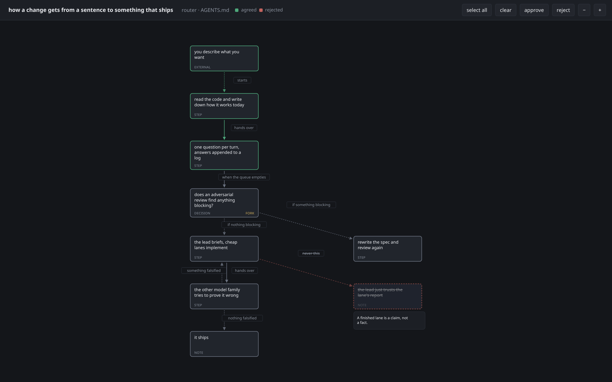

# wheelchair

Agents are good at writing code and bad at being held to a plan. This harness holds them to one.
It maps how the code works, agrees what good looks like, and plans one question at a time. A
**different model family** then tries to tear the plan apart. Cheap worker lanes build it, and a
blind verifier tries to prove the result wrong.

The documents are the state, not a context window. Each feature gets a directory holding the map,
the idea, the decision log, the spec, every review round, and what got built. Each stage refuses
to run out of order, so you can stop mid-plan and resume a week later.

The reporting is held to the same standard as the work. There are rules for how anything you read
gets written, and a picture whenever the answer has a shape. It runs the same from Claude Code and
from the Codex CLI.

## Usage

From either harness, in the target project:

```
/plan <slug or description>   # map the code, confirm the idea, then one question at a time
/plan-review <slug>           # adversarial review rounds until approved
/implement <slug>             # lead + cheap workers, with a live run picture; ends with COMPLETION.md
/verify <slug>                # blind verification; remediate until PASS
/adopt path/to/plan.md        # bring in a plan written elsewhere
/graph <question>             # answer a question with a picture
/spine path/to/tree           # propose router docs for a repo that has none
/diagram-sensitivity [level]  # how eagerly pictures appear: ask, default, high
```

Review and verification run cross-family when both `claude` and `codex` are installed. With one,
the gates still run, with a fresh reviewer that never saw the conversation.

Each feature lives in `docs/plans/<slug>/`:

| File | What it is |
|---|---|
| `MAP.md` | How the code works today, every claim with `file:line`, plus what wasn't checked |
| `IDEA.md` | The plain-language goal and non-goals, confirmed before any design question |
| `PLAN.md` | Question queue, decision log, spec, review rounds, implementation tasks |
| `graphs/` | Pictures drawn while planning, and `run.json`, the live picture of an implementation run |
| `COMPLETION.md`, `REMEDIATION-N.md` | What got built, with evidence, and each verification loop |
| `SEEN.md` | What you've been shown, so an agent re-explains anything you haven't seen |

`status:` in `PLAN.md` is the state machine: `planning → ready-for-review → approved →
implementing → verifying → done`.

## Pictures



Ask how something works, or let a plan propose a flow, and the agent draws it in a browser viewer.
The panel above the picture says what it shows and what it leaves out. Drag boxes, then **approve
or strike in bulk**:
- Green is approved, dashed red is struck, grey is not ruled on yet.
- An agent can never change what you struck or mark its own work approved.
- Planning has to account for everything you struck before the plan can leave Stage 1.

**The run picture.** During `/implement`, the lead keeps a left-to-right picture of the change:
- Each piece of the design is a box, wired to what it feeds and to the stores it touches.
- Every piece shows *not started*, *in progress*, *done* or *needs you*.
- When a worker makes a choice its brief didn't settle, that choice appears as a box you can
  strike. The lead turns each strike into a follow-up task before the write-up.
- When a part needs you, the tab title changes and a browser notification fires.

Before any worker starts, the lead asks you once for everything the run needs, such as logins and
installs.

## Install

```bash
./install.sh
```

This renders the wrappers for whichever harness is installed, and installs the viewer's
dependencies, including Chromium and Firefox for its tests. It is idempotent. Re-run it after
pulling a change to a wrapper or under `viewer/`, and restart open sessions to pick up new
commands.

It also writes a few things outside this repo:
- a delimited block in `~/.claude/CLAUDE.md` and/or `~/.codex/AGENTS.md`, which holds the
  diagram-sensitivity setting
- a per-turn hook and its write grant, in each harness's settings

The hook carries your wording list, which holds phrases you've asked agents to stop using. After a
long break, it also tells the agent how long you've been away. Only the delimited block and the
hook's own entry are this repo's, so nothing else in those files is touched.

## The viewer

A Node server with no runtime dependencies, bound to `127.0.0.1`. It serves the graphs, a list of
graphs and plans, and a document reader. Agents start it themselves. By hand:

```bash
node viewer/server.js --show path/to/graph.json   # open a graph in the browser
node viewer/server.js --url                       # print the bookmark address
node viewer/server.js --stop
```

A machine can serve the viewer to your other devices over Tailscale: run `./install.sh --serve`,
or `--no-serve` to decline. This runs it as an always-on `systemd` user service, from this
checkout's code, at `https://hearth.taileb4e52.ts.net/wheelchair/`. Open the bookmark once per
device and it's remembered. `--rotate-token` locks every device out again. Everything, including
dragging boxes and rulings, works on a phone.

`protocol/graphs.md` has the full format.

## Layout

| Directory | What's there |
|---|---|
| `protocol/` | The rules every stage follows. The single source of truth |
| `skills/`, `codex/prompts/` | One-line wrappers for each harness, pointing into `protocol/` |
| `viewer/` | The graph viewer: server, pages, tests |
| `spine/`, `sensitivity/`, `seen/`, `install/` | The router scanner, the dial writer, the per-turn hook, and their test suites |
| `docs/plans/` | One directory per feature. The only mutable state |

Every directory that owns a rule has an `AGENTS.md` router saying what it owns and where to go
next. Start at the root one. `CONTRIBUTING.md` has the conventions and validation commands.

## Dependencies

- `claude` or `codex` (v0.146+). Either one alone works, and both unlock the cross-family gates.
  GPT lanes run through headless `codex exec` (`protocol/lanes.md`).
- Node and npm, for the viewer.
- Playwright, pinned in `viewer/package.json` and installed by `install.sh`, for the browser tests.
