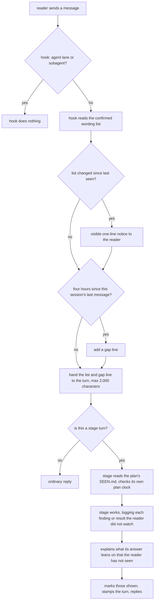

# Completion Report — Knowing what you have actually seen

Written for a hostile reviewer: every claim checkable, no claim without evidence.

```yaml
verified-by:
  - round: <n>
    lane: <verifier lane/model>
    checks: <the implementing lane it checked>
```

## What the change does

Two pieces. Stages keep a per-plan log of what the reader has been shown and explain what an
answer leans on that the reader has not seen; that half is protocol prose. A user-level
`UserPromptSubmit` hook on both harnesses carries the reader's confirmed wording list, a
session gap line, and a one-time visible notice when the list changes; that half is code,
installed by `install.sh`.



In words: every message passes through the hook, which skips lanes and subagents, announces a
change to the wording list once, adds a gap line after four quiet hours in the session, and
hands the list to the turn. A stage turn additionally reads its plan's record, logs hidden
work as it happens, explains what its answer relies on that the reader has not seen — all of it
after a four-hour gap on the plan — and marks it shown.

## Spec coverage

| Spec item | Origin | Implemented at (file:line) | Validated by |
|-----------|--------|----------------------------|--------------|
| Plan record `SEEN.md`: format, append-only, random ids, only stages write (D24, D30) | this run | `protocol/seen.md:10-27`; template `protocol/templates/SEEN.md` | prose; Accepted Risk (stage half verified by no suite) |
| What a stage writes (D19, D33, D41, D5) | this run | `protocol/seen.md:29-40` | prose |
| What a stage reads — only what the turn leans on (D31) | this run | `protocol/seen.md:42-46` | prose |
| End-of-turn order: `shown`, then `turn` (D54) | this run | `protocol/seen.md:48-52` | prose |
| Plan clock on `turn` lines; no line = no gap; stage ignores session gap line (D48, D50, D52, D54) | this run | `protocol/seen.md:54-64` | prose |
| After a gap: leaned-on entries count as unseen; rulings named by outcome; resume summary unchanged (D56, D57) | this run | `protocol/seen.md:66-76` | prose |
| Threshold stated once as `gap-threshold: 4h` (D54, D55) | this run | `protocol/seen.md:78`; `seen/hook.sh:16` | `seen/test/run.sh` cross-file check |
| Stage documents point at `seen.md`, restating nothing | this run | `protocol/planning.md:117`, `protocol/plan-review.md:134`, `protocol/implementation.md:38`, `protocol/verification.md:120` | `seen/test/run.sh` cross-file check |
| Wording list format and three sections (D10, D15, D29) | this run | `protocol/seen.md:80-104`; `seen/wording.sh:9-11` | `wording_test.sh` "file creation has all headers" |
| `seen/wording.sh` verbs, refusals, case-insensitive single identity (D35, D39) | this run | `seen/wording.sh:84-138` | `wording_test.sh` (11 assertions) |
| Wording writers serialised on a separate lock file, atomic replace (D35, D39) | this run | `seen/wording.sh:99-100`, `:29-42` | `wording_test.sh` "twenty concurrent suggestions lose nothing" |
| Suggest-and-answer flow, one short line, ignored never re-asked (D28) | this run | `protocol/seen.md:117-128` | prose |
| Hook ignores lanes (`WHEELCHAIR_LANE`) and subagents (`agent_id`) (D47, D51) | this run | `seen/hook.sh:149`, `:156` | `hook_test.sh`; live Codex run with `WHEELCHAIR_LANE=1` (below) |
| Lane invocations carry `WHEELCHAIR_LANE=1` (D47) | this run | `protocol/lanes.md:12-21`, `:42`, `:104`, `:141-142` | `seen/test/run.sh` cross-file check |
| Hook reads nothing inside a repository (D30) | this run | `seen/hook.sh:146-190` (paths only from env/home) | `hook_test.sh` "cwd repository canary never appears" |
| Change notice via `systemMessage`, once, locked compare-and-save, not advanced on `no-notice` (D43, D45, D49) | this run | `seen/hook.sh:77-102`, `:162-175`, `:183` | `hook_test.sh` (notice, silent seed, no-notice); live interactive check on both harnesses (below) |
| Session clock per session; malformed file overwritten (D48, D52) | this run | `seen/hook.sh:104-120` | `hook_test.sh` "gap reports once", "separate clocks", "malformed session overwritten" |
| Fixed context text, newest first, 2,000-character cap with left-out count (D34) | this run | `seen/hook.sh:122-144` | `hook_test.sh` "context cap reports omitted entries"; live runs |
| Fail open: exit 0 on every controlled path (Failing open, D52) | this run | `seen/hook.sh:146-192`; `protocol/seen.md` "Failing open" | `hook_test.sh` malformed-input cases |
| Hook under 200 ms | this run | — | `hook_test.sh` "hook finishes under 200 ms" |
| Installer adds our group beside foreign hooks, matched on script path (D14, D26, D52) | this run | `seen/set.sh:78-120` | `set_test.sh` "foreign group stays beside ours", "changed hook arguments rewrite rather than duplicate"; real install kept moshi hooks |
| `"timeout": 2`, byte-stable entry, `/hooks` line on create or change (D36) | this run | `seen/set.sh:74-76`, `:298` | `set_test.sh` canonical fields, second run byte-identical, approval line once |
| Write grants: Claude allow rule and sandbox `allowWrite`; Codex `writable_roots` (D38, D42) | this run | `seen/set.sh:122-172`, `:181-241` | `set_test.sh` fresh homes, one-line extension, byte preservation |
| Grants only where the harness shows the notice (D43, D49) | this run | `seen/set.sh:37` (`notice` for both, set from the live check); recorded at `protocol/seen.md` "The hook" | `set_test.sh` "no-notice still installs its hook without grant files" |
| `~/.wheelchair/` created after refusal checks, not on refusal | this run | `seen/set.sh:272-273` | `set_test.sh` refusal cases assert no wording dir |
| Refusals: bad JSON, non-object, wrong-shape subtrees, bad TOML, multi-line `writable_roots` | this run | `seen/set.sh:60-72`, `:90-120`, `:181-241`, `:266-269` | `set_test.sh` six refusal cases |
| `install.sh` calls `seen/set.sh` before the sensitivity writer, warning on refusal | this run | `install.sh:100-104` | `install/test/run.sh` (70 pass); real `./install.sh` twice |
| Test seams `WHEELCHAIR_WORDING`, `WHEELCHAIR_STATE` (D46) | this run | `seen/hook.sh`, `seen/wording.sh`, `seen/set.sh`; `install/test/run.sh:157` | every fixture suite; real homes asserted unchanged |
| Routers and docs | this run | `seen/AGENTS.md`; `AGENTS.md:24-29`, `:36`, `:55`, `:67`, `:106`; `protocol/AGENTS.md:34`; `README.md:65`, `:83` | read by lead |

## Deviations from plan

- **Scripts are bash shims running Python**, as `codex/preflight.sh` does, and lock with
  Python's `fcntl.flock` rather than the `flock` command, which macOS lacks. `protocol/seen.md`
  says "`flock`"; the semantics are the same advisory lock.
- **The installer writes absolute paths** for the wording directory (`/home/…/.wheelchair`)
  where the Spec wrote `~/.wheelchair`: Codex's `writable_roots` and Claude's `allowWrite` are
  not guaranteed to expand `~`.
- **JSON settings files are re-serialised** with two-space indentation on first write. Keys
  keep their order and every foreign entry is kept, but whitespace in a hand-formatted file may
  change. The file's permission bits are preserved.
- **`~/.codex/hooks.json` already existed** before install, holding moshi hooks on four events;
  `MAP.md` item 3 said it did not. The installer's coexistence rule (D26) kept all of them.

## Routers

- `seen/AGENTS.md` — new; owns `hook.sh`, `wording.sh`, `set.sh`, `test/`.
- `AGENTS.md` (root) — `seen/` added to the kind table, "where to go", verification; `install.sh`
  row names the `seen/set.sh` call; the outside-the-clone paragraph gained the hook as a second,
  deliberate reach that adds no standing instruction.
- `protocol/AGENTS.md` — row for `seen.md`.
- `install/` has no router; nothing else moved ownership.

## Validation evidence

```
$ bash seen/test/run.sh  → exit 0; 0 FAIL lines
== hook_test          16 passed, 0 failed
== wording_test       11 passed, 0 failed
== set_test           RESULT 16 passed, 0 failed
== cross-file
PASS hook GAP_HOURS (4) equals protocol/seen.md gap-threshold
PASS protocol/{planning,plan-review,implementation,verification}.md point at seen.md
PASS every lane invocation in protocol/lanes.md carries WHEELCHAIR_LANE=1
$ bash spine/test/run.sh        → exit 0; RESULT 80 passed, 0 failed
$ bash sensitivity/test/run.sh  → exit 0; RESULT 62 passed, 0 failed
$ bash install/test/run.sh      → exit 0; RESULT 70 passed, 0 failed
$ node --test viewer/test/*.test.js   → # tests 125  # pass 125  # fail 0
$ npm --prefix viewer run test:browser → 202 passed (1.1m), Chromium and Firefox
$ ./install.sh && ./install.sh  → both exit 0; git status --porcelain empty
```

Live checks, real logins, no real config written (hook supplied via `claude -p
--setting-sources project --settings <tmp>` and `codex exec --dangerously-bypass-hook-trust -c
'hooks.UserPromptSubmit=[…]'`, state and wording under temp paths via the seams):

```
claude turn 1 (canary seeded)   → model quoted: wheelchair — wording the reader has asked for (…):
                                  - "ZEBRA-CANARY-17" — avoid it
claude turn 2 (list emptied)    → NONE
codex turn 1 (canary seeded)    → model quoted the wheelchair — wording … line
codex turn 2 (list emptied)     → no wheelchair — line (it quoted the unrelated sensitivity markers
                                  from ~/.codex/AGENTS.md)
codex with WHEELCHAIR_LANE=1    → NONE, and confirmed.last was never created
```

Interactive notice check, by Collin on 2026-09-24 after the real install: a new Claude Code
session showed `wheelchair: wording list — removed "test phrase"` under his message, and a new
Codex session (after approving the hook in `/hooks`) showed the `added "codex check"` line.
Both test rules were then cleared from `~/.wheelchair/wording.md`.

Real install result: `~/.claude/settings.json` gained our `UserPromptSubmit` group beside the
moshi one, the allow rule and the `allowWrite` entry; `~/.codex/hooks.json` gained our group
beside four moshi groups; `~/.codex/config.toml` gained two lines; `~/.wheelchair/` created.

## Known gaps / residual risks

- **The stage half is prose executed by an agent, and no suite covers it** (Accepted Risk).
  This run's own turns predate the feature, so no `SEEN.md` exists for this plan; the first real
  observation is the next review round on any plan after merge.
- The Accepted Risks in `PLAN.md` stand: interrupted turns lose `shown` lines, free chat after a
  stage can cause one extra re-grounding, only the first post-gap turn resets, higher Codex
  config layers can replace `writable_roots`, and caching impact is unmeasured.
- The first `./install.sh` on a machine re-serialises the user's JSON settings (see Deviations).
- `test phrase` and `codex check` were cleared from the wording list by hand-editing, not via
  `remove`; they were test fixtures, not reader rulings, so D15's keep-struck rule was not
  applied to them.

## Remediation rounds

### Remediation 1 — 2026-09-24

Verification round 1 failed on seven gaps (`REMEDIATION-1.md`). Fixed:

- **Python ran with the working directory on its import path** (the security gap). All three
  scripts now run `python3 -I -` (`seen/hook.sh:7`, `seen/wording.sh:2`, `seen/set.sh:26`), and
  the hook's imports sit inside its fail-open wrapper. The verifier's exploit — a `json.py` that
  writes a marker and a `re.py` that raises, planted in the working directory — was re-run by the
  lead: no marker, exit 0, normal output, for both the hook and `wording.sh`. New tests plant the
  same files (`seen/test/hook_test.sh`, `seen/test/wording_test.sh`).
- **A partly malformed wording file** now counts as empty unless its three headers appear once
  each, in order — the rule `wording.sh` already applied.
- **Hook tests inherited `WHEELCHAIR_LANE`** from a marked lane; every fixture now runs with it
  unset, and the suite passes both ways.
- **Installer contract** is now stated in `protocol/seen.md` "The installer's reach" rather than
  delegated; `seen/AGENTS.md` points there and states the `-I` isolation.
- **SEEN template** body is empty; the illustration sits indented inside the comment.
- **Wording question vs one-question rule**: `protocol/seen.md` states the yes/no line is an
  aside under that rule, always last.
- **README** no longer says the hook carries the plan record; names the `seen/set.sh` step; lists
  `seen/` among routers.
- Adopted minors: a corrupt `confirmed.last` self-heals instead of disabling notices; an
  instead-only edit is announced as `changed "<phrase>"`; `set.sh` without `tomllib` exits 1 with
  a one-line message naming Python 3.11.

Validation after remediation:

```
$ bash seen/test/run.sh → exit 0; hook 20 passed, wording 12 passed, set 18 passed, cross-file all PASS
$ WHEELCHAIR_LANE=1 bash seen/test/run.sh → exit 0
$ bash spine/test/run.sh → RESULT 80 passed, 0 failed
$ bash sensitivity/test/run.sh → RESULT 62 passed, 0 failed
$ bash install/test/run.sh → RESULT 70 passed, 0 failed
$ node --test viewer/test/*.test.js → # pass 125 # fail 0
$ ./install.sh (on the real homes, after the change) → exit 0; git status --porcelain empty
```

### Remediation 2 — 2026-09-24

Verification round 2: the Claude verifier passed the scripts; `gpt-5.6-sol` failed one gap
(`REMEDIATION-2.md`) — a valid row beside a garbled line inside a section was still carried.
Remediation 1's brief had told the lane to skip such lines, so the brief, not the lane, was at
fault; the rule is now decided in `REMEDIATION-2.md`: inside the three sections every line is
blank or a valid entry, otherwise the file is malformed. Fixed by a fresh gpt-5.6-terra lane at
`xhigh` (thread `01a0d56d-4f58-7171-904a-d64be24b1159`): the hook treats such a file as empty,
`wording.sh` refuses it (exit 1, file unchanged); a preamble above `## Confirmed` stays allowed.
The lead also fixed the Claude verifier's two prose notes (README `install.sh` line;
`protocol/seen.md` refusal list).

```
$ WHEELCHAIR_LANE=1 bash seen/test/run.sh → exit 0; hook 23 passed, wording 15 passed, set 18 passed, cross-file all PASS
$ env -u WHEELCHAIR_LANE bash seen/test/run.sh → exit 0
$ bash install/test/run.sh, sensitivity/test/run.sh, spine/test/run.sh → exit 0
lead probe: valid row + "garbage" inside ## Confirmed → hook prints nothing; wording.sh suggest → "wording: malformed wording list", exit 1, file byte-identical
```
