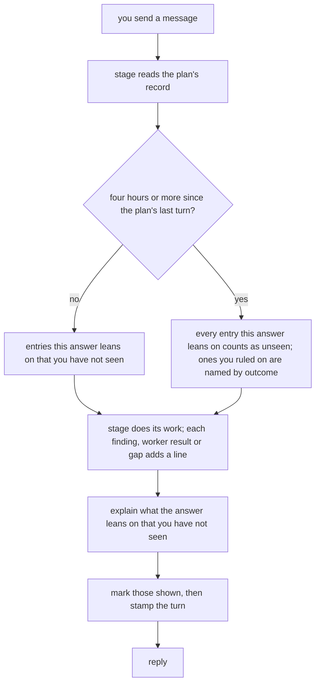
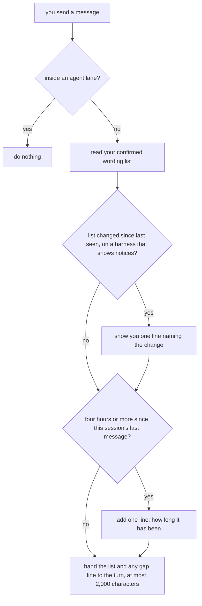

# Knowing what you have actually seen

**Idea:** `IDEA.md` — what this is for and why, in plain language. Read it first; it is
the north star this plan serves. Goal and Constraints live there, not here, so they don't
get buried as this file grows.

## Open Questions

Ordered by leverage; discussed one at a time. A settled question moves to the Decision
Log and is deleted from here.

## Watch List

Things noticed that need looking into — not yet decisions for the user. Written down the
moment they're spotted so they can't be forgotten, surfaced to the user one line at a
time as they appear, and emptied before Stage 1 exits.

Each item ends up settled by the agent (noted in the Log), promoted to an Open Question,
promoted to a Constraint or Accepted Risk, or waved off by the user.

| # | Noticed | What needs looking into | Raised to user? | Outcome |
|---|---------|-------------------------|-----------------|---------|
| W1 | 2026-09-19 | How a Codex hook is actually configured. `hooks` is a stable, enabled feature, the binary carries `struct HooksToml`, but no path that was tried fired one. Needs Codex's own hook docs or an interactive session that can answer the trust prompt — not more path guessing. | yes | settled by D18 — Codex hooks fire at user scope; nothing is deferred |
| W2 | 2026-09-19 | Whether injected context is visible to the user, counted against the context window, or breaks prompt caching. The Claude run proved the model received it and nothing more. | yes | **Accepted risk** — unmeasured; the lane dominates the cost and D6 gates the lane |
| W3 | 2026-09-19 | `protocol/sensitivity.md:23` holds an inert level line that disagrees with both installed copies (`MAP.md`, Problems found). | yes | **Deferred** (Source: planning) — a real defect, in a neighbouring file, with nothing to do with this feature |
| W5 | 2026-09-19 | JSON has no comment marker, so "owns only what it wrote" needs a mechanism the sensitivity writer does not have. | yes | settled by D14 — match on the command path, which the schema already requires |
| W6 | 2026-09-24 | `MAP.md` was written before `remember-me` (PR #14) rewrote parts of the protocol and moved the viewer under `/wheelchair/`. Its `file:line` citations are now off by a few lines in places (`protocol/planning.md:118` is now `:112`). Re-check the citations Q6's answer leans on before the Spec is rewritten | yes | settled — `MAP.md` citations re-checked and corrected against current files, including the installed dial level, which now reads `default` |
| W7 | 2026-09-24 | `IDEA.md`'s last constraint still says neither harness's per-turn mechanism has been proven here. Both have since fired (`MAP.md` item 3, D18), so the sentence is stale and its "revisit the idea" clause no longer applies. Correcting it is a Constraints edit, not a scope change | yes | settled — the constraint now says both were proven |
| W8 | 2026-09-24 | Whether a subagent-finished hook (`SubagentStop` on Claude Code, `subagent_stop` on Codex) could append a record entry mechanically when ordinary chat runs a helper agent — closing D21's accepted limit with no model call and no instruction. Untested on either harness, including what its payload carries | yes | **Deferred** (Source: planning) — D21's accepted limit, listed under Deferred |
| W4 | 2026-09-19 | Whether the check should fire inside a subagent's own turns. `subagent_start`/`subagent_stop` exist on both harnesses; a worker lane is not the reader this feature serves. Defaulted to no (D4), reopen if a stage turn's summary turns out to need it. | no | settled by D4 |

## Decision Log

Append-only. A reversal is a new entry superseding the old, never an edit.

| # | Decision | Rationale | Source |
|---|----------|-----------|--------|
| D1 | The check runs on Sonnet for Claude lanes and `gpt-5.6-terra` for GPT lanes | Named in the original request. Both are the default implementation tier on their side, and the work is judgment-shaped enough that the transcription tier would be wrong | user |
| D2 | This is a build people depend on, graded for Collin daily and for every project the wording record reaches | Confirmed with `IDEA.md` | user |
| D3 | A check that is too eager is the dangerous failure; too quiet merely leaves today in place | Confirmed with `IDEA.md`. Sets which way every later judgment call breaks | user |
| D4 | The check does not run on subagent turns | A worker lane is not the reader this serves, and firing there would spend quota to ground text nobody reads | defaulted |
| D5 | The check returns evidence — a list of what the turn leans on that you have not seen — never drafted prose or an instruction about how to write | Handing back prose makes the checker the author of the turn, which is the thing the idea's first non-goal rules out | defaulted |
| D6 | The check fires only when something you have not seen entered the record since your last message | Firing on every turn regardless spends a single account's quota on turns that cannot fail the check. Also the cheapest guard against D3's failure | defaulted |
| D7 | Two triggers, one mechanism. The record, the register, the check and what it returns are identical on both harnesses; only what fires them differs — Claude Code's user-prompt hook on every turn, Codex's stage commands on stage turns | The only option where solving the Codex hook later is an addition rather than a rewrite. The named pain — a question arriving after review rounds nobody saw — is a stage turn on both harnesses, so both are covered from the start | user |
| D8 | Every stage that composes a turn for the user fires the check on Codex: planning, plan review, implementation, verification | Named individually so no stage is left out by omission. D6's firing condition still gates each one, so a stage turn that follows nothing unseen pays nothing | defaulted |
| D9 | The record of what you have seen lives with the work: inside `docs/plans/<slug>/` for anything belonging to a plan, and in a session-scoped file in a cache directory for chat that belongs to no plan | The only option that survives both a resume and a harness switch, which `IDEA.md` makes a hard constraint. Falls out of D7 as well — Codex fires the check from a stage, a stage always has a slug, so there is nowhere else it could write | user |
| D10 | The register of wording does **not** follow D9. It lives outside any repository, one file, shared by every project | Settled by `IDEA.md` rather than open: the idea commits to wording changing how you are written to "in other work, on other days," which a per-plan file cannot do | defaulted |
| D11 | When a plan is created in a session that already has a session-scoped record, that record is folded into the plan's record at creation | The hour of chat immediately before `/plan` is the most relevant thing the plan's record could start with, and both files already exist at that moment | defaulted |
| D12 | The session-scoped file is keyed the way question graphs already are — repository basename plus a hash of its absolute path, under the same cache root | Reuses a derivation this repo already relies on (`protocol/graphs.md`, "Where graph files live"), including its reason: two worktrees of one repo share a basename and would otherwise collide | defaulted |
| D13 | `install.sh` writes Claude Code's hook entry into `~/.claude/settings.json`, owning only what it wrote and refusing rather than merging when it finds something it did not | Per-repository setup fails the requirement that ordinary chat be covered everywhere; printing a block to paste fails it slowly instead of immediately. The refusal path is what makes writing a file the user owns safe, so it is built first | user |
| D14 | The installer recognises its own hook entry by the command path it points at, rather than by any added key | Settles W5. JSON has no comment marker, and the command string is a value the schema already requires, so nothing has to be smuggled into a shape the harness validates. A moved clone breaks the match — but a moved clone already requires re-running `install.sh` for every wrapper, so this adds no new failure mode | defaulted |
| D15 | The register is one file with three sections — proposed, confirmed, struck — edited by hand, with struck entries kept rather than deleted so a rejection sticks | The cheapest surface that still closes the only gap in it. Borrows the one load-bearing rule from the graph verdict model and leaves the rest unbuilt | user |
| D16 | The check runs at the **end** of the turn that produced the unseen work, not at the start of the turn that would report it. Its finding is written to the record; the next turn reads a file rather than waiting for a lane | Supersedes the latency cost written into the Spec after D7. `IDEA.md` makes "you do not wait longer for an answer than you do today" a constraint, and a lane on the reading turn violates it on both harnesses. The finding — what entered the record that the reader has not seen — is fully known when the work finishes, so nothing is lost by computing it then | defaulted |
| D18 | **Supersedes D7.** Both harnesses use the same hook configuration; there is no asymmetry and no stage-only fallback | The premise of D7 was that Codex hooks could not be made to fire. They fire — verified on a headless `codex exec` run with a user-level `~/.codex/hooks.json`. The earlier failure was project scope needing a trusted `.codex/` layer, which is a fact about my test, not about Codex | review-round-1 |
| D17 | A gap of **4 hours or more** between the reader's messages flips every `shown` entry to `cold`; `decided` entries never flip | A number the plan has to state so review can argue with it. The asymmetry is the point: what you chose survives a break, what you were shown does not | defaulted |
| D19 | **The stage writes the record as it works.** Each time a unit of hidden work finishes — a review round after triage, a worker task's result, a verification round — the stage appends one line saying what happened, in words you would recognise. Before composing a turn to you it reads the record, grounds every entry you have not been shown, and marks them shown | Q6. The fact the record needs — this happened where you could not see it — is certain at the moment the work is done, so it needs no independent observer. Grounds the stage's own summary in time, which a post-turn hook cannot. Dissolves four Round 1 blocking findings rather than patching them: the circular firing gate, the detached-lane race, the one-turn lag, and the quota cost | user |
| D20 | **Supersedes D1, D6 and D16.** There is no check lane, no model runs for this feature, and there is no firing condition | All three existed to schedule and pay for a lane D19 removes. D5 still holds for what the stage writes: evidence, never drafted prose or a writing instruction | defaulted |
| D21 | **A hook also covers ordinary chat**, on both harnesses: a `UserPromptSubmit` hook that reads files and calls no model. It carries three things into a turn: the confirmed wording list, a note when four hours or more have passed since your last message, and any stage-written entry you have not been shown | Q7. The wording list is your own, confirmed, visible and editable, so handing it to a turn is evidence of your rulings rather than a standing instruction — the "standing instruction by another route" objection raised against this was overstated and is withdrawn. Accepted limit: nothing records hidden work done in ordinary chat itself (W8) | user |
| D22 | No `Stop` hook. The one hook is `UserPromptSubmit`, installed at user scope on both harnesses | D19 left nothing to do after a turn lands. User scope is the one scope verified on Codex (`MAP.md` item 3) | defaulted |
| D23 | **Supersedes the session-record half of D9, and D11.** There is no session record. The hook reads every `docs/plans/*/SEEN.md` under the git top level of the hook's `cwd`; the only per-session file is the time of your last message, under `~/.cache/wheelchair/<repo-key>/<session-id>`, keyed per D12 | Nothing in ordinary chat writes entries (D21's accepted limit), so a session record would stay empty. Reading every plan record in the repo settles Round 1's finding that a hook cannot tell which plan a turn belongs to: it does not need to. One reader, so an entry surfaced in the "wrong" session was still surfaced to the right person | defaulted |
| D24 | `SEEN.md` is an append-only log of one-line events, committed with the plan, with no frontmatter state. An entry is added as `new`; showing it is a later `shown` line naming its id; state is the latest line per id. There is no turn counter | Settles three Round 1 findings: no ordered turn id exists on either harness, so none is used; a single short line appended with `>>` does not interleave with another writer's, so there is no lost update; and with no volatile frontmatter the file changes only when a stage works on the plan, so it belongs in the plan's commits (D48 adds one `turn` line per stage turn) | defaulted |
| D25 | After a gap of four hours or more (D17), the hook injects the gap and the entries shown since the previous gap, **once** — the next message is inside four hours, so it does not repeat. There is no `cold` state | Settles Round 1's finding that `cold` entries never retire and pad every later turn. A one-shot injection cannot accumulate | defaulted |
| D26 | **Supersedes D13's refusal rule.** The installer adds its own hook group beside any hooks already there, recognised by command path (D14), and refuses only when the file is not valid JSON or not an object. It writes `~/.claude/settings.json` and `~/.codex/hooks.json`, each only when its harness is present | Settles Round 1's upheld finding that refusing on any other hook silently denies the feature to anyone who has one. The hooks config is an array of groups, so coexisting is an append; the delimited-region precedent exists because Markdown has nothing to append into | defaulted |
| D27 | Two home roots, one rule: `~/.cache/…` holds only what is safe to delete (graph cache, last-message times); `~/.wheelchair/` holds what is yours and hand-edited (the wording list) | Settles Round 1's three-roots finding by giving each root a reason rather than merging them | defaulted |
| D28 | **Stages suggest wording entries, and you approve them in the conversation.** When you push back on wording during a stage turn — ask what a word means, ask for something simpler — the stage appends a suggestion to `## Proposed` and ends that turn with **one short line** asking whether to keep it. You answer in your ordinary reply and the stage moves it to `## Confirmed` or `## Struck`. Ignored, it stays in `## Proposed` and is never asked about again. At most one suggestion per turn, and the line never displaces the turn's content. Removing a confirmed entry is a plain request in any conversation | Q8. You named the failure: a file you have to find and edit is a file you will not maintain, and suggestion lines crowding a turn would be the over-explaining this feature exists against. Settles Round 1's finding that a suggested entry never reached you. **Supersedes D15's rule** that only you write `## Confirmed` and `## Struck`: the stage writes them, on your answer | user |
| D29 | Every wording entry carries its phrase in double quotes. A suggestion whose quoted phrase matches a `## Struck` phrase, ignoring case and surrounding whitespace, is not made | Settles Round 1's finding that struck-entry matching had no identity rule. The quoted phrase is the identity; the date and the prose around it are not | defaulted |
| D30 | **Supersedes the third item of D21, and D23 and D25.** The hook never reads or writes any `SEEN.md`. It carries exactly two things: the confirmed wording list, and — on the first message after four hours or more — how long it has been. Only stages read and write `SEEN.md` | Round 2 upheld five findings with one root: a user-level hook runs in every repository, trusted or not, so reading `SEEN.md` injected text a cloned repository controls; it marked entries shown in whichever session spoke first, stealing a stage's grounding; two hooks could race to surface one entry; it pushed every unshown entry into unrelated chat; and its `shown` lines dirtied the tree from any branch. Stages ground their own entries in the same turn, so almost nothing was left for the hook to carry | review-round-2 |
| D31 | A stage grounds the entries **its turn leans on** and appends `shown` only for those. When a plan's `status` changes, the stage making the change appends `closed` for every entry still unshown; a closed entry is never surfaced | Round 2: grounding "every unshown entry" recites work instead of explaining what the answer depends on, the too-eager failure D3 ranks worst. `closed` stops unneeded entries accumulating | review-round-2 |
| D32 | When the hook reports a gap, the stage re-grounds entries from the plan's **last working stretch** that the turn leans on: the run of `shown` lines counted back from the latest one until a silence of four hours or more between two lines. Computed from `SEEN.md` timestamps alone | Round 2: "shown since the previous gap" had nothing stored to compute it from. This is computable, scoped to one plan, and bounded | review-round-2 |
| D33 | One entry per thing a stage's summary could lean on: each upheld or `user-decision` review finding, each accepted worker result, each verification gap. A declined finding or a clean round adds nothing | Round 2: the rule said one entry per round while the example wrote one per finding | review-round-2 |
| D34 | The hook's output is fixed text, capped at 2,000 characters on both harnesses, under the Codex (~2,500 tokens) and Claude (10,000 characters) limits. Confirmed wording entries go newest first; any that do not fit are replaced by one line giving how many were left out | Round 2: unbounded output would make the two harnesses diverge once each started truncating in its own way, and the ordinary-chat agent needs text it can read as fact rather than as an instruction | review-round-2 |
| D35 | Every write to the wording list goes through `seen/wording.sh` (`suggest`, `confirm`, `strike`, `remove`). It creates the file with its three headers if absent, serialises writers with `flock`, replaces the file by temp-file-and-rename, and applies D29's struck match inside `suggest` | Round 2: nothing defined creating the file or two stages writing it at once, and the struck match was a model judgment the fixture suite could not test. A script makes all three testable | review-round-2 |
| D36 | On Codex the hook runs only after you approve it once in `/hooks`, and a changed definition must be approved again. The installer writes a byte-identical entry on every run so the approval survives reinstalls, and prints one line naming `/hooks` whenever it creates or changes the Codex entry | Round 2 finding, verified against `https://learn.chatgpt.com/docs/hooks` ("new or changed hooks are marked for review and skipped until trusted") and the `hooks need review` string in Codex 0.156.0. The approval is a security gate this repository does not bypass | review-round-2 |
| D37 | **Supersedes D12 and the repo key in D27 for the last-message file.** It is `~/.cache/wheelchair/sessions/<session-id>`, keyed by session alone | The gap is a fact about a session, not a repository, and a session id is already unique. Settles the contradiction outside a git repository, where no repo key exists | review-round-2 |
| D38 | **The installer grants the wording script write access once**, so saving your answer never prompts. On Codex it adds `~/.wheelchair` to `sandbox_workspace_write.writable_roots` in `~/.codex/config.toml`; on Claude Code it adds an allow rule for `seen/wording.sh` to `permissions.allow` in `~/.claude/settings.json`. Same own-entries-only rules as the hook | Q9. "Never prompts" holds except where a higher Codex config layer replaces the list (Accepted Risks). Asking each time is the tedium you ruled out, and a per-project list drops `IDEA.md`'s cross-project promise | user |
| D39 | `seen/wording.sh` verbs, all taking the phrase as their first operand: `suggest "<phrase>" "<instead>"` adds to `## Proposed` and refuses when the phrase already appears in **any** section; `confirm "<phrase>"` and `strike "<phrase>"` move that phrase's `## Proposed` row; `remove "<phrase>"` moves a `## Confirmed` row to `## Struck`. Phrases compare ignoring case and surrounding whitespace, so each phrase appears at most once in the file. Writers take `flock` on `~/.wheelchair/.lock`, never on the file being replaced | Round 3: `remove` deleting would let a removed rule be suggested again; `suggest` refusing only struck phrases would re-ask an ignored one; operands were undefined; and locking the file itself is defeated by the rename replacing its inode | review-round-3 |
| D40 | **Supersedes D32's trigger.** A stage measures the gap itself, from the timestamp of the latest line in the plan's `SEEN.md`; the hook's gap line serves ordinary chat only | Round 3: the usual way back to a plan is a new session, which has no last-message file, so a hook-only gap never fired there. The record is shared across sessions and harnesses | review-round-3 |
| D41 | Map-build findings do not produce entries. **Supersedes the `cold` state in D17**; the four-hour threshold stands | The map is shown to the reader before the idea is written (`protocol/planning.md` Step 1), so there is nothing unseen to record, and the phrase needed judgment no other entry kind does. D25 removed `cold` but D17 was never marked | review-round-3 |
| D42 | The installer also adds `~/.wheelchair` to `sandbox.filesystem.allowWrite` in `~/.claude/settings.json` | Round 3, verified against `https://code.claude.com/docs/en/sandboxing`: with Claude Code's Bash sandbox on, an allow rule approves the command but the OS still refuses the write outside the listed directories. Inert when the sandbox is off, its default | review-round-3 |
| D43 | **Every change to your confirmed list is shown to you**, once, on your next message, as one visible line through the hook's `systemMessage`. D38's standing permission stays. Where a harness turns out not to display a `UserPromptSubmit` `systemMessage`, the installer does not grant D38's permission on that harness, so saving a "yes" there asks | Q10. Keeps the no-prompt promise while making nothing about your preferences change without you seeing it, which is what `IDEA.md` requires. Whether each harness displays the line is unverified (vendor docs are silent for this event), so the implementer checks it first | user |
| D44 | **Supersedes D37 and D40.** The last-message time is kept per repository, shared by every session and both harnesses: `~/.cache/wheelchair/last/<key>`, where `<key>` is the first 16 hex characters of a SHA-256 of the repository root's absolute path. The root is found by walking up from `cwd` to the first directory holding a `.git` entry, **without running git**; outside any repository, `cwd` itself. The stage acts on the hook's gap line, and computes only the stretch (D32) from `SEEN.md` | Round 4, both lanes: `SEEN.md` times stage events, not your messages, so a quiet planning discussion past four hours re-grounded on every turn. Your own message times are the only honest clock, and keying them by repository rather than session makes the next-day new session see the gap. Not running git keeps a hostile repository's config out of the hook | review-round-4 |
| D45 | The hook is told which harness it runs on by its command line (`hook.sh claude` or `hook.sh codex`), and advances `confirmed.last` only on a harness whose `systemMessage` is displayed (D43). The compare-and-save runs under `flock` on `~/.cache/wheelchair/.lock` | Round 4: a harness that cannot show the notice would otherwise use it up unseen, and two sessions could both announce one change | review-round-4 |
| D46 | Two test seams, set only by the suites: `WHEELCHAIR_WORDING` replaces the wording file's path and `WHEELCHAIR_STATE` replaces `~/.cache/wheelchair`. Production never sets them, as with `WHEELCHAIR_PRESENT` in `protocol/lanes.md` | Round 4: the live check had no way to point the hook at a temporary file without touching real paths | review-round-4 |
| D47 | **Every lane is marked, and the hook ignores marked lanes.** Each lane invocation in `protocol/lanes.md` runs with `WHEELCHAIR_LANE=1` in its environment (`codex exec`, `claude -p`), and `hook.sh` exits 0 with no output and no file touched when it sees it | Round 5: GPT lanes are headless `codex exec` runs on your own Codex setup, so a user-level hook fires in them (`MAP.md` item 3). Unmarked, a lane would reset the gap clock, use up the change notice where nobody reads it, and carry the wording list into a worker, against D4 | review-round-5 |
| D48 | **Supersedes D44.** Two clocks, one per reader of the gap. The hook keeps one per session, `~/.cache/wheelchair/sessions/<session-id>`, for ordinary chat. A stage keeps one per plan: at the start of each turn to you it reads the time of the latest `turn` line in the plan's `SEEN.md`, then appends a new `turn` line; four hours or more between the two is a gap for that plan. The hook's gap line never drives a stage | Round 5, both lanes: a repository-wide clock let activity anywhere in the repository hide a gap on the plan you were actually cold on. A session is the thread in ordinary chat; a plan is the thread in a stage, and its record is already shared across sessions and harnesses. Also drops the repository-root walk, and with it the unlocked shared timestamp Round 5 found | review-round-5 |
| D49 | Whether a harness displays the notice is passed to the hook on its command line by the installer — `hook.sh <harness> notice` or `hook.sh <harness> no-notice` — both vendors' current docs describe `systemMessage` as shown to the user, but the live check decides — from one constant per harness in `seen/set.sh`, set from the implementer's check (D43) | Round 5: nothing said where the hook learns it, and `protocol/seen.md` is prose inside a repository the hook never reads. A command-line argument also lets the suite fake either case without a third seam | review-round-5 |
| D50 | A stage appends its `turn` line as the **last** action before the turn's text, not the first, and both the gap and the working stretch are measured on `turn` lines alone: the gap is now minus the latest `turn` line; the stretch is the entries shown after the earliest `turn` line in the unbroken run counted back from the latest, a break being four hours or more between consecutive `turn` lines | Round 6, both lanes: timing from the start of a turn made a four-hour implementation run look like you were away, and delimiting the stretch on `shown` lines mixed two clocks, so a long worker run could invent a boundary or hide a real one. Only the end of a turn marks when you could next have read | review-round-6 |
| D51 | The hook also ignores Claude Code subagents: it exits silently when its input carries `agent_id` | Round 6: D47's environment marker covers `codex exec` and `claude -p`, but Claude Code's own lanes are the in-process Agent tool, which never passes through a shell the stage controls | review-round-6 |
| D52 | A malformed session clock file is overwritten with the current time and reports no gap; D14's match is on the script path alone, ignoring the arguments D49 adds; the hook's gap line reads "this session's last message was …", and `protocol/seen.md` tells a stage to use its plan clock and not that line | Round 6 minors and one major: "treated as empty rather than repaired" would have disabled the clock for good; matching the whole command would duplicate the group when a D49 constant changed; and the stage would otherwise see two disagreeing clocks | review-round-6 |
| D53 | **Supersedes D32 and the stretch half of D50.** After a gap, the stage is given only the fact — how long since the plan's last turn — and re-grounds from the plan itself, the way the resume summary in `protocol/planning.md` Step 1 already does: what the work is for, where it stands, and what this turn is about to lean on. No set of past entries is computed or replayed. The plan clock (`turn` lines, written last, D50) stays, because it is what detects the gap | Round 6 escalation. The precise re-grounding rule broke in a new way in each of Rounds 4, 5 and 6. Coming back to a plan already begins with a resume summary, so the precise version added little beyond the timing logic that kept failing | user |
| D54 | **One fixed order for a stage's writes at the end of a turn**, immediately before its text: (1) `shown` for the entries this turn explains; (2) if this turn changes the plan's `status`, `closed` for every entry still unshown; (3) the `turn` line. A record with no `turn` line yet has no gap. On a resume after a gap, the resume summary in `protocol/planning.md` **is** the re-grounding, not an addition to it. The four-hour number is stated once in `protocol/seen.md`; `seen/hook.sh`'s constant names that file in a comment, and the suite checks the two agree | Round 7: three rules each claimed to be the last write, and closing before the final summary would hide the worker results it was about to explain; a first turn had no defined clock; a resume after a gap could stack two re-groundings; the threshold lived in two places | review-round-7 |
| D55 | **Closing happens only on a stage's exit status**: the turn that sets `ready-for-review`, `approved`, `verifying` or `done`. Setting `planning` or `implementing`, which a stage does on entry, closes nothing. On the first turn after a gap, the entry grounding (D31) covers what the turn leans on, and the re-grounding (D53) adds only what the work is for and where it stands; it applies to a resumed run of any stage, and a planning resume summary names settled decisions only as far as the next question depends on them. "Nothing after the `turn` line" means nothing further in `SEEN.md`. `protocol/seen.md` states the threshold as one line, `gap-threshold: 4h`, which the suite parses | Round 8, both lanes: `/implement` sets `implementing` at its start and can stop mid-run on a dead lane, so closing on any status change hid accepted results from the resumed run. The rest are Round 8 minors: two groundings overlapping on a gap turn, "resume" defined only for planning, the resume summary's "what's settled" against `IDEA.md`'s "without reciting your own decisions", an over-broad "nothing written", and a threshold with no parseable form | review-round-8 |
| D56 | **Supersedes the closing half of D31, D53, and the closing and resume parts of D54 and D55.** There are no `closed` lines and no separate after-gap re-grounding. One rule remains: before writing to you, a stage explains every entry its turn leans on that you have not been shown — and after a gap, every entry it leans on counts as not shown, including ones you saw before the gap. The planning resume summary is left exactly as `protocol/planning.md` has it today | Q11, after Round 9 reached the cap. Closing and the after-gap re-grounding drew a new fix in every round since Round 7. Leftover unshown entries cost nothing, because only what a turn leans on is ever grounded, so closing only ever hid things; and treating leaned-on entries as unseen after a gap covers `IDEA.md`'s "coming back after hours away" with the rule that has held since Round 2 | user |
| D57 | After a gap, an entry you ruled on — a `user-decision` finding — is referred to by its outcome and not explained again. The gap reset covers only the first turn after the gap | Round 10 minors. `IDEA.md` asks for re-grounding "without reciting your own decisions back to you", the exemption D17 once gave decided entries. A reset lasting past one turn would need to know where the break was, which is the stretch calculation D56 removed | review-round-10 |

## Spec

The settled design. Bar: a fresh agent with no conversation history can implement from this
section alone.

### What this adds, in one paragraph

Two records. The first says what the reader has been shown; the second says what wording
has landed badly with them. A stage appends to the first as each piece of hidden work —
anything done where the reader cannot see it, such as review rounds or worker tasks —
finishes, and reads it before writing a turn, so a turn that leans on something the reader
never saw explains it first (D19). A file-reading hook carries the wording list and, after
a long break, how long it has been, into every turn, ordinary chat included (D21, D30). No model
is called for any of this (D20), and nothing is added to any agent's standing instructions.

### The two flows

A stage turn, from your message to its reply:



Every message, ordinary chat included, first passes through the hook:



In words: a stage reads its plan's record, works out whether you have been away four hours or
more, does its work while logging what it finds, then explains whatever its answer relies on that
you have not seen — everything it relies on, after a break — before marking it shown. Separately,
on every message, the hook skips agent lanes, shows you any change to your wording list, and
hands the turn your confirmed list and, after a long quiet spell in that session, how long it has
been.

### The files

**The plan record — `docs/plans/<slug>/SEEN.md`.** Created by whichever stage first appends to
it, and committed with the plan (D24). No frontmatter state. The body is an append-only log, one event
per line:

```
2026-09-24T09:40Z turn
2026-09-24T10:02Z new 7c1e round 2 found the spec never said what happens when the settings file is malformed
2026-09-24T10:02Z new a40b round 2 found the installer refuses whenever any other hook exists
2026-09-24T10:05Z shown 7c1e
2026-09-24T10:05Z turn
```

An entry is unshown until a `shown` line names its id. A `turn` line carries
no id and marks a stage turn to the reader (D48). An id is four random hex characters,
redrawn if it already appears in the file, so two writers never need to agree on a counter. Every write is one short line appended with `>>`, so two writers cannot
lose each other's lines. Nothing ever edits or deletes a line. Only stages write this file (D30).

**The last-message time — `~/.cache/wheelchair/sessions/<session-id>`.** One ISO 8601
timestamp per session, overwritten by the hook on each of your messages. It serves ordinary chat
only (D48). Safe to delete; losing
it only means the next gap goes unnoticed (D27).

**The register — `~/.wheelchair/wording.md`.** One file, outside any repository, shared by
every project (D10). Durable and yours, which is why it is not under a cache root (D27). Stages
write it on your answers (D28); you may also edit it by hand.
Three sections, in this order. Each entry is one line: the date, the phrase in double quotes,
and what to do instead:

```
## Confirmed
- 2026-09-19 — "north star" — say what the goal is, plainly

## Proposed
- 2026-09-24 — "hidden work" — explain it before leaning on it

## Struck
- 2026-09-18 — "ledger" — not a dislike; that was a question about the design
```

Every write goes through `seen/wording.sh` (D35), whose verbs are fixed by D39. Each phrase
appears at most once in the whole file, so a verb always names exactly one row.

Only `## Confirmed` is carried into turns, by the hook (D21), together with the path of
`seen/wording.sh` so any agent asked to remove an entry can run `remove`. A `suggest` whose
quoted phrase matches a `## Struck` one, ignoring case and surrounding whitespace, is refused by
the script (D29, D35). Struck entries are never deleted by any agent
(D15). You never have to open the file (D28).

**How an entry gets there (D28).** When you push back on wording during a stage turn, the
stage runs `seen/wording.sh suggest` and, if the script accepted it, ends that turn with one
short line, for example: `Add "hidden work" to your wording list (explain it before leaning on
it)? yes/no`. Your next reply's yes or no runs `confirm` or `strike`. No answer leaves it in
`## Proposed`, never asked about again. At most one such line per turn, always last, never
more than one sentence. Ordinary chat outside a stage makes no suggestions; it only carries the
confirmed list (D21).

### Writing and reading the record

**What a stage writes (D19, D33).** One `new` line per thing its summary could lean on,
appended the moment the unit of work that produced it finishes: each upheld or `user-decision`
review finding once a round is triaged, each accepted worker result, and each verification gap
(D41). A declined finding or a clean round adds nothing. The line names the thing in words the reader
would recognise, with no coined labels. It is evidence only — never drafted prose, never an
instruction about how to write (D5).

**What a stage reads (D31).** Before composing any turn to the reader, the stage reads the
plan's record, grounds each unshown entry **that turn leans on**, and appends `shown` for
exactly those, in the end-of-turn order below (D54). Entries the turn does not lean on stay unshown. A turn with nothing to ground
reads exactly as it does today.

**End-of-turn order.** Immediately before a stage turn's text: its `shown` lines, then its
`turn` line. Nothing further is written to `SEEN.md` in that turn (D54).

**The plan's clock (D48, D50).** At the start of each turn to the reader, the stage reads the
time of the latest `turn` line in `SEEN.md`; four hours or more before now is a gap for this
plan, whatever happened in other sessions or plans meanwhile, and a record with no `turn` line
yet has no gap (D54). The turn's own `turn` line is its last write (D54). Only a turn written
under a stage document counts; free chat after a stage has finished writes none (Accepted
Risks). A stage ignores the hook's
session gap line (D52).

**After a gap (D56, D57).** On a turn that found a gap, every entry the turn leans on counts as
not shown, including ones shown before the gap: the stage explains them and appends `shown` for
them again. An entry you ruled on is referred to by its outcome instead of being explained
again. Nothing else changes — no summary is added, and the planning resume summary stays
as `protocol/planning.md` has it.

No lane, no model call and no firing condition exist for this feature (D20). It never runs on
a subagent's own turns (D4) — a worker lane does not write the record; the lead that accepts
its result does.

### The hook (D21, D22, D30)

One `UserPromptSubmit` hook, the same script on both harnesses, installed at user scope and
invoked as `hook.sh <harness> notice|no-notice` (D45, D49). It reads a few small files, runs no
model and no git, and never reads anything inside a repository (D30). With `WHEELCHAIR_LANE`
set, or an `agent_id` in its input, it exits 0 at once, with no output and no file touched (D47,
D51). On each of your messages it:

1. Reads `## Confirmed` from `~/.wheelchair/wording.md` and compares it with the copy saved at
   `~/.cache/wheelchair/confirmed.last`, under `flock` on `~/.cache/wheelchair/.lock`. If they
   differ and this harness displays `systemMessage`, it prepares the visible notice below and
   saves the new copy; on a harness that does not, it leaves the copy for the next message on
   one that does. If no copy exists yet, it saves one silently (D43, D45).
2. Reads `~/.cache/wheelchair/sessions/<session-id>`, then overwrites it with the current time
   (D48); a malformed file is simply overwritten and reports no gap (D52). If the old time is four hours or more ago (D17), it notes the gap in
   whole hours.
3. Returns the text below as `hookSpecificOutput.additionalContext`, and the notice, if any, as
   `systemMessage`. It returns nothing at all when there is no confirmed entry, no gap and no
   change.

The text is fixed, factual, and capped at 2,000 characters (D34):

```
wheelchair — this session's last message from the reader was 9 hours ago.
wheelchair — wording the reader has asked for (edit with <path>/seen/wording.sh remove "<phrase>"):
- "north star" — say what the goal is, plainly
- … 3 older entries left out
```

The visible notice is one line, shown to you rather than to the model:

```
wheelchair: wording list — added "hidden work"; removed "ledger"
```

Past 160 characters it ends with how many more changes there were. The gap line appears only
when there is a gap. Confirmed entries go newest first; when they do
not fit, the last line gives how many were left out. The cap is a named constant in `seen/hook.sh`. The four-hour threshold is stated once in
`protocol/seen.md`, as the line `gap-threshold: 4h`, and the hook's constant names that file in
a comment (D54, D55).

### The installer

`install.sh` gains a call to `seen/set.sh`, placed **before** the `sensitivity/set.sh` call
so the existing warning-not-failing step stays last. `seen/set.sh`, per harness present on
`PATH` (the presence rule `protocol/lanes.md` uses):

- Adds its hook group to `~/.claude/settings.json` or `~/.codex/hooks.json`, creating the file
  holding only that group if it is absent.
- Recognises its own group by the script path its command starts with, ignoring arguments (D14,
  D52), and rewrites it in place
  when present, so a second run is a no-op.
- Leaves every other hook exactly where it is (D26).
- Writes a byte-identical entry on every run with `"timeout": 2` set explicitly — the field
  name both harnesses' current hook docs use, not the `timeoutSec` string `MAP.md` found in the
  Codex binary — since Codex's default is 600 seconds. When it creates or changes the Codex entry it prints one line:
  `run /hooks in Codex once to approve the wheelchair hook` (D36).
- **Refuses and changes nothing** when the file is not valid JSON, is not an object, or has a
  `hooks` value, event list or matcher group of the wrong shape to append into. It reports what
  it found and exits non-zero.
- Creates `~/.wheelchair/` if absent, after every refusal check has passed and before granting
  anything — Codex's Linux sandbox drops a writable root that does not exist yet. A refusal
  leaves it uncreated.
- **Grants the wording script write access (D38, D42)** — on each harness where a
  `UserPromptSubmit` `systemMessage` is displayed to the user (D43; the implementer verifies
  this per harness first and records the result in `protocol/seen.md`). Claude Code: adds
  `Bash(<root>/seen/wording.sh:*)` to `permissions.allow` and `~/.wheelchair` to
  `sandbox.filesystem.allowWrite`, each if absent, refusing when either parent has the wrong
  shape. The sandbox entry opens the directory to every sandboxed command, not only the
  script. D43's notice catches a change made around the script unless the same command also
  rewrites `~/.cache/wheelchair/confirmed.last`, which nothing but the hook has reason to touch. Codex: adds `"~/.wheelchair"` to `writable_roots` under
  `[sandbox_workspace_write]` in `~/.codex/config.toml` if absent, appending the table when it
  does not exist. It edits only that one line or table and leaves the rest of the file byte for
  byte, and refuses when the file does not parse as TOML or `writable_roots` is not a one-line
  array. Nothing is ever removed.

A refusal **warns without failing the install**, for the reason `protocol/sensitivity.md`
gives for its own writer: `install.sh` runs under `set -euo pipefail`, and a non-zero writer
would abort it mid-run and break its own idempotence check for an unrelated reason.

### Failing open

Every path here fails open, without exception. A hook that exits non-zero, times out, or
returns unparseable output lets the turn proceed with nothing injected. The harness may print
its own one-line notice when that happens (Claude Code does, on a non-zero exit); the hook
therefore exits 0 on every path it controls, and only a timeout reaches that notice. A missing or malformed wording list,
`confirmed.last` or `SEEN.md` is treated as empty rather than repaired. The one exception is
the session clock file, which the hook overwrites on every message anyway, malformed or not
(D52). The hook entry carries a 2-second
timeout and in practice reads two small files; the fixture suite holds it under 200 ms.

This is the most important property in the Spec, and the reason is the asymmetry of cost: a
turn this feature blocks or delays is a failure you notice every time, while a turn it fails to
improve is only today's behaviour.

### Documents this changes

- **New: `protocol/seen.md`** — the canonical definition of all of the above. The one place
  the rules live, in the repository's own pattern.
- **New: `seen/set.sh`** and **`seen/test/run.sh`** — the writer and its fixture suite,
  following `sensitivity/set.sh` and `sensitivity/test/run.sh` exactly, including that the
  suite never touches a real `~/.claude`.
- **New: `seen/hook.sh`** — the one script both harnesses' hook entries point at.
- **New: `seen/wording.sh`** — the only writer of the wording list (D35).
- Both scripts honour the test seams in D46; `protocol/seen.md` documents them beside
  `WHEELCHAIR_PRESENT`.
- **New: `seen/AGENTS.md`** — the directory router, per `protocol/routers.md`.
- **Edited: `protocol/planning.md`, `plan-review.md`, `implementation.md`,
  `verification.md`** — each gains the write-and-read step from D19, stated once and pointing
  at `protocol/seen.md`, never restating its rules.
- **Edited: `protocol/lanes.md`** — `WHEELCHAIR_LANE=1` on every lane invocation (D47).
- **Edited: `protocol/templates/`** — `SEEN.md` joins the template set.
- **Edited: `install.sh`, `AGENTS.md`, `README.md`** — the new call, the new directory in the
  router table and the layout block.

`protocol/writing.md` is **not** edited. Its rules are correct and stay exactly as they are;
this feature supplies the fact they were always missing.

### Edge cases

- **Not a git repository, or no plan in it.** Nothing changes: the hook reads nothing inside a
  repository anyway (D30).
- **An untrusted or freshly cloned repository.** Its `SEEN.md` is read only by a stage you
  chose to run there, never by the hook (D30).
- **Two sessions on one plan.** Both stages may append; single-line appends do not interleave
  (D24). Two turns may both explain one entry. Harmless, and rare enough not to lock.
- **Two worktrees of one repository.** Each has its own `SEEN.md` in its own checkout, so its
  own plan clock (D48).
- **Coming back to a plan in a new session, or on the other harness.** The plan's clock is in
  its `SEEN.md`, so the stage sees the gap regardless of session or harness, hook or no hook
  (D48). In ordinary chat a new session has no clock and reports no gap.
- **A lane's own turns.** Marked with `WHEELCHAIR_LANE`; the hook ignores them (D47).
- **A struck wording entry suggested again.** `seen/wording.sh suggest` refuses it (D29, D35).
- **Settings already hold other hooks.** Ours is added beside them (D26).
- **Codex hook not yet approved.** It is skipped, and turns read as they do today until you
  approve it in `/hooks` (D36).
- **`confirmed.last` deleted.** The next message re-saves it silently, so a change made in
  between goes unannounced. Only a deliberate cache wipe causes this.
- **The reader edits a file by hand.** Permitted. Anything unparseable is treated as empty
  rather than repaired.

### Non-goals

From `IDEA.md`, restated here because the Spec is what a reviewer grades: no revision of any
agent's standing instructions; no model of what the reader knows in general; no preference
learned without the reader ruling on it; no participation in the work itself; nothing running
between turns; no replacement for `protocol/writing.md` or the graph verdicts; not a second
copy of the transcript.

### Validation

```bash
bash seen/test/run.sh                      # writer, hook and record-format assertions, exit-code gated
./install.sh && ./install.sh               # idempotent; git status --porcelain stays empty
bash install/test/run.sh                   # presence-aware installer assertions still pass
bash sensitivity/test/run.sh               # the neighbouring writer is unaffected
```

`seen/test/run.sh` asserts, against a throwaway `HOME` and fixture repository, never a real
one: the hook returns nothing with no confirmed entry and no gap; it returns the gap line once
and not on the next message; its output never exceeds 2,000 characters and reports how many
entries were left out; it reads no file inside the fixture repository; it finishes in under
200 ms; a malformed wording file yields nothing and exit 0. `seen/wording.sh`: creates the file
with its headers, refuses a `suggest` matching a struck phrase in any case, and loses nothing
under two concurrent writers. The hook also: returns a `systemMessage` naming an added and a removed phrase after the
confirmed list changes, and none on the following message; stays silent when
`confirmed.last` is missing; invoked with `no-notice`, leaves `confirmed.last` untouched; keeps a separate clock per session; exits 0 with no output and no state change when `WHEELCHAIR_LANE=1` or when its input carries
`agent_id`; overwrites a malformed session file and reports no gap; rewrites rather than
duplicates its group when only its arguments change; its four-hour constant equals the
`gap-threshold:` line in `protocol/seen.md`. The installer's written entry carries `"timeout": 2`
and no `timeoutSec`; it creates `~/.wheelchair/` on a clean run and leaves it absent after a
refusal. `grep` confirms every
lane invocation in `protocol/lanes.md` carries `WHEELCHAIR_LANE=1`. `seen/wording.sh` also: `confirm` and `strike` each move exactly the named `## Proposed` row and
refuse a phrase not there; `suggest` refuses a phrase present in any section; `remove` moves a
confirmed row to `## Struck`; a phrase differing only in case names the same row. The
installer: adds its group beside an existing foreign hook,
writes byte-identical output on a second run, refuses a non-JSON file and a wrongly shaped
`hooks` subtree with a warning and no change; adds the Claude allow rule and the Codex writable
root once each, leaves an existing `config.toml` otherwise byte-identical, and refuses an
unparseable one.

Plus one live check per harness using your **real** login, since a throwaway `HOME` has no
credentials on either harness, and writing **no** real config or state file: pass the hook with
`claude -p --settings <temp file>` and with `codex exec --dangerously-bypass-hook-trust -c
'hooks.UserPromptSubmit=[…]'` (verified 2026-09-24: an override-supplied hook's
`additionalContext` reached the model on Codex 0.156.0), with `WHEELCHAIR_WORDING` and
`WHEELCHAIR_STATE` pointed at temporary paths (D46). Seed a confirmed entry carrying a unique
canary phrase and assert the model received it. Then empty the wording file, save a matching
`confirmed.last` so no notice is due, fire a second turn, and assert the canary and the
`wheelchair —` prefix are **absent** — the too-eager failure D3 calls the dangerous one. The
assertion is on wheelchair's own text, not on "nothing injected", because your settings already
carry another tool's `UserPromptSubmit` hook and `--settings` adds to them rather than replacing
them. Before any of that, fire one turn on each harness whose hook returns a `systemMessage` and
record whether the user sees it: in Claude Code's interactive UI and Codex's TUI, not headless
output. That result sets D49's constants and decides D43's per-harness grant. Finally, fire one
`codex exec` with `WHEELCHAIR_LANE=1` and the override hook, and assert the canary is absent —
proof that the marker reaches the hook through Codex's environment.

The stage half lives in protocol prose, so no suite can exercise it. Checked mechanically:
each of `protocol/planning.md`, `plan-review.md`, `implementation.md` and `verification.md`
references `protocol/seen.md` and restates none of its rules (`grep`). Its behaviour is an
Accepted Risk until the first real review round after merge.

## Deferred

Work this plan left undone because of the kind of build it states. Not "not worth fixing" —
that is Accepted Risks. This is what the next plan starts from if this one earns a second life.

| Source | What was skipped | Why it is out of scope here | What it would take |
|---|---|---|---|
| planning | Recording hidden work done in ordinary chat, through a subagent-finished hook (W8) | D21 accepts that ordinary chat writes no entries. The hook exists on both harnesses but was never fired, and its payload is unverified | Fire `SubagentStop` / `subagent_stop` once on each harness, confirm what the payload carries, then one more branch in `seen/hook.sh` |
| planning | Repairing the inert `diagram-sensitivity` level line at `protocol/sensitivity.md:23` (W3) | A real defect in a neighbouring file that this feature neither causes nor depends on. Folding it in would put an unrelated change through this plan's review gate | A sentence in `protocol/sensitivity.md` saying the region's level line is a template and the installed copies hold the live value, or a writer change that keeps them in step |

## Accepted Risks

Real issues consciously not fixed, each with the reason. Part of the spec, not review
scaffolding — an implementer should read these, and later review rounds must not
re-raise them.

| Risk | Why accepted | Round |
|------|--------------|-------|
| A turn interrupted after its `shown` lines are written loses those entries | A stage has no point after its text is delivered at which it can still write. The loss is the too-quiet direction, which D3 ranks survivable, and after a gap any entry a turn leans on is explained again anyway (D56) | round-3 |
| The stage half — writing and grounding — is verified by no suite | It is protocol prose executed by the stage agent. The first real review round after merge is its first observation; the lead reads that plan's `SEEN.md` then | round-3 |
| On Codex, a project config, profile or `-c` override that sets its own `sandbox_workspace_write.writable_roots` replaces the user-level list, so saving a "yes" there prompts | Codex layers replace arrays rather than merging them (Round 5, citing Codex's config loader). The failure is a prompt, the tedium D38 avoids elsewhere, not a wrong outcome. None of the project tables in `~/.codex/config.toml` sets it today | round-5 |
| Free chat in a session after a stage finishes writes no `turn` line, so hours of follow-up questions can make the next stage turn see a gap and explain again what it leans on | Bounded to one turn and to what that turn leans on (D56). Making every ordinary turn write the plan's record would bring back the hook-writes-`SEEN.md` design D30 removed | round-7 |
| After a gap, only the first turn treats earlier entries as unseen; an entry that turn does not lean on counts as seen on the next | Too-quiet direction, which D3 ranks survivable. Extending the reset would bring back the break-finding calculation D56 removed (D57) | round-10 |
| The effect of injected context on prompt caching is unmeasured (W2) | Rationale restated in Round 2, since D20 removed the lane the original one leaned on. The injected text is now the whole cost: at most 2,000 characters (D34), nothing at all when there is no confirmed entry and no gap, and it arrives with the new message rather than inside the earlier conversation a cache would hold. Measuring it needs instrumentation this plan has no other reason to build | planning, round-2 |

## Review Rounds

### Round 10 — 2026-09-24

**Lanes:** GPT / gpt-5.6-sol (mechanics); Claude / default reviewer model (intent); cross-family: yes.

**Changed since Round 9:** `closed` lines and the separate after-gap re-grounding removed; after
a gap, every entry a turn leans on counts as not shown; the planning resume summary untouched
(D56); the hook's `"timeout"` field name; the installer creating `~/.wheelchair/`. The cap reset
after D56.

Six findings, all minor. **Clean**: zero blocking, zero major, no open `user-decision`. The
minors were cheap and are fixed.

| Lane | Reported | Finding | Lead verdict | Resolution |
|------|----------|---------|--------------|------------|
| claude | minor | After a gap, your own rulings would be explained again | `upheld` | D57 |
| claude | minor | The gap reset covers only the first turn after it | `accepted-risk` | Accepted Risks; D57 |
| both | minor | An Accepted Risk still names "closing" | `upheld` | Fixed |
| gpt | minor | No test for `"timeout": 2` | `upheld` | Added |
| gpt | minor | `~/.wheelchair/` creation is untested and could precede a refusal | `upheld` | Ordered after refusal checks; tested both ways |

### Round 9 — 2026-09-24

**Lanes:** GPT / gpt-5.6-sol (mechanics); Claude / default reviewer model (intent); cross-family: yes.

**Changed since Round 8:** closing only on exit statuses; the gap turn's re-grounding adding only
purpose and standing, applying to any stage's resumed run, and the planning resume summary's
limit on settled decisions; "nothing further in `SEEN.md`"; the `gap-threshold: 4h` line (all
D55). Third round since D53, the last before escalation.

Nine findings. Not clean: one blocking and four major. Third round since D53, so this goes to
Collin rather than to a Round 10.

**What keeps recurring.** Two mechanisms have drawn a fix in every round since Round 7:
closing leftover entries (D31, D54, D55, and now a two-session race) and the wording of the
after-a-gap re-grounding (D53, D54, D55, and now two majors). Both are refinements layered on a
simpler rule already in the Spec — a stage grounds only what its turn leans on (D31) — and both
dissolve if that rule is allowed to do the whole job.

| Lane | Reported | Finding | Lead verdict | Resolution |
|------|----------|---------|--------------|------------|
| gpt | blocking | One session's exit turn can close an entry another session just added, so it is never shown | `upheld` | Real under D55. Held for Collin's ruling on dropping `closed` |
| claude | major | The after-gap paragraph contradicts itself, and material shown before the gap is covered by neither rule | `upheld` | Held for the same ruling |
| claude | major | D55 limits the planning resume summary, but `protocol/planning.md:39-40` would be left saying otherwise, and the Spec forbids restating rules there | `upheld` | Held for the same ruling |
| gpt | major | `timeoutSec` in `MAP.md` against `timeout` in both vendors' docs | `upheld` | Checked both docs. Spec now names `"timeout"` |
| gpt | major | Nothing creates `~/.wheelchair/`, and Codex's Linux sandbox drops a writable root that does not exist | `upheld` | Installer creates it first |
| claude | minor | "Resumed run" versus "a gap" as the trigger is ambiguous | `upheld` | Held for the same ruling |
| claude | minor | Drop `closed`: leaning-on already bounds grounding, and closing still hides worker results at the `verifying` handoff | `user-decision` | Q11 |
| claude | minor | The re-grounding restates what the work is for on every post-gap turn | `upheld` | Held for the same ruling |
| claude | minor | A mangled `## Deferred` heading | `upheld` | Fixed |

### Round 8 — 2026-09-24

**Lanes:** GPT / gpt-5.6-sol (mechanics); Claude / default reviewer model (intent); cross-family: yes.

**Changed since Round 7:** the end-of-turn write order, the empty-record clock, the resume
summary as the re-grounding, and the threshold's single statement (D54); the Failing open
exception for the session clock; the free-chat accepted risk. Second round since D53.

Seven findings. Not clean: one blocking, raised by both lanes, fixed by D55.

| Lane | Reported | Finding | Lead verdict | Resolution |
|------|----------|---------|--------------|------------|
| both | blocking/minor | `/implement` sets `implementing` at its start and can stop on a dead lane; closing on any status change hides accepted results from the resumed run | `upheld` (blocking) | Checked `protocol/implementation.md:51,78`. D55 closes only on exit statuses |
| claude | minor | "The resume summary is the re-grounding" contradicts "never a recital of your own decisions" | `upheld` | D55 |
| claude | minor | "Resume" is defined only for planning | `upheld` | D55: re-grounding applies to any stage's resumed run |
| claude | minor | Entry grounding and re-grounding overlap on a gap turn | `upheld` | D55 |
| claude | minor | "Nothing written after the `turn` line" reads as every file | `upheld` | Scoped to `SEEN.md` |
| claude | minor | The threshold has no parseable form for the suite to match | `upheld` | `gap-threshold: 4h` |

### Round 7 — 2026-09-24

**Lanes:** GPT / gpt-5.6-sol (mechanics); Claude / default reviewer model (intent); cross-family: yes.

**Changed since Round 6:** the `turn` line written last and the gap measured on it (D50); the
hook ignoring Claude Code subagents (D51); the malformed clock, D14's match and the session gap
line's wording (D52); after a gap, the stage re-grounds from the plan rather than replaying a
computed stretch (D53). The cap reset after D53.

Six findings. Not clean: one blocking and one major, both fixed in the Spec (D54 and a
Failing-open rewording). Neither concerns the gap rule D53 simplified; the recurring problem
from Rounds 4–6 did not recur.

| Lane | Reported | Finding | Lead verdict | Resolution |
|------|----------|---------|--------------|------------|
| gpt | blocking | `shown`, `turn` and closing each claim to be the last write, and closing first would hide worker results the final summary explains | `upheld` | Checked against `protocol/implementation.md`, whose last step sets the status and writes the summary. D54 |
| gpt | major | Failing open says a malformed state file is not repaired, while D52 overwrites the session clock | `upheld` | Reworded with the one exception |
| claude | minor | Free chat after a stage writes no `turn` line, so the next stage may see a false gap | `accepted-risk` | Accepted Risks |
| claude | minor | A record with no `turn` line has no defined clock | `upheld` | D54: no gap |
| claude | minor | A resume after a gap may stack the resume summary and a re-grounding | `upheld` | D54: the summary is the re-grounding |
| claude | minor | The threshold now lives in two places | `upheld` | D54 |

### Round 6 — 2026-09-24

**Lanes:** GPT / gpt-5.6-sol (mechanics); Claude / default reviewer model (intent); cross-family: yes.

**Changed since Round 5:** lanes marked with `WHEELCHAIR_LANE` and ignored by the hook (D47);
two clocks — per session for the hook, per plan through `turn` lines in `SEEN.md` for stages —
replacing the repository clock and root walk (D48); the notice capability passed on the hook's
command line (D49); the Codex `writable_roots` accepted risk; fail-open and installer wording;
new lane and clock assertions. This is the third round since D43, the last before escalation.

Eight findings. Not clean: one blocking and two major, all upheld and fixed in the Spec. This
is the third triaged round since D43, so per `protocol/plan-review.md` the plan goes to Collin
rather than to a Round 7.

**What keeps recurring.** Rounds 4, 5 and 6 each found the rule for noticing that you were away
broken in a new way: timed on the wrong events (Round 4), shared across the wrong scope (Round
5), started at the wrong moment and delimited on a second clock (Round 6). Each fix was right
and each exposed the next edge. That is the signal the cap exists to surface: the precise
after-a-gap re-grounding is the part of this plan that does not converge.

| Lane | Reported | Finding | Lead verdict | Resolution |
|------|----------|---------|--------------|------------|
| gpt | blocking | The stretch is delimited on `shown` lines while the gap is timed on `turn` lines, so a long worker run can invent or hide a boundary | `upheld` | D50 |
| claude | major | Timing from the start of a turn makes a four-hour implementation run look like an absence | `upheld` | Checked: `protocol/implementation.md` runs lanes inside one long lead turn. D50 |
| gpt | major | Claude Code's lanes are the Agent tool, which the environment marker never reaches | `upheld` | D51 |
| gpt | major | A malformed session clock is "not repaired" yet must be overwritten every message | `upheld` | D52 |
| claude | minor | The hook's session gap line reaches stage turns and can disagree with the plan clock | `upheld` | D52 |
| claude | minor | An Accepted Risk cites D40, twice superseded | `upheld` | Now cites D50 |
| claude | minor | D14's match is ambiguous once D49 adds arguments | `upheld` | D52 |
| gpt | minor | D43 and D49 call the docs silent and use Codex as the `no-notice` example, but both vendors' docs now say `systemMessage` is shown | `upheld` | Example made neutral; the live check still decides |

### Round 5 — 2026-09-24

**Lanes:** GPT / gpt-5.6-sol (mechanics); Claude / default reviewer model (intent); cross-family: yes.

**Changed since Round 4:** the last-message time is per repository and found without running
git, and the stage acts on the hook's gap line (D44); the hook knows its harness and locks the
notice compare-and-save (D45); the test seams (D46); the live check's canary assertion and
seeded `confirmed.last`; the new `confirm`/`strike`, notice and root-finding assertions; the
sandbox grant's stated reach.

Eight findings. Not clean: two blocking.

| Lane | Reported | Finding | Lead verdict | Resolution |
|------|----------|---------|--------------|------------|
| claude | blocking | GPT lanes are `codex exec` on your own setup, so the user-level hook fires inside them: resets the clock, uses up the notice, injects the wording list into workers | `upheld` | Checked: `protocol/lanes.md:22-39` shares the user's Codex home, and `MAP.md` item 3 shows a user hook firing on `codex exec`. D47 |
| both | blocking/minor | A repository-wide clock lets activity in another session or plan hide the gap on the thread you are cold on | `upheld` | D48: a session clock for chat, a plan clock for stages |
| gpt | major | The repository timestamp's read-and-overwrite is unlocked, so two sessions can both report one gap | `upheld` | Dissolved by D48: a session clock has one writer |
| gpt | major | RE-RAISE: a project, profile or `-c` layer replaces Codex's `writable_roots`, so D38's "never prompts" can fail | `accepted-risk` | The evidence is right, so the re-raise stands; the consequence is a prompt, not a wrong build. Accepted Risks |
| claude | minor | Nothing says where the hook learns whether its harness shows the notice | `upheld` | D49 |
| claude | minor | Fail-open still speaks of the hook reading a record | `upheld` | Reworded |
| claude | minor | The notice can be defeated by a command that also rewrites `confirmed.last` | `upheld` | Reach restated in the installer section |

### Round 4 — 2026-09-24

**Lanes:** GPT / gpt-5.6-sol (mechanics); Claude / default reviewer model (intent); cross-family: yes.

**Changed since Round 3:** the wording script's verbs and lock (D39); the stage measuring the
gap from `SEEN.md` (D40); map-build entries dropped and `cold` retired (D41); the Claude sandbox
write grant (D42); the visible change notice and the per-harness condition on D38's grant (D43);
the fail-open wording; the live checks using the real login through `--settings` and `-c`; the
stage-half `grep` check and two new Accepted Risks. The cap reset after D43.

Nine findings. Not clean: one blocking finding, raised by both lanes independently.

| Lane | Reported | Finding | Lead verdict | Resolution |
|------|----------|---------|--------------|------------|
| both | blocking | D40 measures the gap from `SEEN.md`, which records stage events, not your messages, so a quiet discussion past four hours re-grounds on every turn | `upheld` | Checked: planning writes no entries (D33, D41) and re-grounding appends nothing, so the condition never clears. D44 |
| both | major | The change notice can be used up on a harness that does not display it, and two sessions can both announce it | `upheld` | D45 |
| claude | minor | The live check has no way to point the hook at temporary files | `upheld` | D46 |
| claude | minor | Emptying the list in the live check itself triggers a notice, muddying the "nothing injected" assertion | `upheld` | Seed a matching `confirmed.last` first |
| gpt | minor | Claude's `--settings` adds to your settings, which already carry another tool's `UserPromptSubmit` hook, so "nothing injected" is unprovable | `upheld` | Checked against `MAP.md` item 3 and `~/.claude/settings.json`. Assert on a wheelchair canary instead |
| gpt | minor | No test for `confirm` or `strike` | `upheld` | Added |
| claude | minor | The sandbox grant opens `~/.wheelchair` to every sandboxed command, not just the script | `upheld` | Stated in the installer section; D43's notice covers it |

### Round 3 — 2026-09-24

**Lanes:** GPT / gpt-5.6-sol (mechanics); Claude / default reviewer model (intent); cross-family: yes.

**Changed since Round 2:** the hook reads nothing inside a repository and carries only the
wording list and the gap (D30); stages ground only what a turn leans on, and `closed` at status
change (D31); the after-gap stretch (D32); entry granularity (D33); the hook's fixed text and
cap (D34); `seen/wording.sh` as the only writer of the wording list (D35); Codex's `/hooks`
approval and the byte-stable entry (D36); the session-keyed last-message file (D37); the
installer granting write access in both harnesses' config (D38); the installer's wider refusal
rule and 2-second timeout; the rewritten edge cases, validation and caching rationale.

Fourteen findings. This is the third triaged round, and it is not clean: one finding is a
genuine fork (Q10). The recurring shape across all three rounds is the same — every time this
plan reaches into a file outside the repository (hooks in Round 1, the hook reading plan records
in Round 2, the write permission in Round 3) review finds a new way it can go wrong. Q10 is that
pattern's latest instance, and the cap resets once it is settled.

| Lane | Reported | Finding | Lead verdict | Resolution |
|------|----------|---------|--------------|------------|
| claude | major | D38's standing permission lets an agent in any repository add a confirmed rule without you seeing it, reopening what D30 closed | `user-decision` | Real: the grant applies everywhere, and D38's rationale weighed only tedium. Settled by Collin as D43: keep the grant, show every change |
| both | major | `seen/wording.sh` verbs undefined: `remove` could delete (a removed rule comes back), `suggest` re-asks an ignored phrase, operands unspecified | `upheld` | D39 |
| gpt | blocking | Locking the wording file while replacing it by rename does not serialise writers | `upheld` (major) | Correct per `flock(2)`/`rename(2)`. A worker would build a subtly racy lock, not the wrong feature. D39 locks a separate file |
| claude | major | After-gap re-grounding never fires on a new session, the normal way back to a plan | `upheld` | D40 |
| gpt | blocking | With Claude Code's Bash sandbox on, an allow rule does not grant the write | `upheld` (major) | Verified in the sandboxing docs. D42 |
| gpt | blocking | Claude Code shows a notice when a hook fails, so "the turn proceeds unchanged" is impossible | `downgraded` (minor) | Verified in the hooks docs: a non-zero exit prints a notice, a timeout discards output. Wording fixed; the hook exits 0 on every path it controls |
| gpt | blocking | `shown` is written before the turn is delivered, so an interrupted turn loses entries | `accepted-risk` | No point after delivery exists for a stage to write. Too-quiet direction; see Accepted Risks |
| gpt | major | Live checks cannot run under a throwaway `HOME`: neither harness is logged in there | `upheld` | Verified: Codex accepts a hook through `-c`, and it reached the model with the real login. Validation rewritten |
| both | major/minor | Nothing can check the stage half: Stage 4 cannot run a review round on this plan, and too-eager grounding is untested | `upheld` | A `grep` check on the four stage documents, plus an Accepted Risk until the first real review round |
| claude | minor | The gap line in ordinary chat could invite a "welcome back" recap | `declined` | `IDEA.md` names coming back to a thread hours later as a case to cover. What the turn does with the fact is `protocol/writing.md`'s job, unchanged here |
| claude | minor | Map-build entries are in the Spec but not in D33, and need judgment | `upheld` | D41 drops them |
| claude | minor | D17's `cold` state is never marked superseded | `upheld` | D41 |

### Round 2 — 2026-09-24

**Lanes:** GPT / gpt-5.6-sol (mechanics); Claude / default reviewer model (intent); cross-family: yes.

**Changed since Round 1:** the architecture was replaced after Round 1, so almost the whole
Spec changed. In depth: the record's format and lifecycle (D19, D24); no check lane (D20); the
file-reading `UserPromptSubmit` hook on both harnesses and the order of hook and stage in one
turn (D21–D23, D25); the installer coexisting with foreign hooks (D26); the wording list's
suggest-and-answer flow and struck matching (D28, D29); home-directory roots (D27); failing
open; edge cases; validation. Unchanged and not re-litigated: D2–D5, D10, D12, D14, D17's
four-hour threshold, the non-goals.

Twenty-four findings across the two lanes, several overlapping. None of Round 1's settled
verdicts was re-raised except the caching risk, whose rationale was indeed stale. Most findings
trace to one root — a user-level hook reading and writing repository records — and one
decision (D30) removes it rather than patching each symptom. One genuine fork remains (Q9), so
the round is not clean.

| Lane | Reported | Finding | Lead verdict | Resolution |
|------|----------|---------|--------------|------------|
| gpt | blocking | Codex skips a hook until you approve it in `/hooks`, and again after any change; nothing in install or validation covers that | `upheld` (major) | Verified: vendor docs and the `hooks need review` string in Codex 0.156.0. A worker would build the right hook, so it is major, not blocking. D36 |
| gpt | blocking | A user-level hook runs in untrusted Codex projects and injects repository-controlled `SEEN.md` text as developer context | `upheld` | Verified in the vendor docs ("Codex still loads user and system hooks" in untrusted projects). D30: the hook reads nothing inside a repository |
| gpt | blocking | `shown` is written before any response exists, and an ordinary-chat agent is under no obligation to repeat injected text | `upheld` | D30 takes the hook out of `SEEN.md`; D31 has a stage write `shown` only for what its own turn explains |
| gpt | blocking | Two hooks can both read an entry as unshown and both inject it | `upheld` (major) | D30 removes the hook reader. Two stages on one plan may still both explain an entry; accepted in Edge cases as harmless |
| gpt | blocking | A synchronous hook on every message breaks "it cannot make you wait" | `downgraded` (minor) | Checked: both harnesses do run `UserPromptSubmit` synchronously. After D30 the hook reads two small files; `IDEA.md`'s test is "you do not wait longer than you do today", and a file read in milliseconds is not a wait you would notice. Fixed cheaply: explicit 2-second timeout (Codex defaults to 600) and a 200 ms assertion |
| both | blocking/major | Every unshown entry is pushed into any turn, whether or not the answer depends on it | `upheld` | D30 (hook) and D31 (stage grounds only what its turn leans on, `closed` at status change) |
| both | blocking/major | "Entries shown since the previous gap" cannot be computed from one overwritten timestamp | `upheld` | D32: the last working stretch, computed from `SEEN.md` timestamps |
| gpt | blocking | Outside a git repository the hook both skips the gap and carries it, and `<repo-key>` is undefined | `upheld` (major) | A contradiction a worker would ask about, not the wrong thing built. D37 keys the file by session alone |
| claude | major | A second session's hook steals entries a stage in another session meant to explain | `upheld` | D30 |
| claude | major | Nothing defines what the injected text says or how an agent reads it as fact | `upheld` | D34: fixed text and cap |
| claude | major | The struck-phrase match is a model judgment the shell suite cannot test | `upheld` | D35: `seen/wording.sh suggest` does the match |
| gpt | major | Granularity: one entry per round in the rule, one per finding in the example | `upheld` | D33 |
| gpt | major | The installer cannot append into a wrongly shaped `hooks` subtree, yet refuses only on bad JSON or a non-object | `upheld` | Refusal extended; fixture assertion added |
| gpt | major | No output bound; each harness truncates differently past its own limit | `upheld` | Verified limits: Codex ~2,500 tokens, Claude 10,000 characters. D34 caps at 2,000 characters |
| gpt | major | The wording list has no creation or concurrency rule | `upheld` | D35 |
| gpt | major | A Codex stage writing `~/.wheelchair/` is outside its writable workspace and must ask each time | `user-decision` | Real (no `writable_roots` in `~/.codex/config.toml`). Settled by Collin as D38: the installer grants it once |
| both | minor | RE-RAISE: the caching risk's rationale cites a lane and D6, both removed by D20 | `upheld` | Rationale rewritten in Accepted Risks |
| claude | minor | Hook `shown` lines dirty a committed file from unrelated work | `upheld` | D30 |
| claude | minor | D12 and D27 disagree on the cache root | `upheld` | D37 supersedes both for this file |
| claude | minor | "No instructions" in hook output versus wording entries phrased as instructions | `upheld` | D34's text presents them as the reader's recorded rulings |
| claude | minor | The suggestion example carries a gloss the register format has no field for | `upheld` | Entry format now has a "what to do instead" field |

### Round 1 — 2026-09-19

**Lanes:** GPT / gpt-5.6-sol (mechanics); Claude / default reviewer model (intent); cross-family: yes.

**Changed since Round 0:** n/a (first round — whole Spec in scope)

Nineteen findings after merging the two lanes; six were found independently by both. Eight
upheld at `blocking`. The round is not clean and the Spec's premise did not survive it.

| Lane | Reported | Finding | Lead verdict | Resolution |
|------|----------|---------|--------------|------------|
| gpt | blocking | Codex hooks are documented and working; deferring them leaves ordinary Codex turns uncovered, contradicting the same-on-both constraint | `upheld` | **Verified myself.** A user-level `~/.codex/hooks.json` `UserPromptSubmit` hook fired on headless `codex exec` and its `additionalContext` reached the model in a clean directory. The earlier failure was project scope needing a trusted `.codex/` layer. D7 rests on a false premise |
| both | blocking | The firing gate is circular: the check runs only when an entry was added, and the check is the only thing that adds entries | `upheld` | No producer exists. Nothing else in the Spec marks a turn as having produced unseen work |
| both | blocking | The `Turn` integer and `acknowledged-through` counter map to nothing either harness supplies | `upheld` | Confirmed against both payloads: Claude gives `prompt_id` (UUID), Codex gives `turn_id` (opaque string). Neither is an ordered integer, and neither orders a record shared by two sessions |
| both | blocking | "Re-read then append" is the lost-update race, not a defence against it | `upheld` | Correct. `sensitivity/set.sh:213,250` writes a temp file and `mv -f`s it with rollback — atomic replacement, not mutual exclusion, exactly as the GPT lane described. The Claude lane's version of this finding cited a lock-and-rename passage at `MAP.md:126-132` that does not exist there; the defect is real, the citation was not |
| both | blocking | A detached `Stop` lane cannot guarantee its result exists when the next `UserPromptSubmit` reads; a quick reply gets nothing and the entry is then invisible once acknowledged | `upheld` | Also conflicts with the idea's non-goal of nothing running between turns |
| claude | blocking | The register is write-only — nothing carries `## Confirmed` into a turn, and D5 forbids the only channel that could | `upheld` | The wording half of the feature does not reach a turn as specified. D5 and the idea's promise are in direct contradiction |
| claude | blocking | `cold` entries never retire, so the first four-hour gap pads every later turn permanently | `upheld` | Cold rows carry indices already below `acknowledged-through`, so no defined transition removes them. This is D3's dangerous failure arriving by mechanism |
| claude | blocking | D16 lands the grounding one turn late on Claude: the stage's summary is composed before `Stop` fires, so the confusing turn still reaches the reader | `upheld` | Confirmed. The Codex path does not share the defect because its stage fires and reads in one turn, which also breaks the same-on-both constraint |
| both | major | Nothing tells a hook whether the turn belongs to a plan or to no plan, so it cannot choose between `SEEN.md` and the session record | `upheld` | Inputs carry `cwd` and a session id, never a slug; a repository holds many plan directories |
| both | major | Validation cannot detect the failure the idea calls most dangerous | `upheld` | No assertion that a turn depending on nothing unseen injects nothing; the live test uses project scope while the installer writes user scope |
| gpt | major | `transcript_path` is not a stable interface and may lag the turn that just finished | `upheld` | Both vendors document this. Codex's guide says the transcript format "isn't a stable interface for hooks"; Claude's points `Stop` hooks at `last_assistant_message` |
| gpt | major | The struck-entry guarantee has no implementable identity rule — rows carry a date and free-form prose, matched "on the entry's text" | `upheld` | Exact matching misses the same wording on another date; semantic matching is undefined |
| claude | major | The check's brief is unspecified, and it is the only thing standing between this and the dangerous failure | `upheld` | No criterion for "not seen", no cap on items returned, no floor on what is too small to name |
| claude | major | The installer refuses on any foreign `UserPromptSubmit` or `Stop` entry, and the refusal only warns — so a user with any other hook silently gets no feature, forever | `upheld` | Correct, and the reasoning is sound: Claude's `hooks` config is an array of matcher groups, so coexisting is an append. The delimited-region precedent exists because Markdown has no structure to append into; JSON does |
| claude | major | A proposed register entry has no route to the reader, so the promote step never triggers | `upheld` | Pairs with the write-only finding above: the wording half has neither an input the reader sees nor an output that reaches a turn |
| claude | major | The machinery is disproportionate; the unseen-work delta is mechanically derivable from the record, so a lane is needed only to phrase items | `user-decision` | A genuine fork about scope, not a defect. Appended to Open Questions |
| claude | minor | `SEEN.md` dirties the working tree continuously and lands in every PR; tracked-or-ignored is unspecified | `upheld` | Volatile fields do not belong in a committed file |
| claude | minor | The Spec calls the feature's value "marginal" while D2 grades it as depended-on daily | `upheld` | The sentence is load-bearing for fail-open and the wording undercuts D2. Rewrite to argue fail-open from asymmetry of cost, not from low value |
| claude | minor | Three home-directory roots now exist for adjacent state with no rule saying which gets what | `upheld` | `~/.cache/agent-graphs`, `~/.cache/wheelchair`, `~/.wheelchair` |

**Lead note on the two lanes.** The GPT lane found the one fact that invalidates the plan's
architecture, by reading vendor documentation neither the plan nor the map had consulted. The
Claude lane found the two defects that would have shipped a feature doing the opposite of its
purpose — grounding arriving a turn late, and re-explanation accumulating without bound. Neither
lens would have been sufficient alone. One citation from the Claude lane was fabricated and is
corrected in the table above; its finding stood on its own reasoning.

## Prior Work

Parts of the Spec already built before this plan reached Stage 3.

| Spec item | State | Evidence (file:line) | Confidence |
|-----------|-------|----------------------|------------|
|           |       |                      |            |

## Implementation Tasks

Filled by Stage 3. One row per worker brief.

| # | Objective | Ownership boundary | Lane | Session id | Validation | Status |
|---|-----------|--------------------|------|-----------|------------|--------|
| T1 | The hook and the wording script: `seen/hook.sh` (Spec "The hook", D30, D34, D43, D45, D47–D49, D51, D52) and `seen/wording.sh` (D35, D39, D29), with their fixture tests | `seen/hook.sh`, `seen/wording.sh`, `seen/test/hook_test.sh`, `seen/test/wording_test.sh` | GPT / gpt-5.6-terra (worktree `arriving-cold-t1`) | | `bash seen/test/hook_test.sh && bash seen/test/wording_test.sh` | dispatched |
| T2 | The installer writer: `seen/set.sh` (Spec "The installer", D14, D26, D36, D38, D42, D52) called from `install.sh` before the sensitivity writer, honouring the existing home seams, with fixture tests | `seen/set.sh`, `seen/test/set_test.sh`, `install.sh`, `install/test/run.sh` | GPT / gpt-5.6-terra (worktree `arriving-cold-t2`) | | `bash seen/test/set_test.sh && bash install/test/run.sh` | dispatched |
| T3 | The prose: `protocol/seen.md` (canonical rules, `gap-threshold: 4h`), `protocol/templates/SEEN.md`, one pointer in each of the four stage documents, `WHEELCHAIR_LANE=1` in `protocol/lanes.md`, `seen/AGENTS.md`, and the root, `protocol/` and README router rows | `protocol/seen.md`, `protocol/templates/SEEN.md`, `protocol/{planning,plan-review,implementation,verification,lanes}.md`, `protocol/AGENTS.md`, `seen/AGENTS.md`, `AGENTS.md`, `README.md` | Claude / sonnet (worktree `arriving-cold-t3`) | | `grep` checks in the brief | dispatched |

## Log

- 2026-09-24 — Stage 3 started. Three disjoint tasks in three worktrees. The scripts are bash
  shims running Python (as `codex/preflight.sh` does) for JSON, TOML and `fcntl` locking, since
  `flock(1)` is absent on macOS.
- 2026-09-24 — Round 10 clean. D57 from its minors. Spec diagrams drawn fresh — the graphs
  under `graphs/` are decision graphs about superseded arrangements, not the settled flow, and
  hold no `rejected` entries. Status `approved`.
- 2026-09-24 — Q11 settled as D56. Round 10 next.
- 2026-09-24 — Round 9 triaged. Cap reached; Q11 raised with Collin.
- 2026-09-24 — Round 8 triaged: D55. Round 9 next, the last before the cap.
- 2026-09-24 — Round 7 triaged: D54. Round 8 next.
- 2026-09-24 — Escalation settled as D53 (simplified after-gap re-grounding). Round 7 next.
- 2026-09-24 — Round 6 triaged: D50–D52. Cap reached with the gap rule recurring; brought to
  Collin rather than a Round 7.
- 2026-09-24 — Round 5 triaged: D47–D49 and one accepted risk. Round 6 next, the last before
  the cap.
- 2026-09-24 — Round 4 triaged: D44–D46. Round 5 next (second round since D43).
- 2026-09-24 — Q10 settled as D43. Round 4 next; the cap reset.
- 2026-09-24 — Round 3 triaged: D39–D42 from upheld findings; Q10 open as a `user-decision`.
  Also noted: `~/.claude/settings.json` now carries another tool's hooks on eight events,
  including `UserPromptSubmit` — `MAP.md` item 3 predates them, and D26's coexistence rule is
  what makes that safe.
- 2026-09-24 — Round 2 triaged: D30–D37 from upheld findings, Q9 settled as D38. Round 3 next,
  scoped to the Round 2 changes; the cap resets after D38 per `protocol/plan-review.md`.
- 2026-09-24 — Q8 settled as D28 (stages suggest wording entries; you answer yes or no in
  one short line, never editing the file). D29 defaulted. Watch list emptied: W6 and W7
  settled, W8 deferred. `MAP.md` citations corrected; `IDEA.md`'s stale harness constraint
  corrected as a Constraints edit. Stage 1 exit: every graph under `graphs/` holds only
  `proposed` entries and none contains a container node, so there are no rejections for the
  Spec to account for. Status `ready-for-review`; Round 2 should treat the whole Spec as
  changed since Round 1.
- 2026-09-24 — Q7 settled as D21 (a file-reading hook covers ordinary chat too). Defaulted
  D22–D27 to settle the hook-shaped Round 1 findings; rewrote the files, hook, installer,
  failing-open, edge-case and validation sections. Added W8. Open: Q8 (who proposes wording).
- 2026-09-24 — Q6 settled as D19 (the stage writes the record as it works), with D20
  retiring the check lane. Spec summary and the check section rewritten. Of Round 1's
  upheld findings, four are dissolved by D19 (circular gate, detached-lane race, one-turn lag,
  transcript instability — no transcript is read) and the brief finding is answered by D19's
  unit list. The rest — ordering, concurrent writes, plan-or-session selection, validation,
  struck-entry identity, the register's reach, the installer's refusal, `SEEN.md` tracking,
  the "marginal" wording, the home-directory roots — wait on Q7, since several vanish if
  hooks go.
- 2026-09-24 — Resumed on a rebuilt `arriving-cold` branch, now based on main after `remember-me`; the plan content is unchanged. Drew `graphs/who-writes-what-you-havent-seen.json` for Q6. Added W6.
- 2026-09-20 — Paused here, on branch `arriving-cold`. Round 1 is triaged and recorded; Q6 is
  the one open question and nothing else proceeds until it lands. The upheld findings in Round
  1 are Spec edits that follow from Q6's answer, so they are deliberately **not** applied yet —
  applying them against an architecture Q6 may replace would be wasted work.
- 2026-09-20 — Deleted `graphs/codex-without-a-hook.json`. Its whole premise — that Codex
  could not fire a hook — is false (D18), and `protocol/planning.md:94` makes a resumed session
  re-read every graph here before composing a question, so leaving it would feed a resumed
  session a fact Round 1 disproved. `protocol/graphs.md` says a stale graph is discarded rather
  than patched. The other three graphs still describe live decisions. Every entry in all of
  them is `proposed` — nothing was ruled on in the viewer, so Stage 2 must not read them as
  approvals.
- 2026-09-19 — Stage 1 exit. Open Questions and Watch List both empty. The four graphs under
  `graphs/` carry no `agreed` or `rejected` entries — every decision came through the
  conversation rather than the viewer — so the exit gate's requirement that the Spec account
  in prose for each rejection is satisfied with nothing to account for. Stage 2 should read
  them as unruled proposals, not as approvals.
- 2026-09-19 — Fired a real `UserPromptSubmit` hook on Claude Code in an isolated project
  directory to settle whether the mechanism exists. It does; details in `MAP.md` item 3.
  The equivalent Codex attempt failed and became W1. No global configuration was touched by
  either attempt.
