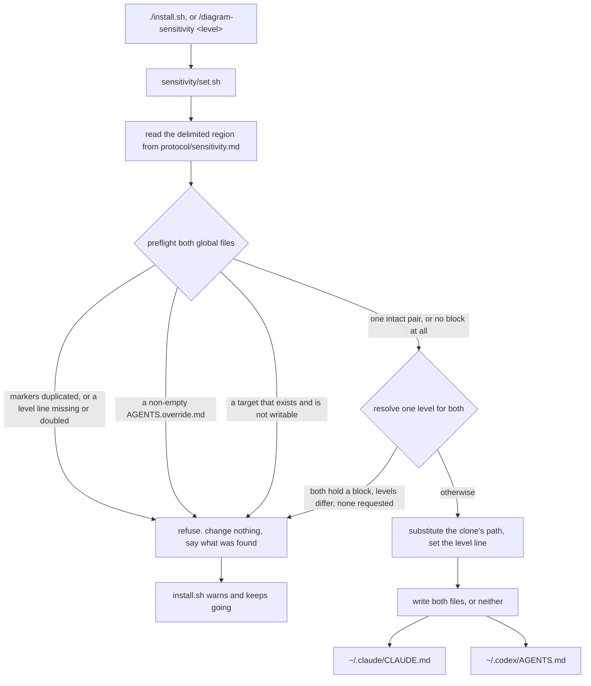
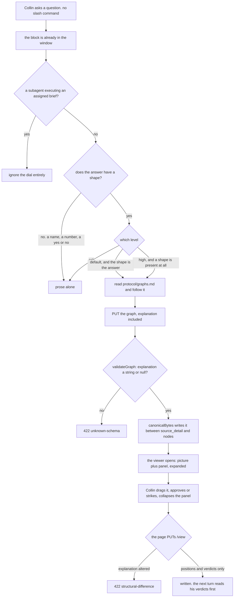

# Completion Report — Answer with a picture, not just paragraphs

Written for a hostile reviewer: every claim checkable, no claim without evidence.

Three parts landed. A **dial** — `ask` / `default` / `high` — living in a marked block that
one executable renders into both harnesses' always-on instruction files. A **trigger rule**
the dial selects between, saying when an answer earns a picture. An **`explanation` field**
in the graph format, rendered as a collapsible panel in the viewer.

Nothing in the Spec was cut. Prior Work was empty, so every row below is `this run`.

## What the change actually does

Two independent flows, so two diagrams.

**Moving the dial.** One writer, called by the installer and by the command alike,
resolving a single level across both files before touching either:



**An ordinary turn**, and where the panel comes from — the path this change exists for,
where no slash command runs and the rendered block is the only thing in context:



## Spec coverage

| Spec item | Origin | Implemented at (file:line) | Validated by |
|-----------|--------|----------------------------|--------------|
| **§1** The dial's rule and level live in one marked block rendered into `~/.claude/CLAUDE.md` and `~/.codex/AGENTS.md` | this run | `protocol/sensitivity.md:20-50` (the region), `sensitivity/set.sh:222-232` (the two writes) | `sensitivity/test/run.sh:55,62` — markerless prose seeded, missing target created; `./install.sh` landed 1748 identical bytes in each real file |
| **§1** The level rides inline as text, no lookup, no tool call | this run | `protocol/sensitivity.md:23` — `diagram-sensitivity: default` on its own line inside the region | `sensitivity/test/run.sh:189` — landed region holds exactly one parseable level line |
| **§1** Interactive homes only; a lane's `CODEX_HOME` slot is deliberately not written | this run | `sensitivity/set.sh:10-13` — targets are `$WHEELCHAIR_CLAUDE_HOME/CLAUDE.md` and `$WHEELCHAIR_CODEX_HOME/AGENTS.md`, defaulting to `~/.claude` and `~/.codex`; nothing writes a balancer slot | `ls ~/.bravo/codex-auth-balancer/accounts/1` holds no `AGENTS.md` (below) |
| **§1** Single source, two renderings; `set.sh` owns extraction and writing outright | this run | `sensitivity/set.sh:6,205-208` — the only reader of the region, applying `install.sh`'s `{{WHEELCHAIR_ROOT}}` substitution | `sensitivity/test/run.sh:188` — each landed region equals the substituted source apart from the level line |
| **§1** Fuller rules live outside the region for the command to read | this run | `protocol/sensitivity.md:52-133` — the level line's format, the writer's contract, the command, non-governance, worked examples | `sensitivity/test/run.sh:193` — the landed region names no document the agent cannot open |
| **§1** Fixed level-line format; zero or several such lines inside intact markers is malformed and refused | this run | `sensitivity/set.sh:9,63-70` | `sensitivity/test/run.sh:154-168` — both the no-line and two-line cases refuse, files byte-identical |
| **§1** Region contents, all nine items | this run | `protocol/sensitivity.md:21-49`: level names + line (21-23), repo ownership and use-the-command (25-28), trigger property (30-32), per-level behaviour with `ask`'s carve-out naming `planning.md` (34-42), the floor (31-32), `high`'s prose rule (40-42), the draw instruction (44-45), the `explanation` instruction covering all three elements (45-46), the subagent exclusion (48-49) | `sensitivity/test/run.sh:190-192` — six phrase probes, one per behaviour that would otherwise vanish silently |
| **§1** No item cross-references this plan or a Spec section | this run | `protocol/sensitivity.md:21-49` names only `protocol/planning.md` and `protocol/graphs.md`, both absolute after substitution | `sensitivity/test/run.sh:193` — fails closed on `PLAN.md` or `Spec` in the landed region |
| **§1** The writer is an executable, not prose | this run | `sensitivity/set.sh` (231 lines, `set -euo pipefail`), driven by `install.sh:48` and by `protocol/sensitivity.md:96-110` | `bash sensitivity/test/run.sh` — 43 assertions |
| **§1** One write path; may create a block where none exists | this run | `sensitivity/set.sh:39-92` classifies each target absent / valid / malformed; absent is written, not refused | `sensitivity/test/run.sh:55,62,86` |
| **§1** Level resolved once across both files, per the four-row table | this run | `sensitivity/set.sh:144-160` | `sensitivity/test/run.sh:86-108` — all four rows, including one-`high`-one-markerless ending both at `high`, and reinstall never moving the dial |
| **§1** Duplicated or malformed markers refuse, never repair | this run | `sensitivity/set.sh:47-72,81-93,130-136` | `sensitivity/test/run.sh:114,122` |
| **§1** A non-empty `AGENTS.override.md` refuses, naming it | this run | `sensitivity/set.sh:138-142` | `sensitivity/test/run.sh:142` |
| **§1** The write is all-or-nothing: preflight both, then write both or neither | this run | `sensitivity/set.sh:161-174` (writability + directory preflight), `176-232` (render, back up, write, restore if the second write fails) | `sensitivity/test/run.sh:128,135` — unwritable second target and malformed second target both leave the first untouched |
| **§1** A missing target is created holding just the block | this run | `sensitivity/set.sh:203-204` | `sensitivity/test/run.sh:62` |
| **§1** Content between the markers is overwritten; bytes outside are not | this run | `sensitivity/set.sh:191-205` — splice by line number around the marker pair, appending where there is none | `sensitivity/test/run.sh:74` — a hand-edited region is overwritten while a prepended line and an unterminated final line both survive |
| **§1** `install.sh` calls the writer last; a refusal warns without failing | this run | `install.sh:48-52` — the call is inside an `if`, so `set -euo pipefail` cannot abort on it | injected-refusal run below: exit 0, wrappers/npm/Chromium all completed |
| **§1** The always-on region carries no graph-writing procedure, only the instruction to read `graphs.md` | this run | `protocol/sensitivity.md:44-45` | `sensitivity/test/run.sh:190` probes `protocol/planning.md`; the region's only other pointer is `graphs.md` |
| **§1** Subagents and lanes excluded in both harnesses | this run | `protocol/sensitivity.md:48-49` — one sentence naming a worker lane, a reviewer, any delegated agent | `sensitivity/test/run.sh:190` — the `ignores this block` probe |
| **§1** `/diagram-sensitivity` sets with a level, reports bare, refuses an unrecognised one | this run | `protocol/sensitivity.md:96-110`; `sensitivity/set.sh:15-32` (argument handling), `95-118` (`--report`) | `sensitivity/test/run.sh:66-72,149,170,177`; live run below |
| **§1** Wrappers in both harnesses; `install.sh` needs no edit to register them | this run | `skills/diagram-sensitivity/SKILL.md`, `codex/prompts/diagram-sensitivity.md` | `./install.sh` printed `claude skill: /diagram-sensitivity` and `codex prompt: /diagram-sensitivity` with no glob change |
| **§2** The trigger is a stated property: three or more related things, a branch, or order matters | this run | `protocol/sensitivity.md:30-31` | `sensitivity/test/run.sh:190` — the `three or more things` probe |
| **§2** The three levels' behaviours, written out rather than cross-referenced | this run | `protocol/sensitivity.md:34-42` | `sensitivity/test/run.sh:190-191` |
| **§2** Planning is inside the dial with today's behaviour as the floor | this run | `protocol/planning.md:136-141`; region carve-out at `protocol/sensitivity.md:34-36` | `sensitivity/test/run.sh:190` — `protocol/planning.md` probe |
| **§2** The floor holds at every level, including `high` | this run | `protocol/sensitivity.md:31-32` — "No shape, no picture — at every level, including `high`" | same probe set |
| **§2** A planning turn may write its own graph for a non-flow question | this run | `protocol/planning.md:143-147` | prose; no suite (see Known gaps) |
| **§2** `protocol/diagrams.md` is not touched at all | this run | `git diff --stat protocol/diagrams.md` is empty | pasted below |
| **§2** One surface: the viewer, for every picture the dial triggers | this run | `protocol/sensitivity.md:44-45`; `protocol/graphs.md:3-11` names the unprompted turn as a third caller of the same procedure | prose; the panel's reach is covered by the browser suite |
| **§2** No inline fallback | this run | nothing in the region or in `graphs.md` offers one; `graphs.md:370-373` keeps the best-effort launch rule unchanged | `git diff protocol/graphs.md` — no fallback text added |
| **§3** `explanation`, a string or `null`, between `source_detail` and `nodes` | this run | `viewer/server.js:92` (`canonicalBytes`), `:120` (shape check), `:197` (default) | `viewer/test/server.test.js:140` — value read back **from disk**, and the exact top-level key order asserted |
| **§3** It carries no verdict; an agent rewrites it freely | this run | `protocol/graphs.md:111-115`; the field is absent from `entryWithoutPosition` and from every preservation check in `viewer/server.js` | `viewer/test/server.test.js` — the 26 pre-existing preservation and verdict tests all still pass unchanged |
| **§3** A non-string, non-null value is refused as `unknown-schema` | this run | `viewer/server.js:120` | `viewer/test/server.test.js:151` — a number and an object |
| **§3** `checkViewChanges` fail-closes the page against altering it | this run | `viewer/server.js:668` | `viewer/test/server.test.js:188` — `/view` PUT refused `structural-difference`, file byte-identical |
| **§3** `graphs.md` gains the field in schema, key order, and defaults, and the byte-identity rule covers it | this run | `protocol/graphs.md:54` (example), `:98-115` (field entry), `:185` (key order), `:202` (defaults), `:507` (refusal table) | prose; the key-order claim is asserted by `viewer/test/server.test.js:140` |
| **§3** `graphs.md` says **how** to write an explanation, not just that the field exists | this run | `protocol/graphs.md:98-109` (what it must contain, what it must not be) and `:350-353` (send it on every write, and why omitting it is the failure) | prose |
| **§3** Fixture churn, precisely scoped | this run | `explanation` added to `bulk-verdicts`, `canonical`, `child`, `cycle-layout`, `grandchild`, `interactive`, `parent`, `verdicts`; new `long-explanation.json`; `noncanonical.json` carries the same value as `canonical.json` in a non-canonical slot | `node --test` 29/29; `bad-json`, `bad-schema`, `dangling-edge`, `no-label` untouched (`git status` shows them unmodified) and still refused by `viewer/test/server.test.js:599` |
| **§4** Collapsible panel below the topbar, expanded when a graph opens | this run | `viewer/index.html:53-73` (CSS), `:560-595` (build and sync), `:506` (called on load) | `viewer/test/browser.spec.js:807` |
| **§4** Collapse state in the tab, never in the graph file | this run | `viewer/index.html:200` — a module-scope `let`, no storage, never sent | `viewer/test/browser.spec.js:1044` — survives a poll and a child-graph navigation, does not survive a reload |
| **§4** `explanation: null` → no panel at all | this run | `viewer/index.html:585-588` — the element is removed from the document, not hidden | `viewer/test/browser.spec.js:928` — asserts a count of 0 |
| **§4** A long explanation scrolls in a bounded height; canvas height does not change with content length | this run | `viewer/index.html:71-73` — `height: 84px; overflow-y: auto`, a fixed height rather than a `max-height` | `viewer/test/browser.spec.js:947` — identical canvas `height` attribute against `interactive.json`, plus `scrollHeight > clientHeight` |
| **§4** `resizeCanvas` learns the panel — the row that matters | this run | `viewer/index.html:1010-1026` | `viewer/test/browser.spec.js:871` — a node panned into the canvas's top strip is clicked and dragged, and the drag lands on disk. Mutation-tested: dropping the panel from that computation fails this test |
| **§4** `#fatal` still covers the canvas with the panel expanded | this run | `viewer/index.html:41` unchanged — the overlay starts at the topbar's bottom edge, so it spans the panel and the canvas | `viewer/test/browser.spec.js:1016` — a real filesystem fault, then the overlay's box measured against the viewport |
| **§4** `#error-banner` stays visible and legible | this run | `viewer/index.html:60` — the panel sits at `z-index: 4`, below the banner's 6, so a transient banner overlaps the panel and never the reverse | `viewer/test/browser.spec.js:984` — a real network abort, then a real click on the banner, which Playwright's hit-test would refuse if the panel covered it |
| **Docs** `AGENTS.md` (root): the install writes outside the tree, and that region is overwritten | this run | `AGENTS.md:57` | read below |
| **Docs** `AGENTS.md` (root): the organizing claim names the dial as its one exception | this run | `AGENTS.md:14-22` | read below |
| **Docs** `AGENTS.md` (root): Verification gains the new test line | this run | `AGENTS.md:93` | the line runs green, pasted below |
| **Docs** `README.md`: the take-effect-without-reinstalling claim corrected, the command added, the screenshot retaken | this run | `README.md:94-101`, `:113,116-120`, `docs/viewer.png` | screenshot inspected; `README.md:21` alt text matches what it shows |
| **Docs** `skills/AGENTS.md`: same claim corrected, wrapper table gains the row | this run | `skills/AGENTS.md:24`, `:47-51` | read below |
| **Docs** `protocol/AGENTS.md`: same claim corrected, file table gains `sensitivity.md` | this run | `protocol/AGENTS.md:33`, `:58-62` | read below |
| **Docs** `protocol/graphs.md`: the three `/graph`-scoped rules gain the unprompted path as a named actor | this run | `:3-11` (the opening claim), `:253-254` (slug derivation), `:409-415` (read-back) | prose |
| **Docs** `protocol/planning.md`: the flow trigger is the floor at every level; above `ask` the property test applies | this run | `protocol/planning.md:136-148` | prose |
| **Docs** `install.sh`'s header comment | this run | `install.sh:11-15` | read below |
| **Docs** A router for `sensitivity/`, and the root router's two directory tables | this run | `sensitivity/AGENTS.md`; `AGENTS.md:29` (Kind/Directory), `:47` (Where to go) | read below |

## Deviations from plan

**One addition, no subtractions.** The lead added two `--report` cases to
`sensitivity/test/run.sh:170,177` that the plan's Validation list did not name: the bare
command reporting a disagreement rather than picking a side, and naming an uninstalled dial.
Both are behaviours the Spec states at §1 ("bare, it reports the resolved level, and reports
a disagreement between the two files rather than picking one"), and the failure mode —
`--report` silently answering with one side's level while the harnesses disagree — is exactly
what the divergence guard exists against. Assertion count went 39 → 43.

Nothing else differs. `--draw` and the rolling graph path stayed cut (Decisions 51, 52), and
`protocol/diagrams.md` was not touched (Decision 54).

Two smaller choices the Spec left to the implementer, recorded because a reviewer will
notice them:

- **The layout inventory's two open rows.** `#fatal` was left at `inset: 48px 0 0 0`, so the
  overlay covers the panel as well as the canvas; `#explain-panel` was given `z-index: 4`,
  below `#error-banner`'s 6, so a transient banner overlaps the panel's text. The Spec
  required only that the fatal overlay still cover the canvas and that the banner stay
  visible and legible. Both are asserted in the browser suite rather than argued.
- **Which graph the screenshot shows.** The graph in the old `docs/viewer.png` was a
  question graph, disposable by design and long gone. The retake uses this plan's own
  `narration-ownership` graph, which carries approved, unruled and struck entries — so the
  README's surrounding paragraph about green, dashed-red and grey still describes what the
  image shows. That graph gained an `explanation` in the process, written through the server;
  so did `dial-mechanism`, which was the first candidate.

## Routers

Four routers changed, one created.

- **`AGENTS.md` (root)** — the deepest change in this whole diff, and not a detail. Its
  organizing claim was "Nothing a stage needs lives anywhere else — not in a wrapper, not in
  a context window," and the dial is precisely a stage input resident in every turn's context
  window. `:14-22` now states the exception, why it exists (a rule that must be in effect
  before Collin types cannot wait to be looked up), that the region is this repo's and
  overwritten, and that it stays a rendering rather than a copy. Also: the Kind/Directory
  table's Executable row gains `sensitivity/` (`:29`), the Where-to-go table gains a
  `sensitivity/` row (`:47`), `install.sh`'s role now says it writes a region of two files
  **outside this tree** (`:57`), and Verification gains `bash sensitivity/test/run.sh`
  (`:93`).
- **`sensitivity/AGENTS.md`** — created, following `spine/`'s precedent as an executable
  directory. Organizing idea: one level resolved across both files before either is written,
  so the harnesses cannot disagree. Boundaries name the three things that must never happen
  there — hand-editing inside the markers expecting it to survive, touching bytes outside
  them, and writing a fixture at the real global paths.
- **`skills/AGENTS.md`** — the wrapper table gains `diagram-sensitivity/` (`:24`), and its
  take-effect-without-reinstalling claim now carries the one exception (`:47-51`):
  `sensitivity.md`'s region is rendered, not pointed at, so editing it needs a re-run or a
  `/diagram-sensitivity` call.
- **`protocol/AGENTS.md`** — file table gains `sensitivity.md` (`:33`), and its Tests section
  now says what makes that one file different and which suite asserts what lands in the two
  global files (`:58-62`).
- **`spine/AGENTS.md`** — unchanged. Nothing moved between `spine/` and `sensitivity/`; they
  are siblings that share only a shape.

## Validation evidence

```
$ bash spine/test/run.sh
RESULT 80 passed, 0 failed

$ bash sensitivity/test/run.sh
RESULT 43 passed, 0 failed

$ ./install.sh && ./install.sh
first run: exit 0
second run: exit 0
both global files byte-identical after the second run

$ node --test 'viewer/test/*.test.js'
ℹ tests 29
ℹ pass 29
ℹ fail 0

$ npm --prefix viewer run test:browser
25 passed (25.8s)
```

**`protocol/diagrams.md` untouched, as Decision 54 requires:**

```
$ git diff --stat protocol/diagrams.md
(no output)
```

**A lane never receives the block** — the balancer slot `protocol/lanes.md` points
`CODEX_HOME` at holds no `AGENTS.md`, so the exclusion is structural on the Codex side and
prose-enforced on the Claude side:

```
$ ls ~/.bravo/codex-auth-balancer/accounts/1
auth.json
```

**Both global files received the same 1748 bytes, and nothing outside the markers moved.**
Diffed against copies taken before the first install:

```
/home/collin/.claude/CLAUDE.md outside-markers identical: True | appended bytes: 1748
/home/collin/.codex/AGENTS.md  outside-markers identical: True | appended bytes: 1748
```

**A writer refusal warns and does not abort the install.** A second marker pair was injected
into the live `~/.codex/AGENTS.md`, then removed:

```
$ ./install.sh; echo $?
0
claude skill: /diagram-sensitivity
claude skill: /graph
claude skill: /plan
codex prompt: /diagram-sensitivity
viewer deps: installed
viewer chromium: installed
set.sh: malformed diagram-sensitivity markers in /home/collin/.codex/AGENTS.md: 2 start marker(s), 2 end marker(s)
diagram sensitivity: warning — not installed
CLAUDE.md untouched by the refusal
```

**The command path, run live:**

```
$ ./sensitivity/set.sh --report
diagram-sensitivity: default
$ ./sensitivity/set.sh high
diagram-sensitivity: set high in /home/collin/.claude/CLAUDE.md and /home/collin/.codex/AGENTS.md
$ ./sensitivity/set.sh --report
diagram-sensitivity: high
$ ./sensitivity/set.sh nonsense; echo $?
set.sh: unsupported argument(s): nonsense (levels: ask, default, high)
2
$ ./sensitivity/set.sh default
diagram-sensitivity: set default in /home/collin/.claude/CLAUDE.md and /home/collin/.codex/AGENTS.md
```

The dial is left at `default`, which is what a fresh install seeds.

**Injected faults — each suite was made to fail before it was believed.** Four mutations,
each reverted:

| Mutation | Suite result |
|---|---|
| `set.sh` resolves the level per file instead of once across the pair | `FAIL one high block refreshes both at high` — 38 passed, 1 failed |
| `set.sh` drops the writability preflight, so the write is no longer all-or-nothing | `FAIL unwritable second target refuses` — 38 passed, 1 failed |
| `canonicalBytes` forgets `explanation` (the silent-drop failure §3 names) | `✖ canonical round-trip canonicalizes byte-for-byte`, `✖ explanation written through /graph is retained on disk` — 27 passed, 2 failed |
| `checkViewChanges` forgets `explanation` | `✖ /view cannot alter explanation` — 28 passed, 1 failed |
| `resizeCanvas` stops adding the panel's height (the buried-top-strip bug) | `✘ a node panned into the topmost strip of the canvas is clickable and draggable with the panel expanded` — 23 passed, 2 failed |

**The screenshot** at `docs/viewer.png` was retaken at 2880×1800 through real headless
Chromium against the running server, and inspected: the panel renders expanded above the
canvas, and the graph below it shows green approved, dashed-red struck and grey unruled
entries, which is what `README.md:21`'s alt text and the paragraph under it claim.

## Known gaps / residual risks

**The feature's central promise is unverifiable, and Stage 4 is told so explicitly.** Every
gate above passes against a block an agent ignores entirely. Nothing here asserts that an
ordinary question produces a picture, that `default` and `high` differ in practice, or that
the two harnesses behave alike — those are properties of a model reading prose, and this repo
has no test seam for prose. A verifier should treat this as a structural impossibility rather
than a failed claim, and should verify the **mechanism**: the block lands, survives reinstall,
is byte-identical across both harnesses, matches its source region after substitution, and is
non-vacuous. Beyond that the evidence is Collin using it. The documented manual check: set
each level, start a fresh session in each harness, ask a question with a shape, and see what
happens.

Carried from the plan's Accepted Risks, all unchanged by how this was built:

- A program now edits two files that are otherwise entirely Collin's own prose. The marker
  guard bounds the blast radius; it does not remove it.
- Moving the dial has no effect on a session already running; it applies from the next one.
- At `high`, a new question that earns a picture opens its own tab. Redraws of the same graph
  reuse theirs. Two attempts to engineer this away failed review, so `default` is the answer
  for someone who does not want it.
- At `high`, question graphs accumulate under `~/.cache/agent-graphs/` with no pruning rule.
- Planning graphs live in committed state that is re-read in full before every question, and
  a graph per shape-bearing question makes that grow. The bound is the number of shape-bearing
  questions a plan has.
- Once a graph has been bulk-approved, every later update must reset each altered entry and
  say so. Putting planning inside the dial makes that a recurring per-turn cost.

Three things a reviewer should know that are not risks in the plan:

- **Two rules in `§2` are prose with no suite behind them**, and cannot have one: which file a
  planning turn's graph lands in (`protocol/planning.md:143-147`), and that a picture always
  lands on the viewer rather than inline. Both are instructions to a model.
- **The working tree carries unrelated uncommitted work** in `viewer/index.html` and
  `viewer/test/browser.spec.js` — a hover tooltip and a detail-panel row for node labels the
  box truncates, plus `viewer/test/fixtures/long-label.json`. It predates this run, was left
  alone, and still passes (`viewer/test/browser.spec.js:594`). It is not part of this change
  and should not be read as part of it.
- **`sensitivity/test/run.sh`'s region probes are deliberately brittle.** Six phrase greps
  fail closed if a behaviour is dropped from the always-on block. That is the point: without
  them the whole suite goes green against a block that could not produce a picture. Rewording
  the region means updating the probes, and a probe that no longer matches is the suite doing
  its job.

## Remediation rounds

Appended by Stage 4 loops; never erase earlier content.

### Remediation 1 — 2026-08-25

Two blind verifiers ran, one per family, as `implemented-by: terra, sonnet` requires. The GPT
verifier returned `VERDICT: PASS`. The Claude verifier returned `VERDICT: FAIL` with one gap,
about the tests rather than the code — `REMEDIATION-1.md` carries it verbatim with the lead's
triage.

**Upheld and widened.** The always-on block's non-vacuity probes each asserted a short
substring chosen for being easy to grep, and a short substring survives any edit that keeps
the words around it. Four of the Spec's region-contents items could be deleted with the suite
still green: the `ask` carve-out's stated trigger, the ownership-and-never-hand-edit sentence,
the draw instruction, and two of the explanation instruction's three required elements. The
verifier reported two; the lead reproduced both and found two more.

The claim in this document's §1 coverage row — "six phrase probes, one per behaviour that
would otherwise vanish silently" — **was false when written**, for four of the six. It is left
above rather than edited, and corrected here.

**A closure review found a fifth, and that changed the fix.** The verifier re-verified its own
finding and reported that nothing asserted what `ask` itself does — the lowest level's whole
rule could be replaced with "use your judgement" while its carve-out stayed intact, suite
green. That is the level carrying `IDEA.md`'s "turning it down has to be a real off"
constraint.

Three rounds had now each found a different region-contents item nobody wrote a probe for, so
patching the newest one would have left a fourth round to find the next. **The probe table is
now keyed to the Spec's region-contents list by item number.** Auditing it is mechanical: walk
the Spec's nine items, check each has at least one row; an item with no row is the bug. That
audit caught the reported fifth instance and a sixth nobody had reported — item 1, the three
level names, also deletable with the suite green.

**What changed.** `sensitivity/test/run.sh:190-230` — nineteen probes replace six, each a
phrase carrying a behaviour rather than a landmark near one, numbered against the Spec's items,
and matched against the region with its line breaks flattened. Flattening fixes the sensitivity
in the other direction too: rewrapping a paragraph used to be able to fail a probe, which is
the wrong thing to be strict about, and it is why "what the picture shows" could not be probed
before — it spans a line break in the source.

Also `sensitivity/AGENTS.md`: its file table said `set.sh` "atomically updates" both files,
which claims more than the code gives — each file's own write is atomic, the pair is a
preflight then two renames. It now reads "both files together, or neither." Its Boundaries
section gains two lines, below.

Nothing else changed. `protocol/sensitivity.md`'s region is byte-identical to what Stage 3
shipped — the tests were not fitted to the text.

**A third round found the half the numbering does not give you.** The closure review walked the
nine items, confirmed every one had a row, and then found two rows that were numbered against
their item and still asserted less than it says: the floor's row pinned the slogan "No shape, no
picture" but not the "at every level" clause that makes it bind at `high`, and the prose rule's
row pinned "complete but terse" but not the "at `high`" that confines it. Both scopes were
deletable with the suite green.

So the audit ritual has two halves, and the comment above the table now states both:

> COVERAGE: walk the Spec's nine items, check each has a row; an item with no row is the bug.
> PRECISION: for each row, read its name and ask whether the phrase would still match with the
> named thing removed — if it would, the row asserts less than it claims.

**Evidence.** Ten deletions, each applied alone to `protocol/sensitivity.md`, then reverted and
confirmed byte-identical. Every one exits non-zero and names the item it broke:

| What the mutation deletes from the always-on block | Round 1 | Now |
|---|---|---|
| The floor's "at every level, including `high`" | — | `55/1` — *item 5, the floor, at every level* |
| The prose rule's scope, broadened to "prose everywhere" | — | `55/1` — *item 6, the high prose rule* |
| What `ask` draws, its carve-out left fully intact | `43/0` | `55/1` — *item 4, what ask draws* |
| The three level names | `43/0` | `55/1` — *item 1, the three level names* |
| The `ask` carve-out's trigger, the path to `planning.md` kept | `43/0` | `55/1` — *item 4, the ask carve-out's own trigger* |
| The `default` bullet, outright | `43/0` | `55/1` — *item 4, what default draws* |
| The ownership and never-hand-edit sentence, `/diagram-sensitivity` kept | `43/0` | `54/2` — *both item 2 rows* |
| The draw instruction — read `graphs.md` and follow it | `43/0` | `54/2` — *both item 7 rows* |
| The explanation instruction reduced to one of its three elements | `43/0` | `54/2` — *two item 8 rows* |
| The subagent exclusion | `43/0` | `55/1` — *item 9, the subagent exclusion* |

Two controls stay green, and they are what show the probes are strict rather than merely
brittle:

| Control — behaviour preserved | Result |
|---|---|
| Every paragraph and bullet rewrapped to five different widths | `56 passed, 0 failed` |
| Four behaviour-preserving rewords applied at once — the explanation instruction, the subagent sentence, the ownership clause, the `default` bullet | `56 passed, 0 failed` |

**A fourth round found an eighth instance, and it was the one worth stopping on.** With the
`{{WHEELCHAIR_ROOT}}` prefix deleted from the region's two paths, the block lands telling an
agent to read `protocol/graphs.md` — a path that resolves to nothing from whatever directory it
is standing in, which is the entire reason `install.sh` renders wrappers instead of symlinking
them. The existing landed-equals-source comparison is blind to it by construction: it runs the
same substitution over both sides. Round 7's finding Y3 records this region shipping exactly
that mistake once already.

Fixed with three assertions rather than three rows, because the property is about every path the
region will ever name: no backticked relative `` `protocol/ ``, no unsubstituted `{{`
placeholder, and the clone named by absolute path. Those also catch a failure no row could —
`set.sh` silently ceasing to substitute, which trips two of the three (the placeholder and the
absolute-path checks) plus the landed-equals-source comparison. Not all three: an unsubstituted
`` `{{WHEELCHAIR_ROOT}}/protocol/ `` is not a backticked *relative* path, so that probe stays
green. The closure review corrected an earlier overstatement here.

**Two routes past these assertions are documented rather than closed**, by the same plausibility
criterion used for the other survivors. A path written unbackticked as bare prose, or written as
`` `./protocol/planning.md` ``, both stay green — each needs someone to reach for a relative form
this region has never used, in a file whose every other path is absolute. The general property
*is* one assertion — every `protocol/` occurrence immediately preceded by the repo root — and it
is not taken because it fails the moment the region mentions `protocol/` in prose rather than as
a path, which is a false positive on an ordinary edit. Recorded so a later round does not
rediscover the option without the reason it was declined.

Two further survivors were reported and **deliberately not fixed**: stripping the level labels
off the three bullets, and deleting the verb from "Move the dial with". Neither is an edit a
person makes.

**This is the stopping point, and the last change is to what the guard claims.** Four rounds each
found one more slice of the same nine prose sentences, shrinking monotonically. A sentence has no
finite property set, so a fifth round would find something — but of this round's three survivors
only one was an edit anyone would make, and when the surviving mutations stop resembling real
edits the guard has reached its useful limit. The Spec bought this as the cheap half of an
accepted risk, never as a conformance test for the region, and four rounds of sharpening had let
it drift toward being read as one. `sensitivity/AGENTS.md` and the comment above the probe table
now say what it is: a **regression tripwire** keyed to the plan's nine items, catching a rule
quietly disappearing; the authority for what the region must contain is the plan, read by a
person editing it; a later round finding another slice adds a row and is the tripwire working,
not the method failing. That has a bounded end state. "Every property of nine prose sentences is
probed" does not.

**One more fix in the same pass.** A malformed source region used to surface as
`sed: can't read …` five cases later, because nothing checked the writer had accepted
`protocol/sensitivity.md` before cases started post-processing files it never produced. The
suite now gates on that up front. Breaking the end marker deliberately:

```
FATAL the writer refuses this repo's own protocol/sensitivity.md: set.sh: malformed
diagram-sensitivity markers in .../protocol/sensitivity.md: 1 start marker(s), 0 end marker(s)
```

Also `sensitivity/AGENTS.md:25` claimed the region "is forty lines"; it is 31 including markers.
Corrected — a number is the easiest kind of lie for a router to be left holding.

Full gate after the fix:

```
$ bash spine/test/run.sh
RESULT 80 passed, 0 failed

$ bash sensitivity/test/run.sh
RESULT 59 passed, 0 failed

$ ./install.sh && ./install.sh
install: idempotent, both global files byte-identical

$ node --test 'viewer/test/*.test.js'
ℹ pass 29
ℹ fail 0

$ npm --prefix viewer run test:browser
25 passed (25.5s)
```

**The block itself never moved.** Across all three rounds `protocol/sensitivity.md`'s region is
byte-identical to what Stage 3 shipped, verified by hashing it against the live landed block
with the `{{WHEELCHAIR_ROOT}}` substitution reversed — both `c6197fd2…`. The tests were fixed;
the text they test was not touched to make them pass.

**What these probes still cannot catch, now written where it will be met.** A substring proves
a rule is present, never that it has not been *qualified*: appending "unless the dial is at
`high`" to the subagent exclusion keeps every phrase and inverts the rule. Nothing grep-shaped
can see that. `sensitivity/AGENTS.md`'s Boundaries now says so, so a later round does not
mistake these probes for a semantic check.

**One scope call, stated rather than hidden.** The draw instruction was not in the Spec's
probe list, so leaving it unguarded breached nothing. It was fixed anyway: it is the one
sentence without which the dial fires and nothing is ever drawn, and the Spec's own reason for
having these probes is that without them "the whole suite goes green against a block that
could not produce a picture." Reasoning in `REMEDIATION-1.md`.

**Not remediated, recorded.** The GPT verifier's log shows five of this plan's seven graphs
under `docs/plans/diagram-sensitivity/graphs/` still lacking the `explanation` key, so they are
not in the canonical form `protocol/graphs.md` calls invariant. That is the Spec's explicit
choice, not a defect: Watch item 4 and Decision 14 settled that the field defaults on read and
an older file is upgraded the first time anything writes to it, with no migration script
anywhere. The two graphs this run wrote to were upgraded; the rest will be when they are next
touched, or discarded, since a graph is disposable.

The Claude verifier also raised six observations it explicitly marked as non-gaps. Two were
acted on in round 2 — the router's "atomically updates", fixed above, and the unexercised
rollback, which is now stated in `sensitivity/AGENTS.md`'s Boundaries rather than tested. On
testing it, the verifier's own argument was taken: reaching the second rename needs either a
race or an injection seam added solely for a test, and a seam that exists only for a test is
the decision-seam fake this repo's testing rule forbids. The preflight is what delivers
all-or-nothing, and the preflight is tested.

**One verifier claim was not accepted.** It reported that a directory at `~/.codex/AGENTS.md`
clears the preflight and still breaks the write, concluding the all-or-nothing property holds
"even where the rollback would have been the thing defending it." The outcome is right — exit
1, first file untouched, no temp litter — but `bash -x` shows it dying at `cat: Is a directory`
under `set -euo pipefail`, **before either rename**. It never reaches the rollback and so
demonstrates nothing about it.

The remaining four stand unacted: `protocol/sensitivity.md` restating the writer's resolution
table in prose where it can drift from the code, `IDEA.md`'s top-setting wording running ahead
of the complete-but-terse rule that actually landed, a fifth hardcoded `48px` in the viewer,
and file modes not surviving the render-and-rename. None breaches the Spec.
