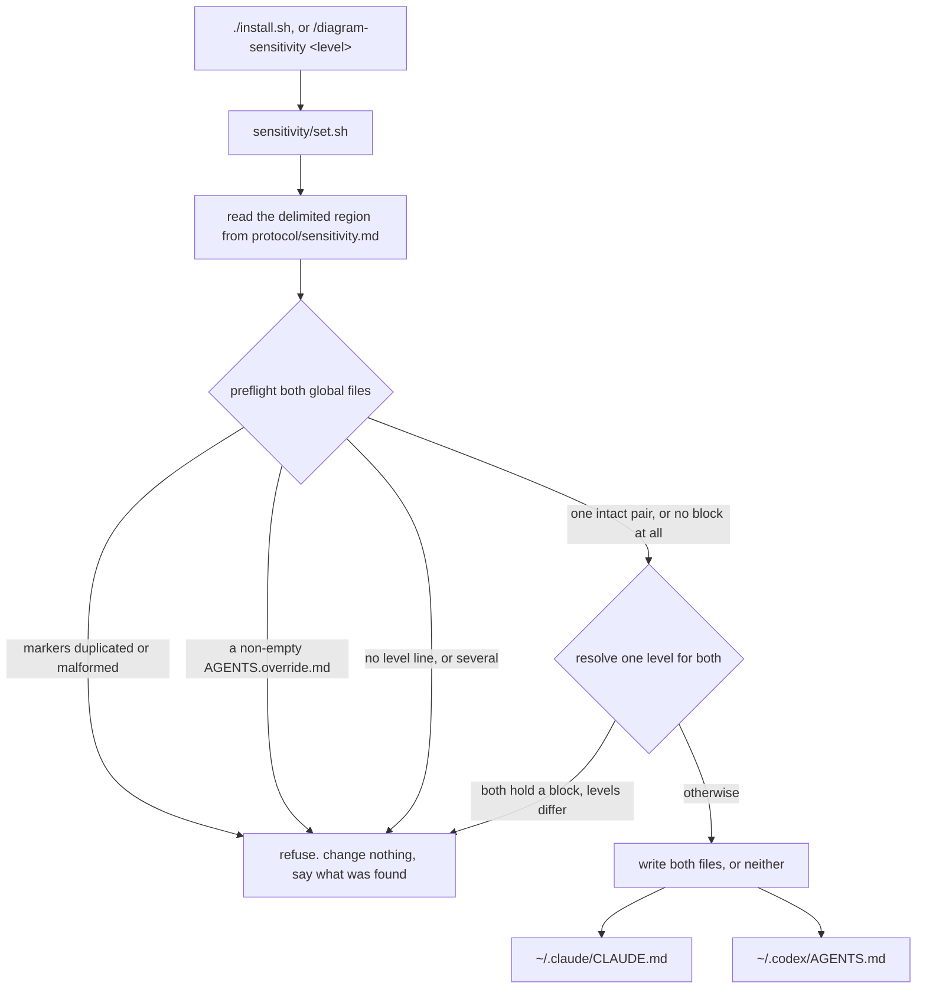
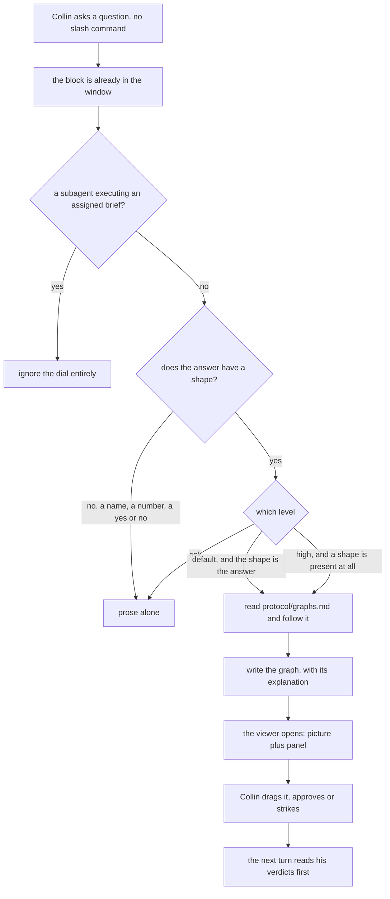

# Answer with a picture, not just paragraphs

**Idea:** `IDEA.md` — what this is for and why, in plain language. Read it first; it is
the north star this plan serves. Goal and Constraints live there, not here.

## Open Questions

None. All settled — see the Decision Log.

## Watch List

| # | Noticed | What needs looking into | Raised to user? | Outcome |
|---|---------|-------------------------|-----------------|---------|
| 1 | 2026-08-25 | At `high`, question graphs accumulate in `~/.cache/agent-graphs/` with no pruning rule anywhere in the format | yes | accepted risk — small JSON files under a cache root, which is the correct place for unbounded disposable state |
| 2 | 2026-08-25 | `README.md` advertises the viewer with a screenshot at `docs/viewer.png`. The explanation panel changes what that screenshot shows | yes | settled — Decision 20: the README and the screenshot are refreshed as part of this change |
| 3 | 2026-08-25 | This repo now owns a region of two files outside itself (Q1 settled on option A). Today's dead `personal_agent_workflows` path in both, fixed this session, is what unowned looks like. A router has to say who owns that region and what must never happen to it | yes | settled — Decision 11: the root router states the ownership |
| 4 | 2026-08-25 | Adding a top-level key changes the canonical bytes of every existing graph file | yes | folded into the Spec by Decision 14: the field defaults on read, so an older file is upgraded the first time it is written and never needs migrating |
| 5 | 2026-08-25 | Whether Codex's `AGENTS.md` supports an `@path`-style import the way Claude Code's `CLAUDE.md` does. Decision-relevant for Q7 option B; unverified, and I will not assert either way without checking | yes | waved off — Decision 10: moot once the rendered-file option closed |
| 6 | 2026-08-25 | A writer that edits a hand-maintained file needs to behave when the file is absent, unreadable, or already holds a malformed copy of its own markers | yes | settled — Decision 9: one intact marker pair or it stops and changes nothing |
| 7 | 2026-08-25 | Whatever shape the panel takes, `48px` is hardcoded in two CSS rules (`viewer/index.html:41`, `:57`) while `resizeCanvas` measures the topbar for real (`:919-929`). The file already carries two scar comments about exactly this class of bug — an `<svg>` collapsing to its 150px intrinsic height, and a `hidden` element with an author `display` rule swallowing every click. Both rendered perfectly and both needed a real browser to catch | yes | settled — Decisions 15 and 16: the panel is collapsible, and the browser suite gates the canvas staying usable in both states |

## Decision Log

| # | Decision | Rationale | Source |
|---|----------|-----------|--------|
| 1 | The dial governs conversation turns and the viewer. Diagrams inside documents keep the rules they have | `PLAN.md` gets rewritten for every upheld review finding, so a diagram drawn per planning turn is stale before anyone reads it — the rule in `protocol/diagrams.md` exists for exactly that. Graphs are disposable by design and take per-turn churn without breaking anything | user |
| 2 | Three levels, named `ask`, `default`, `high` | Collin's own words for them | user |
| 3 | One dial, set globally, not per-repo | He described one command and one setting. Per-repo doubles the surface for a preference that is about him, not about a codebase. Reopenable if a repo ever genuinely wants a different level | defaulted |
| 4 | Bare `/diagram-sensitivity` reports the current level; with an argument it sets it | Reading a setting must not require guessing at where it is stored — that is the failure this whole plan exists against | defaulted |
| 5 | Both viewer suites cover narration: `node --test` for validation and canonical form, real Chromium for rendering and for the canvas still sizing correctly under a taller topbar | How this repo already verifies the viewer (`viewer/test/browser.spec.js:1-7` — real pointer events, never jsdom). A narration panel changes layout, and layout is exactly what a DOM test passes blind on | defaulted |
| 6 | The dial's rule and its current level live in a marked block rendered into both harnesses' always-on files, `~/.claude/CLAUDE.md` and `~/.codex/AGENTS.md`. A state file plus a standing pointer, and a Claude-only hook, are both struck | Only the rendered block costs nothing per turn and is identical in both harnesses. A per-turn read cannot be enforced, and a skipped read is indistinguishable from a genuinely low setting — the exact failure this plan exists against; a hook has no Codex equivalent. Collin approved every node on that path and struck the other two branches entirely | user |
| 7 | Moving the dial does not affect a session already running. Accepted, not mitigated | Collin approved the node naming that cost rather than striking it | user |
| 8 | The struck `constraint` node is read as incidental to the option-C branch it hung from. `IDEA.md`'s both-harnesses constraint stands | Nothing else in the plan depended on that node, and the constraint's record is `IDEA.md`, not a picture of it. Flagged to Collin in the same turn for correction | user |
| 9 | `install.sh` inserts or refreshes the block in place, inside markers, in both global files; the dial command rewrites only the level between those same markers. Before writing a byte, the writer requires exactly one intact pair of markers — anything else and it stops, changes nothing, and reports what it found | The least-invasive alternative depends on Codex being able to import a file by path, which is unverified; finding out it cannot would leave the invasive mechanism on the Claude side anyway plus a manual step on the Codex side. Deferring the write to first use would make the level named `default` not the one you get by default. Collin approved the guard and the stop-path explicitly | user |
| 10 | Whether Codex's `AGENTS.md` supports importing a file by path is no longer decision-relevant and stays unverified | It only mattered to the rendered-file option, which is now closed. Recorded rather than checked, so a later reader does not mistake silence for a finding | defaulted |
| 11 | The root router records that this repo owns a marked region of two files outside its own tree, and what must never happen to them | `AGENTS.md` currently says `install.sh` writes to `~/.claude/skills/` and `~/.codex/prompts/`. After this change that is false, and a router that lies is the failure this repo names first | defaulted |
| 12 | A picture is earned by a stated property of the answer: it names three or more things that relate to each other, or it has a branch, or the order matters. `default` draws when that shape is easier to see than to read; `high` drops the bar to any shape at all. Two or three worked examples sit underneath the property, not instead of it | A length threshold earns a picture for a long answer with no shape in it, and boxes then get invented to fill it — worse than no dial, because it teaches Collin to ignore the next picture. Leaving it to judgment collapses `default` and `high` into the same setting with two names | user |
| 13 | A planning turn draws whenever its question is about a shape, at `default` and above, and never when it is not, at any level | Follows from Decision 12 plus the confirmed non-goal that a question with no shape gets no picture at any setting. Nothing genuinely open was left to ask about | defaulted |
| 14 | The explanation is a new top-level field in the graph file. It is agent-owned and carries no verdict: an agent rewrites it freely on every redraw, the way it already redraws an unruled box | A separate file splits one picture across two artifacts, the second of which can go missing; the existing title is one line and already labels every breadcrumb step. Giving the words a verdict would stop an agent correcting its own account when the picture moves underneath it — the one failure that matters here. Verdicts stay on the boxes and arrows, which are the things making claims about the code | user |
| 15 | The explanation renders in a collapsible panel below the topbar, expanded when a graph opens. Whether it is collapsed lives in the tab and is never written to the graph file | Expanded-on-open means the words get read once; collapsible means a graph being actively rearranged can have every pixel back. An always-visible strip taxes every graph including one-sentence ones, and a canvas overlay sits on top of the boxes Collin is dragging. Collapse is a viewing preference, and the file holds only his positions and the agent's claims | user |
| 16 | The browser suite must assert the canvas stays fully usable with the panel present, at both collapsed and expanded states | `48px` is hardcoded in two CSS rules while `resizeCanvas` measures the topbar for real, and the file already carries two scar comments about this exact class of bug — an `<svg>` collapsing to its 150px intrinsic height, and a `hidden` element whose author `display` rule swallowed every click. Both rendered perfectly and both needed a real browser | defaulted |
| 17 | At `high` the prose stays complete but terse: the whole answer still survives in the words alone, said shorter. The picture is always redundant with them | This is the rule already governing documents here — a reader with no renderer gets the whole picture without the diagram — applied one surface over, for the same reason. A turn gets pasted, quoted, and re-read where no viewer runs, and the graph is disposable while the turn is not. Too talky at `high` is reversible by tightening the prose style; a hole in a transcript is not | user |
| 18 | A new `protocol/sensitivity.md` owns the dial. It contains one delimited region that `install.sh` extracts verbatim and renders into both global files; the full rules live in the same file outside that region | The repo's rule is that a wrapper carries no content, because two hand-maintained copies drift. The block must carry content — a pointer would need a read, and no read happens on an ordinary turn. Rendering from one source satisfies both: neither copy is hand-maintained, so there is nothing to drift, and the always-on cost is bounded to what sits inside the region | defaulted |
| 19 | The block is written by a tested executable, `sensitivity/set.sh`, called by both `install.sh` and the `/diagram-sensitivity` command. No agent edits either global file directly | The risk this whole area carries is a program editing Collin's own prose. A guard written as prose in a protocol file is a guard an agent can skip; the same guard as shell with fixtures is one that gets tested. `spine/scan.sh` is the precedent for an executable that a command drives rather than reads | defaulted |
| 20 | `README.md` and `docs/viewer.png` are refreshed as part of this change | The README advertises the viewer with a screenshot, and the explanation panel changes what the viewer looks like. A README that shows the old page is the documentation-goes-stale failure this repo names before opening a PR | defaulted |
| 21 | The field is named `explanation`, holds a string or `null`, and sits between `source_detail` and `nodes` in canonical key order | It is header material about the whole graph, like `title` and `source`, so it belongs with them rather than after the content. `null` rather than an empty string, matching every other optional field in the format | defaulted |
| 22 | `IDEA.md`'s top-setting bullet is corrected to match Decision 17: the prose tightens but still carries the whole answer | Decision 17 was Collin's ruling in Stage 1, and I failed to carry it back into the idea, leaving the confirmed north star contradicting the Spec it governs. The Spec was right; the idea was stale | idea-change |
| 23 | The writer has two modes. **Install** may create a block in a file that has none, and seeds the level only when no block exists — an existing level is preserved. **Set** requires exactly one intact pair and only rewrites the level. Both refuse on duplicated or malformed markers, and refuse without touching anything | Split so first install could create a block while a later set could not silently invent one | review-round-1 |
| 24 | The two-file write is all-or-nothing: preflight both targets, then write both or neither | A partial write leaves the harnesses reporting different levels, which is the broken dial `IDEA.md`'s constraint names | review-round-1 |
| 25 | `install.sh` calls the writer last, and a refusal warns without failing the install | `set -euo pipefail` would otherwise abort mid-run, half-rendering wrappers and skipping npm and Chromium, and would break the repo's own idempotence check for an unrelated reason. The other six commands do not depend on the block | review-round-1 |
| 26 | `ask` preserves `protocol/planning.md`'s existing flow-drawing trigger unchanged | That trigger fires today with nobody asking, so folding it under the dial would make `ask` *remove* a picture that exists today — the opposite of "today's behaviour, exactly." The dial governs unprompted drawing; a plan turn proposing a flow is already an explicit part of Stage 1 | review-round-1 |
| 27 | The `default`/`high` separator is structural, not felt: `default` draws when the shape **is** the answer, `high` draws whenever a shape is present at all | "Easier to see than to read" is the feeling Decision 12 rejected, and leaving it as the only separator collapsed the two levels into one | review-round-1 |
| 28 | `protocol/diagrams.md`'s out-of-documents sentence is amended to defer to `sensitivity.md` for conversation turns | It already governs in-turn pictures, so leaving both would be two gates over one behaviour with neither authoritative — the boundary `protocol/AGENTS.md` names, and which its own review caught twice. Diagrams *inside* documents are untouched, as Decision 1 settled | review-round-1 |
| 29 | A planning turn updates the existing graph for a flow rather than writing a new file per question. A new file only for a genuinely new flow | `docs/plans/<slug>/graphs/` is committed state that planning re-reads in full before every question and whose every rejection the exit gate must answer in prose. A file per question makes all three costs grow without bound | review-round-1 |
| 30 | The Spec cites viewer code by function and selector name, never by line number | Two citations drifted during this plan because someone edited `viewer/index.html` mid-planning. This repo already requires refs to carry no line number, for exactly this reason | review-round-1 |
| 31 | `checkViewChanges` learns `explanation`, and a test asserts a page write cannot alter it | It fail-closes on every other top-level field; the explanation surviving a node drag was luck, not design | review-round-1 |
| 32 | The block targets the interactive Codex home. A workflow lane running with `CODEX_HOME` at the balancer slot deliberately does not receive it, and the Spec says so | Verified: the slot holds no `AGENTS.md`. An interactive `codex` run sets no override and reads `~/.codex/AGENTS.md`. A lane is a bounded subagent executing a brief and should not be drawing pictures at anyone | review-round-1 |
| 33 | Decision 15's rationale is corrected: the viewer does already render entry detail as a canvas overlay. The decision stands because that overlay is selection-scoped and transient, and the explanation must be readable with nothing selected | The original reason was factually wrong about shipped behaviour, and a later round would have re-read it and re-raised | review-round-1 |
| 34 | A picture lands on the surface that matches whether there is something to rule on. **The viewer** — a graph file, a tab, positions that persist — when the picture carries a proposal Collin might strike part of: a flow being designed, a plan turn, anything he asked for with `/graph`. **An arrow chain inline in the reply** otherwise: an explanation of how something already works, read once. No file, no tab, no verdict | This is what the two surfaces are for. A graph exists to hold positions so it can be rearranged and ruled on, which earns a file and a browser tab only when a verdict means something. Four boxes answering "how does X reach Y" needs neither, and at `high` a tab per shaped question would make the feature actively unpleasant | user |
| 35 | Planning turns are **inside** the dial at `default` and above; `ask` preserves `protocol/planning.md`'s existing flow trigger as a floor, not as the whole rule | Round 1's fix for `ask` removed planning from the dial at every level, which contradicted four other parts of the Spec and left a shape-bearing planning question that is not a proposed flow drawing nothing at any level — in the case `IDEA.md` calls the most valuable. The floor framing satisfies both: `ask` never draws less than today, and the higher levels apply the property test everywhere | review-round-2 |
| 36 | The writer is **one path**, not two modes. It may create a block where none exists, seeds `default` only when no level is requested and none is already set, and otherwise writes the requested level | Two modes were my Round 1 fix for the markerless contradiction; one path under the same marker and all-or-nothing guards fixes it equally, with one fewer refusal path and no case where a user must run the installer and lose the level they wanted | review-round-2 |
| 37 | The level is resolved **once, across both files**, before either is written. Neither has a block → the requested level, or `default`. One has a block → its level, unless one was requested. Both agree → that level. **Both hold blocks at different levels → refuse**, report both, and require an explicit level | Judging "no block exists" per-file made the divergent-dial state reachable through the very rule meant to prevent it. Refusing on genuine ambiguity is the same principle as the marker guard: never guess at a state a person can see and resolve | review-round-2 |
| 38 | The writer refuses if a non-empty `AGENTS.override.md` sits in the Codex home, naming it | Verified in the `codex` 0.149.0 binary: `AGENTS.override.md` and `AGENTS.md` both appear with a documented precedence order favouring the override. Whether that precedence applies at the global home as well as per-project I could not establish, so the fix deliberately does not depend on the answer — refusing loudly beats writing a file that may never be read | review-round-2 |
| 39 | The negative fixtures stay invalid and `noncanonical.json` stays noncanonical. Only the fixtures whose canonical form is asserted gain the field | "Every fixture becomes canonical" would have deleted the suite's ability to test refusals at all, and would have broken the canonicalization test by making its input already canonical | review-round-2 |
| 40 | `canonicalBytes` is named alongside `validateGraph` as a place the field must be taught | It builds the canonical top-level key order as a literal, so teaching only the validator drops the field silently on write | review-round-2 |
| 41 | **Supersedes Decision 34.** An explanation of how something already works opens a graph in the viewer, the same as a proposal. The surface split is dissolved: whenever an answer earns a picture, the picture is a graph | The split meant the explanation panel could only ever appear on `/graph` and plan graphs — the surfaces the viewer already served — so the second half of the idea served nothing the dial newly triggered. Restoring the viewer for explanations also makes `IDEA.md`'s first promise ("a picture **opens**, unprompted") literally true again, so no idea amendment is needed | user |
| 42 | "If one is available" is read as two conditions, both already in the Spec: a graph is drawn when the answer earns one under the property test and clears the floor, **and** the viewer can actually open. On a headless box or over ssh — `WHEELCHAIR_NO_BROWSER=1`, or no handler — the graph is still written and its URL still printed, and the turn additionally carries an inline arrow chain so the answer is not lost to an unopenable tab | Stated as an interpretation rather than asked, because both readings of the phrase land in the same place and neither changes what gets built. Correct it if the intent was narrower — specifically, if it meant "reopen a graph that already exists rather than drawing a fresh one" | defaulted |
| 43 | Question graphs keep their per-question slug. At `high` that means a distinct file, and a distinct browser tab, per question | The alternative — one rolling path per repo, reused so the tab is reused — collides with the format's preservation contract: a rolling graph that Collin had approved anything on would refuse the next question's write. Verdicts are load-bearing and a tab is not. Redraws of the *same* graph already reuse an open tab, so the cost lands only on genuinely new questions, and `default` is the level for someone who does not want it | defaulted |
| 44 | **Supersedes Decision 43.** `viewer/server.js` gains a `--draw --question` single-shot mode: graph JSON on stdin, and it owns path resolution, registration, the `PUT` with the right hash, the tab, and printing the URL. The always-on region names that one command instead of carrying a procedure | The reversal put every unprompted picture on the graph-writing path, and an ordinary turn reads only the region. Inlining `protocol/graphs.md`'s procedure blows the context budget the region exists to protect; pointing at the file is the unenforceable per-turn read Q1 rejected. One command is the only option that costs neither | review-round-3 |
| 45 | An unprompted graph goes to one rolling path per repo, overwritten while nothing in it is ruled on, forking to a question-derived slug the moment it holds a verdict | `protocol/graphs.md` already licenses overwriting an unruled question graph, so the tab is reused in the common case — an explanation nobody rules on — without ever putting a verdict at risk. Decision 43 had treated this as binary and accepted a tab per question; that was the wrong read, and the accepted risk is withdrawn rather than carried | review-round-3 |
| 46 | **Supersedes Decision 29.** A shape-bearing planning question writes its own graph; a turn discussing a flow refreshes that flow's graph | Restricting new files to "a genuinely new flow" left the case planning was brought into the dial for with nowhere to go, and was falsified by this plan's own directory — seven graphs for roughly nine questions, five of them per-question decision graphs. The restriction would have forbidden the practice that produced this Spec | review-round-3 |
| 47 | The inline arrow-chain fallback is deleted | Its trigger is unobservable — the browser launch is detached, its error handler empty, its result ignored — and it was unnecessary anyway, because the prose carries the whole answer at every level, so a tab that never opens loses nothing | review-round-3 |
| 48 | `sensitivity/set.sh` owns region extraction and writing outright; `install.sh` and the command only call it. The level line is exactly `diagram-sensitivity: <ask\|default\|high>`, and a region with zero or several such lines is malformed and refused | Extraction had been assigned to two components in one section, and three separate consumers had to parse a syntax nothing fixed | review-round-3 |
| 49 | `resizeCanvas` must learn the panel, and the browser assertion is specific: a node at the very top of the canvas is clickable and draggable with the panel expanded | It measures `#topbar` alone, so a sibling panel below it leaves the canvas starting at the topbar's edge with its top strip buried — and a generic "canvas is usable" assertion passes in exactly that state | review-round-3 |
| 50 | Verification checks the landed region against the source region through the same substitution, *and* against the other harness's region, *and* that it is non-empty with one parseable level line and the trigger rule present | Region-against-region alone passes for two identically stale blocks, and an Accepted Risk was already claiming the source check existed. Non-vacuity is the one property of the block that is cheaply checkable, unlike the behaviour it produces | review-round-3 |
| 51 | **Supersedes Decisions 44 and 45.** No `--draw` mode and no rolling path. The always-on region carries one instruction — when an answer earns a picture, read `<root>/protocol/graphs.md` and follow it — which is verbatim what both `/graph` wrappers already say | Four independent defects, any one fatal. It could not work as shown: the first call in a session *is* the server and never returns, which `protocol/graphs.md` states outright. It did not close the gap it was bought for — the region still had to specify a payload the validator accepts. It needed repo-key and slug machinery that does not exist in `server.js`. And it created a second producer path for the same artifact. Underneath all four, the argument that bought it was a category error: Q1 rejected a per-turn read of *the level*, where a skipped read hides the dial's state; a read of the procedure *after* the trigger fires hides nothing, because skipping it just means no picture — the failure this plan already accepts as unverifiable | review-round-4 |
| 52 | **Supersedes Decision 45's withdrawal.** A tab per new question at `high` is accepted again | The rolling path deferred the cost rather than removing it: the moment Collin approves anything in the rolling file it holds a verdict permanently, and every question forks from then on. Two attempts to engineer this away both failed review, so it is accepted, and `default` is the level for someone who does not want it | review-round-4 |
| 53 | **Supersedes Decision 42.** No inline arrow chain, in any circumstance. Decision 47 deleted the fallback and 42 was left standing | The Decision Log is append-only and a reversal is a new entry, so an unsuperseded 42 told a worker both to emit and not to emit the chain | review-round-4 |
| 54 | **Supersedes Decision 28.** `protocol/diagrams.md`'s out-of-documents sentence is left alone after all | That amendment existed because the dial could produce a picture in the body of a reply. It no longer can, so there is no second gate to resolve and no reason to touch the file — one fewer protocol document amended | review-round-4 |
| 55 | The region states that a subagent executing an assigned brief ignores the dial entirely, in both harnesses | A Codex lane never sees the block, because `protocol/lanes.md` points `CODEX_HOME` at the balancer slot. But `~/.claude/CLAUDE.md` **is** loaded into Claude subagent contexts, so without this an implementation lane would open tabs mid-build — asymmetric behaviour across the harnesses, which is the broken dial the idea's constraint names. An earlier draft reasoned about the Codex side only | review-round-4 |
| 56 | `IDEA.md`'s fourth non-goal drops its reference to diagrams in the body of a turn | The dial no longer produces one, so leaving it named as a reused surface would have a worker looking for a rule that no longer exists | idea-change |
| 57 | **Supersedes the writer half of Decision 9, and Decision 23.** One write path, not two modes — Decision 36 already states it; these entries were left standing and told a worker the opposite | The log is append-only and a reversal is a new entry, so an unmarked reversal is a live contradiction. Decision 9's guard and all-or-nothing content stands; only its two-mode framing is superseded | review-round-5 |
| 58 | **Supersedes the `default` threshold in Decision 12.** `default` draws when the shape **is** the answer, per Decision 27, not when it is "easier to see than to read" | Decision 12's property test — three or more related things, a branch, or an order that matters — stands and is the trigger. Only its `default` threshold was replaced, and leaving both live restored the felt-versus-structural ambiguity Decision 27 exists to remove | review-round-5 |
| 59 | The always-on region's contents are enumerated in §1 as a closed list, and the `high` prose-tightening rule is inside it | An ordinary turn reads only the region, so a rule outside it does not exist on the path this feature is for. "Keep it short" invited moving rules out, and the prose rule is the one most easily lost — it reads like a writing rule rather than a drawing rule, and losing it ships a top setting that draws more without tightening anything | review-round-5 |
| 60 | Round 6 runs as a narrow confirmation round rather than another design pass: did Round 5's ten fixes land, and is the always-on region's contents list complete? | Collin's call at the review cap. Round 5 drew zero blocking findings from two independent lanes, so the design is not what needs another look — the recurring defect is a fix recorded as done that did not apply, and that is exactly what a verification round catches | user |
| 61 | **Supersedes Decision 9's marker guard and Decision 18's extraction assignment, and corrects Decision 57.** The guard is: duplicated or malformed markers refuse; **absent** markers are not a refusal, because the single path may create a block where none exists. Extraction belongs to `sensitivity/set.sh` alone; `install.sh` calls it and does not read `protocol/sensitivity.md` | Decision 57 set out to clear a contradiction and preserved the wrong half of it — it said Decision 9's guard "stands", but that guard demanded exactly one intact marker pair *before writing a byte*, which forbids the markerless creation Decision 36 requires and both live global files need. A supersede entry has to name the clause it replaces, not the decision it partly likes. Note the Spec itself was already correct on both points; it was the log that contradicted it, which is why five rounds of reviewers reading the Spec did not trip over it | review-round-6 |
| 62 | The region instructs the agent to write the `explanation`, and `protocol/graphs.md` is amended to say how one is written rather than only that the field exists | A graph with no explanation renders no panel, and everything else this change adds about the field is mechanical — schema, key order, defaults. Without this the panel appears on nothing the dial newly triggers, which is the failure the Q9 reversal was supposed to end. It came back through a different door: not the surface, but the authoring instruction | review-round-6 |
| 63 | No item in the region may cross-reference this plan or a Spec section. Each states its rule outright or names a file the agent can open | The region is rendered into two files and read with nothing else in context, so "per the table in §2" is a dangling pointer the moment it lands. Both of Round 6's completeness findings were this one mistake, which is why it is a rule rather than two corrections | review-round-6 |
| 64 | The region states that the block is repo-owned and that the level is moved with `/diagram-sensitivity`, never by hand-editing those lines | The guard existed only in `protocol/sensitivity.md` and the routers, none of which an ordinary turn reads — and the turn where an agent is most tempted to hand-edit is precisely the one with no guard loaded: asked to turn the dial down, it has the level line in its window and nothing telling it not to. Editing one file leaves the other harness behind silently. Demonstrated, not hypothetical: this plan's own Log records both global files being hand-edited during Stage 1 | review-round-7 |
| 65 | The `ask` carve-out states its trigger inline — a planning turn discussing a proposed flow — and names `protocol/planning.md` by absolute path | An agent holding only the region knew an exception existed but not what fired it, and a bare relative path resolves to nothing from an arbitrary working directory. `install.sh` states the repo's own reason for absolute paths in wrappers; the region has the same constraint | review-round-7 |
| 66 | The `explanation` instruction covers what the picture shows, what to look at, **and what it leaves out** | `IDEA.md`'s observable names all three. The instruction carried two, so the third would never have been written | review-round-7 |

## Spec

Three parts, one change. A fresh agent should be able to build this from this section alone.

1. **A dial** — `ask` / `default` / `high` — living in a marked block rendered into both
   harnesses' always-on instruction files, moved by a `/diagram-sensitivity` command.
2. **A trigger rule** the dial selects between, saying when an answer earns a picture.
3. **An explanation field** in the graph format, rendered as a collapsible panel in the viewer.

### The two flows

Two independent flows, so two pictures — `protocol/diagrams.md` allows one each. Both are redundant
with the prose below them; neither is the only place anything is written.

**Moving the dial.** One writer, called by the installer and by the command alike, resolving a
single level across both files before touching either:



**An ordinary turn** — the path this whole change exists for, where no slash command runs and the
rendered block is the only thing in context:



`ask` reaches prose here because nothing is drawn *unprompted* at that level — a planning turn
discussing a proposed flow still draws, exactly as it does today, which is the carve-out that makes
`ask` today's behaviour rather than something quieter.

### 1. Where the dial lives, and how it gets there

The dial's rule and its current level live in **one marked block, rendered into
`~/.claude/CLAUDE.md` and `~/.codex/AGENTS.md`.** Both are loaded on every turn in every
project, which is what lets the dial act on an ordinary question — the path where no slash
command runs and nothing under `protocol/` is otherwise read at all.

The level rides **inline in the block, as text**. An agent performs no lookup and spends no
tool call: by the time the question arrives, the level is already in the window.

**These are the interactive homes, and that is deliberate.** An interactive `codex` run sets no
`CODEX_HOME`, so it reads `~/.codex/AGENTS.md`. A workflow lane spawned per `protocol/lanes.md`
runs with `CODEX_HOME` pointed at the balancer's slot directory, which holds no `AGENTS.md` —
verified — so a lane does not receive the block. That is correct, not an oversight: a lane is a
bounded subagent executing an assigned brief, and it has no business drawing pictures at
anyone. Do not "fix" this by also writing the slot.

**Single source, two renderings.** A new `protocol/sensitivity.md` owns the dial. It holds one
delimited region. **`sensitivity/set.sh` owns extraction and writing outright** — it reads the
region, applies `install.sh`'s `{{WHEELCHAIR_ROOT}}` substitution, and writes both global files.
`install.sh` only calls it; the command only calls it. One component reads
`protocol/sensitivity.md`, so there is no question of who does. The fuller rules live in the same
file outside the region, for the `/diagram-sensitivity` command to read when it runs. **Not
`/graph`** — that command is the explicit ask the dial does not govern, its wrappers point at
`protocol/graphs.md`, and `skills/AGENTS.md` requires a wrapper to name exactly one protocol file.

**The level line has a fixed format**, because three things parse it — a refresh that must preserve
an existing level, the bare command that reports and compares, and the validation that strips it
before comparing regions. One line inside the region, exactly:
`diagram-sensitivity: <ask|default|high>`. A region whose markers are intact but which contains
zero or more than one such line is **malformed** and refused on the same footing as a broken
marker: never repaired, never defaulted over.
This keeps the repo's rule that a wrapper carries no content — the block carries content, but
neither copy is hand-maintained, so there is nothing to drift — and it bounds the always-on
context cost to what sits inside the region.

**What the region contains — the complete list.** An ordinary turn reads this and nothing else, so
a rule that lives outside it does not exist on the path this feature is for. "Keep it short" is
guidance on how tersely these are written, never licence to move one out:

1. The three level names, and the current level, on the fixed line below.
2. **That this block is owned by the repo, and the level is moved with `/diagram-sensitivity` —
   never by editing these lines.** The one path where an agent is most tempted to hand-edit is the
   path where no guard is loaded: asked to "turn diagram sensitivity down", an agent holds the level
   line right there in its window and no wrapper, router or protocol file is in context to stop it.
   Editing one file leaves the other harness at the old level, silently, until the writer next runs
   and refuses on the divergence. This is demonstrated rather than hypothetical — this plan's own
   Log records both global files being hand-edited during Stage 1.
3. The trigger property: an answer earns a picture when it names three or more things that relate
   to each other, or has a branch, or the order matters.
4. What each level does with that property, written out rather than cross-referenced:
   - `ask` — draw nothing unprompted, **except** on a planning turn discussing a proposed flow,
     where the existing trigger in `<root>/protocol/planning.md` fires exactly as it does today.
     The trigger is stated here rather than referred to, because a region that says only "nothing is
     drawn unprompted" contradicts the amended `planning.md`, and an agent holding only this text
     would have no way to tell which governs.
   - `default` — draw when the shape **is** the answer.
   - `high` — draw whenever a shape is present at all.
5. The floor: no shape, no picture, at any level. Not redundant with the trigger property above —
   that states a sufficient condition, this makes it necessary, and it is what stops `high`
   inventing boxes to fill a diagram it had already decided to draw.
6. **At `high`, the prose stays complete but terse.** Easy to leave out because it is a writing rule
   among drawing rules, and leaving it out ships a top setting that draws more but never tightens
   the words — the top-setting promise in `IDEA.md` going unmet.
7. The draw instruction: when an answer earns a picture, read `<root>/protocol/graphs.md` and
   follow it.
8. **Write the `explanation` field:** one or two sentences saying what the picture shows, what to
   look at, and **what it leaves out**. All three, because that is what the idea promises the panel
   carries. A graph drawn without an explanation renders no panel at all, the field defaults to
   `null`, and everything `graphs.md` gains about it elsewhere in this change is mechanical —
   schema, key order, defaults, byte-identity — so nothing downstream would prompt for it either.
9. The subagent exclusion below.

**No item may cross-reference this plan or the Spec.** The region is *rendered* into two files and
read with nothing else in context, so a pointer like "per the table in §2" is a dangling reference
the moment it lands. Every item states its rule outright, or names a file the agent can actually
open. Both of this round's findings were this same mistake.

Everything else in `protocol/sensitivity.md` — the worked examples, the writer's contract, the
command's behaviour — stays outside the region, where the `/diagram-sensitivity` command reads it
when it runs.

**The writer is an executable, not prose.** `sensitivity/set.sh` writes the block. Both
`install.sh` and the `/diagram-sensitivity` command call it. No agent edits either global file
directly, because a guard written as prose is a guard an agent can skip. `spine/scan.sh` is the
precedent: an executable a command drives rather than reads.

#### One write path, and how the level is resolved

`sensitivity/set.sh` is a single path, called by `install.sh` and by
`/diagram-sensitivity` alike. It may create a block where none exists — both live global files
are markerless today, so a writer that refused here could never install the block at all.

**The level is resolved once, across both files, before either is written:**

| Both files | Resolved level |
|---|---|
| Neither holds a block | The requested level, or `default` when none was requested |
| One holds a block | That block's level, unless a level was requested |
| Both hold blocks, same level | That level, unless a level was requested |
| **Both hold blocks, different levels** | **Refuse.** Report both, require an explicit level |

Resolving per-file instead would make the divergent dial reachable through the very rule meant to
prevent it: one file at `high`, the other markerless, and seeding `default` into the second leaves
the harnesses disagreeing. Refusing on genuine ambiguity is the marker guard's principle again —
never guess at a state a person can see and fix.

**Shared guard:**

- **Duplicated or malformed markers → refuse.** Change nothing, report what was found. Never
  repair, never guess, never write outside the markers.
- **A non-empty `AGENTS.override.md` in the Codex home → refuse**, naming it. Verified in the
  `codex` 0.149.0 binary: `AGENTS.override.md` and `AGENTS.md` both appear with a documented
  precedence favouring the override. Whether that precedence applies at the global home as well as
  per-project is **not established** — so this guard deliberately does not depend on the answer.
  Refusing loudly beats writing a file that may never be read.
- **The write across both files is all-or-nothing.** Preflight both targets — markers, override,
  writability, level resolution — then write both or write neither. A partial write leaves Claude
  and Codex reporting different levels, which is the broken dial `IDEA.md`'s constraint names.
- A target file that does not exist is created holding just the block.
- Content between the markers is **owned by this repo and overwritten.** That fact goes in the
  routers, so nobody hand-edits inside it expecting the edit to survive.

**Where `install.sh` calls it, and what a refusal does.** The call goes **last**, after the
wrappers, npm, and Chromium. A refusal **warns and does not fail the install**: `install.sh`
runs `set -euo pipefail`, so a non-zero writer would abort the script mid-run — half-rendered
wrappers, npm and Chromium skipped — and would break the repo's own
`./install.sh && ./install.sh` idempotence check for a reason unrelated to what that check
tests. None of the other six commands depends on the block existing.

#### How an ordinary turn actually draws a graph

The always-on region does **not** carry a graph-writing procedure, and does not need a new command
to avoid carrying one. It carries one instruction: when an answer earns a picture, read
`<root>/protocol/graphs.md` and follow it. That is verbatim what both `/graph` wrappers already say,
so there is exactly one procedure and one owner for it.

**Why this does not fall foul of Q1.** Q1 rejected a standing pointer for the *level*, because a
skipped read leaves an agent unable to tell whether to draw at all — and a skipped read is then
indistinguishable from a dial genuinely set to `ask`. Reading the format doc *after* the trigger has
fired is a different kind of read. The level is already inline in the region; the read supplies only
the procedure, and skipping it produces no picture — which is exactly the unverifiable-by-
construction failure this plan already accepts as a risk. There is no state ambiguity to hide in.

An earlier draft of this Spec added a single-shot `--draw` mode to `viewer/server.js` to avoid that
read. It was cut, and the reasoning is recorded because it is the kind of thing a later round would
re-propose:

- **It could not work as shown.** The first picture in any session is the call that *starts* the
  server, and that process never returns — `protocol/graphs.md` says so outright and tells producers
  to background it unconditionally. A foreground single-shot would hang, and killing it would take
  the server with it. Making it return needs `server.js` to spawn a detached copy of itself, which
  is new machinery, not "a mode".
- **It did not close the gap it was bought for.** The region still had to specify a payload
  `validateGraph` accepts — schema, a `source` from a closed set, a label on every node *and* edge,
  unique ids, edges naming present nodes. The gap moved from procedure to payload.
- **It needed path machinery that does not exist.** `server.js` takes absolute paths only; the
  repo-key hash and the question-slug rule live as prose in `protocol/graphs.md`.
- **It created a second producer path.** The wrappers follow the manual procedure with a per-question
  slug; `--draw` used a rolling path. The same question would land in two different files depending
  on how it was asked — two rules over one behaviour, the boundary this repo names.

Cutting it also retired the rolling-path-while-unruled design, which had its own defect: once
Collin approves anything in the rolling file it holds a verdict permanently, so from his first
approval onward every question forks anyway. It deferred the cost rather than removing it.

**Subagents and lanes are excluded, in both harnesses.** The region says so explicitly: an agent
executing an assigned brief — a worker lane, a reviewer, any subagent — ignores the dial entirely.
This matters more on the Claude side than the Codex side, and an earlier draft only handled Codex.
A Codex lane never receives the block, because `protocol/lanes.md` points `CODEX_HOME` at the
balancer slot, which holds no `AGENTS.md`. But `~/.claude/CLAUDE.md` **is** loaded into Claude
subagent contexts, so without this rule an implementation lane would start opening tabs mid-build.
Same behaviour both sides, which is what the idea's constraint requires.

**The command.** `/diagram-sensitivity` with a level sets it, creating the block if it is absent;
bare, it reports the resolved level, and reports a disagreement between the two files rather than
picking one. An unrecognised level is refused, naming the three that exist. Wrappers go in
`skills/diagram-sensitivity/` and `codex/prompts/diagram-sensitivity.md`; `install.sh` globs those
two directories, so registering the command needs no edit there. **`install.sh` does need one
edit** — the call to the writer described above.

**Moving the dial does not affect a session already running.** It applies from the next one.
Accepted, not mitigated (Accepted Risks).

### 2. When a picture is drawn

The trigger is a property of the answer, not a feeling and not a word count. An answer has a
**shape** when it names three or more things that relate to each other, or it has a branch, or
the order matters.

| Level | Behaviour |
|---|---|
| `ask` | Nothing is drawn unprompted. See the carve-out below — this is today's behaviour, and today's behaviour includes one existing trigger |
| `default` | Draw when the shape **is** the answer — the thing being explained is the arrangement itself |
| `high` | Draw whenever a shape is present at all, even where the arrangement is incidental to the point |

**The separator is structural, not felt.** An earlier draft distinguished the two levels by
whether the shape was "easier to see than to read", which is the judgement call Decision 12
rejected — and with the same property underneath both, the levels collapsed into one setting with
two names. `default` asks whether the arrangement *is* what the answer is about; `high` asks only
whether an arrangement is present. Both are answerable without predicting how a reader will feel.

**Planning is inside the dial, with today's behaviour as the floor.** `protocol/planning.md`'s
trigger fires today whenever a planning turn discusses a *proposed flow*, with nobody asking. That
stays, unconditionally, at every level — which is what makes `ask` genuinely "today's behaviour"
rather than quieter than it. Above `ask`, the property test applies to planning turns like any
other turn, so a shape-bearing planning question that is **not** a proposed flow — "should the
explanation carry a verdict", a choice between two arrangements — also draws.

That distinction is the whole point of including planning. `IDEA.md` calls planning the case where
this costs the most, and the existing trigger covers only proposed flows; leaving planning outside
the dial would have meant the idea's strongest promise went unmet in exactly the case it names.
An earlier draft of this Spec did leave it outside, which contradicted four other parts of this
document.

**The floor holds at every level.** A question whose answer is a name, a number, or a yes-or-no
gets no picture, including at `high`. This is what stops `high` inventing boxes to fill a diagram
it had already decided to draw.

**A planning turn may draw its own graph, and that is the practice this plan was built on.** A turn
discussing a *flow* refreshes that flow's existing graph. A turn deciding between two arrangements
— "should the explanation carry a verdict", a choice of mechanism — writes its own file, because it
is not a flow and has no existing graph to refresh.

An earlier draft allowed a new file only for a "genuinely new flow", which left exactly the case
the dial was extended to planning *for* with nowhere to go. It was also falsified by this plan's own
directory: seven graphs for roughly nine questions, five of them one-per-question decision graphs
rather than flows. The restriction would have forbidden the practice that produced this Spec.

The cost is real and bounded: `docs/plans/<slug>/graphs/` is **committed** state, planning re-reads
all of it before every question, and the Stage 1 exit gate must answer every rejection in prose. The
bound is the number of shape-bearing questions a plan has — which is the number of things worth
having a picture of. Recorded as an Accepted Risk rather than restricted away.

**At `high` the prose stays complete but terse.** The whole answer still survives in the words
alone, said shorter; the picture is always redundant with them. A turn gets pasted, quoted, and
re-read where no viewer runs, and the graph is disposable while the turn is not.

**`protocol/diagrams.md` is not touched at all.** It governs diagrams *inside documents*, which
Decision 1 put outside the dial's scope. It also carries an out-of-documents catch-all — "outside
these documents the same reasoning applies" — and an earlier draft amended that sentence to defer
to `sensitivity.md`, on the reasoning that two rules would otherwise govern in-turn pictures with
neither authoritative. That amendment is withdrawn (Decision 54), because its premise is gone: the
dial produces no picture in the body of a reply, so `diagrams.md`'s catch-all and this document
never govern the same act. The catch-all keeps governing in-turn pictures that arise for other
reasons, unchanged. One rule each, no overlap, and one fewer protocol document edited.

#### Which surface the picture lands on

**One surface: the viewer.** Whenever an answer earns a picture under the property test above, the
picture is a graph — written to disk, opened in a tab, with positions that persist and an
explanation panel attached. That holds for an ordinary "how does this work" answer exactly as it
holds for a flow being designed or anything asked for with `/graph`.

An earlier draft split this — the viewer for proposals, an inline arrow chain for explanations —
and it was reversed for a reason worth recording, because it is the kind of thing a later round
would otherwise re-propose. Under the split, the only graphs reaching the viewer were `/graph`
graphs and plan graphs, which are precisely the graphs the viewer already served. The explanation
panel would then have appeared on nothing the dial newly triggered: the second half of the feature
would have been invisible to the first half. The split also made `IDEA.md`'s first promise —
"a picture **opens**, unprompted" — false, which is what both review lanes led with.

**No inline fallback, and none is needed.** An earlier draft kept an arrow chain in the reply for
when the viewer could not open. Two things killed it. First, the trigger is not observable: the
browser launch is fired detached with its error handler deliberately empty and its result ignored,
so "an ssh session, a machine with no handler" produces no signal an agent could branch on — only
`WHEELCHAIR_NO_BROWSER=1` is knowable in advance. Second, and decisive: the prose already carries
the whole answer at every level, so a tab that never opens loses nothing. The graph is still
written and its URL still printed, per `protocol/graphs.md`'s best-effort launch rule. The arrow
chain was the last remnant of the reversed split.

**What this costs.** At `high`, a question that earns a picture generally writes its own graph file
and opens its own tab. *Generally*, because the slug is derived from the question text and truncated
— two questions sharing their first 40 normalized characters land on one file, and an unruled one is
overwritten. That is `protocol/graphs.md`'s existing behaviour, unchanged here and not tested here;
it is stated because an earlier draft promised one file per distinct question, which was never true. Redrawing the *same* graph reuses the tab already on it, so the cost lands on genuinely
new questions. Two attempts to remove this were tried and both failed review — see "How an ordinary
turn actually draws a graph" in §1 — so it is accepted rather than engineered around, and `default`
is the level for someone who does not want it.

### 3. The explanation, in the graph format

A new top-level field, **`explanation`**, holding a string or `null`, positioned **between
`source_detail` and `nodes`** in canonical key order. It holds the agent's short account of what
the picture shows and what to look at.

**It carries no verdict.** Every node and edge does — an agent proposes, Collin approves or
strikes, and an approved entry cannot be altered without a visible reset. `explanation` is
deliberately outside that system: an agent rewrites it freely on every redraw, exactly as it
redraws an unruled box. The alternative creates the one failure that matters — an approved wording
an agent may not touch goes stale the moment the picture moves underneath it, and the agent is
then barred from correcting its own account. Verdicts stay on the boxes and arrows, which are what
make claims about the code.

**Five things move together:**

1. **`validateGraph` and `canonicalBytes` both have to be taught the field.** `validateGraph`
   accepts and defaults it; `canonicalBytes` builds the ordered top-level object **as a literal**,
   so teaching only the validator drops the field silently on write. Until both are taught, a write
   carrying the field does not fail — it is silently dropped, because canonicalization discards
   unknown keys on purpose (see the comment above `validateGraph` in `viewer/server.js`). A test
   asserting only that the write succeeded would pass against a server that threw the words away.
   **Assert the value read back from disk.** A non-string, non-null value is refused as
   `unknown-schema`, alongside the other top-level shape checks.
2. **`checkViewChanges` has to be taught it too.** That function fail-closes the page against
   changing `schema`, `title`, `source` and `source_detail`. `explanation` belongs in that list.
   Without it, the field survives a node drag only because the page happens to PUT back a clone of
   what it read — fail-open by luck, not by design, and one refactor from a page write silently
   overwriting the agent's account.
3. **`protocol/graphs.md`** gains the field in its schema section, its key-order list, and its
   defaults list, and the byte-identity rule now covers it.
4. **Fixture churn, precisely scoped.** `explanation` defaults to `null` when absent, so an old
   file *reads* fine — but the canonical form requires every key present, and the round-trip test
   byte-compares `canonical.json` against disk. So the fixtures **whose canonical form is
   asserted** gain the field: `canonical.json` (the expected output) and the valid fixtures the
   suite round-trips.

   **The negative fixtures do not.** `bad-json.json`, `bad-schema.json`, `dangling-edge.json` and
   `no-label.json` exist to be refused and must stay invalid, and **`noncanonical.json` must stay
   noncanonical** — it is the *input* whose canonicalization is compared against `canonical.json`,
   so making it canonical deletes the test. "Every fixture becomes canonical" would have broken the
   suite in both directions.

   Committed graphs under `docs/plans/*/graphs/` are upgraded whenever anything next writes to
   them. No migration script anywhere.

### 4. The panel

A **collapsible panel below the topbar, expanded when a graph opens.** The words get read once
without any interaction; one click gives the canvas back for the rest of the session.

- Collapse state lives **in the tab**, never in the graph file. The file holds Collin's positions
  and the agent's claims; a viewing preference is neither.
- `explanation` is `null` → **no panel at all**, not an empty one.
- A long explanation scrolls inside a bounded panel height. Canvas height does not change with
  content length.
- The state survives the once-a-second poll and navigation into a child graph. It does not survive
  a page reload.

**The full layout inventory.** Four things in `viewer/index.html` assume the header is exactly
48px tall, and the earlier draft listed only two:

| Where | What it assumes |
|---|---|
| `#topbar` | its own `height: 48px` |
| `svg#canvas` | `top: 48px`, overridden at runtime by `resizeCanvas` — **which measures `#topbar` only.** A panel added as a sibling below the topbar is not in that computation, so the canvas keeps starting at the topbar's bottom edge and its top strip sits buried under the panel. `resizeCanvas` has to learn the panel; this is the row that matters and an earlier draft wrongly marked it as already handled |
| `#fatal` | `inset: 48px 0 0 0`, so the fatal overlay starts where the topbar used to end |
| `#error-banner` | `top: 56px` with `z-index: 6`, **above** the topbar's `z-index: 5` — a panel below the topbar lands underneath the banner |

Cited by selector and function name, not by line: this repo already requires a `ref` to carry no
line number because a line shifts on the next edit, and two citations in this very plan drifted
mid-planning when someone edited that file.

**The layout is browser-gated, not DOM-gated.** That file carries two scar comments about exactly
this class of bug: an `<svg>` at `height:auto` collapsing to its 150px intrinsic size and silently
clipping everything below it, and a `hidden` element whose author `display` rule left an invisible
overlay swallowing every click on the canvas. Both rendered perfectly, both were invisible to a DOM
test, both needed a real browser. A passing `node --test` run proves nothing here.

### Documentation this change makes false

- **`AGENTS.md` (root)** says `install.sh` writes to `~/.claude/skills/` and `~/.codex/prompts/`.
  It now also writes a region of two files outside the tree. The router says so, and says that
  region is overwritten.
- **`AGENTS.md` (root), the organizing claim.** The router's central idea is that "Nothing a stage
  needs lives anywhere else — not in a wrapper, not in a context window." The dial is precisely a
  stage input resident in every turn's context window. This is the deepest collision in the change
  — the router's organizing idea, not a detail — and the amendment has to say what the dial is and
  why it is the one exception, or the router starts lying about its own premise.
- **`AGENTS.md` (root), Verification block** gains the new test line.
- **`README.md`** claims edits to `protocol/` take effect immediately without reinstalling. True
  of every other file there; false for `sensitivity.md`'s rendered region, which needs a re-run.
  The README also gains the command in its usage block, and its viewer screenshot
  (`docs/viewer.png`) is retaken with the panel.
- **`skills/AGENTS.md`** makes the same take-effect-without-reinstalling claim, and its wrapper
  table gains `diagram-sensitivity/`.
- **`protocol/AGENTS.md`** makes the same claim a third time, and its file table gains
  `sensitivity.md`.
- **`protocol/graphs.md`** — three of its rules are scoped to `/graph` and the reversal falsifies
  all three. Its opening claims it "is the only thing either harness — the Claude skill and the
  Codex prompt — reads before that first write", which stops being true once an unprompted turn
  writes graphs through the always-on block. Its question-slug derivation and its read-back rule
  both name `/graph` as the actor. Amended so the unprompted path is a named actor alongside
  `/graph` — same procedure, same slug rule, same read-back rule, one more caller. **And amended to
  say how an `explanation` is written**, not merely that the field exists: everything §3 adds is
  mechanical, so an agent following `graphs.md` alone would emit `explanation: null` and get no
  panel.
- **`protocol/planning.md`** — the flow-drawing section is amended to say its existing trigger is
  unchanged at every level and acts as the floor, and that above `ask` the property test applies to
  planning turns like any other. A turn discussing a flow refreshes that flow's graph; a turn
  deciding between two arrangements writes its own file (Decision 46).
- **`install.sh`'s own header comment** makes the take-effect-without-reinstalling claim a fifth
  time, in the file this change edits.
- **A router for `sensitivity/`**, following `spine/`'s precedent as an executable directory — and
  with it the root router's two tables that list directories: the "Where to go" table, which carries
  a `spine/` row and needs a `sensitivity/` one, and the Kind/Directory table whose Executable row
  reads `spine/`, `viewer/`, `install.sh`.

### Non-goals

Restated from `IDEA.md`, which is the record:

- Not changing how diagrams work inside documents.
- Not a picture for every message — no shape, no picture, at any level.
- Not inferring the setting from behaviour.
- Not a new rendering surface.
- Not making a graph durable; the explanation is part of a disposable picture.
- Not a review gate — more pictures never means more sign-off.

### Rejected on the graphs, accounted for

The walk over `docs/plans/diagram-sensitivity/graphs/` found no container nodes, so it
terminated at depth 1 on every file in it, with no cycle. No count is stated here on purpose: the
directory grew twice during review and a hardcoded number went stale both times. The graphs added
during review — `which-surface.json` and `panel-reach.json` — hold no rejection of their own. Rejections, and where each is answered:

- **A state file the agent reads per turn, plus a standing pointer** (`b-write`, `b-pointer`,
  `b-cost`, `b-skip`) — §1. A read that cannot be enforced makes a skipped read
  indistinguishable from a genuinely low setting.
- **A harness hook** (`c-write`, `c-fresh`, `c-codex`) — §1. No Codex equivalent, so it breaks
  the both-harnesses constraint.
- **The `constraint` node** and its edge (`codex->constraint`) — incidental to the hook branch
  it hung from, per Decision 8. `IDEA.md`'s both-harnesses constraint stands, confirmed by
  Collin in the same turn.
- **A sibling file for the explanation** (`opt-sibling`, `sibling-missing`) — §3. Splits one
  picture across two artifacts, the second of which can go missing.
- **Widening the existing `title`** (`opt-title`, `title-too-small`) — §3. One line, and it
  already labels every step of the breadcrumb trail.

### Validation

```bash
bash spine/test/run.sh                # unchanged
bash sensitivity/test/run.sh          # new — the block writer
./install.sh && ./install.sh          # idempotent; git status --porcelain empty
node --test 'viewer/test/*.test.js'   # the glob is required
npm --prefix viewer run test:browser  # Chromium; fails loudly if the browser is missing
```

**`sensitivity/test/run.sh`** builds its tree under the system temp directory and **must never
touch the real `~/.claude/CLAUDE.md` or `~/.codex/AGENTS.md`.** `viewer/test/browser.spec.js`
already carries a test asserting its suite never touches the live cache root; same discipline, and
it is what makes the rest of this suite safe to run at all. Each case runs against real files on
disk, and asserts the *bytes* outside the markers are unchanged:

*Writing*
- Two markerless files → block inserted in both, surrounding bytes preserved.
- A file that does not exist → created, holding just the block.
- Each of the three levels set, then read back.
- Hand-edited content between intact markers → overwritten; bytes outside preserved.

*Level resolution across the two files*
- Neither has a block, no level requested → both seeded `default`.
- One at `high`, the other markerless, no level requested → **both end at `high`.** This is the
  assertion that proves the divergent-dial state is unreachable.
- Both at `high`, no level requested → **both stay `high`.** Reinstalling never moves the dial.
- Both hold blocks at *different* levels → refused, both files byte-identical, both levels named.

*Injected faults — each asserts nothing changed in either file*
- Two marker pairs in one file.
- A malformed marker in one file.
- An unwritable second file, first valid.
- A malformed second file, first valid. Together with the previous case, this is what makes
  all-or-nothing real rather than aspirational.
- A non-empty `AGENTS.override.md` in the Codex home → refused, naming it.
- An unrecognised level.

*Level-line parsing*
- Markers intact, no `diagram-sensitivity:` line → refused as malformed, file byte-identical.
- Markers intact, two such lines → refused as malformed, file byte-identical.

*Both harnesses receive the same rule*
- The region rendered into `~/.claude/CLAUDE.md` and the region rendered into `~/.codex/AGENTS.md`
  are **byte-identical to each other** apart from the level line. That is what the both-harnesses
  constraint asserts.
- **And each matches its source**: the region in `protocol/sensitivity.md`, passed through the same
  `{{WHEELCHAIR_ROOT}}` substitution, equals what landed apart from the level line. A naive
  byte-compare against the raw source would break the moment the region names a path, which is why
  an earlier draft dropped it — but dropping it entirely let two *identically stale* blocks pass,
  and an Accepted Risk was already claiming this check existed. Substitution-aware, so both
  properties are actually covered.
- **The landed region is non-empty, contains exactly one parseable level line, the trigger rule's
  text, the `ask` planning carve-out **with its trigger stated**, the `high` prose-tightening rule,
  the instruction to write an `explanation` **covering all three of shows / look at / leaves out**,
  the repo-ownership-and-use-the-command sentence, and the subagent-exclusion sentence.**
- **The landed region contains no reference to `PLAN.md` or to a Spec section number** — a rendered
  pointer into a document the agent cannot see is a dangling reference, and it is what produced two
  findings in Round 6. The last two are
  named explicitly because each is a single sentence carrying a whole behaviour — the exclusion is
  the entire fix for a Claude implementation lane opening tabs mid-build. Without this the whole suite goes green against a block that could not
  produce a picture. The feature's *behaviour* is unverifiable; the block being non-vacuous is not,
  and it is cheap.

**`./install.sh && ./install.sh`** additionally asserts both global files are **byte-identical after
the second run**, and that a writer refusal does not abort the install — the wrappers, npm and
Chromium steps still complete.

**`node --test` additions.** Three assertions, not eight — the canonical-form guarantee is already
byte-compared against `canonical.json` by the existing round-trip test, so key-order, absent-defaults
and fixture-canonicality checks would restate one property under four names:

- `explanation` **read back from disk** carries the value that was written. This is the one that
  catches the field being silently dropped by either `validateGraph` or `canonicalBytes`.
- A non-string, non-null `explanation` is refused as `unknown-schema`.
- **A `/view` write cannot alter `explanation`** — the page's fail-closed list learned the field.

Fixtures: `canonical.json` and the valid round-tripped fixtures gain the key. `bad-json.json`,
`bad-schema.json`, `dangling-edge.json` and `no-label.json` **stay invalid**, and
`noncanonical.json` **stays noncanonical** — it is the input the canonicalization test transforms.

**Browser suite additions:** the panel renders expanded when a graph opens; it collapses and expands
on click; **a node at the very top of the canvas is clickable and draggable with the panel expanded**
— not merely "the canvas is usable", which passes with the top strip buried under the panel, which is
exactly what happens if `resizeCanvas` is not taught the panel; the canvas is fully usable in both
states;
`explanation: null` renders no panel; a long explanation scrolls without changing canvas height;
**the error banner is still visible and legible with the panel expanded**; **the fatal overlay still
covers the canvas with the panel expanded.**

**Not covered by any of the above, and it is the feature's core promise** — see Accepted Risks.

## Accepted Risks

| Risk | Why accepted | Round |
|------|--------------|-------|
| **The feature's central promise is unverifiable.** Every gate above passes against a block the agent ignores entirely. Nothing can assert that an ordinary question produces a picture, that `default` and `high` differ in practice, or that the two harnesses behave alike — those are properties of a model reading prose, and this repo has no test seam for prose (`protocol/AGENTS.md`: "None — these are documents") | There is no seam to build. What is checkable is checked: the block lands, survives reinstall, is byte-identical across both harnesses, and matches its source region. Beyond that the evidence is Collin using it. **Stage 4 is told this explicitly** so a verifier does not report a structural impossibility as a failed claim, and does not rubber-stamp it either — it verifies the mechanism, not the behaviour. The documented manual check: set each level, start a fresh session in each harness, ask a question with a shape, and see what happens | round-1 |
| Planning graphs live in committed state that is re-read in full before every question and whose every rejection the exit gate must answer in prose. A graph per shape-bearing question makes all three costs grow | The bound is the number of shape-bearing questions a plan has, which is the number of things worth having a picture of. This plan is the sample: seven graphs across roughly nine questions, with the re-read staying tractable throughout. Round 3 withdrew the earlier attempt to bound this by rule (superseded Decision 29), because that rule would have forbidden the practice that produced this Spec | round-1, revised round-3 |
| Once a graph has been bulk-approved — which `protocol/graphs.md` calls the normal gesture — every later update to it must reset each altered entry to `proposed`/`was: agreed` and name what was reset, or the write is refused. Putting planning inside the dial makes that a recurring per-turn cost | It is the preservation contract working as designed, and the contract is what makes a graph safe to hand an agent. The cost is a sentence per reset in the turn that makes it. Named here because it was previously invisible: this review hit it directly — the reversal left this plan's own approved graphs asserting a design that had been reversed, and repairing them took exactly this ritual | round-3 |
| At `high`, a new question that earns a picture opens its own tab. Redraws of the same graph reuse theirs | Withdrawn in round 3 and **reinstated in round 4**: both attempts to engineer it away failed review. A rolling graph path only defers the cost, because Collin's first approval pins a verdict in that file permanently and every later question forks anyway. `default` is the level for someone who does not want a tab per question, and that is a real answer rather than a deflection | round-2, reinstated round-4 |
| At `high`, question graphs accumulate under `~/.cache/agent-graphs/` with no pruning rule | They are small JSON files under a cache root, which is the right place for unbounded disposable state, and a graph is disposable by definition. A pruning rule would be new machinery guarding a cost nobody has felt yet | planning |
| A program edits two files that are otherwise entirely Collin's own prose. The marker guard bounds the blast radius; it does not remove it | Every alternative was worse: a per-turn read cannot be enforced, a hook exists in only one harness, and a hand-referenced file rests on an unverified Codex feature. Collin approved the node naming this risk rather than striking it | planning |
| Moving the dial has no effect on a session already running; it applies from the next one | The alternatives that stay current per-turn either cost a tool call every turn and cannot be enforced, or exist in only one of the two harnesses. Collin approved the node stating this cost | planning |

## Review Rounds

### Round 1 — 2026-08-25

**Changed since Round N-1:** n/a (first round — whole Spec in scope)

| Lane | Reported | Finding | Lead verdict | Resolution |
|------|----------|---------|--------------|------------|
| both | blocking | **F1** The block writer's guard contradicts itself: §1 demanded exactly one intact marker pair before writing "a byte", while Validation demanded a markerless file get the block inserted. Both live global files are markerless, so first install was unimplementable | `upheld` | §1 now specifies two modes. Install may create a block in a markerless file; set requires one intact pair. Both refuse on duplicated or malformed |
| both | blocking | **F2** `ask` was specified as "today's behaviour, exactly" while `protocol/planning.md`'s flow-drawing rule was simultaneously rewritten to defer to the dial. That rule fires today with nobody asking, so `ask` would have *removed* a picture that exists today | `upheld` | §2 now states `ask` preserves the existing planning-stage trigger unchanged. The dial governs unprompted drawing; a plan turn proposing a flow is already an explicit part of Stage 1 |
| both | blocking | **F3** Nothing said whether re-running `install.sh` preserves the level. The level rides inline and install renders the region "verbatim", so the default reading resets `high` to `default` on every install — destroying "you set it, it stays set" | `upheld` | §1: install seeds a level only when no block exists, and preserves an existing one. Validation asserts set-`high` → reinstall → still `high` |
| Claude | blocking | **F4** §2 never said *what* gets drawn — a graph in the viewer, or a diagram inline in the reply. `IDEA.md` names both surfaces, so a worker cannot author the rule at all | `user-decision` | Genuine fork, not a design call: it decides whether `high` opens a browser tab on every shaped question. Appended to Open Questions as Q8 |
| GPT | blocking | **F5** `high` had drifted into the opposite of the confirmed idea: `IDEA.md` said the prose "shrinks to what the picture can't carry", the Spec said complete-but-terse with the picture always redundant | `upheld` | Real, and a process failure of mine: Collin ruled complete-but-terse in Q4 and I never amended the idea. `IDEA.md` corrected, logged as `idea-change` (Decision 22). The Spec was right; the idea was stale |
| GPT | blocking | **F6** The Codex block targets `~/.codex/AGENTS.md`, but `protocol/lanes.md` runs Codex with `CODEX_HOME` at the balancer slot, and that slot holds no `AGENTS.md` — verified absent | `downgraded` → minor | The dial governs what Collin sees when he asks a question. An interactive `codex` run sets no `CODEX_HOME` and reads `~/.codex/AGENTS.md`, which is the correct target. A workflow lane is a bounded subagent executing an assigned brief, and it should not be drawing pictures at anyone. Correct behaviour, undocumented — §1 now says so explicitly |
| both | major | **F7** The guard was specified per "the target file" while one invocation writes two. A partial failure leaves the harnesses reporting different levels — the broken dial the idea's constraint names | `upheld` | §1: preflight both files, then write both or neither. Validation covers first-valid / second-malformed and first-valid / second-unwritable |
| both | major | **F8** No gate covers the feature's actual promise. Every listed assertion tests file rewriting, JSON serialization, or panel rendering; all of them pass against an inert block, and Stage 4 is asked to falsify a claim it structurally cannot | `upheld` | Cannot be fixed by adding a test, because no test exists. Promoted to Accepted Risks naming exactly what is unverifiable, plus two things that *are* checkable: the rendered block is byte-identical to its source region in both files, and a documented manual smoke check. Stage 4 is told what it can and cannot falsify |
| Claude | major | **F9** The Spec declared `protocol/diagrams.md` untouched, but its out-of-documents catch-all already governs in-turn pictures — so `sensitivity.md` would be a second gate over the same behaviour with neither marked authoritative, the boundary `protocol/AGENTS.md` names and says its own review caught twice | `upheld` | `diagrams.md`'s catch-all is amended to defer to `sensitivity.md` for conversation turns. One gate, explicitly marked. Decision 1 said diagrams-in-documents keeps its rules; that still holds — this is the non-document sentence only |
| Claude | major | **F10** `install.sh` runs `set -euo pipefail`, so a writer refusal aborts the install mid-run — wrappers half-rendered, npm and Chromium skipped — and breaks the repo's own `./install.sh && ./install.sh` check for a reason unrelated to what it tests | `upheld` | §1: the writer is called last and a refusal warns without failing the install. The other six commands do not depend on the block |
| Claude | major | **F11** The "documentation this change makes false" list missed three live claims that `protocol/` edits take effect without reinstalling — true of every other file there, false for `sensitivity.md`'s rendered region — plus the root Verification block | `upheld` | All four added, with the exact claim each makes |
| Claude | major | **F12** At `default`/`high`, planning draws into `docs/plans/<slug>/graphs/`, which is **committed** state that planning re-reads in full before every question and whose every rejection the Stage 1 exit gate must account for in prose. The one accumulation risk accepted covered the disposable cache root instead | `upheld` | §2: a planning turn updates the existing graph for a flow rather than adding a file per question; a new file only for a genuinely new flow. The re-read and exit-gate cost is a named Accepted Risk |
| Claude | major | **F13** `default` and `high` rest on the same stated property, separated only by "easier to see than to read" — the feeling Decision 12 explicitly rejected. The two levels collapse into one with two names | `upheld` | §2's separator is now structural: `default` draws when the shape *is* the answer, `high` draws whenever a shape is present at all. Neither reading requires a judgement about how the reader will feel |
| Claude | major | **F14** The layout inventory was presented as complete and was not: `48px` is also `#topbar`'s own height, and `#error-banner` sits at `top: 56px` with `z-index: 6` above the topbar's `5`, so a panel below the topbar lands under the banner and partly under `#fatal`. No listed assertion covered either overlay | `upheld` | §4 carries the full inventory and adds assertions for the error banner and the fatal overlay with the panel expanded |
| both | minor | **F15** `checkViewChanges` fail-closes the page against changing `title`, `source` and `source_detail`, and the Spec never added `explanation` to it. The field survives a node drag only because the page happens to PUT back what it read — fail-open by luck | `upheld` | §3 adds it, and Validation asserts a `/view` write cannot alter `explanation` |
| Claude | minor | **F16** "No migration, nothing to run against existing files" understates it: `canonical.json` is byte-compared on read-back and backs many tests, so every fixture and every committed plan graph stops being canonical once the key is required-present | `upheld` | §3 states the fixture and committed-graph churn as work, not a footnote |
| Claude | minor | **F17** Decision 15 rejected a canvas overlay because it "sits on top of the boxes Collin is dragging", but the viewer already renders entry detail as exactly that — an SVG overlay with overlap detection and a leader line | `declined` on the design, `upheld` on the rationale | The existing overlay is selection-scoped and transient; the explanation must be readable with nothing selected, so it is not a drop-in reuse and the decision stands. But the stated reason was wrong about shipped behaviour, and a future round would re-read it — rationale corrected in place. That function is also under concurrent edit right now |
| Claude | minor | **F18** "`install.sh` globs both directories and needs no edit" sat in the same paragraph as the wrapper claim, where it reads as covering the whole change; `install.sh` does need an edit to call the writer | `upheld` | Sentence split and corrected |
| GPT | minor | **F19** Two source pointers had drifted — `resizeCanvas` and the unknown-keys comment | `upheld`, and generalized | Both were correct when written and moved when someone edited `viewer/index.html` mid-plan (verified: modified in the working tree, +30/-3). The fix is not new line numbers: the Spec now cites viewer code **by function and selector name**, matching this repo's own rule that a `ref` carries no line number because a line shifts on the next edit |

### Round 2 — 2026-08-25

**Changed since Round 1:** everything below, plus one whole-Spec coherence pass. Round 1's table
records what was settled and why — honour `declined`, `downgraded` and `accepted-risk` unless the
rationale is factually wrong.

- **`IDEA.md`** — the top-setting bullet, corrected to complete-but-terse (was contradicting the
  Spec it governs).
- **Spec §1** — rewritten. Install and set are now two modes with different rules about creating a
  block and seeding a level; reinstall preserves an existing level; the two-file write is
  all-or-nothing with a preflight; the writer is called last in `install.sh` and a refusal warns
  rather than aborting; the interactive-vs-lane Codex home is stated.
- **Spec §2** — rewritten. The `default`/`high` separator is structural rather than felt; `ask`
  carves out `protocol/planning.md`'s existing flow trigger; planning turns update a flow's graph
  instead of adding a file per question; `diagrams.md`'s out-of-documents sentence defers here;
  and the surface split (viewer vs inline) is new, resolving Round 1's one user decision.
- **Spec §3** — `checkViewChanges` added as a fourth thing that must move; fixture and
  committed-graph churn stated as work.
- **Spec §4** — the layout inventory is now four items including `#error-banner`'s z-index and
  `#fatal`; viewer code is cited by function and selector name, never by line.
- **Documentation list** — four further live claims added, plus `diagrams.md`, `planning.md`, and a
  router for `sensitivity/`.
- **Validation** — install-mode and set-mode cases split out; two-file partial-failure faults;
  a check that the rendered block matches its source region; `/view` cannot alter `explanation`;
  error-banner and fatal-overlay assertions with the panel expanded.
- **Accepted Risks** — two new: the feature's central promise is unverifiable, and planning graphs
  live in committed state that is re-read and exit-gated.
- **Decision Log** — entries 22 through 34.

| Lane | Reported | Finding | Lead verdict | Resolution |
|------|----------|---------|--------------|------------|
| both | blocking | **R1** The surface split contradicts `IDEA.md`'s first observable promise — "a picture **opens**, unprompted" — which the split routes to an inline arrow chain with no tab. The knock-on the intent lane found is worse than the contradiction: if every newly-triggered picture is inline, the explanation panel only ever appears on `/graph` and plan graphs, which are exactly the graphs the viewer gets today. The idea's second half would serve nothing the dial newly triggers | `user-decision` | New information Collin did not have when he chose the split, and it changes what gets built. Appended to Open Questions as Q9 |
| Claude | blocking | **R2** Round 1's fix for `ask` over-corrected: it removed the planning stage from the dial at *every* level, and four other parts of the Spec still assume the opposite (Decision 13, Decision 29, an Accepted Risk that bounds an accumulation that could not occur, and the surface table routing "a plan turn" as a dial outcome). Worse, the existing trigger it defers to fires only for a *proposed flow*, so a shape-bearing planning question that is not a flow draws nothing at any level — and `IDEA.md` calls planning the case where this matters most | `upheld` | The over-correction is mine. §2 now puts planning **inside** the dial at `default` and above, with `ask` preserving the existing flow trigger as a floor rather than as the whole rule. That satisfies both constraints: `ask` never draws less than today, and `default`/`high` apply the property test to planning turns like any other |
| GPT | blocking | **R3** §3 and Validation said every fixture becomes canonical. Several fixtures are deliberately invalid — `bad-json`, `bad-schema`, `dangling-edge`, `no-label` — and `noncanonical.json` must stay noncanonical because it is the *input* whose canonicalization is compared against `canonical.json`. A worker following this breaks the suite | `upheld` | §3 and Validation now name which fixtures gain the field and state explicitly that the negative fixtures stay invalid and `noncanonical.json` stays noncanonical |
| both | major | **R4** §1 never said whether "no block exists" is judged per-file or across both. If one file holds `high` and the other is markerless, seeding `default` into the second produces exactly the cross-harness divergence the all-or-nothing rule exists to prevent — and set mode could not repair it, because it refused when a block was missing | `upheld` | §1 now resolves **one** level across both files before writing either, with a stated rule for every combination including the ambiguous one, which refuses rather than guessing |
| Claude | major | **R5** The documentation list missed the root router's *organizing* claim, not just its write-targets sentence: "Nothing a stage needs lives anywhere else — not in a wrapper, not in a context window." The dial is precisely a stage input resident in every turn's context window | `upheld` | Added. This is the deepest doc collision in the change — the router's central idea, not a detail — and the amendment has to say what the dial is and why it is the exception |
| GPT | major | **R6** `RE-RAISE` of Round 1's F6, which I downgraded. Codex honours `AGENTS.override.md` ahead of `AGENTS.md`, so a global override would silently disable the dial in Codex | `upheld` | Verified independently, in the `codex` 0.149.0 binary rather than from the citation: both filenames are present with a documented precedence order. My F6 rationale was incomplete — it established that an interactive run reads the *right directory*, not that it reads the right *filename*. Whether that precedence applies at the global home as well as per-project I could not establish, so the fix does not depend on resolving it: the writer detects a non-empty override file and refuses, naming it, rather than writing a file that may never be read |
| Claude | minor | **R7** `install.sh` itself makes the take-effect-without-reinstalling claim a fifth time, in the very file this change edits, and was not in the list | `upheld` | Added |
| Claude | minor | **R8** The "rendered block matches its source" check tests the weaker property and breaks if the region names a path, because `install.sh`'s `render()` substitutes `{{WHEELCHAIR_ROOT}}`. Comparing the two *rendered* regions to each other is what the both-harnesses constraint actually needs | `upheld` | Replaced with the region-to-region comparison, which also drops the "modulo" clause |
| Claude | minor | **R9** Set mode's refusal to create buys nothing a single path would not, and costs a mode, a refusal path, and test cases — and forces a user with no block to run the installer, which seeds `default` and discards the level they wanted | `upheld` | Collapsed to one path. The two-mode split was my Round 1 fix for the markerless contradiction; one path under the same marker and all-or-nothing guards fixes it equally and is smaller |
| Claude | minor | **R10** §3's "four things move together" omits `canonicalBytes`, which is where the canonical top-level key order actually lives — it builds the ordered object literally, so teaching only `validateGraph` still drops the field on write | `upheld` | Verified and added as a fifth. The read-back-from-disk assertion would have caught it, but at the cost of a debug cycle a worker should not have to spend |
| Claude | minor | **R11** The rejected-accounting section claims the walk covered five files; there are six since `which-surface.json` was added when Q8 settled | `upheld` | Corrected. No rejection was unaccounted — the new graph holds none — so this was a stale count rather than a gap |
| Claude | minor | **R12** Four of the eight `node --test` additions assert the same canonical-form property under different names, on top of a byte-compare the suite already performs | `upheld` | Trimmed to the three that carry independent weight: the read-back-from-disk value, the `unknown-schema` refusal, and `/view` being unable to alter the field |

### Round 3 — 2026-08-25

**Changed since Round 2:** the list below, plus one whole-Spec coherence pass. Rounds 1 and 2
record what was settled and why — honour `declined`, `downgraded` and `accepted-risk` unless the
rationale is factually wrong.

- **Spec §2, the surface rule — reversed.** The viewer/inline split is gone; every earned picture
  is now a graph in the viewer, with one fallback for when the viewer cannot open. Decision 41
  supersedes Decision 34. `IDEA.md` needed no amendment as a result, and got none.
- **Spec §2, planning** — planning turns are inside the dial at `default` and above, with today's
  flow trigger as a floor at every level.
- **Spec §1** — two writer modes collapsed to one path; the level is resolved once across both
  files with a stated rule per combination, refusing on genuine ambiguity; a non-empty
  `AGENTS.override.md` in the Codex home is refused.
- **Spec §3** — `canonicalBytes` named alongside `validateGraph`; fixture churn scoped precisely,
  with the negative fixtures and `noncanonical.json` explicitly excluded.
- **Documentation list** — the root router's *organizing* claim added, plus `install.sh`'s own
  header comment.
- **Validation** — rewritten: level-resolution cases, two-file partial-failure faults, override
  refusal, region-against-region comparison instead of region-against-source, and the format
  assertions trimmed from eight to three.
- **Accepted Risks** — one new: a tab per new question at `high`.
- **Decision Log** — entries 35 through 43.

| Lane | Reported | Finding | Lead verdict | Resolution |
|------|----------|---------|--------------|------------|
| Claude | blocking | **T1** The reversal moved every unprompted picture onto the graph-writing machinery, and the always-on block — the only thing an ordinary turn reads — had no route to it. Writing a graph takes the whole procedure in `protocol/graphs.md`: the repo-key hash, the detached server, the log poll, the lockfile token, the mandatory `hash`, then `--show`. None of it guessable, and the region's only budget guidance was "keep it short". Under the superseded split this path emitted an arrow chain and needed no procedure, so the gap is new with Decision 41 | `upheld` | The sharpest finding of the review. Both obvious escapes are bad — inlining the procedure blows the context budget, and pointing at `graphs.md` is the unenforceable per-turn read Q1 rejected. Resolved by collapsing the procedure into one command: `viewer/server.js` gains a `--draw --question` mode that takes graph JSON on stdin and owns path resolution, registration, the `PUT`, and the tab. `server.js` already owns all of those, so it is a mode, not a component. The region carries three lines |
| Claude | major | **T2** `protocol/graphs.md` was absent from the documentation list, and the reversal falsifies three of its rules — its opening claim to be the only thing read before a first write, its question-slug derivation, and its read-back rule, all three scoped to `/graph` | `upheld` | Added, with the specific claim each makes. The unprompted path now has a stated owner for slug derivation and read-back |
| Claude | major | **T3** This plan's own committed graphs still asserted the reversed split as approved, and the format's reset ritual had been skipped — `which-surface.json` held `agreed` entries for the inline branch, and `panel-reach.json`'s title still said "under the split settled in Q8". `protocol/planning.md` re-reads every graph before each question, so a resumed session would read an approved picture of a reversed design | `upheld` | My failure, and the exact contract this repo wrote the reset rule for. Repaired before touching the Spec: 12 entries reset in `which-surface.json`, 7 in `panel-reach.json`, each to `origin: proposed, was: "agreed"`, and both titles corrected. Named entry-by-entry in the turn that did it, as the format requires |
| both | major | **T4** Decision 29 ("a new file only for a genuinely new flow") plus Decision 35 (non-flow shape questions are inside the dial) left the case Decision 35 exists to serve with nowhere to go — a question like "should the explanation carry a verdict" is not a flow, so it could neither update a flow's graph nor get its own file | `upheld` | Decision 29 superseded. A shape-bearing planning question writes its own graph. The killing evidence is this plan's own directory: seven graphs for roughly nine questions, five of them per-question decision graphs rather than flows — the restriction would have forbidden the practice that produced this Spec. The cost stays as a revised Accepted Risk, bounded by the number of shape questions a plan has |
| both | major | **T5** The inline fallback's trigger is unobservable for two of the three cases it named: the browser launch is spawned detached with an empty error handler, returns `true` regardless, and its result is ignored, so an ssh session or a missing handler produces no signal | `upheld` | Verified in `launchBrowser`. Resolved by **deleting the fallback**, not by inventing a detection heuristic — the accompanying minor finding is decisive: the prose already carries the whole answer at every level, so a tab that never opens loses nothing. The arrow chain was the last remnant of the reversed split |
| Claude | major | **T6** Region extraction was assigned to two different components in the same section, and the level line had no stated format although three separate consumers must parse it — a refresh preserving an existing level, the bare command resolving and comparing, and the validation stripping it | `upheld` | `sensitivity/set.sh` owns extraction and writing outright; `install.sh` and the command only call it. The level line is fixed as one line, `diagram-sensitivity: <ask\|default\|high>` |
| GPT | major | **T7** Level resolution was undefined when intact markers contain no valid level line, or more than one | `upheld` | Same class as a broken marker: malformed, refused, nothing touched, never defaulted over. Two validation cases added |
| Claude | major | **T8** §4's layout inventory marked the one row that matters as already handled. `resizeCanvas` measures `#topbar` only, so a panel added as a sibling below it is not in the computation and the canvas keeps starting at the topbar's bottom edge, its top strip buried under the panel — and "the canvas is fully usable" passes in that state | `upheld` | Verified. The row now says `resizeCanvas` must learn the panel, and the browser assertion is sharpened to a specific one: a node at the very top of the canvas is clickable and draggable with the panel expanded |
| GPT | major | **T9** Distinct questions were not guaranteed distinct files: two sharing their first 40 normalized characters derive the same slug, and an unruled collision is overwritten. The Spec had promised one file and one tab per distinct question | `upheld` | The promise was never true. Stated as existing behaviour, unchanged, and pinned by a validation case rather than left as an assumption |
| Claude | minor | **T10** Decision 43's reasoning was sound but its framing was binary, and it missed a third option the format already licenses: a rolling per-repo path reused while unruled, forking to a per-question slug once a verdict lands — one tab in the overwhelmingly common case, at the cost of one branch | `upheld`, and taken | The best finding in the round after T1, because it removes the risk most likely to make `high` get switched off. Decision 43 superseded; the round-2 Accepted Risk about a tab per question is **withdrawn** rather than accepted. `--draw` implements the branch so no agent has to decide it |
| GPT | minor | **T11** `RE-RAISE` — an Accepted Risk claimed verification proves each installed block matches its source region, but round 2 had deliberately replaced that with a region-to-region comparison, so two identically stale blocks would pass and the stated evidence was absent | `upheld` | Correct, and self-inflicted by my own round-2 fix. Both checks now exist: region-against-region for parity, and a substitution-aware compare against the source for staleness. Round 2's objection was to a *naive* byte-compare, which this is not |
| Claude | minor | **T12** The both-harnesses assertion passes against an empty region — nothing asserted the region is non-empty, carries a parseable level, or carries the trigger rule, so the suite could go green against a block that cannot produce a picture | `upheld` | Added. The feature's behaviour is unverifiable and accepted as such; the block being non-vacuous is cheaply checkable and is now checked |
| Claude | minor | **T13** §3 item 1 carried a mangled duplicate sentence from the round-2 `canonicalBytes` edit, with a dangling "Until it is", and the list was still headed "Four things" while the round-2 resolution called `canonicalBytes` a fifth | `upheld` | Both fixed. Sloppy editing on my part |
| both | minor | **T14** The rejected-accounting count was wrong again — seven graphs, not six — the same stale-count defect a round-2 finding had already corrected once | `upheld` | Fixed by removing the count entirely rather than correcting it a third time. The directory grew twice during review; a hardcoded number is the defect, not the number |
| Claude | minor | **T15** Putting planning inside the dial plus updating graphs in place makes the preservation reset a recurring per-turn cost that no Accepted Risk named | `upheld` | Added as an Accepted Risk. This review demonstrated the cost directly — see T3, where repairing the plan's own graphs took exactly that ritual |

### Round 4 — 2026-08-25

**Changed since Round 3:** the list below, plus one whole-Spec coherence pass. Rounds 1–3 record
what was settled; honour `declined`, `downgraded`, `accepted-risk` and superseded decisions unless
the rationale is factually wrong.

- **New: a `--draw --question` single-shot mode on `viewer/server.js`** (Decision 44), which the
  always-on block names instead of carrying a graph-writing procedure. This is the round's biggest
  addition and the least reviewed thing in the document.
- **New: rolling-path-while-unruled** for unprompted graphs, forking to a question slug once a
  verdict lands (Decision 45). Supersedes Decision 43; the tab-per-question Accepted Risk is
  withdrawn.
- **Supersedes Decision 29** — a shape-bearing planning question writes its own graph (Decision 46).
- **Deleted: the inline arrow-chain fallback** (Decision 47). Nothing in the Spec should still
  assume a picture can appear in the body of a reply.
- **`sensitivity/set.sh` owns extraction**; the level line is fixed as
  `diagram-sensitivity: <ask|default|high>`; a region with zero or several is malformed
  (Decisions 48, 7 of Round 3).
- **§4** — `resizeCanvas` must learn the panel; the browser assertion is now node-at-top specific.
- **Validation** — level-line parsing, the `--draw` path including collision and fork behaviour,
  substitution-aware source comparison, and region non-vacuity.
- **`protocol/graphs.md`** added to the documentation list with three falsified rules.
- **Accepted Risks** — one added (the recurring preservation reset), one withdrawn, one revised.
- **This plan's own graphs were repaired** — 19 entries reset to `proposed`/`was: agreed` across
  `which-surface.json` and `panel-reach.json`, because they still asserted the reversed design as
  approved.

| Lane | Reported | Finding | Lead verdict | Resolution |
|------|----------|---------|--------------|------------|
| Claude | blocking | **U1** `--draw` could not work as the foreground single-shot the Spec showed. The first picture in any session is the call that *starts* the server, and that process never returns — the live listener holds the event loop open. The agent's shell call would hang, and killing it would take the tab's server with it. Making it return needs `server.js` to spawn a detached copy of itself, which the Spec explicitly denied was needed | `upheld` | Verified in `main()`, and `protocol/graphs.md` states it outright: "the command that started it never returns … background it unconditionally." Resolved by the cut below |
| both | blocking | **U2** The region's instruction could not produce a payload the server accepts. An ordinary turn reads only the region, and must emit `schema`, a `source` from a closed three-value set, a label on every node *and* edge, unique ids per collection, and edges naming present nodes. The gap moved from procedure to payload rather than closing | `upheld` | Resolved by the cut: `protocol/graphs.md` carries the schema, and the region points at it |
| both | blocking | **U3** The Spec specified both the rolling path and its superseded opposite — §1 required rolling-while-unruled, §2 still mandated a distinct file and tab per question and rejected the rolling path by name. A worker could not implement both | `upheld` | My editing failure: a round-3 replacement targeted text an earlier pass in the same script had already changed, and I did not verify it landed. §2's paragraph rewritten |
| Claude | major | **U4 — the round's resolution.** Scope: the argument that bought `--draw`, the rolling path, fork-on-verdict, the `graphs.md` amendments and four validation cases is a category error. Q1 rejected a per-turn read of *the level*, where a skipped read hides whether the dial is set low. A read of the *procedure*, after the trigger has already fired, hides nothing — skipping it means no picture, which is the unverifiability the plan already accepts | `upheld` | Taken in full. `--draw` and the rolling path are cut (Decisions 51, 52). The region's draw instruction is one line pointing at `protocol/graphs.md` — verbatim what both `/graph` wrappers already say. This single cut resolved U1, U2, U6, U7, U8, U9 and U10 as well |
| Claude | major | **U5** `~/.claude/CLAUDE.md` is loaded into Claude subagent contexts, so implementation lanes would receive the dial and open tabs mid-build. The Spec reasoned about the Codex side only, where `CODEX_HOME` points at a slot with no `AGENTS.md` | `upheld` | The asymmetry the idea's constraint calls a broken dial, and it was hiding in plain sight — this review's own agents carry that file. Decision 55: the region states that a subagent executing an assigned brief ignores the dial, both harnesses |
| Claude | major | **U6** Two producer paths existed for the same artifact with different path conventions: the `/graph` wrappers follow the manual procedure with a per-question slug, `--draw` used a rolling path, and the Spec never said which `/graph` used. The same question would land in two different files depending on how it was asked | `upheld` | The two-rules-over-one-behaviour boundary again. Gone with the cut — one procedure, one owner, one more caller |
| GPT | major | **U7** The fork destination was undefined when the question-derived slug already held a ruled graph; `protocol/graphs.md` says pick a different slug, and `--draw` had no rule for it | `upheld` | Moot with the cut |
| GPT | major | **U8** The fork condition ignored verdicts in *child* graphs, though preservation extends through the whole subtree, so an overwrite would be refused rather than forking | `upheld` | Moot with the cut |
| Claude | major | **U9** Fork-on-verdict had no turn-after: Collin's first approval pins a verdict in the rolling file permanently, so every later question forks anyway and the tab cost returns for good. The design deferred the cost rather than removing it | `upheld` | The finding that made the cut obviously right rather than merely arguable. The tab-per-question risk is reinstated honestly (Decision 52) instead of engineered around |
| Claude | major | **U10** Decision 42 was still live and instructed the opposite of Decision 47 — emit an inline arrow chain on an unopenable tab, versus no fallback at all — and carried no supersede marker while four neighbours did | `upheld` | Decision 53 supersedes it. The log is append-only, so an unmarked reversal is a live contradiction |
| Claude | major | **U11** Deleting the fallback while also deferring `diagrams.md`'s out-of-documents sentence left no rule licensing any picture in the body of a reply, while `IDEA.md` still named in-turn diagrams as one of two reused surfaces | `upheld` | Two fixes, both simplifications. Decision 54 supersedes Decision 28 — that amendment existed only because the dial could produce an in-turn picture, and it no longer can, so `diagrams.md` is left alone entirely. Decision 56 drops the stale clause from the idea's non-goal |
| Claude | major | **U12** `which-surface.json` still holds `tab-storm` and its edge at `agreed`, asserting the cost Decision 45 had withdrawn — the same contract breach upheld one round earlier on a different decision | `declined`, no action | Correct when written and correct again now: the cut reinstates a tab per question, so `tab-storm` ("at high, on every shaped question — a tab per answer") is true. Nothing to reset. Recorded because the reasoning is non-obvious — a finding can be dissolved by a decision reversal rather than repaired |
| Claude | major | **U13** Path resolution for `--draw` existed nowhere in `server.js`, which takes absolute paths only; the mode would have had to newly implement repo-root detection, the repo-key hash and the slug rule | `upheld` | Moot with the cut |
| both | minor | **U14** `RE-RAISE` ×2 — two round-3 resolutions were recorded as fixed and were not: the mangled `canonicalBytes` sentence survived with a dangling "Until it is", and the planning-graph risk row still bounded growth by the superseded Decision 29 | `upheld` | Both correct and both mine, from the same cause as U3 — exact-string replacements against text an earlier pass had already altered, with no verification that each landed. Repaired, and every edit in this round asserts its anchor before replacing. A resolution recorded as done and not done is worse than the original finding, because the next round trusts the table |
| GPT | minor | **U15** The draw-path validation did not actually prove tab reuse — asserting two calls share a path passes even if the browser is launched unconditionally | `upheld` | Moot with the cut, but the underlying lesson is kept: the browser-launch branch is only observable through `alreadyWatched` or an opener fixture, not through the path |

### Round 5 — 2026-08-25

**Changed since Round 4:** the list below, plus one whole-Spec coherence pass. Rounds 1–4 record
what was settled; honour `declined`, `downgraded`, `accepted-risk` and superseded decisions unless
the rationale is factually wrong.

- **Cut: the `--draw` mode and the rolling graph path** (Decisions 51, 52). §1's draw subsection is
  replaced by a single instruction — when an answer earns a picture, read `protocol/graphs.md` and
  follow it — with the reasoning for the cut recorded so it is not re-proposed.
- **Reinstated: a tab per new question at `high`** as an Accepted Risk. §2's cost paragraph rewritten.
- **New: subagents and lanes ignore the dial, in both harnesses** (Decision 55).
- **Decision 42 superseded** (53): no inline arrow chain in any circumstance.
- **Decision 28 superseded** (54): `protocol/diagrams.md` is not touched at all. §2's paragraph
  rewritten and the docs-list entry removed, so one fewer protocol document is amended.
- **`IDEA.md`'s fourth non-goal amended** (56) — it no longer names in-turn diagrams as a reused
  surface.
- **Validation** — the `--draw` cases removed.
- **Documentation list** — the `protocol/graphs.md` row rewritten: the unprompted path becomes a
  named actor alongside `/graph`, same procedure and same slug rule.
- **Three Round-3 edits repaired** that had silently failed to apply: a mangled sentence in §3, an
  Accepted Risk still bounded by superseded Decision 29, and §2's cost paragraph contradicting
  Decision 45.

| Lane | Reported | Finding | Lead verdict | Resolution |
|------|----------|---------|--------------|------------|
| Claude | major | **V1 — the round's one substantive finding.** The Spec never states what the always-on region actually contains. §1 said only that the fuller rules live outside it and to "keep the region short", and an ordinary turn reads nothing but the region. A worker who puts "at `high` the prose stays complete but terse" outside it — which "keep it short" invites — ships a top setting that draws more but never tightens the words, leaving `IDEA.md`'s top-setting bullet unmet | `upheld` | The region's contents are now a closed, numbered list in §1, with the `high` prose rule inside it and called out as the one most easily lost, because it reads like a writing rule rather than a drawing rule (Decision 59). Validation asserts it landed |
| both | major | **V2** Decisions 9 and 23 were still live and told a worker the writer has two modes, which Decision 36 reversed outright without a supersede marker. The plan's own Decision 53 established that an append-only log needs an explicit supersede entry | `upheld` | Decision 57 supersedes the two-mode framing. Decision 9's guard and all-or-nothing content stands — only the framing was reversed, so the supersede says which half it covers |
| GPT | major | **V3** Decisions 12 and 27 were both live with incompatible `default` thresholds — "easier to see than to read" against "the shape is the answer" — restoring the felt-versus-structural ambiguity Decision 27 exists to remove | `upheld` | Decision 58 supersedes Decision 12's threshold only. Its property test — three or more related things, a branch, or an order that matters — is the trigger and stands untouched |
| Claude | major | **V4** The documentation list's `protocol/planning.md` row still encoded superseded Decision 29, instructing a worker to amend `planning.md` so a turn "updates the flow's existing graph rather than adding a file per question" — the exact restriction Decision 46 and §2 reverse | `upheld` | Rewritten to match Decision 46. A worker amending `planning.md` from that line would have written the rule §2 spends a paragraph rejecting |
| both | major | **V5** §1 said `protocol/sensitivity.md`'s fuller rules sit outside the region "for `/graph` and the command to read". `/graph` has no reason to read the dial — it is the explicit ask the dial does not govern — its wrappers point at `protocol/graphs.md`, and `skills/AGENTS.md` requires a wrapper to name exactly one protocol file | `upheld` | Leftover from the cut rolling-path era. Corrected to the `/diagram-sensitivity` command alone, with the wrapper-ownership rule stated so it is not re-broken |
| both | minor | **V6** `RE-RAISE` — Round 3's T9 resolution claims the slug-collision behaviour is "stated as existing behaviour and pinned by a validation case". Neither survived: the validation case went with the `--draw` removal, and §2 again promised a file per distinct question | `upheld` | Correct, and the third instance of this class. §2 now states the truth — two questions sharing their first 40 normalized characters land on one file and an unruled one is overwritten. No validation case is added: the slug rule is `protocol/graphs.md`'s and this change does not touch it, so a test here would be testing someone else's unchanged behaviour |
| Claude | minor | **V7** The documentation list calls for a new `sensitivity/` router but misses the two root-router tables that then go stale — the "Where to go" directory table, and the Kind/Directory table whose Executable row reads `spine/`, `viewer/`, `install.sh` | `upheld` | Both added. Same class as the root-router omissions upheld in Rounds 1 and 2, which is itself worth noting: this router keeps being under-counted because it has four separate claim sites |
| Claude | minor | **V8** Validation's region non-vacuity case asserted the level line and the trigger rule, but not the subagent-exclusion sentence — the entire fix for a Claude implementation lane opening tabs mid-build | `upheld` | Added, along with the `high` prose rule, since both are single sentences carrying a whole behaviour |
| Claude | minor | **V9** Decision 23's table row had three cells instead of four, with `review-round-1` sitting in the Rationale column and no Source | `upheld` | Fixed |
| both | minor | **V10** The paused Log entry recorded "63 decisions logged"; the Decision Log ended at 56 | `upheld` | Miscounted by grepping table rows across the whole document rather than the Decision Log. Corrected |

### Round 6 — 2026-08-25 (confirmation round)

**Scope: verification only, not another design pass.** Collin's call at the review cap. Round 5
drew zero blocking findings from both lanes, so the design is not in scope. Two questions:

1. **Did each of Round 5's ten resolutions actually land** in the document as it now stands? The
   recurring defect across Rounds 3–5 is a resolution recorded as done that did not apply.
2. **Is the always-on region's contents list (§1) complete?** An ordinary turn reads that region and
   nothing else, so anything the feature needs that is not on that list does not exist on the path
   the feature is for.

Plus the supersede audit: are any two *live* Decision Log entries still in conflict? Two of Round
5's ten findings were exactly that.

| Lane | Reported | Finding | Lead verdict | Resolution |
|------|----------|---------|--------------|------------|
| Claude | blocking | **X1** The region's contents list never told the agent to write an `explanation`, and nothing else on the ordinary-turn path supplies one. §4 says a graph with `explanation: null` renders **no panel at all**, and everything §3 adds to `protocol/graphs.md` about the field is mechanical — schema, key order, defaults, byte-identity — with the field defaulting to `null`. So the panel would have appeared on nothing the dial newly triggers | `upheld` | Half the feature, silently deleted on exactly the turns it exists for — and it is the same failure the Q9 reversal was raised to end, arriving through a different door: not the surface a picture lands on, but whether anything ever tells the agent to write the words. Region item 7 added, and the `graphs.md` amendment now covers *how* an explanation is written rather than only that the field exists |
| Claude | major | **X2** Region item 3 deferred to a §2 table cell, and that cell reads "Nothing is drawn unprompted. See the carve-out below" — a dangling reference once rendered. The carve-out is the entire reason `ask` equals today's behaviour, so the rendered region would have contradicted the amended `protocol/planning.md` on a planning turn at `ask` | `upheld` | Item 3 now writes out all three levels, with the `ask` carve-out stated outright. Generalized into Decision 63: no region item may cross-reference this plan or a Spec section, because the region is rendered and read with nothing else in context. Both of this round's completeness findings were that one mistake |
| GPT | major | **X3** Live Decisions 9 and 36 conflicted on markerless creation. Decision 57, written last round to clear exactly this class, said Decision 9's guard "stands" — but that guard demands one intact marker pair *before writing a byte*, which forbids the markerless creation Decision 36 requires and both live global files need | `upheld` | Mine, and instructive: a supersede entry that names a decision rather than a clause preserves whichever half it happens to like. Decision 61 supersedes the guard precisely. Worth recording that **the Spec was already correct** — it refuses on duplicated or malformed markers and creates an absent file — so this never threatened the code, which is also why five rounds of Spec-reading reviewers never hit it |
| GPT | major | **X4** Live Decisions 18 and 48 assigned region extraction to incompatible owners — `install.sh` extracting and rendering, versus `sensitivity/set.sh` owning extraction outright | `upheld` | Folded into Decision 61. Same root cause as X3 |
| Claude | — | **X5** Audit of all ten Round 5 resolutions: every one is true of the current text, decision numbering runs unbroken with no duplicates, and no unsuperseded pair of live entries is in conflict beyond X3 and X4 | `upheld` (clean) | The recurring defect of Rounds 3–5 — a resolution recorded as done that had not applied — did not recur. That was the specific thing this round existed to check, and it is the first round where the answer is clean |

### Round 7 — 2026-08-25 (narrow pass, region-contents list only)

**Scope: one artifact.** Collin's call. Not the design, not the Decision Log, not the Validation
block except where it asserts region contents. The single question: **is the numbered list in §1,
"What the region contains", complete?**

It is the feature's single point of failure. An ordinary turn — the case this whole change exists
for — reads the rendered region and nothing else: no wrapper loads, no `protocol/` file is opened
unless an item says to. A rule absent from that list does not exist on that path. Round 5 wrote the
list; Round 6 found it missing the instruction to author an `explanation`, which would have silently
removed the panel from every turn the dial newly triggers.

Both lanes are asked to **draft the region as it would actually render**, then test that draft
against what `IDEA.md` and the Spec promise — a concrete artifact to check rather than an abstract
completeness judgement.

| Lane | Reported | Finding | Lead verdict | Resolution |
|------|----------|---------|--------------|------------|
| Claude | major | **Y1** The region never said the block is repo-owned or that the level is moved with `/diagram-sensitivity` rather than by hand. The path where an agent is most tempted to hand-edit is exactly the path with no guard loaded: asked to "turn diagram sensitivity down", it holds the level line in its own window while `protocol/sensitivity.md` and the routers — where the rule lives — are not in context. Editing one file leaves the other harness at the old level silently, until the writer next runs and refuses on the divergence | `upheld` | The round's real finding, and the evidence is what makes it undeniable: **this plan's own Log records both global files being hand-edited during Stage 1** — I did it, at Collin's request, on the second turn of this plan. A demonstrated behaviour, not a hypothetical one. New region item 2 |
| GPT | major | **Y2** The `ask` carve-out named `protocol/planning.md`'s trigger without stating what it is, and did not tell the agent to open the file, so the region in isolation cannot preserve today's behaviour | `downgraded` → minor | Real in isolation, but the only turn where the carve-out fires is a planning turn, and on a planning turn `protocol/planning.md` is already loaded and states its own trigger — so an agent is never actually without it. Downgraded on that evidence rather than declined, and fixed anyway because it is one sentence: the trigger is now stated inline |
| Claude | minor | **Y3** Region item 3 named `protocol/planning.md` as a bare relative path while item 6 correctly used `<root>/protocol/graphs.md` — the dangling-reference class Decision 63 forbids, and `install.sh` states the repo's own reason that a wrapper must name an absolute path | `upheld` | Fixed in the same edit as Y2; both were the one line |
| GPT | minor | **Y4** The `explanation` instruction said "what the picture shows and what to look at", omitting **what it leaves out** — one of the three things `IDEA.md`'s observable promises the panel carries | `upheld` | Fixed. The third element would simply never have been written, on every graph, forever |
| Claude | — | **Y5** Surplus check: nothing on the list is dead weight. Item 5 (the floor) is not redundant with the trigger property — the property states a sufficient condition, the floor makes it necessary, which is what stops `high` inventing boxes. Planning-graph placement is correctly left out, since `planning.md` is loaded on every turn where it applies | `upheld` (clean) | Recorded because the region is paid for on every turn in every project, so "nothing here is surplus" is a result worth keeping. The reasoning about the floor is now in the list itself, so a later round does not re-propose cutting it |

## Prior Work

| Spec item | State | Evidence (file:line) | Confidence |
|-----------|-------|----------------------|------------|

## Implementation Tasks

| # | Objective | Ownership boundary | Lane | Session id | Validation | Status |
|---|-----------|--------------------|------|-----------|------------|--------|
| T1 | The dial document: the delimited region (the nine required items, no cross-references) plus the writer's contract, the command's behaviour and worked examples outside it | `protocol/sensitivity.md` | lead | — | read by T2's suite | completed |
| T2 | The block writer and its suite: `set.sh` resolving one level across both files and writing all-or-nothing, `test/run.sh` covering every case in Validation, the `sensitivity/` router, and the `install.sh` call | `sensitivity/`, `install.sh` | terra | 01a03ad2-f858-7080-8ece-aebbeec8a7c2 | `bash sensitivity/test/run.sh`; `./install.sh && ./install.sh` | completed |
| T3 | `explanation` in the graph format's code: `validateGraph`, `canonicalBytes` and `checkViewChanges` taught the field, fixtures updated, three node-test assertions added | `viewer/server.js`, `viewer/test/server.test.js`, `viewer/test/fixtures/` | terra | 01a03ad9-c84c-7bd1-9971-22378ca69d16 | `node --test 'viewer/test/*.test.js'` | completed |
| T4 | The explanation panel: collapsible, expanded on open, per-tab state, `resizeCanvas` taught the panel, and the browser assertions including a top-of-canvas node still draggable | `viewer/index.html`, `viewer/test/browser.spec.js` | sonnet | a365668ee360f60bc | `npm --prefix viewer run test:browser` | completed |
| T5 | Protocol amendments: `graphs.md`'s three `/graph`-scoped rules gain the unprompted path as a named actor and the `explanation` field gains a how-to-write; `planning.md`'s flow trigger states it is the floor at every level | `protocol/graphs.md`, `protocol/planning.md` | lead | — | prose; no suite | completed |
| T6 | The command's two wrappers | `skills/diagram-sensitivity/`, `codex/prompts/diagram-sensitivity.md` | lead | — | `./install.sh && ./install.sh` | completed |
| T7 | Router and README sweep: root `AGENTS.md` (the organizing claim, the two directory tables, Verification), `skills/AGENTS.md`, `protocol/AGENTS.md`, `README.md`, `install.sh`'s header comment | `AGENTS.md`, `skills/AGENTS.md`, `protocol/AGENTS.md`, `README.md`, `install.sh` header | lead | — | prose; no suite | completed |
| T8 | Retake `docs/viewer.png` with the panel showing | `docs/viewer.png` | lead | — | visual | completed |

## Log

- 2026-08-25 — MAP.md written and shown. IDEA.md confirmed. Fixed a dead path found while
  mapping: `~/.claude/CLAUDE.md:44` and `~/.codex/AGENTS.md:44` both pointed the prose rules
  at `personal_agent_workflows`, a directory that no longer exists; both now point at
  `wheelchair/protocol/writing.md`. That edit is outside this repo and outside this plan's
  scope, done at Collin's explicit request.
- 2026-08-25 — Q1 settled from the graph: option A's path approved node by node, options B and C struck entirely. `constraint` struck alongside the C branch and read as incidental.
- 2026-08-25 — Q7 settled from the graph: option A's path approved node by node, guard and stop-path included, residual risk approved rather than struck. The B and C branches were left unruled, so nothing there needs accounting in the Spec.
- 2026-08-25 — Q5 settled: the stated-property test. Q6 collapsed into Decision 13 rather than being asked, since the idea's confirmed floor already answered it.
- 2026-08-25 — Q2 settled: a new top-level field, agent-owned, no verdict. Watch item 4 folded into the Spec rather than staying open.
- 2026-08-25 — Q3 settled: collapsible, expanded on open, collapse state per-tab. Watch item 7 closed into Decisions 15 and 16.
- 2026-08-25 — Stage 1 exit pass. Queue and watch list both empty, all five graphs walked (no containers, no cycles), every rejection accounted for in the Spec. status: ready-for-review.
- 2026-08-25 — Round 1 triage. 19 findings across two lanes; 4 blocking and 8 major upheld, 1 blocking downgraded to minor on verified evidence, 1 declined on design with its rationale corrected, 1 promoted to a user decision (Q8). IDEA.md amended for the drift the GPT lane caught. Round 1 is not clean: Q8 is open.
- 2026-08-25 — Q8 settled: viewer for proposals, inline arrow chain for explanations. Round 1 closed; Round 2 scoped to the changes plus a coherence pass.
- 2026-08-25 — Round 2 triage. 12 findings; 2 blocking, 3 major and 6 minor upheld, 1 promoted to a user decision (Q9). Round 1's F6 downgrade was overturned by a verified re-raise. Round 2 is not clean: Q9 is open.
- 2026-08-25 — Q9 settled: explanations open the viewer too; the Q8 split reversed by Decision 41. Round 3 scoped. Cap reset by the user decision.
- 2026-08-25 — Round 3 triage. 15 findings; all 15 upheld, including one blocking architectural gap the reversal itself opened and one hard contract breach in this plan's own graphs, repaired with the format's reset ritual before the Spec was touched. Two accepted risks withdrawn rather than carried. Decisions 29, 43 superseded.
- 2026-08-25 — Round 4 triage. 15 findings; 14 upheld, 1 declined. The round's outcome is a **scope cut**: `--draw` and the rolling path are gone (Decisions 51, 52), and one cut resolved seven findings. Decisions 28 and 42 superseded, so one fewer protocol document is amended. Three of my round-3 edits had silently failed to apply and were repaired. Round 4 is not clean.
- 2026-08-25 — **PAUSED HERE, at Collin's request.** State: `status: ready-for-review`, Open
  Questions empty, Watch List empty, 56 decisions logged, four review rounds recorded. Rounds 1–4
  all triaged and their upheld findings applied; **Round 4 is not clean**, so the next action is
  `/plan-review diagram-sensitivity`, which will open Round 5 scoped to Round 4's changes — chiefly
  the removal of the `--draw` mode and the rolling-graph path (Decisions 51, 52), whether anything
  in the Spec still assumes either, and whether the subagent-exclusion rule (Decision 55) is stated
  where a worker will meet it. Do **not** run `/implement`: the status gate will refuse it, and
  correctly — nothing has been approved.
- 2026-08-25 — Round 5 triage. 10 findings, all upheld; **zero blocking from either lane, the first
  round with none.** One substantive finding (the region's contents were never specified); the other
  nine are bookkeeping — unsuperseded log entries, stale text, a miscount, a malformed row. Decisions
  57–59 added. **Cap reached**: three rounds since the last user decision, so this stops here for
  Collin rather than opening Round 6.
- 2026-08-25 — Round 6 triage (confirmation round). 5 findings: 1 blocking, 3 major, and one clean
  audit result. The stale-resolution class that recurred through Rounds 3–5 did **not** recur — all
  ten Round 5 resolutions verified true. The blocking finding was an omission in the region-contents
  list added in Round 5: nothing instructed the agent to write an `explanation`, so the panel would
  never have appeared on an unprompted turn. Decisions 61–63 added. Round 6 is not clean.
- 2026-08-25 — Round 7 triage (narrow pass, region-contents list only). 5 findings, **zero
  blocking**: 1 major upheld, 1 major downgraded to minor on evidence, 2 minor upheld, 1 clean
  result. Both lanes drafted the rendered region and tested it against the idea's promises; neither
  found a missing behaviour beyond the hand-editing guard. Decisions 64–66 added.
- 2026-08-25 — **Stage 2 complete. `status: approved`.** Seven review rounds, 76 findings, every one
  triaged with a lead verdict and evidence. Round 7 upheld zero blocking and one major, which was
  fixed in the same pass; approved on Collin's call with that noted rather than hidden. Both Spec
  diagrams authored immediately before the status change, per `protocol/diagrams.md`. Next stage is
  `/implement diagram-sensitivity`.
- 2026-08-25 — **Stage 3 complete. `status: verifying`.** Eight tasks: the lead wrote
  `protocol/sensitivity.md`, the two protocol amendments, the wrappers, the router and README
  sweep, and retook the screenshot; a GPT workhorse lane built the block writer and its suite
  and a second built the `explanation` field in the viewer's server and node tests; a Claude
  lane built the panel and its browser assertions. Every lane's validation was re-run by the
  lead and every diff read. Five mutations were injected — level resolved per file, the
  writability preflight dropped, `canonicalBytes` and `checkViewChanges` each forgetting the
  field, and `resizeCanvas` forgetting the panel — and each was caught by the suite that claims
  to cover it. One addition beyond the Spec's Validation list: two `--report` cases, for a
  behaviour §1 states and the list omitted. `COMPLETION.md` written. Next stage is
  `/verify diagram-sensitivity`.
- 2026-08-25 — **Stage 4 complete. `status: done`.** Two blind verifiers, one per family, as the
  mixed implementation requires. The GPT lane passed after 39 command executions. The Claude lane
  failed it on the tests rather than the code, and four adversarial rounds each found one more
  instance of a single class: a grep guarding the always-on block asserting less than the rule it
  guards. Eight instances in all — the lead reproduced every one before accepting it, and found
  three of them. Fixes generalized each round: behaviour-bearing phrases, then numbering every
  probe to the Spec's region-contents list, then a precision rule, then assertions on path
  reachability. Ten deletions now fail the suite, each naming what it broke; rewrap and reword
  controls stay green. 43 → 59 assertions. `protocol/sensitivity.md`'s region is byte-identical
  to what Stage 3 shipped across all four rounds — the tests were fixed, never the text they
  test. **The last change was to what the guard claims, not its phrase list**: it is a regression
  tripwire keyed to the Spec's nine items, not a conformance test for the region, and two
  implausible routes past it are documented rather than chased. Closure round returned PASS and
  corrected one overstatement of the lead's, recorded in `REMEDIATION-1.md`.
