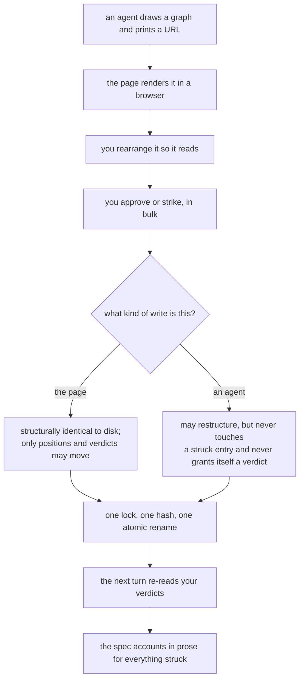

# Completion Report — Diagrams agents draw and Collin can redraw

Written for a hostile reviewer: every claim checkable, no claim without evidence.



## What was built

An agent writes a graph — ten to twenty-five boxes with labelled arrows, each carrying where it came
from — to a JSON file and prints a URL. You open it, rearrange it so it reads, and approve or strike
what is wrong in bulk. The next agent turn reads those verdicts. That is the return trip the idea
document said no tool gives you: you could be shown a diagram, but you could not answer with one.

## Spec coverage

| Spec item | Origin | Implemented at (file:line) | Validated by |
|-----------|--------|----------------------------|--------------|
| §1 `protocol/graphs.md`, the format both harnesses read | this run | `protocol/graphs.md:1-458` | cold-read check; `./install.sh` registers `/graph` |
| §1 `protocol/planning.md`, three insertions | this run | `:73` re-read before each question, `:127` draw a flow when one is discussed, `:177` the exit gate | read; no test — prose |
| §1 `protocol/diagrams.md`, authoring from a graph | this run | `protocol/diagrams.md:73-95` | read |
| §1 `protocol/plan-review.md` names that section | this run | `protocol/plan-review.md:113-117` | read |
| §1 `skills/graph/SKILL.md`, `codex/prompts/graph.md` | this run | both files, 8 and 1 lines | `./install.sh` twice; `/graph` offered in both harnesses |
| §1 `install.sh` gains two steps | this run | `install.sh:20-24` | run twice, idempotent, tree clean |
| §1 `.gitignore` | this run | `.gitignore:3-4` | tree clean after both suites |
| §1 routers and README swept | this run | `AGENTS.md:19,39,47,56,80-92`; `protocol/AGENTS.md:32`; `skills/AGENTS.md:22`; `README.md:18,34,60,79,108,121` | read against the tree |
| §1 `MAP.md` re-mapped | this run | `docs/plans/editable-node-graphs/MAP.md` | read against the tree |
| §1 `spike/` deleted | this run | commit `7f2d462` | absent from the tree |
| §2 a graph is disposable, a router is its input never its output | this run | `protocol/graphs.md:10-40` | read |
| §3 schema, key order, every key present | this run | `viewer/server.js:73` canonicalization, `:96` validation | round-trip test, byte identity |
| §3 defaults; a missing label is a refusal | this run | `viewer/server.js:96-160` | `malformed on-disk graphs refuse without repair` |
| §3 the wire omits `x`/`y`; positions are the person's | this run | `viewer/server.js:391` | `PUT /graph ignores known positions and lays out new nodes` |
| §3 where files live, slug and repo-key derivation | this run | `protocol/graphs.md:215-250` | read — agent-side convention, no server code |
| §3 producer sequence with the mandatory hash | this run | `protocol/graphs.md:251-327` | the lead's smoke script ran that exact sequence |
| §3 read-back rule | this run | `protocol/graphs.md:328-346` | read |
| §4 the three `planning.md` insertions | this run | as above | read |
| §5 top level only, authored not generated | this run | `protocol/diagrams.md:73-95` | read |
| §6 three origins; `agreed` is a verdict, not a lock | this run | `viewer/server.js:247` | `verdict reversal is page-only…` |
| §6 preservation: `rejected` verbatim, `agreed` reset-then-remove | this run | `viewer/server.js:247-290` | `agent preservation protects agreed and rejected entries` |
| §6 `was` makes a reset durable | this run | `viewer/server.js:277-289`, `:611` | `agent reset records are durable…`; browser `approving a reset entry through the page clears was` |
| §6 a bulk verdict is additive only | this run | `viewer/server.js:626-632` | `bulk verdicts are additive and one reversal is permitted` |
| §6 BFS layering with the re-seed | this run | `viewer/server.js:350-390` | `layout places every component, including a disconnected two-cycle` |
| §6 cross-file preservation, recursive | this run | `viewer/server.js:310-349` | `container removal accepts proposed-only child and recursively finds grandchild verdicts` |
| §6 a retarget un-registers what it drops | this run | `viewer/server.js:512-541` | `retargeting away unregisters a derivable child…` |
| §6 every retargeting case | this run | `viewer/server.js:336-349` | `all containment retarget cases…` |
| §7 verdict surface, not an editor | this run | `viewer/index.html` — no authoring path exists | browser `no gesture or control adds, renames or connects anything` |
| §7 selection, box-select, bulk judgement | this run | `viewer/index.html:333,348` | browser `box-select then approve…` |
| §7 implied edges, shift-click removes one | this run | `viewer/index.html:333-347` | browser `shift-clicking an implied edge removes it and it stays removed` |
| §7 reachable edges, 24 device px at any zoom | this run | `viewer/index.html:608-700` | browser `an edge is selectable by label, band and endpoint handle at minimum zoom` |
| §7 two edges on one pair fanned apart | this run | `viewer/index.html:608-621` | browser test 8 — **found broken by that test, then fixed** |
| §7 detail at the item | this run | `viewer/index.html:715-846` | browser `selecting an item expands ref, note, and an edge payload…`; measured 76px from a node |
| §7 containment, breadcrumb, escape | this run | `viewer/index.html:447` | manual; `children` map drives the disabled affordance |
| §8 routes, auth, `Origin`, `/whoami` | this run | `viewer/server.js:574,634,671,690,705` | `whoami is unauthenticated identity, never a mutation credential`; browser `a page write carries an Origin the server accepts` |
| §8 why two write routes | this run | `viewer/server.js:634` agent, `:671` page | `both write routes enforce their distinct authority` |
| §8 atomic writes | this run | `viewer/server.js:439` | `atomic writes leave a complete graph after a normal server write` |
| §8 one global write lock | this run | `viewer/server.js:403` | `the global write lock serializes concurrent writes and retry retains both changes` |
| §8 optimistic concurrency by hash | this run | `viewer/server.js:634-641`, `:671-678` | `optimistic concurrency returns and accepts the current hash, including create` |
| §8 cycles refused at write, depth bounded at traversal | this run | `viewer/server.js:291-309` | `all containment retarget cases, cycles, deep acyclic writes…` |
| §8 the page polls; own writes do not reload | this run | `viewer/index.html:1044` | `GET change detection exposes agent hashes and preserves the page write hash` |
| §8 write scope, derivation, 30-day prune | this run | `viewer/server.js:475,492` | `registered paths are pruned by age at startup` |
| §8 lockfile discovery, reuse, reclaim, refuse | this run | `viewer/server.js:745,787` | `discovery reuses matching locks, reclaims dead locks, and rejects foreign live locks` |
| §9 `viewer/` layout, one pinned dev dependency | this run | `viewer/package.json`, `viewer/package-lock.json` | `./install.sh` twice |
| §9 the browser test never skips | this run | `viewer/test/browser.spec.js` — no skip guard, no config file | grep; suite fails loudly without Chromium |
| §10 every edge case | this run | `viewer/server.js:96-160`, `:291-349`, `:690` | `malformed on-disk graphs refuse without repair`, `containment faults`, `faults` |
| §11 non-goals | this run | no authoring, no graphify rendering, no Zed, no multi-user | browser test 10 |
| §12 the four spike lessons as comments | this run | `viewer/index.html:45-48,552-560,590-600,~1000` | read; `spike/` deleted |
| §13 the two suites | this run | `viewer/test/server.test.js` (21), `viewer/test/browser.spec.js` (13) | both green, pasted below |
| §9 preconditions: git, `.gitignore`, root router | pre-existing | baseline `beec39c`; `.gitignore`; `AGENTS.md` | checked before dispatch |

## Deviations from plan

**Five wire-shape decisions the Spec does not settle** were made by the lead before dispatch and are
recorded in `PLAN.md` as L1-L5: refusal status and error codes, `GET /graph`'s `children` map, the
`opened` flag on a registered entry, and the layout pitch. Four lanes implementing against each other
would not otherwise have met.

**Two rules added, not just shapes.** Both are in `PLAN.md` as lead decisions:

- **L2, `agent-verdict`.** The Spec says an agent may reverse neither verdict but never says it may
  not *grant* itself one. Same act. Without the check, the preservation contract has a hole.
- **L6, `container-unreadable-child`.** A subtree walk that hit a child which does not parse was
  reporting it verdict-free, which orphans exactly what the walk exists to protect. It now refuses.
  Found by reading the lane's diff, not by a test.

**Three §13 assertions were corrected, not implemented as written**, because §0 resolves the
contradictions they sat on: the write-lock test retries on 409 (the lock and the hash prove different
things), and there is no depth refusal at write time to assert. Recorded in `PLAN.md`.

**`spike/` was deleted by the lead at integration**, not by the sweep lane, so the page lane could
read it as a taste reference first.

## Routers

| Router | What became true |
|---|---|
| `AGENTS.md` (root) | `viewer/` replaces `spike/` in both the four-kinds table and the where-to-go table; the `.gitignore` row names all four entries; the verification block gains both test commands and states why the `node --test` glob is required; the docstring-rung claim no longer rests on "no code here" |
| `protocol/AGENTS.md` | one row for `graphs.md` |
| `skills/AGENTS.md` | one row for `graph/` |
| `spine/AGENTS.md` | untouched — this change moved nothing into or out of `spine/` |

`viewer/` earns a router and **neither plan writes it** (§9, decision 53). It is covered by whatever
`/spine` run happens after this lands. That is a known gap, listed below.

## Validation evidence

```
$ ./install.sh && ./install.sh
install.sh twice: OK
$ git status --porcelain | wc -l
0

$ bash spine/test/run.sh
RESULT 80 passed, 0 failed

$ node --test 'viewer/test/*.test.js'
ℹ tests 21
ℹ pass 21
ℹ fail 0

$ npm --prefix viewer run test:browser
  13 passed (7.5s)
```

The browser suite drives real headless Chromium against the served page. It contains no skip guard
and no browser-availability check: with Chromium absent it fails loudly, which is the point.

**Independently run by the lead, not reported by a lane.** Both GPT lanes shipped code they had never
executed — their sandbox refused every loopback bind — so the server and the stdlib suite arrived
entirely unvalidated. The lead ran a smoke script covering the producer sequence end to end, then
both suites.

## Known gaps / residual risks

| Gap | Standing |
|---|---|
| `viewer/` has no router | By design (§9, decision 53). The next `/spine` run covers it |
| A drag in flight when an agent writes is lost | Accepted risk from planning, now **asserted** rather than assumed: browser test 3 |
| `--open` writes the registered set outside the global mutex | Accepted. The mutex is in-process and these are separate processes, so it could never have helped. Writes are atomic, so the worst case is one registration lost in a same-millisecond race |
| The lockfile is written before the port is bound | Accepted. The bind-error handler unlinks it, so the state self-heals in milliseconds; binding first would not be safer, since the lockfile is both the exclusivity claim and the token's home |
| Atomicity under a mid-write kill is not asserted | The kill cannot be landed inside the write window without instrumenting the server. The suite asserts a complete graph after a normal write and says so in its own test name. A flaky test would be worse |
| The detail panel overlaps a node when rows are tight | Deliberate. With a 140-unit row pitch and a panel around 90 tall, every adjacent placement covers something; attached-and-legible beats distant-and-clean, and distant is what the plan specified against |
| Whether a drawn graph is a good explanation | Not testable, and §13 says so. The spike established it; the first real plan using this will show it again |
| Whether the three `planning.md` insertions produce a useful discussion | Same. Read by a person, not a test |

## Remediation rounds

### Remediation 1 — 2026-08-24

Both blind verifiers returned FAIL. Seven gaps, all reproduced by the lead before being briefed out,
recorded verbatim in `REMEDIATION-1.md`. Six were closed by lanes; every fix was re-verified by the
lead running the code, not by reading a lane's report.

| Gap | What was wrong | What changed |
|---|---|---|
| Bulk verdicts (found by **both** verifiers) | The page set the verdict on every selected entry, so select-all approve on a graph holding two or more struck entries was refused outright and nothing was ruled. With exactly one struck entry it silently reversed it | A bulk verdict rules only on the unruled; a selection of exactly one already-ruled entry still reverses it, which is the deliberate change of mind §6 permits. `viewer/index.html:374-397` |
| Verdicts on create | The agent-write checks ran only when the file already existed, so an agent could create a graph with entries already approved or struck — and a struck entry is then permanently immutable | The check runs against an empty graph on create. `viewer/server.js:643` |
| Producer sequence | Step 1 of the only document telling an agent how to write its first graph blocked forever, because the first `--open` *is* the server. Verified: exit 124 cold, exit 0 warm | The sequence backgrounds the server and reads the URL from its output, and the document says *why* so an agent can reason rather than follow a recipe. `protocol/graphs.md` |
| `kind` domains | §3 states closed sets for node and edge `kind`; nothing validated them, and the suite's own canonical fixture had drifted outside the Spec | `422 bad-kind`; every fixture brought back inside; a missing `kind` still defaults. `viewer/server.js` |
| Lockfile claim | Created empty with `O_EXCL`, filled a moment later, so a simultaneous starter could read the empty claim as corrupt and delete it | The payload is written through the same exclusively-created descriptor. `viewer/server.js` |
| Atomicity assertion | Asserted a complete graph after a **normal** write, which a non-atomic implementation also passes | Real injected fault: the rename is hooked, the process SIGKILLed at varied delays, and the committed graph must be exactly one whole version |
| One write per action | Required by §13, asserted nowhere | Counted on the request event, so an in-flight duplicate cannot be missed |
| `MAP.md` / `README.md` | Described the repository before the change; `MAP.md` called `index.html` outstanding after it shipped | `MAP.md` now says which moment it describes and notes what has since landed; the README's "only non-markdown piece" claim corrected |

**Two gaps were about tests that could not fail.** The bulk-verdict rule was asserted by hand-building
a payload that already obeyed it, and the gesture was driven on a graph where the violating case could
not arise. That is why a real bug passed two suites. The new assertions start from a graph that
already holds verdicts and drive the real controls, and each was **proven non-vacuous** by reverting
the behaviour in a scratch copy and watching it fail.

Three of the four new server assertions likewise fail against the pre-remediation server, checked by
reverting `viewer/server.js` and re-running.

Two non-blocking observations were recorded rather than fixed, in `REMEDIATION-1.md`: the detail panel
for an edge lands two rows away and darkens an unrelated node, which is Collin's call; and the four
validation commands cannot be parallelized, because the router scanner's suite compares gitignored
scratch before and after.

```
$ ./install.sh && ./install.sh          # idempotent
$ git status --porcelain | wc -l
0
$ bash spine/test/run.sh
RESULT 80 passed, 0 failed
$ node --test 'viewer/test/*.test.js'
ℹ tests 24   ℹ pass 24   ℹ fail 0
$ npm --prefix viewer run test:browser
  16 passed (11.9s)
```

### Remediation 2 — 2026-08-24

Both verifiers returned FAIL again on four gaps. **Three of the four were tests that could not fail** —
the same class that let a real user-facing bug pass two suites in round 1, and what both verifiers were
told to hunt. The lane ran at `xhigh` on the same tier in a fresh lane, because the one surviving gap
was nearly-right work that missed an edge case rather than a lane that misread the task.

| Gap | What was wrong | What changed |
|---|---|---|
| Lockfile claim (**survived round 1**) | Round 1 moved the payload onto the exclusively-created descriptor, but `open` publishes the pathname before anything is written into it, so a second starter still saw an empty file and deleted it. The round-1 test paused after the payload had landed, so it could not reach the race | The payload is written to a temp and hard-linked into place — `link` fails if the target exists, so exclusivity and contents arrive together. `viewer/server.js` `claimLock` |
| Orphaned temp files | A killed write left `.<name>.<hex>.tmp` beside the target; 11 survived a suite run. In a plan that is an untracked file in a committed directory, and §13 requires a clean tree | Swept before each write, which the global lock makes safe: a matching sibling can only be a leftover |
| Layout test could not fail | It asserted only that a coordinate was a whole number — and an unplaced node keeps the `0` the validator defaults it to. The only guard on decision 98, passing against a reverted layout | Pins every coordinate. **And the code half**: `Object.assign(node, positions.get(id))` was a silent no-op for an unplaced id, so the server wrote nodes stacked at the origin rather than failing. It now refuses with `500 internal` |
| Rounding half-up asserted nowhere | §13 names float positions as one of the four things the non-canonical fixture is non-canonical *in*; it had none | Floats added including the `.5` cases where the rule has a choice, plus an assertion on the stored integer through the page's route |

**Non-vacuity proven by the lead, not by the lane** — the lane hit its fails-twice guardrail and stopped
before this step, correctly, because its sandbox could not bind a loopback socket. Reverting decision
98's re-seed in a scratch copy fails with `Layout did not assign a position to node x`; reverting the
lock claim to the round-1 create-then-fill form fails with `the claim window exposed corrupt, not a
usable lock or no lock`.

The fresh verifier additionally confirmed, by running rather than reading: never-skip proven by pointing
Playwright at an empty browser path (16 failed, loudly); the producer sequence run verbatim from
genuinely cold through to a graph on disk, and warm in 123ms; containment driven by hand — open
affordance, breadcrumb, escape clearing a selection before stepping back, and a child writable with no
separate `--open`; all six lead decisions faithful; the router sweep true.

```
$ ./install.sh && ./install.sh          # idempotent, tree clean
$ bash spine/test/run.sh
RESULT 80 passed, 0 failed
$ node --test 'viewer/test/*.test.js'
ℹ tests 24   ℹ pass 24   ℹ fail 0
$ npm --prefix viewer run test:browser
  16 passed (12.0s)
$ find viewer/test/.tmp -name '.*.tmp' | wc -l
0
```

### Remediation 3 — 2026-08-24

Two gaps from the round-2 closure review. Both fixed by the lead directly under Stage 3's small-patch
bypass; full detail in `REMEDIATION-3.md`.

| Gap | What was wrong | What changed |
|---|---|---|
| Round 2's temp sweep raced live processes | The sweep was placed inside the shared write path on the argument that the global mutex made it safe. True for graph writes, false for the writable-set file, which `--open` writes from a short-lived process holding no lock — so it deleted other processes' in-flight temps and killed them on rename. **57 deaths** under concurrent `--open` against the round-2 form, **0** against the fix | Scoped to the two graph-write sites, inside the mutex. That is also the only place it matters: a graph lives in a committed directory, the cache root does not |
| Another assertion that cannot fail | `PUT /graph ignores known positions` checked only that a coordinate was a whole number — which passes against a layout that places nothing, since every served coordinate is rounded. Same defect as the one round 2 fixed, in the test beside it | Pins the coordinate the layout is specified to produce. Proven to fail against a layout that stacks every node at the origin |

The regression was the lead's, accepted in round 2 on an argument that was not checked against every
call site. The verifier reproduced it without instrumentation and named the correct scoping.

```
$ ./install.sh && ./install.sh          # idempotent, tree clean
$ bash spine/test/run.sh
RESULT 80 passed, 0 failed
$ node --test 'viewer/test/*.test.js'
ℹ tests 24   ℹ pass 24   ℹ fail 0
$ npm --prefix viewer run test:browser
  16 passed (11.9s)
$ find viewer/test/.tmp -name '.*.tmp' | wc -l
0
```

