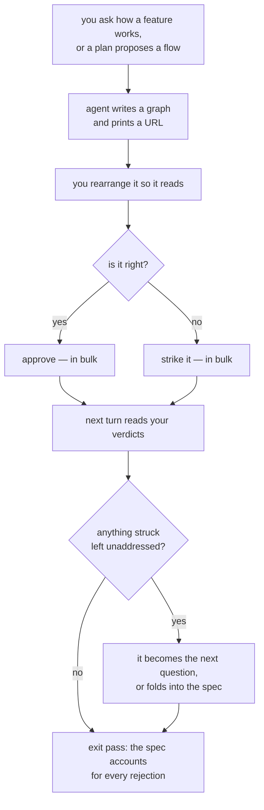

# Diagrams agents draw and Collin can redraw

**Idea:** `IDEA.md` — what this is for and why, in plain language. Read it first; it is
the north star this plan serves. Goal and Constraints live there, not here.

**Sibling plan:** the router half moved to `docs/plans/router-spine/` after Round 1. That plan
lands first — it brings the repo under git, creates `.gitignore`, ships `spine/scan.sh`, and defines
the router format that `viewer/`'s eventual router will follow — written by neither plan, per that plan's decision 38. Routers remain a graph's preferred input; nothing about producing them lives here.

## Open Questions

None.

## Watch List

| # | Noticed | What needs looking into | Raised to user? | Outcome |
|---|---------|-------------------------|-----------------|---------|
| 1 | 2026-08-22 | The graphify skill's own instruction is to treat any codebase question as a graphify query first. almanac overrides that per-repo in its root router. If routers become standard, the override belongs somewhere global instead of copy-pasted into every repo. | yes | settled — `/spine` propagates the policy into every root router it writes (decision 29); the remaining gap outside this workflow is an accepted risk |
| 2 | 2026-08-22 | This repo is not under git — no history, no revert path for the first code landed in it. | yes | settled — `git init` lands in `router-spine`, which ships first (decision 40 superseding 23-24) |
| 3 | 2026-08-22 | Zed renders Mermaid in markdown preview but has no zoom control and a reported wide-diagram scroll bug. Affects whether Mermaid-in-docs is actually pleasant where you read it. | no | accepted risk — upstream editor limitation; wide flows are what the browser viewer is for |
| 4 | 2026-08-22 | graphify's skill and package version independently — the 0.9.31 skill against a 0.9.30 package produced warnings on every call. Resolved by removing the duplicate, but the skew can recur on the next skill auto-update. | no | out of scope — environment upkeep; a skew produces warnings, not wrong answers, and nothing here depends on a graphify version |
| 6 | 2026-08-22 | From using the spike: the note panel should be an expand or dropdown on the node itself rather than a corner panel. | yes | settled — §7 requires the detail to expand at the node, and with authoring cut nothing competes for the space |
| 7 | 2026-08-22 | From using the spike: **groups** — a visual boundary, or a node you click into. Schema change, IDEA-level scope question. | yes | settled — containment chosen (decision 56); follow-on design in Q2-Q4 |
| 5 | 2026-08-22 | `install.sh` only creates symlinks. Any runtime needs a real install step, and both harnesses (Claude skills, Codex prompts) have to pick it up. | no | settled — one dependency-install step; the existing globs pick up a new skill for free (decisions 25, 26) |

## Decision Log

Append-only. Entries are appended in numeric order; a citation is found by its number.

Superseding entries: **114 supersedes 48, 72, 93, 94, 99, 101, 105, 107, 108, 112 and the transport half of
76 and 90. 116 supersedes 109. 118 supersedes 112. 119 restores the substance of 94 as a single lock. 120
and 121 supersede 115 in part. 122 amends 110. 123 supersedes the write-time half of 118.**
**92 supersedes 80.** 105 supersedes 101 in part; 106 and 107 extend 102; 109
supersedes the enforcement half of 84. 70 supersedes 20, 21, 35, 44, 65. 71 supersedes 59 in part. 74 supersedes 50.
75 supersedes 34 in part. 76 amends 49. 77 supersedes 60. **82 supersedes 78** (which had itself
reconciled 36 and 47). **84 supersedes 80 in part.** **85 supersedes 13.** **92 supersedes 34 and 84 in
part.** 42 supersedes 27 and part of 33. 40 supersedes 23 and 24 in part. 31 reverses 6. 37 supersedes 12
in part. 69 cuts the authoring half of 62.

Decisions 2, 3, 4, 10, 11 and 29 concern router documents and moved to
`docs/plans/router-spine/` under decision 30; they are kept here as the record of how this plan
reached that split, not as work it performs.

| # | Decision | Rationale | Source |
|---|----------|-----------|--------|
| 1 | Diagrams may appear in any document; no cap, no earn-its-place test | A reader who does not want one skips it. The real cost is staleness, handled per-document in Q8 rather than by a blanket ban | user |
| 2 | Routers are the spine; graphify is an opt-in supplement and never the source for "where does X live" or "what owns Y" | Already settled and written down in almanac's root `AGENTS.md`, with reasons: `graphify-out/` is gitignored so it is per-clone and cannot carry a contract, and a point-in-time snapshot misroutes silently once stale | defaulted |
| 3 | Router documents follow almanac's shape — title, owned-by, one organizing idea, file/role table, boundaries, test pointers, roughly 20-90 lines | It is the reference implementation the user named, already proven across 20 directories | defaulted |
| 4 | No line numbers and no exhaustive file lists in routers | almanac's maintenance section names this as the staleness failure it designed out | defaulted |
| 5 | Graph files are JSON | Agents write JSON reliably and React Flow consumes it directly | defaulted |
| 6 | The viewer is React Flow rendered in a browser | Zed extensions cannot provide UI panels or webviews; React Flow is the standard node-graph library and is MIT | defaulted |
| 7 | Node is the runtime | Node 26.7.0 and npm 12.0.2 are installed; nothing else present fits | defaulted |
| 8 | `MAP.md` keeps its plain-text diagram and stays Mermaid-free | `protocol/map.md:25-26` bans it because the map is read in a terminal | defaulted |
| 10 | Routers get both a deliberate backfill command (`/spine <path>`) and folded-in upkeep in the pre-PR documentation sweep, with the format defined once in `protocol/` and read from there by both | They solve different problems — one-time coverage versus stopping rot — and almanac's maintenance section puts upkeep exactly where the second sits: updating both routers is part of the ownership change, not a follow-up | user |
| 11 | `/spine` is documentation-only: no plan, no review gate, but it lists every file it will create or extend, and what changes in each, before writing anything | A repo-wide pass writing a dozen router files unsupervised is the risk; a confirm step costs one turn and the output is markdown you can read | defaulted |
| 12 | A plan's graph is committed at `docs/plans/<slug>/graph.json`; a question's graph is written to a cache outside the repo | The protocol requires a fresh session to resume from the plan documents alone, which forces the first half. Nothing forces the second, and keeping disposable views out of git costs nothing | user |
| 13 | Question graphs live at `~/.cache/agent-graphs/<repo-name>/<slug>.json` | Outside every repo, per-repo so names cannot collide, and in the standard cache location so it is obviously disposable | defaulted |
| 14 | Graph files serialize deterministically: integer positions, stable key order, nodes and edges sorted by id | Otherwise re-saving an untouched graph produces a diff, and React Flow's float positions turn every drag into noise. A committed file has to be quiet when nothing changed | defaulted |
| 15 | With no router covering the feature, the graph is drawn from a direct read of the code and says so on its face | Graphs are disposable by decision 9, so a direct read is as trustworthy as one needs to be; making a question trigger a repo-wide documentation pass is the friction that stops the question being asked | user |
| 16 | A small local server serves the page and accepts writes | The only option that can also watch the file, so an agent rewriting the graph mid-planning updates the open page instead of leaving a stale picture with no indication | user |
| 17 | The agent starts the server itself when it writes a graph, and prints the URL | You asked a question; being handed a link beats being told to run something first | user |
| 18 | One server instance per machine, serving any graph by path. Starting is idempotent — an already-running server is reused, not duplicated. Binds `127.0.0.1` only | A server per graph would leak processes and ports as you look at several. Localhost-only because nothing here is multi-user by design | defaulted |
| 19 | The browser saves on drag-end, debounced. There is no unsaved state in the page | Removes the clobber case entirely: an agent rewriting the file can never overwrite pending edits, because pending edits do not exist. Also what makes live reload safe | defaulted |
| 20 | Every node carries a field recording where it came from | Diffing against the last agent-written version cannot separate "I fixed your label" from "I added a thing," and that distinction is the entire point of the feature | user |
| 21 | The values are `proposed`, `mine`, `agreed`, `rejected`. A rejected node stays in the file, visibly struck, rather than being deleted | A deleted node gets re-proposed on the next turn and you reject it again forever. Keeping it with the rejection recorded is what ends that loop | defaulted |
| 22 | Edges carry the same field | "No, that one does not call that one" is as common a correction as adding a box, and an edge you delete comes straight back otherwise | defaulted |
| 23 | The viewer lives in this repo, and this repo gets `git init` first | The graph format is defined in `protocol/` and consumed by the viewer; splitting them across two repos leaves a coupled change with nothing enforcing agreement. Git is needed regardless — landing the first executable code into a directory with no history or revert path is the real risk | user |
| 24 | `git init` lands as its own commit capturing the current 23 markdown files and `install.sh`, before any new code | Otherwise the first commit mixes "here is what existed" with "here is the new runtime," and there is no clean point to revert to | defaulted |
| 25 | The viewer lives in `viewer/` with its own `package.json`, and is invoked by absolute path (`node <repo>/viewer/server.js`) rather than through PATH or a symlink | The skills already hardcode the absolute path to `protocol/`, so this follows the convention that already works and needs no launcher, no PATH entry, and no shim | defaulted |
| 26 | `install.sh` gains one step: install the viewer's dependencies. `node_modules/` is gitignored | The symlink loops already pick up new skills for free; dependencies are the only genuinely new install work | defaulted |
| 27 | A diagram in `PLAN.md` is drawn once, at the exit pass, in the Spec section only | Mid-plan the working surface is the prose and the question in front of you, and the graph file beside the plan is already current throughout the discussion. The Spec diagram is written once from a settled design for the people who implement and review from it | user |
| 28 | Mermaid goes in documents written once and read many times. Documents read in a terminal — `MAP.md` and the routers — keep plain-text arrow chains | Rendering is the deciding factor, not preference: a terminal reader gets nothing from a Mermaid block, and `protocol/map.md:25-26` already bans it in the map for that reason | defaulted |
| 29 | `/spine` writes a graphify-policy section into every root router it creates, propagating almanac's pattern | It is the only place the override reliably lands, since the graphify skill's query-first default is global and a per-repo router is what overrides it in practice today | defaulted |
| 69 | **Authoring is cut from the first version.** No adding nodes or connections, no renaming, no editing what a connection carries. The viewer is a verdict surface: rearrange, approve, reject. Anything else is said in prose | Settles Q1 and supersedes the authoring half of decision 62. Recorded as an `idea-change` in IDEA.md: the north star previously promised adding a box for the case nobody accounted for | user (idea-change) |
| 70 | Supersedes decisions 20, 21, 35, 44 and 65. `origin` has **three** values — `proposed`, `agreed`, `rejected`. `mine` is gone, along with every content-edit transition | Follows from 69: with no authoring there is no human-authored content, so there is nothing for `mine` to mean. This dissolves Round 4's worst blocking finding — a `ctrl+A` followed by approve had been able to rewrite every `mine` entry, destroying the provenance the plan exists to protect | user (idea-change) |
| 71 | Supersedes decisions 59 and 65 in part. `value` and `inferred` stay on the schema and stay rendered, but are **read-only** in the viewer | An agent still needs to say what an edge carries and whether it read that or reconstructed it — that was the point. What goes is the person typing one, which is what made the kind-flip lifecycle undefined | defaulted |
| 72 | A patch names its graph and its target, and there are exactly **two** kinds: a node position, and an origin on a node or an edge | Round 4 found the old patch shape could name neither a graph nor an edge. With authoring cut, the mutation surface is small enough to enumerate, which is why this is now a closed set rather than a mechanism | review-round-4 |
| 74 | **Supersedes 50.** The server is the only process that writes a graph. There is no `--write` CLI; an agent `POST`s a whole graph to `PUT /graph?name=<name>` and the server applies it under the same lock as a patch | Two processes doing read-modify-write on one file was Round 3's core defect. Removing the second process is simpler than a locking protocol between them, and it puts the preservation check on the single path that runs | review-round-5 |
| 75 | **Supersedes 34 in part.** An agent never sends positions. The server keeps `x`/`y` from disk for every id it already knows, and assigns coordinates only to ids it has not seen | A contract requiring the agent to carry positions forward means any drag between its read and its write makes the write stale — the ordinary case during planning, not an edge one | review-round-5 |
| 76 | **Amends 49.** The server polls size, mtime and a content hash once a second and pushes to the page over server-sent events at `GET /events`. The server owns detection; the page only listens | Round 3 found two implied owners of the poll and no named transport. One owner and one named route removes both | review-round-5 |
| 77 | **Supersedes 60.** A fork is **declared**, not inferred: a node carries `exclusive: true` to say exactly one outgoing edge is taken. Absent means all of them happen | Deriving it from a node having two outgoing edges asserts the stronger claim on the agent's behalf, which contradicts the same reasoning that makes `sequence` the default edge kind. Declaring it also makes an incorrect assertion visible rather than baked into the rendering | review-round-5 |
| 78 | **Reconciles 36 and 47.** Following a container node registers the child as **readable**. The *writable* set is still extended only by the CLI. Read and write authority are separate sets | Requiring `--open` before a child could be opened made containment unusable, but letting a browser widen write authority was the hazard 36 exists to prevent. Splitting the two satisfies both | review-round-5 |
| 79 | `protocol/diagrams.md` gains a section on authoring a Spec diagram from a graph, and `protocol/plan-review.md` names both that section and the graph directory | Round 3's blocking finding, open across three remediation passes: `grep -ri graph` over `protocol/`, `skills/`, `codex/`, `install.sh` and `README.md` returned nothing, so the mechanism carrying a canvas into the Spec's diagram existed in no file | review-round-5 |
| 80 | A verdict is reversible by a person and never by an agent. Selecting a `rejected` entry and approving it moves it to `agreed`; an agent may not re-propose a rejected id, and may not alter any non-`proposed` origin | Bulk reject is a default gesture, and the preservation contract made every rejection permanent with its id permanently unusable. A person changing their mind is ordinary; an agent overturning them is the thing being prevented | review-round-5 |
| 81 | Every route is **path-keyed**, not name-keyed: `?path=<url-encoded absolute path>`. A `graph` field's bare name resolves to a sibling path in the parent's own directory | One machine-wide server serves graphs across repos, so `main` is ambiguous — and the writable set, `--open` and the refusal rows were all path-keyed already while the routes were not. The spike got away with names because it took a single directory from argv, which decision 18 forbids | review-round-6 |
| 82 | **Supersedes 78.** A child named by the `graph` field of a graph already in the writable set becomes writable too. Read and write are not split | Splitting them meant a person could navigate into a child and not judge inside it, while §6 and §13 both require child graphs to hold verdicts. The hazard decision 36 guards is a page widening authority to an *arbitrary* path; a child named inside an already-writable graph is not arbitrary | review-round-6 |
| 83 | Initial layout is BFS layering from nodes with no incoming edge; edges that would revisit a placed node are back-edges and ignored for layout; if no node lacks an incoming edge the lowest id seeds the first row | The stated rule was longest-path layering, which needs a DAG — and §7 explicitly supports a two-cycle. A retry arrow back to a gate is ordinary, and a worker would have hit infinite recursion or an empty first row on the first such graph | review-round-6 |
| 84 | **Supersedes 80 in part.** A bulk verdict is **additive only**: approve moves `proposed`→`agreed` and touches nothing else; reject moves `proposed`→`rejected` and touches nothing else. Reversing an existing verdict requires a single-item selection | Decision 80 made verdicts reversible and §7 kept select-all, so one `ctrl+A` and approve converted every `rejected` entry to `agreed` — Round 4's worst finding, back in a new form. Bulk is for ruling on the unruled; changing your own mind is deliberate | review-round-6 |
| 85 | **Supersedes 13.** A question graph is `~/.cache/agent-graphs/<repo-key>/<slug>/<name>.json`, entry graph `main.json` | 13 was live, uncontradicted by the supersession map, and named a different path — the exact defect class the rewrite existed to remove, found in the log rather than the prose | review-round-6 |
| 86 | Restores decision 51's operative half, dropped in the rewrite: the browser test **fails loudly** when Chromium is absent and never skips | A fix lost in a rewrite rather than in a patch. Verified live: no system Chromium, and the cached revisions are tied to particular driver versions, so an install mismatch is the real case and a skip is a worker's natural handling — "an untested lane wearing a green badge" | review-round-6 |
| 87 | The producer sequence is stated in `protocol/graphs.md`: start the server, `--open <path>`, then `PUT`. `--open` accepts a path whose file does not yet exist | Round 3 raised this, it was upheld, and the one-writer redesign carried it over unanswered. Nothing told an agent how to write its first graph | review-round-6 |
| 88 | An agent's `PUT` **omits `x` and `y` entirely**. The every-key rule governs files on disk, not wire payloads; the server fills positions before writing | §3 required every key present with integer positions while §6 said an agent never sends them. A strict validator would reject what a compliant producer sends | review-round-6 |
| 89 | `protocol/graphs.md` carries a defaulting table for canonicalization: node `kind` `note`, `origin` `proposed`, `exclusive` false, `ref`/`note`/`graph` null; edge `kind` `sequence`, `value`/`note` null, `inferred` false. `label` has no default and its absence is a refusal | §13 asserts an exact canonical match from input with keys omitted, which is unpinnable without this. Positions round half-up via `Math.round` | review-round-6 |
| 90 | `/events` is per-graph: `GET /events?path=<path>`, one stream per open graph | The server polled "each open file" and pushed to "the page" with no per-client scope — the same reason every patch names its graph | review-round-6 |
| 112 | A `PUT` that adds or retargets a container takes the queue for its subtree **and** re-validates the whole reachable graph for cycles after applying, rolling back if one appears | Decision 107 stopped a parent reading a stale child, but two writes to disjoint subtrees could each pass their own check and compose into an A→B→A cycle. Checking before the write is not enough when the thing being checked is a property of the union | review-round-8 |
| 124 | **Writes are atomic.** Serialize to a temp file in the same directory, `fsync`, then `rename`. This was decision 48's, and cutting the patch machinery took it along with the rest | 114 superseded 48 wholesale, and 48 carried two separate things: field-scoped patches, which deserved to go, and temp-file-rename persistence, which did not. Without it an interrupted write leaves a committed graph as invalid JSON — which §10 then refuses to serve and refuses to repair, so the graph is simply lost | review-round-9 |
| 125 | Edges carry `was` too, in the same position after `origin` | The node key order gained it and the edge order did not, while every key must be present on every entry. Two incompatible contracts for a fixture author, and an agent may reset an approved edge exactly as it resets a node | review-round-9 |
| 126 | A graph drops out of the writable set the moment nothing reachable references it. A container retargeted away un-registers the old child and everything below it | §6 permits retargeting a subtree holding only `proposed` entries — legal, because nothing is orphaned at that instant. But the old child stayed open, stayed writable for 30 days, and its own hash never changed, so a verdict recorded in it afterwards would sit in a file no traversal reaches. Legal at the moment of the retarget, wrong a minute later | review-round-9 |
| 119 | **One global write lock.** The server holds a single mutex across the whole read-modify-write-rename of any write. Not per-file, not per-subtree — one | The cut removed the queues and replaced them with the claim that writes are "serial by construction, one process, one write at a time" — which is the exact proposition decision 94 was written to refute. A read-modify-write plus rename interleaves across awaits in Node whatever the process count. One mutex is five lines and makes the claim true instead of asserted | review-round-9 |
| 120 | **Optimistic concurrency.** Every `PUT` carries the content hash the writer last read. The server refuses with 409 and the current hash if disk has moved since. The response to an accepted write returns the new stored hash | Closes three things at once: a tab up to a second stale could otherwise send a whole graph that silently reverts another tab's approve or an agent's reset — verdict loss, which the accepted risk does **not** cover; the page had no way to compute the hash it was told to compare against, since the server canonicalizes on write; and a refused write had no defined handling | review-round-9 |
| 121 | The route split is a **contract, not a security boundary**, and the Spec says so. Both routes sit in the same trust domain — same token, and `Origin` is trivially forged by a non-browser client. What each route enforces is what that *kind* of write is checked for, which catches mistakes, not an agent determined to misuse the other route | Decision 115 claimed the server enforces the split "rather than trusting the page", which is false as written. An agent could `PUT /view` and flip `rejected`→`agreed`, which §6 forbids it from ever doing. Saying plainly what the boundary is worth is better than a guarantee that does not hold | review-round-9 |
| 122 | `was` joins `x`, `y` and `origin` in what `PUT /view` may change | Nothing could ever clear it otherwise: only the page can rule, and the route contract refused its write. Decision 110's durable-reset field would have been set once and never reset | review-round-9 |
| 123 | Depth is bounded **at traversal**, not at write. Any walk — the re-read, the exit gate, the preservation check — stops at 5 and reports rather than recursing | Containment carries no back-reference and a bare name resolves to a sibling, so more than one parent may name the same child and a write to a mid-tree graph cannot know its own depth from any root. A write-time check would pass a legitimately seven-deep chain built one file at a time and then silently truncate every traversal | review-round-9 |
| 114 | **The concurrency machinery is cut.** No field-scoped patches, no `/events` stream, no client ids, no write queues. The page writes a whole graph exactly as an agent does. Supersedes 48, 72, 93, 94, 99, 101, 105, 107 and the transport half of 76 and 90 | Nine of the thirteen blocking findings in Rounds 6-8 were inside this machinery, and none of it existed in the spike — a 50-line server doing whole-file writes, which Collin used for an evening without losing anything. Patches were introduced to save a drag from an agent's concurrent write; every route being path-keyed, patch kinds, many-target patches, write queues, subtree queues, event streams and client identity are all downstream of that one choice | user |
| 115 | Two write routes. `PUT /graph?path=` is an agent's: preservation-checked, positions ignored. `PUT /view?path=` is the page's: it must be **structurally identical** to what is on disk — same nodes, same edges, same labels, same values — differing only in positions and origins. Any structural difference is refused | The page can only move things and rule on them, which is exactly what authoring being cut already permits. Making that a route contract means the server enforces it rather than trusting the page, and it replaces the target-count discriminator that patches needed | user |
| 116 | Additive-only is enforced by diffing the page's write against disk: many entries may move **from** `proposed`, and at most one may move **away from** an existing verdict | Supersedes decision 109's target-count rule, which only made sense while the page spoke in patches. Diffing against disk is the same check expressed on whole files | user |
| 117 | The page polls `GET /graph` once a second and reloads when the content hash differs from what it last wrote or read. **A drag in flight when an agent writes is lost, and that is accepted** | Replaces the event stream and its client identity. Collin's call: "dragging something around is not something crucial that I wouldn't be too mad about the agent rewriting." The turn structure makes the window narrow anyway — an agent writes between turns, while a question is being read | user |
| 118 | The cycle check runs on write with no rollback machinery | Decision 112 existed because two concurrent writes to disjoint subtrees could compose into a cycle after both passed. With writes serial by construction there is no composition to guard against | user |
| 113 | Retargeting is defined for every case, not only "the child holds verdicts": `null`→name is allowed; name→`null` and name→other are refused when the **old** subtree holds any verdict, allowed otherwise; a container naming a missing child may be retargeted freely, since there is nothing to orphan | The rule said "the server checks the child" and the schema permits `graph: null` while §10 permits a missing child, so three of the four transitions were unstated | review-round-8 |
| 105 | The page mints a random **client id** at load, sends it on `/events?path=&client=`, `PATCH` and `PUT`, and the server suppresses an echo only to the stream carrying that id. It is not a credential — the token still authenticates | Decision 101 stated a rule with no mechanism: nothing let the server tell one SSE stream from another, so a content hash — global by construction — was the only thing named. This also gives "following a container" a concrete interaction: the child read carries the parent's path | review-round-8 |
| 106 | The cross-file preservation check is **recursive** over every graph reachable through containers, to the depth limit | It checked one level while nesting goes five deep, so removing a container orphaned a grandchild's verdicts — and §13 asserted that exact case was accepted | review-round-8 |
| 107 | A parent write and every graph reachable from it share **one queue**. Per-file queues alone let a parent read a child before a verdict landed there | Decision 102's guard read the child outside the lock protecting it, so the retarget it exists to refuse could be accepted against stale state | review-round-8 |
| 108 | §13 gains concurrency cases: overlapping `PUT`/`PATCH` with a lost-update assertion, and an assertion that a select-all emits **one** patch rather than one per entry — for verdicts and for a multi-node drag | 93 and 94 were prose. Every existing test passed against an implementation with neither, and the drag path still fanned out one patch per node | review-round-8 |
| 109 | The **server** enforces additive-only, by target count: a patch naming more than one target may only move `proposed` entries; a single-target patch may reverse a verdict | The rule was bound to the page, where only a test helper could check it — the objection decision 74 was written on | review-round-8 |
| 110 | A reset records `was: "agreed"` on the entry, cleared when a person rules again | The report lived in the turn, and `protocol/planning.md:4-6` says the docs are the state and the conversation disposable. A resumed session could not distinguish a reset entry from one never ruled on | review-round-8 |
| 111 | §11's exception is the **pre-PR documentation sweep over routers this change makes false**, not two specific rows | Verified: `AGENTS.md:46` calls the repo markdown plus two bash scripts, and its Verification block lists the test surface — both falsified by this change and both outside a two-row licence | review-round-8 |
| 101 | `/events` suppresses an echo only to the client that **originated** the write. Every other open page is notified, including of an agent's `PUT` | Self-echo suppression was written to stop the writing tab reloading its own change, and as stated it silenced the only transport for the case the feature exists for: an agent rewriting a graph you are looking at | review-round-7 |
| 102 | Cross-file preservation covers **retargeting**, not only removal. An agent may not change or null a container's `graph` field while the child holds an `agreed` or `rejected` entry | Guarding removal alone left a hole with the same effect: point the container elsewhere and a file of verdicts is orphaned, dropping out of the re-read and the exit-gate walk with nothing refusing it | review-round-7 |
| 103 | §1 gains `protocol/AGENTS.md` and `skills/AGENTS.md`. This change adds a file to each of those directories, so each router's file table gains a row | Verified: the sibling landed both routers today and neither mentions `protocol/graphs.md` or `skills/graph/`. §1 claimed "exactly two" router changes and "Nothing else", which was true when written and stopped being true when the sibling landed | review-round-7 |
| 104 | The bulk-verdict test starts from a graph **already holding** `agreed` and `rejected` entries | Starting from `proposed` items only, it passed whether or not approve overwrote an existing verdict — a test that cannot fail on the bug it was written for | review-round-7 |
| 92 | **Supersedes 34 and 84 in part.** `agreed` is a verdict at a point in time, not a lock. An agent **may** alter an entry Collin approved — doing so resets it to `proposed` and the turn says which entries it reset and why. `rejected` stays absolute: never re-proposed, never altered | Bulk approve is a default gesture, so after one select-all every entry is `agreed` and an agent could alter only `proposed` ones — while §4 requires the graph updated whenever the flow is discussed again. A flow superseded at question 12 could then be neither corrected nor removed, and the picture goes wrong with no remedy. Freezing was never the intent; being told when something you approved changed is | review-round-7 |
| 93 | A verdict patch names **many** targets. A bulk verdict is one patch, not one per entry | The patch table's targets were singular, so a select-all over 25 nodes emitted 25 patches inside one debounce window | review-round-7 |
| 94 | The server serialises writes per file through a queue. One process is not the same as one write at a time | §8 dropped locking because "every write goes through one process", but a read-modify-write plus rename interleaves across awaits in Node unless it is queued. Decision 93 shrinks the traffic; this makes the ordering correct rather than merely unlikely to break | review-round-7 |
| 95 | Every cache path is `<cache-root>`-relative, lockfile included | The lockfile was hardcoded to `~/.cache/agent-graphs/.server` while the writable set used `<cache-root>`, so decision 91's isolation was defeated at the one file the tests plant and reclaim | review-round-7 |
| 96 | `--open` creates the parent directory if it does not exist | `docs/plans/<slug>/graphs/` and the question-cache directory are both new on a first write, and atomic temp-file rename needs the directory present. Nothing said whose job it was | review-round-7 |
| 97 | The producer sequence reads the token from the lockfile and sends it with an `Origin` header | Decision 87's three steps omitted authentication, so a compliant producer's first `PUT` would be refused and nothing told it where the token lives | review-round-7 |
| 98 | BFS layering seeds from nodes with no incoming edge, then **repeatedly seeds the lowest unplaced id** until every node is placed | The fallback fired only when *no* node lacked an incoming edge, so an ordinary source chain beside a disconnected two-cycle left the cycle unplaced — the exact shape decision 83 was written for | review-round-7 |
| 99 | Position rounding happens on the **patch** path, where floats actually arrive. §1 gains `viewer/test/fixtures/` and `viewer/test/browser.spec.js` | No `PUT` ever carries a float, since an agent omits positions — so `Math.round` was attached to nothing that runs. And the browser test had no stated filename; calling it `*.test.js` would have pulled it into the stdlib glob and fired the never-skip Chromium failure in the lane that needs no browser | review-round-7 |
| 100 | The Spec states its **preconditions** and the implementer checks them before starting: the repo under git, `.gitignore` present, and the sibling's root router written | The plan asserted the post-sibling repo as fact. Verified today: the sibling is mid-implementation with git, `.gitignore`, `protocol/routers.md`, `protocol/spine.md` and `skills/spine/SKILL.md` landed, and `spine/scan.sh` and the root router not yet — so a worker starting now finds two of three preconditions unmet and nothing tells them to wait | review-round-7 |
| 91 | The server takes `--cache-root`, defaulting to `~/.cache/agent-graphs`. The test suite sets it to a temporary directory and picks a free port | As specified the suite planted lockfiles and pruned the registered set at the real paths, so running tests clobbered the developer's live viewer state and fought a running instance | review-round-6 |
| 73 | The exit gate accounts for every **`rejected`** entry, not every `agreed` one | `agreed` means the proposal was right and needs no prose. `rejected` means it is wrong and the Spec must say what replaced it. This also fixes the gate being sized for hand-picked approvals while the default gesture approves wholesale | review-round-4 |
| 54 | A node's `label` is plain-language behaviour. The codebase's own vocabulary — a router's boundary phrasing, a docstring's terms — goes in `note`, never in the label | Found by using the spike: the router's own compressions ("stays nonmetric", "recurrence stays symbolic", "calendar dates carry provenance") were meaningless to the reader the diagram exists for. Earlier guidance to label "in the system's own words" was wrong, and is corrected in `protocol/diagrams.md` too | user (spike) |
| 66 | Settles Q2: a child graph lives in **its own file**; a container node holds its name. A child is a first-class graph openable directly | Built that way in the spike and used without friction. It preserves the 10-25 node target the whole format rests on, which inline nesting would break | user (spike) |
| 67 | Settles Q3: edges connect **siblings only**. A relationship across two levels is drawn at the level where both ends are visible | Built that way in the spike. It is what keeps both the canvas and the derived diagram renderable, and nothing in use argued for crossing levels | user (spike) |
| 68 | Settles Q4: the derived Spec diagram shows the **top level only**, marking which nodes have detail | A reviewer reading the Spec wants the shape; anyone needing detail opens the graph. Fully expanded Mermaid subgraphs read badly past one level. Defaulted rather than demonstrated — Collin has not seen a derived diagram from a nested graph | defaulted |
| 58 | Edges carry a `kind`: `data` when something moves along them, `sequence` when it is only ordering. Default `sequence` | Asked for after using the spike, and the default matters: an agent reading a router usually cannot tell which it is, and `sequence` is the weaker claim. Asserting data flow that was never stated is the worse error | user (spike) |
| 59 | A `data` edge carries a `value` naming what moves, plus an `inferred` flag. Inferred payloads render marked; stated ones render plain | Requested as "if it cleanly passes a value, not inferred, I'd like to know what it is passing". In the spike this split four values quoted from the router against two I reconstructed, which is exactly the distinction worth surfacing | user (spike) |
| 60 | A `decision` node with two or more outgoing edges is a **fork**: its arms are mutually exclusive, they render as `if <label>`, and the node itself is marked. One outgoing edge is not a fork | Rejected adding `branch` as a third `kind`, because a branch arm can also carry a value — the two are orthogonal, and three enum values where one is orthogonal is the accretion the sibling plan was just cut for. The `decision` kind already existed and was not being rendered | user (spike) |
| 61 | Shape may carry meaning where meaning is structural. A fork is marked visibly; decoration is still out | Narrows decision 45's "kind drives no shape". That finding was about decoration; a fork is the one case where the reader needs it, and without it the graph cannot distinguish "then both B and C" from "then either B or C" | review, spike |
| 62 | **Triage is the primary interaction, editing is secondary.** Box-select, select-all, and bulk approve/reject are the default gestures; adding nodes, connecting, renaming and setting values live behind an explicit edit menu | From use: "I don't really find myself doing too much in terms of editing and adding many new nodes." The spike had this backwards, with editing on the easiest gestures and approval one node at a time | user (spike) |
| 63 | Selecting both endpoints of a connection selects the connection | Without it a box-select approves every box in a region and silently leaves every arrow between them at `proposed`, so bulk approval lies about what it covered. Verified in the spike | user (spike) |
| 64 | An edge must be selectable by a target a person can actually hit: its label, a generous band along the line, and an endpoint handle. The bare geometric line is not a target | Verified in the spike: a synthetic click at the exact centre worked while the human could not hit it. The real hit area was 32px by 14px between two boxes | user (spike) |
| 65 | Typing what an edge passes clears its `inferred` flag | The flag records whether the *source* said it. Once Collin states it, continuing to call it inferred is wrong | defaulted |
| 56 | Graphs get **real containment**: a node can hold a child graph you click into. Chosen over visual grouping | User's call, against my recommendation of a `group` field. Recorded with the consequence stated: it makes the schema a tree and touches the format, the viewer and the producer at once, and it opens Q2-Q4 | user |
| 57 | Preservation holds across files, not just within one | Follows from 56 once a child graph is its own file: a node Collin adds inside a child must survive an agent rewriting the parent, and the writer has to enforce that across both | defaulted |
| 55 | A graph drawn from a router is a **translation** of it, not an extraction | Follows from 54 and materially raises what the producer step has to do — the plan previously implied the router's flow and role table could be lifted more or less directly | spike |
| 53 | This plan does not write `viewer/`'s router; a `/spine` run covers it after the directory exists | Both plans' north stars disclaim router production and the sibling's router pass runs before `viewer/` is created, so assigning it to either contradicts something. Cross-referenced as `router-spine` decision 38 | review-round-2 |
| 41 | A `/graph <question>` command exists for the question path — `skills/graph/SKILL.md` and `codex/prompts/graph.md`, thin pointers to `protocol/graphs.md` | The Spec said no new skill or prompt entry was needed and wired graphs only into planning, leaving half of IDEA.md's use case with no entry point | review-round-2 |
| 42 | Supersedes decision 27 and part of 33. The Spec's diagram is governed by the already-shipped `protocol/diagrams.md`, which puts it at approval in Stage 2, and it is authored from the graphs rather than mechanically generated | Stage 2 rewrites the Spec for every upheld finding, so a diagram drawn at the Stage 1 exit pass is stale before anyone reads it — this plan's own document demonstrated it. Dropping the generator also removes the undefined merge, origin-filter and label-escaping questions | review-round-2 |
| 43 | `ref` is optional and null for a conceptual node | It was mandatory and repo-relative while `kind` includes `step`, `decision`, `external` and `note`, so a node Collin adds had no valid value | review-round-2 |
| 44 | Supersedes decision 35. **Any** content edit sets `origin` to `mine`, with no exception for `agreed` | The exception hid corrections: the return loop prioritizes `mine` and `rejected`, no prior value is stored, so a substantive edit to an agreed node was invisible to the next agent | review-round-2 |
| 45 | `kind` is metadata rendered as a text tag inside the box. It drives no shape | It was specified as driving shape while the non-goals forbid any shape beyond a box | review-round-2 |
| 46 | The token and `Origin` checks apply to mutating requests only. A page or graph read needs the token in the URL but no `Origin` header | Browsers omit `Origin` on same-origin GET, so the literal rule blocked the first HTML load | review-round-2 |
| 47 | The registered write set lives in a file (`~/.cache/agent-graphs/.registered`, mode 0600) read per request. `--open` appends to it. There is no in-memory set and no control channel | Removes the IPC surface the previous wording implied but never specified, and a browser page still cannot widen the set because it cannot write that file | review-round-2 |
| 48 | The browser saves **field-scoped patches**, not whole files. The server applies each patch to the current on-disk content and writes atomically via temp-file rename | Fixes three findings at once: an agent's rewrite and a drag can both survive, two tabs no longer need last-write-wins, and Node's documented hazard of overlapping whole-file writes disappears | review-round-2 |
| 49 | Change detection polls size, mtime and a content hash once a second. `fs.watch` is not used for correctness | `fs.watch` events carry only type and filename, coalesce, and an atomic replace leaves the watch on a dead inode. A boolean self-write suppression also swallows a racing external write | review-round-2 |
| 50 | Agents do not hand-write graph files. `node viewer/server.js --write <path>` reads a graph on stdin and enforces the preservation contract, rejecting any write that drops a `mine` or `rejected` entry or loses a kept node's position | The contract bound agents while only a fabricated test helper could be tested, so it would pass while a future agent violated it. Routing agent writes through one enforcing path makes the contract testable at the boundary that actually runs | review-round-2 |
| 51 | Playwright is pinned to an exact version and `install.sh` runs `npx playwright install chromium`. The browser test fails loudly if the browser is absent; it never skips | The cached revisions are tied to specific driver versions, so an unpinned install can leave the test seeking a revision that is not present. A skipping test is an untested lane wearing a green badge | review-round-2 |
| 52 | Tests run as `node --test 'viewer/test/*.test.js'` | Verified on Node 26.7.0: pointing `--test` at a bare directory does not discover the suite | review-round-2 |
| 40 | Supersedes decisions 23 and 24 in part: `git init` and `.gitignore` creation move to `router-spine`, which lands first. This plan appends its own ignore entries | That plan now ships `spine/scan.sh`, so it is no longer markdown-only and is the first change to land executable code. Whichever lands first owns the repo becoming a git repo | review-round-1 |
| 30 | The router half splits into its own plan (`router-spine`), landing first | Review found the halves share no mechanism — this Spec says they are linked by none, and a missing router only changes a graph's label. Bundling put the repo's first executable code and a repo-wide documentation command under one review gate over two unrelated risk profiles | user (review-round-1) |
| 31 | Hand-rolled SVG replaces React Flow. Reverses decision 6 | React Flow ships as an npm React package with bare-specifier imports and a stylesheet, needing a bundler this Spec never specified — while the viewer's non-goals cap it at drag, pan, zoom, boxes and straight arrows. Plain SVG needs no build step and no runtime dependency | user (review-round-1) |
| 32 | `protocol/graphs.md` defines the graph format and is the file both harnesses read | Nothing previously told either harness the format existed. Decision 23's rationale claimed it lived in `protocol/`, but no such file was in the inventory and §4 defined it only inside PLAN.md, which is archived when a plan closes | review-round-1 |
| 33 | `protocol/planning.md` is modified: write a graph when a flow is discussed, re-read graphs before each question, generate the Spec's Mermaid from them at the exit pass | The file that drives the one-question loop was never listed as changing, so nothing produced a graph, nothing read an edit back, and decision 27's premise that the graph is current throughout the discussion was delivered by nothing | review-round-1 |
| 34 | An agent rewriting a graph preserves `x`/`y` for every id it keeps, preserves every `mine` and `rejected` entry verbatim, and may only alter `proposed` ones | "Your layout survives" had no mechanism and no test; the preservation contract covered `rejected` alone | review-round-1 |
| 35 | Editing a label or note sets `origin` to `mine` | Editing was allowed with no transition defined, leaving a corrected node marked as the agent's — verbatim the case decision 20 exists to prevent | review-round-1 |
| 36 | The server's writable set is extended only through its own CLI, authenticated by a token file at mode 0600. No HTTP endpoint can widen it | Resolves the contradiction between one-instance-per-machine and write-only-paths-it-was-opened-with without reinstating arbitrary-path writes: a web page cannot read the token file | review-round-1 |
| 37 | Graphs live in a directory, `docs/plans/<slug>/graphs/<name>.json` | One fixed filename plus a 10-25 node cap left a plan with two distinct flows nowhere to put the second | review-round-1 |
| 38 | Playwright is the sole dev dependency; the runtime has none | The browser seam needs a real browser, and hand-driving CDP would couple the tests to Playwright's own cache layout, which it versions and rotates. Its Chromium is already cached on this machine | review-round-1 |
| 39 | Every diagram must be redundant with the prose around it | IDEA.md's "the diagram adds; it never carries meaning nothing else carries" appeared nowhere in the Spec, so the convention a worker wrote would not have required a terminal reader to get the whole picture | review-round-1 |
| 9 | Split by purpose: routers are the durable text record of how code works; graph files are disposable, scoped to one plan or one question, and never the record | Only option that lets a rearranged layout survive while leaving a single durable description of the code. Two hand-maintained copies would drift, which the user's own "a router that lies is worse than no router" rules out | user |

## Spec

Rewritten from the Decision Log on 2026-08-23. The prose had been patched six times and every pass
introduced contradictions faster than it closed them — a field missing from the key order it had just
been added to, a CLI specified in one section and forbidden in another, tests demanding refusals made
unreachable in the same edit. The decisions were sound; the document was not. This section is built
from them.



The diagram restates the sections below and carries nothing they do not.

### 0. Known contradictions, and which side wins

Ten review rounds left five places where two sections disagree. They are recorded in Round 10's table
and resolved here, because an implementer reads this section and not the review log. Where the Spec
below still says otherwise, **this section is authoritative** — fix the other side as you go.

| Contradiction | Resolution |
|---|---|
| §13's write-lock test says two un-awaited writes both land; decision 120 refuses the second with 409 | The test **retries on 409** and then both land. The lock proves no interleaving; the hash proves no lost update. They are different guarantees and the test needs both |
| §10, §13 and one §8 line refuse a write nesting past depth 5; decision 123 bounds depth at traversal instead | **Traversal wins.** A write cannot know its own depth — containment has no back-reference and several parents may name one child. Delete the three write-time refusals |
| The producer sequence omits the content hash decision 120 makes mandatory | Add it. A **create** — no file yet — carries the empty-string hash, and the server accepts that only when the file is absent |
| Decision 126's two sentences disagree: "nothing reachable references it" versus "a container stops naming it" | **The first wins.** A child two parents name stays writable while either still points at it |
| Bounding depth at traversal leaves the preservation walk blind below 5, which is the hole decision 106 closed | The preservation walk is **not depth-bounded**; it follows every reachable child and terminates on cycle detection. Only the re-read and the exit gate stop at 5, and they report rather than recurse |

Two more worth carrying, from the same round:

- A 409 on `PUT /view` cannot be retried by resending the stale payload — a structural check would refuse
  it. The page **re-reads and re-applies its verdicts** to the new base, so a bulk approve survives an
  agent's concurrent restructuring.
- `was` is page-writable only to **clear** it, and only in the same write that sets an `origin`. Otherwise
  a `was`-only write could fabricate or strip reset records while changing nothing else.

### 1. Everything this change touches

| File | Action |
|---|---|
| `protocol/graphs.md` | **new** — the graph format, read by both harnesses |
| `protocol/planning.md` | three insertions: write a graph, re-read before each question, the exit gate |
| `protocol/diagrams.md` | gains a section on authoring a Spec diagram from a graph |
| `protocol/plan-review.md` | names that section and the graph directory when drawing at approval |
| `skills/graph/SKILL.md` | **new** — pointer to `protocol/graphs.md` |
| `codex/prompts/graph.md` | **new** — same pointer, Codex side |
| `viewer/index.html` | **new** — the page |
| `viewer/server.js` | **new** — the server, the only writer |
| `viewer/package.json` | **new** — one dev dependency, pinned Playwright, plus a `scripts` entry |
| `viewer/package-lock.json` | **new**, committed |
| `viewer/test/*.test.js` | **new** — the stdlib suite |
| `viewer/test/browser.spec.js` | **new** — the Chromium test. Named `.spec.js` deliberately so `node --test 'viewer/test/*.test.js'` excludes it; otherwise the never-skip Chromium failure fires in the lane that needs no browser |
| `viewer/test/fixtures/` | **new**, committed — the canonical graphs §13 asserts against |
| `install.sh` | two steps added: install viewer deps, install Chromium |
| `.gitignore` | append `viewer/test/.tmp/` (the sibling creates the file) |
| `AGENTS.md` (repo root) | swept for what this change falsifies. Its executable-file row, its "markdown plus three shell scripts and one throwaway JS file" line, its `spike/` note and its `.gitignore` row all go stale — the exact set is read at implementation time, because the sibling is still editing this file |
| `MAP.md` | re-mapped against the current tree. It describes a repo with no code and no git; the tree now has seven commits, `.gitignore`, `spine/scan.sh`, `spine/test/run.sh` and four routers, and its `graph.json` reference is superseded by `graphs/<name>.json` |
| `README.md` | seven corrections: `graphs/` added to the plan-artifact list, `/graph` to the Usage command block, list `protocol/graphs.md`, add `viewer/` to the tree, **remove `spike/` from it**, fix "the four stage commands take slugs only" for `/graph`, and stop describing `install.sh` as symlinks-only. Its Dependencies section gains Node, npm and Playwright |
| `protocol/AGENTS.md` | one row for `protocol/graphs.md` in its file table |
| `skills/AGENTS.md` | one row for `skills/graph/` |
| the repo root router | `viewer/` added, `spike/` removed, the Verification block gains the two test commands. The sibling's `/spine` run creates that router before this change lands, so this change makes it stale in exactly two ways and fixes exactly those two. **This is not router production** — it is the pre-PR documentation sweep the sibling's own upkeep rule requires, and §11's non-goal is about building router tooling |
| `spike/` | **deleted** |

Nothing else. This table exists because `README.md` and the diagram mechanism both survived three
remediation passes uncaught, which is what happens when the file set is assembled from prose.

### 2. What a graph is

Disposable. Each exists to answer one question or carry one proposed flow inside a plan. It holds node
positions so a rearranged layout survives for the life of that plan or question. No agent reads one to
learn how the system works, and none is expected to be true a month later; a stale graph is discarded
and redrawn, never repaired.

A router — per the sibling plan — is a graph's preferred **input**, never its output. Nothing generates
a router from a graph. A graph drawn from a router is a **translation** of it: a router is written for
someone already inside that module, so its compressions have to be unpacked, and that is the expensive
part of producing one (decisions 54, 55).

### 3. `protocol/graphs.md` — the format

Both harnesses read this file. It holds the schema, the serialization rules, the origin semantics, the
preservation contract, the read-back rule, and how the viewer is started.

```json
{
  "schema": 1,
  "title": "how a phrase about time becomes a date, or doesn't",
  "source": "router",
  "source_detail": "src/almanac/records/timeline/AGENTS.md",
  "nodes": [
    { "id": "gate", "label": "accept it as a real measurement, or refuse",
      "kind": "decision", "origin": "proposed", "exclusive": true,
      "ref": "src/.../admission.py", "note": "Admission is a gate, not a coercion.",
      "graph": null, "x": 780, "y": 200 },
    { "id": "refuse", "label": "left as words — no number is invented", "kind": "note",
      "origin": "proposed", "exclusive": false, "ref": null, "note": null,
      "graph": null, "x": 780, "y": 60 },
    { "id": "store", "label": "write it down, append-only", "kind": "step",
      "origin": "proposed", "exclusive": false, "ref": "src/.../repository.py",
      "note": null, "graph": null, "x": 1020, "y": 200 },
    { "id": "time", "label": "work out when it happened", "kind": "step",
      "origin": "proposed", "exclusive": false, "ref": "src/.../timeline/AGENTS.md",
      "note": null, "graph": "timeline", "x": 1260, "y": 200 }
  ],
  "edges": [
    { "id": "gate->store", "from": "gate", "to": "store", "label": "accepted",
      "kind": "data", "value": "an admitted temporal record", "inferred": false,
      "origin": "proposed", "note": null },
    { "id": "gate->refuse", "from": "gate", "to": "refuse", "label": "refused",
      "kind": "sequence", "value": null, "inferred": false,
      "origin": "proposed", "note": null }
  ]
}
```

**Key order, exactly.** Top level: `schema`, `title`, `source`, `source_detail`, `nodes`, `edges`.
Node: `id`, `label`, `kind`, `origin`, `was`, `exclusive`, `ref`, `note`, `graph`, `x`, `y`.
Edge: `id`, `from`, `to`, `label`, `kind`, `value`, `inferred`, `origin`, `was`, `note`.
`was` is null on both except on an entry an agent reset from `agreed` (decisions 110, 125) — an approved
edge resets exactly as an approved node does.

Every key is present on every entry, `null` or `false` where it does not apply. An omitted key and a
null one serialize differently and byte-identity needs one answer.

**Fields.**

- `source` ∈ `router` | `code-read` | `plan-proposal`, shown on the page, so a reader knows whether they
  are looking at something derived from a maintained document, one agent's pass over the code, or a
  proposal.
- `kind` on a node ∈ `file` | `module` | `step` | `decision` | `external` | `note`. Metadata, rendered as
  a text tag. It drives no shape (decision 45).
- `exclusive` on a node: `true` means exactly one outgoing edge is taken, and the node renders as a
  fork with each arm labelled `if <label>` plus its payload where it has one. `false` means they all
  happen. **Declared, never inferred** (decision 77) — an agent that cannot tell asserts the weaker
  claim, the same reasoning that makes `sequence` the default edge kind. The fork marker is the one
  place shape carries meaning, because without it a graph cannot distinguish "then both" from "then
  either" (decision 61).
- `ref` is a repo-relative path with no line number, optional and `null` for a conceptual node.
- `note` carries the source's own precise wording. `label` is plain-language behaviour — a router's
  boundary phrasing goes in the note, never in the label (decision 54).
- `graph` names a **child graph** or is null. The value is a bare name matching `^[a-z0-9_-]+$` — never a
  path, never traversal. It resolves to `<name>.json` in the parent graph's own directory, which is the
  only join between names and paths: **every route is path-keyed** (decision 81), because one server
  serves graphs across repos and `main` alone is ambiguous.
- `kind` on an edge is `data` when something moves, `sequence` when it is only ordering. **Default
  `sequence`**, the weaker claim (decision 58). `value` names what a `data` edge carries; `inferred` is
  true when the payload was reconstructed rather than stated. Both are read-only in the viewer
  (decision 71).
- Edges connect **siblings only** (decision 67). A relationship across two levels is drawn at the level
  where both ends are visible.
- Target size is 10-25 nodes. More means the question was too broad; split it into another file.

**Serialization.** Two-space indent, integer `x`/`y` (`Math.round`, half up), keys in the order above,
nodes and edges sorted by `id`, trailing newline. Re-serializing an already-canonical file is
byte-identical.

**Defaults, for canonicalizing a non-canonical input** (decision 89). Node: `kind` `note`, `origin`
`proposed`, `exclusive` false, and `ref`, `note`, `graph` null. Edge: `kind` `sequence`, `value` and
`note` null, `inferred` false. `label` has **no** default — a missing label is a refusal, not a repair.

**On the wire, an agent omits `x` and `y` entirely** (decision 88). The every-key rule above governs files
on disk; the server fills positions before writing. A producer that sent them would be sending values it
is not allowed to set.

**Writing a graph** (decisions 87, 96, 97). Start the server if it is not running; `--open` the path, which
accepts a path whose file does not yet exist and **creates its parent directory**; read the token from
`<cache-root>/.server`; then `PUT` with that token and an `Origin` header matching the server's address. That sequence is stated here because nothing else told
an agent how to write its first graph.

**Where files live.** A plan's graphs: `docs/plans/<slug>/graphs/<name>.json`, committed. A question's:
`<cache-root>/<repo-key>/<slug>/<name>.json`, `<cache-root>` defaulting to `~/.cache/agent-graphs` — a
directory, not a single file, so a question
graph has somewhere to put a child. The entry graph is `<slug>/main.json`. Decision 85 supersedes 13,
which named a different path and was still live in the log.

A question's `<slug>` is derived by `/graph` from the question text by the convention `planning.md` asks for. That file
says only "a short kebab-case slug", so the rule is stated here rather than cited: lowercased,
non-alphanumerics to hyphens, trimmed, truncated to 40 characters. Collisions are
handled by the two rows in §10. `<repo-key>` is the directory
basename plus the first eight hex characters of a SHA-256 of the absolute path, because worktrees of one
repo share a basename.

**Content precedence**, recorded in `source`: a router covering the feature; failing that a direct read
of the code, marked `code-read`; and graphify only for what a router cannot answer — blast radius,
distance between far-apart concepts, community structure — with every result confirmed in source before
it becomes a node. A missing router changes the label, not the answer (decisions 2, 15).

**Read-back.** Whichever producer wrote a graph reads it back before its next turn on the same subject.
For a plan that is the re-read in §4; for a question, `/graph` records the file it wrote and a later turn
on that question reads it first. This rule lives here rather than in `planning.md` because the question
path never goes through `planning.md`.

### 4. Wiring into `protocol/planning.md`

Three insertions. The first two go in **Step 4**, the discussion loop; the third goes in **`## Exit`**,
which is where the final Spec pass lives. Putting the gate in Step 4 would insert it where it never
fires.

**When a flow is discussed**, the agent writes or updates a graph under `docs/plans/<slug>/graphs/`,
starts the viewer if it is not running, and prints the URL that turn. `MAP.md`'s plain-text diagram is
untouched.

**Before composing each question**, the agent re-reads every graph in that directory and every graph
reachable from one through a container node. An unaccounted `rejected` entry is an input to the
discussion.

How it enters respects the decide-don't-ask filter in Step 3 of the same file. A rejection usually means
"not this", which is a defensible default: the agent folds it into the Spec, logs it with source `user`,
and says so in one line. It becomes a **question** only when striking it leaves something genuinely open
— the struck entry was load-bearing and nothing else covers it, or the rejection contradicts a logged
decision.

**At the exit pass**, the Spec must account in prose for every `rejected` entry. `agreed` needs none: it
means the proposal was right. One sentence may account for many rejections — striking a whole region is
one decision, not fifteen — so the gate is "no rejection unaddressed", not "one paragraph each"
(decision 73).

### 5. The diagram

`protocol/diagrams.md` already governs where diagrams go and what keeps them true, and puts a `PLAN.md`
diagram at approval in Stage 2. This change adds one section to it — **authoring a diagram from a
graph** — and `protocol/plan-review.md` names that section and the graph directory at the point it says
to draw. Without both edits the mechanism carrying a canvas into the Spec's diagram exists in no file,
which is where it sat for three rounds.

The diagram shows the **top level only**, marking which nodes have detail (decision 68). A plan holding
two independent flows — two files in `graphs/` that no `graph` field references — gets one diagram each;
`protocol/diagrams.md` imposes no cap and two flows are two pictures. It is authored,
not generated: no merge rule, no origin filter, no label escaping. `rejected` entries are omitted — they
are accounted for in prose by the exit gate.

A `rejected` entry inside a child graph still needs accounting, so the exit gate walks every graph
reachable through a container even though the diagram does not.

### 6. Verdicts

Every node and edge carries `origin`:

| Value | Meaning |
|---|---|
| `proposed` | The agent drew it and nobody has ruled on it |
| `agreed` | Collin confirmed it |
| `rejected` | Collin struck it |

Three values (decision 70). There is no `mine`: with authoring cut there is no human-authored content
for it to describe.

**`agreed` is a verdict, not a lock** (decision 92). An agent **may** alter an entry Collin approved when
the flow it describes has changed — doing so resets that entry to `proposed`, records `was: "agreed"` on it, and the turn
names every entry it reset and why. That field makes the reset durable: `planning.md` says the docs are the
state and the conversation disposable, so a report living only in a turn would leave a resumed session unable
to tell a reset entry from one never ruled on. A person ruling again clears it. Without this a graph freezes: bulk approve is a default gesture, so after one
select-all everything is `agreed`, and a flow superseded ten questions later could be neither corrected
nor removed.

`rejected` is absolute. An agent may never alter one, never delete one, and never re-propose its id. A
person may reverse either verdict; an agent may reverse neither.

**A bulk verdict is additive only** (decision 116), enforced by diffing the page's write against disk: any
number of entries may move *from* `proposed`, and at most one may move *away from* an existing verdict. That
distinguishes a bulk verdict from a deliberate single reversal by what changed, not by how it was sent. Without this rule one select-all and one approve converts every `rejected` entry
to `agreed` — the person's own verdicts erased, silently, and with no prose obligation left behind to
notice it by. Bulk is for ruling on the unruled; changing your own mind is deliberate.

**Preservation contract.** An agent writing a graph must preserve every `rejected` entry verbatim
including its origin, and may not reuse a rejected id. It may alter or remove a `proposed` entry freely. It may alter an
`agreed` one only by resetting it to `proposed`, and may **remove** one only after that reset has landed — so a
superseded flow goes in two visible steps rather than vanishing in one. "Previously rejected" is decided by **id**, not resemblance — ids are stable from creation, so the
check is exact and a genuinely different proposal gets a different id.

A `rejected` entry stays in the file, rendered struck through, never deleted. Deleting it means the next
agent has no record and re-proposes it.

**Positions are the person's** (decision 75). An agent never sends them. The server keeps `x`/`y` from
disk for every id it knows and assigns coordinates only to ids it has not seen — by breadth-first layering
(decision 83): nodes with no incoming edge seed the first row, each unplaced successor goes one row below,
and an edge that would revisit an already-placed node is a **back-edge**, ignored for layout. When no unplaced node lacks an
incoming edge — a pure cycle, or a component disconnected from every source — the **lowest unplaced id
seeds a new row**, repeating until every node has coordinates. Seeding once, and only when no node
anywhere lacked an incoming edge, left a two-cycle beside an ordinary source chain unplaced: the exact
shape this rule exists for. Within a row, left to right by id at a fixed grid pitch.

Longest-path layering was specified first and needs a directed acyclic graph, which a retry arrow back to
a gate immediately violates. It is not good layout either way; it is a starting point the person drags,
and dragging is what the whole feature protects.

**Across files.** A container's child is covered by the same contract. An agent may not remove a container node whose child
holds any `agreed` or `rejected` entry **anywhere in its subtree**, nor change or null that node's `graph`
field (decisions 57, 102, 106) — the check is recursive to the depth limit, since a one-level check let
removing a container orphan a grandchild's verdicts.

**A retarget un-registers what it drops** (decision 126). When a container stops naming a child, that child
and everything below it leave the writable set immediately. Otherwise a legal retarget — legal because the
old subtree held only `proposed` entries — leaves a still-open tab able to record a verdict into a file that
no traversal reaches: correct at the instant of the retarget, wrong a minute later.

**Every retargeting case, not only the guarded one** (decision 113). `null`→a name is always allowed: there
is no old subtree to orphan. A name→`null` or name→another name is refused when the old subtree holds any
verdict and allowed otherwise. A container naming a **missing** child may be retargeted freely, because
nothing is orphaned by pointing away from a file that is not there. Either one orphans a file of verdicts, dropping it out of the re-read and the
exit-gate walk; guarding removal alone left the second door open. The server checks the child before
accepting such a parent.

### 7. The viewer

One HTML file and one Node server file in `viewer/`. Hand-rolled SVG, no framework, no bundler, no
runtime dependency (decision 31).

**A verdict surface, not an editor** (decision 69). Three things a person does: rearrange so the picture
reads, approve, reject. Nothing adds, renames, connects or retypes. Anything else is said in prose.

**Selection and bulk judgement.** Click to select; drag the background to box-select; shift-click to add
or remove; select-all. Approve or reject applies to the whole selection at once. Dragging a selected node
moves the selection together.

Selecting both endpoints of a connection selects the connection, so approving a region covers the arrows
inside it (decision 63). Shift-clicking an implied edge **removes it from the selection** — the edge itself is untouched — and it
stays deselected while both its endpoints remain selected. Rejecting a box while sparing its arrow is a
real thing to want.

**Reachable edges** (decision 64). An edge is selectable by its label, by a band along the line, and by a
handle where it meets each node. The band is **24 device pixels at any zoom**, measured after the view
transform — not 24 user units, which at a 0.3 zoom floor is about 8 pixels and worse than the 14-pixel
target that made the line unhittable in the first place.

Two edges between one pair of nodes, including one in each direction, are fanned apart perpendicular to
the line. On one geometry they read as a single double-headed arrow and one band covers the other.

**Detail on the node.** Selecting one item expands its `ref`, its `note`, and for an edge what it carries
and whether that was stated or inferred — at the node, not in a corner panel. `ref` and `note` must be
visible somewhere or decision 54's relocated wording is unreachable and IDEA's promise that each box
tells you where it came from is unmet.

**Containment.** A container node carries a visible affordance to open it; a breadcrumb shows the trail;
escape steps back, clearing a selection first if there is one. Following a container registers the child (decision 82,
which supersedes 78 — read and write are one set). Pan is alt-drag or the middle button, because the plain background drag is
selection.

### 8. The server

Node's standard library only. Binds `127.0.0.1`, port 7373, `--port` to override, and `--cache-root`
overriding `~/.cache/agent-graphs` (decision 91) — without it the test suite plants lockfiles and prunes the
registered set at the real paths, clobbering a live viewer.

**The only writer**, and it writes whole graphs (decisions 74, 114). There is no `--write` CLI, no patches,
no event stream and no write queue. Every route is path-keyed (decision 81): `path=` carries a url-encoded
absolute path, and a `graph` field's bare name resolves to a sibling file, which is the only join between
names and paths.

| Route | Auth | Purpose |
|---|---|---|
| `GET /?path=<path>` | token in URL | the page, opened on that graph |
| `GET /graph?path=<path>` | token in URL | read a graph — also what the page polls |
| `PUT /graph?path=<path>` | token + `Origin` | an **agent** replaces a whole graph, preservation-checked |
| `PUT /view?path=<path>` | token + `Origin` | the **page** writes positions and verdicts |
| `GET /whoami` | none | a start id, **not** the token |

**Why two write routes** (decisions 115, 121). They are checked for different things. This is a **contract,
not a security boundary**: both routes take the same token, and `Origin` is trivially set by a non-browser
client, so nothing stops a determined agent using the page's route. What the split buys is that each kind of
write is validated for the mistakes that kind of write makes — it is the same protection a type gives you,
not the protection a permission gives you. An agent's `PUT /graph` may restructure the graph but never sends positions — the server
keeps those from disk for ids it knows and lays out ids it does not (§6). The page's `PUT /view` must be
**structurally identical** to what is on disk: same nodes, same edges, same labels, same values, same
containment. Only `x`, `y`, `origin` and `was` may differ, and anything else is refused — `was` because
clearing it is a person ruling again, and nothing else can clear it (decision 122). That is exactly the
authority the page has anyway now that authoring is cut, expressed where it can be checked.

**Additive-only, on the page's route** (decision 116). Diffing the incoming graph against disk: any number
of entries may move *from* `proposed`, and at most one may move *away from* an existing verdict. That is a
bulk verdict and a deliberate single reversal, distinguished by what changed rather than by how the page
chose to send it.

**Writes are atomic** (decision 124): serialize to a temp file in the same directory, `fsync`, `rename`.
Cutting the patch machinery superseded decision 48 wholesale and took its temp-file rename with it, which
would have left an interrupted write as a committed but invalid graph — refused and unrepairable by §10, so
simply lost.

**One global write lock** (decision 119). The server holds a single mutex across the whole read, modify,
write and rename of any write. One process is *not* one write at a time — a read-modify-write plus rename
interleaves across awaits in Node — and asserting otherwise was the mistake that cutting the queues
introduced. One mutex is enough here: one person, one agent, no fleet.

**Every write carries the hash the writer last read** (decision 120). If disk has moved since, the server
refuses with 409 and the current hash, and the writer re-reads and retries. An accepted write's response
returns the new stored hash, which is how the page knows its own bytes — the server canonicalizes, so the
hash of what the page sent is not the hash of what landed. Without this a tab a second stale could send a
whole graph that silently reverted another tab's approve or an agent's reset, which is verdict loss rather
than the lost drag the accepted risk covers.

**Cycles are refused at write; depth is bounded at traversal** (decision 123). Containment carries no
back-reference and a bare name resolves to a sibling, so several parents may name one child and a write to a
mid-tree graph cannot know its depth from any root. Every walk — the re-read, the exit gate, the preservation
check — stops at 5 and reports instead of recursing.

**The page polls** `GET /graph` once a second and reloads when the content hash differs from what it last
wrote or read (decision 117). No push, no stream, no per-client identity. A drag in flight when an agent
writes is lost — accepted, and narrow in practice because an agent writes between turns.

**Write scope** (decisions 36, 47, 82). The writable set is a file, `<cache-root>/.registered`, mode 0600,
read per request and extended by `node viewer/server.js --open <path>` — which accepts a path whose file
does not yet exist and creates its parent directory (decision 96) — and by following a container node from
a graph already in the set, which adds the child. Read and write are one set. Entries older than 30 days
are pruned on start.

**Authentication** (decision 46). One token, minted at start, stored in the lockfile at `<cache-root>/.server`
mode 0600. Both `PUT` routes carry it and present an `Origin` matching the server's own address; reads carry
it in the URL and need no `Origin`, because browsers omit that header on same-origin GET. `GET /whoami`
answers unauthenticated and returns a random start id distinct from the token, used only so a second start
can tell whether the process holding the lockfile is this viewer. It is never a credential.

**Discovery.** The lockfile is claimed with `O_EXCL` holding pid, port, token and start id. A start reuses an
instance only when `/whoami` returns the start id in the lockfile; one whose pid is dead **and** whose
`/whoami` is silent is cleared and reclaimed — pid liveness is not identity, since pids are reused. `--stop`
shuts it down; there is deliberately no idle timeout.

**Producer sequence** (decisions 87, 97). Start the server if it is not running; `--open` the path; read the
token from the lockfile; `PUT /graph` with that token and a matching `Origin`.

### 9. Where the code lives

**Check before starting.** This plan assumes the sibling has landed. The implementer verifies three things
and stops if any is missing: the repo is under git with a baseline commit, `.gitignore` exists, and the
repo root router exists. As of 2026-08-24 all three hold — the sibling reached `verifying` with its
scanner, its fixture harness, four routers and a `COMPLETION.md`. The check is stated anyway because it
did **not** hold earlier the same day, and a worker starting from this document has no way to know which
side of that they are on.

The repo is already under git when this lands: the sibling runs `git init`, creates `.gitignore` and
commits `spike/` (decision 40). This plan appends `viewer/test/.tmp/` to that file.

`viewer/` holds `index.html`, `server.js`, `package.json`, `package-lock.json` and `test/`. The one dev
dependency is an exact-pinned Playwright; the runtime has none. `install.sh` gains `npm --prefix "$ROOT/viewer" install` and
`npx --prefix "$ROOT/viewer" playwright install chromium` — `$ROOT` because `install.sh:5` computes it
precisely so the script works from any directory, and a relative `--prefix` resolves against the caller's
cwd — the second because Playwright needs a
browser revision matching its own version and the cached revisions here are tied to particular drivers
(decisions 38, 51).

`spike/` is deleted by this change. Its purpose is served, its four remaining lessons are in §12, and its
graph files carry render-time `_text` and `_inferred` keys that a later agent would copy as a format
example.

`viewer/` earns a router and **neither plan writes it** (decision 53, sibling decision 38). It is covered
by whatever `/spine` run happens after this lands. Naming that run as a step of this plan was tried and
is wrong: it would drop an interactive repo-wide documentation command into an implementation lane,
writing files well outside `viewer/`.

**The browser test never skips.** When Chromium is absent it fails loudly (decisions 51, 86). Verified
live: there is no system Chromium, and the cached revisions are tied to particular driver versions, so an
install mismatch is the real case — and a skip there is an untested lane wearing a green badge.

### 10. Edge cases

| Case | Behavior |
|---|---|
| Graph file missing when the page opens | 404; the page says the graph is gone rather than showing an empty canvas |
| Invalid JSON, hand-edited badly | Refuse to serve, report the parse error and position. Never rewrite or repair |
| Unknown `schema` version | Refuse. Never guess, never migrate silently |
| Container names a child that does not exist | The node renders with the affordance disabled and the condition is reported. Not an error for the whole graph |
| Container cycle, or nesting deeper than 5 | Refuse the write that would create it. Every traversal — re-read, exit gate, cross-file check — is then finite |
| Either `PUT` route for a path not in the writable set | Refused |
| A hand-edited file containing a container cycle | The write-time check cannot catch it, so every agent-side traversal — the re-read, the exit-gate walk, the cross-file check — is depth-bounded at 5 and reports a cycle rather than recursing |
| A `PUT /view` carrying an `origin` outside the closed set | Refused |
| A `PUT /view` differing structurally from disk — a node added, a label changed, a value retyped | Refused. The page may change positions and verdicts, nothing else |
| Mutating request with a bad token or foreign `Origin` | Refused |
| Read with a valid token and no `Origin` | Allowed |
| Two tabs on one graph | Both allowed, last write wins. Each picks the other's change up on its next poll, within a second |
| Agent writes while a tab is open | The tab reloads on its next poll. A drag in flight is lost |
| A write the open tab itself made | Its own poll sees a hash it already knows and does not reload |
| An agent's `PUT` while tabs are open | Each tab reloads on its next poll. A drag in flight at that moment is lost |
| Edge naming a missing node | Refuse to serve; a graph that cannot be drawn is a bug in whatever wrote it |
| A plan needs a second distinct flow | Another file in the same `graphs/` directory, referenced by no `graph` field |
| Question slug collides, existing file holds no verdicts | Overwrite; question graphs are disposable |
| Question slug collides, existing file holds verdicts | Refused like any write dropping a verdict. The new answer takes a fresh slug |
| Two worktrees of one repo | Different `<repo-key>` — basename plus a path hash |
| Lockfile pid dead, `/whoami` silent | Cleared and reclaimed |
| Lockfile pid belongs to an unrelated live process | Not adopted |

### 11. Non-goals that bind implementation

No authoring of any kind — no adding nodes or connections, no renaming, no editing what a connection
carries. No rendering of the whole graphify graph. No shape beyond a box and a straight arrow, with the
fork marker as the single exception. No Zed extension; Zed cannot host UI panels. Nothing multi-user. No
diagram carrying meaning the surrounding prose does not. No production of router documents, and none written for
`viewer/`. The single exception is the pre-PR documentation sweep over
routers this change makes false (decision 111), which is more than two rows: the root router adds `viewer/`,
drops `spike/`, gains the two test commands in its Verification block, and corrects whatever else this change
falsifies — the exact set is read at implementation time, because the sibling is still editing that file
today. Correcting facts, not authorship.

### 12. Four things the spike learned

These belong in `viewer/index.html` as comments at the code they constrain, not only here — this document
is archived when the plan closes, and the spike's own copies are deleted with it.

`spike/` is deleted by this change, so these carry over as notes. Each cost a debugging cycle and none is
visible to a DOM test.

- An `<svg>` with `height: auto` falls back to its 150px intrinsic size, silently clipping every node
  below it while the markup stays perfect. Set the height explicitly.
- Trimming an edge at a fixed radius from a node's centre buries the line end and arrowhead under the
  box. Trim to where the line crosses the node's rectangle.
- An edge label centred on its line lands inside whichever box the gap is too narrow for. Offset it
  perpendicular, clear of the node, and draw labels above the nodes.
- `setPointerCapture` on the `<svg>` retargets the following `click` away from the node, so selection
  must fire on `pointerup`, distinguished from a drag by whether the pointer moved.

### 13. Validation

```bash
./install.sh && ./install.sh              # idempotent
git status --porcelain                    # empty afterwards
node --test 'viewer/test/*.test.js'
npm --prefix viewer run test:browser
```

The glob is required: on Node 26.7.0, `--test` pointed at a bare directory does not discover the suite.

The suite runs with `--cache-root` pointed at a `mktemp -d` directory and a free port, so it never touches
a live viewer's lockfile or registered set. Its canonical fixtures live in `viewer/test/fixtures/`,
committed; `viewer/test/.tmp/` holds only per-run scratch and is gitignored.

`node --test` asserts:

- **Canonical round-trip.** Read a canonical graph, write it back untouched, assert byte identity. Then
  read a non-canonical one — shuffled keys, float positions, `exclusive` and `graph` misplaced, keys
  omitted — and assert the written form matches the canonical fixture exactly.
- **Both write routes.** `PUT /view` changing only positions, origins and `was` is accepted; one adding a
  node, removing one, changing a label or retyping a value is refused, as is one carrying an `origin`
  outside the closed set. `PUT /graph` carrying positions has them ignored in favour of disk.
- **Optimistic concurrency.** A `PUT` carrying a stale hash is refused with 409 and the current hash; the
  same write retried with that hash succeeds. An accepted write returns the new stored hash, and it matches
  what a subsequent `GET` hashes to.
- **The write lock holds.** Fire two writes to one graph without awaiting the first: both land, neither is
  lost, and the file parses at every intermediate read.
- **Preservation, through the server.** `PUT` a graph dropping an `agreed` node and assert refusal naming
  it. Repeat for a dropped `rejected` entry and for a re-proposed rejected id. Then `PUT` a legitimate
  rewrite touching only `proposed` entries and assert acceptance.
- **Positions are ignored on `PUT`.** Send a graph whose positions differ from disk for known ids and
  assert the stored positions are unchanged; assert a new id receives one.
- **Verdict reversal.** A `PUT /view` moving `rejected` to `agreed` succeeds; a `PUT /graph` from an agent altering a
  `rejected` entry is refused, and one altering an `agreed` entry is accepted only when it resets that
  entry to `proposed`.
- **Bulk verdicts are additive.** Starting from a graph that **already holds** `agreed` and `rejected`
  entries, a select-all approve leaves both untouched and moves only `proposed` ones. Starting from
  `proposed` items alone would pass whether or not the bug was present.
- **Retargeting a container is refused.** `PUT` a parent whose container node points at a different child,
  and again with its `graph` set to null, while the original child holds an `agreed` entry: both refused.
- **Across files.** `PUT` a parent dropping a container whose child holds an `agreed` entry: refused.
  Repeat with a child holding only `proposed` entries: accepted.
- **Containment faults.** A `graph` value that is not a bare name is refused; a cycle is refused; nesting
  past 5 is refused; a container naming a missing child serves with the condition reported.
- **`/whoami` is not a credential.** It answers unauthenticated, returns a start id that is not the
  token, and a mutating request carrying the start id in place of the token is refused.
- **Discovery.** Start twice; one process, the second reusing the port after a matching start id. Kill
  and leave the lockfile; assert reclaim. Plant a lockfile whose pid is an unrelated live process; assert
  it is not adopted.
- **Change detection.** After an agent's `PUT /graph`, the page's next poll returns a hash it has not seen
  and it reloads; after the page's own write it does not.
- **Route authority.** A `PUT /view` that adds a node, removes one, changes a label or retypes a value is
  refused; one changing only positions and origins is accepted. A `PUT /graph` carrying positions has them
  ignored in favour of disk.
- **One write per action.** A select-all approve issues exactly one `PUT /view`, and a select-all drag one
  more — there is no per-entry fan-out because there are no patches.
- **Additive-only, by diff.** A `PUT /view` moving many entries from `proposed` is accepted; one moving two
  entries away from existing verdicts is refused; one moving a single entry away from a verdict succeeds.
- **Recursive preservation.** `PUT` a parent removing a container whose *grandchild* holds an `agreed` entry:
  refused.
- **A retarget un-registers.** After retargeting away from a child, a `PUT /view` to that child is refused
  as an unregistered path, even though it was writable a moment before.
- **Atomicity.** Kill the process mid-write; the graph on disk is either the old one or the new one, never a
  truncated file.
- **Every retargeting case.** `null`→name accepted; name→`null` and name→other refused when the old subtree
  holds a verdict and accepted when it does not; retargeting away from a missing child accepted.
- **Cycles and depth.** A `PUT` creating A→B→A is refused, as is one nesting past the depth limit.
- **Reset is durable.** After an agent resets an `agreed` entry the file carries `was: "agreed"`; after a
  person rules again it does not.
- **Pruning.** A registered entry older than 30 days is dropped on start; a recent one survives.
- **Faults:** invalid JSON, unknown `schema`, an edge naming a missing node — each refused, never
  repaired.

`test:browser` drives real headless Chromium against the served page, not jsdom, which has no layout and
would pass a drag that did nothing:

- Dragging a node writes matching integer coordinates; dragging a multi-node selection moves every
  member.
- A drag interrupted by an agent write mid-gesture **loses the drag** and keeps the agent's write — the
  accepted risk, asserted rather than assumed.
- Clearing `was` works: after an agent resets an `agreed` entry, approving it again through the page removes
  the field.
- Box-select then approve sets `agreed` on every node **and** every edge whose endpoints are both
  selected.
- Shift-clicking an implied edge removes it and it stays removed across later clicks.
- An edge is selectable by label, band and endpoint handle **at minimum zoom** — this is the assertion
  that catches a 24-user-unit band.
- Two edges between one pair are drawn on separate geometry and each is independently selectable.
- Selecting one item expands `ref`, `note`, and an edge's payload with its inferred state.
- No gesture and no control adds, renames or connects anything: drive the page and assert node count,
  edge count and every label unchanged.

**Not covered by tests, deliberately:** whether a drawn graph is a good explanation, and whether the
three `planning.md` insertions produce a useful discussion. Both are read by a person. The spike
established the first; the second is what the first real plan using this will show.

## Accepted Risks

| Risk | Why accepted | Round |
|------|--------------|-------|
| A drag in flight when an agent writes is lost | Collin's call. The alternative was field-scoped patches, which produced nine of the thirteen blocking findings across Rounds 6-8 — every route path-keyed, patch kinds, many-target patches, write queues, subtree queues, an event stream and per-client identity, all downstream of saving one drag. The spike had none of it and lost nothing in an evening's use, and an agent writes between turns rather than mid-gesture | round 8 |
| Zed has no zoom control for rendered Mermaid and a reported scroll bug on wide diagrams | Upstream editor limitation with no workaround available here. Mitigated by scope: diagrams in documents stay small, and anything wide enough to need panning is what the browser viewer exists for | planning |

## Review Rounds

### Round 1 — 2026-08-22

**Changed since Round N-1:** n/a (first round — whole Spec in scope)

**Status: incomplete.** The GPT lane died on authentication before producing findings, so this
round is single-lane. It must be re-run against a working GPT lane before the plan can reach
`approved`.

Theme across the six blocking findings: every design question was settled, and then the Spec
never wired those decisions into the protocol files that would invoke them. There is no
producer for a graph, `protocol/planning.md` is never modified, nothing carries a human edit
downstream, and nothing preserves a layout.

| Lane | Reported | Finding | Lead verdict | Resolution |
|------|----------|---------|--------------|------------|
| claude | blocking | No file in §7's inventory ever tells either harness the graph format exists or when to write one; §4 defines it only inside PLAN.md, which is archived when the plan closes | `upheld` | Checked §7 against decision 23's own rationale ("the graph format is defined in `protocol/`") — no such file is listed. A worker builds a viewer with no producer. |
| claude | blocking | `protocol/planning.md` is never named as a file to change, so nothing writes a graph during planning and nothing re-reads it before the next question | `upheld` | Confirmed: the file that drives the one-question loop and the exit pass is absent from §7. Decision 27's premise that the graph is "already current throughout the discussion" is delivered by nothing. |
| claude | blocking | Nothing carries Collin's graph edits downstream: Stage 3 reads PLAN.md's Spec, and the exit-pass Mermaid is not required to be generated from `graph.json` | `upheld` | §1's "the two are linked by no mechanism" leaves it unowned. A box he adds can be absent from the only artifact an implementer reads — which is the feature's whole purpose. |
| claude | blocking | §5's preservation contract covers `rejected` only; nothing requires an agent rewrite to preserve `x`/`y` or `mine` nodes | `upheld` | "Your layout survives" in IDEA.md has no mechanism and no test. §10's only origin assertion is `rejected` survival. |
| claude | blocking | §6's "one instance per machine, reused not duplicated" contradicts "accepts writes only for paths it was explicitly opened with" — the second graph opened is silently read-only | `upheld` | Genuine contradiction between two rules I wrote. The obvious fix (a register-path endpoint) reinstates the arbitrary-write hazard the boundary exists to remove. |
| claude | blocking | `/spine` has no filename rule, and the live convention is a symlink pair a naive write destroys | `upheld` | Verified: `atlas-engine/CLAUDE.md -> AGENTS.md`; `work/AGENTS.md -> CLAUDE.md` (inverted); almanac uses a real 199-byte `CLAUDE.md` pointer. Writing "AGENTS.md" in `work/` overwrites the real router through the link. |
| claude | major | "Determines which directories own decisions" is the hard half of `/spine` in one clause; the only stated rule is a blocklist | `upheld` | Verified against the reference repo: `tests/` has 33 directories and 2 routers. The blocklist would propose ~31, i.e. exactly the router-per-directory outcome IDEA.md rules out. |
| claude | major | One fixed `graph.json` filename plus a 10–25 node ceiling leaves a plan with two distinct flows nowhere to put the second | `upheld` | No naming scheme for a split is given; the agent either overruns the cap or invents a path. |
| claude | major | React Flow needs a build step the Spec never mentions | `upheld` | It ships as an npm React package with bare-specifier imports and a stylesheet. Decision 26 says `install.sh` gains dependency installation and no build. The worker would pick the toolchain for the repo's first executable code. |
| claude | major | Server lifecycle unspecified: no port, no discovery mechanism for idempotent reuse, no shutdown or idle path | `upheld` | Both "starting is idempotent" and "prints the URL" require discovery that §6 never defines. |
| claude | major | §6 allows editing a label but §5 defines no `origin` transition for it, so Collin's correction to a `proposed` node stays `proposed` | `upheld` | Verbatim the case decision 20 was created to prevent — "I fixed your label" versus "I added a thing." |
| claude | major | "No edits are lost, because none were pending" is false during the debounce window, and nothing requires the server to suppress the watch event from its own write | `upheld` | Self-echo reload is the default behavior of a file watcher plus a write endpoint. |
| claude | major | `/spine`'s validation cannot be run: it is a prompt, not something `npm test` can call, and its fixtures are placed under `viewer/` | `upheld` | "Extended and not reformatted" requires an agent run plus a fixture reset between runs; neither is specified, and the ownership placement is wrong. |
| claude | major | The three deliverables are not actually dependent, so bundling them puts the repo's first executable code and a repo-wide documentation command in one drop | `user-decision` | §1 says routers and graphs are linked by no mechanism and decision 15 makes a router optional, so the router half is separable. Promoted to Q10. |
| claude | major | IDEA.md's "the diagram adds; it never carries meaning nothing else carries" appears nowhere in the Spec | `upheld` | §3 sets placement and upkeep; §9 restates six other non-goals but not this one. |
| claude | major | Deliverable 2 lands nothing mid-planning for the reader IDEA.md is about | `upheld` | Decision 27 confines PLAN.md's diagram to the exit pass, after every decision is made. Real, and it lands on the graph's unspecified production point rather than on decision 27 itself. |
| claude | minor | `protocol/map.md:25-26` is the wrong citation for the Mermaid ban, and the Spec propagates it | `upheld` | Verified: the ban is at `map.md:25-26`; 31-33 is the tail of the fenced example. Cited three times in PLAN.md and once in MAP.md. |
| claude | minor | React Flow is a heavy dependency for a page whose non-goals forbid most of what it does | `user-decision` | Drag, pan, zoom, boxes and straight arrows is a few hundred lines of SVG with no bundler, which also dissolves the build-step finding above. Reverses decision 6, so promoted to Q11. |
| claude | minor | Decision 13's "per-repo so names cannot collide" is wrong for worktrees | `upheld` | `atlas-engine/development` and `atlas-engine/work/be-557-storyteller-fold` are separate worktrees of one repo; `<repo-name>` is identical across them and §8 says a collision overwrites. Derivation of `<repo-name>` is also unstated. |
| claude | minor | Fixture routers under `viewer/test/fixtures/` become live instructions | `upheld` | Both harnesses load `AGENTS.md`/`CLAUDE.md` hierarchically, so a fake router committed in this repo is read as real guidance in that subtree. |
| claude | minor | No authentication or `Origin` check on the write endpoint | `upheld` | Any page open in the browser can POST to the localhost server and rewrite the open graph. A token in the printed URL or an `Origin` check closes it. |
| claude | minor | §7 omits the `.gitignore` it requires, and decision 24's "23 markdown files" is ambiguous | `upheld` | 23 excludes `docs/`; 26 includes this plan's own three files. The first commit's contents are undefined. |
| claude | minor | The propagated navigation order copies a almanac-specific rung | `upheld` | Its root router justifies the module-docstring step on "~86% of modules in `src/`" carrying constraint docstrings — a Python convention that repo built deliberately, not a general truth. |
| claude | minor | Serialization is under-specified for the byte-identical guarantee | `upheld` | "Stable key order" names no order and §4's example is neither alphabetical nor derivable; id generation for a node Collin adds is unstated; edge `id` duplicates `from`/`to` with no consistency rule. |
| claude | minor | The `install.sh` idempotence check asserts nothing | `upheld` | Once the repo is under git, `git status --porcelain` being empty is the checkable form. |
| claude | minor | The plan does not apply its own conventions | `upheld` | This PLAN.md passed its exit pass with no Mermaid in its Spec, and `viewer/` — new code that owns decisions — is given no router by §7. |
| gpt | — | Lane died before producing findings: `401 Unauthorized`, refresh token revoked | `n/a` | `~/.codex/auth.json` last refreshed 2026-08-16; the balancer rotated the credential 2026-08-22T21:46 and revoked the old refresh token. Round 1 is therefore single-lane and incomplete. |

### Round 2 — 2026-08-22

**Changed since Round 1:** the Spec was rewritten under Round 1's remediations (decisions 30-40),
so this round covered it entire. GPT lane only; the Claude lane has seen only the pre-remediation
Spec, which is Round 3's job.

Theme: Round 1 found the wiring absent, and this round finds the semantics underspecified — a
different layer, not a repeat. Five blocking items are contradictions or holes inside the rewritten
Spec, and the sharpest structural one is that the preservation contract has no faithful seam: it
binds agents that hand-write JSON, so no test can hold them to it.

| Lane | Reported | Finding | Lead verdict | Resolution |
|------|----------|---------|--------------|------------|
| gpt | blocking | Ordinary "how does this feature work" questions have no producer, so half the use case is unimplemented | `upheld` | §2 says no new skill or prompt entry is needed and §3 wires graphs only into `protocol/planning.md`. IDEA.md distinguishes questions from planning; nothing exposes a question path. |
| gpt | blocking | Stage 2 makes the exit-pass diagram stale the moment it remediates anything | `upheld` | Verified: `protocol/plan-review.md:97` has upheld findings update the Spec and `:112` then sets `approved`. Only `planning.md` is modified, so nothing regenerates. This document demonstrates the bug — its diagram was generated at the exit pass and the Spec has been rewritten twice since. |
| gpt | blocking | The schema cannot represent a conceptual node, which is the core thing Collin adds | `upheld` | §2 requires every node's `ref` to be a repo-relative path while `kind` includes `step`, `decision`, `external` and `note`, and §5 gives no ref editor. A planning step he adds has no valid `ref`. |
| gpt | blocking | Editing an `agreed` item hides the correction from the return loop | `upheld` | §4 preserves `agreed` through any label or note edit, not merely a cosmetic one, while §3 prioritizes only `mine` and `rejected`. No prior value is stored, so the next agent cannot tell an agreed item's meaning changed. Decision 35's remediation created this. |
| gpt | blocking | An own-address `Origin` check on every request blocks the initial navigation | `upheld` | Browsers omit `Origin` on same-origin GET, so the first HTML GET fails §5's literal rule. Navigational reads and mutating requests need separating. |
| gpt | major | Deterministic Mermaid generation is not defined enough to implement | `upheld` | §3 never says whether multiple graph files become separate diagrams or one, which origins render, or how labels are escaped. Rendering everything also collides with §7's redundancy rule, since the exit gate covers only `mine` and `agreed`. |
| gpt | major | `kind` has contradictory rendering requirements | `upheld` | §2 says it drives shape; §5 forbids any shape beyond a box. |
| gpt | major | The registered-write-set fix has no control channel | `upheld` | `--open` is a separate process that must mutate a running server's in-memory set, while §5 bans any HTTP route that widens it and names no socket, pipe or other IPC. The worker would invent an authenticated lifecycle surface. |
| gpt | major | Pidfile discovery is racy and cannot identify the process | `upheld` | Checking that a PID is alive and a port answers cannot distinguish this viewer from a reused PID, and simultaneous first starts have no atomic claim. Validation covers only sequential starts and a dead PID. |
| gpt | major | Mid-drag reload deferral does not say how both edits survive | `upheld` | The pending save is ordered before the queued reload, but with no field-level patch or version check that save overwrites the agent's rewrite. The browser test asserts the drag lands, not that agent-written fields remain. |
| gpt | major | The watcher's self-write tagging has no sound event identity | `upheld` | `fs.watch` events carry only type and filename, coalesce, and an atomic replace gives a new inode while the watch stays on the old one. A boolean suppression scheme passes the stated test and also suppresses a racing external write. |
| gpt | major | Two-tab last-write-wins needs a write queue and atomic replacement | `upheld` | Node documents overlapping `fs.writeFile` on one file as unsafe. The Spec defines neither ordering nor crash-safe writes, so a worker can pass every listed test and still corrupt a committed graph. |
| gpt | major | The Playwright cache claim is not reproducible from the specified dependency | `upheld` | The cache holds revisions 1187 and 1228 tied to specific driver versions; §6 pins no Playwright version and never runs `playwright install`, so `npm install` may leave the browser test seeking a revision that is not there. |
| gpt | major | `node --test viewer/test/` does not discover tests on the installed Node | `upheld` | Verified on Node 26.7.0 against a scratch directory — it does not run the suite as specified. Needs explicit files, a glob, or an aggregator. |
| gpt | major | The preservation criterion cannot verify the behavior it claims | `upheld` | Planning agents write graph JSON directly and no writer API is specified, so a Node test can only exercise a fabricated rewrite helper neither harness uses. It passes while a future agent violates the contract. The fix is a design change: agents call a documented writer rather than hand-writing JSON. |
| gpt | major | Router ownership contradicts across the sibling boundary | `upheld` | §9's non-goal says all router production belongs to `router-spine` while §6 requires this plan to produce `viewer/`'s router. A worker must violate one or the other. |
| gpt | minor | The package manifest description contradicts its own validation command | `upheld` | §6 says `package.json`'s only entry is the Playwright dev dependency, but `npm --prefix viewer run test:browser` needs a `scripts` entry. "Sole dependency" is coherent; "only entry" is not. |

### Round 3 — 2026-08-22

**Changed since Round 2:** decisions 41-53 and the Spec sections they rewrote —

- §2 gained the `/graph <question>` command (the question path had no producer) and a single-writer
  contract: agents pipe through `server.js --write`, which enforces preservation.
- §2's schema made `ref` optional for conceptual nodes and demoted `kind` to a text tag.
- §3 stopped generating the Spec's Mermaid; `protocol/diagrams.md`, shipped since Round 2, governs
  it and puts it at approval.
- §4 dropped the `agreed` exception — any content edit now sets `mine`.
- §5 was substantially rewritten: field-scoped patches instead of whole-file writes, a registered-
  paths file instead of an in-memory set plus IPC, `O_EXCL` lockfile discovery with `/whoami`,
  hash polling instead of `fs.watch`, and auth scoped to mutating requests.
- §6 pinned Playwright and added the browser install step; §7 collapsed onto the shipped diagram
  convention; §10's test command gained the glob Node 26 requires.

Both lanes this round.

| Lane | Reported | Finding | Lead verdict | Resolution |
|------|----------|---------|--------------|------------|
| claude | blocking | §10 asserts "editing an `agreed` label keeps `agreed`" — the exact behavior decision 44 removed, so the suite contradicts §4 and a worker implements the removed exception to make it pass | `upheld` | Verified at PLAN.md:389-390 against §4's "no exception for `agreed`". The browser bullet asserts the new rule, so the suite disagrees with itself. My remediation error. |
| claude | blocking | §7's only contribution — Stage 2 authors the Spec's diagram from the graphs — is assigned to no file, so the mechanism carrying the canvas into the diagram is not built | `upheld` | §3 limits protocol edits to three places in `planning.md`; `plan-review.md:114` says only "per `diagrams.md`"; `diagrams.md`'s "Writing one" never mentions graph files. The last mile of the return trip has no owner. |
| claude | major | §5 carries two contradictory discovery specs at one path, the older being the pre-remediation rule | `upheld` | Verified: PLAN.md:259 describes a pidfile reused on a port probe, PLAN.md:275 a lockfile reused only on a matching `/whoami`. I added the second and never deleted the first. Neither says whether the identity token is the mutation token. |
| claude | major | Patch-apply and `--write` are separate processes doing read-modify-write on one file with no mutual exclusion, so "both survive because they touch different fields" is false | `upheld` | A rename landing between the other side's read and its own rename discards the intervening change entirely. This is the core defect: the round-2 concurrency fix is unsound across processes, and the browser assertion can pass on timing while production loses data. |
| claude | major | `--write` rejects a legitimate agent rewrite whenever a node was dragged since the agent read the file, with no retry rule | `upheld` | Preservation requires keeping `x`/`y` for every kept id, so a drag during the agent's turn makes its stdin stale and the write fails. That is the ordinary case during planning, not an edge case. |
| claude | major | The change-detection transport is unspecified and the Spec implies two incompatible owners of the poll | `upheld` | PLAN.md:287-290 describes server-side own-write suppression, which only means anything with a server push channel that is never named; PLAN.md:343 describes each tab polling. I wrote both. |
| claude | major | §8's "question-graph slug collides → overwrite" contradicts the writer contract | `upheld` | Both producers route through `--write`, which must reject a write dropping a `mine` entry, so re-asking a question whose graph was edited fails. |
| claude | major | The question path is write-only: nothing instructs any agent to read a question graph back, so the return trip closes only inside planning | `upheld` | §3's re-read rule is scoped to a plan's `graphs/` directory and §2's contents list has no read-back rule, while IDEA.md states the loop for both occasions. |
| claude | major | "Never re-add an entry equivalent to a `rejected` one" is undefined, and §10 now requires testing it | `upheld` | Round 2's move to a real writer turned unenforceable prose into a mandatory assertion the worker cannot write without inventing the equivalence rule. |
| claude | major | The intro and IDEA.md still assert this plan produces `viewer/`'s router, contradicting §6, §9 and decision 53 | `upheld` | Verified at PLAN.md:14 and IDEA.md:12. The sibling's round-3 blocking finding was fixed in the body and left standing in the header a worker reads first. |
| claude | major | §3's "becomes the subject of the next question, ahead of the existing queue" collides with the decide-don't-ask filter thirty lines above it | `upheld` | `planning.md:60-64` excludes questions with a defensible default. A struck box normally means "don't do this", so as written every rejection becomes a mandatory queue-jumping question. |
| claude | major | Nothing renders a node's provenance, so IDEA's "each box telling you where it came from" has no mechanism | `upheld` | The viewer's capability list is closed and names no `ref` display or editor; only `kind` and `source` are shown. |
| claude | minor | The registered-paths file is one artifact heavier than the boundary it buys | `upheld` | It is a mode-0600 file read per request with no pruning rule, so it degrades to "every path ever opened is writable". A path-shape predicate delivers the same restriction as a pure function. The token and mutation-only `Origin` check stay — they are cheap and load-bearing. |
| claude | minor | §8's "write for an unregistered path is refused" does not say whether it governs `--write`, and the strict reading breaks every new graph's first write | `upheld` | A worker gating `--write` on registration makes `/graph` fail until `--open` has run against a file that does not exist yet. |
| claude | minor | The `viewer/` inventory omits `package-lock.json`, so the clean-worktree gate fails | `upheld` | `npm --prefix viewer install` writes it, and it is in neither the inventory nor the ignore list. |
| claude | minor | `README.md` goes stale in four places and appears in no inventory | `upheld` | `protocol/graphs.md` missing from its file list, no `viewer/` in the tree, "four stage commands take slugs only" against `/graph` taking free text, and `install.sh` described as symlinks-only after two npm steps are added. The sibling fixed the identical finding. |
| claude | minor | Two §10 criteria are not assertions a test can make | `upheld` | "No write is a whole-file replacement of stale content" is unobservable without instrumenting `fs`, and "valid at every intermediate read" needs an unbounded racing reader. |
| claude | minor | No listed validation touches §3 or `/graph`, so the producer path and the return trip are covered by nothing | `upheld` | Nine `node --test` groups and six browser assertions, all against the format, the writer and the server. Every test could pass with the three `planning.md` insertions absent or wrong. |
| gpt | — | Lane running when this round was triaged | `n/a` | Folds into this round when it lands. |

**Round 3 is not clean: 2 blocking, 10 major upheld.** `protocol/plan-review.md` caps review at three
rounds since the last user decision and treats non-convergence as an unresolved fork for Stage 1
rather than grounds for a fourth round. Escalated.

### Round 4 — 2026-08-22

**Changed since Round 3:** decisions 58-68, all from building and using a working spike
(`spike/`, throwaway, its README lists what it taught us).

- **Schema:** `graph` on a node names a child graph in its own file; edges gain `kind`
  (`data`/`sequence`, defaulting to `sequence`), `value` naming what moves, and `inferred` marking
  whether the source said so. Edges connect siblings only.
- **Forks:** a `decision` node with two or more outgoing edges has mutually exclusive arms rendered
  `if <label>`, and is marked. Branchiness is explicitly *not* a third edge kind, because an arm can
  also carry a value.
- **The viewer section was rewritten around triage.** Selection and bulk approve/reject are the default
  gestures; editing sits behind a menu; nothing creates a node on a bare gesture. Selecting both
  endpoints selects the connection. Edge hit targets are specified concretely — label, a band no
  narrower than 24px, and a handle at each node — with the measured 32x14 failure recorded.
- Q2 and Q3 were settled by building them and using them, Q4 defaulted. A duplicate server-discovery
  paragraph that Round 3 flagged and I never removed is gone.

Attack the new schema fields and the rewritten viewer section hardest. Also judge whether the spike's
evidence was over-generalised: three of these decisions come from one person using one graph for an
evening, and the Spec now treats them as settled.

**Result: not clean — 7 blocking. And thirteen of these are Round 3 findings I recorded as `upheld`
and never fixed.** After Round 3 I escalated at the cap, the spike was built instead, and when the
Spec was next updated I added the spike's findings and set `status: ready-for-review` with those
thirteen still open. That status was wrong and is reverted. The reviewer found every one of them by
line number, which is the correct outcome and an expensive way to learn it.

The single worst new finding: the bulk-approve gesture I specified this round **destroys the
`mine`/`rejected` provenance the whole plan exists to protect** — verified in the spike's own code.

| Lane | Reported | Finding | Lead verdict | Resolution |
|------|----------|---------|--------------|------------|
| claude | blocking | Canonical node key order omits `graph`, so byte-identity has no defined target | `upheld` | Verified three orders across three artifacts: the Spec says `id,label,kind,origin,ref,note,x,y`; `spike/graphs/records.json` uses `…ref,note,x,y,graph,origin`; `spike/graphs/timeline.json` uses `…origin,ref,note,x,y,graph`. |
| claude | blocking | The patch protocol can express neither new feature: it names no target graph and cannot address an edge | `upheld` | A patch is defined as a node id plus changed fields. Containment navigates parent→child inside the debounce window, so a patch must carry the graph. Bulk edge approve and edge `value`/`kind` edits cannot be named at all. |
| claude | blocking | Bulk approve over a select-all destroys the `mine`/`rejected` provenance the feature exists for | `upheld` | Verified in `spike/graph.html:373` — `for (const x of sel) x.origin = x.origin === v ? 'proposed' : v`. One ctrl+A and one keystroke rewrites every `mine` edge to `agreed`; a second press sets everything to `proposed`. The gesture I specified this round erases the distinction the whole plan is built on. |
| claude | blocking | Containment has no path resolution, no location on the question path, and no read authorization | `upheld` | `graph` "names a child graph" with no name→path rule or character set; a question graph is a single file with nowhere to put a child; and the registered set is appended only by `--open`, so clicking into an unregistered child is refused. The spike needed a traversal guard the Spec drops. |
| claude | blocking | Decision 57 (preservation across files) has no mechanism | `upheld` | The contract is scoped to one file and the writer reads one graph on stdin, so an agent can drop a container node and orphan a whole child file of `mine` entries undetected. |
| claude | major | The viewer is never required to show `ref` or `note` | `upheld` | IDEA promises "each box telling you where it came from" and decision 54 moved the source's wording into `note`. §5 mentions neither field. The spike already renders both, so the Spec is a regression from its own evidence. |
| claude | major | Fork semantics are derived rather than declared, and cannot be corrected | `upheld` | Any `decision` node with two outgoing edges is declared mutually exclusive — inverting, in the same section, decision 58's principle that an agent unable to tell asserts the weaker claim. There is no way to express two outputs that both happen, and the edit menu has no `kind` control. |
| claude | major | The 24px edge band is specified in no unit, and the spike's version is worse than the bug it fixes | `upheld` | The spike uses `stroke-width: 26` inside `scale(view.k)` with a 0.3 zoom floor — about 8 screen pixels at minimum zoom, worse than the 14px failure decision 64 exists to prevent. |
| claude | major | Two edges between the same pair draw on one line, which the spike had to fix and the Spec never mentions | `upheld` | `spike/graph.html:190-224` fans same-pair edges apart. §5 permits only "a straight arrow", so a worker draws both on one geometry and one band covers the other. |
| claude | major | Four of the six lessons the spike recorded are nowhere in the Spec, while the spike says not to reuse it | `upheld` | The `<svg height:auto` collapse, fixed-radius edge trimming, centred-label placement and the `setPointerCapture` selection bug. Two of them determine whether the drawing is hittable at all. |
| claude | major | The `value`/`inferred` lifecycle across a kind flip is undefined, and the spike reaches states the prose says cannot exist | `upheld` | `spike/graph.html:415-421` leaves `value` populated when flipping to `sequence`, and produces `kind: data` with `value: null` the other way — which its own note panel then handles as a rendered string. |
| claude | major | The exit gate is sized for hand-picked approvals but triage-first produces wholesale ones | `upheld` | The gate blocks exit until the Spec accounts in prose for every `mine` and `agreed` entry, while select-all-then-approve is now the default gesture. In the spike all 16 nodes are `agreed`. |
| claude | major | Triage-first is generalised from the one producer where adding boxes is pointless onto the one where it is the whole idea | `user-decision` | Both spike graphs are `source: router` explanations holding zero `mine` nodes. No `plan-proposal` graph was ever built, and bulk approve is not in the spike either — so a demonstrated interaction was swapped for an undemonstrated one. Promoted to Q1. |
| claude | major | Watch List item 6 is open while the plan sits at `ready-for-review`, which the protocol forbids | `upheld` | `protocol/planning.md:139` requires the Watch List empty before Stage 1 exits. Compounded by my status error below. |
| claude | minor | Decision 66's stated evidence does not support it | `upheld` | Parent and child are 6 and 10 nodes, 16 combined, inside the Spec's own 10-25 target — so the spike never showed inline nesting would break it. The decision may still be right; its cited justification is decorative while its costs are real. |
| claude | minor | Decision 58's protective default is inert against the spike's own output | `upheld` | 9 of 13 edges are `kind: data`, 3 of those `inferred: true` — the agent claimed data flow on 69% of edges rather than falling back to the weaker claim the rationale rests on. |
| claude | minor | Q4's default has two unhandled consequences | `upheld` | A `mine` node inside a child never reaches the top-level diagram though the exit gate demands prose for it, and nothing distinguishes a child file from an independent second flow in the same directory. |
| claude | minor | The Decision Log is labelled append-only but written out of order | `upheld` | 54, 66-68, 58-65, 56, 57, 55, 53, 41-52, 40, 30-39, 9. All 68 present, no gaps, but a cited decision has no reliable place to look. |
| claude | minor | `spike/` is committed permanently by the sibling and neither plan owns deleting it | `upheld` | Its graph files also carry non-canonical `_text` and `_inferred` keys that a later agent looking for a format example would copy. |
| claude | minor | Implied edge selection cannot be undone | `upheld` | `spike/graph.html:345-350` re-runs `impliedEdges()` after every pick, so an edge deselected while both endpoints stay selected is immediately re-added. A person cannot reject a node while leaving its arrow proposed. |
| claude | minor | The edit menu can neither delete a node, set `kind`, nor set `graph` | `upheld` | So a person cannot remove a box added by mistake, mark a fork, or create containment. |
| claude | minor | §5 says pan is "a modified drag" without naming the modifier | `upheld` | The spike uses alt-drag or middle button; the Spec records neither. |
| claude | minor | Nothing schedules the `/spine` run that closes the `viewer/` router boundary | `upheld` | Both plans disclaim it and both point at a run neither performs and no protocol step triggers. |
| claude | blocking | §10 still asserts the origin rule §4 deleted | `upheld` | **Round 3 finding, never remediated.** §10:455 against §4's "no exception for `agreed`" |
| claude | blocking | §7's only contribution is assigned to no file | `upheld` | **Round 3 finding, never remediated.** Verified: `protocol/diagrams.md` contains zero mentions of "graph" |
| claude | major | Nothing serializes `--write` against patch-apply | `upheld` | **Round 3 finding, never remediated.** Round 3 called this the core defect; triage now emits one patch per selected item, widening the window |
| claude | major | `--write` rejects a legitimate agent rewrite after any drag, with no retry rule | `upheld` | **Round 3 finding, never remediated.** Recorded upheld in Round 3 and left open. |
| claude | major | Question-graph collision behaviour contradicts the writer contract | `upheld` | **Round 3 finding, never remediated.** Recorded upheld in Round 3 and left open. |
| claude | major | The question path is write-only, so the return trip exists only inside planning | `upheld` | **Round 3 finding, never remediated.** Recorded upheld in Round 3 and left open. |
| claude | major | "Equivalent to a `rejected` one" is undefined while §10 makes it a mandatory assertion | `upheld` | **Round 3 finding, never remediated.** Recorded upheld in Round 3 and left open. |
| claude | major | §3's queue-jumping rule collides with the decide-don't-ask filter in the file it is inserted into | `upheld` | **Round 3 finding, never remediated.** Recorded upheld in Round 3 and left open. |
| claude | major | Change detection has no named transport and two implied owners | `upheld` | **Round 3 finding, never remediated.** Recorded upheld in Round 3 and left open. |
| claude | major | The discovery token and the mutation token are never linked or distinguished | `upheld` | **Round 3 finding, never remediated.** Recorded upheld in Round 3 and left open. |
| claude | minor | `viewer/package-lock.json` is in neither the inventory nor any ignore list | `upheld` | **Round 3 finding, never remediated.** Recorded upheld in Round 3 and left open. |
| claude | minor | The repo README is stale in all four ways Round 3 named | `upheld` | **Round 3 finding, never remediated.** Recorded upheld in Round 3 and left open. |
| claude | minor | PLAN.md's intro still reads as though this plan owns `viewer/`'s router | `upheld` | **Round 3 finding, never remediated.** Recorded upheld in Round 3 and left open. |
| gpt | — | Lane queued behind the router plan's | `n/a` | Folds in when it lands. |

### Round 5 — 2026-08-23

**Changed since Round 4:** decisions 69-73 and a full remediation pass over Round 3 and Round 4.

**The scope changed.** Authoring is cut from the first version (decision 69, recorded as an
`idea-change` in IDEA.md). No adding nodes or connections, no renaming, no editing what an edge carries.
The viewer is a verdict surface: rearrange, approve, reject, and say everything else in prose.

That cut dissolved rather than fixed a large share of Round 4:
- `origin` drops to three values — `proposed`, `agreed`, `rejected`. `mine` is gone, and with it the
  finding that a select-all approve destroyed the provenance the plan exists to protect.
- No content-edit transitions, no typed values, no edit-menu gaps, no `value`/`inferred` kind-flip
  lifecycle.

Fixed rather than dissolved:
- **One writer.** The server is the only process that writes; an agent sends a whole graph to it. Round 3's
  "core defect" — two processes doing read-modify-write with no mutual exclusion — is removed by deleting
  the second process.
- **Positions never travel with an agent's write.** The server keeps `x`/`y` from disk, so a drag between
  an agent's read and its write no longer makes the write stale.
- Change detection has a named transport (server-sent events at `/events`, server-owned polling).
  `/whoami` returns a start id explicitly distinct from the write token.
- Canonical key order includes `graph`; containment has a bare-name character set, a path rule, a place
  for a question graph's child, and registration on follow.
- Fork exclusivity is **declared** (`exclusive: true`), not derived from a node having two outgoing edges.
- The exit gate accounts for `rejected` entries rather than `agreed` ones.
- Rejections fold into the Spec under the decide-don't-ask filter rather than each becoming a question.
- `ref` and `note` are shown, expanded at the node. Edge band is 24 **screen** pixels at any zoom.
  Parallel and reverse edges fan apart. Implied edge deselection sticks.
- §5a records the four spike lessons that were not schema decisions; §6a schedules deleting `spike/` and
  the `/spine` run that gives `viewer/` its router.

**Thirteen Round 3 findings had been recorded `upheld` and never remediated** before this pass; the plan
was also at `ready-for-review` while they were open, which was wrong and is why the status was reverted.
Check that they are genuinely closed now rather than reworded.

| Lane | Reported | Finding | Lead verdict | Resolution |
|------|----------|---------|--------------|------------|
| claude | blocking | §2 specified a `--write` CLI while §5 said the server is the only writer | `upheld` | superseded by the rewrite |
| claude | blocking | Canonical node key order omitted `exclusive`, reintroducing Round 4's `graph`-key finding via its own fix | `upheld` | superseded by the rewrite |
| claude | blocking | "Assigns coordinates only to ids it has not seen" named no layout rule | `upheld` | addressed in the rewrite; the algorithm it gained is itself defective — see Round 6 |
| claude | blocking | §10 required refusing a lost position on a kept id, a refusal §4 had made unreachable | `upheld` | superseded by the rewrite |
| claude | blocking | Round 3's diagram-mechanism finding still open after two passes | `upheld` | closed by decision 79 and verified clean in Round 6 |
| claude | blocking | The edge-case table had `/whoami` returning the lockfile's token | `upheld` | superseded by the rewrite |
| claude | blocking | §10 listed a gate assertion with no gate command anywhere | `upheld` | the gate is prose; §13 no longer asserts it |
| claude | major | Schema still said a person typing a value clears `inferred`, a capability 69/71 removed | `upheld` | superseded by the rewrite |
| claude | major | §7 still justified itself with "a box Collin added on the canvas" | `upheld` | superseded by the rewrite |
| claude | major | §6a made a `/spine` run this plan's final step, contradicting four other statements | `upheld` | superseded by the rewrite; §9 now states neither plan writes it |
| claude | major | Child path resolution self-contradictory on the question path | `upheld` | addressed by decision 85 |
| claude | major | "Opening a child registers it" was an HTTP widening of the writable set | `upheld` | decision 78, then reopened in Round 6 and settled by decision 82 |
| claude | major | No verdict-reversal rule | `upheld` | decision 80 — which Round 6 found reintroduces the bulk-overwrite hazard; settled by decision 84 |
| claude | major | The exit gate was disproportionate in the reject direction | `upheld` | decision 73's one-sentence-covers-many rule |
| claude | major | Five design changes had no Decision Log entry | `upheld` | decisions 74-80 |
| claude | major | Watch item 6 open while status was `ready-for-review` | `upheld` | closed; §7 delivers the on-node panel |
| claude | major | The question-path read-back rule sat in a file that cannot carry it | `upheld` | moved into `protocol/graphs.md` in the rewrite |
| claude | major | Containment defined no missing-child, cycle or depth behaviour | `upheld` | §10 rows added in the rewrite |
| claude | major | One-writer left no way to write a graph that does not yet exist | `upheld` | addressed by decision 87 |
| claude | major | "A child is distinguishable from a sibling flow" was listed as a test with nothing to test | `upheld` | removed in the rewrite |
| claude | minor | `README.md` stale in four ways and in no inventory | `upheld` | §1's file table; extended by decision 88 |
| claude | minor | §6a miscounted the spike's lessons as four of four | `upheld` | §12 states four and notes the fifth lives in decision 54 |
| claude | minor | Decision Log ordering claim was false | `upheld` | corrected again this round — the claim is now dropped rather than restated |
| claude | minor | §3 misplaced the decide-don't-ask filter's location | `upheld` | verified against `planning.md:61-64` in the rewrite |
| claude | minor | Edge-case table still had tabs polling after §5 moved polling to the server | `upheld` | superseded by the rewrite |
| claude | minor | §10 claimed `package-lock.json` was in an inventory that omitted it | `upheld` | §1's file table lists it |
| claude | minor | Three Round 3 minors never re-raised: no pruning rule, no validation of §3 or `/graph`, decision 66's decorative evidence | `upheld` | pruning added in the rewrite; `/graph` coverage still open — see Round 6 |
| claude | minor | No consolidated list of files created or changed | `upheld` | §1 |
| claude | minor | IDEA.md still promised the next question is about what you struck | `upheld` | corrected |
| claude | minor | Nothing validated a verdict patch's `origin` against the closed set | `upheld` | §13 asserts it |

### Round 6 — 2026-08-23

**Changed since Round 5: the Spec was rewritten from the Decision Log.** Not patched — replaced. Round 5
found 7 blocking and 13 major, and the pattern was that every remediation pass introduced contradictions
faster than it closed them: a field missing from the key order it had just been added to, a `--write` CLI
specified in one section and forbidden in another, tests demanding refusals made unreachable in the same
edit, five design changes with no Decision Log entry at all.

So the decisions were treated as the source of truth and the prose was rebuilt from them.

**Your job is different this round.** The Spec is new prose. Do not assume a prior finding's fix carried
over — check it.

| Lane | Reported | Finding | Lead verdict | Resolution |
|------|----------|---------|--------------|------------|
| claude | blocking | Graph addressing had no name→path rule while write authority and `--open` were path-keyed | `upheld` | decision 81 — every route is path-keyed |
| claude | blocking | A person could enter a child graph but not judge inside it; read and write authority had been split | `upheld` | decision 82 — one set again |
| claude | blocking | The initial-layout algorithm was longest-path layering, which needs a DAG, while §7 supports a two-cycle | `upheld` | decision 83 — BFS with back-edges ignored |
| claude | blocking | Select-all then approve converted every `rejected` entry to `agreed` | `upheld` | decision 84 — bulk verdicts additive only |
| claude | major | All three `planning.md` insertions were placed in Step 4; the exit gate belongs in `## Exit` | `upheld` | corrected in §4 |
| claude | major | Round 5's findings table was empty | `upheld` | recorded in Round 5 |
| claude | major | Decision 13 was live and named a different question-graph path than §3 | `upheld` | decision 85 supersedes it |
| claude | major | Decision 51's never-skip rule was dropped in the rewrite | `upheld` | decision 86 restores it |
| claude | major | The producer's write sequence was never stated | `upheld` | decision 87 |
| claude | major | The wire contract for `x`/`y` on an agent `PUT` was contradictory | `upheld` | decision 88 — the agent omits them |
| claude | major | Canonicalization demanded an exact match from input with keys omitted, with no defaulting table | `upheld` | decision 89 |
| claude | major | `/events` had no per-graph scope | `upheld` | decision 90 |
| claude | major | The test suite operated on the developer's live lockfile and registered set | `upheld` | decision 91 — `--cache-root` |
| claude | major | §1's README row omitted removing `spike/`, and the repo root router was absent from the table | `upheld` | both added |
| claude | major | `/graph`'s question-slug derivation was unspecified | `upheld` | stated in §3 |
| claude | minor | The schema example was an invalid graph — its only edge named a node that did not exist | `upheld` | a `store` node was added |
| claude | minor | Float→integer rounding mode was unstated | `upheld` | `Math.round`, half up |
| claude | minor | `.gitignore` covered a directory nothing created, and fixtures were absent from §1 | `upheld` | fixtures committed; see Round 7 |
| claude | minor | `npm --prefix viewer` broke `install.sh`'s cwd-independence | `upheld` | uses `$ROOT` |
| claude | minor | A hand-edited container cycle bypassed the write-time check | `upheld` | traversals depth-bounded at 5 |
| claude | minor | "Removes it" read as deleting an edge rather than deselecting it | `upheld` | reworded |
| claude | minor | The Decision Log's ordering claim was false | `upheld` | claim dropped |
| claude | minor | §5 said "the diagram" singular for a plan holding two independent flows | `upheld` | one diagram each |

### Round 7 — 2026-08-24

**Changed since Round 6:** decisions 81-91 and the close-out. Round 6 reviewed the rewritten Spec and
found four blocking gaps — new-prose omissions rather than contradictions between old strata, which is why
the rewrite is considered to have worked. All four are closed:

- **Addressing.** Every route is path-keyed (`?path=`), not name-keyed. One server serves graphs across
  repos, so `main` was ambiguous while write authority, `--open` and every refusal row were already
  path-keyed. A `graph` field's bare name is the single join, resolving to a sibling file.
- **Containment could be entered but not judged.** Read and write authority had been split, so a person
  could open a child graph and not rule inside it, while the preservation contract and the tests both
  require child graphs to hold verdicts. They are one set again; the guard is that a child named by a
  graph you already hold is not an arbitrary path.
- **Layout could not handle a cycle.** The stated algorithm was longest-path layering, which needs a DAG,
  while §7 explicitly supports a two-edge cycle. It is BFS layering with back-edges ignored now.
- **Bulk approve erased verdicts.** Decision 80 made verdicts reversible while select-all stayed a default
  gesture, so one `ctrl+A` and approve converted every `rejected` entry to `agreed`. Bulk verdicts are
  additive only; reversing one takes a single-item selection.

Two were fixes *lost in the rewrite* rather than never made — decision 51's never-skip rule on the browser
test, and decision 13 still naming an old question-graph path in the log while the prose named a new one.
Both restored, and Round 5's findings table, which had been left empty under a preamble describing thirty
findings, is now recorded.

**Repo state, which matters for what you can verify.** The sibling plan `router-spine` was approved today
and is being implemented in a concurrent session. At the time this round was launched the repo was still
pre-`git init` and none of that plan's artifacts existed. They may appear while you work. Treat the absence
— or partial presence — of `protocol/routers.md`, `protocol/spine.md`, `spine/`, `.gitignore` or any
`AGENTS.md` as expected, not as a finding. Judge the two **plans** against each other rather than treating
the working tree as settled truth.

| Lane | Reported | Finding | Lead verdict | Resolution |
|------|----------|---------|--------------|------------|
| gpt | blocking | Live reload is specified incompatibly: tabs and agent `PUT`s must update open pages over `/events`, but server writes emit no `/events` message | `upheld` | Live and correct. Self-echo suppression was written to stop the *writing* client reloading its own change, but an agent `PUT` is also a server write and every other open page needs it. Fixed by decision 101. |
| gpt | blocking | Cross-file preservation guards deletion but not retargeting: an agent may alter a `proposed` container's `graph` field or null it, orphaning a child that holds verdicts | `upheld` | Live and new — neither lane had found it. The contract refused only *removal* of the container node. Fixed by decision 102. |
| gpt | blocking | One process does not serialise asynchronous `PUT` and `PATCH` handlers | `upheld` | Read against the pre-fix Spec; decision 94 had already added a per-file write queue. Both lanes reached it independently. |
| gpt | blocking | BFS layout still leaves nodes unplaced when a source-rooted component sits beside a disconnected cycle | `upheld` | Also pre-fix; decision 98 repeatedly seeds the lowest unplaced id. Both lanes found this one too. |
| gpt | major | §1's file table omits router updates the sibling now requires: adding `protocol/graphs.md` and `skills/graph/` makes `protocol/AGENTS.md` and `skills/AGENTS.md` stale | `upheld` | Live, and now concretely verifiable — the sibling landed both routers today and neither mentions the files this plan adds. Fixed by decision 103. |
| gpt | major | Round 7's unified-authority fix is contradicted by stale prose still citing decision 78 | `upheld` | Pre-fix; §7 now cites decision 82. |
| gpt | major | `--cache-root` does not consistently relocate server state; `.server` stayed hardcoded | `upheld` | Pre-fix; decision 95 made every cache path `<cache-root>`-relative. |
| gpt | major | The Spec simultaneously requires and forbids the root-router edit | `upheld` | Pre-fix; §11 now names the two-row correction as the exception and calls it a documentation sweep rather than authorship. |
| gpt | major | The first-graph sequence creates no parent directories | `upheld` | Pre-fix; decision 96 gives that to `--open`. |
| gpt | minor | The additive-only bulk-verdict rule has no regression assertion — the test starts from `proposed` items, so it passes even if approve overwrites an existing verdict | `upheld` | Live. A test that cannot fail on the bug it was written for. Fixed by decision 104. |

Six of the ten were read against the Spec as it stood before this round's remediation and were already
closed by decisions 92-100. The four that were live are fixed by 101-104. Both lanes independently found
the layout gap, the missing write queue and the stale decision-78 citation.

### Round 8 — 2026-08-24

**Changed since Round 7:** decisions 92-104, which between them close every blocking finding from Rounds 6
and 7. The substantive ones:

- **`agreed` is a verdict, not a lock** (92). Bulk approve is a default gesture, so after one select-all
  everything is `agreed` — and the old contract let an agent alter only `proposed` entries while the
  planning wiring requires the graph updated whenever that flow is discussed again. An approved graph
  froze permanently. An agent may now alter an approved entry, which resets it to `proposed` and is
  reported in the turn. `rejected` stays absolute.
- **Write ordering** (93, 94). A bulk verdict is one patch naming many targets rather than one per entry,
  and the server queues writes per file. One process is not one write at a time.
- **Layout** (98) seeds repeatedly from the lowest unplaced id, so a cycle beside a source chain is placed.
- **`/events`** (101) suppresses an echo only to the client that originated the write. Suppressing every
  server write silenced the case the feature exists for — an agent rewriting a graph you are watching.
- **Container retargeting** (102) is refused, not only removal. Pointing a container elsewhere orphans a
  child holding verdicts just as effectively as deleting it.
- **Preconditions** (100) are checked before work starts, and **§1 gained `protocol/AGENTS.md` and
  `skills/AGENTS.md`** (103) because the sibling landed those routers and this change adds a file to each
  of their directories.
- Round 6's findings table, left empty under a preamble, is recorded — 23 rows. The supersession map
  gained 82→78, 84→80, 85→13 and 92→34/84.

**The sibling is now code, not a document.** `router-spine` reached `verifying` today: `protocol/routers.md`,
`protocol/spine.md`, `spine/scan.sh`, its fixture harness, four routers and a `COMPLETION.md` all exist.
Every claim this plan makes about the sibling is therefore checkable against real files for the first time
— §1's router rows, §9's preconditions, and the boundary over who writes `viewer/`'s router. Check them
against the artifacts rather than against `router-spine/PLAN.md`.

| Lane | Reported | Finding | Lead verdict | Resolution |
|------|----------|---------|--------------|------------|
| claude | blocking | §10's edge-case row still carries the pre-decision-101 rule, and names a mechanism that cannot be per-client | `upheld` | A content hash is global by construction. Fixed by decision 105 — the client identifies itself. |
| claude | blocking | §13's change-detection test asserts the behaviour decision 101 removed, so a correct implementation fails the suite | `upheld` | Third time a test has asserted a rule the Spec had deleted. Rewritten. |
| claude | blocking | Decision 101 is unimplementable: nothing gives the server a way to identify the originating client over SSE | `upheld` | I wrote the rule and not the mechanism, and flagged that risk when launching this round. `grep client` across the Spec found no per-client identifier. Decision 105 adds one. |
| claude | major | Decision 80 is live and contradicts 92 on the central new behaviour; the map never records 92→80 | `upheld` | Identical defect class to decision 13 in Round 6. Map corrected. |
| claude | major | Decisions 93 and 94 are asserted in prose and tested nowhere | `upheld` | Every §13 test passes against an implementation with no write queue and one patch per entry. Decision 108 adds the cases. |
| claude | major | Cross-file preservation is single-level while containment nests five deep, so removing a container orphans a grandchild's verdicts — and §13 asserts that case is accepted | `upheld` | The test's "child holding only `proposed` entries: accepted" is exactly the orphaning case when that child's own container points at a graph holding verdicts. Decision 106 makes the check recursive. |
| claude | major | Decision 102's guard reads the child outside the queue that protects it | `upheld` | Per-file queues mean a parent's `PUT` can read the child before a verdict `PATCH` lands there, and accept the retarget 102 exists to refuse. Decision 107 puts a parent write and its reachable children on one queue. |
| claude | major | Nothing says how the server distinguishes a bulk patch from a permitted single-item reversal | `upheld` | A rule bound to the page that only a test helper could check — the objection decision 74 was written on. Decision 109 moves enforcement to the server. |
| claude | major | Decision 93's fan-out fix covered verdicts only; a multi-node drag still emits one patch per node | `upheld` | A select-all drag over 25 nodes reproduces the exact shape 93 was written against. |
| claude | major | A decision-92 reset leaves no durable trace; the report lives in a turn the protocol calls disposable | `upheld` | `protocol/planning.md:4-6` — the docs are the state. A resumed session could not tell a reset entry from one never ruled on. Decision 110 records it in the file. |
| claude | major | Decision 92's rationale names removal, but §6 grants only alteration-with-reset while §13 tests removal is refused | `upheld` | Removal was reachable only through an undocumented two-`PUT` dance. Stated properly. |
| claude | major | The root router goes stale in more ways than the two rows §1 authorises, and §11 forbids fixing them | `upheld` | `AGENTS.md:46` says the repo is markdown plus two bash scripts, which this change falsifies, and the Verification block gains two commands. Decision 111 widens the exception to the sweep it always was. |
| claude | minor | §1's README row misses the plan-artifact list and the Usage command block | `upheld` | `graphs/` is a committed plan artifact and `/graph` is a command; both belong. |
| claude | minor | §3's schema example declares a fork with one arm, contradicting its own field definition | `upheld` | Same class as Round 6's invalid example, and agents copy the example as the reference. |
| claude | minor | "Following a container" names no HTTP interaction and no validation rule | `upheld` | Folded into decision 105's client identity. |
| claude | minor | `protocol/routers.md` states `.gitignore` holds only `node_modules/`, already false | `upheld` | A sibling defect, but this change edits that file's subject and the sweep should catch it. |
| claude | minor | `MAP.md` carries two superseded facts | `upheld` | `graph.json` per decision 37, and "not under git" against the baseline commit. |
| claude | noted | **Verified clean:** §9's three preconditions hold; §5's two edits are both outstanding; one row each is the right edit for `protocol/AGENTS.md` and `skills/AGENTS.md` and both table formats accommodate it; nothing the sibling shipped assumes `viewer/` has a router | `noted` | Also re-confirmed `npx --prefix` on npm 12.0.2 and that the `node --test` glob discovers while a bare directory does not. |

| gpt | blocking | Decision 101 remains contradictory and unimplementable; §10 and §13 still require server writes to emit no event | `upheld` | Read pre-fix. Decision 105 gives the page a client id; §10's rows and §13's test are rewritten. Both lanes reached this independently. |
| gpt | blocking | A per-file queue cannot protect the cross-file invariants, and simultaneous writes can create an A→B→A cycle after both checks pass | `upheld` | The first half was closed by decision 107. **The cycle half is live and new** — two disjoint subtrees each pass their own check and compose into a cycle. Fixed by decision 112. |
| gpt | major | Decision 92 leaves removal of an `agreed` entry without a defined transition | `upheld` | Closed pre-report: the contract now states removal is legal only after the reset has landed, as two visible writes. |
| gpt | major | Decision 102 does not define retargeting when there is no readable old child — null→name, missing-child→name, proposed-only-child | `upheld` | Live. The rule covered a subtree holding verdicts and said nothing about the three cases where there is nothing to check. Decision 113 enumerates them. |
| gpt | major | §1 understates the required root-router edit | `upheld` | Closed by decision 111 — the exception is the sweep over what this change falsifies, not two rows. |
| gpt | major | `MAP.md` no longer describes the current system and was omitted from §1's exhaustive table | `upheld` | Partly closed — a `MAP.md` row was added, but it named two stale facts and the lane found more. Widened to a full re-map. |
| gpt | minor | §13 does not directly regress decisions 93 and 94 | `upheld` | Closed pre-report: the suite now asserts one patch per bulk action and overlapping writes with a lost-update check. |

Five of the seven were read against the Spec before this round's remediation and were already closed by
decisions 105-111. Two were live: the cycle-composition race and the undefined retargeting cases.

### Round 9 — 2026-08-24

**Changed since Round 8: the concurrency machinery is cut** (decisions 114-118). This is the third time
this plan has been made smaller, after authoring and the router split, and it is the largest of the three.

Removed: field-scoped patches, the `/events` stream, per-client identity, per-file and subtree write queues,
and the post-write cycle re-validation. **Nine of the thirteen blocking findings in Rounds 6-8 were inside
that machinery**, and none of it existed in the spike — a 50-line server doing whole-file writes, used for
an evening without losing anything.

What replaced it:

- **Two write routes.** `PUT /graph` is an agent's: it may restructure, never sends positions, and the
  server keeps those from disk. `PUT /view` is the page's: it must be **structurally identical** to disk —
  same nodes, edges, labels, values, containment — differing only in `x`, `y` and `origin`. Anything else is
  refused. That is the authority the page already had once authoring was cut, moved somewhere enforceable.
- **Additive-only by diff** rather than by patch target count: many entries may move from `proposed`, at
  most one away from an existing verdict.
- **A one-second poll** rather than a push. The page reloads when the hash differs from what it last wrote
  or read.
- **Serial writes by construction**, so the cycle and depth checks need no rollback.

The accepted cost, recorded as a risk: a drag in flight when an agent writes is lost. Collin's call — an
agent writes between turns rather than mid-gesture, and losing a drag position is not losing data.

**What to attack.** The reduction is the change; judge whether it went too far as readily as whether it
went far enough. Does anything still assume a patch, a stream or a queue? Is `PUT /view`'s structural-
identity rule actually checkable, and does it leave the page able to do everything §7 says it can? Does the
poll interact correctly with the preservation contract and with containment? And does any test still assert
behaviour that no longer exists — that has happened in three separate rounds.

| Lane | Reported | Finding | Lead verdict | Resolution |
|------|----------|---------|--------------|------------|

### Round 10 — 2026-08-24

**Changed since Round 9:** decisions 119-126, all made *after* the last reviewer read the document. Nothing
has reviewed the plan as it now stands.

Round 8 cut the concurrency machinery. Round 9 found that the cut went too far in one specific way and took
two things with it that it should not have:

- **One global write lock** (119). The cut replaced the queues with "writes are serial by construction, one
  process, one write at a time" — verbatim the proposition decision 94 was written to refute. One mutex
  makes the claim true rather than asserted.
- **Optimistic concurrency** (120). Every write carries the hash its author last read; a stale write is
  refused with 409 and the current hash. This closes real verdict loss — a tab one second stale could send a
  whole graph reverting another tab's approve — and gives the page a hash it can actually compute, since the
  server canonicalizes and now returns the stored hash.
- **The route split is a contract, not a security boundary** (121), and the Spec says so. Both routes take
  the same token and `Origin` is trivially forged; the split buys the protection a type gives you, not the
  protection a permission gives you. The previous wording claimed enforcement that does not hold.
- **`was` is writable by the page** (122) — nothing could ever clear it otherwise. **Depth is bounded at
  traversal** (123), because containment has no back-reference and a write cannot know its own depth.
- **Writes are atomic** (124). Cutting the patches superseded decision 48 wholesale, and 48 carried
  temp-file-rename persistence as well as the patch machinery. Without it an interrupted write leaves a
  committed but invalid graph, which §10 refuses to serve and refuses to repair.
- **A retarget un-registers what it drops** (126). Retargeting away from a subtree holding only `proposed`
  entries is legal at that instant, but the old child stayed open and writable, so a verdict recorded in it
  afterwards sat in a file no traversal reached.
- **Edges carry `was`** (125), which the node key order had and the edge order did not.

**What to look for.** Two of the last round's findings were second-order consequences of a deletion —
something rode along with the thing being cut. Decisions 119-126 are themselves a set of changes made
between rounds, so the same question applies to them: what rode along, and what does each one break that it
was not meant to touch? Check §13 hardest; a test asserting deleted behaviour has been found in four
consecutive rounds.

| Lane | Reported | Finding | Lead verdict | Resolution |
|------|----------|---------|--------------|------------|
| claude | blocking | §13's write-lock test asserts an outcome decision 120 makes impossible — two writes without awaiting both carry the same pre-read hash, so the second must be refused, not land | `upheld` | 119/120 written in one edit; the test and the decision contradict in adjacent bullets |
| claude | blocking | Three places still assert a write-time depth refusal after 123 moved the bound to traversal | `upheld` | fifth consecutive round with a test asserting deleted behaviour |
| claude | blocking | The producer sequence, stated twice, omits the content hash 120 makes mandatory, and no rule says what hash a create carries | `upheld` | 120 added; the sequence not updated. A compliant producer built from §3 is refused on its first write |
| claude | blocking | 126 contradicts 82 and 123 for a child two parents name — its own first sentence states the correct rule and its second violates it | `upheld` | one decision, self-contradictory across two sentences |
| claude | blocking | Bounding depth at traversal leaves the preservation check blind below 5 while the Spec asserts deeper trees are creatable | `upheld` | 123 broke 106 |
| claude | major | 409 handling cannot hold on the page's route, and §13 asserts the opposite outcome | `upheld` | 120 versus 115: a `/view` retry after an agent restructures is refused, not retried, so discarding on 409 loses a bulk approve |
| claude | major | The writable set has no removal mechanism, so 126's un-registering retarget cannot be implemented from §8 | `upheld` | 126 requires something §8 cannot do; 47 still live and unamended |
| claude | major | `was` is page-writable with no constraint tying it to a verdict transition | `upheld` | 122 with no check — a `was`-only write passes both gates and defeats 110 |
| claude | major | §3's schema example omits `was` on every node and edge while the rule below says every key is present | `upheld` | 125 landed in the key order and nowhere a fixture author looks |
| claude | major | "Following a container registers the child" names no wire mechanism | `upheld` | 114 cut 105, which was the only mechanism it ever had — and 126 makes it newly load-bearing |
| claude | major | §1 lists the repo root router twice with conflicting scope, one row carrying the "exactly two ways" claim 111 superseded | `upheld` | two rows, one stale |
| claude | minor | Round 9's findings table is header-only | `upheld` | third time a round's table has been left empty |
| claude | minor | §7 never mentions `was`, so the durable reset is invisible on the one surface a person uses | `upheld` | 110 and 122 with no rendering |
| claude | minor | The supersession map records neither 124 restoring 48's atomic half, 125 extending 110, nor 126 amending 47 and 82 | `upheld` | the map is now itself behind |
| claude | minor | Atomic writes bring a temp file into a committed directory with no naming, cleanup or ignore rule | `upheld` | 124's consequence; §13 deliberately kills mid-write, so the leftover is a case the suite creates |
| claude | minor | §9 says the sibling "reached `verifying`"; it is `done` | `upheld` | verification PASS at `beec39c`. The three preconditions hold and §1's two router rows are correct |
| claude | minor | Verified outstanding: §4's three insertions and §5's two edits are all still to do | `upheld` | no reference to graphs or the viewer in `planning.md`, `diagrams.md` or `plan-review.md`; every cited anchor is real |

**Not remediated, deliberately.** Every finding above is a consequence of a change made between rounds:
119/120 contradicting a test written in the same edit, 123 breaking 106, 126 self-contradictory across two
sentences, 125 landing in one place and not the three that reference it, 114 having cut the only mechanism
"following a container" ever had. None is a defect in the design, which has been stable since Round 8. The
loop is now measuring the editing rather than the plan — see the note below.

## Prior Work

Checked against the tree at `beec39c` on 2026-08-24. **Nothing in the Spec is already built.**
`viewer/`, `protocol/graphs.md`, `skills/graph/` and `codex/prompts/graph.md` do not exist.

| Spec item | State | Evidence (file:line) | Confidence |
|-----------|-------|----------------------|------------|
| All of §3, §7, §8, §13 | absent | no `viewer/`, no `protocol/graphs.md` | high |
| §9's three preconditions | pre-existing | git baseline `beec39c`; `.gitignore:1-2`; `AGENTS.md:1` | high |
| §12's four lessons | pre-existing, not reusable | `spike/graph.html`, deleted by this change; the lessons carry over as comments | high |

`spike/` is **not** prior work. Its code is deleted by this change (§9) and its graph files carry
render-time keys a later agent would copy as a format example. It is read once, by the page lane,
as a taste reference — not as a base to extend.

## Integration contract

The lead pinned the wire contract, the canonical serialization and the page's DOM contract before
dispatching, because three lanes implement against each other: the server, the page that calls it,
and two test suites that assert both. The Spec fixes the rules; it does not fix status codes, error
codes, body shapes or DOM hooks, and four lanes inventing those independently would not meet.

The contract is reproduced as a header comment in `viewer/server.js` (routes, error codes, wire
shapes) and in `protocol/graphs.md` (the producer-facing half). Its working copy lived at
`~/.cache/implement/editable-node-graphs/contract.md` during the run.

Lead decisions taken while writing it, none of which the Spec settles:

| # | Decision | Why |
|---|----------|-----|
| L1 | Rule refusals are `422` with a machine-readable `error` code; a stale hash is `409`; auth is `401`/`403` | §13 asserts refusals by name, so each needs a distinct handle a test can match |
| L2 | An agent's `PUT /graph` may never set an origin to `agreed` or `rejected` on an entry that is new or `proposed` on disk (`agent-verdict`) | §6 says an agent may reverse neither verdict. Granting one is the same act; without the check the preservation contract has a hole |
| L3 | `GET /graph` returns `{hash, graph, children}`, where `children` says whether each named child file exists | §10 requires the affordance to be disabled for a missing child, and the page cannot stat a file |
| L4 | The registered set records `opened: true` for a path given to `--open` | Un-registering an orphaned subtree must not evict a graph the person opened directly |
| L5 | Layout pitch is 240 x 140 | Matches §3's own example coordinates |
| L6 | A subtree walk that hits a child which does not parse **refuses** the retarget (`container-unreadable-child`) rather than treating it as verdict-free | Added at integration after reading the lane's diff. Silently allowing it orphans exactly the verdicts the walk exists to protect, and §10 already says a file that does not parse is reported, never repaired |

**Three test failures adjudicated at integration.** The lane wrote the suite but its sandbox refused
every loopback bind, so it shipped 21 tests it had never run. The lead ran them: 18 passed, 3 failed,
and all three were defects in the test rather than in the server.

| Failure | Reading | Fix |
|---|---|---|
| "adding a node is refused" expected , got  | The test added a *copy* of an existing node, so its id was a duplicate — a different and more basic violation the server catches first | The added node gets a new id |
| Dropping an  node expected , got  | The test dropped the node but kept the edges naming it, leaving a graph that is malformed for a more basic reason. A producer that legitimately drops a node always drops its edges | Drop the node and its edges, isolating the assertion |
| An agent altering a  entry expected , got  | The test had the page reverse that entry to  first, so by the time the agent touched it the server's answer was correct and the expectation was stale | Assert against the agent first; reverse last |

None of these weakened an assertion — each isolates the rule it was written for. The suite is green
at 21/21.

**Two static findings from the same lane, both accepted rather than fixed:**

| Finding | Why accepted |
|---|---|
|  writes the registered set outside the global mutex, so two simultaneous  calls can race | The mutex is in-process and these are separate processes, so it could never have helped. Writes are atomic (temp file, rename), so the file is never corrupt; the worst case is one registration lost in a same-millisecond race, recovered by re-running  |
| The lockfile is written and the registered set pruned *before* the port is bound, so a lock can briefly name a server that is not listening | The bind-error handler unlinks the lockfile, so the state self-heals in milliseconds. Binding first would not be safer — the lockfile is the exclusivity claim and also carries the token — and restructuring the startup path to close a same-millisecond window risks a worse bug than the one it closes |

## Implementation Tasks

Four lanes run concurrently in the first round: the GPT lane in the main checkout, each Claude lane
in its own git worktree, per `lanes.md`'s never-two-write-lanes-in-one-checkout rule. Rounds 2 and 3
sequence behind the code they test.

| # | Objective | Ownership boundary | Lane | Session id | Validation | Status |
|---|-----------|--------------------|------|-----------|------------|--------|
| T1 | The server: routes, auth, discovery, the writable set, canonical serialization, preservation, containment, optimistic concurrency, the global lock, atomic writes, BFS layout | `viewer/server.js`, `viewer/package.json` | GPT Terra | `01a0361f-122e-7b81-9ad7-7d491da8d662` | lead smoke script green; 5 lead fixes applied on read | **done** |
| T2 | The page: SVG rendering, selection and box-select, reachable edges, detail on the node, containment and breadcrumb, polling | `viewer/index.html` | Claude Sonnet | | T6 | pending |
| T3 | The format document both harnesses read, and its two wrappers | `protocol/graphs.md`, `skills/graph/SKILL.md`, `codex/prompts/graph.md` | Claude Sonnet | | `./install.sh` twice, idempotent; both harnesses register `/graph` | **done** — merged at `e4f039a`; lead added the `container-unreadable-child` row |
| T4 | The three `planning.md` insertions, the `diagrams.md` section, the `plan-review.md` pointer, and the documentation sweep | `protocol/planning.md`, `protocol/diagrams.md`, `protocol/plan-review.md`, `AGENTS.md`, `protocol/AGENTS.md`, `skills/AGENTS.md`, `README.md`, `docs/plans/editable-node-graphs/MAP.md`, `install.sh`, `.gitignore` | Claude Sonnet | | `./install.sh` twice, `git status --porcelain` empty | pending |
| T5 | The stdlib suite and its committed fixtures | `viewer/test/*.test.js`, `viewer/test/fixtures/` | GPT Terra | `01a03628-c18a-7663-9e20-bc3f1d542b3f` | `node --test 'viewer/test/*.test.js'` — **21/21** | **done** — lane could not bind a port in its sandbox, so the lead ran it; three test defects adjudicated below |
| T6 | The Chromium suite | `viewer/test/browser.spec.js` | Claude Sonnet | | `npm --prefix viewer run test:browser` | pending |

## Log

- 2026-08-22 — Removed a duplicate graphify install (`uv tool` `graphifyy` 0.9.30) shadowed
  by pacman's `graphify-bin 0.9.31-1`. Both had identical command surfaces; the uv copy
  emitted a version-skew warning on every call. `which -a graphify` now resolves only to
  `/usr/bin`. Reversible with `uv tool install graphifyy`.
