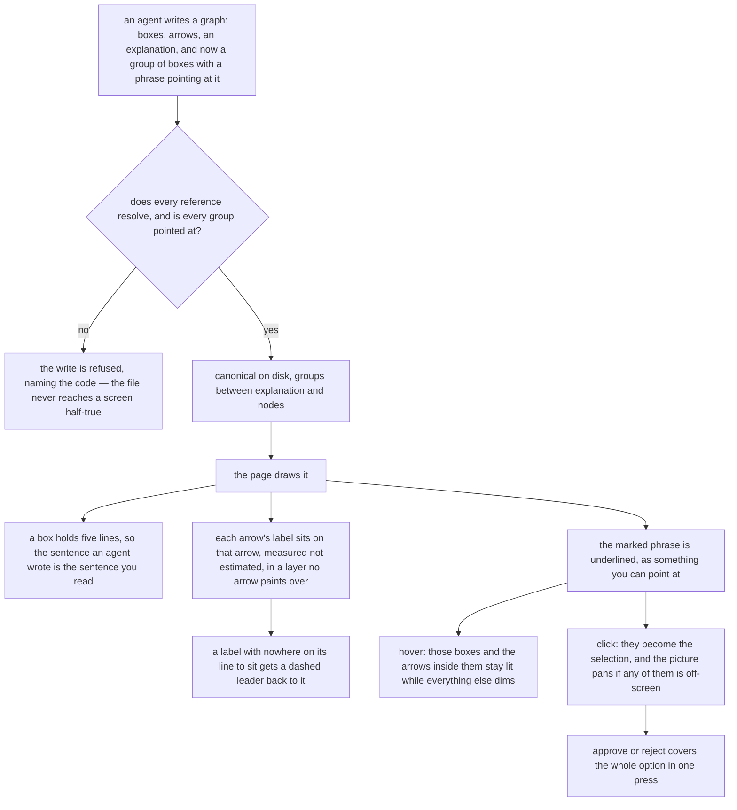

# Completion Report — A graph you can read without touching it

Written for a hostile reviewer: every claim checkable, no claim without evidence. Every line
reference is against the branch head, `03d302c`.

Three changes, one aim: get the answer off the screen without a hover, a click, or a guess. What
follows is what a graph now does that it did not before.



## Spec coverage

One row per spec item, no omissions. Every item's origin is `this run` — Prior Work found nothing
in the tree, and that check is recorded in `PLAN.md`.

### How much text a box holds

| Spec item | Origin | Implemented at (file:line) | Validated by |
|-----------|--------|----------------------------|--------------|
| Cap rises from 3 lines to 5 | this run | `viewer/index.html:218` | `browser.spec.js:859` — five lines drawn, no ellipsis |
| The cap is a named constant, not a literal at three call sites | this run | `viewer/index.html:218`, read at `:768`, `:779`, `:925` | grep: no bare `3` line-cap argument remains at any of the three |
| 124-character ceiling, word-based so not a threshold | this run | consequence of `wrapText` (`viewer/index.html:284`) at cap 5 | fixture replacement below, chosen by running `wrapText` not by counting |
| Width stays 200, font stays 12.5px, no per-node width | this run | `viewer/index.html:212` unchanged; `.node-label` at `:89` unchanged | untouched in the diff |
| Height still `max(74, 22+(lines-1)*16+30)` | this run | `viewer/index.html:767-770` | `browser.spec.js:895` measures the drawn box |
| The narrower 16-character first line under a child badge is unchanged | this run | `viewer/index.html:765-766` | untouched in the diff |
| Both truncation escapes stay, gated on `labelTruncated` | this run | `viewer/index.html:778`, tooltip `:899-900`, panel `:1183` | `browser.spec.js:812` (still passes on a longer label) |
| A single token longer than a line still overflows | this run | not fixed — pre-existing | Accepted Risks below |

### How rows are spaced

| Spec item | Origin | Implemented at (file:line) | Validated by |
|-----------|--------|----------------------------|--------------|
| `LAYER_GAP` stays 140; no constant, function or line in `layout`/`placeComponent` moves | this run | `viewer/server.js:422` | `server.test.js:766` — a fresh layout still spaces rows exactly 140 |
| The server changes only where `groups` reaches it | this run | `viewer/server.js:92`, `:103`, `:132`, `:173`, `:908` — and nowhere else | `git diff` of `server.js` touches no layout line |

### The one coupling between the two files

| Spec item | Origin | Implemented at (file:line) | Validated by |
|-----------|--------|----------------------------|--------------|
| A test, not a comment, holds the page's tallest box under the server's row pitch | this run | `browser.spec.js:895` | that test — lays a graph out fresh, measures the drawn box against the real pitch |
| Both constants carry a comment naming the other | this run | `viewer/index.html:213-218`, `viewer/server.js:418-422` | read the two comments |
| `assertNoOverlap`'s hardcoded box becomes 200 by 116, and says why it stays hardcoded | this run | `server.test.js:28-40` | its three layout tests still pass |

### Naming a set of boxes

| Spec item | Origin | Implemented at (file:line) | Validated by |
|-----------|--------|----------------------------|--------------|
| `groups` is the eighth top-level key, between `explanation` and `nodes` | this run | `viewer/server.js:103` | `server.test.js:158` (eight-key assertion), `:166` |
| Sorted by id; entry is exactly `id` then `nodes` | this run | `viewer/server.js:92`, `:103` | `server.test.js:166` |
| Member lists deduplicated and sorted when canonicalizing | this run | `viewer/server.js:93` | `server.test.js:166` — `['store','report','store']` reads back `['report','store']` |
| Omitted `groups` defaults to `[]`; a file predating the key reads back with it | this run | `viewer/server.js:173` | `server.test.js:188` — both halves |
| No `origin`, no `was`, no position; outside the preservation contract | this run | `orderedGroup` (`viewer/server.js:92`) carries two keys and nothing else | `server.test.js:166` byte round-trip |
| `groups` present and not an array → `unknown-schema` | this run | `viewer/server.js:132` | `server.test.js:201` |
| Entry not an object, or id missing/empty/not a string/duplicated → `bad-id` | this run | `viewer/server.js:174-176` | `server.test.js:201` (duplicate id, and a bare string entry) |
| Id outside `^[a-z0-9_-]+$` → `group-bad-name` | this run | `viewer/server.js:179-180` | `server.test.js:201` |
| `nodes` missing / not an array / not strings / empty / naming a non-node → `group-missing-node` | this run | `viewer/server.js:182-184` | `server.test.js:201` — one case per branch, four in all |
| Duplicate members deduplicated, not refused | this run | `viewer/server.js:93` | `server.test.js:166` |
| A group names nodes in this file only; a child-graph id needs no special case | this run | the `nodeIds.has(id)` test at `viewer/server.js:183` | `server.test.js:201` dangling-member case |
| A group never names edges; an arrow with both ends inside lights with it | this run | `groupLitSet` (`viewer/index.html:497`) | `browser.spec.js:1396` — `gate->refuse` lit, `gate->outside` dimmed |

### Pointing at a group from the prose

| Spec item | Origin | Implemented at (file:line) | Validated by |
|-----------|--------|----------------------------|--------------|
| Reference is `[phrase](#group-id)`; only a `#` target counts | this run | `viewer/server.js:54`, `viewer/index.html:225` | `server.test.js:222` (server accepts a plain link), `browser.spec.js:1589` (page draws it as text) |
| The grammar is one expression, stated once and used verbatim by both files | this run | `protocol/graphs.md:137`, copied to `viewer/server.js:54` and `viewer/index.html:225` | the two constants are byte-identical; `browser.spec.js:1589` pins the page to the server's answer |
| Every reference resolves, or `explanation-missing-group` | this run | `viewer/server.js:225-231` | `server.test.js:201` |
| Every group is referenced, or `group-unreferenced` | this run | `viewer/server.js:232-236` | `server.test.js:201` |
| The check lives in `validateGraph`, so a hand-edited file refuses to serve | this run | `viewer/server.js:223-236`, reached by `parseDisk` | inherent to the placement; `server.test.js:188` reads a hand-edited file back through the same path |
| The page builds the markup with `createElement`/`textContent`, never `innerHTML` | this run | `viewer/index.html:735-748` | read the function — no `innerHTML`; `browser.spec.js:1589` proves prose is not parsed as markup |
| A reference renders as the phrase alone, dotted underline in the accent colour | this run | `viewer/index.html:76`, `:741-748` | `browser.spec.js:1589`, `:1396` |

### Pointing at one

| Spec item | Origin | Implemented at (file:line) | Validated by |
|-----------|--------|----------------------------|--------------|
| Hover lights the group's nodes and its interior arrows; transient; never touches the selection | this run | `viewer/index.html:747-748`, `:881`, `:975` | `browser.spec.js:1396` — approve stays disabled, un-lights on leave |
| `syncExplainPanel` guards its rebuild; the hovered group is drawn by `render()` | this run | `viewer/index.html:715-721` | `browser.spec.js:1435` — the hovered span is the same DOM node before and after |
| The guard keys on the explanation **and** `groups`; a rebuild clears hover state | this run | `viewer/index.html:715-718` | `browser.spec.js:1536` |
| A marked phrase stores only its group id; members resolve at hover/click time | this run | `viewer/index.html:743`, resolved at `:1370-1371` and `:510` | `browser.spec.js:1536` — the assertion that catches a captured list |
| The lit set is a pure helper, never `effectiveSelectionIds` | this run | `viewer/index.html:497-504` | read it — no module state touched; `browser.spec.js:646` still passes, so suppressions survive |
| Its own class and treatment; must not reuse `.selected` | this run | `viewer/index.html:157-166` (`group-dim`) | `browser.spec.js:1396` |
| Dimming reaches the label layer too | this run | `viewer/index.html:165-166`, `:1117-1118`, `:1129`, `:1136`, `:1165` | `browser.spec.js:1396` — includes the label layer's `was-mark` |
| Click goes through a new entry point, not `pick`; sets `selectedIds`, clears `impliedRemoved` | this run | `viewer/index.html:509-518` | `browser.spec.js:1465` |
| Arrows come along through `effectiveSelectionIds`; `applyOrigin` unchanged | this run | no change at `viewer/index.html:551-552` | `browser.spec.js:1465` — approve rules the arrow, an already-ruled member untouched |
| Click centres the bounding box when a member is off-screen, moves nothing otherwise; zoom never changes | this run | `viewer/index.html:523-542` | `browser.spec.js:1497` |
| Hover never moves the viewport | this run | the hover path (`viewer/index.html:747`) touches no `view` | read it; `browser.spec.js:1396` |
| Escape unchanged; nothing new bound to it | this run | `viewer/index.html:667-668` untouched | untouched in the diff |

### Where an arrow's label goes

| Spec item | Origin | Implemented at (file:line) | Validated by |
|-----------|--------|----------------------------|--------------|
| Offsets run 0 to 144 in steps of 16; offset 0 emitted once | this run | `viewer/index.html:1082-1089` | `browser.spec.js:241` — every crowding-fixture label now sits on its own line |
| The collision rectangle is measured: `max(24, measured + 14)` | this run | `viewer/index.html:1069-1070` | `browser.spec.js:212` — each background is exactly its text width plus 14 |
| Cached in a `Map` keyed by label string, filled from one reused hidden element; not batched | this run | `viewer/index.html:810-822` | read it — one `Map`, one element, no second pass |
| The measurer takes `.label-metric`, sharing only the font declaration | this run | `viewer/index.html:136`, `:146`, `:1349` | `browser.spec.js:191` — the label count still equals the edge count |
| `visibility: hidden`, never `display: none`; re-created after each canvas clear | this run | `viewer/index.html:146`, `:1349` | `browser.spec.js:212` would read zero widths if either were wrong |
| Labels move into one layer appended after every edge group | this run | `viewer/index.html:1393`, `:1396` | `browser.spec.js:241`, `:291` locate labels outside `g.edge` |
| Everything from the label's geometry moves with it: label, background, `was-mark`, leader | this run | `viewer/index.html:1124-1155` | `browser.spec.js:1396` finds the `was-mark` in the layer by `data-id` |
| CSS flattens onto standalone classes; origin, selection and group state set on the element | this run | `viewer/index.html:130-141`, set at `:1115-1119` | `browser.spec.js:212`, `:1396` |
| Clicking a label still selects its edge | this run | `viewer/index.html:1143-1144` | `browser.spec.js:681` (unchanged, still passes) |
| Hovering a label still reveals its edge's handles | this run | `viewer/index.html:122`, toggled at `:1148-1149` | `browser.spec.js:719` |
| Two-tier fallback: clears boxes first, segment midpoint only if none does | this run | `viewer/index.html:1100-1104` | read it; the ordering is explicit |
| A leader is drawn when the rectangle does not intersect its own segment; no threshold constant | this run | `viewer/index.html:829` (the test), `:1124-1131` (the draw) | `browser.spec.js:241`, `:291` |
| Dashed, the edge's verdict colour, beneath the opaque background | this run | `viewer/index.html:151-154`, appended before the background at `:1129` | `browser.spec.js:291` asserts the dashes and the geometry |

### The refusals, `PUT /view`, and the protocol document

| Spec item | Origin | Implemented at (file:line) | Validated by |
|-----------|--------|----------------------------|--------------|
| All six refusal codes | this run | `viewer/server.js:132`, `:176`, `:180`, `:184`, `:229`, `:234` | `server.test.js:201` — one input per code |
| `PUT /view` refuses a changed `groups`, compared on canonical bytes not identity | this run | `viewer/server.js:908-912` | `server.test.js:277` — **both** halves, including an untouched round-trip |
| `protocol/graphs.md` carries the mechanics | this run | `protocol/graphs.md:55`, `:120-157`, `:229`, `:239`, `:249`, `:563-571` | its schema example was written through a real server and read back with `groups` intact (Log) |
| The 124-character budget in the `label` entry | this run | `protocol/graphs.md:161-166` | read it |
| `explanation`'s preservation sentence extends to `groups` | this run | `protocol/graphs.md:114-119` | read it |
| A purpose paragraph and a bolded imperative, so the feature is used and not just documented | this run | `protocol/graphs.md:123-127` and `:405-409` | read them |

### Non-goals, all held

| Spec item | Origin | Evidence |
|-----------|--------|----------|
| Node label wording untouched | this run | no change to any label rule |
| The Sugiyama layout untouched entirely | this run | `git diff` of `viewer/server.js` touches no line in `layout` or `placeComponent` |
| Node width does not vary | this run | `NODE_W` is still a constant (`viewer/index.html:212`) |
| Nothing lets a person create, rename or connect in the browser | this run | `browser.spec.js:937` (unchanged, still passes) |
| Groups do not nest, span files, or carry a verdict | this run | `[^\[\]]+` cannot nest; `group-missing-node` confines members to this file; `orderedGroup` carries no verdict field |
| The selection model is not reworked | this run | `pick`, `effectiveSelectionIds` and `applyOrigin` are untouched |

### Existing tests the Spec said would move — all moved, none discovered failing

| Test | Moved to | Evidence |
|---|---|---|
| `assertNoOverlap`'s hardcoded box | 200 by 116 | `server.test.js:28-40` |
| Byte-for-byte round-trip fixtures | both gained `"groups": []` | `server.test.js:141`; `canonical.json:7`, `noncanonical.json:23` |
| The canonical key-order assertion | eight keys | `server.test.js:158` |
| The `edgeLabel` helper | dropped its `g.edge` scope | `browser.spec.js:93` |
| The long-label truncation fixture | a label `wrapText` still truncates at cap 5 | `long-label.json`, asserted at `browser.spec.js:812` |
| The no-label-on-a-box assertion | `.edge-label` → `.edge-label-bg` | `browser.spec.js:180` |

## Deviations from plan

Five, all lead decisions taken at integration, each with its reason.

**A second label fixture and a test the Spec's Validation does not list.** The Spec's assertion is
that every label "either intersects its own segment or carries a leader line to it". After the
change, all six labels on the crowding fixture sit on their own line and no leader is drawn at all
— measured, and recorded in the Log. That assertion therefore passes wholly on its first branch
and the leader path runs in no test. `viewer/test/fixtures/label-leader.json` crowds two rows hard
enough that some labels cannot sit on their line, and `browser.spec.js:291` asserts every leader
lands on the line it points at, starts under its own label, and is dashed. Found by probing three
shapes: a vertical row-skipping edge does **not** do it, because the corridor between rows is 66
pixels and a label is 18.

**`noncanonical.json` gained `"groups": []` out of canonical position**, not "between `explanation`
and `nodes`" as the Spec's Validation says. That fixture's entire job is to be out of order, and
the lane had additionally moved its `title` and `explanation` into canonical position, which
weakens the test that reads it. Reverted, and the new key placed among the other out-of-order ones.

**`CHILD_NAME` is renamed `BARE_NAME`** (`viewer/server.js:51`). The Spec says a group id uses "the
same shape `CHILD_NAME` already requires"; the implementation reuses the constant itself, which
left a group id being checked against something named for child graphs. Two other call sites, both
renamed.

**Extra refusal inputs beyond one per code.** `group-missing-node` has five triggers and the lane
tested only the empty-list one. `server.test.js:201` now drives the dangling-member, non-string and
missing-`nodes` cases as well, plus a non-object group entry for `bad-id`.

**The label layer's `was-mark` dims with its edge** (`viewer/index.html:1165`). The Spec says
everything outside a lit group dims. Because that dot is drawn into the label layer rather than
into `g.edge`, it was the one piece of a dimmed edge left at full brightness. Covered at
`browser.spec.js:1416`.

## Routers

**None.** `AGENTS.md:51` describes `viewer/` as "the browser graph viewer — `index.html`,
`server.js`", and this change added no file at that level: the two new fixtures live inside
`viewer/test/fixtures/`, which no router enumerates. `protocol/AGENTS.md:32` describes `graphs.md`
as "the graph format read by both harnesses — schema, verdicts, preservation, how the viewer
starts", and `groups` is part of the schema that line already covers. `AGENTS.md:68` claims
`viewer/` is "two files", still true. No ownership moved between directories and no router named a
file this change touched, so nothing here became false.

## Validation evidence

Both commands from the Spec's Validation section, run by the lead on the branch head after every
lane landed — not the lanes' own reports.

```
$ node --test 'viewer/test/*.test.js'
ℹ tests 36
ℹ suites 0
ℹ pass 36
ℹ fail 0
ℹ cancelled 0
ℹ skipped 0
ℹ todo 0
ℹ duration_ms 20260.952317
```

30 before this change, 36 after: six new server tests (`server.test.js:166`, `:188`, `:201`,
`:222`, `:277`, `:758`).

```
$ npm --prefix viewer run test:browser
  ✓  33 › hovering a marked phrase lights the group and dims everything outside it, leaving approve disabled (294ms)
  ✓  34 › hovering a marked phrase does not rebuild the panel (294ms)
  ✓  35 › clicking a marked phrase selects exactly the group, approves it, and leaves an already-ruled member untouched (398ms)
  ✓  36 › clicking a group with a member off-screen brings it into view without changing zoom (863ms)
  ✓  37 › a redraw that changes a group's nodes while the explanation stays byte-identical relights and rules the new membership (2.4s)
  ✓  38 › the page renders a non-# markdown link as plain text, not a marked phrase (200ms)
  38 passed (26.2s)
```

26 before this change, 38 after. Real Chromium; the suite fails loudly rather than skipping when
the browser is missing, and nothing was skipped.

```
$ git status --short
?? docs/plans/graph-legibility/
```

The working tree is otherwise clean: every source change is committed.

One-off proof, deliberately **not** added to the suite — the schema example in
`protocol/graphs.md` was extracted and written through a server started by the suite's own helper.
It returned 200 and read back with `groups` between `explanation` and `nodes`, members intact. A
first attempt at the same check was invalid because it reached a viewer server already running on
this machine from the pre-merge tree, which accepted the write and silently dropped the key it did
not know; the helper isolates its cache root and does not have that problem. Recorded in the Log.

## Known gaps / residual risks

The three risks the plan accepted, unchanged and still accurate:

- A node label containing a single unbroken token of 25 or more characters overflows its box with
  no ellipsis, and for a label shaped `the <90 characters> thing` gets neither the tooltip nor the
  detail panel, because `wrapText` splits on whitespace (`viewer/index.html:286`). Pre-existing and
  untouched.
- Between two boxes that both need all five lines, in adjacent rows, on a near-vertical edge, the
  label cannot sit at the midpoint of its own segment — it lands at 0.76 along it instead. Off
  centre, not ambiguous.
- A node and an edge may legally share an id and the page keeps one flat set of selected ids
  (`viewer/index.html:248`), so selecting a group's node also renders an identically-named edge as
  selected. Pre-existing; the verdict still lands only on the node.

Two more this run introduced or exposed:

- **Paint order inside the label layer is still by edge.** Each edge appends its leader,
  background, label and `was-mark` in sequence, so a *later* edge's opaque background can cover an
  *earlier* edge's `was-mark`. Reaching it needs two labels overlapping, which now only happens in
  the second fallback tier. Strictly better than before, where any later arrow's line could cross
  any earlier label; not eliminated.
- **The leader test's fixture depends on the layout crowding it the same way.** If the Sugiyama
  pass ever spaces those two rows differently, no label may be forced off its line. That fails
  loudly rather than silently — `browser.spec.js:291` asserts at least one leader exists — but the
  failure would read as a leader bug when it is a layout change.

## Remediation rounds

None yet — Stage 4 appends here.
