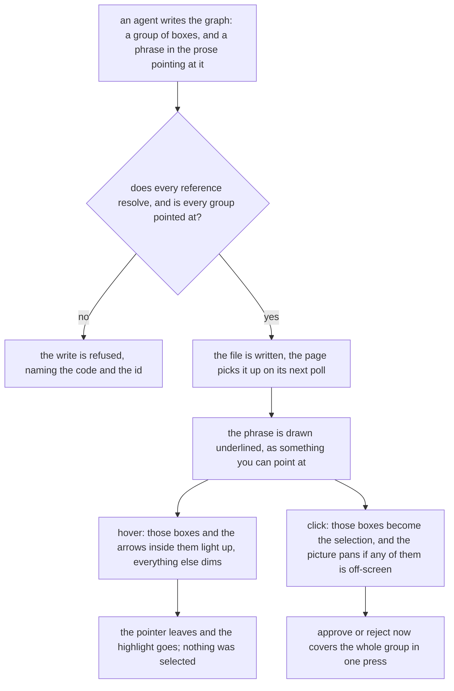
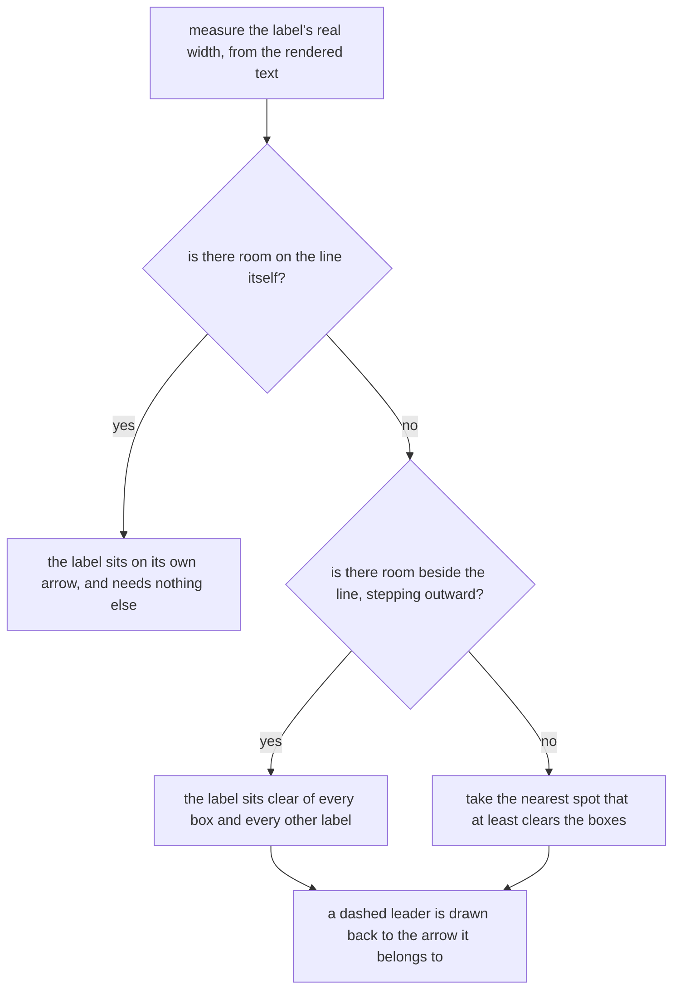

# A graph you can read without touching it

**Idea:** `IDEA.md` — what this is for and why, in plain language. Read it first; it is
the north star this plan serves. Goal and Constraints live there, not here, so they don't
get buried as this file grows.

## Open Questions

Ordered by leverage; discussed one at a time. A settled question moves to the Decision
Log and is deleted from here.

None — all settled. See the Decision Log.

## Watch List

Things noticed that need looking into — not yet decisions for the user. Written down the
moment they're spotted so they can't be forgotten, surfaced to the user one line at a
time as they appear, and emptied before Stage 1 exits.

| # | Noticed | What needs looking into | Raised to user? | Outcome |
|---|---------|-------------------------|-----------------|---------|
| 1 | Q1 drafting | `assertNoOverlap` hardcodes a 200x84 box (`viewer/test/server.test.js:30`) and gates three layout tests. | mentioned | settled — the box becomes 200x116; the row-spacing half was superseded by Decision 24, which leaves the gap at 140 |
| 2 | Q1 drafting | Taller boxes eat the gap between rows, which is where the edge-label search finds clear air (`viewer/index.html:847`). | mentioned | superseded by Decision 24: a 116px box never overlapped a 140px gap, so the corridor narrows to 24px and the gap does not move |
| 3 | Q5 drafting | The label's collision rectangle is estimated as `text.length * 6.2 + 14` (`viewer/index.html:843`) against proportional 11px text. | no | settled — measured with `getComputedTextLength()` instead; see Decision 5 and the Spec |
| 4 | Q2 drafting | The explanation panel is a fixed 84 pixels tall and scrolls (`viewer/index.html:70-72`). A marked phrase can be scrolled out of sight while the boxes it names are lit. | no | settled — no defect: a hover highlight ends when the pointer leaves the phrase, and a clicked selection lives on the canvas, so scrolling or collapsing the panel cannot strand a highlight |
| 5 | Q2 drafting | A group naming an id in a child graph has no meaning — edges already connect siblings only. | no | settled — a group names ids in its own file and the server refuses anything else; see Decision 9 |

## Decision Log

Append-only. A reversal is a new entry superseding the old, never an edit.

| # | Decision | Rationale | Source |
|---|----------|-----------|--------|
| 1 | The bar is "the labels agents actually write fit", not "every label fits". A genuine outlier still truncates and is still rescued by the hover tooltip and the detail panel. | Fitting any length drags the whole picture out of scale for one bad label. Collin ruled this directly. | user |
| 2 | A group carries no verdict of its own. It is agent-owned like the explanation: rewritten freely on every redraw, outside the preservation contract. | A verdict-bearing group would need its own preservation rules against a contract built entirely on node and edge ids, for a thing that exists to be pointed at. | defaulted |
| 3 | `PUT /view` refuses any change to groups, exactly as it refuses a change to the explanation (`viewer/server.js:858`). | Groups are the agent's claim about its own prose; the page writes positions and verdicts only. | defaulted |
| 4 | A graph carrying no groups and a plain explanation draws exactly as it does today. | Every graph on disk predates this change; a format addition that alters how old files render is a migration nobody asked for. | defaulted |
| 5 | The edge label's collision rectangle is measured from the rendered text, not estimated from its character count. | The estimate is wrong by construction against a proportional font, and a search testing the wrong rectangle can call an overlapping spot clear. | defaulted |
| 6 | A label wraps to at most **5** lines of 24 characters — 120 characters, up from 72 — and the server's row spacing rises from 140 to 170. Width, font size, and per-node width are all unchanged. | 5 lines clears the measured 91-character case by 29 rather than by 5. Raising the row spacing keeps the between-row corridor at 54 pixels, the same clear air the arrow-label search has today; without it the corridor drops to 24 and this change would pay for itself out of the arrow-label fix. Width was rejected as the expensive lever: it needs a width function in two files that share no code, and a wider graph opens zoomed further out. | user |
| 7 | The coupling between the page's tallest possible box and the server's row spacing is held by a test, not only by comments: the browser suite renders a 5-line label and asserts the box stands clear inside the spacing the server laid out. Each constant also carries a comment naming the other. | The two files share no code, so nothing structural stops one number moving without the other. A comment is a note; a failing test is a stop. | defaulted |
| 8 | A group is a named set of node ids living in a new top-level `groups` array, and the explanation references it by name. Character offsets into the prose were rejected. | A name makes the second mention of a group free instead of a second chance to get the list wrong, and it gives the server something checkable at write time. Offsets break silently the moment an agent rewords the sentence. | user |
| 9 | A group names node ids in its own file only. An id that is not a node in the same graph is refused at write time, as is a reference in the prose to a group name that does not exist. | The format already refuses a dangling edge (`edge-missing-node`), and a group is the same kind of claim. Refusing at write time is what Decision 8 was chosen for. | defaulted |
| 10 | A group names nodes, never edges. An arrow whose two ends are both in the group lights up with it, reusing the rule the page already applies to selection (`viewer/index.html:388`). | An explicit edge list is a second thing to keep in sync for a highlight that reads wrong without it anyway, and the page already decides exactly this question for selection. | defaulted |
| 11 | The server parses the explanation far enough to resolve group references, so a dangling reference is a refused write rather than prose that quietly renders as plain text. | Decision 8 was taken partly for write-time checking; leaving the parse entirely to the page would give up the thing it bought. | defaulted |
| 12 | Hovering a marked phrase lights its boxes and the arrows inside; clicking makes them the selection, so approve or reject covers the option in one gesture; Escape clears, as it already does. Hover never changes the selection. | Highlighting alone leaves the option to be box-selected by hand, which is the work the group existed to remove. A hover that selected would thrash the selection as the pointer crossed the panel, so selecting forces the click. | user |
| 13 | The edge-label placement search starts **on** the line and steps outward, rather than starting 53 to 74 pixels off it. A label that still cannot sit on its line gets a dashed leader line back to it. Hover-linking was not taken. | No label sits on its own arrow today: the nearest candidate is already half the taller box plus 16 off to one side, and Decision 6 pushes that to 74. Fixing where labels start removes the ambiguity for most of them instead of annotating it, and it keeps leader lines rare enough to mean something. The offset's original reason — a centred label landing inside a box — was spent when PR #2 seeded the search with every box. | user |
| 14 | Row spacing is adaptive, not a constant: each row sits below the tallest node in the row above plus a fixed 56-pixel corridor. `LAYER_GAP` is deleted. This supersedes the "row spacing rises to 170" half of Decision 6; the 5-line cap stands. | A flat gap is wrong in both directions — too tight for a five-line box, needlessly loose for a graph of short ones — and raising it shrinks the whole picture, because `fitToView` binds on the height term on any wide screen (`viewer/index.html:487-489`). Measured: a six-row graph of short labels becomes 724 pixels against today's 784, opening at full size where a flat 170 opened at 0.83. | user |
| 15 | `viewer/server.js` gains the page's `wrapText`, `firstLineCap` and `nodeHeight` verbatim, `main()` is guarded with `require.main === module`, and the file exports `nodeHeight`. | Adaptive spacing needs the server to know box heights. The two files share no module, so the rule is duplicated deliberately; the guard and the export are what let both test suites assert against one rule rather than restating it a third time. | user |
| 16 | The edge-label offset ladder runs 0 to 144 in steps of 16, not 0 to 80. | Round 1 caught that the proposed ladder reached 80 where today's reaches `baseOff` plus 80 — 133 for a small box. Starting on the line without extending the ladder would have cut the search's reach by a third. | review-round-1 |
| 17 | A leader line is drawn when the label's rectangle does not intersect its own line segment. The 32-pixel threshold is deleted. | The threshold did not test what it claimed: whether a label touches its line depends on width and angle. Measuring the width makes the exact test available, and it is simpler than the constant it replaces. | review-round-1 |
| 18 | The page builds the marked-up explanation with `createElement` and `textContent`, never `innerHTML`. | The explanation is agent-written and the page holds a token that can write verdicts, so string-to-HTML there would let an agent's prose run script inside the one surface enforcing "only a person rules". | review-round-1 |
| 19 | `PUT /view` compares `groups` by canonical bytes, not by identity. | `checkViewChanges` compares `explanation` with `!==` (`viewer/server.js:862`); the same operator on an array is always true, because the page round-trips a `deepClone`. Copying the analogy would have made the page unable to write anything at all. | review-round-1 |
| 20 | The hover highlight is applied by toggling classes on existing node and edge groups, never by calling `render()`. | `render()` calls `syncExplainPanel()` first (`viewer/index.html:1045`), which rewrites the panel body and would destroy the span the pointer is on, firing `mouseleave` and clearing the highlight that caused the render. | review-round-1 |
| 21 | Clicking a phrase pans the canvas until every member of the group is visible, keeping the current scale. Hover never moves the viewport. | The idea's bar is that you never count boxes to find what was meant; a lit group entirely off-screen fails it. Panning without zooming keeps the gesture predictable. | review-round-1 |
| 22 | Group id character set is `^[a-z0-9_-]+$`, the same shape `CHILD_NAME` already uses for child graph names (`viewer/server.js:48`). | Without it an id containing `)` or `]` is legal but unreferenceable in `[phrase](#id)`, and the server and page parsers could disagree about where the reference ends. | review-round-1 |
| 23 | Duplicate ids inside a group's member list are deduplicated when canonicalizing, not refused. | A repeated id names the same box, so refusing adds a code for a harmless mistake; deduplicating keeps canonical bytes deterministic either way. | review-round-1 |
| 24 | `LAYER_GAP` stays at **140** and the server is not changed at all. This supersedes Decisions 14 and 15: no adaptive spacing, no `ROW_CORRIDOR`, no duplicated `wrapText`/`firstLineCap`/`nodeHeight` in the server, no `require.main` guard, no export. | A five-line box is 116 pixels and the gap is already 140, so tall boxes never overlapped — the premise behind both the flat-170 and the adaptive proposals was wrong. Measured with consistent assumptions, a six-row all-five-line graph is 816 pixels at 140 and opens at 0.98, against 976 and 0.82 adaptive; in the common case of short labels both open at full size, so adaptive bought nothing observable and cost a fifth of the scale on the case this change is for. | user |
| 25 | The hover highlight computes its lit set with a pure helper, never `effectiveSelectionIds`. | That function reads module-level `selectedIds` and mutates `impliedRemoved` (`viewer/index.html:397`), so hovering would silently discard every shift-click edge suppression. | review-round-2 |
| 26 | Clicking a group whose bounding box does not fit the viewport at the current scale centres that bounding box instead of pretending every member can be brought inside. Zoom is still never changed. | The Spec otherwise states an unachievable postcondition, reachable at the 2.5x zoom ceiling, and leaves the worker to invent the fallback. | review-round-2 |
| 27 | The label-placement fallback is two-tier: the first candidate clearing node boxes only, and the segment midpoint just if none does. | The plain midpoint is, for a row-skipping edge, the spot most likely to sit inside a box — inverting the priority that seeding the search with every box was added for. | review-round-2 |
| 28 | The highlight uses its own class and treatment — dimming everything outside the group — and must not reuse `.selected`. | Reusing the selection's accent stroke would make a hover look identical to a selection while the approve button stays disabled. | review-round-2 |
| 29 | `syncExplainPanel` guards its rebuild on the explanation string having changed; the hovered group lives in module state and is drawn by `render()` like every other class. Supersedes Decision 20's side path. | Routing the highlight around `render()` meant a second copy of its class logic kept in step by hand. Guarding the one unconditional rebuild removes the reason the side path existed. | review-round-3 |
| 30 | Label widths are cached lazily in a `Map` keyed by the label string; the measurement is not batched into a separate pass. | The cache already makes every `pointermove` render measure nothing, so batching buys one first render and costs splitting `renderEdgeGroup` into two phases. | review-round-3 |
| 31 | Clicking a group centres its bounding box when any member is off-screen, and moves nothing when all are visible. Supersedes Decision 26's separate does-not-fit branch. | Centring is one rule covering both cases, and it reuses the bounding-box arithmetic `fitToView` already has. | review-round-3 |
| 32 | The line cap is a named constant read by all three call sites, not a literal repeated three times. | The Spec spends a section on the page/server coupling being unstructural while leaving the page's own three copies of the same number equally so. | review-round-3 |
| 33 | The browser suite asserts the page's reference parser agrees with the server's on the `#`-only rule. | The grammar is parsed in both files, and IDEA names duplicating a rule across them as how the two get to disagree. | review-round-3 |
| 34 | Correcting the scope of two earlier entries rather than editing them: Decision 24's "the server is not changed at all" means its **layout**, since `groups` reaches `validateGraph`, `canonicalBytes` and `checkViewChanges`; and Decision 21's "until every member is visible" is superseded by Decision 31, which centres a group too large to fit rather than promising it fits. | The log is append-only, so a wording that reads wider than what was decided is corrected by a new entry, not by rewriting the old one. | review-round-4 |
| 35 | A marked phrase stores its group id only and resolves members from the current graph at hover or click time; the panel-rebuild guard keys on the explanation string and `groups` together. | `groups` can change while the prose stays byte-identical, and polling swaps the graph without another signal, so captured member lists would light and rule the previous membership. | review-round-4 |
| 36 | Edge labels move into a single layer appended after every edge group, and their CSS moves off `.edge` descendant selectors onto standalone classes. | Labels currently live inside their own edge group appended in id order, so a later arrow paints over an earlier label — likely now that labels sit on their own segments, invisible to a search that tests boxes and labels but never lines. Flattening the selectors is also what makes the hidden width-measuring element inherit the right font. | review-round-4 |
| 37 | The reference grammar is a single regular expression stated once in `protocol/graphs.md`, and the server checks it in both directions: every reference resolves, and every group is referenced. | One expression with the id charset as its capture group leaves nothing for the two files to disagree about, and the second direction catches a defined-but-unreferenced group — the silent no-op the design exists against, which nothing previously refused. | review-round-4 |
| 38 | The reference grammar captures the phrase as well as the id: `\[([^\[\]]+)\]\(#([a-z0-9_-]+)\)`. Supersedes the suffix-only expression in Decision 37. | A suffix-only expression cannot tell the page which words form the phrase, and accepts bracket-less prose as a satisfied reference while the page finds nothing to mark. The character class also makes "does not nest" a property of the expression rather than a sentence each file reads separately. | review-round-5 |
| 39 | The width measurer takes its own `.label-metric` class sharing the font declaration with `.edge-label`, rather than being a hidden `.edge-label`. | A hidden element sharing the class is counted by the existing per-edge label assertion and matched by this Spec's own background check, which it fails for having no background. A shared font declaration keeps the 11px without the collision. | review-round-5 |
| 40 | Everything drawn from a label's geometry moves to the label layer — the label, its background, its `was-mark` and its leader line — and the label carries origin, selection and group-highlight state plus a hover toggle that reveals its edge's handles. | Leaving any of them in the edge group re-exposes it to the over-painting the move exists to fix, and the hover affordance the CSS comment names as one of three ways an edge is reachable would otherwise disappear silently. | review-round-5 |

## Spec

The settled design. Bar: a fresh agent with no conversation history can implement from this
section alone.

Two of the three changes have a shape worth drawing. The five-line cap does not — it is a
number, and the prose below carries it.

A group, from the agent writing it to a verdict landing on it. Everything here is said in prose
below; the picture is the same thing in one look.



Where an arrow's label ends up. The search prefers its own line, and draws a leader only when it
cannot sit there.



### How much text a box holds

A node label wraps to at most **5 lines of 24 characters**, up from 3. The most a box can hold is
**124 characters** — five 24-character words plus the four spaces at the line breaks, verified by
running `wrapText`; 126 truncates. That is a ceiling and not a threshold: wrapping is word-based,
so a 119-character label of six-letter words can truncate while a 124-character one of longer
words fits. Box
width stays 200, the label font stays 12.5px, and no node's width varies with its content. The
three call sites passing `3` as the line cap (`viewer/index.html:607`, `:618`, `:709`) stop
carrying a literal at all: the cap becomes a named constant beside `NODE_W`
(`viewer/index.html:169`) and all three read it, so the page's own copies cannot drift from each
other. Nothing else about `wrapText` changes, including the narrower 16-character first line
reserved on a node carrying a child graph.

Height still follows the lines a label actually uses, `max(74, 22 + (lines-1)*16 + 30)`,
unchanged. A short label draws a 74-pixel box; only a label needing all five lines reaches 116.
Raising the cap does not make every box taller.

A label `wrapText` cannot fit truncates with an ellipsis, and both existing escapes stay:
the native tooltip on the box (`viewer/index.html:684`) and the full label in the detail panel
(`:891`), each gated on `labelTruncated`.

One shape falls outside that. `wrapText` splits on whitespace, so a single token longer than a
line is never broken and never ellipsized — it overflows its box, and for a label shaped like
`the <90 characters> thing` even `labelTruncated` returns false, so it gets neither escape. This
is pre-existing and this change neither causes nor fixes it. See Accepted Risks.

### How rows are spaced

**Nothing changes.** `LAYER_GAP` stays at 140 (`viewer/server.js:376`) and the server's **layout**
is not modified by this plan at all. The server does change elsewhere — `groups` reaches
`validateGraph`, `canonicalBytes` and `checkViewChanges` — but no constant, function or line in
`layout` or `placeComponent` moves.

The premise that taller boxes force the gap open was wrong. A box needing all five lines is 116
pixels — `max(74, 22 + 4*16 + 30)` — against a 140-pixel row pitch, so there is 24 pixels of
clear air and boxes never overlap. Measured on a 1080-pixel screen, a six-row graph whose labels
all use five lines is 816 pixels tall and opens at 0.98; the same graph under a flat 170 gap is
966 and opens at 0.83, and under adaptive spacing 976 and 0.82. Raising the gap would have made
the case this change exists for open smaller, because `fitToView` scales by
`min(availW/contentW, availH/contentH)` capped at 1 (`viewer/index.html:487-489`) and a graph of
a few columns binds on the height term. That is shape-dependent, not universal — a 6-row
3-column graph binds on height at 1.03 against a width term of 2.50, while a 3-row 8-column graph
binds on width at 0.89.

What the taller box does cost is the corridor between rows: 24 pixels under a row containing a
five-line box, against 66 under a row of short ones. An edge label is 18 pixels tall, so it fits
with three either side. That corridor is also no longer the primary place a label goes — labels
now start on their own segment (below) and reach the corridor only as a fallback.

### The one coupling between the two files

The page's tallest possible box must stay under the server's row pitch, and the two files share
no module, so nothing structural stops one number moving without the other. This is held by a
test, not a comment: the Chromium suite lays out a graph fresh containing a label that needs all
five lines and asserts the drawn box height is less than the vertical distance the server put
between consecutive rows. Both numbers also carry a comment naming the other.

`assertNoOverlap` (`viewer/test/server.test.js:30`) hardcodes the drawn box as 200 by 84; it
becomes 200 by 116, the new maximum. It stays a hardcoded pair: `viewer/server.js` exports
nothing and calls `main()` unconditionally (`:1200`), the suite spawns it as a child process
rather than requiring it (`viewer/test/helpers/server.js:88`), and the page's own `nodeHeight` is
sealed inside an IIFE (`viewer/index.html:165`) — so there is nothing to import, and adding an
export purely for this test is the module-shape change Decision 24 removed. Its three layout
tests otherwise stand.

### Naming a set of boxes

`groups` is an **eighth** top-level key — the canonical object holds seven today
(`viewer/server.js:87`). It sits after `explanation` and before `nodes` in the canonical key
order (`viewer/server.js:86`), sorted by id like `nodes` and `edges`, and defaults to `[]` when a
write omits it. A group entry has exactly two keys, `id` and `nodes`, in that order.

A group carries no `origin`, no `was`, and no position: it is the agent's claim about its own
prose, rewritten freely on every redraw and outside the preservation contract entirely, exactly
as `explanation` is.

Validation, in the order `validateGraph` (`viewer/server.js:110`) should check it:

- `groups` absent → `[]`. Present and not an array → `unknown-schema`, matching how the other
  top-level type errors are reported.
- An entry that is not an object, or whose `id` is missing, empty, not a string, or duplicated
  within `groups` → `bad-id`. Groups are a third id namespace alongside nodes and edges and reuse
  the existing code, as those two already share it (`viewer/server.js:129`, `:162`).
- An `id` outside `^[a-z0-9_-]+$` → `group-bad-name`. This is the same shape `CHILD_NAME`
  (`viewer/server.js:48`) already requires of a child graph name, and it exists because the
  reference syntax below uses `)` as a terminator: without it an id containing `)` or `]` is
  legal but unreferenceable, and the server's parser and the page's could disagree about where a
  reference ends.
- `nodes` missing, not an array, not an array of strings, empty, or naming an id that is not a
  node in this file → `group-missing-node`. An empty list is included deliberately: a group that
  highlights nothing is the silent no-op this design exists against.
- Duplicate ids inside one group's `nodes` are **deduplicated**, not refused — a repeated id names
  the same box. Member lists are deduplicated and sorted when canonicalizing.

A group names nodes in its own file and nothing else. An id in a child graph needs no special
case: it is not a node in this file, so `group-missing-node` already covers it.

A group never names edges. An arrow with both ends inside the group lights up with it, reusing
the rule the page already applies when a selection covers both endpoints
(`viewer/index.html:388`), so one place decides what "this region" means rather than two that can
disagree.

### Pointing at a group from the prose

A reference is written `[the left branch](#left-branch)`: the bracketed phrase is what the reader
sees and points at, the target is `#` followed by a group id.

Only a `#`-prefixed target is a reference. `[the router](protocol/routers.md)` and
`[here](https://example.com)` are literal text, which is what stops ordinary prose becoming a
write refusal. A `#`-prefixed reference naming a group not in `groups` draws
`explanation-missing-group`. Nesting is excluded by the expression itself — `[^\[\]]+` cannot span a bracket — so there is no
separate rule for the two files to read differently.

The grammar is exactly one regular expression, stated once in `protocol/graphs.md` and used
verbatim by both sides:

```
\[([^\[\]]+)\]\(#([a-z0-9_-]+)\)
```

Capture 1 is the phrase the reader points at, capture 2 the group id. It has to carry the phrase,
not just the `](#id)` suffix: the page needs the phrase to build the span, and a suffix-only
expression would accept bracket-less prose like `orphan](#left)` as a satisfied reference while
the page found nothing to mark — a defined group highlighting nothing, which is what
`group-unreferenced` exists to refuse. `[^\[\]]+` is also what makes "does not nest" a property
of the expression rather than a sentence the two files interpret separately.

The server checks it in **both** directions. Every captured id must name a group in `groups`, or
the write draws `explanation-missing-group`. And every group in `groups` must be captured at least
once, or it draws `group-unreferenced` — a group nothing points at highlights nothing, which is
the same silent no-op an empty member list is refused for.

The check lives in `validateGraph`, beside `edge-missing-node` (`viewer/server.js:192`). Because
`parseDisk` runs `validateGraph` on every read (`viewer/server.js:242`), a hand-edited file
carrying a dangling reference refuses to **serve**, not merely to save. That is the existing
precedent — a hand-edited dangling edge or bad `kind` behaves the same way — and it is the right
side to fail on: a broken file that says so beats one that opens and lies.

**The page builds the marked-up explanation with `createElement` and `textContent`, never
`innerHTML`.** The explanation is agent-written, and the page holds a token that can write
verdicts, so turning that string into HTML would let an agent's prose execute script inside the
one surface enforcing "an agent proposes, only a person rules". Today `explainBody.textContent`
(`viewer/index.html:591`) is that barrier; `innerHTML` is already used in the same file
(`:539`, `:568`), so the pattern is at hand and the prohibition has to be written down.

The page renders a reference as the phrase alone, carrying a dotted underline in the accent
colour so it reads as pointable. That marker is the only visual difference from surrounding
prose.

### Pointing at one

Hovering a marked phrase lights the group's nodes and every arrow with both ends inside it. The
highlight is transient — it goes when the pointer leaves — and never touches the selection, so
the approve and reject buttons do not change state on a hover.

**`syncExplainPanel` gains a guard, and that is what makes the rest ordinary.** Today it rewrites
the panel body with `textContent` on every call (`viewer/index.html:591`) and `render()` calls it
first (`:1045`), so a highlight drawn through `render()` would destroy the span the pointer is on,
fire `mouseleave`, clear the highlight and re-render. Rather than route the highlight around
`render()` — which would mean a second copy of its class logic kept in step by hand — the rebuild
is guarded on the panel's inputs having actually changed. The hovered group then lives in module
state beside `selectedIds` and is drawn by `render()` like every other class.

The guard keys on the explanation string **and** the canonicalized `groups`, not the explanation
alone. An agent redraw may keep its prose byte-identical while changing which nodes a group holds,
and `pollOnce` swaps `graph` and re-renders without any further signal (`viewer/index.html:1235-1252`).
Rebuilding also clears any hovered-group state, since the span it referred to no longer exists.

Independently of the guard: a marked phrase stores only its **group id**. Members are resolved
from the current `graph` at the moment of a hover or a click, never captured when the spans are
built. A handler holding a member list would light — and on click, rule — the previous membership
after any redraw that left the prose alone.

**The lit set must not come from `effectiveSelectionIds`.** That function reads module-level
`selectedIds` and, for every edge whose ends are not both selected, calls
`impliedRemoved.delete(e.id)` (`viewer/index.html:397`) — so borrowing it to work out a group's
arrows would silently discard every shift-click edge suppression the reader had set, on every
hover. The lit set comes from a pure helper taking the group's node ids and the graph and
returning the member nodes plus the edges with both ends among them, touching no module state.

The lit nodes and edges take a class of their own and everything outside the group is dimmed.
It must not reuse `.selected` (`viewer/index.html:88-90`), whose accent stroke means "this is
the selection": a hover that looked identical to a selection while the approve button stayed
disabled would be a worse lie than no highlight. A click does both — the group becomes the
selection and therefore also draws with `.selected` — which is what makes the two gestures
visibly different.

Clicking a marked phrase goes through a new entry point, not `pick`, which takes a single id
(`viewer/index.html:403-415`). It sets `selectedIds` to the group's node ids and clears
`impliedRemoved`, matching what `pick` does on a non-additive click. The arrows come along
through `effectiveSelectionIds` (`:388`); no separate code path adds them. From there approve and
reject work unchanged.

`applyOrigin` decides bulk-versus-single on the size of the **effective selection**, not the
group's member count (`viewer/index.html:437`). Where that selection is two or more — any group
of two or more, and a single node carrying a self-loop whose edge id differs from the node's,
since the loop is then a second entry — the verdict touches only unruled entries, so it cannot overwrite a verdict already
there. Where it is exactly one, it takes the deliberate single-reversal path and can. That is
correct and identical to clicking the node directly; the Spec claims nothing stronger.

If every member is already visible, clicking moves nothing. Otherwise the page centres the
group's bounding box, reusing the bounding-box arithmetic `fitToView` already does
(`viewer/index.html:481-491`) but translating only — the scale never changes. Centring covers
both cases with one rule: a group that fits ends up fully visible, and one larger than the canvas
at the current scale, reachable at the 2.5x ceiling (`viewer/index.html:170`), ends up as visible
as it can be.

Hover never moves the viewport. A pan on hover would move the picture as the reader's eye crossed
a sentence, which is worse than a lit group they then click to see.

Escape clears the selection first and only then steps out of a container, which is what it
already does (`viewer/index.html:553`). Nothing new is bound to it.

Nothing can strand a highlight: a hover highlight ends when the pointer leaves the phrase,
however it left, and a clicked selection lives on the canvas.

### Where an arrow's label goes

The candidate list keeps its shape — five positions along the line (the midpoint, then a sixth
and a quarter of the way toward either end) crossed with perpendicular offsets, first spot
clearing everything already placed wins (`viewer/index.html:843-856`). Three things change.

**The offsets start at 0 and run to 144 in steps of 16.** The first five candidates are on the
line itself, at the five positions along it, and only after those fail does a label move off. At
offset 0 the two signs name the same spot, so that candidate is emitted once. The ladder runs to
144 rather than 80 because today's reach is `baseOff` plus 80 — 133 for a 74-pixel box, 138 for
an 84 — and a shorter ladder would trade ambiguity for a third less search room.

**The collision rectangle is measured.** `max(24, getComputedTextLength() + 14)` replaces
`max(24, text.length * 6.2 + 14)` (`viewer/index.html:843`). The `+14` stays: it is the
background rect's padding, and that rect is what is drawn and what must not cover a box.

**Edge labels move to their own layer.** Today each label lives inside its own edge group, and
those groups are appended in `graph.edges` order (`viewer/index.html:879`), so a later edge's line
paints over an earlier edge's label. Putting labels on their own segments makes that collision
likely rather than incidental — a label struck through by an unrelated arrow is the same "which
text belongs to which arrow" failure this change exists to fix, and the placement search cannot
see it, because it tests boxes and already-placed labels, never lines. Everything drawn from a label's own
geometry goes into a single `<g>` appended after all edge groups: the label, its background, its
`was-mark` (`viewer/index.html:872`, positioned at the background's top-left corner) and its
leader line. Leaving any of them behind re-exposes it to the over-painting the move exists to
fix — the `was-mark` in particular would go from painted-last to buried under a later opaque
background, and it is the only place a reader can see that an agent reset an edge.

That forces the label's CSS off descendant selectors: `.edge .edge-label`, `.edge .edge-label-bg`
and `.edge.rejected .edge-label` (`viewer/index.html:113-114`, `:123`) become standalone classes,
with **origin, selection and group-highlight state all set on the label element itself** rather
than inherited from an ancestor `.edge`. Dimming everything outside a lit group has to reach the
labels too, or half the picture dims and half does not.

Two affordances must survive the move. Clicking a label still selects its edge — unchanged, the
handler moves with the element. And hovering a label still reveals that edge's endpoint handles,
which today comes free from `.edge:hover .edge-handle` (`viewer/index.html:116`) and is one of the
three ways the CSS comment above it says an edge is reachable (`:110-112`). Once the label is not
a descendant, that stops firing, so the label carries its edge id and toggles a class on the edge
group on `pointerenter` and `pointerleave`.

**The measurement is cached, not batched.** Widths live in a `Map` keyed by the label string,
filled lazily from one reused hidden `<text class="label-metric">`. It takes a class of its own,
**not** `.edge-label`, and the font declaration is shared — `.edge-label, .label-metric { font-size:
11px }` — so it measures at the right size without being caught by any assertion or selector that
counts or inspects real labels. A measurer sharing the `.edge-label` class would be counted by the
existing per-edge label count (`viewer/test/browser.spec.js:175`, where `all()` does not filter
hidden elements) and matched by this Spec's own text-inside-its-background assertion, which it
would fail for having no background.

It is hidden with `visibility: hidden`, never `display: none`, which zeroes
`getComputedTextLength()`, and it is re-created after `render()` clears the canvas
(`viewer/index.html:1050`) rather than assumed to survive it. `render()` runs on every `pointermove`
during drag, pan and marquee (`viewer/index.html:1141`, `:1146`, `:1150`), and the cache makes
every one of those renders measure nothing. Batching into a separate pass would buy only the
first render of a 10-to-25 node graph and would cost splitting `renderEdgeGroup` into measure
and place phases, so it is not done.

When no candidate clears, the fallback is two-tier: the first candidate that clears the **node
boxes** even though it collides with another label, and only if none does, the segment midpoint.
A plain midpoint fallback would be wrong for the case it most often fires on — a row-skipping
edge, whose midpoint sits inside the row in between, which is exactly the collision that seeding
the search with every box (`viewer/index.html:1078`) was added to prevent. Overlapping another
label is recoverable; sitting on a box's own words is what the crowding test guards.

A leader line is drawn when the label's rectangle **does not intersect its own line segment**.
There is no threshold constant: whether a label touches its line depends on its width and the
line's angle, and now that the width is measured the exact test is available. The leader is
dashed, takes the edge's own verdict colour so a rejected edge's leader reads as rejected, and is
drawn beneath the label's opaque background so it never crosses the text.

### What the server refuses

| Status | Code | When |
|---|---|---|
| 422 | `unknown-schema` | `groups` is present and not an array |
| 422 | `bad-id` | a group entry is not an object, or its id is missing, empty, not a string, or duplicated |
| 422 | `group-bad-name` | a group id outside `^[a-z0-9_-]+$` |
| 422 | `group-missing-node` | a group's `nodes` is missing, not an array of strings, empty, or names an id that is not a node in this file |
| 422 | `explanation-missing-group` | the explanation carries a `#`-prefixed reference to a group not in `groups` |
| 422 | `group-unreferenced` | a group in `groups` that the explanation never references |

### What `PUT /view` refuses

The page may not change `groups`, exactly as it may not change `explanation`. The comparison is
**not** the one `explanation` uses. `checkViewChanges` (`viewer/server.js:858`) tests
`current.explanation !== incoming.explanation` (`:862`); the same operator on an array is always
true, because the page round-trips a `deepClone` and gets a structurally identical but distinct
array back — every page write would fail, including every drag. `groups` is compared on its
canonicalized JSON text on each side.

### What `protocol/graphs.md` must say

It is the only thing an agent reads before its first write, so the format change is not real
until it lands there. Mechanics: `groups` in the schema example and the field list; `groups` in
the canonical key order and the defaults; the group entry's key order (`id`, `nodes`); the
reference syntax and the `#`-only rule; the six refusal codes; the reference regular expression itself,
since it is the one rule both files implement; and one sentence in the `label` entry saying a box
holds at most 124 characters, and fewer when the words fall badly, so an agent knows the budget. The sentence saying `explanation` carries no verdict and sits outside the preservation
contract extends to `groups` in the same breath.

Mechanics alone would ship the feature documented and unused. `explanation` earns its adoption
through a purpose paragraph (`protocol/graphs.md:98-115`) **and** a bolded imperative in the
write steps — "**Send `explanation` on every write**" (`:354`). Groups need the same: a bolded
instruction that when the explanation reaches for a positional or deictic phrase — "the left
branch", "the bottom cluster", "option A" — that phrase is marked and its group defined, because
a position word cannot be resolved by a reader against a picture they have since rearranged.

### Non-goals

The wording agents choose for node labels is untouched. The Sugiyama layout is untouched
entirely. Node width does not vary. Nothing here lets a person create, rename, or connect
anything in the browser. Groups do not nest, do not span files, and carry no verdict of their own.
The page's selection model is not reworked.

### Validation

```bash
node --test 'viewer/test/*.test.js'   # the glob is required
npm --prefix viewer run test:browser  # Chromium; fails loudly if the browser is missing
```

Existing tests this change moves, all of which must be updated rather than discovered failing:

- `assertNoOverlap` (`viewer/test/server.test.js:30`) — the hardcoded box becomes 200 by 116.
- The byte-for-byte round-trip test (`viewer/test/server.test.js:137-148`) reads
  `canonical.json`, writes it back, and asserts the bytes are identical, then asserts
  `noncanonical.json` canonicalizes to exactly `canonical.json`. Defaulting `groups` to `[]`
  changes both files' canonical bytes, so both fixtures gain `"groups": []` between `explanation`
  and `nodes`.
- The canonical key-order assertion (`viewer/test/server.test.js:158`) deep-equals the exact
  seven-key list — `schema`, `title`, `source`, `source_detail`, `explanation`, `nodes`, `edges`
  — and gains `groups` as the eighth.
- The `edgeLabel` helper (`viewer/test/browser.spec.js:76`) scopes label lookups to
  `g.edge[data-id=...] text.edge-label` and is used to click a label (`:535`); it drops the
  `g.edge` scope once labels live in their own layer.
- The truncation test (`viewer/test/browser.spec.js:642`, `:646`, `:656`) asserts the painted
  label ends in an ellipsis and carries both escapes. Its fixture's 104-character label
  (`viewer/test/fixtures/long-label.json`, node `long`) stops truncating at a 5-line cap —
  verified by replaying `wrapText` — so that label is replaced. The rule for the replacement is
  **not** a character count: wrapping is word-based, so five 24-character words fit at 124
  characters while six 19-character words truncate at 119. The replacement is any label that
  `wrapText(label, 24, 5, 24)` actually truncates, confirmed by running it. The assertions
  themselves stand.

New server assertions: a graph carrying groups round-trips byte-canonical with `groups` between
`explanation` and `nodes`, sorted by id, each member list deduplicated and sorted; a write
omitting `groups` defaults it to `[]` and a file predating the key reads back with it; each of the
six refusals fires on its own input; a markdown link with a non-`#` target is accepted as prose — and the browser suite asserts the
page renders that same link as plain text rather than a dead marked phrase, because the reference
grammar is now parsed in both files and nothing else pins the two to the same answer;
`PUT /view` altering `groups` draws `structural-difference` while an unaltered `groups` round-trips
successfully — the second half is what catches the identity-comparison trap; and a fresh layout still spaces
consecutive rows 140 apart — a new assertion, not an existing one: `assertNoOverlap` tests only
that boxes do not overlap (`viewer/test/server.test.js:30-37`) and the two layout tests assert
arrow direction and component placement (`:654-701`), so no current test pins the pitch.

New browser assertions: a label needing all five lines draws five lines with no ellipsis and no
tooltip; the coupling guard, that a drawn five-line box is shorter than the vertical distance the server
put between consecutive rows; hovering a marked phrase lights the group's
nodes and the arrow between two members, leaves approve disabled, and un-lights on leave; hovering
does not rebuild the panel — the hovered span is the same DOM node before and after; clicking
selects exactly those nodes and that arrow, approve rules them, and a member already ruled on is
untouched; clicking a group with a member off-screen pans it into view without changing zoom; a redraw that
changes a group's `nodes` while leaving the explanation string byte-identical relights and rules
the **new** membership, which is the assertion that catches members captured at span-build time
or a rebuild guard keyed on the prose alone;
every edge label on the crowding fixture (`viewer/test/fixtures/label-crowding.json`) either
intersects its own segment or carries a leader line to it; and the existing no-label-on-a-box
assertion moves from `.edge-label` to `.edge-label-bg` (`viewer/test/browser.spec.js:168`,
`viewer/index.html:858`), because the background rect is what is drawn, what the `+14` padding
widens, and therefore what must not cover a box — measuring only the text leaves seven pixels a
side unchecked. A second assertion catches a mis-measured width directly: each drawn
`.edge-label-bg` is 14 pixels wider than the text inside it, within a pixel. Merely asserting the
text sits inside its background would not do it — an over-wide background still contains its
text — so the check has to be on the difference, which is the padding the Spec fixes at 14.

## Accepted Risks


| Risk | Why accepted | Round |
|------|--------------|-------|
| A node label containing a single token longer than one line overflows its box with no ellipsis, and for some shapes gets neither the tooltip nor the detail panel, because `wrapText` splits on whitespace (`viewer/index.html:221`). | Pre-existing and untouched by this change. Reaching it needs a single unbroken token of 25 or more characters inside a label, which the idea's own bar — the labels agents actually write — excludes. Fixing it means teaching `wrapText` to break inside a word, which is a different change to a function three other things depend on. | 1 |
| Between two boxes that both need all five lines, in adjacent rows, on a near-vertical edge, the label cannot sit at the midpoint of its own segment: the 24-pixel corridor leaves only the fifth of five on-line candidates clear, verified by replaying `rectExit` (`viewer/index.html:771-772`) and the label rect (`:844`) against a 140 gap. | The label still lands on its own segment, just at 0.76 along it rather than the middle, so the result is an off-centre label rather than an ambiguous one. Reaching it needs both endpoints at the full five lines in adjacent rows. A 4-line cap would clear it at the first candidate, but the cap has been ruled on twice and the cost here is cosmetic. | 3 |
| A node and an edge may legally share an id, and the page keeps one flat set of selected ids preferring the node (`viewer/server.js:129`, `:162`, `viewer/index.html:213`), so selecting a group's node also renders an identically-named edge as selected. | Pre-existing; this plan reaches it through a new gesture but does not create it. The verdict still lands only on the node (`viewer/index.html:437`), so the effect is visual. Reworking the selection model to namespace ids is outside this plan's non-goals. | 1 |

## Review Rounds

### Round 1 — 2026-08-29

**Lanes:** GPT / gpt-5.6-sol, mechanics lens; Claude / default reviewer model, intent lens;
cross-family: yes.

**Changed since Round N-1:** n/a (first round — whole Spec in scope)

| Lane | Reported | Finding | Lead verdict | Resolution |
|------|----------|---------|--------------|------------|
| GPT | blocking | Word-based wrapping never ellipsizes a single token longer than a line, and `labelTruncated` returns false for `the <90 chars> thing`, so it gets neither tooltip nor detail panel. The Spec's claim that anything past 120 characters truncates is false for that shape. | downgraded to minor | Confirmed by running `wrapText` (`viewer/index.html:221`): a lone long token yields `["", <token>]`, no ellipsis. Pre-existing and unchanged by this plan, and reaching it needs a single-token label the idea's own bar excludes. Spec claim corrected; recorded as an accepted risk. |
| GPT + Claude | blocking / major | Group ids have no character grammar, so an id containing `)` or `]` is legal but unreferenceable in `[phrase](#id)`, and the server and page parsers could diverge. | upheld (major) | Confirmed: `viewer/server.js:129` and `:162` check only string, non-empty, unique. Spec now pins group ids to `^[a-z0-9_-]+$`, the same shape `CHILD_NAME` (`viewer/server.js:48`) already uses for child graph names. |
| GPT | blocking | Between two boxes that both need all five lines, in adjacent rows, on a near-vertical edge, the label cannot sit at the midpoint of its own segment: the 24-pixel corridor leaves only the fifth of five on-line candidates clear, verified by replaying `rectExit` (`viewer/index.html:771-772`) and the label rect (`:844`) against a 140 gap. | The label still lands on its own segment, just at 0.76 along it rather than the middle, so the result is an off-centre label rather than an ambiguous one. Reaching it needs both endpoints at the full five lines in adjacent rows. A 4-line cap would clear it at the first candidate, but the cap has been ruled on twice and the cost here is cosmetic. | 3 |
| A node and an edge may legally share an id, and the page holds one flat set of bare strings, so selecting a group's node also renders an unrelated edge selected. | downgraded to minor, accepted-risk | Confirmed: separate id sets at `viewer/server.js:125-126`, `protocol/graphs.md:117` calls them separate namespaces, `viewer/index.html:213` prefers the node. Pre-existing; the verdict still lands only on the node, so the effect is visual. Reworking the selection model is outside this plan. |
| GPT | major | Group validation defines no result for a non-array `groups`, a non-object entry, a non-array member list, or duplicate member ids — each of which changes canonical bytes. | upheld | Real gap; the Spec described the happy shape only. Now specified with the refusal for each. |
| GPT | major | `getComputedTextLength()` does not say whether the collision width is the raw glyph width or keeps the `+14` padding of the drawn background, and the retained assertion checks only the text box. | upheld | Real: the same `width` drives both the background rect and the collision rect (`viewer/index.html:843`, `:857`). Spec now fixes it at `max(24, measured + 14)` and moves the assertion onto the background rect. |
| GPT | minor | The corridor claim is arithmetically wrong: today is 140-84 = 56, the proposal is 170-116 = 54. | upheld | Correct. Spec no longer claims the corridor is unchanged. |
| GPT | minor | `groups` is the eighth top-level key, not the seventh. | upheld | Correct — the canonical object already holds seven (`viewer/server.js:87`). Fixed throughout. |
| GPT + Claude | minor | The `viewer/server.js` citations are stale and land in unrelated code. | upheld, upgraded to major | Confirmed and far broader than reported: `structuralDifference` is 843 not 649, `checkViewChanges` 858 not 664/667, the three handlers 882/931/956 not 688/737/762, `retainDiskPositions` 606 not 412, the per-node pitch 535 not 530. Most server-side evidence in both MAP.md and PLAN.md pointed at the wrong function. All corrected. |
| Claude | major | Raising the cap to 5 also breaks the truncation test: `long-label.json`'s 104-character label stops truncating, failing three assertions the Spec never names. | upheld | Confirmed by replaying `wrapText` against the fixture: ellipsis at 3 lines, none at 5, so `viewer/test/browser.spec.js:642`, `:646` and `:656` all fail. Spec now names the fixture and grants the change. |
| Claude | major | The hover highlight has no specified route to the canvas, and the obvious one loops: `render()` calls `syncExplainPanel()` first, which rewrites the panel body and destroys the span the pointer is on. | upheld | Confirmed: `syncExplainPanel()` is the first statement of `render()` (`viewer/index.html:1045`) and does `explainBody.textContent = text` (`:591`). Spec now forbids the highlight from going through that path. |
| Claude | major | Parsing the explanation into markup is specified without forbidding `innerHTML`, which would hand an agent script execution inside the page that holds the write token. | upheld | Real: `explainBody.textContent` (`viewer/index.html:591`) is today's only barrier and `innerHTML` is already used at `:539` and `:568`. Spec now requires the markup be built with `createElement`/`textContent` and never `innerHTML`, and says why. |
| Claude | major | The validation bar that every label sits on or near its own line contradicts the leader-line clause, and the new offset ladder reaches only 80 pixels where today's reaches 133 — a reduction the Spec never mentions. | upheld | Confirmed: today is `baseOff` 53 plus five 16-pixel steps; the Spec's 0..80 is strictly shorter. Ladder extended to preserve reach, and the validation bar rewritten to something a worker can actually assert. |
| Claude | major | Decision 6 rejected the width lever partly because a wider graph opens zoomed further out, then took a lever that pays that cost harder through `fitToView`'s height term. | user-decision | Confirmed: `fitToView` takes `min(availW/contentW, availH/contentH)` capped at 1 (`viewer/index.html:487-489`), and on a wide canvas the height term binds. Reopens Decision 6 with evidence that was not on the table when it was made. See Open Questions. |
| Claude | major | The `protocol/graphs.md` section lists only mechanics and nothing that makes an agent reach for a group, so the feature ships documented and unused against IDEA's own constraint. | upheld | Real: `explanation` earns adoption through a purpose paragraph plus a bolded imperative in the write steps (`protocol/graphs.md:354`). Spec now requires the same for groups. |
| Claude | minor | A second existing server test breaks: it deep-equals the exact six-key list. | upheld | Confirmed at `viewer/test/server.test.js:158`. Named in the Spec. |
| Claude | minor | Refusing a changed `groups` the way `explanation` is refused does not survive the analogy: `!==` on an array is always true, so every page write would fail. | upheld, upgraded to major | Confirmed: `current.explanation !== incoming.explanation` at `viewer/server.js:862`, and the page round-trips a `deepClone`. Copying the analogy literally makes the page unable to write at all. Spec now specifies canonical-bytes equality. |
| Claude | minor | The reference check's natural home is `validateGraph`, which is also the read path, so a hand-edited file would become unopenable rather than unwritable. | upheld | Confirmed: `edge-missing-node` already lives there (`viewer/server.js:192`) and `parseDisk` runs it on every read (`:242`). Spec now states the placement and accepts the read-path consequence as the existing precedent. |
| Claude | minor | "Build and measure, then place" reads as per-label build-then-measure, the layout-thrashing order, and `render()` runs on every `pointermove`. | upheld | Real: drag, pan and marquee all re-render (`viewer/index.html:1141`, `:1146`, `:1150`). Spec now specifies append-all, measure-all, place-all, with a width cache keyed by string. |
| Claude | minor | The 32-pixel leader threshold does not test what it claims, since whether the rect touches its line depends on width and angle. | upheld | Real, and the simpler rule is available now that width is measured: draw a leader when the label rect does not intersect its own segment. Constant deleted. |
| Claude | minor | `pick(id, additive)` takes one id, so a group click needs its own entry point, and the Spec does not say whether it resets `impliedRemoved`. | upheld | Confirmed at `viewer/index.html:403-415`. Spec now specifies the entry point and the reset. |
| Claude | minor | A one-member group takes the deliberate-reversal path, so ruling on it can overwrite an existing verdict — contradicting the Spec's claim that it cannot. | upheld | Confirmed: `const bulk = ids.length > 1` (`viewer/index.html:437`). Spec claim corrected. |
| Claude | minor | Neither gesture touches the viewport, so a lit group can be entirely off-screen and the answer still is not on the screen. | upheld | Real against the idea's own bar. Spec now brings an off-screen group into view on click; hover never moves the viewport. |

### Round 2 — 2026-08-29

**Lanes:** GPT / gpt-5.6-sol, mechanics lens; Claude / default reviewer model, intent lens;
cross-family: yes.

**Changed since Round 1:**

- Row spacing became adaptive. `LAYER_GAP` deleted, `ROW_CORRIDOR` of 56 introduced; the server
  gains the page's `wrapText`/`firstLineCap`/`nodeHeight`, `main()` is guarded with
  `require.main === module`, and `nodeHeight` is exported so both suites can assert one rule.
  This supersedes the flat-170 half of the earlier sizing decision; the 5-line cap stands.
- Group validation fully specified: `^[a-z0-9_-]+$` id charset with a new `group-bad-name`,
  refusals for a non-array `groups`, a non-object entry, a non-array or empty `nodes`, and
  deduplication rather than refusal for repeated members.
- The reference check is placed in `validateGraph`, with the consequence stated that a
  hand-edited dangling reference makes a file unservable rather than unwritable.
- The marked-up explanation must be built with `createElement`/`textContent`, never `innerHTML`,
  and the Spec says why.
- The hover highlight is applied by class toggling and explicitly must not go through `render()`.
- The group click gets its own entry point rather than `pick`, clears `impliedRemoved`, and the
  false claim that a group verdict can never overwrite an existing one is corrected for the
  one-member case.
- Clicking pans an off-screen group into view at the current scale; hover never moves the viewport.
- Edge labels: offsets run 0 to 144 rather than 0 to 80 so reach is preserved; width is measured
  as `max(24, getComputedTextLength() + 14)`; measurement is batched and cached by label string;
  the leader line is drawn when the label rect does not intersect its own segment, and the
  32-pixel threshold is deleted.
- `PUT /view` compares `groups` on canonical bytes, not identity.
- `protocol/graphs.md` gains an adoption trigger, not just mechanics.
- Two named existing tests move: the six-key canonical assertion and the long-label truncation
  fixture. `assertNoOverlap` uses `nodeHeight` instead of a hardcoded box.
- Two accepted risks added: long single tokens, and node/edge id collision in the selection set.
- Every `viewer/server.js` citation corrected; "seventh key" and the corridor arithmetic fixed.

| Lane | Reported | Finding | Lead verdict | Resolution |
|------|----------|---------|--------------|------------|
| GPT + Claude | major | Adaptive row spacing is bought with a zoom argument that inverts on the graphs it is for: a 116-pixel box does not overlap at the existing 140 gap, so a six-row all-five-line graph is 816 pixels if the gap is simply left alone, against 966 flat-170 and 976 adaptive. The simpler design is to delete the apparatus and change nothing in the server. | user-decision | Confirmed by measurement with consistent assumptions: leave-at-140 opens the target case at 0.98 and the common case at 1.00; adaptive opens the target case at 0.82. The comparison put to Collin mixed short boxes for adaptive against tall boxes for the alternatives and was wrong. See Open Questions. |
| Claude | major | Hover cannot reuse `effectiveSelectionIds`: it reads module-level `selectedIds` and mutates `impliedRemoved`, so hovering would silently discard every shift-click edge suppression — the same trap as the `render()` one, a function further on. | upheld | Confirmed at `viewer/index.html:397`: `impliedRemoved.delete(e.id)` runs for every edge whose ends are not both selected. Spec now specifies a pure helper for the lit set that touches no module state. |
| GPT + Claude | major (re-raise) | The Spec contradicts its own Round 1 resolution: that row says the overlap assertion moves onto the background rect, Validation says the existing assertion is unchanged, and that assertion measures `.edge-label` while the drawn rect is `.edge-label-bg`. | upheld | Confirmed at `viewer/test/browser.spec.js:167` and `viewer/index.html:857`. Legitimate re-raise — the Round 1 fix was recorded but not carried into Validation. Corrected. |
| GPT + Claude | blocking / minor | Translation-only panning has no defined behaviour when a group's bounding box exceeds the viewport at the current scale. | upheld (major) | Real: the Spec states an unachievable postcondition and forbids zooming, so a worker must invent the fallback. Spec now centres the bounding box when it does not fit. |
| GPT | major | A one-member group whose node carries a self-loop selects two ids, so `applyOrigin` treats it as bulk and the stated one-member reversal does not happen. | downgraded to minor | Confirmed a self-loop is legal — `viewer/server.js:189-193` checks only that both ends exist, and the layout drops self-edges rather than the validator (`:390`). The behaviour is correct either way; only the Spec's wording was wrong. Restated in terms of the effective selection size rather than member count. |
| GPT | minor | \"Lengthen the fixture past 120 characters\" is not a reliable rule: wrapping is word-based, so five 24-character words fit at 124 characters while six 19-character words truncate at 119. | upheld | Correct. The fixture rule is now stated as a label `wrapText` truncates at a 5-line cap, verified by running it, and the 120-character figure is described as the ceiling it is rather than a threshold. |
| GPT + Claude | minor (re-raise) | The key-count correction was incomplete: Validation still calls the canonical assertion a six-key list, and it is seven. | upheld | Confirmed: the assertion at `viewer/test/server.test.js:158` lists seven keys. Fixed. |
| GPT | minor | The adaptive-spacing measurements do not follow the stated geometry, and the claim that the height term always binds is false for a wide graph. | upheld | Both correct. Measured: a 6-row 3-column graph binds on height at 1.03 against a width term of 2.50, but a 3-row 8-column graph binds on width at 0.89. Numbers recomputed and the claim qualified by shape. |
| Claude | minor | Watch List rows 1 and 2 still record outcomes superseded by the row-spacing decision, with no marker, so they read as settled fact contradicting the Spec. | upheld | Real; the Watch List has no append-only convention. Both rows now name what superseded them. |
| Claude | minor | The no-clear-candidate fallback lands on the segment midpoint, which for a row-skipping edge is the spot most likely to be inside a box — inverting the priority box-seeding was added for. | upheld | Real. Spec now uses a two-tier fallback: the first candidate clearing node boxes only, and the midpoint just if none does. |
| Claude | minor | The highlight's visual treatment is unspecified beyond \"toggling classes\", and reusing `.selected` would make a hover look identical to a selection while approve stays disabled. | upheld | Real: `.selected` is a distinct stroke and fill (`viewer/index.html:88-90`). Spec now names the class and its treatment, and states it must not read as a selection. |
| Claude | minor | Only `nodeHeight` is exported, but the specified coupling assertion also needs `ROW_CORRIDOR`, so the test restates that constant a third time. | declined as moot | Correct as written, but the row-spacing finding above removes the export, the corridor constant and the coupling test entirely if taken. Revisit only if adaptive spacing survives. |

### Round 3 — 2026-08-29

**Lanes:** GPT / gpt-5.6-sol, mechanics lens; Claude / default reviewer model, intent lens;
cross-family: yes.

**Changed since Round 2:**

- The server is not modified by this plan at all. `LAYER_GAP` stays at 140; adaptive spacing,
  `ROW_CORRIDOR`, the duplicated `wrapText`/`firstLineCap`/`nodeHeight`, the `require.main` guard
  and the `nodeHeight` export are all removed. Decision 24 supersedes Decisions 14 and 15. The one
  remaining coupling — the page's tallest box staying under the server's row pitch — is held by a
  browser assertion that needs no export.
- The hover highlight computes its lit set with a pure helper and explicitly may not use
  `effectiveSelectionIds`, which mutates `impliedRemoved`.
- The highlight has its own class and dims everything outside the group, and may not reuse
  `.selected`.
- Clicking a group whose bounding box exceeds the viewport centres that box; zoom never changes.
- The one-member reversal claim is restated in terms of the effective selection size, which covers
  a node carrying a self-loop.
- The label-placement fallback is two-tier: a candidate clearing node boxes first, the segment
  midpoint only if none does.
- 120 characters is described as a ceiling rather than a threshold, and the replacement rule for
  the long-label fixture is "a label `wrapText` actually truncates", not a character count.
- The canonical key assertion is seven keys gaining `groups` as the eighth, not six.
- The no-label-on-a-box assertion moves from `.edge-label` to `.edge-label-bg`.
- Watch List rows 1 and 2 now name what superseded them.

| Lane | Reported | Finding | Lead verdict | Resolution |
|------|----------|---------|--------------|------------|
| GPT + Claude | major | \"The server is not modified by this plan at all\" is irreconcilable with the `groups` work the same Spec gives the server — canonicalization, validation, reference parsing and the `/view` comparison. | upheld | Correct; the sentence meant the layout and read as absolute. Now scoped: the layout is untouched, and the server changes only where `groups` reaches it. |
| GPT + Claude | major | `assertNoOverlap` has two incompatible instructions — the body says 200 by 116, Validation says require `nodeHeight` — and the second is unimplementable after Round 2 removed the export. | upheld | Confirmed: `viewer/server.js` exports nothing and calls `main()` at `:1200`, the suite spawns it as a child process (`viewer/test/server.test.js:8`), and the page's `nodeHeight` is sealed in an IIFE (`viewer/index.html:165`). One instruction now: the hardcoded box becomes 200 by 116, with the reason it stays hardcoded stated. |
| Claude | minor | Three pieces of the highlight design exist only to work around `syncExplainPanel` rebuilding unconditionally; guarding that one rebuild lets the lit group be drawn by `render()` like any other class. | upheld, simplification taken | Real and simpler. The side path would have been a second copy of `render()`'s class logic kept in step by hand. `syncExplainPanel` now guards on the explanation string changing, and Decision 20's side path is superseded. |
| Claude | minor | Batching the label measurement is redundant with the width cache specified in the same paragraph and costs splitting `renderEdgeGroup` into two phases. | upheld, simplification taken | Correct: the cache already makes every `pointermove` render measure nothing, so batching buys one first render. Now a lazy `Map` keyed by label string, filled from one reused hidden text element. |
| Claude | minor | The centre-if-it-does-not-fit branch is avoidable by reusing `fitToView`'s bounding-box arithmetic on the group. | upheld, simplification taken | Correct. Centring the bounding box is one rule covering both the fits and does-not-fit cases; Decision 26's separate branch is superseded. |
| Claude | minor | The viewport fix pans on click but the idea's sentence describes hovering, so hovering an off-screen group shows nothing. | declined | The idea's bar is that the reader never works out which boxes were meant, and the click gesture meets it. Panning on hover would move the picture as the eye crossed a sentence — a worse failure than a lit group one click away. Recorded so later rounds do not re-raise it. |
| Claude | minor | The reference grammar is parsed in both files with nothing asserting the two agree, which is the failure IDEA names about duplicating a rule across them. | upheld | Real: Validation pinned the `#`-only rule server-side only. The browser suite now asserts the page renders a non-`#` markdown link as plain text rather than a dead marked phrase. |
| Claude | minor | The line cap stays a bare literal at three call sites while the Spec spends a section on unstructural coupling. | upheld | Fair. The cap becomes a named constant beside `NODE_W` that all three sites read. |
| Claude | minor | The 5-line cap was chosen when the corridor was to be 54 and is now 24; for a near-vertical edge between two five-line boxes in adjacent rows, only the fifth of five on-line candidates clears. | accepted-risk | Confirmed by replaying `rectExit` (`viewer/index.html:771-772`) and the label rect (`:844`) against a 140 gap: candidates at 0.5/0.36/0.64/0.24 collide, 0.76 clears. The label still lands on its own segment, so the cost is an off-centre label, not an ambiguous one, and it needs both endpoints at the full five lines. Promoted to Accepted Risks rather than reopening a cap ruled on twice. |
| GPT | minor | The ceiling explanation still says a 124-character label can fit and then that every label past 120 truncates. | upheld | Correct. The claim is now stated as what `wrapText` cannot fit, with no character threshold. |
| GPT | minor (re-raise) | A self-loop sharing its member node's id collapses to one effective-selection entry, so the Round 2 claim that a self-loop always makes the gesture bulk is wrong. | upheld | Confirmed by replaying `effectiveSelectionIds`: node `x` and edge `x` are the same string in the set, so the effective selection stays size 1. Wording now qualified to a self-loop whose edge id differs from the node's. |
| GPT | minor (re-raise) | The corrected no-label-on-box citations miss by one line. | upheld | Confirmed: `.edge-label` is at `viewer/test/browser.spec.js:168` and `.edge-label-bg` at `viewer/index.html:858`. Both corrected. |

### Round 4 — 2026-08-29

**Lanes:** GPT / gpt-5.6-sol, mechanics lens; Claude / default reviewer model, intent lens;
cross-family: yes.

**Changed since Round 3:**

- "The server is not modified at all" is scoped to the layout; the Spec now says plainly that
  `groups` reaches `validateGraph`, `canonicalBytes` and `checkViewChanges`.
- `assertNoOverlap` has one instruction: the hardcoded box becomes 200 by 116, and the Spec says
  why it stays hardcoded rather than importing anything.
- The highlight side path is gone. `syncExplainPanel` guards its rebuild on the explanation string
  changing, and the hovered group lives in module state drawn by `render()` like any other class.
  Supersedes Decision 20.
- Label-width measurement is a lazy `Map` keyed by label string, not a batched two-phase pass.
- Clicking a group centres its bounding box when any member is off-screen and moves nothing
  otherwise, reusing `fitToView`'s arithmetic. Supersedes Decision 26's separate branch.
- The line cap is a named constant read by all three call sites.
- The browser suite asserts the page's reference parser agrees with the server's `#`-only rule.
- Truncation is described as what `wrapText` cannot fit, with no character threshold.
- The self-loop wording is qualified to a loop whose edge id differs from the node's.
- Non-goals says the layout is untouched entirely; two citations corrected by one line.
- One new accepted risk: the on-line midpoint is unavailable for a near-vertical edge between two
  five-line boxes in adjacent rows.

| Lane | Reported | Finding | Lead verdict | Resolution |
|------|----------|---------|--------------|------------|
| GPT + Claude | major | A marked phrase's members must resolve from the current graph at hover/click time, not be captured when the spans are built — and the Round 3 rebuild guard keys on the explanation alone, so a redraw that keeps the prose and changes a group's `nodes` leaves stale ids lighting and being ruled on. | upheld | Confirmed: `pollOnce` swaps `graph` and calls `render()` with no other signal (`viewer/index.html:1235-1252`), and nothing else would rebuild the panel. Both halves specified — the guard keys on explanation and `groups` together, phrases store only a group id, and a rebuild clears hover state. |
| GPT + Claude | minor | The hidden width-measuring element is underspecified exactly where it matters: `.edge-label` gets 11px only as a descendant of `.edge`, so a detached or wrongly-parented measurer returns default-font widths about 45% too wide, and `render()` clears every SVG child. | upheld | Confirmed at `viewer/index.html:113` and `:1050`. Resolved together with the paint-order finding: labels move to their own layer, their CSS flattens onto standalone classes, and the measurer is a hidden `.edge-label` using `visibility: hidden` and re-created after each clear. |
| Claude | minor | Labels moving onto their own segments collide with a paint-order defect: each label lives inside its own edge group appended in id order, so a later edge's line paints over an earlier edge's label, and the placement search never tests lines. | upheld | Confirmed at `viewer/index.html:879`. A label struck through by an unrelated arrow is the same failure the third change exists to fix. Every label and background now goes into one layer appended after all edge groups. |
| Claude | minor | The server-side reference parse takes the duplication failure IDEA names, and a substring check buys the same refusal more cheaply while also catching a defined-but-unreferenced group. | upheld in part | The simplification is right about the shape and wrong about the coverage: a substring check catches an unreferenced group but not a dangling reference, which is the failure the check was added for. Taken as a single regular expression — `\]\(#([a-z0-9_-]+)\)` — stated once and used verbatim by both files, with the server checking both directions and a new `group-unreferenced` code. |
| Claude | minor | Validation claims the existing layout tests already cover 140-pixel row spacing; none of them does. | upheld | Confirmed: `assertNoOverlap` tests only non-overlap (`viewer/test/server.test.js:30-37`) and the two layout tests assert arrow direction and component placement (`:654-701`). The pitch assertion is now listed as new. |
| Claude | minor | Moving the box-overlap check onto `.edge-label-bg` leaves nothing comparing the drawn text to the rect that bounds it, so an over-wide measurement passes every specified assertion. | upheld | Real. A second assertion now pins every `.edge-label` inside its own `.edge-label-bg`. |
| GPT | minor | Two fixtures are not named: the byte-for-byte round-trip compares against `canonical.json`, which defaulting `groups` to `[]` changes. | upheld | Confirmed at `viewer/test/server.test.js:137-148`. Both `canonical.json` and `noncanonical.json` gain `"groups": []`, and the test is named among those that move. |
| GPT | minor | Supersession is incomplete: Decision 24 still reads as the server being wholly unchanged, and Decision 21 still promises every member becomes visible. | upheld | Both correct. Corrected by a new Decision 34 rather than by editing the entries, since the log is append-only. |
| GPT | minor | The truncation account still calls 120 characters an upper bound while documenting a fitting 124-character label. | upheld | The true ceiling is 124 — five 24-character words plus the four line-break spaces — verified by running `wrapText`; 126 truncates. Stated as 124 throughout, including the budget sentence for `protocol/graphs.md`. |

### Round 5 — 2026-08-29

**Lanes:** GPT / gpt-5.6-sol, mechanics lens; Claude / default reviewer model, intent lens;
cross-family: yes.

**Changed since Round 4:**

- A marked phrase stores only its group id and resolves members from the current graph at hover or
  click time; the panel-rebuild guard keys on the explanation string **and** `groups`; rebuilding
  clears hovered-group state.
- Edge labels move into one layer appended after every edge group, and their CSS moves off
  `.edge` descendant selectors onto standalone classes.
- The hidden width-measuring element is specified: a `.edge-label` text node, `visibility: hidden`
  rather than `display: none`, re-created after each canvas clear.
- A second assertion pins every drawn `.edge-label` inside its own `.edge-label-bg`.
- The reference grammar is one regular expression stated once in `protocol/graphs.md` and used
  verbatim by both files; the server checks both directions; new `group-unreferenced` code, six
  refusals in total.
- The character ceiling is 124, not 120, verified by running `wrapText`.
- `canonical.json` and `noncanonical.json` gain `"groups": []`; the byte-for-byte round-trip test
  is named among those that move.
- The false claim that existing layout tests cover the 140 row pitch is replaced by a new assertion.
- Decision 34 corrects the scope of Decisions 21 and 24 by appending rather than editing.

| Lane | Reported | Finding | Lead verdict | Resolution |
|------|----------|---------|--------------|------------|
| GPT + Claude | blocking / major | The mandated reference regex matches only the closing `](#id)`, so it cannot tell the page which words form the phrase, and bracket-less prose like `orphan](#left)` satisfies the server's checks while the page finds nothing to mark. | upheld (blocking) | Confirmed by running both expressions against `see the [left branch](#left) and orphan](#right) too`: the suffix form yields two ids and no phrases, the full form yields one correct pair. This was introduced by the Round 4 simplification. Grammar is now `\\[([^\\[\\]]+)\\]\\(#([a-z0-9_-]+)\\)`, which also makes non-nesting a property of the expression. |
| Claude | major | The permanent hidden `.edge-label` measurer and the move of labels out of `g.edge` break three assertions, two of them existing tests Validation promised to name. | upheld | All three confirmed: the `edgeLabel` helper scopes to `g.edge[data-id=...]` (`viewer/test/browser.spec.js:76`) and is used to click a label (`:535`); the count assertion (`:175`) uses `all()`, which does not filter hidden elements; and the Spec's own background assertion would match a measurer that has none. Resolved by giving the measurer its own `.label-metric` class sharing the font declaration, and by naming the helper among the tests that move. |
| Claude | minor | The edge's `was-mark` and its leader line are not named in the move to the label layer, so they stay behind and get painted over. | upheld | Confirmed: the mark is drawn from the label's own rect (`viewer/index.html:872`) and appended after the background today. The layer now takes everything drawn from the label's geometry. |
| Claude | minor | Moving the label out of `g.edge` silently drops the hover affordance that reveals the edge's endpoint handles. | upheld | Confirmed: `.edge:hover .edge-handle` (`viewer/index.html:116`), and the comment above it names the label as one of three ways an edge is reachable (`:110-112`). The label now toggles a class on its edge group on pointerenter and pointerleave. |
| GPT | minor | Detached labels no longer inherit group-highlight or dimming state, and the flattening list names only origin and selection. | upheld | Real — dimming everything outside a lit group would otherwise dim half the picture. All three states are now set on the label element. |
| GPT | minor | The text-inside-background assertion cannot catch the over-wide measurement it guards against, since an over-wide background still contains its text. | upheld | Correct. The assertion is now on the difference: each background is 14 pixels wider than its text, within a pixel. |
| GPT | minor | No listed assertion changes group membership while keeping the explanation byte-identical, so the Round 4 staleness fix is unverified. | upheld | Real gap. That assertion is now listed explicitly as the one catching captured members or a guard keyed on prose alone. |
| GPT | minor | `IDEA.md` still says the format has six top-level keys; there are seven. | upheld | Confirmed against `viewer/server.js:87-95`. Corrected in IDEA.md. |
| GPT | minor | The citation for the suite spawning the server points at an import, not the launch. | upheld | Confirmed: `viewer/test/server.test.js:8` is the `spawn` import; the launch is `viewer/test/helpers/server.js:88`. Corrected. |

## Prior Work

Checked against the tree at `7843f78`. Nothing in the Spec exists yet: `viewer/server.js`
has no `groups` in `canonicalBytes` (`:85-95`) or `validateGraph` (`:110`) — its only
`groups` is an unrelated local in the layout's component grouping (`:472`); the page still
passes a literal `3` as the line cap at all three call sites (`viewer/index.html:607`,
`:618`, `:709`), estimates label width as `text.length * 6.2 + 14` (`:843`), appends each
label inside its own edge group (`:879`), and `protocol/graphs.md` names seven top-level
keys with no group vocabulary anywhere. Every spec item is therefore `this run`.

| Spec item | State | Evidence (file:line) | Confidence |
|-----------|-------|----------------------|------------|
| all | none | see above | high |

## Implementation Tasks

Five tasks. Three of them own `viewer/index.html` and so must run one at a time; the
server work and the protocol document are disjoint from the page and from each other, and
run in their own git worktrees against their own branches, merged back here as they land.

Ordering constraint beyond the shared file: T4's browser assertions write a graph carrying
`groups` through the real server, so T1 must be merged before T4 runs. T3 flattens the edge
label's CSS onto standalone classes and sets origin and selection state on the label
element; T4 adds the group-highlight state to that same element, so T3 lands first.

| # | Objective | Ownership boundary | Lane | Session id | Validation | Status |
|---|-----------|--------------------|------|-----------|------------|--------|
| T1 | `groups` reaches the server: canonical key order and defaults, the six refusals, both directions of the reference check, and `PUT /view` comparing `groups` on canonical bytes. Plus every server-side test the change moves and the new ones it needs. | `viewer/server.js`, `viewer/test/server.test.js`, `viewer/test/fixtures/canonical.json`, `viewer/test/fixtures/noncanonical.json`, new fixtures named `group-*.json` | GPT / gpt-5.6-terra, worktree `gl-server` | 01a0511c-d9ec-77c0-9dda-2ef727f52611 | `node --test 'viewer/test/*.test.js'` | done — 36 pass |
| T2 | The node label cap becomes a named constant of 5 read by all three call sites, the long-label fixture is replaced with one that still truncates, and the browser suite gains the five-line and page/server coupling assertions. | `viewer/index.html`, `viewer/test/browser.spec.js`, `viewer/test/fixtures/long-label.json` | Claude / sonnet, main checkout | n/a | `npm --prefix viewer run test:browser` | done — 28 pass |
| T3 | Edge labels move to their own layer with flattened CSS, their width is measured and cached, the offset ladder starts on the line, and a label that cannot sit on its own segment gets a dashed leader. | `viewer/index.html`, `viewer/test/browser.spec.js` | Claude / sonnet, main checkout | n/a | `npm --prefix viewer run test:browser` | done — 32 pass |
| T4 | A marked phrase in the explanation panel: built without `innerHTML`, guarded panel rebuild, hover lights the group and dims the rest, click selects it and centres it when a member is off-screen. | `viewer/index.html`, `viewer/test/browser.spec.js`, `viewer/test/fixtures/groups-*.json` | Claude / sonnet, main checkout | n/a | `npm --prefix viewer run test:browser` | done — 38 pass |
| T5 | `protocol/graphs.md` learns groups: the mechanics, the one reference expression, the six refusals, the 124-character budget, and the bolded instruction that earns the feature its adoption. | `protocol/graphs.md` | Claude / sonnet, worktree `gl-docs` | n/a | prose; no suite | done |

## Log

- 2026-08-29, T3 integration: the crowding fixture stopped exercising the leader line entirely.
  Measured after the change: all six of its labels now sit on their own segment and no leader is
  drawn, so the Spec's "intersects its own segment **or** carries a leader" assertion passes
  wholly on the first branch and the leader path never runs. Added `label-leader.json`, two rows
  crowded hard enough that some labels cannot sit on their line, found by probing three candidate
  shapes rather than guessing — a vertical row-skipping edge does not do it, because the corridor
  between rows is 66 pixels and an 18-pixel label always fits.

- 2026-08-29, integration: a one-off proof, not added to the suite — the schema example in
  `protocol/graphs.md` was extracted and written through a real server started by the suite's own
  helper. It returned 200 and read back with `groups` between `explanation` and `nodes`, members
  intact. A first attempt at this check was invalid: it reached a long-running viewer server
  already on the machine, started from the pre-merge tree, which accepted the write and silently
  dropped the unknown key. The suite's helper isolates its cache root and does not have that
  problem.

Free-form running notes: deviations discovered mid-implementation, scope events,
anything a future session needs that fits nowhere above.

- 2026-08-29: Planning started on a branch cut from `origin/main`. An earlier read of the viewer
  was done on `strip-the-balancer`, which predates PR #2 (`friendlier-first-render`) and so was
  missing the Sugiyama layout and the box-aware edge-label search. MAP.md was rewritten against
  `origin/main`; nothing in this plan is based on the stale read.
