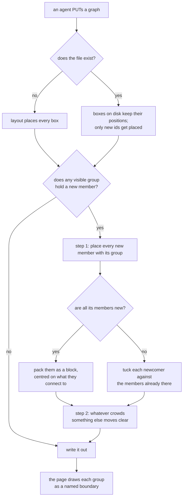

# Visible group boxes

**Idea:** `IDEA.md` — what this is for and why, in plain language. Read it first; it is
the north star this plan serves. Goal and Constraints live there, not here, so they don't
get buried as this file grows.

## Open Questions

None. All six settled; see the Decision Log.

## Watch List

Things noticed that need looking into — not yet decisions for the user. Written down the
moment they're spotted so they can't be forgotten, surfaced to the user one line at a
time as they appear, and emptied before Stage 1 exits.

| # | Noticed | What needs looking into | Raised to user? | Outcome |
|---|---------|-------------------------|-----------------|---------|
| 1 | 2026-08-30 | The group-reference regular expression is written out twice on purpose, once per file (`viewer/server.js:54`, `viewer/index.html:225`), because the two share no module. Anything this change adds that both must agree on inherits that duplication. | no | settled — decision 17 |
| 2 | 2026-08-30 | I have not read either test suite, so I don't yet know which group behaviours are already asserted and what this change breaks. Needs doing before the Spec's validation section. | no | no | settled — both suites read; see the Spec's validation section |
| 3 | 2026-08-30 | `protocol/graphs.md` is 602 lines and is read cold, in full, by every producer before its first write. A second grouping mechanism grows the one file that can least afford it. The Spec needs to say where the group rules go and what, if anything, comes out. | no | settled — decision 16 |
| 4 | 2026-08-30 | The nudge has no stated answer for an intruder that cannot leave one visible group's box without entering another's. Disjointness (decision 5) stops the boxes overlapping, but not a pushed node landing in a neighbour. Needs a rule before the Spec is done. | no | settled — decision 15 |

## Decision Log

Append-only. A reversal is a new entry superseding the old, never an edit.

**Superseding entries: 10 supersedes the third bullet of `IDEA.md`'s "What good looks
like". 20 refines 12. 21 supersedes the mechanism in 11, 12, 15, 19 and 20 — their intent
stands, the per-node pass does not. 22 supersedes 20's branch wording. 23 supersedes the
optional `note` in 3. 24 and 25 supersede the interaction half of 18. 31 supersedes the
placement half of 21 and all of 22. 32 settles the create case that 11 and `when-correct.json`
both assumed away. 33 amends 21's direction search and geometry. 34 supersedes 25. 35
supersedes the all-new-only packing rule in 31. 39 narrows 31 and 32 on a create. 40
supersedes the landing model in 33 and 38 and removes `GROUP_STEP`. 41 completes 35 and 36. 43 supersedes the settled-unit
rule in 41's step 2 and 42's `orderedGroup`-only claim. 44 unifies the pass's one predicate.** Line citations carrying a wrong number were
corrected in place after rounds 1 and 2; no decision changed.

| # | Decision | Rationale | Source |
|---|----------|-----------|--------|
| 1 | Extend the existing `groups` field rather than adding a second one. A group becomes visible by carrying a flag; without it, it stays exactly the invisible highlight set it is today | Collin's call. The two are the same data — a named set of node ids — and separate fields would force a set that is both drawn and pointed at by prose to be written twice, which is the ambiguity this plan exists to remove | user |
| 2 | The flag is a boolean `visible`, defaulting to `false` | Follows from 1. Every graph on disk today is correct unchanged, and the default is the weaker claim, matching how `exclusive` and edge `kind` already default | defaulted |
| 3 | A visible group carries a `label` and a `note`; both are refused on an invisible one | The idea asks for a name and a sentence. Allowing them on an invisible group would let an agent write a name nothing ever shows — the silent failure this server refuses everywhere else | defaulted |
| 4 | `group-unreferenced` applies to invisible groups only. A visible group needs no phrase in the explanation pointing at it | That refusal exists because an invisible group that no prose references highlights nothing. A visible one is drawn on the canvas, so it is self-evidently not silent. A visible group may still be referenced, and lights up the same way when it is | defaulted |
| 5 | Visible groups must be disjoint, and do not nest | Two overlapping drawn regions are exactly the ambiguous membership the idea bans. Invisible groups are unconstrained and may overlap freely, as they do today — two phrases can point at overlapping sets | defaulted |
| 6 | A node inside a group may still carry a child graph. The two mechanisms are orthogonal | They answer different questions — "what system is this part of" and "what is inside this step" — and nothing about drawing a boundary interferes with an open badge | defaulted |
| 7 | A visible group is drawn in a Spec's Mermaid diagram as a `subgraph`; `protocol/diagrams.md` gains that line. Containment still shows the top level only | Mermaid's `subgraph` is the exact same idea, so the translation is free. Decision 68 of `editable-node-graphs` rejected expanded subgraphs for *containment*, which hides a whole second graph; a group hides nothing | defaulted |
| 8 | A group's boundary is **derived** — the page draws it around wherever its members currently sit, and nothing about it is stored on disk | Collin's call, with the recommendation. A member is inside by construction, so half the no-ambiguity requirement is a property of the drawing rather than something to enforce; a stored rectangle would spend a new page write permission and a second record of the same fact | user |
| 9 | Once boxes have been dragged, **nothing is enforced**. A box moved into a group's span reads as it looks and nothing corrects it. The guarantee is about the picture as drawn, not as later rearranged | Collin's call: "if you move the members it's fine if the box goes over unrelated members, it just has to start correct." Removes drag-time enforcement from the page entirely, which was the largest piece of Q2 | user |
| 10 | Supersedes the third bullet of `IDEA.md`'s "What good looks like". It read that membership stays unambiguous after the picture has been dragged around; it now reads that it is unambiguous in the picture as drawn, and the arrangement is the reader's own after that | Follows from 9 — the old wording promised exactly what 9 declines to do, and leaving it would have the Spec contradicting the north star | idea-change |
| 11 | On the write where a visible group is new or its membership changed, the server moves the **non-members standing inside the box it would draw**, and nothing else. Every other position on disk is untouched | Collin's call, with the recommendation. The layout only ever places ids the file has never held, so a group added to an existing graph would otherwise land swallowing whatever its members are spread across — the failure arriving on the first paint rather than after any dragging. Re-laying the whole graph out was rejected as throwing away an arrangement Collin built by hand | user |
| 12 | The nudge fires **only** when a visible group is new to this write, has just turned visible, or its member list differs from disk. A visible group unchanged since disk moves nothing, however the boxes now sit | Required by 9, which says nothing corrects the picture after Collin drags. Firing on every write would quietly drag a box back out of a group's span on the next agent redraw, which is exactly what 9 declines to do | defaulted |
| 13 | Groups stay outside the verdict system. A visible group carries no `origin` and no `was`, the preservation contract does not cover it, and `checkViewChanges` keeps refusing every change to `groups` from the page | Collin's call, with the recommendation. `protocol/graphs.md:114`'s argument — an approved region goes stale the moment the boxes move under it — is strengthened by decisions 8 and 9, not weakened: the box is derived from wherever members sit and nothing keeps it honest afterwards, so a verdict on it would be a verdict on a shape a drag can invalidate | user |
| 14 | The boundary draws the group's name plus one line of its note, cut where it stops fitting, with the full text in a native tooltip when it is cut | Collin's call, with the recommendation. It is the pattern a box already uses for a label too long to fit (`viewer/index.html:894`), and it bounds what two or three groups can add to a picture already carrying 25 box labels and every edge label | user |
| 15 | Resolves watch item 4. The push-out treats every other visible group's box as an obstacle exactly like another node, and keeps stepping in the same direction until the spot is clear of both. The canvas is unbounded, so a clear spot always exists | Mechanical, and the alternative — special-casing a neighbouring group — would need a tie-break rule that no case in a 10-to-25-box graph justifies | defaulted |
| 16 | Resolves watch item 3. The group rules extend the existing `groups` bullet in `protocol/graphs.md`'s schema section rather than opening a new section, and a short passage beside the containment section says which of the two mechanisms a case calls for. Nothing comes out of the file | The file is read cold and in full by every producer, so a second top-level section on grouping invites reading one and missing the other. The one thing genuinely missing is the choice between them, which belongs where containment is already explained | defaulted |
| 17 | Resolves watch item 1. The box's padding and header height become a numeric contract both `viewer/server.js` and `viewer/index.html` must hold, stated once in `protocol/graphs.md` and copied into each. The browser suite is what catches drift, by measuring a really-rendered boundary against a really-computed nudge | Forced by decision 11: the server has to know the box's geometry to compute the push-out, and the page has to draw the same box. It is the same hazard the layout constants already carry and is handled the same way (`viewer/server.js:418`) | defaulted |
| 18 | Clicking a group's boundary selects its members; hovering it does **not** dim the rest of the picture. Hovering a marked phrase in the explanation still does, unchanged | Collin's call. The two triggers differ because their jobs differ: a phrase has no other way to say which boxes it means, so the dim is its whole answer, while a drawn boundary already shows its members and the dim would only flicker as the pointer crosses it | user |
| 19 | The server tests overlap using a fixed node box of 200 by 116 — the width the page uses and the tallest a five-line box gets — rather than porting the page's label-wrapping | It keeps the wrap algorithm in one file. Over-estimating a box only ever pushes a node further clear, which errs toward the unambiguous picture the feature is for; under-estimating would leave an intruder inside. 116 is already the number the server holds its layout against (`viewer/server.js:418`) | defaulted |
| 20 | Refines 12. When a write changes no group but introduces new nodes, the push-out runs with **only those new nodes** as candidates to move. Nodes already on disk are never moved by a write that did not change a group | Without it, a node the layout placed blind inside an existing group's box would sit there permanently, since layout knows nothing about groups. Restricting candidates to the new nodes keeps decision 9 true: a box Collin dragged into a group's span is still never moved back out | defaulted |
| 21 | Supersedes the push-out described in 11, 12, 15, 19 and 20. The pass works on **rigid units** — a visible group moved whole, or a node in no visible group — instead of on individual nodes, and separates overlapping unit rectangles rather than only expelling nodes from boxes | Round 1, both lanes. The per-node form had two defects nothing in it could fix: a candidate that belonged to another visible group could never stop overlapping its own group's box, so the loop never terminated; and two group boxes could overlap by up to `2 × GROUP_PAD` while no node was inside either box, so the pass saw nothing and drew two ambiguous boundaries. Unit rectangles make both cases the same check. Decisions 11, 12, 15, 19 and 20's *intent* survives — least disturbance, fires only on arrival, server-side, over-estimated node box — only the mechanism changed | review-round-1 |
| 22 | Movability is stated positively, not by branch: a unit moves when it is displaced by a **changed** group, or when it is new to this write, and a new unit is tested against **every** group rather than only changed ones | Round 1, intent lane. The previous wording split on "no group changed", so a write that both changed a group and added a node left a node the layout dropped inside a different, unchanged group sitting there — the exact hole decision 20 was written to close | review-round-1 |
| 23 | `note` is required on a visible group, not optional | Round 1, both lanes. `IDEA.md:34` asks for the sentence without hedging, and the Spec had quietly made it optional — narrowing the confirmed idea rather than serving it | review-round-1 |
| 24 | The boundary rect takes no pointer events at all. A **header band** across the top of the box, `GROUP_HEADER` tall, is the group's only hit target, and it carries the tooltip | Round 1, both lanes. Three requirements collided: a filled rect makes the whole interior a target and kills marquee-select inside a group; `pointer-events: stroke` leaves the target and the tooltip on a hairline that is sub-pixel at minimum zoom; and the tooltip was specified on the rect while the cut text sits in a separate element. A real band resolves all three | review-round-1 |
| 25 | The click is driven by `pointerdown` + `stopPropagation` on the header, resolved in the svg's existing `pointerup` — never by a `pointerup` listener on the rect | Round 1, intent lane. `svg.setPointerCapture` (`viewer/index.html:1441`) retargets the following `pointerup` to the svg, so a listener on the rect never fires, and `finishMarquee`'s under-4px branch would call `clearSelection()` and wipe the selection anyway. This is the path nodes already take (`startNodeDrag`, `:1418`) | review-round-1 |
| 26 | A group's words are drawn in a **second layer after the edges**, not in the region layer beneath the nodes, and every header rect is seeded into the edge-label collision list | Round 1, mechanics lane. One layer beneath everything would put the name and note under every edge and edge label, and the label-placement search seeds itself from node boxes only — so the text identifying a group could be buried by the graph drawn over it | review-round-1 |
| 27 | `measureLabelWidth` gains a size argument and keys its cache on size and text together | Round 1, intent lane. It is pinned to `.label-metric`'s 11px (`viewer/index.html:136`) and caches on the string alone (`:817`), so measuring a 13px group name would both return the wrong width and poison the cache for any edge label carrying that same string | review-round-1 |
| 28 | Both the name and the note are cut to the box width, and `centreGroupIfNeeded` takes the group's whole box rather than its members' bounds | Round 1, both lanes. A required name had no overflow rule at all, so it could escape a narrow one-node boundary and a worker would have had to invent one; and a group brought into view by a click could leave its own header off-screen (`viewer/index.html:523`) | review-round-1 |
| 29 | The browser geometry assertion writes its graph through `PUT /graph` to an empty path, not through the fixture-staging helper | Round 1, both lanes. `launch()` writes fixture bytes straight to disk, so the server's pass never runs and the test would compare the page against itself — the drift decision 17 exists to catch could not be caught. The row-pitch test at `viewer/test/browser.spec.js:895` is the pattern, and it exists for the same reason against the layout constants | review-round-1 |
| 30 | Considered and not taken: a boundary that hugs its members as a union of per-member padded rectangles, which would make "no non-member inside" true by construction and delete the separation pass entirely | Round 1, intent lane, correctly noting `boundary-choice.json` never weighed it. Rejected on the idea's own terms: a group whose members are spread reads as several islands rather than one system, and "you can tell at a glance which boxes form a system" is the property being bought. Recorded so a later round does not reopen it as unconsidered | review-round-1 |
| 31 | Supersedes the placement half of 21 and all of 22. **The thing that arrived moves, not the picture that was already there.** A visible group all of whose members are new is packed into a block and placed clear; a new free node is placed clear; nothing already on disk moves. The one exception is a changed group with a member already on disk, where there is no newcomer and the units its box overlaps move instead | Collin's call at round 2. The previous pass always moved the residents, and an arriving group's landing spot is effectively arbitrary — new ids come from a fresh full layout while residents keep dragged coordinates (`viewer/server.js:652-660`). Moving the newcomer disturbs strictly less, is simpler, and is what `IDEA.md:70` already asks for. The unit machinery from 21 survives; which side is held fixed is what changed | user |
| 32 | Packing an all-new group also settles the create case without teaching `layout()` about groups. On a create every node is new, so every visible group packs and its box is tight by construction | Follows from 31. Collin declined the third option, which was to make the first-write layout group-aware; packing reaches a legible first render by the same rule the rewrite path already needs, at the cost recorded under Accepted Risks | user |
| 33 | Deferred round-2 fixes, landed with the rewrite: all four directions are evaluated to their final clear position and the smallest total displacement wins; every rectangle is computed from current positions when tested, never from a snapshot; a placed unit clears every rectangle by at least `GROUP_GAP` rather than by whatever `GROUP_STEP` left | Round 2, both lanes. Each was a real ambiguity or a real untidiness in the pass; all three were held until the fork settled so the pass was not rewritten twice | review-round-2 |
| 34 | Supersedes 25. The header rect takes `setPointerCapture` on **itself** in `pointerdown` and resolves its own `pointerup` and `pointercancel`. It does not hand a pending flag to the svg's `pointerup` | Round 2's fix was recorded only in the triage table's resolution column, leaving 25 standing and contradicting the Spec. The Decision Log's own rule is that a reversal is a new entry. The substance: a flag set in one element's handler and cleared in another's strands when the pointer is released off-window, and self-capture removes the shared state rather than adding a cancellation path to it | review-round-3 |
| 35 | Supersedes 31's packing rule. Step 1 places **every** new member with its group, not only groups whose members are all new. An all-new group packs as a block; a group mixing new and on-disk members tucks each new member against the block the existing ones already form, leaving their positions untouched | Round 3, both lanes, independently and as the only blocking finding. 31 sent a mixed group to resident mode on the rationale that "there is no newcomer", which is false — the new member kept a fresh-layout coordinate unrelated to its group-mates', so its group's anchor box could span from Collin's cluster to wherever `layout()` dropped it and then evict everything beneath. Adding one node would have rearranged the picture. This is also what was actually put to Collin — "pack only members that are new to that write" — so the Spec had been narrower than the decision it recorded | review-round-3 |
| 36 | The packed block is centred on the current positions of the group's **edge neighbours**, falling back to the members' pre-pack centroid when it has none | Round 3, intent lane. The pre-pack centroid is made of fresh-layout coordinates that bear no relation to the retained, dragged ones around them, so an arriving group landed at an arbitrary spot merely nudged clear. Centring on what it connects to costs nothing and is the difference between landing clear and landing where it belongs | review-round-3 |
| 37 | Header hit rects are seeded into `labelRects`, the edge-label search's recoverable tier — never into `nodeBoxRects`, the mandatory one | Round 3, intent lane. Reversing decision 26's placement. The search falls through to `points[0]` when it clears neither tier (`viewer/index.html:1094`), so a mandatory header would make a label that clears every box give up and land on one — the failure seeding the boxes exists to prevent. A label over a group's words still gets a leader line, which is what "recoverable" means | review-round-3 |
| 38 | Determinism repairs: units are ordered groups-first-then-free-nodes, each in id order, because group and node ids are separate namespaces and may collide; the packing grid is `columns = ceil(sqrt(n))` filled in sorted id order; and a direction's final position is the smallest whole-`GROUP_STEP` advance clearing everything, not an offset from "the blocking rectangle", which is undefined when a unit starts out overlapping several | Round 3, mechanics lane. Each left two workers free to build different pictures from the same graph, and the first would have made the byte-identical-round-trip property depend on object iteration order | review-round-3 |
| 39 | Narrows 31 and 32. **On a create, every changed group is in resident mode**: the packed block holds where its layers and edge neighbours put it, and individual free nodes move locally instead | Round 4, intent lane. Newcomer mode on a create protects coordinates nobody owns — `layout()`'s positions are the server's own invention, so "do not disturb Collin's arrangement" has nothing to protect there, and ejecting the group inverted the principle 31 actually states. Decided rather than asked: it contradicts nothing Collin ruled and removes the worse half of the Accepted Risk, where a block was translated sideways past the whole picture with every edge into it crossing the graph | defaulted |
| 40 | Supersedes the landing model in 33 and 38, and removes `GROUP_STEP` from the cross-file contract. A direction's landing is the smallest of the candidates "exactly `GROUP_GAP` past this rect's far edge", taken over **every** other unit's rect, that clears them all | Round 4, both lanes. Quantized advance made the moved unit's clearance `GROUP_GAP` plus anything up to 19, which made the browser drift assertion — decision 17's only guard — impossible to pass against correct code. Enumerating candidates answers 38's "no single blocker to measure from" objection exactly, is deterministic, guarantees a landing exists, and makes the exact clearance true by construction. It also drops a constant the page never used | review-round-4 |
| 41 | Completes 35 and 36 with the determinism they were missing: the mixed-membership lattice has its origin at the on-disk members' bounding-box top-left with `NODE_PITCH` by `LAYER_GAP` cells, first empty cell row-major that does not grow that box, else least added area, ties right before down; and an edge neighbour is a settled node outside the group, in either edge direction, with the anchor the rounded mean of their box centres | Round 4, both lanes. Both were the same class decision 38 was written to remove and both were left open by the round-3 fix — "grid", "extent", "least" and "free" had no origin, metric or tie-break, and the matching validation case ("grows by roughly one slot") falsified nothing | review-round-4 |
| 42 | Three page-side omissions named as required edits rather than assumed: `orderedGroup` must carry the new keys or every write silently drops them; header rects must be seeded into `labelRects` before the edge loop, which creates and consumes that list itself; and the `group-dim` CSS selector list must be extended, since adding the class alone is a no-op | Round 4, intent lane. The first is the smallest change in the plan and the entire schema half depends on it — the Spec had called it free | review-round-4 |
| 43 | Round-5 repairs, all to the placement pass and its edits. A unit is *settled* only once this pass has actually moved it — being reached earlier settles nothing, so a resident anchor evicts an unchanged group whose id sorts before it. The primitive gains an explicit trigger: a unit moves only when it fails to clear everything by `GROUP_GAP`, so a lone unit and a group-less create are no-ops. The centring origin accounts for the node boxes' own extent. The mixed lattice is enumerated ring by ring, row then column, which is total. `validateGraph`'s group mapper is named alongside `orderedGroup` — it drops unknown keys first and covers reads as well | Round 5, both lanes. The settled/resident contradiction was found independently by both and reproduces the round-1 defect on a plain reading; the missing trigger meant the primitive could not express "nothing moves"; the centring formula put the anchor on the block's corner rather than its centre | review-round-5 |
| 44 | The pass has exactly one relation, named once and used everywhere: unit `A` **crowds** unit `B` when `A`'s rect fails to clear `B`'s by at least `GROUP_GAP`. Which units an anchor evicts, when a unit moves, and where it lands all use that single word | Round 6, both lanes. Victim selection said "overlaps" while the trigger said "clearance below `GROUP_GAP`", so a unit sitting 10px outside a boundary was not a victim under the literal wording and would have been left inside the gap the pass exists to guarantee. Three rules that must agree were stated in two vocabularies | review-round-6 |

## Spec

A `groups` entry can now be drawn. A group that carries `visible: true` is rendered as a
named rectangle around its members, with one line of description on its top edge; a group
without it is exactly the invisible highlight set the format already has. The openable
container node is untouched — the two remain separate answers to separate questions.

### The flow



The page's half is not in that picture because it holds no decisions: it draws a boundary
beneath everything, a header with the name and one line of the note above the edges, and
sends nothing about a group back.

### The format — `protocol/graphs.md`

A group entry gains three keys. Canonical group key order becomes `id`, `label`, `note`,
`visible`, `nodes`.

- **`visible`** — boolean, default `false`. `false` is today's behaviour in full.
- **`label`** — the name drawn on the boundary. Required, a non-empty string, when
  `visible` is `true`. Must be `null` otherwise.
- **`note`** — one sentence saying what the system is. Required, a non-empty string, when
  `visible` is `true`. Must be `null` otherwise. `IDEA.md:34` asks for it without hedging —
  a group whose name needs no sentence is a group whose members probably did not need
  drawing round.

Rules, on top of everything already true of a group (id shape `^[a-z0-9_-]+$`, at least
one member, every member a node in this same file):

- Two visible groups may not name the same node. This also settles nesting: a group nested
  inside another would share every one of its members, so it is refused by the same check.
  Invisible groups are unconstrained and may overlap each other and any visible group
  freely, as they do today — two phrases can point at overlapping sets.
- The requirement that a group be referenced by the explanation (`group-unreferenced`)
  applies to **invisible groups only**. A visible group is drawn on the canvas, so it is
  self-evidently not silent. A visible group may still be referenced by a phrase, and
  behaves exactly as it does today when it is.
- Groups still carry no verdict. No `origin`, no `was`, not covered by the preservation
  contract, and still rewritten freely by an agent on every redraw.

Five other places in `protocol/graphs.md` go stale and are updated with it: the schema's
own JSON example, whose `groups` entry still reads `{ "id", "nodes" }` (`:55`); the canonical
key-order line "Group keys: `id`, `nodes`" (`:230`); the canonicalization defaults paragraph
that lists what an omitted key becomes (`:248`); the closing rationale under the refusal
table, which still says every group nothing in the explanation points at is refused
(`:590`); and — the one that decides whether the feature is ever used — the write-time
producer step "Mark a position word, and define its group" (`:412`), which currently
describes only the invisible kind. It gains the visible case: when a set of boxes reads as
one system, draw it as one.

The file also gains, beside the containment section, a short passage on choosing between
the two mechanisms: a **group** is for a set of steps that reads as one system and whose
parts belong on screen with the rest of the flow; a **container node** is for a flow whose
insides matter but would bury the outer picture. The group rules themselves extend the
existing `groups` bullet in the schema section rather than opening a second section, so a
producer reading the file cold cannot read one and miss the other.

### The boundary's geometry — the cross-file contract

Both `viewer/server.js` and `viewer/index.html` compute this box, and they share no
module, so the numbers are stated once in `protocol/graphs.md` and copied into each.

```
GROUP_PAD    = 24    // clearance on the left, right and bottom
GROUP_HEADER = 38    // extra clearance above, holding the name and the note line
GROUP_GAP    = 16    // a moved unit lands exactly this far past the rectangle that bound it
```

For a visible group whose members are `M`:

```
minX = min(m.x)                       maxX = max(m.x + nodeWidth)
minY = min(m.y)                       maxY = max(m.y + nodeHeight(m))
box  = { x: minX - GROUP_PAD,
         y: minY - GROUP_PAD - GROUP_HEADER,
         w: (maxX - minX) + 2 * GROUP_PAD,
         h: (maxY - minY) + 2 * GROUP_PAD + GROUP_HEADER }
```

The page uses its real `nodeHeight(n)` (`viewer/index.html:767`). The server uses a fixed
box of **200 by 116** for every node — the page's `NODE_W` and the tallest a five-line
label makes a box, the number the server's layout already holds itself against
(`viewer/server.js:418`). The server's box is therefore never smaller than the page's, only
ever taller, so the disagreement can only push something further clear — never leave it
inside.

### Making the picture start correct — `viewer/server.js`

The layout pass places only ids the file has never held; every id already on disk keeps its
position (`retainDiskPositions`, `:652`). A group added to an existing graph would otherwise
be drawn around wherever its members already sit. So after positions are settled on a
`PUT /graph` — after `layout()` on a create, after `retainDiskPositions` on a rewrite — the
server runs a two-step pass.

**Everything on the canvas is a rectangle, and the pass only ever moves whole ones.** A
*unit* is either a visible group — its box, moved by translating every member by the same
delta — or a node belonging to no visible group, which is its own 200-by-116 rect. Because a
group is a unit rather than a set of loose boxes, a node is never asked to leave a rectangle
it is itself part of, and two group boundaries that overlap while none of their nodes do is
an overlap the pass can see.

**What counts as arriving.** A node is *new* when the file has never held its id. A visible
group is *changed* when it is not on disk, when it was `visible: false` on disk and is `true`
now, or when its canonical `nodes` list differs from disk. On a create, every node is new and
every visible group is changed.

**Whose positions are nobody's to move.** Any node already on disk. Its coordinates are
Collin's, set by dragging, and no write rearranges them — except in the one case named under
"the resident mode" below, which he ruled on directly.

#### Step 1 — place every new member with its group

For each visible group, in id order, holding at least one member new to this write. The
positions `layout()` gave a new id have nothing to do with the retained, dragged positions of
the ids around it (`viewer/server.js:652-660`), so a new member is never left where the
layout dropped it.

**Every member new.** Discard those positions and lay the members out on a grid:
`columns = ceil(sqrt(n))`, `rows = ceil(n / columns)`, members in sorted id order filling
row-major, cell `(c, r)` at `(originX + c * NODE_PITCH, originY + r * LAYER_GAP)`.

The block is centred on an **anchor point**:

- *Edge neighbours* are the nodes **outside this group** having an edge to any member, in
  either direction, whose position is **already positioned** — on disk, or in a group this pass has
  already placed. (Not "settled": step 2 gives that word a narrower meaning, and the two must
  not be read as the same test.) A member of this same group is never one, and a node still sitting at a
  pre-pack position is not either.
- With at least one, the anchor is the arithmetic mean of those nodes' box centres, each
  coordinate rounded half-up. With none, it is the mean of the members' own pre-pack box
  centres, rounded the same way.
- The origin puts the block's **centre** on the anchor, so the node boxes' own extent counts:
  `originX = round(anchorX - ((columns - 1) * NODE_PITCH + 200) / 2)` and
  `originY = round(anchorY - ((rows - 1) * LAYER_GAP + 116) / 2)`, using the server's 200-by-116
  node model. Dropping the `+ 200` and `+ 116` would put the anchor on the block's top-left
  corner instead and shift a one-member group by 100 by 58.

**Some new, some already on disk.** The members on disk keep their positions untouched; they
are Collin's. Build a lattice whose origin is the **top-left of those members' bounding box** and whose
cells are `NODE_PITCH` wide by `LAYER_GAP` tall. A cell is occupied when any node in the graph
overlaps it.

Cells are enumerated in one fixed order, because a lattice is unbounded and "row-major" alone
cannot walk it: **ring by ring outward** from the bounding box — ring 0 is the cells the box
already spans, ring `k` the cells at Chebyshev distance `k` from it — and within a ring by
row then column, both ascending.

Each new member, in sorted id order, takes the first empty cell of ring 0. If ring 0 has
none, it takes the empty cell adding the least area to **the group's current bounding box** —
its on-disk members together with any new member this pass has already placed for this same
group, so each placement measures against the box the previous one left. Scan outward in that
same enumeration order, stopping at the first ring that yields a candidate; ties are broken by
the enumeration order itself, which is total, so "right before down" needs no separate rule.

Without this the group's box would stretch from Collin's cluster to wherever the layout
dropped the newcomer, and step 2 would hold that box fixed and evict everything under it —
mass rearrangement from adding one node, which `IDEA.md:70` forbids.

**No member new.** Nothing happens here.

#### Step 2 — place what arrived

**The unit order is total, and it is the processing order**: every visible group first in id
order, then every free node in id order. The bare id will not do — group ids and node ids are
separate namespaces (`viewer/server.js:137`, `:172`), so a group and a node may legally share
one.

**One predicate decides everything below.** Unit `A` *crowds* unit `B` when `A`'s rect fails
to clear `B`'s by at least `GROUP_GAP`. Plain overlap is **not** the test: a unit sitting 5px
outside a boundary overlaps nothing and is still too close, and every rule below — which units
an anchor evicts, when a unit moves, where it lands — uses this one word so the three cannot
drift apart.

**Which side holds still**, decided per changed group:

- **On a create** — no file on disk — every changed group is in resident mode. Nothing on a
  create is Collin's: the positions are the server's own invention, so the principle behind
  newcomer mode has nothing to protect, and holding each packed block where its layers and
  edge neighbours put it gives the better first render.
- **On a rewrite** — a changed group *every* member of which is new is in **newcomer mode**:
  the group itself moves. Any other changed group is in **resident mode**: its box holds and
  the units that crowd it move instead. This is the only write that moves a box Collin placed,
  and it is the case he ruled on. Step 1 keeps it bounded — the anchor box grew by the slots
  the new members needed, not across the canvas.
- **A new free node is always a newcomer** and moves itself, on a create or a rewrite. It
  belongs to no group, so it is placed by iterating the unit order, not by iterating groups.

**Precedence, so no two units both claim to hold still.** A unit is *settled* only once this
pass has **actually moved it**. Being reached earlier in the order settles nothing: a unit the
pass looked at and left alone is still an ordinary obstacle, and a resident anchor evicts any
unit that crowds it, whether that unit is changed, unchanged, earlier or later in the order.
Reading "settled" as "reached earlier" is the one misreading that reproduces the round-1
defect — an unchanged group whose id sorts before a changed one would be immovable, and the
two boundaries would be left overlapping.

When two **resident-mode** groups crowd each other, the one earlier in the order is the
anchor and the later one is a victim; that is the only case where order decides which side
holds. When a resident anchor evicts several units, they move in the total order.

**The movement primitive.** For a unit `U` and the set `S` of every other unit's rect.

**The trigger comes first: `U` moves only if it crowds any rect in `S`.** A unit that crowds
nothing stays exactly where it is, and a graph with one unit and an empty `S` crowds nothing
vacuously. Without this the primitive has no no-op — its candidates are derived from other
rectangles, so an empty `S` yields none — and a create with no visible group would not leave
`layout()`'s output untouched.

Then:

1. For each direction — left, right, up, down — the candidate landings are, for **every** rect
   in `S`, the position at which `U` sits exactly `GROUP_GAP` beyond that rect's far edge in
   that direction. Take them in increasing displacement; that direction's landing is the first
   one at which `U` clears every rect in `S` by at least `GROUP_GAP`. One always exists — the
   candidate derived from the furthest rect clears all of them.
2. Take the direction whose landing is the smallest displacement. Ties break left, right, up,
   down.
3. Apply the delta to every node in `U`.

Every landing is flush at exactly `GROUP_GAP` past some rect's far edge, so a moved unit's
clearance from the rectangle that bound it is exactly `GROUP_GAP` — which is what the drift
assertion measures. An earlier draft advanced in fixed steps from a "blocking rectangle",
which was undefined when a unit overlapped several at once and left the final clearance
anywhere in a 20px band; enumerating candidates from every rect removes both problems and
drops a constant from the cross-file contract that the page never used.

Every rectangle is computed from current node positions **at the moment it is tested**, never
from a snapshot taken when the pass began. The candidate set per direction is finite and each
unit is placed once, so the pass terminates in one sweep.

**When nothing moves.** A write that adds no new node and changes no group runs neither step.
A box Collin dragged into a group's span on a picture that has since only been redrawn stays
exactly where he put it — decision 9, unchanged.

### Refusals — new codes

| Status | Code | When |
|---|---|---|
| 422 | `group-bad-shape` | `visible` is not a boolean, or `label`/`note` is neither a string nor `null` |
| 422 | `group-missing-label` | a group with `visible: true` whose `label` is absent, `null`, or empty |
| 422 | `group-missing-note` | a group with `visible: true` whose `note` is absent, `null`, or empty |
| 422 | `group-hidden-text` | a group with `visible: false` carrying a non-null `label` or `note` |
| 422 | `group-overlap` | two visible groups name the same node |

Checked in the existing group loop, after the id and member checks that are already there,
with `group-overlap` after the loop. Each names the offending ids in `ids`, as
`bad-kind` already does. The header comment at `viewer/server.js:16` lists them, and
`protocol/graphs.md`'s refusal table gains the same five rows.

`group-unreferenced` is narrowed to invisible groups; every other existing group refusal is
unchanged.

### Drawing it — `viewer/index.html`

`render()` currently appends nodes, then edges, then one label layer
(`viewer/index.html:1374-1399`). Visible groups are drawn in **two layers, not one**,
because their boundary and their words want opposite paint orders:

- a **region layer** appended to `root` *before* the nodes, holding each group's boundary
  `rect` at its computed box with `rx: 6`, a stroke and a very low-opacity fill. Beneath
  everything, so a boundary can never paint over a box, an arrow or a label. The rect
  carries `pointer-events: none` — it is scenery, and the interior of a group stays fully
  available to a marquee and to anything drawn inside it.
- a **header layer** appended immediately *before* the label layer, so after every edge.
  This is where the group's words and its only hit target live.

Each group's header, in that second layer:

- the `label` at 13px, inset 12 from the left of the box, then the `note` at 11px on the
  line beneath. Each is cut independently to what fits `box.w - 24`.
- a **hit rect** sized to those two drawn strings — the wider of the two plus 12, by
  `GROUP_HEADER` — rather than the full width of the box, carrying `data-group="<id>"`,
  `fill: none` and `pointer-events: all`. Explicitly both: an SVG `rect` defaults to a solid
  black fill, and a `fill: none` rect takes no pointer events without that property, so a
  worker left to guess ships either a black bar across the picture or a dead target. Sizing
  it to the text rather than the box also keeps it out of the way of a node Collin drags
  into the group's top strip, which decision 9 explicitly allows.
- when either string is cut, the group's whole `label` and `note` go in a native `<title>`
  on the hit rect — on the thing the reader is already pointing at. On a small group this is
  the normal case, not the exception: the box's width comes from its members' bounds, so a
  one- or two-member group leaves roughly 200px for the note and most of the sentence lives
  in the tooltip. The box is not widened to fit it — the page's box must never exceed the
  server's, or the push-out could leave a node inside a boundary the reader can see.
- every header hit rect is measured and pushed into `labelRects` **before the edge loop
  begins**, not while the header layer is built. `labelRects` is created, filled and read
  inside that loop (`viewer/index.html:1385-1397`), so seeding it afterwards would hand an
  already-finished search a list nothing reads — the seeding would silently do nothing. The
  headers' geometry depends only on group boxes, which are known before any edge is drawn.

  They go into `labelRects`, the edge-label search's **recoverable** tier — never into
  `nodeBoxRects`. The search has two tiers and falls through to
  `points[0]`, the plain segment midpoint, when it clears neither (`viewer/index.html:1094-1104`).
  `nodeBoxRects` is the mandatory tier, so seeding a header there would make an edge label
  that clears every box but not a header give up entirely and land on a box — the exact
  failure seeding the boxes was added to prevent. A header is words, and a label overlapping
  words is recoverable: it still gets a leader line back to its own arrow.

**Measuring that text needs a change to `measureLabelWidth`.** It is fixed at the 11px of
`.label-metric` (`viewer/index.html:136`) and its cache is keyed on the string alone
(`:813`), so measuring a 13px name through it would return an 11px width *and* poison the
cache for any edge label carrying the same string. It gains a size argument and keys the
cache on size and text together. The size must be applied as an **inline style**
(`labelMetricEl.style.fontSize`), not as an SVG presentation attribute through the `el()`
helper: `.label-metric`'s CSS rule outranks a presentation attribute, so the attribute form
would silently keep measuring at 11px and every assertion about cache keys would still pass.
Existing callers pass 11 and behave identically.

**Dimming.** When a marked phrase is hovered, every visible group *other than* the hovered
one dims along with the boxes outside it, and the hovered group's own boundary and words stay
plain. The CSS rule is an explicit selector list — `.node.group-dim, .edge.group-dim,
.edge-label.group-dim, …` (`viewer/index.html:165`) — so this needs the list **extended** with
the boundary and header classes. Adding the class alone changes nothing. Without this a dimmed picture keeps two
or three boundaries at full strength over it, which reads as the highlight pointing at them.

**Interaction, and why it cannot be a plain `pointerup` listener.** The svg's own
`pointerdown` handler calls `svg.setPointerCapture` for any target that is not `.node` or
`.edge` (`viewer/index.html:1441`), which retargets the following `pointerup` to the svg —
so a listener on the header would never fire, and the svg's `pointerup` would run
`finishMarquee`, whose under-4px branch calls `clearSelection()` (`:1504`) and would wipe the
selection anyway.

The header handles the whole gesture itself rather than handing state to the svg:

- `pointerdown` on the hit rect calls `ev.stopPropagation()` — so the svg never runs, never
  takes capture, and no marquee starts — then calls `setPointerCapture` on the **header rect
  itself** and records the pointer id.
- that capture is what makes the header's own `pointerup` fire reliably, wherever the
  pointer is released. It calls the existing `selectGroup(id)` (`:509`) and releases.
- `pointercancel` and a `pointerup` carrying a different pointer id release without
  selecting. There is no state living between two elements' handlers, so there is no pending
  flag a release outside the window can strand — which is the failure a
  `pointerdown`-here/`pointerup`-there design has.
- `selectGroup` makes the group's members the selection and brings an off-screen member into
  view. Approve and reject then work on that selection with no new code.
- `centreGroupIfNeeded` (`:523`) bounds members only, so a group brought into view could
  still leave its own header off-screen. It takes the group's full box instead.
- Hovering the header changes the cursor and lifts the boundary's stroke. It does **not**
  set `hoveredGroupId` and never adds `group-dim` to anything — the drawn box already shows
  its members, so the dim would only flicker as the pointer crossed it. Hovering a marked
  phrase in the explanation still dims, unchanged.

`fitToView` (`:591`) includes visible group boxes in its bounds, so a graph opening at fit
shows whole boundaries rather than clipping their headers.

### `protocol/diagrams.md`

Gains one line: a visible group in a plan's graph is drawn in the Spec's Mermaid as a
`subgraph` carrying the group's `label`. Containment is unaffected and still shows the top
level only.

### What does not change

- The openable container node, its badge, `container-*` refusals, and the recursive orphan
  check.
- The preservation contract, `checkAgentWrite`, and every verdict rule.
- `checkViewChanges` — the page still may not alter `groups`, and gains no new permission.
  Its comparison canonicalizes each group through `orderedGroup`, so it covers the three new
  keys once that function does (`viewer/server.js:908`).

  **Two functions drop unknown group keys, and both are required edits.** `validateGraph`'s
  group mapper returns `{ id: raw.id, nodes: raw.nodes }` (`viewer/server.js:186`) and is the
  choke point for reads *and* writes — `parseDisk` runs through it too (`:285`). `orderedGroup`
  (`:92`) drops them again, and `canonicalBytes` writes through it (`:103`). Until **both**
  carry `label`, `note` and `visible`, every write silently discards them and the feature does
  not exist. These are the smallest changes in the plan and the whole schema half rests on
  them.
- Every graph on disk today. `visible` defaults to `false`, `label` and `note` to `null`,
  so an existing file round-trips with three added keys and no behaviour change.
- The 10-to-25 node target.

### Non-goals

No collapsing a group to a single box; no group holding a child file; no colour, shape or
styling an agent chooses; no drag-time enforcement of any kind.

### Validation

```bash
node --test 'viewer/test/*.test.js'      # the glob is required
npm --prefix viewer run test:browser     # Chromium; fails loudly if the browser is missing
./install.sh && ./install.sh             # idempotent; git status --porcelain stays empty
```

New assertions in `viewer/test/server.test.js`:

- A legacy file with no `groups`, and a group sent without the new keys, both round-trip
  with `visible: false`, `label: null`, `note: null`; canonical key order is
  `id, label, note, visible, nodes` and a re-`PUT` of a canonical file is byte-identical.
  This extends the test at `:166`, whose `deepEqual` on `{id, nodes}` has to gain the new
  keys. The test at `:188` asserts only that `groups` equals `[]` and needs no change.
- Each of the five new codes, added to the refusal table at `:201`. The existing
  `group-unreferenced` case there stays valid — it is an invisible group — and a new case
  asserts a *visible* unreferenced group is accepted.
- The placement pass, at its real boundary — always a `PUT /graph`, never a unit call. The
  rewrite cases send a second `PUT` against a file the first one created; the create cases
  send one `PUT` to an empty path with an empty hash, which is the same route
  (`viewer/test/server.test.js:302`):
  - a rewrite adding a visible group of **new** nodes whose block lands on an arranged
    picture moves only that group; every node already on disk is byte-identical afterwards,
    and the group's box ends clear of every other unit by at least `GROUP_GAP`;
  - a rewrite making an **existing** set of nodes visible as a group, where its box swallows
    a resident, moves that resident and not the group — the resident mode, and the one write
    that moves a node Collin placed;
  - the same rewrite sent a second time unchanged moves nothing at all;
  - two visible groups whose boxes overlap while no node of either sits inside the other's
    box are separated — the case a per-node pass could not see;
  - the unit that must move is **itself a visible group**: it translates whole, its members
    keep their positions relative to each other, and the write returns rather than looping;
  - a direction with a short but blocked exit is not taken when a longer clear one is
    shorter overall — the assertion that the four directions are evaluated to their final
    position, not to their first;
  - a write that adds no node and changes no group runs neither step: a node dragged inside a
    group's box via `PUT /view` stays exactly where it was put;
  - a rewrite adding **one new node to an existing visible group**: the new node lands
    against the members already there, every existing member is byte-identical, and the
    group's box grows by roughly one slot rather than reaching to wherever `layout()` put the
    newcomer;
  - the packed block of an all-new group with an edge to an already-placed node lands beside
    that node rather than at an unrelated spot;
  - the same graph written twice from scratch produces byte-identical positions, including a
    graph holding a visible group and a free node that share an id — the ordering total-order
    case;
  - a two-member group packs to two boxes side by side, not stacked — the grid formula is
    `columns = ceil(sqrt(n))`, and "near square" alone would not decide it;
  - on a create, an all-new group's members land as a compact block rather than spread across
    the rows `layout()` gave them, the resulting box contains no non-member, and the **block
    itself did not move** — on a create the group is the anchor and free nodes are what give
    way;
  - a moved unit's clearance from the rectangle that bound it is **exactly** `GROUP_GAP`, not
    a range — the property the browser drift assertion rests on;
  - a **rewrite** in which a changed resident group's box grows into an **unchanged** visible
    group's box separates the two — including when the unchanged group's id sorts first. Built
    as a rewrite deliberately: as a create both groups are changed and the earlier-wins clause
    applies instead, so a create cannot reach this case;
  - a create with **no visible group** places every node exactly where `layout()` did. The
    pass now runs on every create in the repo, and this is the one-line bound on its blast
    radius.

New assertions in `viewer/test/browser.spec.js`, against a new fixture beside
`groups-basic.json`. The geometry test must **`PUT` its graph to an empty path** rather than
using `launch()`, which stages fixture bytes straight to disk (`test/helpers/server.js`,
`stage`) and so never runs the server's pass at all — the pattern to copy is the row-pitch
test at `:895`, which exists for exactly this reason against the layout constants:

- With the graph written through `PUT /graph`, the rendered boundary contains every member's
  real `getBoundingClientRect` and no non-member's. The drift assertion needs a stated
  predicate to bite, and it needs **two writes, not one**. A single `PUT` to an empty path is
  a create, where every changed group is in resident mode and only free nodes move — a
  non-member push against a group whose members are on disk is unreachable in one write. So:
  first `PUT` creates the graph with the group's members invisible, second `PUT` makes the
  group visible over them, which is resident mode and pushes the non-member. The fixture is
  built so exactly one non-member is pushed and so the winning direction is **horizontal**,
  and the test asserts that node's rendered edge sits **exactly `GROUP_GAP`** from the
  rendered boundary. The direction is not
  incidental. The server models every node as 200 by 116 while the page draws its real
  height — 74 for a one-line label (`viewer/index.html:767`) — so the two agree on the left,
  right and top edges and can differ by up to 42px on the bottom. A downward push therefore
  renders at `GROUP_GAP + (116 - h)` and an exact assertion would fail against correct code.
  A loose "it is outside" passes even when one file's `GROUP_PAD` has moved, which is the
  drift decision 17 exists to catch; an exact horizontal distance fails the moment the two
  copies disagree. Staging bytes to disk cannot catch it at all.
- The name renders at its own size; a name or note too long for the box is cut, and the
  header's `<title>` carries both in full.
- Clicking the header selects exactly the members and enables approve — through real pointer
  events, which is what proves the `stopPropagation` path works against `setPointerCapture`.
- A marquee started on empty canvas inside a group's boundary still box-selects, proving the
  boundary rect takes no pointer events.
- Hovering a header adds `.group-dim` to nothing; hovering the phrase for the same group
  still dims everything outside it — the existing test at `:1396` must keep passing.
- Paint order, not geometry: a boundary rect precedes every node, edge and label in document
  order inside `root`. The geometric form is false by construction — a boundary contains its
  own members, and an edge from a member to a non-member must cross it.
- An edge label that would land on a group's header is displaced. Asserted on a fixture with
  room to displace into: the placement search's last resort is `points[0]` regardless of any
  collision (`viewer/index.html:1104`), so header avoidance is a property of the search being
  seeded, not a guarantee the code can make in a crowded picture.
- Hovering a marked phrase dims every *other* visible group's boundary and header, and leaves
  the hovered group's own plain.
- `measureLabelWidth` returns a genuinely larger width for the same string at 13px than at
  11px — the assertion that catches the size being applied as a presentation attribute the
  `.label-metric` CSS rule overrides — and measuring at 13px does not change what an edge
  label carrying that same string gets back at 11px.

## Accepted Risks

| Risk | Why accepted | Round |
|------|--------------|-------|
| Packing an all-new group discards its members' **layer assignment**. `layout()` sets a node's `y` from the layer it computed (`viewer/server.js:600`), so a group spanning three layers of a flow becomes a square block and the rows it came from are left with a gap. The vertical arithmetic is tight and worth stating: the box clears `GROUP_PAD + GROUP_HEADER = 62` above its members and `GROUP_PAD = 24` below, against `LAYER_GAP - 116 = 24` of free vertical space between rows, so a group with a node in the row above its members' span will collide by construction rather than occasionally | Decision 32. Collin declined the alternative, which was to make the first-write layout group-aware. Decision 39 removes the worse half — on a create the block now holds and individual free nodes move locally, instead of the whole block being translated sideways past the picture with every edge into the group crossing the graph. What remains is the layer loss, traded for a tight box that reads as one system, which is the property the feature exists to buy. The graph is disposable and a drag fixes an individual case. A real graph reading badly is the evidence that reopens decision 32 | 3-4 |

## Review Rounds

### Round 1 — 2026-08-30

**Lanes:** GPT / gpt-5.6-sol (mechanics); Claude / default reviewer model (intent); cross-family: yes.

**Changed since Round N-1:** n/a (first round — whole Spec in scope)

| Lane | Reported | Finding | Lead verdict | Resolution |
|------|----------|---------|--------------|------------|
| mechanics | blocking | The push-out never terminates when the node it moves belongs to another visible group — that node always overlaps its own group's box, which the pass treats as an obstacle | `upheld` | Verified against the Spec's own step 5. Decision 21: the pass moves rigid units, so a group is never asked to leave itself |
| mechanics | blocking | Two visible groups can be drawn with overlapping boundaries while no node sits inside either box — 200px nodes 230px apart give 18px of box overlap, and the pass skips both | `upheld` | Arithmetic reproduced. Decision 21: units are rectangles and box-vs-box overlap is the same check as node-vs-box |
| intent | major | Adding a second visible group never re-checks the first, so the first's box can end up enclosing the second's members and its whole rect | `upheld` | Same root cause. Closed by decision 21 |
| intent | major | "The box depends only on members, and only non-members move, so it is stable for the whole pass" is false with two or more visible groups | `upheld` | Correct — a non-member of one group is a member of another. Closed by decision 21; the stability claim is gone |
| intent | major | The movability branches are mutually exclusive on "no group changed", so a write that changes a group *and* adds a node leaves a new node inside an unchanged group | `upheld` | Reproduced against the Spec text. Decision 22 restates movability positively |
| intent | major | The boundary click cannot fire: `svg.setPointerCapture` retargets `pointerup` to the svg, and `finishMarquee`'s under-4px branch clears the selection `selectGroup` just made | `upheld` | Verified at `viewer/index.html:1441` and `:1502`. Decision 25 moves the gesture onto the `pointerdown` + `stopPropagation` path nodes already use |
| mechanics | major | The boundary's pointer lifecycle is unstated: a rect `pointerup` can select and immediately clear, and the interior must stay marquee-capable | `upheld` | Same surface. Decisions 24 and 25 |
| intent | major | The hit-testing policy is unstated and its three requirements collide — a filled rect kills marquee-inside, `pointer-events: stroke` leaves a sub-pixel target, and the tooltip sits on the wrong element | `upheld` | Decision 24: the rect takes no pointer events and a real header band is the target |
| mechanics | major | A region layer painted before the nodes puts the group's name and note beneath every edge and edge label, which the label-placement search does not avoid | `upheld` | Confirmed against `render()`'s three passes. Decision 26 splits boundary and words into two layers and seeds the header into the collision list |
| intent | major | `measureLabelWidth` is pinned to 11px and caches on the string alone, so measuring group text returns the wrong width and poisons the cache for edge labels | `upheld` | Verified at `viewer/index.html:136` and `:813`. Decision 27 |
| mechanics | major | A required `label` has no length limit or overflow behaviour while only the note is cut, so a long name escapes a narrow boundary and the worker must invent a rule | `upheld` | Decision 28 cuts both |
| mechanics | major | The browser geometry assertion cannot catch server/page drift: it stages a fixture to disk, and the server computes geometry only during `PUT /graph` | `upheld` | Verified: `launch()` calls `stage()`, which writes bytes. Decision 29 |
| intent | major | Decision 17's stated drift guard therefore does not exist as described | `upheld` | Same finding from the other lens. Closed by decision 29 |
| intent | major | The Spec contradicts `IDEA.md`'s constraint that the layout runs only on first write, with no `idea-change` entry, though decision 10 set that precedent | `upheld` | Correct. The constraint is amended to say a picture Collin arranged is never rearranged behind him and only just-disturbed boxes move |
| mechanics | blocking | `note` optional contradicts the confirmed idea, which asks for the sentence unhedged | `downgraded` | Real, but a worker could implement it as written and would build something coherent — it misses the idea rather than being unbuildable, which is `major` by the ladder. Fixed anyway: decision 23 makes it required |
| intent | minor | A third boundary shape — a union of per-member padded rects — was never weighed, and would delete the separation pass | `upheld` | Genuinely unconsidered. Recorded as decision 30, rejected because spread members would read as islands rather than one system |
| intent | minor | `GROUP_STEP`'s "a further 20" is a magic number absent from the constants block | `upheld` | Named `GROUP_STEP` and added to the contract |
| intent | minor | Three further places in `protocol/graphs.md` go stale — the group key-order line, the defaults paragraph, and the write-time producer step that would otherwise never mention `visible` | `upheld` | All three named in the Spec's format section. The producer step is the one that decides whether anything ever draws a group |
| intent | minor | The Spec says the test at `server.test.js:188` needs the new keys; it asserts only `groups == []` and needs no change | `upheld` | Corrected in the validation section |
| intent | minor | `centreGroupIfNeeded` bounds members only, so a clicked group can leave its own header off-screen | `upheld` | Decision 28 |
| mechanics | minor | Four cited line numbers point at the wrong lines — the regex definition, the node tooltip, the no-verdict rationale, and the 116px statement | `upheld` | All four verified wrong and corrected in PLAN.md and MAP.md |
| intent | minor | `protocol/diagrams.md:15` requires a Mermaid diagram in the Spec and there is none | `declined` | Not a defect in the plan. `plan-review.md`'s exit step draws it immediately before `status: approved`, which is precisely where it is scheduled; drawing it earlier is what that rule exists to prevent |

Two blocking and thirteen major findings upheld, so this round is not clean. Round 2 reviews
the changes above plus a whole-Spec coherence pass.

### Round 2 — 2026-08-30

**Lanes:** GPT / gpt-5.6-sol (mechanics); Claude / default reviewer model (intent); cross-family: yes.

**Changed since Round 1:**

1. The server-side pass was rewritten from per-node to **rigid units** — a visible group
   moved whole, or a node in no visible group — separating overlapping unit rectangles.
   Decisions 21 and 22; supersedes the mechanism in 11, 12, 15, 19, 20.
2. Movability restated positively: displaced by a *changed* group, or new to this write,
   with a new unit tested against every group. A termination argument is stated.
3. `note` is now required on a visible group. Five new refusal codes, not four.
4. Drawing split into two layers: a boundary layer before the nodes taking no pointer
   events, and a header layer after the edges carrying the words and the only hit target.
   Header rects are seeded into the edge-label collision list.
5. The click moved to `pointerdown` + `stopPropagation`, resolved in the svg's existing
   `pointerup`. `centreGroupIfNeeded` takes the whole box.
6. `measureLabelWidth` gains a size argument and a size-keyed cache; name at 13px, note at
   11px, both cut to the box width.
7. `GROUP_STEP = 20` added to the cross-file constants.
8. Validation rewritten — every pass case asserted at the `PUT /graph` boundary, and the
   browser geometry test must `PUT` to an empty path rather than staging fixture bytes.
9. The `protocol/graphs.md` edit list extended to the group key-order line, the defaults
   paragraph, and the write-time producer step.
10. `IDEA.md`'s positions constraint amended; four wrong line citations corrected.

| Lane | Reported | Finding | Lead verdict | Resolution |
|------|----------|---------|--------------|------------|
| intent | major | The pass runs on a create over a freshly laid-out graph, ejecting nodes out of the rows the Sugiyama pass put them in. `when-correct.json` excluded the create case on the assumption all three answers behaved the same there, and that assumption is false because `layout()` is group-blind | `user-decision` | Verified: `layout()` (`viewer/server.js:429`) has no concept of a group, so a create is exactly where a box swallows non-members. Appended to Open Questions with the finding below, which is the same fork |
| intent | major | The arriving unit is never the one that moves, so adding a visible group of new nodes to an arranged graph ejects every resident its box lands on — when translating the one new unit would disturb nobody. `retainDiskPositions` gives new ids coordinates from a fresh full layout while residents keep dragged ones, so the two coordinate systems are unrelated | `user-decision` | Verified at `viewer/server.js:652-660`. This contradicts `IDEA.md:70`'s "moves them the least it can" in the likely case, and the answer restructures the pass. Appended to Open Questions |
| intent | minor | A fourth option was never weighed: pack a changed group's members into free space as a block and move nothing else, which makes "no non-member inside" true by construction and needs no anchors, movability matrix or step ladder | `user-decision` | Folded into the same question rather than recorded like decision 30 — it is the concrete alternative the fork is between, not a road already not taken |
| mechanics | blocking | The pass commits to a direction before considering obstacles, so a short blocked exit moves a unit arbitrarily farther than a slightly longer clear one | `downgraded` | Real, but a worker implements it as written and gets a deterministic, correct-if-untidy picture — `major` by the ladder, not unbuildable. Fix deferred with the pass rewrite: evaluate all four directions to their final clear position and take the smallest total displacement |
| mechanics | major | The pass does not say whether a unit's rect and later anchor geometry update as units move; snapshot and live implementations differ and produce different pictures | `upheld` | Real ambiguity — two workers build different things. Fix deferred with the pass rewrite: every rectangle is computed from current positions at the moment it is tested, never from a snapshot |
| intent | minor | `GROUP_STEP` applies `GROUP_GAP` only against the anchor, so a unit advancing past other rectangles comes to rest 1 to 19px off a node's edge | `upheld` | Fix deferred with the pass rewrite: the final position clears every rectangle by at least `GROUP_GAP`, not by whatever the step left |
| mechanics | blocking | A pending header click has no completion or cancellation path — released outside the SVG or on `pointercancel`, the flag survives and the next canvas release selects a stale group | `upheld` | Verified against `viewer/index.html:1430-1470`. The header now takes `setPointerCapture` on itself and resolves its own `pointerup`/`pointercancel`, so no state lives between two elements' handlers |
| intent | minor | The pending group-click has no clear-on-`pointerdown` either | `upheld` | Same defect from the other lens; the same fix removes the pending flag entirely |
| intent | major | `measureLabelWidth`'s size argument cannot work through the `el()` helper: `.label-metric`'s CSS rule outranks an SVG presentation attribute, so `setAttribute('font-size', 13)` silently measures at 11px, and the specced test checks cache poisoning rather than the number | `upheld` | Verified at `viewer/index.html:136`. Spec now requires an inline `style.fontSize`, and the test asserts 13px returns a larger width than 11px |
| mechanics | major | "No node box, edge or edge label is overlapped by a boundary rect" cannot be implemented literally — members lie inside the rect by construction and a member-to-non-member edge must cross it | `upheld` | Correct. Restated as a paint-order assertion on document order inside `root` |
| intent | minor | "No edge label is placed over a group's header" is not guaranteed by the code, whose last resort is `points[0]` regardless of collisions | `upheld` | Verified at `viewer/index.html:1099`. Restated as displacement on a fixture with room, with the reason named |
| intent | minor | The drift assertion needs its predicate stated, or a `GROUP_PAD` change in one file still leaves the node outside the drawn box and the test passes | `upheld` | Correct — the assertion decision 17 rests on was toothless as worded. Now an exact `GROUP_GAP` distance on a fixture built to push exactly one node |
| intent | minor | The header band takes pointer events and is painted above the nodes, so a node dragged into the box's top strip loses it — decision 9 allows the drag, decision 24 made the band opaque, and the collision was unstated | `upheld` | The hit rect is now sized to the drawn text rather than the box width, which keeps it clear of most of that strip and reads better |
| intent | minor | The header rect's fill and `pointer-events` value are unstated; an SVG `rect` defaults to solid black and a transparent one needs `pointer-events: all` | `upheld` | Both stated explicitly, with the reason a worker guessing ships either a black bar or a dead target |
| intent | minor | Whether `group-dim` applies to boundaries and headers is unspecified, so other groups' boundaries stay at full opacity over a dimmed picture | `upheld` | Real gap. Every visible group other than the hovered one now dims with the rest |
| mechanics | minor | The `protocol/graphs.md` edit inventory misses the schema's own JSON example and the closing refusal rationale | `upheld` | Both verified stale at `:55` and `:590`; the inventory is now five places, not three |
| mechanics | minor | Four more cited lines are wrong — group key order, the defaults paragraph, `clearSelection()`, and the canonical group comparison | `upheld` | All four verified and corrected |
| intent | minor | Two citations in the format section are off — the same group key-order and defaults lines | `upheld` | Same finding; same correction |

One fork surfaced, upheld as a `user-decision` and drained through Open Questions before any
further round. Every finding independent of it is fixed; the four that describe the
separation pass itself are upheld with their fixes deferred, because the fork decides
whether that pass survives in its current shape at all.


### Round 3 — 2026-08-30

**Lanes:** GPT / gpt-5.6-sol (mechanics); Claude / default reviewer model (intent); cross-family: yes.

**Changed since Round 2:** the placement pass restructured around decision 31 (the arrival
moves, not the picture); decision 32 settling the create case by packing rather than by
teaching `layout()` about groups, with an Accepted Risk; decision 33's three deferred round-2
fixes; the pass's validation cases rewritten; and the page-side round-2 fixes (header hit
rect, self-capture, inline font size, boundary dimming, corrected test wordings).

| Lane | Reported | Finding | Lead verdict | Resolution |
|------|----------|---------|--------------|------------|
| both | blocking | A group holding both new and on-disk members falls into resident mode on the rationale that "there is no newcomer", which is false: the new member keeps a fresh-layout coordinate, the anchor box stretches to cover it, and everything beneath is evicted — mass rearrangement from adding one node | `upheld` | Found independently by both lanes and correctly re-raised against a user decision, because the Spec was narrower than what was put to Collin. Decision 35 rewrites step 1 to place every new member with its group |
| intent | major | The browser drift assertion is exact only for a horizontal push — the server's 116px node model and the page's real `nodeHeight` agree on three edges and differ by up to 42px on the bottom, so a downward push fails against correct code | `upheld` | Verified at `viewer/index.html:767`. The fixture now pins the winning direction as well as the count, with the reason stated |
| intent | major | Decision 25 stands unamended and contradicts the Spec's interaction section; the superseding-entries paragraph was never updated for 31–33 | `upheld` | Correct against the log's own rule. Decision 34 supersedes 25, and the paragraph now covers 31–35 |
| mechanics | major | The four-direction search does not identify "the blocking rectangle" when a unit overlaps several at once, so different choices give different winners | `upheld` | Real ambiguity. Restated as the smallest whole-`GROUP_STEP` advance from the unit's current position (decision 38) |
| mechanics | major | Unit keys are not a total order — group and node ids are separate namespaces and may collide, leaving processing order implementation-dependent | `upheld` | Verified at `viewer/server.js:137` and `:172`. Groups first in id order, then free nodes (decision 38) |
| mechanics | major | "As near square as the count allows" does not fix the grid: `2x1` and `1x2` are equally near-square and give different boxes | `upheld` | `columns = ceil(sqrt(n))`, filled in sorted id order (decision 38), with a validation case pinning the two-member result |
| intent | minor | Seeding headers into `nodeBoxRects` puts words in the mandatory tier, so a label clearing every box but not a header falls through to `points[0]` and lands on a box | `upheld` | Verified against the two-tier comment at `viewer/index.html:1094`. Decision 37 moves them to `labelRects` |
| intent | minor | The Accepted Risk understates the create cost: packing discards the members' layer assignment, not just their routing, and leaves a hole in the rows they came from | `upheld` | Verified at `viewer/server.js:600`. Restated at full cost, with what would reopen decision 32 |
| intent | minor | The packed block is centred on pre-pack coordinates that are unrelated to the retained positions around them, so a group lands arbitrarily rather than near what it connects to | `upheld` | Decision 36 centres on edge neighbours |
| intent | minor | A validation bullet describes a case the Spec makes impossible — stale wording from the superseded per-node model | `upheld` | Reworded to the case actually meant |
| intent | minor | `IDEA.md:34`'s sentence is mostly unreadable on a one- or two-member group, and the Spec never says it becomes a hover-only affordance there | `upheld` | Stated, with the reason the box is not widened to fit it |
| intent | — | The two-mode split is genuine rather than accretion, and the Spec is still proportionate after three rounds | — | Recorded; no action |

One blocking and five major upheld, so this round is not clean. Round 4 reviews the changes
above plus a coherence pass. The three-round cap reset when Collin settled the fork in round
2, so this was the first round of the current budget.

### Round 4 — 2026-08-30

**Lanes:** GPT / gpt-5.6-sol (mechanics); Claude / default reviewer model (intent); cross-family: yes.

**Changed since Round 3:** step 1 rewritten to place every new member with its group
(decision 35); packed block centred on edge neighbours (36); header rects moved to
`labelRects` (37); determinism repairs to unit order, packing grid and direction search (38);
decision 34 superseding 25; the drift assertion pinned to a horizontal push; the Accepted Risk
restated.

| Lane | Reported | Finding | Lead verdict | Resolution |
|------|----------|---------|--------------|------------|
| intent | blocking | The browser drift assertion cannot pass against correct code, on two counts: a quantized landing gives `GROUP_GAP` plus 0-19, never exactly `GROUP_GAP`; and a single `PUT` to an empty path is a create, where the group always moves, so "the pass pushes exactly one non-member" is unreachable | `upheld` | Both verified. A worker would have watched the specced test fail and weakened it, killing decision 17's only guard. Decision 40 makes the clearance exact by construction; the test now uses two writes, the second turning the group visible over on-disk members |
| both | major | Step 1's mixed branch — the branch added to close the round-3 blocker — is under-determined: "grid", "extent", "least" and "free" have no origin, metric, obstacle set or tie-break, and its validation case ("grows by roughly one slot") falsifies nothing | `upheld` | Same class decision 38 was written to remove. Decision 41 pins the lattice origin, cells, search order and tie-break |
| mechanics | major | All-new centring does not say whether edge neighbours exclude fellow members, span both edge directions, or include groups still at pre-pack positions, and omits the centre calculation and rounding | `upheld` | Decision 41 defines a settled node outside the group, either direction, with the anchor the rounded mean of box centres and the origin derived from it |
| mechanics | major | Step 2 never defines when a unit becomes "placed", so an unchanged unit ordered before a resident anchor is ambiguous and two overlapping resident groups each claim to be the anchor; the one-pass termination claim rests on precedence the worker must invent | `upheld` | Real. A settled-unit rule and an earlier-in-order-wins rule for two resident anchors are now stated, along with the order victims move in |
| intent | minor | `GROUP_STEP` earns nothing and causes the blocker; enumerating candidate landings answers the objection it was introduced for | `upheld` | Adopted as decision 40 — this was the round's best finding, a simplification rather than an addition |
| intent | minor | The constants block still describes the superseded landing model and is specced to be copied verbatim into both files | `upheld` | `GROUP_STEP` removed from the contract; `GROUP_GAP`'s comment now says what it actually means |
| intent | minor | On a create, newcomer mode protects coordinates nobody owns and pays the Accepted Risk to do it | `upheld` | Decision 39, decided rather than raised: it contradicts nothing Collin ruled and removes the worse half of the risk |
| intent | minor | The Accepted Risk says step 2 "may" translate the block where the arithmetic makes it near-certain — 62 above and 24 below against 24 of free vertical space | `upheld` | Arithmetic verified at `viewer/server.js:588` and `:418`. Restated, and decision 39 removes the sideways-translation half |
| intent | minor | Step 2's loop shape omits new free nodes, which belong to no group, re-opening the hole decisions 20 and 22 closed; and the order a resident anchor's victims move in is unstated | `upheld` | Both stated: a new free node is always a newcomer placed by the unit order, and victims move in that same order |
| intent | minor | Header rects must be seeded into `labelRects` before the edge loop; that list is created and consumed inside it, so seeding afterwards silently does nothing | `upheld` | Verified at `viewer/index.html:1385-1397`. Decision 42 |
| intent | minor | The `group-dim` rule is an explicit selector list, so "follows the same rule" is a no-op until the list is extended | `upheld` | Verified at `viewer/index.html:168`. Decision 42 |
| intent | minor | `checkViewChanges` does not pick the new keys up "for free" — `orderedGroup` returns `{id, nodes}` and `canonicalBytes` writes through it, so until it changes every write drops them | `upheld` | Verified at `viewer/server.js:92` and `:103`. The single most consequential omission in the plan, now named as a required edit. Decision 42 |
| intent | minor | No validation case pins that a group-less graph is left alone, though the pass now runs on every create in the repo | `upheld` | Added as the blast-radius bound |
| mechanics | minor | Two citations miss their claimed operations — the label layer is appended at `:1399` and the `points[0]` fallback executes at `:1104` | `upheld` | Both verified and corrected |
| intent | — | The structure is proportionate, not over-engineered; every part traces to a user decision or a defect a round found. Cold-worker implementable apart from the two findings above | — | Recorded; no action |

One blocking and three major upheld, so this round is not clean. Round 5 follows. The
three-round cap reset at Collin's round-2 decision, making this the second round of the
current budget.

### Round 5 — 2026-08-30

**Lanes:** GPT / gpt-5.6-sol (mechanics); Claude / default reviewer model (intent); cross-family: yes.

**Changed since Round 4:** the candidate-landing model replacing stepped advance and removing
`GROUP_STEP` (decision 40); create-is-resident-mode (39); the pinned mixed lattice and
edge-neighbour anchor (41); step 2's settled-unit and precedence rules; the three named
required edits (42); the two-write drift assertion and new validation cases.

| Lane | Reported | Finding | Lead verdict | Resolution |
|------|----------|---------|--------------|------------|
| mechanics | blocking | The movement primitive has no no-op: candidates come only from other rectangles, so a lone unit has none, and nothing says a clear unit stays put — which also contradicts the required untouched group-less create | `upheld` | Real, and the intent lane reached the same gap from the other side. Decision 43 gives the primitive an explicit trigger, with clearance below `GROUP_GAP` starting a move and ending one |
| both | major | The settled-unit rule contradicts resident-mode eviction when an **unchanged** visible group sorts before a changed one: the earlier is settled and immovable while the anchor must evict it, so a plain reading ships two overlapping boundaries — the round-1 defect — and no specced case catches it, because the two-overlapping-groups case would be built as a create where both are changed | `upheld` | Found independently by both lanes, which is why it is the round's most important finding. `settled` now means "moved by this pass" and nothing else, and a validation case is added that is built as a rewrite precisely because a create cannot reach it |
| mechanics | major | The centring formula assigns the anchor to the block's top-left rather than its centre, shifting a one-member group by 100 by 58 under the server's node model | `upheld` | Arithmetic verified. The origin now subtracts the node boxes' own extent |
| mechanics | major | The mixed lattice still has no total search order — row-major cannot enumerate an unbounded lattice, and equal-area cells along the same edge are unordered | `upheld` | Correct. Ring-by-ring outward, row then column within a ring, with the enumeration order itself breaking ties |
| intent | minor | `validateGraph`'s group mapper drops the new keys before `orderedGroup` ever sees them, and covers reads too, so editing only `orderedGroup` still yields a feature that does not exist | `upheld` | Verified at `viewer/server.js:186` and `:285`. Both are now named; the plan's one warning about silent key-dropping had pointed at the second dropper, not the first |
| mechanics | minor | The validation preamble demands a `PUT` against an existing file while its create cases need an empty path, so the stated boundary cannot be followed literally | `upheld` | Reworded — always `PUT /graph`, with which cases are rewrites and which are creates said explicitly |
| mechanics | minor | Three citations remain stale — the `group-dim` selector, the `points[0]` fallback, and the cache-key use site | `upheld` | All three verified and corrected |
| intent | — | Readiness: implementable cold apart from the settled-unit finding; the remaining under-determination is the kind a competent worker resolves correctly. No over-engineering with a nameable cheaper replacement; decisions 30 and 32 already weighed the two simpler shapes | — | Recorded; no action |

One blocking and three major upheld. This is the third triaged round since Collin's round-2
decision, so the cap is reached and the stage stops here rather than opening round 6.

### Round 6 — 2026-08-30

**Lanes:** GPT / gpt-5.6-sol (mechanics); Claude / default reviewer model (intent); cross-family: yes.

**Changed since Round 5:** decision 43 in full — the movement trigger, `settled` redefined,
the centring origin's node extent, the ring-by-ring lattice enumeration, `validateGraph`'s
group mapper named alongside `orderedGroup`, and the validation preamble's rewrite/create
split with the unchanged-group case added.

| Lane | Reported | Finding | Lead verdict | Resolution |
|------|----------|---------|--------------|------------|
| mechanics | blocking | Resident mode evicts only units its box *overlaps*, while the new trigger fires on clearance below `GROUP_GAP`, so a worker can leave near-but-not-overlapping units too close | `downgraded` | Real, and fixed by decision 44. Downgraded to `minor` on evidence, not convenience: the intent lane reviewed the same text independently and rated this exact finding `minor`, citing the primitive's own reconciling sentence, which points a careful worker at the right reading. Ambiguity with a signpost is not "could not implement as written" |
| intent | minor | Victim selection and the movement trigger use two different relations | `upheld` | The same finding from the other lens, at the severity the lead adopted. Decision 44 |
| intent | minor | "Settled" is defined twice with different meanings — step 1's "already settled" includes on-disk nodes, step 2's excludes them — and the Spec itself flags misreading that word as the dangerous one | `upheld` | Real collision in the one word the plan warns about. Step 1's use is renamed "already positioned", with the distinction stated |
| intent | minor | The mixed lattice's fallback metric has no named antecedent: which bounding box, and does it include members this pass has already placed | `upheld` | Named as the group's current box — on-disk members plus any new member already placed for that same group — so each placement measures against what the last one left |
| mechanics | minor | The cache-key citation is stale: `:813` declares the map, the string-only lookup and insertion are at `:817` and `:820` | `upheld` | Corrected |
| intent | — | **Ready to implement.** The reviewer traced the pass as a cold worker: step 1's branches are an exhaustive trichotomy, step 2 closes because clearance is symmetric so a moved unit is never crowded again, and the create bound holds against real code — `layout()`'s minimum separations are 24px vertical and 60px horizontal, both above `GROUP_GAP` | — | Recorded |
| intent | — | **The placement pass earns its keep; cutting it would delete the feature on its primary path.** Graphs are disposable and redrawn from nothing, so a create is the common case, and `layout()` is group-blind — a group whose members land in three layers would draw a box containing every unrelated node between them on the first paint | — | Recorded. This was put to the reviewer as a live option at the user's prompting and came back refused with reasons; the option is closed unless new evidence appears |

Zero blocking and zero major upheld. **Round clean.**

## Prior Work

| Spec item | State | Evidence (file:line) | Confidence |
|-----------|-------|----------------------|------------|
| — | none | Swept `viewer/server.js`, `viewer/index.html`, `protocol/graphs.md` for `visible`, `GROUP_PAD`, `GROUP_HEADER`, `GROUP_GAP`: no hit belongs to this feature. `orderedGroup` still returns `{id, nodes}` (`viewer/server.js:92`), `validateGraph`'s group mapper likewise (`:186`), and the page has no region layer | high |

Nothing in the Spec is already built. Every task below is `this run`.

## Implementation Tasks

Checkouts: `wt-server` and `wt-page` are git worktrees off this branch, so two write-lanes
never share one tree. T4 runs in the main checkout. T1 and T2 share `wt-server` and are
therefore sequenced; T3 and T4 run alongside them. T5 runs after all four are integrated.

Two environment facts cost the first lane its own validation, recorded so a later run does
not rediscover them. A git worktree carries only tracked files, and `docs/plans/` is
untracked here, so the plan itself was absent from both worktrees until it was copied in —
T1 worked from its brief alone. And `codex exec -s workspace-write` blocks binding a
localhost port, which is how every server test starts a server, so T1's suite failed with
`listen EPERM` and the lead ran it instead; later GPT lanes carry
`-c sandbox_workspace_write.network_access=true`.

| # | Objective | Ownership boundary | Lane | Session id | Validation | Status |
|---|-----------|--------------------|------|-----------|------------|--------|
| T1 | The schema half: `visible`/`label`/`note` through both key-dropping mappers, the five new refusal codes, `group-unreferenced` narrowed to invisible groups, and the round-trip and refusal assertions | `viewer/server.js`, `viewer/test/server.test.js` (in `wt-server`) | GPT / gpt-5.6-luna | `01a0556f-9f3e-73a0-bebe-d6103519f575` | `node --test 'viewer/test/*.test.js'` | completed — lead re-ran validation: 37 pass, 0 fail |
| T2 | The placement pass: the geometry contract, step 1 (place every new member with its group) and step 2 (whatever crowds something else moves clear), wired into both `PUT /graph` branches, plus its sixteen validation cases | `viewer/server.js`, `viewer/test/server.test.js` (in `wt-server`, after T1) | GPT / gpt-5.6-terra | `01a05575-0e64-7bb1-9150-8d3e0aaf48bf` | `node --test 'viewer/test/*.test.js'` | completed — lead re-ran validation (45 pass) and swept five graph shapes the lane never saw through the real `PUT` route against an independently written invariant; also replaced a create case that claimed to cover an invisible group but built one with no groups at all |
| T3 | Drawing it: region layer, header layer, `measureLabelWidth`'s size argument, the `group-dim` selector list, the self-capturing header click, `centreGroupIfNeeded` and `fitToView` | `viewer/index.html` (in `wt-page`) | Claude / sonnet | Agent tool | `npm --prefix viewer run test:browser` (regression only — the new assertions are T5) | completed — lead re-ran the suite on the integrated tree (38 pass) and added `measureLabelWidth` to the page's read-back surface, which T5's last assertion needs |
| T4 | The format documents: the `groups` bullet, the five stale passages, the choose-between-the-two passage, the geometry constants, the five refusal rows, and one line in `diagrams.md` | `protocol/graphs.md`, `protocol/diagrams.md` (main checkout) | Claude / sonnet | Agent tool | `./install.sh && ./install.sh`; `git status --porcelain` empty | completed — lead moved the `group-overlap` refusal row into the order the server checks it, and added the clause saying a group has no appearance an agent picks |
| T5 | The browser assertions and their fixture: the two-write drift geometry, cut text and tooltip, header click through real pointer events, marquee inside a boundary, paint order, edge-label displacement, dimming, and the size-keyed measurement cache | `viewer/test/browser.spec.js`, `viewer/test/fixtures/groups-visible.json` (main checkout, after T1-T4 integrate) | Claude / sonnet | Agent tool | `npm --prefix viewer run test:browser` | completed — lead re-ran both suites (45 + 47) and added the top-edge assertion that guards `GROUP_HEADER`, which the plan's horizontal-only drift test could not see |

## Log

- 2026-08-30 — Stage 4 complete; accepted at four rounds. Cross-family throughout: `gpt-5.6-sol`
  over the Claude-built page, tests and format documents; a fresh Claude lane over the GPT-built
  server. The Claude lane returned PASS after twelve mutations, each failing on its intended
  test. **No finding in any round was an implementation defect.** Round 1 found thirteen gaps,
  all tests that could not fail — including that decision 31, Collin's own round-2 call, could be
  deleted with the suite green. Rounds 2-4 found only citation errors in COMPLETION.md; a
  citation checker now lives at `docs/plans/group-boxes/check-citations.py` and covers every
  reference. Final: 52 server tests, 51 browser, `install.sh` idempotent. One workflow hazard
  recorded and left for its own pass — a verifier holding `workspace-write` is a write lane, and
  `lanes.md` is not read that way.
- 2026-08-30 — Stage 3 complete. All five tasks landed, both suites green (45 server, 47
  browser), `install.sh` idempotent. The cross-file drift guard was proven by mutation rather
  than assumed: moving `GROUP_PAD` in either file, or `GROUP_HEADER` in the page, fails the
  browser test by exactly the drifted amount. COMPLETION.md written; status `verifying`.
- 2026-08-30 — T1 through T4 integrated into the main checkout; both suites green together, 45
  server and 38 browser. The lead's own invariant sweep — no non-member inside a visible group's
  box, every pair of group boxes clear by `GROUP_GAP`, every free node clear of every box, and an
  unchanged rewrite moving nothing — passes on five graph shapes across create, unchanged rewrite
  and grow-a-group. T5 dispatched.
- 2026-08-30 — Stage 3 opened. Prior Work swept: nothing pre-exists, every task is `this run`.
  Decomposed into five tasks across three checkouts — the server's schema half, the server's
  placement pass, the page's drawing, the format documents, and the browser assertions.
- 2026-08-30 — MAP and IDEA written; idea confirmed. Queue built with five questions and
  seven decisions defaulted ahead of it; all five settled the same day, twenty decisions
  logged, watch list emptied.
- 2026-08-30 — Review round 6, cross-family, clean. One reported blocking downgraded to minor
  on the other lane's independent read of the same text; four minors fixed. The intent lane
  returned "ready to implement" and refused the cut-the-pass option with reasons. Next: the
  Spec's Mermaid diagram, then `status: approved`.
- 2026-08-30 — Review round 5, cross-family. Seven findings, one blocking, three major, all
  fixed. Both lanes independently found the settled-unit contradiction. The intent lane judged the Spec implementable cold apart from that one finding. Cap reached — three triaged
  rounds since the round-2 user decision — so the stage stops and goes to Collin.
- 2026-08-30 — Review round 4, cross-family. Fifteen findings, one blocking, three major.
  The blocker was in the plan's own test: it could not pass against the pass as specified.
  The round's best finding was a removal — enumerating candidate landings instead of stepping
  makes the exact clearance true by construction and drops a constant. Round not clean.
- 2026-08-30 — Review round 3, cross-family. Twelve findings, one blocking, five major, all
  upheld. Both lanes independently found the same blocker: the mixed old/new group. Citations
  verified clean this round. Round not clean; round 4 follows, within the budget that reset
  at Collin's round-2 decision.
- 2026-08-30 — Review round 2, cross-family. Eighteen findings; two reported blocking, one
  downgraded. Fourteen fixed in place. One fork upheld as a `user-decision` and put to
  Collin: the pass always moves the residents and never the arriving group, and the create
  case was excluded from `when-correct.json` on an assumption that turned out false. The
  four findings describing the pass itself are upheld with fixes deferred until that answer
  lands, so the pass is not rewritten twice. Round not clean.
- 2026-08-30 — Review round 1, cross-family. Two blocking and thirteen major findings
  upheld, one blocking downgraded to major, one minor declined. Both lanes landed on the
  same root cause: the server-side pass was specified per node, and it neither terminated
  nor saw box-against-box overlap. Rewritten to move rigid units. Round not clean; round 2
  scoped to the changes plus a coherence pass.
- 2026-08-30 — Exit-gate walk over `graphs/` (`boundary-choice`, `when-correct`,
  `group-verdicts`, `boundary-text`): no containers, and every node and edge still
  `proposed`. No rejection needed accounting for in the Spec.
