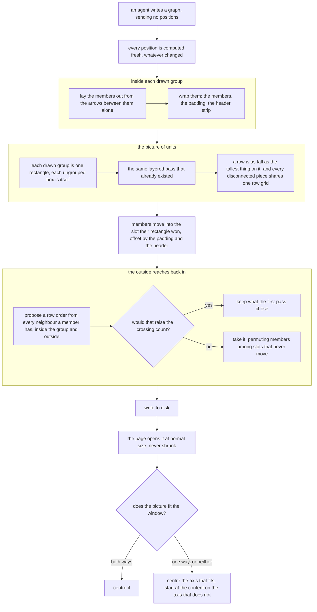

# Completion Report — A box inside a drawn group gets laid out like every other box

Written for a hostile reviewer: every claim checkable, no claim without evidence.

```yaml
verified-by:
  - round: <n>
    lane: <verifier lane/model>
    checks: <the implementing lane it checked>
```

## What the change does



The prose below and the Spec say the same thing; the picture is redundant with both.

## Spec coverage

| Spec item | Origin | Implemented at (file:line) | Validated by |
|-----------|--------|----------------------------|--------------|
| `PUT /graph` computes every position from scratch on every write; the placement halves of the branch merge, the branch itself stays for `checkOrphans` and the unregister | this run | `viewer/server.js:1178` (`positionGraph`, inside `handleGraphPut` at `:1157-1195`) | `server.test.js` "PUT /graph lays every node out and ignores what an agent sends"; "both write routes enforce their distinct authority" |
| `retainDiskPositions`, `placeNewGroupMembers`, `placeGroupUnits` deleted, with `latticeRing`, `meanCentres`, `groupChanged`, `clearsBy`, `overlaps`, `nodeRect` | this run | absent from `viewer/server.js`; `grep -n` finds no definition or call | `grep`; net −314 lines across the two files |
| `groupRect` and `canonicalGroupNodes` survive | this run | `viewer/server.js:797`, `:799` | used by `positionGraph` |
| `layout` takes a size lookup and a component-separation flag | this run | `viewer/server.js:557` | every group test; `separateComponents: false` used at `:822` |
| Row heights variable, indexed by local row, **global across components** (D7, D21) | this run | `viewer/server.js:571-577` | `server.test.js` "global variable rows align disconnected components and use a tall group's real edge" |
| Row clearance 24, unit gutter 60 — the two are different numbers (D15, D8) | this run | `viewer/server.js:554-555` | "visible groups occupy units, preserve their rows, and leave every outsider clear" |
| Component cursor measures a real right edge, not an assumed width (the Round 1 blocking finding) | this run | `viewer/server.js:584-591` | **nothing — verification round 1 reverted the cursor to the old arithmetic and both suites stayed green. Neither named test sees it. Being closed by REMEDIATION-1** |
| `placeComponent` returns its settled `order` and `links` alongside positions (the Round 5 finding) | this run | `viewer/server.js:668`, returns at `:745` | consumed by `reorderGroupedRows` at `:880` |
| Pass one: each visible group laid out over its induced subgraph, gutter only (D16) | this run | `viewer/server.js:818-825` | "visible groups occupy units…" |
| Pass two: units with `group:`/`node:` prefixes (D22 namespacing), quotient arrows deduplicated, self-arrows dropped | this run | `viewer/server.js:827-836` | ported `:801` test (a group id may equal a node id) |
| Members translate by `GROUP_PAD` / `GROUP_PAD + GROUP_HEADER`, not to the bare slot corner (the Round 1 major) | this run | `viewer/server.js:841` | "visible groups occupy units…" asserts both offsets directly |
| Pass three: one snapshot for outside nodes, group-mates live; rows are the group's own; arrow-less members excluded from the sort; permute among fixed slots, never `pack`; adopt only if crossings do not rise (D20) | this run | `viewer/server.js:848-886` | the ordering and parallel-arrow tests — **but verification round 1 proved those do not guard the guard, the key, or the snapshot: each can be removed with both suites staying green. Being closed by REMEDIATION-1** |
| Crossing guard counts internal via `crossings` plus a per-row external inversion count, both on deduplicated pairs | this run | `viewer/server.js:854-867`, `:880` | **nothing — verification round 1 deleted the guard outright and both suites stayed green. The parallel-arrow test cannot see a crossing count. Being closed by REMEDIATION-1** |
| A non-member between two members renders, loop and all — no new refusal (D10) | this run | no refusal added; `breakCycles` unchanged at `:598` | "…and quotient loops still write" |
| Invisible groups take no part in placement (D2) | this run | `viewer/server.js:815` filters on `visible` | ported `:801` test covers an invisible-group graph laying out untouched |
| A graph with no visible group lays out byte-identically to today on a first write | this run | falls out of the arithmetic above | ported `:801`; "canonical round-trip canonicalizes byte-for-byte" |
| `GROUP_GAP` removed from `viewer/server.js` and `protocol/graphs.md` (D9), **and from `viewer/test/server.test.js`** with its `clearsGroupBox` helper (D22) | this run | absent from all three; `grep -rn GROUP_GAP` returns nothing outside `docs/plans/` | `grep` |
| `fitToView` stops scaling; scale on open is always 1 (D11, D13) | this run | `viewer/index.html:657-672` | `browser.spec.js` "a graph opens at scale 1, never shrunk to fit" |
| Per-axis anchoring: centre the axis that fits, anchor the axis that does not (D18) | this run | `viewer/index.html:667-671` | two new browser tests — one graph fitting both axes, one too wide |
| `fitToView` builds its box from `nodesBoundingBox` and `visibleGroupBox` rather than an open-coded loop | this run | `viewer/index.html:659-666` | browser suite |
| No fit control added anywhere (D13) | this run | `viewer/index.html` toolbar unchanged; Escape still the only key handler | `grep` on the toolbar markup |
| `protocol/graphs.md`: what a graph is, the on-the-wire paragraph, `GROUP_GAP`, the 200-by-116 paragraph, the drawn-group section | this run | `protocol/graphs.md:15-21`, `:340-350`, `:379-382`, `:210`, `:226-229`, `:169-176` | read by the lead; no automated gate exists for prose |
| Five stale code comments | this run | `viewer/server.js:536-544`, `viewer/index.html:244-248` and `:257-259`, `viewer/test/browser.spec.js:50-52` and `:916-917` | read by the lead |
| Fixtures a test `PUT`s carry the layout's own output | this run | `viewer/test/fixtures/canonical.json` regenerated (13 lines changed) | "canonical round-trip canonicalizes byte-for-byte" |
| `viewer/test/server.test.js:599-863` deleted; `:801` ported; `:452-456` and `:582-596` rewritten | this run | `viewer/test/server.test.js` | suite green at 45 |
| `browser.spec.js:401` re-expressed against the laid-out position; `:1754`'s shove half deleted and its drift assertion ported | this run | `viewer/test/browser.spec.js` | suite green at 63 |

No `pre-existing` rows: the plan's Prior Work table was empty.

## Deviations from plan

Three, all small and all recorded here rather than absorbed.

**The plan's warning about its own test inventory was wrong in the safe direction.** The Spec told the implementer the list of existing tests this change breaks "has been wrong five times" and to run the suites unmodified first. On the browser side exactly the two named tests failed and nothing else. The advice cost nothing and the warning stays useful, but the record should say it over-warned rather than under-warned.

**One new server test asserted the wrong slot.** `the third pass orders members by external neighbours without moving an unconnected member` assumed three arrow-less members lay out in id order `a, idle, b`; `components` orders pieces by the id each one starts with, which is `a, b, idle`. The implementation was right and the assertion was wrong — it now asserts the property that actually matters, that the three first-pass slots are still the three slots and the arrow-less member holds its own.

**`fitToView` was tidied after the lane finished.** It carried a `const k = 1` multiplied through every term. Replaced with the two-branch expression; behaviour identical, both suites re-run.

## Routers

None. This change moved no ownership between directories, added and removed no files, and no router named anything it touched — checked by grepping every `AGENTS.md`, `CLAUDE.md` and `CONTRIBUTING.md` for the deleted functions, the removed constant, and the layout and position vocabulary. The root router's `viewer/` row names `index.html` and `server.js` and their roles, all still true.

## Validation evidence

```
$ node --test 'viewer/test/*.test.js'
ℹ tests 45
ℹ pass 45
ℹ fail 0
ℹ duration_ms 21763.818688

$ npm --prefix viewer run test:browser
  63 passed (31.9s)

$ bash spine/test/run.sh          → exit 0
$ bash sensitivity/test/run.sh    → exit 0
$ bash install/test/run.sh        → exit 0

$ grep -rn "GROUP_GAP" --include='*.js' --include='*.html' --include='*.md' . | grep -v docs/plans
(no output)
```

Beyond the suites, three committed graphs were laid out through the new server on its own
`--port` and `--cache-root`, which is the check the Spec asked for and no test performs:

```
how-a-group-gets-laid-out.json  (14 boxes, 2 drawn groups)
  arrows pointing back up : 0
  non-members inside a box: none
  group boxes overlapping : none
  distinct rows           : 0 202 342 506

a-non-member-between-members.json  (11 boxes, 2 drawn groups)
  arrows pointing back up : 0
  non-members inside a box: none
  group boxes overlapping : none
  distinct rows           : 0 140 280 482 622 762
  [let-it-render] accept@154,482  breaker@154,622  confusing@24,762  honest@284,762

how-much-shows-when-it-opens.json  (12 boxes, 3 drawn groups)
  arrows pointing back up : 0
  non-members inside a box: none
  group boxes overlapping : none
  [never-shrink] full-size@462,622  readable-big@332,762  unchanged-small@592,762
```

`accept → breaker → honest/confusing` on three consecutive rows inside a group boundary is the
defect this plan exists against: under the old code that group's members were repacked into a
square block in id order with the arrows between them never consulted.

## Known gaps / residual risks

- **Nobody has looked at this in a browser.** The browser suite drives real Chromium and
  asserts geometry, but no human has opened a redrawn graph and read it. The committed graphs
  under `docs/plans/*/graphs/` still hold their old positions, because nothing has rewritten
  them since the change landed — they will move on the next agent write to each file.
- **The third pass has never fired on real data in a way anyone has checked.** Both its
  counter-examples are constructed, and the corpus sweep during review found no real graph where
  an unguarded sort would have made things worse. The guard is therefore exercised only by
  synthetic fixtures.
- The five costs in the plan's Accepted Risks table are unchanged and were accepted knowingly:
  the cut-through loop rendering as a backwards arrow, the server's 200×116 over-estimate now
  inflating row heights, vertical slack in a short component beside a tall one, an external arrow
  meeting a group's rectangle rather than the member it names, and a plain box sitting 62 pixels
  above a neighbouring group's members when they share a row.
- `viewer/test/fixtures/canonical.json` changed, so any future test asserting a coordinate
  against it must derive that coordinate from the layout rather than from the old file.

## Remediation rounds

### Remediation 1 — 2026-09-21

Round 1 verification returned `FAIL` from both verifiers. The gap list and the analysis are in
`REMEDIATION-1.md`. **Every gap was in the suite or in this report; none was an implementation
defect.** The server verifier established that positively, with a mutation harness over 400-600
generated graphs that could not break the code — so no source file was touched in this round,
and the diffs for `viewer/server.js` and `viewer/index.html` are byte-identical to what they
were before verification began.

What changed: `viewer/test/server.test.js` gained regressions for seven properties that had
none, and `viewer/test/browser.spec.js` gained the two opening branches that were unguarded
plus a tightened third that could not tell anchoring from centring. Two orphaned helpers,
`nodeBox` and `setPositions`, were deleted.

Each new test had to **turn its named mutation red**, and both lanes reported red-then-green
evidence per task rather than only a passing suite. The lead re-ran two of those mutations
independently rather than taking the reports on trust:

```
$ # delete the keep-the-best guard at viewer/server.js:880
ℹ tests 50   ℹ pass 49   ℹ fail 1
$ # revert the component cursor to the old arithmetic
ℹ tests 50   ℹ pass 15   ℹ fail 35
$ # restored
ℹ tests 50   ℹ pass 50   ℹ fail 0
```

**Correction, from the closure review.** The 35 figure above is not the right number. The lead's
cursor mutation was written as `right - sizeOf('x').w - min + NODE_PITCH + …`, which perturbs
more than the real revert does; the faithful revert to
`max - min + NODE_PITCH + COMPONENT_GAP` turns **two** tests red on the current tree. Two is
the number that matters, and two is enough — the point stands that the component cursor was
the blocking finding of the plan's first review round and had no regression test at all until
this remediation.

**One deviation.** The two counter-example shapes recorded in the plan's Log — written during
review to describe an unguarded median sort — do not in fact change the output of *this*
implementation's guard-free mutant. They were derived from the Spec's description of the pass
rather than from the built code. The lane built a working counterexample instead and used that.
The Log shapes stay accurate as descriptions of the hazard and inaccurate as fixtures, which is
worth knowing before anyone reaches for them again.

**Validation after remediation:**

```
$ node --test 'viewer/test/*.test.js'
ℹ tests 50   ℹ pass 50   ℹ fail 0

$ npm --prefix viewer run test:browser
  64 passed (31.9s)
```

Lanes: `gpt-5.6-terra` (session `01a0c56c-8985-7341-9fc2-9dcb7372c161`) for the server suite; `sonnet` in a worktree for the
browser suite; lead for this report and for the independent mutation checks.

### Remediation 2 — 2026-09-21

Closure review of round 1: `PASS` on the page, the browser suite and `protocol/graphs.md`;
`FAIL` on the server half with **one** of seven gaps surviving, the other six confirmed dead
by re-running each mutation. Full account in `REMEDIATION-2.md`.

The survivor: no test could tell the ordering key D20 settled on from the one it superseded.
The round-1 brief called the mutation "read only neighbours outside the group", which has two
readings, and the lane killed the wrong one — under the reading that matters, the pre-D20
external-only median with the member's own x-centre as fallback, its fixture produced
byte-identical output. One rung taken: same tier, `xhigh`, fresh lane rather than a resume.

**The first dispatch of that lane was killed before it wrote anything** and is recorded
unstarted, not attempted. It mattered that this was checked rather than assumed, because the
brief has the lane mutate the source and revert it: `viewer/server.js` was confirmed
byte-identical, the test file untouched, the suite still 50/50. Credentials were fine (174h on
the token, no quota or auth marker in the log), so the kill has no explanation beyond the
harness dropping it. Re-dispatched clean.

One test added, `the third pass gives internal and external neighbours equal weight in its
median`, on the six-arrow fixture the verifier supplied: a visible group `{a, b, c}` with
`a->b` inside it and `p->a`, `q->a`, `c->r` crossing the boundary.

The lead applied the superseded algorithm independently rather than trusting the lane's
evidence — rewriting the key to skip group-mates and fall back to a member's own x-centre —
and confirmed the new test is the one that fails, with exactly the swap the verifier predicted:

```
$ # key mutated to the pre-D20 algorithm
✖ the third pass gives internal and external neighbours equal weight in its median
ℹ tests 51   ℹ pass 50   ℹ fail 1
     a: 154, c: 414   (actual)  vs  a: 414, c: 154   (expected)

$ # restored
ℹ tests 51   ℹ pass 51   ℹ fail 0
$ sha256sum -c server-hash-before-dispatch
viewer/server.js: OK
```

**Validation after remediation:**

```
$ node --test 'viewer/test/*.test.js'
ℹ tests 51   ℹ pass 51   ℹ fail 0

$ npm --prefix viewer run test:browser
  64 passed
```

No source file was touched in this round either. Lane: `gpt-5.6-terra` at `xhigh`, session
`01a0c5c5-3484-7f70-bb55-901ecb6718a6`.

### Remediation 3 — 2026-09-21

Round 2's closure review found two more gaps and one stale document. Neither gap was a
survivor: the one that lived through round 1 is dead, and so are all seven originals, each
re-run red-under-mutation and green-without on a copy baselined at 51/51.

Both new gaps were **second readings of mutations already killed**, the same shape as round
2's. The snapshot rule has two sides — outside boxes frozen, a group's own members read live —
and only the first was guarded. The endpoint deduplication appears in two places, the median
key and the external crossing count, and removing it from both was caught while removing it
from the count alone was not. Both are refinements the plan added at review Round 5 to
sentences that were already roughly right, which is the class of detail a fixture written for
the coarse version of a rule will always miss.

Two tests added, on the fixtures the verifier supplied and confirmed end-to-end. The round-2
test was also reshaped: it asserted two absolute pixel positions where the property it names is
ordinal, so it would have gone red on any future spacing change that left the property intact.
It now asserts the ordering and still dies under its own mutation.

The lead applied both mutations independently rather than trusting the lane:

```
$ # centre() frozen for group-mates as well as outsiders
✖ the third pass reads earlier group-mates live as it walks a row
ℹ tests 53   ℹ pass 52   ℹ fail 1

$ # externalCrossings iterating incoming.edges instead of the deduplicated pairs
✖ the third pass deduplicates endpoint pairs before it counts external crossings
ℹ tests 53   ℹ pass 52   ℹ fail 1

$ # restored
ℹ tests 53   ℹ pass 53   ℹ fail 0
$ sha256sum -c server-hash-before-dispatch
viewer/server.js: OK
```

**Validation after remediation:**

```
$ node --test 'viewer/test/*.test.js'
ℹ tests 53   ℹ pass 53   ℹ fail 0

$ npm --prefix viewer run test:browser
  64 passed
```

No source file was touched in this round either — three verification passes have now failed to
break the implementation. Lane: `gpt-5.6-terra` at `xhigh`, session `01a0c5d7-8f78-7412-9eb2-668f8202a729`.

**The stopping rule**, recorded because the next session will otherwise re-derive it. "Every
sentence of the Spec has a mutation that kills it" is not reachable by inspection. The
reachable version, which the verifier proposed and the lead adopted: the suite guards every
property the plan spent a review round arguing about. With these two closed, it does.

### Verification closed — 2026-09-21

`PASS` from both verifiers. The GPT lane passed the page, the browser suite and
`protocol/graphs.md` at round 2. The Claude lane passed the server, its suite and the fixtures
at round 4, after four rounds in which it never once broke the implementation and every finding
was a missing guard.

Its final account: **thirty-eight mutations across four rounds, thirty-three dead.** The five
that live were each re-run this round rather than cited from an earlier one, and none is a
behaviour the code can be shown to have — counting external inversions per group rather than
per row is indistinguishable over 5,600 graphs; repeating the third pass's sweep differs on 2 of
600 but violates no stated outcome; reversing the group walk order changes nothing across 3,988
multi-group graphs, which is the one-snapshot design working; dropping the dedupe and sort from
the quotient arrows changes nothing because `layout` re-derives both; and shrinking a group unit
by twice the padding is absorbed by the gutter.

It also re-derived both of the final round's mutations independently rather than taking the
lead's, and wrote additional forms of each — a bottom-aligned variant, a zero-pitch bend, and a
build with the bend reservation removed entirely — confirming each test binds its property
rather than one mutation of it.

**One residual, named so it is not mistaken for coverage.** The Spec's "a bend point contributes
nothing to a row's height" has no test, because it is not reachable: `layout` computes row
heights before `placeComponent` creates any bend, so no code path exists in which a bend could
contribute. True by construction rather than by assertion, which is the right reason for a
property to go unasserted.

**The authorship note, kept because it is a standing rule rather than a closed item.** The final
two tests were written by the lead after two consecutive GPT lanes were killed before writing
anything. The verifier's judgement on that: the mitigation held *this* time only because the
specification came from outside the lead — fixtures, expected output and the mutation to kill
were all fixed before anything was typed, and the independently derived variants are the check
that says so. What it flagged for next time is the step after: the lead is now the only party to
have both written a test and ruled on whether it was needed, and that is tolerable only while
the finding originates elsewhere. **If a future round has the lead finding the gap and closing
it, there is no outside check left in the loop** — that is the point to route out rather than
absorb, and two dead lanes is a channel to fix rather than a reason to collapse the two roles.

### Documentation sweep

Run at PASS, before any PR:

- `AGENTS.md:107` cited `viewer/server.js:1092` for the lock-reuse warning. The change moved
  that code; the citation now points at `:1367`. A router that lies is the failure this sweep
  exists against, and a line number is a claim like any other.
- `README.md:31` told a reader "you drag the boxes until it reads" with no mention that a drag
  now ends at the next agent write. Extended to say so, and to say why: the layout is meant to
  be right without help, dragging fixes what it got wrong in the meantime, and the durable
  thing is a verdict rather than an arrangement.
- Nothing else. No router named a file this change touched, no ownership moved between
  directories, and no other document made a claim about positions surviving a write — checked
  by grepping every markdown file outside `docs/plans/` for the vocabulary of the old behaviour.
