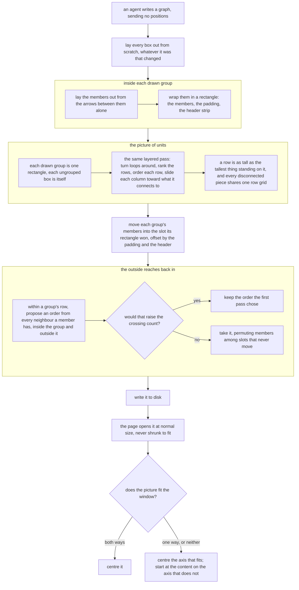

# A box inside a drawn group gets laid out like every other box

**Idea:** `IDEA.md` — what this is for and why, in plain language. Read it first; it is
the north star this plan serves. Goal and Constraints live there, not here, so they don't
get buried as this file grows.

## Open Questions

Ordered by leverage; discussed one at a time. A settled question moves to the Decision
Log and is deleted from here.

None. Every question is settled; see the Decision Log.

## Watch List

Things noticed that need looking into — not yet decisions for the user. Written down the
moment they're spotted so they can't be forgotten, surfaced to the user one line at a
time as they appear, and emptied before Stage 1 exits.

Each item ends up settled by the agent (noted in the Log), promoted to an Open Question,
promoted to a Constraint or Accepted Risk, or waved off by the user.

| # | Noticed | What needs looking into | Raised to user? | Outcome |
|---|---------|-------------------------|-----------------|---------|
| W1 | 2026-09-20 | `protocol/graphs.md:16-19` and `:351-353` both state that a graph exists to hold positions across turns and that positions are Collin's to set | yes, one line | settled by D3 — the file is rewritten as part of this change; the Spec names both paragraphs |
| W2 | 2026-09-20 | `viewer/test/browser.spec.js:1583` asserts a graph opening at fit shows a group header whole | yes, one line | settled by D11 — the test is rewritten against the new opening rule; see the Spec's test section |
| W3 | 2026-09-20 | `viewer/test/browser.spec.js:1754` asserts a visible group pushes exactly one non-member clear at exactly `GROUP_GAP`. The pushing mechanism is being removed | yes, one line | settled — the guarantee survives as an outcome test (no non-member inside any group rectangle) rather than a mechanism test; the Spec names it |
| W4 | 2026-09-20 | `viewer/test/server.test.js:1224` pins consecutive rows at exactly 140 pixels apart | yes, one line | settled by D7 — the assertion splits into "a graph with no visible groups is byte-identical to today" and "no two rows overlap" |
| W5 | 2026-09-20 | Confirm a drag still reaches disk once `PUT /graph` stops preserving positions | yes, one line | settled — verified against a running server, not read: a `PUT /view` moving a box lands on disk and survives a read-back. See the Log |
| W6 | 2026-09-20 | The server sizes every node 200×116 (`GROUP_NODE_H`) while the page draws a short label at 74 (`viewer/index.html:230`), and under D7 that over-estimate sets row heights | yes, one line | settled by D12 — accepted as-is |

## Decision Log

Append-only. A reversal is a new entry superseding the old, never an edit.

| # | Decision | Rationale | Source |
|---|----------|-----------|--------|
| D1 | An agent's redraw is free to move a box that already has a position | Collin's ruling. The reason dragged positions were defended is that the layout was bad; fixing the layout removes the need to engineer around them | user |
| D2 | Invisible groups continue to have no effect on placement | They are highlight sets behind a phrase in the explanation and have never affected it (`viewer/server.js:918` filters to `visible` only). Nothing in this change gives them a reason to start | defaulted |
| D3 | `protocol/graphs.md` is rewritten as part of this change, not after it | It is the only statement of the format an agent reads before writing, and it currently describes the behaviour being removed | defaulted |
| D4 | The tests at `viewer/test/server.test.js:599-834` are deleted alongside the mechanism they assert | They pin the eviction order, the four-direction tie-break and the exact sixteen-pixel landing — the mechanism, not any outcome. The outcomes worth keeping get re-asserted against the replacement | defaulted |
| D5 | Every `PUT /graph` lays the whole picture out fresh. No write keeps a position, structural or not | One placement path instead of two. The exception for a prose-only write would fire mainly on turns where nothing interesting changed, and would keep alive the branch this change exists to collapse | user |
| D6 | A drawn group is laid out as one unit: the existing layered pass runs over its members alone, the result becomes one rectangle, and the same pass runs again over a picture in which that rectangle is a single item. Plus a boundary pull — an arrow crossing the boundary orders the member it touches early or late inside the group | Reuses the pass that already works instead of rewriting it, and makes an overlapping group box impossible rather than something to repair afterwards, which is what removes the shoving pass. The constrained single pass keeps every arrow's true target but costs several times the code for no clearly better picture at 10–25 boxes | user |
| D7 | Rows carry variable height — each row is as tall as the tallest unit standing in it, with the same clearance between rows that two 116-pixel boxes get today | Forced by D6: a row holding a group rectangle cannot be a fixed 140 pixels deep. Keeping the clearance rather than the pitch means a graph with no groups lays out exactly as it does now | defaulted |
| D8 | Units are separated by one uniform gutter regardless of what they are, so two group rectangles clear each other by the same distance two plain boxes do (60 pixels, from `NODE_PITCH` 260 minus `GROUP_NODE_W` 200) | `GROUP_GAP` = 16 describes the shoving mechanism being deleted ("a moved unit lands exactly this far past the rectangle that bound it"), so it has no meaning after D6. One gutter is simpler than two and stops group boxes crowding closer than ordinary boxes do | defaulted |
| D9 | `GROUP_GAP` is removed from `protocol/graphs.md:202` and `viewer/server.js:550`. `GROUP_PAD` and `GROUP_HEADER` stay in all three places | The page never used `GROUP_GAP` and says so (`viewer/index.html:259`), so this is a two-file removal, not a three-file one | defaulted |
| D10 | A group that a non-member cuts through renders, loop and all. No new refusal | The loop breaker already turns one arrow around rather than dropping it, which is what it does for any real loop, and a backwards arrow is an honest picture of a group drawn badly. A refusal would reject a legal graph while offering the agent no correct fix — absorbing the intervening box or dropping a member are both wrong | user |
| D11 | A graph never opens shrunk. Always normal size; centred when the whole picture fits the window, otherwise anchored so the topmost row sits near the top of the window, centred left to right | Panning and wheel-zoom have worked since the first version, so nothing required the whole picture to be visible at once. A floor under the shrinking would rescue only a graph that just barely overflows, since anything larger overflows anyway once the floor bites | user |
| D12 | The server keeps sizing every node 200×116 when it measures rows and group rectangles. The slack against the page's real heights is accepted, not closed | Closing it means copying the page's label-wrapping into the server, a second copy of a measurement contract in two files that deliberately share no module. `protocol/graphs.md:216-219` already states the disagreement and its direction: the server's box is never smaller than the page's, so the error can only add clearance. A row of ungrouped boxes is unaffected — it comes out at today's 140 pitch exactly | defaulted |
| D13 | The scale-to-fit arithmetic is deleted, not moved behind a control. No fit button, no keyboard shortcut | A button that shows the whole picture is the behaviour D11 removes with a click in front of it. Wheel-zoom reaches every scale it would, down to the same `MIN_ZOOM` floor, so the control would keep alive a branch of code whose only caller undoes what this change is for | user |
| D14 | Supersedes the boundary-pull half of D6. There is no boundary pull: a group's insides are laid out from its own arrows alone, with no virtual box standing in for the world outside. The rest of D6 — group as one unit, the pass run twice — is unchanged | The refinement was wrong, not merely unnecessary. A virtual predecessor standing for every incoming external arrow gives its target a predecessor, and `layerByLongestPath` then puts that target one row deeper. A member fed only from outside is a source of the induced subgraph and already lands on the group's first row without help; the virtual box demotes it *below* members the outside never touches, so an external arrow would enter the rectangle and travel further, not less. The matching virtual successor moves no member at all — it ranks after everything by construction — and is not worth keeping alone for a marginal clustering effect | defaulted |
| D15 | The gutter in D8 is horizontal only. Two units stacked vertically clear by the row clearance, 24 pixels, the same as two plain boxes do today | D7 keeps the row clearance at `LAYER_GAP` 140 minus `GROUP_NODE_H` 116 = 24, and D8's 60 comes from `NODE_PITCH` 260 minus `GROUP_NODE_W` 200. Making the vertical clearance 60 too would break the byte-identity requirement for a graph with no groups | review-round-1 |
| D16 | Inside a group, internally disconnected members are separated by the ordinary gutter, not by `COMPONENT_GAP`. The 200-pixel component gap applies only to the outer pass | `COMPONENT_GAP` exists so two unrelated flows do not read as one picture; inside a rectangle the agent has already declared them one system, so the extra separation asserts something the group contradicts. Measured: with `COMPONENT_GAP` a five-member group with no internal arrows comes out 2040 of member span inside a 2088 rectangle, against 768 for today's block. With the gutter alone the span is 1240 inside a 1288 rectangle — and 1240 is exactly what those same five boxes occupy when they are *not* grouped (4 × `NODE_PITCH` + `GROUP_NODE_W`), so drawing a group around them costs only the padding. That is the idea's own test, and a better reason than the reader being able to pan | review-round-1 |
| D17 | After the outer pass places the units, each group's members are reordered within their own rows by the median position of whatever connects to them from outside, and the row is re-packed. A third pass, and the one place the outside reaches inside a group | This is the part of the user's complaint the first two passes miss. An ungrouped box already gets ordered by its neighbours in `placeComponent`'s median sweeps; a grouped one would not, because the inner pass never sees an external arrow — so without this, grouping a box makes it worse than not grouping it, which is the whole defect. Safe by construction: every member is `GROUP_NODE_W` wide, so permuting slots within a row changes neither the row's width nor the rectangle's dimensions. Measured: 11 of 45 drawn groups have no internal arrow at all, so a quarter of them are ordered by nothing else | review-round-1 |
| D18 | On the overflow branch, the opening view anchors per axis: the axis that fits is centred, the axis that does not is anchored at the start of the content | Refines D11 rather than reversing it — nothing shrinks. D11 said "centred left to right" before D16's measurements showed group rectangles reaching four figures; horizontally centring a picture wider than the window puts the start of the flow off the left edge, which contradicts what the idea asks for | review-round-1 |
| D19 | Q6 settled: the group stays one unit and the pass runs three times. The single constrained pass is not adopted | Five small known changes against one hard unknown one, in the part of the layout nothing tests directly. Three of the five (`components` gap, per-unit width, per-row height) are parameters on functions that already take parameters, and the third pass is now fully bounded. This also supplies what D6 lacked: the rectangle is frozen before the outside is consulted because that is what makes the non-overlap guarantee unconditional — if the outside could change a group's size or a member's row, the unit's footprint would change after the packing that placed it, which is the defect this plan removes. Pass three is admissible exactly because it provably cannot change the footprint | user |
| D20 | Supersedes D17's algorithm; its purpose stands. The third pass is one more of the ordering sweeps `placeComponent` already runs: it permutes members among the slots the first pass assigned, keys on the median of a member's neighbours **inside and outside the group alike**, leaves a member with no arrow untouched, and adopts a proposed order only if the crossing count does not rise | D17 said "the row is re-packed" and keyed on external neighbours only. Both are wrong and Round 3 proved it with counter-examples: re-packing honours the spread of the medians, so the group outgrows the slot the second pass reserved and two rectangles overlap; and an external-only key undoes the crossing-minimal order the first pass computed in a group that has internal arrows too. The keep-the-best guard is what makes the pass unable to make any group worse than it found it, and it is machinery `placeComponent` already has | review-round-3 |
| D21 | Row heights are shared across components, not computed per component. The height of local row *k* is the tallest unit standing on row *k* in **any** component, so every component's row *k* starts at the same y | `layout` re-bases each component to local row 0 (`viewer/server.js:571-572`) and `placeComponent` returns `layer * LAYER_GAP`, so today every component's rows land on one shared grid. Computing heights inside `placeComponent` would break that — a component holding a 202-tall group rectangle would start its row 1 at 226 while the component beside it started at 140, and `IDEA.md` names "boxes off the row grid the rest of the picture is on" as part of the complaint being fixed. 4 of the 21 group-bearing graphs measured are multi-component and hold 10 of the 45 drawn groups, so this is not rare. The cost is vertical slack in a short component beside a tall one; the shared grid is worth it and it is also what today does | review-round-4 |
| D22 | Supersedes D9's file count, not its decision. `GROUP_GAP` has a third copy at `viewer/test/server.test.js:45`, feeding the `clearsGroupBox` helper at `:68-69`. The helper goes with the constant; every one of its callers is inside the deleted range | D9 called this a two-file removal on the strength of the page not using `GROUP_GAP`, and missed the suite's own copy. Left behind, `clearsGroupBox` would assert 16 on both axes — and the new criterion about group rectangles clearing each other is exactly where a worker would reach for it, landing on the wrong numbers, since D15 makes the two axes 60 and 24 | review-round-7 |

## Spec

The settled design, grown as decisions land. Bar: a fresh agent with no conversation
history can implement from this section alone — behavior, boundaries, edge cases,
non-goals, and concrete validation commands.

The whole change, in order. Everything here is said in prose below; the picture is redundant
with it on purpose.



### The write path

`PUT /graph` computes every position from scratch on every write, whether the file exists
or not. The *placement* halves of the branch at `viewer/server.js:1255` merge into one
call on both sides. The branch itself stays: `checkOrphans` (`:1259`) and the dropped-subtree
unregister (`:1284-1289`) exist only where a previous version is on disk, and the tests at
`viewer/test/server.test.js:899-917` guard them. Three things are deleted outright rather than
adapted — `retainDiskPositions` (`:779`), `placeNewGroupMembers` (`:841`) and
`placeGroupUnits` (`:909`), together with the helpers only they call (`latticeRing`,
`meanCentres`, `groupChanged`, `clearsBy`, `overlaps`, `nodeRect`) — verified as their only
callers. `groupRect` (`:794`) and `canonicalGroupNodes` (`:792`) survive, because the new
placement uses both; nothing else in that block does.

`PUT /view` — the page's own route, which is how a drag reaches disk — is untouched. A
dragged position still lands on disk and still survives a page reload and the viewer's
one-second refresh (`handleViewPut`, `:1295`; positions are absent from the field list
`structuralDifference` compares at `:1204`, so the page remains free to write them). What
it no longer survives is the next agent write.

Verdicts are unaffected. The preservation contract covering `origin` and `was`
(`protocol/graphs.md:569-609`) is about rulings on nodes and edges, not about where a box
sits, and this change does not touch it.

`protocol/graphs.md` is rewritten to match, at minimum its "What a graph is" paragraph
(`:16-19`) and the "On the wire" paragraph that calls positions Collin's to set
(`:329-353`). Both currently promise the behaviour this removes.

### Placement

One routine places everything, and it is the one that exists today: break the loops so
every arrow can point down (`breakCycles`, `viewer/server.js:584`), give each box a row one
deeper than its deepest parent (`layerByLongestPath`, `:611`), lay out pieces sharing no
arrow separately (`components`, `:635`), reshuffle each row until the fewest arrows cross
and slide each box toward the middle of what it connects to (`placeComponent`, `:654`).

It runs three times: once inside each group, once over the units, and once more to let the
outside reach back inside. For the first two, `layout` (`:558`) takes a size lookup instead
of assuming every box is `GROUP_NODE_W` by `GROUP_NODE_H`: same ids and arrow pairs as now,
plus a function returning each id's width and height, and a flag for whether components are
separated by `COMPONENT_GAP` or only by the gutter (D16). Everything below it —
`breakCycles`, `layerByLongestPath`, `components`, `placeComponent` — is reached through that
one entry point.

Inside first. For each group with `visible: true`, `layout` runs over the induced subgraph:
its members, and only the arrows with both ends among them. Nothing else joins that run — see
D14 for why the boundary pull that was originally part of D6 is not here. Members that share
no arrow are separated by the gutter alone, not by `COMPONENT_GAP` (D16).

The member positions that come back are relative to the group's own origin, and the
rectangle around them is `groupRect`'s existing arithmetic (`:794`) — members' bounds plus
`GROUP_PAD` on three sides and `GROUP_PAD + GROUP_HEADER` above.

Outside second. Every group with `visible: true` becomes one unit carrying that rectangle's
width and height; every node in no visible group becomes a unit carrying `GROUP_NODE_W` by
`GROUP_NODE_H`. A unit's id is prefixed — `group:<id>` or `node:<id>` — because a group id
and a node id may legally be identical (`validateGraph` keeps the two namespaces apart at
`:157` and `:192`, and `viewer/test/server.test.js:801` asserts a graph using the same string
for both is accepted). Today's `placeGroupUnits` prefixes for exactly this reason (`:921-923`)
and the requirement has to survive it. A uniform prefix also preserves the relative sort order
that `layout`, `breakCycles` and `components` all depend on, which is part of what keeps the
no-groups case byte-identical.

An arrow between two nodes becomes an arrow between their units; an arrow whose two ends land
in the same unit is dropped. The same routine runs over those units, this time with
`COMPONENT_GAP` in force.

Then each group's members translate together into the slot its unit won — offset by the
padding, not to the slot's own corner. The unit carries the *rectangle's* size, and
`groupRect` puts the rectangle's corner at `GROUP_PAD` left of and `GROUP_PAD + GROUP_HEADER`
above the members' own bounds, so a member lands at `(unitX + GROUP_PAD, unitY + GROUP_PAD +
GROUP_HEADER)` plus its position within the group. Translating to the bare slot origin instead
would push every group's 62-pixel header band into the row above it.

Inside again, third. One more of the ordering sweeps `placeComponent` already runs, applied to
a group's own rows once the second pass has placed everything. This is the only place the
outer picture reaches inside a group, and it is what stops a grouped box being ordered worse
than an ungrouped one (D20) — today an ungrouped box is already ordered by its neighbours in
those sweeps, and a grouped one would not be, because the first pass never sees an arrow
leaving the group.

- **One snapshot** of the absolute x-centre of every node **outside the group being
  reordered**, read before any group is touched, so the result cannot depend on which group is
  handled first. Nothing else about the walk order matters. A member's *own* group-mates are
  read live rather than from the snapshot, so a row accepted earlier in the walk is what the
  next row keys against — the same thing `placeComponent`'s downward sweep does when it builds
  `rank` from the row it has just reordered (`:690`). Determinism survives because a member only
  ever moves during its own group's pass, and every other group reads it frozen.
- **Rows are the group's own**, not those of the components the first pass found inside it. An
  arrow-less group is *n* single-node components, so per-component scoping would permute
  nothing — which is the case the pass exists for. Pass one runs `layout` over the group's
  induced subgraph, and `layout` splits that into components and places each separately
  (`:570-578`), so a group's rows have to be assembled from those pieces: **row *k* of a group
  is every entry, member or bend, whose local row index is *k* in any of the group's own
  components, in component order and then in each component's own row order.** Not "ordered by
  x": `placeComponent` returns positions for members only (`:727`), a bend has no entry in that
  map at all, so there is no x to sort a bend by. Component order gives the same answer anyway,
  since `layout` lays components out left to right along its cursor (`:577`). The links are the union of
  the components' links. `layout` performs that merge and returns one `order` and one `links`
  per group, rather than handing the third pass a per-component return to reassemble.
- **Propose an order** within a row: sort the members that have at least one arrow by the
  median of their neighbours' x-centres — neighbours inside the group and outside it alike,
  each read the way the bullet above says to read it, a group-mate live and anything else from
  the snapshot — with endpoint pairs deduplicated the way `layout` already dedupes them (`:561-564`),
  so two arrows between the same pair of boxes do not count twice. Ties break on the members'
  existing order, the same `was` tiebreak `placeComponent` uses at `:697`.
- **A member with no arrow at all is not moved.** It keeps its slot and takes no part in the
  sort. Nothing about where it sits can change a crossing count, and excluding it is what makes
  that promise true — keying it on its own position would not, since a sort can still carry it
  past members whose keys fall outside the row's own range.
- **Assign** the proposed order to the slots those movable members already occupy. Never a new
  coordinate, and never `pack` (`:743`): calling it with medians as the desired positions would
  honour their spread, so a row whose neighbours sit 900 apart would come out 900 wide, the
  group would outgrow the slot the second pass reserved, and two rectangles would overlap.
  Permuting among a fixed set cannot do that, and it preserves the gaps the first pass reserved
  for bend points (`:667-678`), which are not member positions and are never reassigned.
- **Adopt only if crossings do not rise.** Without this guard a single median sort can trade
  an internal crossing for an external one; constructed counter-examples exist on both review
  lanes, though neither fires on any of the 45 groups measured on this machine; both shapes are
  written out in the Log so the fixtures can be built from them.

  The count is the sum of two inversion counts, and `crossings` (`:764`) supplies only the
  first of them — it works on discrete adjacent-row orderings and knows nothing about
  coordinates, so the external half cannot be expressed through it:

  1. **Internal.** `crossings` applied unchanged to the group's own row orders and its own
     links, bend points included. Pass one computed both, but `placeComponent` currently
     discards them: it returns positions alone (`:727`), while `order`, `links` and every bend
     point's slot are locals, and a bend has no entry in the returned map at all. Reconstructing
     them from the returned x values is not possible — the bends' interleaving is gone, and
     `:662-679` is the *pre-sweep* order rather than what the eight sweeps at `:683-701`
     settled on. So `placeComponent` returns its settled `order` and its `links` alongside the
     positions, and `layout` hands a group's through to the third pass. That is the fourth
     change to `placeComponent`, listed below.
  2. **External.** Per row, independently — which is what covers a member in a middle row that
     `crossings` would never see, since it only compares adjacent rows. For each row, list
     every arrow between one of its members and a node outside the group, ordered by the
     member's slot; count the pairs whose outside ends are inverted by snapshot x. That is the
     same inversion loop `crossings` runs at `:772-774`, over x values instead of ranks.
     **Endpoint pairs are deduplicated first**, exactly as the median key deduplicates them and
     as `layout` already does at `:561-564`. Otherwise two arrows between the same pair of boxes
     count twice here while counting once in the key, and duplicating one external arrow could
     flip a row's proposal from accepted to rejected.

  Compute the sum for the group with the incumbent row order and again with the proposal, and
  take the proposal when its sum is **not higher**. The granularity is **one row at a time**:
  walk the group's rows in row order, propose and accept or reject that row, and carry the
  result into the next row's comparison. One sweep, never repeated — unlike `placeComponent`'s
  eight passes (`:686-701`), which re-sweep because they also move coordinates. Not-higher rather than
  strictly-lower, which is where this differs from `placeComponent`'s `count < fewest`
  (`:700`): that loop sweeps repeatedly and needs strict improvement to avoid cycling, while
  this one visits each row once. Adopting on a tie buys the alignment — a member sitting under
  what feeds it, rather than merely not crossing it — which the crossing count does not measure
  and which is most of what the pass is for in a group whose members share no arrow.

The rectangle is unchanged by construction: the same count of members, each `GROUP_NODE_W`
wide, assigned to the same set of positions. The row's extent is identical before and after,
so the group's bounds, the unit's footprint, and the second pass's non-overlap result all
still hold — which is why a pass that consults the outside is admissible here at all (D19).

Four changes make all of that possible — two inside `placeComponent`, two in `layout`. The
size lookup and the component-gap flag described at the top of this section are the signature
change that carries them.

- **Per-unit width** replaces the constant `NODE_PITCH`. The routine already carries a per-id
  pitch map (`:707-713`), so a unit's pitch becomes its own width plus the gutter (D8). A bend
  point keeps `BEND_PITCH` exactly as now.
- **Per-row height** replaces the constant multiplier at `:727`. Row origins accumulate: the
  next row starts one row clearance — 24 pixels, `LAYER_GAP` minus `GROUP_NODE_H` (D15) —
  below the tallest unit standing on the previous one. A bend point contributes nothing to a
  row's height. That is safe because longest-path layering guarantees every row up to the
  deepest holds at least one real unit: a unit at row `k` has a predecessor at row `k-1` by
  construction, so no row is bends alone.

  **Units top-align at the row origin.** A unit shorter than its row sits at the row's top
  edge, not centred and not bottom-aligned. For a group that means the *rectangle's* top meets
  the row line, so its members sit `GROUP_PAD + GROUP_HEADER` — 62 pixels — below a plain box's
  top in the same row. That is what a labelled container looks like and it keeps every unit
  starting on the row line, which is the property worth having; the alternative, aligning
  members across the row, would push a group's rectangle up into the clearance above and make
  row heights depend on what kind of unit starts the row. Recorded in Accepted Risks.

  **The heights are global, not per component** (D21). `layout` re-bases every component to
  local row 0 (`:571-572`), so today each component's row *k* lands at the same `k * LAYER_GAP`
  as every other's and the whole picture shares one row grid. To keep that, the height of local
  row *k* is the tallest unit on row *k* in **any** component, computed in `layout` before the
  per-component placement and handed down. Computing it inside `placeComponent`, which sees one
  component, would let a component holding a tall group start its row 1 at 226 while its
  neighbour started at 140.
- **`placeComponent` returns its orderings**, not positions alone: the settled `order` and the
  `links` it built, so the third pass can count internal crossings over the rows pass one
  actually chose rather than a reconstruction that has lost the bends.
- **The component cursor** in `layout` (`:577`) has the same assumption and must change with
  them. Today it reads `cursor += max - min + NODE_PITCH + COMPONENT_GAP`, where `max` is the
  rightmost unit's *left edge*; with a unit wider than 200 the next component starts inside the
  previous one. It becomes `cursor += (rightmost unit's right edge - min) + gutter +
  COMPONENT_GAP`, which is the same number when every unit is 200 wide.

A graph with no visible groups must come out byte-identical to today under all of these.

Invisible groups take no part in any of this (D2). They are filtered out exactly where
`viewer/server.js:918` filters them out today.

What this gives up: an arrow from outside a group points at the whole unit, so it meets the
rectangle rather than the member it names, and which *row* that member sits on is decided by
the group's own arrows alone. A member fed only from outside is a source of the induced
subgraph and therefore already lands on the group's first row, which is the common case; a
member with internal predecessors stays behind them however the outside reaches it. The third
pass fixes the ordering within a row but never moves a member between rows, and that is the
line: the group's own arrows own the rows, while the order along a row answers to every
neighbour a member has, inside the group and outside it alike.

Collapsing a group can also create a loop the original graph did not have, when a box that
is not a member lies on a path between two that are: both arrows become arrows between the
unit and that box, one out and one back. Nothing special handles it. `breakCycles`
(`viewer/server.js:584`) turns one of the pair around exactly as it does for a real loop,
the picture is drawn, and one arrow points back into the group's boundary. No new refusal
code is added (D10). Measured incidence on this machine is 4 of 45 drawn groups across 93
graph files (the corrected recount in the Log, which excludes this plan's own graphs), so this is expected output, not an edge case, and the test suite should cover
it as such.

### Opening the picture

`fitToView` (`viewer/index.html:654`) stops scaling. The scale on open is always 1. The
function still bounds every node plus every visible group's rectangle — which is why the
header of a group at the edge is not clipped — and uses that box only to choose a
translation. It should build the box from `nodesBoundingBox` (`:546`) and `visibleGroupBox`
(`:566`) rather than keep its own open-coded loop at `:657-660`; those two already exist for
this, and `centreGroupIfNeeded` (`:594`) already carries the "translate, never scale" rule
this is adopting.

The choice is **per axis**, not one decision for the picture (D18):

- An axis on which the content fits the canvas within the existing 60-pixel margin is
  centred, exactly as today's `k === 1` case already does.
- An axis on which it does not fit is anchored at the start of the content, one margin in.

So a graph that fits both ways opens centred, as it does today. One too tall opens at the
top, centred left to right. One too wide opens at its left edge, centred vertically. One too
big both ways opens at its top-left corner. Horizontal centring on an overflowing picture is
the case D18 exists to prevent: with group rectangles reaching four figures wide (D16), it
would put the start of the flow off the left edge.

The scaling is deleted rather than relocated. No fit control is added to the toolbar and no
keyboard shortcut reaches one (D13); the toolbar keeps exactly the zoom-out and zoom-in pair
it has now (`:216-217`), and Escape stays the page's only key handler (`:739`).

`MIN_ZOOM` stays at 0.3 and `MAX_ZOOM` at 2.5 — they still bound wheel-zoom and the zoom
buttons (`:1890-1904`), which is how a reader reaches a scale that shows a whole large
graph. Nothing else about panning or zooming changes, and the call site is unchanged: this
still runs once per graph opened (`loadGraph`, `:696`) and never on the one-second refresh.

### Edge cases, and what stays the same

Determinism is a requirement, not a nicety: today `layout` sorts node ids and deduplicates
and sorts the edge pairs so the same graph lays out the same way however its arrays happen
to be ordered (`viewer/server.js:559-564`). The unit layer inherits that. Visible groups are
taken in `compareId` order, a group's members through `canonicalGroupNodes` (`:792`), and
the quotient arrows are deduplicated and sorted the same way the node-level ones are.

- **A group with one member.** Its rectangle is that box plus the padding and the header.
  Nothing special; the inner pass on a one-node graph returns that node at the origin.
- **A group whose members share no arrow.** `components` (`:635`) lays disconnected pieces
  out separately and sets them beside each other rather than stacking them, which is right
  inside a rectangle too — but separated by the gutter, not `COMPONENT_GAP` (D16).
- **A group with no internal arrows at all.** Every member lands on one row, in the order the
  third pass gives them from their external neighbours (D20 — every neighbour is external in
  this case, so the all-neighbour key and an external-only one agree here). A member with no arrow at all in
  either direction keeps its own position rather than being sorted anywhere — see the
  fallback in Placement; it is never id order. 11 of 45 drawn groups measured on this machine
  have no internal arrow, and in every one of them each member has at least one external
  arrow, so the third pass genuinely carries them and the fallback does not fire for a whole
  group anywhere in the current corpus.
- **A graph with no nodes.** Unchanged — `layout` returns an empty map at `:560` and no unit
  is built.
- **A graph with no visible groups.** Every unit is one node at 200 by 116, the gutter is
  today's `NODE_PITCH` minus the node width, and row heights all come out at today's pitch.
  The output must be byte-identical to today's, and a test says so.
- **Invisible groups.** Filtered out before units are built, exactly where `:918` filters
  them today (D2). They may still overlap each other and any visible group, which the format
  explicitly allows (`protocol/graphs.md:169-171`).
- **A node in no group.** One unit, same as today's treatment.

Non-goals, restated here so a reviewer does not have to open `IDEA.md`: no change to the
file format or to anything an agent writes; no nested groups; no change to how arrows are
routed or which face they leave a box by; no change to the verdict preservation contract; no
new refusal codes.

### Tests

The mechanism tests at `viewer/test/server.test.js:599-863` are deleted (D4) — the range runs
to 863, not 834: `:834-863` is one more of them, asserting both the position retention D5
removes and the eviction D4 removes. One exception: `:801` is **ported, not deleted**. It carries three assertions the replacement
still needs — that two identical creates produce identical positions, that a graph with no
visible group and a graph with only an invisible one both lay out untouched, and that a group
id may equal a node id. Only its dependence on the old placer goes.

Two tests **outside that range** also fail under D5 and are not optional to notice:

- `:582-596` ("PUT /graph ignores known positions and lays out new nodes") is the direct test
  of `retainDiskPositions`. Half of it survives: an agent's sent position is still ignored.
  The other half — a known id keeping its disk position — is exactly what D5 reverses, so the
  test is rewritten to assert every node takes the laid-out position, the sent one included.
- `:452-456`, inside "both write routes enforce their distinct authority", sends `x = 999,
  y = 888` through `PUT /graph` and asserts the stored position equals the **prior disk**
  value. That is a write-authority test, not a layout test, and it is the only guard that an
  agent cannot dictate where a box goes — so it is rewritten, not dropped: it still asserts the
  sent position was refused, but against the laid-out position rather than the prior one.
  Dropping it would silently remove the authority guard while looking like a layout cleanup.
- `viewer/test/browser.spec.js:401` ("a drag interrupted by an agent write mid-gesture loses
  the drag and keeps the agent write") is the same defect one file over. It reads `a`'s
  position from `interactive.json`'s hand-written `x: 150, y: 150`, triggers an agent `PUT
  /graph`, and asserts the position is unchanged (`:425-426`). Today `retainDiskPositions`
  makes that true; under D5 the write re-lays the graph out and `a` moves to its component
  origin. The property being tested — the drag did not land — is still worth guarding, so it
  is re-expressed against the laid-out position, the same rewrite as `:452-456`.

- `viewer/test/server.test.js:183-196` ("canonical round-trip canonicalizes byte-for-byte")
  fails for a reason that is not about tests at all. `canonical.json` stores `gather` at
  `(0,0)` and `inspect` at `(240,0)` — the same row — while an edge runs `gather -> inspect`,
  so the layout must put `inspect` a row below. Today the round-trip is a fixed point because
  the write keeps the positions on disk; under D5 it re-lays them out and the bytes change.

  The fix is the fixture, not the test. **Every fixture that a test `PUT`s must have positions
  that are the layout's own output for that graph**, so a round-trip is a fixed point again —
  which is what `protocol/graphs.md:302-304` claims byte-canonicality means. Regenerate them by
  writing each fixture once through a server and saving what comes back. Fixtures that are only
  ever staged straight to disk and never `PUT` — everything built through `launchInline`
  (`viewer/test/browser.spec.js:34-40`) — are unaffected and must not be touched. Any test
  asserting a specific coordinate against a regenerated fixture gets its expected values
  re-derived; that is mechanical but it is not nothing, and a worker who meets it as a surprise
  will assume they broke something.

**This list is believed complete and has been wrong five times.** Rounds 6 and 7 each found
existing tests broken by these changes that earlier rounds had missed, in three different
files. Before changing any behaviour, run the two suites unmodified against the new server and
work from what actually fails — treat the list above as a head start, not an inventory. A
failure not named here is expected rather than alarming; what it means is that this section was
short, not that the design is wrong.

What replaces the rest, all of it stated as an outcome rather than as a sequence of moves:

- A **first** write of a graph with no visible group lays out byte-identically to today. That
  qualifier matters: under D5 a *second* write to an existing file is deliberately no longer
  what today produces, because today it keeps the positions on disk. This is the regression
  guard for the `placeComponent` and cursor changes, and it subsumes the row-pitch assertion
  at `:1224`, which is deleted.
- No two rows overlap, whatever a row contains.
- No box that is not a member of a visible group falls inside that group's rectangle. The
  converse — that every member falls inside — is not worth asserting: `groupRect` is defined
  from its members' own bounds (`:794`), so it holds by construction whether or not the group
  landed in the right slot. This is the guarantee `browser.spec.js:1754` protects today by
  asserting the shove; it survives as a property of the layout and the shove-specific test is
  deleted (W3).
- A group's members sit at the rectangle's corner plus `GROUP_PAD` horizontally and
  `GROUP_PAD + GROUP_HEADER` vertically — the translation offset, asserted directly, since
  nothing else catches it.
- No two visible groups' rectangles overlap, and whichever axis separates a given pair clears
  by **at least** its own minimum: the gutter two ungrouped boxes get, horizontally, or the row
  clearance of 24, vertically (D15). Stated that way on purpose — two rectangles sharing a row
  overlap vertically by design, so a criterion demanding both minimums of every pair fails on
  correct code, and so does one demanding equality, since `pack` guarantees at least the pitch
  (`:743`) and the median slide routinely leaves more.
- No component overlaps another, measured against real right edges rather than origins. This
  is the guard for the cursor change, and it needs a fixture with a wide group alone in one
  component.
- Two disconnected components put their row *k* at the same y, even when one of them holds a
  group rectangle taller than a plain box and the other does not (D21). The byte-identity
  criterion cannot catch this — with no visible group the global and per-component readings
  agree — so it needs its own fixture: one component with a tall group, one plain chain beside
  it.
- Inside a group, an arrow between two members points down the page — except where the group
  holds a genuine loop, in which case exactly the arrows `breakCycles` reversed may point up.
  The existing whole-graph test at `:1195` allows no exception at all (its fixture is acyclic
  and it asserts every edge runs strictly downward), so this criterion is new and has to state
  its own exception rather than borrow one.
- A group whose members are cut through by a non-member lays out and writes successfully, with
  one arrow reversed (D10). Built as a constructed fixture from the shape described in the Log,
  not by pointing at a graph file — the file the reproduction used is not in this checkout.
- A group with no internal arrows whose members have distinct external predecessors comes out
  ordered by those predecessors, not by id (D20). This is what the third pass exists for.
- The third pass never raises a group's crossing count. Assert it directly — count before and
  after — rather than asserting an ordering, since the guard is what makes the property true
  and an ordering assertion would not catch a missing guard on a fixture where the sort happens
  to agree. Both review lanes built graphs where an unguarded sort trades an internal crossing
  for an external one; either makes a fixture. 27 of 34 groups with internal arrows are mixed
  enough for this to matter.
- A member with no arrow in either direction stays in the slot the first pass gave it while
  the members around it are reordered. 104 of 199 measured members are in this state, and the
  property holds because such members are excluded from the sort — not because their key
  happens to hold them in place, which it does not.
- A group where the all-neighbour key and an external-only key disagree comes out ordered by
  the all-neighbour key. Needed because the two keys often produce the same crossing count —
  an internal crossing gained and an external one lost cancel — so the guard alone does not
  distinguish the specified key from the superseded one, and the positive ordering criterion
  above uses a group with no internal arrows, where the two keys cannot disagree.
- Two arrows between the same pair of boxes pull no harder than one. `layout` already
  deduplicates endpoint pairs (`:561-564`) and the third pass's median must too; the schema
  permits parallel edges, so nothing else stops a member being dragged toward a neighbour it
  merely has two arrows to.
- A group's rectangle and every member's row are byte-identical before and after the third
  pass. This is the pass's whole safety argument and nothing else asserts it.
- The third pass gives the same result whichever order the groups are walked in — the
  one-snapshot requirement, which the ported determinism test at `viewer/test/server.test.js:801`
  cannot catch, since both of its runs see the same array order.
- A drag through `PUT /view` still reaches disk, and an agent `PUT /graph` afterwards
  returns every box to its laid-out position (D5). The second half of that is new behaviour
  and the test that pins it is new.
- **The drift guard survives the deletion.** `viewer/test/browser.spec.js:1754` is being
  deleted for asserting the shove, but it carries a second assertion that has nothing to do
  with the shove: it measures a group boundary the **page** drew against a graph the **server**
  laid out, and checks the gap is exactly `GROUP_PAD + GROUP_HEADER` (`:1820-1828`). That is
  the only thing anywhere that catches the two files' copies of those constants drifting apart,
  and `IDEA.md` names the no-shared-module split as a standing constraint — so this change
  makes the guard more necessary, not less. Port the drift assertion onto a group the new
  layout places; drop only the shove half.

On the page, the fixture comment at `browser.spec.js:1508-1514` describes the opening view for
the two tests that call `farGroupGraph()` — `:1547` and `:1584`, the only two callers — and D11
makes its wording false. Correct the comment and check both tests; neither is expected to go
red, since each drives the zoom to the `MAX_ZOOM` clamp through repeated `zoomBy` calls
(`viewer/index.html:1890-1896`) and the far member sits off-canvas under the fitted view and
the left-anchored one alike. Round 6 recorded `:1611` as the second of those tests; that was
wrong — it launches `groups-basic.json` and its group is not visible — and it needs nothing.

One gap the page-side plan does not close on its own: the fixture those two tests share
overflows the canvas vertically — its content runs from a group header above `y = -309` to an
anchor at `y = 150`, about 595 units, against roughly 532 usable pixels once the two 60-pixel
margins come off a 652-pixel canvas — so **neither opening test exercises the branch where an
axis fits and is centred**, and an implementation that always anchored would pass both. The
centred branch needs its own small fixture.

`browser.spec.js:1583` — a graph opening at fit showing a group header whole —
is rewritten against D11: the header stays unclipped because the bounding box still includes
it, but the graph opens at scale 1 rather than fitted (W2). That fixture is narrow, so it
exercises only the fits-both-ways branch; D18 needs its own case on a graph wider than the
canvas, asserting the content's left edge is one margin inside the viewport rather than
centred.

### Documentation

`protocol/graphs.md` changes in four places:

- "What a graph is" (`:16-19`): a graph no longer exists to carry an arrangement across
  turns. It holds the positions the layout chose and the ones a drag has since set, and a
  redraw replaces them.
- "On the wire" (`:329-353`): the paragraph saying the server keeps the position it has for
  any id it recognises, and that positions are Collin's to set, is rewritten. An agent still
  never sends `x`/`y`; that part is unchanged and stays.
- `GROUP_GAP` is removed from the constants block (`:202`) along with its sentence, since it
  described the mechanism being deleted (D9).
- The 200-by-116 paragraph (`:216-219`) gains a sentence: the server's over-estimate now
  also sets row heights, and the direction of the error is still that it can only add
  clearance (D12).

A fifth edit, to the drawn-group section (`:157-195`): it is what an agent reads before
deciding to draw a group, and it says nothing about placement today because a group did not
affect placement. After this change it does, and in a way that costs the agent something —
a member's row comes from the group's own arrows alone, an arrow from outside meets the
rectangle rather than the member it names, and a non-member standing between two members turns
into a backwards arrow. An agent choosing between a group and a container node
(`:626-630`) needs that.

Five code comments are falsified and must move with the change, or the next reader trusts
them. Two by D7:

- `viewer/index.html:244-248` explains that a box's tallest possible height "has to stay under
  the row pitch the server lays graphs out at (`LAYER_GAP`)". There is no single row pitch
  after D7; the constraint becomes that `GROUP_NODE_H` is what the server reserves, and the
  page's tallest box must stay under that.
- `viewer/server.js:536-544` describes the layout as fixed 140-by-260 spacing held against the
  tallest possible box. It has to describe units, variable rows and the three passes instead.

Two more by D5, both saying the same thing in the browser suite — that a `PUT` to an empty
path is "the one route where the server lays a graph out itself (invents positions) rather than
keeping ones already on disk" (`viewer/test/browser.spec.js:48-52` and `:914-917`, with
`:36-38` making the related claim that a file written straight to disk is never moved because
no `PUT` runs). After D5 every `/graph` write lays the graph out, so the distinction those
comments draw is gone; the third is still true and needs no edit.

And one by D9: `viewer/index.html:257-259` points at "`viewer/server.js` … and its own
`GROUP_GAP`, which the page never uses" — the sentence D9 cited as evidence the page needs no
change. It names a constant that will no longer exist, so the page does need a one-line edit
after all, to the comment rather than the code.

`viewer/`'s entry in the root `AGENTS.md` file table needs no change — it names the two
files and their roles, both still true.

### Validation

```bash
node --test 'viewer/test/*.test.js'   # the glob is required
npm --prefix viewer run test:browser  # Chromium; fails loudly if the browser is missing
```

Plus one check no suite makes: redraw two or three of the graphs under `docs/plans/*/graphs/`
through a server started on its own `--port` and `--cache-root` (never the default root —
`AGENTS.md:105-114` explains why) and look at them.

## Accepted Risks

Real issues consciously not fixed, each with the reason. Part of the spec, not review
scaffolding — an implementer should read these, and later review rounds must not
re-raise them.

| Risk | Why accepted | Round |
|------|--------------|-------|
| A group whose members are cut through by a non-member renders with one arrow pointing back into the boundary. Measured at 4 of 45 drawn groups | The loop is real once the group collapses to one unit, and the existing loop breaker draws it the way it draws any loop. A refusal would reject a legal graph and offer the agent no correct fix (D10) | 1 |
| The server sizes every node 200 by 116 while the page draws a short label at 74, and under variable rows that over-estimate now inflates row depth as well as group rectangles | Closing it means a second copy of the page's label wrapping inside the server, in two files that deliberately share no module. The error can only add clearance, never remove it (D12) | 1 |
| A short component beside a tall one gets vertical slack, because row heights are shared across components | The alternative loses the single row grid every component shares today, and boxes off that grid are part of the complaint this plan exists to fix (D21) | 4 |
| A plain box in the same row as a group sits 62 pixels above that group's members, because units top-align at the row line and a group's rectangle begins with its header band | Every unit starting on the row line is the property that keeps the row grid legible, and a labelled container whose contents begin below its label is the ordinary reading. Aligning members instead would push a group's rectangle into the clearance above and make row height depend on which kind of unit starts the row | 6 |
| An arrow from outside a group meets the rectangle rather than the member it names, and which row that member sits on is decided by the group's own arrows alone | Inherent to treating a group as one unit, which is the shape the user chose in Q6 knowing this cost. The third pass recovers the order along a row but never the row itself (D19) | 2 |

## Review Rounds

### Round 1 — 2026-09-20

**Lanes:** GPT / gpt-5.6-sol, mechanics lens; Claude / default reviewer model, intent lens;
cross-family: yes.

**Changed since Round 0:** n/a (first round — whole Spec in scope)

Both lanes independently reported the component-cursor defect, which is the one finding that
would have shipped a broken picture. The intent lane also simulated the cheap alternative —
delete both post-passes and let today's single pass place everything — and measured it leaving
a non-member inside a group rectangle in 40 of 54 real groups with 18 overlapping pairs, which
is the evidence D6 was chosen without.

| Lane | Reported | Finding | Lead verdict | Resolution |
|------|----------|---------|--------------|------------|
| both | blocking | `layout`'s component cursor advances by a fixed `NODE_PITCH`, so a component holding a unit wider than 200 overlaps the next one | upheld | Verified: three disconnected boxes land at x = 0/460/920 (`viewer/test/server.test.js:815`), so the advance is origin-span + 260 + 200. Spec now changes the cursor to measure the rightmost right edge, which is the same number at 200 wide |
| intent | major | Running the existing `layout` inside a group applies `COMPONENT_GAP` between arrow-less members, giving a five-member group 2088 pixels against today's 768 | upheld | D16: inside a group, disconnected members clear by the gutter only. Brings the same group to 1240, which D11 makes affordable — the reader pans |
| intent | major | The Spec never states the offset between a unit's slot and its members, so a worker could drop them at the slot corner and push every header band into the row above | upheld | Verified against `groupRect` (`viewer/server.js:794-805`). Spec now states `(unitX + GROUP_PAD, unitY + GROUP_PAD + GROUP_HEADER)` and adds a test for it |
| both | major | Unit ids are unspecified and a group id may legally equal a node id, which would merge two units; the instructed deletion also removes the only test asserting that case | upheld | Verified at `viewer/server.js:157`/`:192` and `viewer/test/server.test.js:801`. Spec now requires the `group:`/`node:` prefixes and ports `:801` instead of deleting it |
| intent | major | D8's gutter is 60 but D7's row clearance is 24, and the test bullet demanded one number for both axes | upheld | D15: the gutter is horizontal only. A 60-pixel row clearance would have broken byte-identity |
| mechanics | major | A group with no internal arrows is ordered by id, which the idea explicitly rules out | upheld, and it is worse than reported | Measured 11 of 45 drawn groups. An *ungrouped* box already gets ordered by its neighbours in `placeComponent`'s median sweeps, so without a fix grouping a box makes it worse than not grouping it — the user's original complaint. D17 adds the third pass; the intent lane independently proposed the same fix as a minor |
| intent | major | D11's horizontal centring puts the start of the flow off the left edge once group rectangles are four figures wide | upheld | D18: anchoring is now per axis. New evidence from D16's measurements, not a re-litigation of the no-shrink rule |
| mechanics | minor | The loop exception cited for the new inside-a-group test does not exist in `:1195`, whose fixture is acyclic | upheld | Criterion rewritten to state its own exception |
| both | minor | "Every member falls inside its group's rectangle" is true by construction and catches nothing | upheld | Dropped; the meaningful half — no non-member inside — stays |
| mechanics | minor | The reproduction's graph file is not in this checkout, so it cannot become a fixture | upheld | It is on a stash from another branch. The fixture is built from the shape instead, and the Log says so |
| mechanics | minor | The incidence denominator is stale | upheld | Recounted excluding this plan's own graphs, which had entered the sample: 93 files, 45 groups, same 4 cut through |
| both | minor | The edge-case list still referred to the boundary pull D14 removed | upheld | Removed |
| intent | minor | Bend points need `BEND_PITCH` as width and must contribute nothing to row height, or byte-identity breaks | upheld | Both stated, with the argument that no row is bends alone |
| intent | minor | The new `fitToView` duplicates `nodesBoundingBox` and re-derives the translate-only rule `centreGroupIfNeeded` already carries | upheld | Verified at `viewer/index.html:546` and `:594`. Spec now points at both |
| intent | minor | Two code comments are falsified by variable rows and the Documentation section missed them | upheld | `viewer/index.html:244-248` and `viewer/server.js:536-544` added |
| intent | minor | "Byte-identical to today" is ambiguous about which write, since D5 makes a second write deliberately different | upheld | Qualified to a first write |
| intent | minor | "The branch at `:1255` collapses" overstates it — only the placement half can | upheld | Reworded; `checkOrphans` and the unregister stay |

### Round 2 — 2026-09-20

**Lanes:** GPT / gpt-5.6-sol, mechanics lens; Claude / default reviewer model, intent lens;
cross-family: yes.

**Changed since Round 1:**

- Decision Log gained D15 (the gutter is horizontal only; rows clear by 24), D16 (inside a
  group, disconnected members clear by the gutter rather than `COMPONENT_GAP`), D17 (a third
  pass reordering a group's members within their rows by their external neighbours) and D18
  (the opening view anchors per axis).
- Spec / The write path — reworded: only the placement halves of the `:1255` branch merge.
- Spec / Placement — substantially rewritten. Three passes rather than two; `group:`/`node:`
  unit id prefixes; the translation offset by `GROUP_PAD` and `GROUP_HEADER`; the component
  cursor measuring right edges; bend points keeping `BEND_PITCH` and contributing no height;
  the row clearance named as 24.
- Spec / Opening the picture — per-axis anchoring, and reuse of `nodesBoundingBox` and
  `visibleGroupBox` instead of an open-coded loop.
- Spec / Edge cases — the arrow-less-group and no-shared-arrow bullets rewritten; the stale
  boundary-pull reference removed.
- Spec / Tests — rewritten. `viewer/test/server.test.js:801` is ported rather than deleted;
  byte-identity qualified to a first write; the tautological member-inside-rectangle assertion
  dropped; new criteria for the translation offset, component non-overlap, the two different
  axis clearances, and D17's ordering.
- Spec / Documentation — two code comments added (`viewer/index.html:244-248`,
  `viewer/server.js:536-544`).
- Log — incidence recounted excluding this plan's own graphs; the reproduction's file noted as
  absent from this checkout.

Both lanes landed on the third pass D17 added in Round 1. Between them they establish that it
is underspecified in three independent ways and that fixing all three makes it a larger piece
of machinery than the entry that introduced it describes — which is what raises Q6.

| Lane | Reported | Finding | Lead verdict | Resolution |
|------|----------|---------|--------------|------------|
| both | blocking | "The row is re-packed" would call `pack` with external medians as the desired positions, which honours their spread — a row whose external neighbours sit 900 apart comes out 900 wide, so the group exceeds the slot the outer pass reserved and two rectangles overlap. It also loses the gaps pass one reserved for bend points | upheld | Verified at `viewer/server.js:743` and `:667-678`. Pass three may only **permute members among the x positions pass one assigned**; it never computes a coordinate, and never calls `pack`. Specified in Placement, and the bend-point gaps survive because they are not member positions |
| intent | blocking | Pass three has no stated fallback for a member with no external neighbour, and the document supplies three incompatible ones: `placeComponent`'s two (`:694` row index, `:721` current x) and "id order" in the edge-case list. Sorting an x-median against a row index puts every connected member right of every unconnected one; id order discards what pass one computed | upheld | Verified. 104 of 199 members across 45 groups have no external edge, so the fallback governs most of the picture. The fallback is the member's own current x-centre, matching `:721`. The id-order line in the edge cases is gone and Placement now states the fallback once, with the reason the other two candidates are incoherent |
| intent | major | Pass three weighs only external neighbours, so in a group with both internal and external arrows it undoes the crossing-minimal order pass one computed — the same "a second pass throws the answer away" shape this plan exists to remove. 27 of 34 groups with internal arrows are mixed this way | upheld | `placeComponent` reads both sides when it sweeps (`:693`, `:719-720`) and pass three must too: the median covers a member's neighbours inside and outside the group alike, at their post-pass-two positions. Specified, with a test criterion guarding the case where the pass could harm rather than help |
| mechanics | major | The ordering rule is not uniquely implementable: which external neighbours participate, left edge or centre, tie handling, and whether every group reads one position snapshot are all unstated | upheld | Same family as the two above. Pass three is now specified as one piece: when it runs, the single snapshot, the fixed slots, the key, the fallback, and the sort with its tiebreak |
| intent | major | D17 is the outside reordering a group's members, which is the defining property of the single constrained pass D6 rejected — while the chosen shape still pays that rejection's costs. D6's rationale and D17's rationale cannot both be true as written | upheld, and promoted | Raised to the user as Q6 and settled by D19: the shape stands, and D19 supplies the justification D6 lacked — the rectangle is frozen before the outside is consulted because that is what makes the non-overlap guarantee unconditional, and pass three is admissible precisely because it provably cannot change the footprint |
| intent | minor | D16's 768-against-1240 comparison comes out of a rectangle against a bare member span, and the argument that actually carries it is missing | upheld | Corrected: 1240 is the span, 1288 the rectangle. The load-bearing point is that 1240 is exactly what five ungrouped siblings occupy (4 × `NODE_PITCH` + `GROUP_NODE_W`), so a grouped row is the same width as the ungrouped one — which is the idea's own test, and a better argument than "panning makes it affordable" |
| intent | minor | Two test criteria state exact clearances where the layout guarantees only a minimum | upheld | `pack` guarantees at least the pitch (`:743`) and the median slide routinely leaves more; both assertions become "at least" |
| intent | minor | Pass three's iteration order and whether it reads one snapshot are unspecified, and the ported determinism test would not catch an unsorted iteration | upheld | One snapshot taken after pass two, before any group is reordered, so the result cannot depend on group order. A test criterion covers it, since the ported determinism test cannot |
| intent | minor | The tests guard the case where pass three helps and never the case where it harms | upheld | Five criteria added: a mixed group's internal order surviving, a member with no arrows holding its slot, the rectangle and every row being unchanged across the pass, snapshot-independence, and the ordering the pass exists to produce |
| mechanics | minor | No test covers D18's horizontally overflowing branch, so an implementation that still centres wide content passes | upheld | A wide-graph opening criterion is added; the existing rewritten test uses a narrow graph (`viewer/test/browser.spec.js:1584`) |

### Round 3 — 2026-09-20

**Lanes:** GPT / gpt-5.6-sol, mechanics lens; Claude / default reviewer model, intent lens;
cross-family: yes.

The cap reset here: Round 2 ended on a `user-decision` (Q6), and `protocol/plan-review.md`
counts rounds since the last one of those.

**Changed since Round 2:**

- Q6 settled as D19 — the group stays one unit, the constrained single pass is not adopted,
  and D19 records the justification D6 was missing: the rectangle is frozen before the outside
  is consulted because that is what makes the non-overlap guarantee unconditional.
- Spec / Placement — the third pass is rewritten from three sentences into a full
  specification: when it runs, the single position snapshot, the fixed slots it permutes
  among, the median key over neighbours inside and outside alike, the no-arrows fallback, and
  the sort with its tiebreak. It never calls `pack` and never computes a coordinate.
- Spec / Edge cases — the arrow-less-group bullet no longer claims an id-order fallback.
- Spec / Tests — five criteria added around the third pass, including the two cases where it
  could harm rather than help, plus a wide-graph case for D18's horizontal branch.
- D16's rationale corrected: the numbers now compare like with like, and the load-bearing
  argument is that a grouped row comes out the same width as the same boxes ungrouped.
- Two clearance criteria changed from equalities to minimums.

The intent lane built a faithful simulation of all three passes on top of the real helpers
copied out of `viewer/server.js` and ran it over the whole corpus. That is the strongest
evidence this plan has produced, and it is recorded here because no test in the repo covers
it yet: byte-identity holds across 72 real graphs with no visible group, both with and without
the unit-id prefixes; across all 45 drawn groups no non-member lands inside any rectangle and
no rectangle or member row changes across the third pass; and on the 21 real graphs that have
a drawn group, arrows pointing back up the page fall from 4–10 today to **zero** in 17 of them
and to 1–2 in the rest, those being genuine loops `breakCycles` turned around. Both lanes
nonetheless found the third pass unsound on constructed input, which is the round's substance.

| Lane | Reported | Finding | Lead verdict | Resolution |
|------|----------|---------|--------------|------------|
| mechanics | blocking | The all-neighbour median can raise a group's crossing count even with no external arrow involved, contradicting the criterion added in Round 2. A single median sort is not crossing-monotone; `placeComponent` guards against exactly this by counting crossings and keeping the best ordering seen, not the last | upheld | Verified at `viewer/server.js:685-701`. The intent lane found the same defect independently with a different fixture and proposed the same fix. Pass three is now one more of those sweeps: propose by median, then adopt only if the count does not rise |
| mechanics | blocking | Keying an arrowless member on its own x-centre does not keep it in its slot — a sort carries it past members whose keys fall outside the row's range — so the algorithm and the test criterion demanding it stays could not both be implemented | upheld | The fallback is replaced by exclusion: a member with no arrow takes no part in the sort at all. Nothing about its position can change a crossing count, so excluding it costs nothing and makes the promise true |
| intent | major | D17 still carried the algorithm Round 2 overturned — "the row is re-packed", keyed on external neighbours only — with no superseding entry, so a worker reading the Log as the settled record would implement the blocking defect | upheld | The plan's own convention requires a new entry and D14 is the precedent. Added as D20 |
| intent | major | The Round 2 test criterion "must not trade an internal crossing for an external one" is not implied by the specified sort, which has no crossing count and no keep-the-best guard | upheld | Same root as the first blocking finding. The guard makes the property true, and the criterion now asserts the count directly rather than asserting an ordering that would pass on a lucky fixture |
| intent | minor | "Within one of the group's rows" never said whether a row is the group's or a first-pass component's; only the group-scoped reading makes the headline case work, since an arrow-less group is *n* single-node components | upheld | Stated, with the reason. The reviewer's worry that group-scoping lets the pass interleave two disconnected sub-flows is answered by the guard — an interleaving is adopted only if it reduces crossings |
| intent | minor | "Groups are walked in `compareId` order, which decides nothing but tie-breaks" reads as a constraint but is simply wrong: with one snapshot and per-group fixed slots the walk order decides nothing at all | upheld | Sentence removed |
| intent | minor | The Documentation section misses the agent-facing half of D3 — `protocol/graphs.md`'s drawn-group section says nothing about placement, and after this change drawing a group costs the agent something it should know before choosing one | upheld | A fifth edit added, naming what a group now costs: the member's row comes from the group's own arrows, an external arrow meets the rectangle, and a non-member between two members becomes a backwards arrow |
| intent | minor | The two-axis clearance criterion reads as a conjunction over every pair, but two rectangles sharing a row overlap vertically by design | upheld | Restated as non-overlap plus a minimum on whichever axis separates the pair |
| mechanics | minor | No criterion distinguishes a correct median from one that weights parallel arrows twice; the schema permits two edges between the same pair and `layout` already deduplicates endpoint pairs | upheld | The dedupe is now part of the key's specification and has its own criterion |

### Round 4 — 2026-09-20

**Lanes:** GPT / gpt-5.6-sol, mechanics lens; Claude / default reviewer model, intent lens;
cross-family: yes. Second round since Q6 reset the cap.

**Changed since Round 3:**

- D20 supersedes D17's algorithm. The third pass is now one of `placeComponent`'s own ordering
  sweeps: propose by median over neighbours inside and outside alike, adopt only if the
  crossing count does not rise.
- Spec / Placement — the third pass rewritten again. Six bullets: one snapshot, rows scoped to
  the group, the proposal and its dedupe, arrowless members excluded from the sort outright,
  assignment to fixed slots, and the keep-the-best guard.
- Spec / Tests — the crossing criterion now asserts the count directly rather than an ordering;
  the arrowless-member criterion states why it holds; a parallel-arrows criterion added; the
  two-axis clearance criterion restated as non-overlap plus a per-pair minimum.
- Spec / Documentation — a fifth `protocol/graphs.md` edit, to the drawn-group section an agent
  reads before choosing a group.

First round with no blocking finding. Both lanes independently reported that the crossing
guard named a function that cannot do the job.

| Lane | Reported | Finding | Lead verdict | Resolution |
|------|----------|---------|--------------|------------|
| both | major | The guard says to count crossings "the way `crossings` already does", but `crossings` compares only adjacent rows through discrete ranks and can never see an external neighbour, which sits in no row of the group. A worker would have to invent the counting function, and the plausible inventions differ — synthetic predecessor and successor rows fail outright, since an external predecessor of a row-2 member lands two rows past the synthetic row and is skipped | upheld | Verified at `viewer/server.js:764-775`. The count is now defined as two inversion sums: `crossings` unchanged over the group's own rows and links with bend points included, plus a per-row inversion count of each row's external arrows against snapshot x. Per-row is what covers a member in a middle row |
| intent | major | Row heights computed inside `placeComponent` are per component, so a component holding a tall group starts its row 1 at 226 while the component beside it starts at 140 — disconnected flows stop sharing the row grid that today's `layer * LAYER_GAP` gives them, and the idea names boxes off that grid as part of the complaint | upheld | New, and neither the byte-identity test nor anything else would have caught it — with no groups both readings agree. 4 of 21 group-bearing graphs are multi-component and hold 10 of 45 drawn groups. D21: row heights are global, indexed by local row, computed in `layout` before placement |
| intent | minor | The guard's granularity is unstated — per row or per group, one sweep or repeated — and both readings satisfy every stated criterion, so a worker picks silently | upheld | Stated: one row at a time, walking the group's rows in order, carrying each result into the next comparison, one sweep never repeated |
| intent | minor | Placement's closing summary says "the outside owns the order along them", which is the external-only formulation Round 3 overturned, restated as the sentence a reader remembers | upheld | Rewritten to say the order answers to every neighbour, inside and outside alike |
| intent | minor | The arrow-less-group edge case still cites D17, whose algorithm D20 supersedes | upheld | Re-cited to D20, noting that the two keys cannot disagree in that case |
| intent | minor | The crossing-guard fixtures are described as existing but neither shape is written down, against the precedent Round 1 set when the reproduction's file turned out to be missing | upheld | Both shapes written into the Log, with their expected before-and-after crossing counts |

### Round 5 — 2026-09-20

**Lanes:** GPT / gpt-5.6-sol, mechanics lens; Claude / default reviewer model, intent lens;
cross-family: yes. Third and last round before the cap; Q6 reset it at Round 2.

**Changed since Round 4:**

- D21 — row heights are global, indexed by local row, so every component's row *k* lands at the
  same y. Computed in `layout` before per-component placement rather than inside
  `placeComponent`.
- Spec / Placement — the crossing guard's count defined concretely as two inversion sums
  (`crossings` unchanged for the internal half, a per-row inversion count against snapshot x
  for the external half); the guard's granularity stated as one row at a time, one sweep; the
  closing summary corrected so it no longer restates the external-only key D20 overturned.
- Spec / Edge cases — the arrow-less-group bullet re-cited from D17 to D20.
- Spec / Tests — a cross-component row-alignment criterion for D21, which nothing else covers.
- Log — both crossing-guard counter-example shapes written out with their before-and-after
  counts, so the fixtures can be built from the document.

One major per lane, no blocking, and both were one-line defects in text this plan added in
Round 4. Both reviewers said they would sign the plan off with these answered. **This is the
third triaged round since Q6 reset the cap**, so `protocol/plan-review.md` stops the stage here
and hands the state to the user rather than opening Round 6 — see the note under the table.

| Lane | Reported | Finding | Lead verdict | Resolution |
|------|----------|---------|--------------|------------|
| intent | major | The internal half of the crossing count cannot be computed from data that exists. `placeComponent` returns positions alone (`viewer/server.js:727`); its settled `order`, its `links`, and every bend point's slot are locals, and a bend has no entry in the returned map. The member order can be recovered from the x values but the bends' interleaving cannot, and `:662-679` is the pre-sweep order rather than what the eight sweeps settled on | upheld | Verified. `placeComponent` now returns its settled `order` and `links` alongside the positions, and `layout` hands a group's through to the third pass. Added as the fourth item in the change list, which previously did not mention it |
| mechanics | major | The external half of the count says "every arrow", which weights parallel arrows twice, while the median key deduplicates endpoint pairs — so duplicating one external arrow could flip a row's proposal from accepted to rejected, and a worker must ask which the guard consumes | upheld | Verified: the schema permits parallel edges (`:245`) and `layout` deduplicates (`:561-564`). The external count now deduplicates on the same terms as the key |
| intent | minor | "Three changes to `placeComponent` and one to `layout`" no longer matches its own bullets — the cursor is in `layout`, and D21 moved the row-height computation there too | upheld | Recounted: two in each, plus the signature change described at the top of the section |
| intent | minor | The frozen snapshot and the row-at-a-time walk disagree about which x a member reads: under the literal reading, a row keys against its predecessors' pre-permutation positions even after that permutation was adopted, where `placeComponent`'s own sweep does the opposite (`:690`) | upheld | Split: the snapshot freezes nodes *outside* the group being reordered, which is what cross-group determinism needs; a member's own group-mates are read live, matching the existing sweep. Determinism survives because a member only moves during its own group's pass |
| intent | minor | The Accepted Risks table is empty while the plan carries at least three consciously accepted costs that an implementer is told to read there | upheld | Filled with four: the cut-through loop, the 200×116 over-estimate, D21's vertical slack, and the arrow that meets the rectangle rather than its member |

**Cap reached.** `protocol/plan-review.md` allows three triaged rounds before escalating, and
Rounds 3, 4 and 5 are those three. The stage stops here by rule. What the rule exists to catch
is review that will not converge because the plan holds an unresolved fork — and that is not
what these rounds show. Nothing recurred: every round's findings were defects in text the
previous round's fix introduced, the severity fell from one blocking plus six major, to two
blocking plus two major, to zero blocking plus two major, to zero blocking plus one major per
lane, and both lanes have now said in consecutive rounds that they would sign off with the
outstanding items answered. The items are answered above. The lead's recommendation to the user
is one more round rather than a Stage 1 reopening.

### Round 6 — 2026-09-20

**Lanes:** GPT / gpt-5.6-sol, mechanics lens; Claude / default reviewer model, intent lens;
cross-family: yes.

Run past the cap with the user's explicit agreement, on the lead's recommendation recorded
under Round 5: the rounds were converging rather than deadlocking, so the escalation the cap
forces produced a decision to continue rather than a Stage 1 reopening.

**Changed since Round 5:**

- Spec / Placement — `placeComponent` returns its settled `order` and `links` alongside the
  positions, so the third pass can count internal crossings over the rows pass one actually
  chose; added as the fourth item in the change list. The external count deduplicates endpoint
  pairs on the same terms as the median key. The snapshot now freezes only nodes outside the
  group being reordered, with a member's own group-mates read live. The change list's count
  corrected to two in `placeComponent` and two in `layout`.
- Accepted Risks — filled with four entries that previously lived only in the Decision Log.

Every finding this round is an editing or inventory defect. Nothing structural was reported by
either lane, and both said the design is sound and the Spec holdable in one head.

| Lane | Reported | Finding | Lead verdict | Resolution |
|------|----------|---------|--------------|------------|
| intent | major | The test inventory is presented as complete but omits two existing tests D5 breaks. `viewer/test/server.test.js:452-456` sends `x = 999` through `PUT /graph` and asserts the stored position equals the prior disk value — a write-authority test, not a layout test, and the only guard that an agent cannot dictate a position. `:582-596` is the direct test of `retainDiskPositions`. A worker implementing the Spec exactly gets a red suite on tests the plan never mentions | upheld | Both verified by reading. Both are rewritten rather than dropped, and the Tests section now says how: `:452-456` still asserts the sent position was refused, against the laid-out position instead of the prior one; `:582-596` keeps its ignores-what-was-sent half and loses its keeps-what-was-on-disk half |
| mechanics | major | The Spec never says how `layout` combines the per-component `order` and `links` from pass one into the group-wide rows the third pass needs. `layout` rebases and places each component separately, so handing each return through leaves the aggregate contract to be invented | upheld | Verified at `viewer/server.js:570-578`. Stated: a group's row *k* is every entry, member or bend, at local row *k* in any of the group's components, ordered by the x that component's placement gave it; links are the union; `layout` performs the merge and returns one pair per group |
| mechanics | major | The snapshot rule and the median rule contradict each other — group-mates must be read live, but the proposal then keys every neighbour on "snapshot x-centres" | upheld | My own editing defect from the Round 5 fix. The median bullet now defers to the snapshot bullet: a group-mate live, anything else frozen |
| intent | minor | The deletion range `:599-834` ends on the opening line of a mechanism test running to 863, leaving an orphaned body | upheld | Verified; the range is `599-863` |
| intent | minor | The page sweep names only `browser.spec.js:1583`, but the fixture comment at `:1508-1514` asserts the fit-to-hold-both premise for two tests, and the sibling at `:1611` builds its off-screen precondition on that opening zoom | upheld | Both added. The sibling needs its geometry re-derived, not just re-run |
| intent | minor | Nothing states how a short unit sits vertically against a tall one sharing a row; the only readable implementation puts a plain box's top 62 pixels above a neighbouring group's members | upheld | Stated as top-alignment at the row line, with the reasoning for it over member-alignment, and added to Accepted Risks as a named visual consequence |
| mechanics | minor | The cut-through incidence is stated as 4 of 49 across 94 files in Placement while the corrected recount says 4 of 45 across 93 | upheld | Placement now cites the recount. The original figure stays in the Log as the dated entry the recount supersedes |

**Approved 2026-09-21 on the user's decision, over a round that did not meet the gate.**
Round 7's triage upheld two `major` findings, so `protocol/plan-review.md`'s exit condition —
zero blocking and zero major — was not met, and the stage was already past its three-round cap
(crossed twice with the user's agreement). The lead put the recommendation to stop and approve;
the user took it. The reasoning is under the Round 7 table: the design has not changed since
Round 5, both remaining rounds found only unlisted blast radius in the existing repository, and
a worker running the suite finds that class of thing in seconds where a reviewer needs a whole
round per file. Recorded here rather than left implicit, because the gate was crossed by a
decision and not by being met.

### Round 7 — 2026-09-21

**Lanes:** GPT / gpt-5.6-sol, mechanics lens; Claude / default reviewer model, intent lens;
cross-family: yes. Run past the cap with the user's agreement, same reasoning as Round 6.

**Changed since Round 6:**

- Spec / Tests — the deletion range corrected to `viewer/test/server.test.js:599-863`, and two
  tests outside it named as broken by D5 and rewritten rather than dropped: `:582-596`, the
  direct test of `retainDiskPositions`, and `:452-456`, the write-authority test that is the
  only guard against an agent dictating a position.
- Spec / Placement — the aggregate contract stated: a group's row *k* is every entry at local
  row *k* in any of its components, and `layout` performs that merge. The median bullet no
  longer contradicts the snapshot bullet about which x a group-mate is read at. Units
  top-align at the row line, with the reasoning. The cut-through figure cites the recount.
- Spec / Tests, page side — the fixture comment at `browser.spec.js:1508-1514` and the sibling
  test at `:1611` added to the sweep; the sibling's geometry needs re-deriving.
- Accepted Risks — a fifth entry for the 62-pixel offset between a plain box and a group's
  members sharing a row.

Every finding is again about the plan's account of the existing repo rather than its design,
and both lanes found a different instance of the same omission. That pattern is the substance
of this round and is discussed under the table.

| Lane | Reported | Finding | Lead verdict | Resolution |
|------|----------|---------|--------------|------------|
| both | major | The D5 test inventory is still incomplete. `viewer/test/browser.spec.js:401` reads a node's position from `interactive.json`'s hand-written `(150,150)`, triggers an agent write, and asserts the position is unchanged — true today through `retainDiskPositions`, false once every write re-lays out | upheld | Verified by reading both the test and the fixture. The property is worth keeping, so it is re-expressed against the laid-out position, the same rewrite as `:452-456` |
| mechanics | major | `viewer/test/server.test.js:183-196`, the canonical byte-for-byte round-trip, also fails — and not for a reason about tests. `canonical.json` puts `gather` and `inspect` on the same row with an edge between them, so the layout must separate them and the round-trip stops being a fixed point | upheld, and it generalises | Verified against the fixture. The fix is the fixture, not the test: every fixture a test `PUT`s has to carry the layout's own output so a round-trip is a fixed point again, which is what byte-canonicality claims. `launchInline` fixtures are never `PUT` and must not be touched. Any test asserting a coordinate against a regenerated fixture gets re-derived — mechanical, but a surprise if a worker meets it undocumented |
| mechanics | minor | Deleting the shove browser test also deletes the only guard that the server's and the page's copies of `GROUP_PAD` and `GROUP_HEADER` agree — it measures a page-drawn boundary against a server-laid-out graph (`:1820-1828`) — and the replacement server-side criteria cannot see the rendered rectangle at all | upheld | A good catch: the change makes that guard more necessary, not less, and `IDEA.md` names the no-shared-module split as a standing constraint. The drift assertion is ported onto a group the new layout places; only the shove half is deleted |
| mechanics | minor | The test named as covering the fits-both-ways opening branch actually overflows vertically — roughly 595 units of content against 532 usable pixels — so no planned assertion covers a centred axis, and an always-anchor implementation would pass both opening tests | upheld | Verified arithmetic. The centred branch needs its own small fixture, now stated |
| intent | minor | The page-side sweep names the wrong second test: `farGroupGraph()` has exactly two callers, `:1547` and `:1584`, and `:1611` is neither — it launches `groups-basic.json` with a non-visible group. Neither of the real two is expected to go red either, since both drive the zoom to its clamp | upheld | My error: I wrote Round 6's claim into the plan without checking it. Corrected, both callers named, and the overstated "needs re-deriving" withdrawn |
| intent | minor | D9's "two-file removal" is wrong — a third `GROUP_GAP` lives at `viewer/test/server.test.js:45`, feeding a `clearsGroupBox` helper whose callers are all inside the deleted range | upheld | Verified. D22 supersedes D9's count. Left behind, that helper asserts 16 on both axes, and the new clearance criterion is exactly where a worker would reach for it and get D15's 60 and 24 wrong |
| intent | minor | Three more code comments are falsified by D5 and D9, including the very comment D9 cited as evidence the page needs no change | upheld | Verified all three. The Documentation section now lists five comments, not two |

**What this round actually shows.** The design has not moved since Round 5. Rounds 6 and 7
found nothing structural, and every finding in both was the same species: something in the
existing repository that this change breaks and the plan failed to list. Round 6 found two,
Round 7 found three more, in three different files, and each was found by reading a file
neither reviewer had been given a reason to open before.

That is not a plan defect converging slowly; it is a survey of blast radius being conducted
one round at a time, at a full review round each. It is also the cheapest possible thing for
an implementer to find, because the suite names it in seconds — a worker runs
`node --test 'viewer/test/*.test.js'` and every one of these five announces itself, where a
reviewer has to guess which file to open.

So the lead's recommendation at this point is to stop reviewing and approve. The remaining
risk is not "the design is wrong" but "the list of tests to fix is short by one or two," and
Stage 3 answers that better and faster than Stage 2 can. What the Spec owes an implementer in
exchange is an explicit warning that the list may be incomplete, which the Tests section now
carries.

## Prior Work

Parts of the Spec already built before this plan reached Stage 3.

| Spec item | State | Evidence (file:line) | Confidence |
|-----------|-------|----------------------|------------|

## Implementation Tasks

Filled by Stage 3. One row per worker brief.

Three tasks. T1 and T3 are disjoint and run together, T3 in its own worktree so two write
lanes never share a checkout. T2 waits for T1, because the browser suite runs against the real
server and its assertions depend on where the new layout puts things.

| # | Objective | Ownership boundary | Lane | Session id | Validation | Status |
|---|-----------|--------------------|------|-----------|------------|--------|
| T1 | The server: collapse the write path, delete the three placement functions and their seven helpers, give `layout` a size lookup and a component-gap flag, make row heights variable and globally indexed, fix the component cursor, have `placeComponent` return its orderings, and build the three placement passes. Then the server suite: delete the mechanism block, port and rewrite the tests named in the Spec, regenerate the `PUT`-able fixtures, and add the new criteria | `viewer/server.js`, `viewer/test/server.test.js`, `viewer/test/fixtures/` | GPT / gpt-5.6-terra | `01a0c4b5-7f93-7b61-ae30-03e2c9a7ec03` | `node --test 'viewer/test/*.test.js'` | **done**. The lane hit its fails-twice guardrail at 43/45 and stopped, correctly: it had not regenerated the fixtures and one new test's expectation was wrong. Lead finished both — regenerated `canonical.json` as a layout fixed point, and corrected the arrow-less-member assertion, which had assumed members sort a/idle/b when `components` orders them a/b/idle by first id. The implementation itself needed no correction: the translation offset, the crossing guard, the snapshot split and the byte-identity arithmetic all check out against the Spec. 45/45 |
| T2 | The page: `fitToView` stops scaling and anchors per axis, reusing `nodesBoundingBox` and `visibleGroupBox`. Then the browser suite: the opening tests, the drag-interrupted-mid-gesture test, the ported drift assertion, and the group tests the new layout moves | `viewer/index.html`, `viewer/test/browser.spec.js` | Claude / sonnet | | `npm --prefix viewer run test:browser` | **done**, lead-verified. Both suites re-run by the lead, not taken on the lane's word: 45/45 and 63/63. One lead edit on top: `fitToView` carried a `const k = 1` multiplied through every term, now the two-branch expression it wants to be |
| T3 | `protocol/graphs.md`: the five edits the Spec names — what a graph is for, the on-the-wire paragraph, `GROUP_GAP`'s removal, the 200-by-116 paragraph, and the drawn-group section an agent reads before choosing a group | `protocol/graphs.md` | Claude / sonnet, own worktree | | none; prose only | **done**, lead-reviewed and merged. All five edits present and in voice. One lead edit on top: the closing paragraph still said positions are Collin's to set and then said the layout discards them, which is the contradiction the edit existed to remove — rewritten to say an agent omits `x`/`y` because no position survives a write, and that dragging's authority is now the span between one write and the next |

## Log

Free-form running notes: deviations discovered mid-implementation, scope events,
anything a future session needs that fits nowhere above.

- 2026-09-20 — Reproduced the defect deterministically before planning: laying
  `docs/plans/separate-the-record/graphs/what-the-reviewer-reads.json` out twice through a
  real server, once with its groups and once with them stripped, gives four rows at
  y = 0/140/280/420 without groups, and moves two boxes to y = -156 with them, over a
  4-pixel clearance shortfall.
- 2026-09-20 — Counted the Q3 case across every graph file under `docs/plans` and
  `~/.cache/agent-graphs`: 94 files, 49 drawn groups, 4 of them with a non-member on a
  directed path between two members (`does-be-491-s-drift-checking-cover-appli`,
  `roger-preview-qdrant-url-next-step` twice, `session-map-of-what-the-user-understands`).
- 2026-09-20 — Recording the two shapes the crossing-guard test needs, since Round 1 set the
  precedent that a fixture referenced but not written down cannot be rebuilt. Both were
  constructed by review lanes and neither occurs in the corpus.

  **Both shapes below were later proved unusable as fixtures — see the note after them.**

  *Internal crossing raised by an unguarded sort, no external arrow involved.* Group holds
  `a0, a1, b0, b1` with internal arrows `a0->b0`, `a0->b1`, `a1->b0`. The first pass yields rows
  `[a0, a1]` and `[b0, b1]` with one crossing; an unguarded median sort reorders both rows and
  produces two.

  *Internal crossing traded for an external one.* Nodes `m0..m4` and `o0..o4`, group
  `G = {m0..m4}`, arrows `m2->m0`, `m3->m4`, `m2->o1`, `m4->o1`, `m0->o4`, `m4->o2`. The group
  goes from zero internal crossings to one across an unguarded third pass.

  **2026-09-21, from verification: neither shape can be built into a test that kills the
  guard-free build.** They were derived from the Spec's prose rather than from code, and both
  were checked against the finished implementation. The first falls 1→0 crossings, so an
  unguarded sort accepts the same proposal a guarded one does. The second does raise the
  *internal* count 0→1 exactly as described — but the guard counts internal plus external, and
  that total falls 2→1, so the guard correctly accepts it and a guard-free build produces
  identical output. Both shapes remain true descriptions of the hazard and false as fixtures.
  A working counterexample had to be constructed against the real code instead; it is in
  `viewer/test/server.test.js`. Recorded here rather than only in COMPLETION.md so the next
  reader does not repeat the dead end.

- 2026-09-20 — Recounted after Round 1 flagged the denominator as stale. This plan's own
  graphs had entered the sample and were inflating it, so the recount **excludes
  `docs/plans/groups-in-the-layout/`**: 93 files, 45 drawn groups. The four cut-through groups
  are unchanged. Newly counted: **11 of 45 drawn groups have no internal arrow at all**, and
  those are what D17 exists for. The reproduction described in the entry above used
  `docs/plans/separate-the-record/graphs/what-the-reviewer-reads.json`, which is not in this
  checkout — it is on a `git stash` from another branch. The regression fixture is therefore
  built from the shape rather than from that file.
- 2026-09-20 — W5 verified against a running server rather than read: created a two-box
  graph (laid out at `a@0,0 b@0,140`), moved one box through `PUT /view` the way the page
  does, and confirmed `b@777,473` reached disk and survived a read-back. The same run
  confirms today's behaviour that D5 removes — an agent `PUT /graph` afterwards left
  `b@777,473` untouched, where after this change it returns to `b@0,140`.
