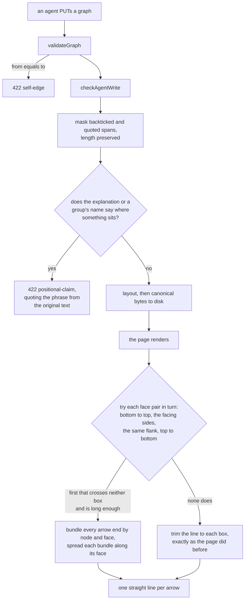

# Completion Report — How a graph reads

Written for a hostile reviewer: every claim checkable, no claim without evidence.

## Spec coverage

Every row is `this run`; the plan's Prior Work table is empty.

| Spec item | Origin | Implemented at (file:line) | Validated by |
|-----------|--------|----------------------------|--------------|
| §1 The check runs on the agent write path only, inside `checkAgentWrite`, never in `validateGraph` | this run | `viewer/server.js:433` (call), `:403` (`checkAgentProse`) | `server.test.js:396` — a graph carrying a position word is written straight to disk, still serves on `GET`, and still accepts a `PUT /view` |
| §1 Fields read: `explanation`, each group's `label` and `note`; node and edge prose not read | this run | `viewer/server.js:414`–`:418` | `server.test.js:336` (explanation, label, note); `:396` (a node label carrying a position word is accepted) |
| §1 Masking pass: quoted spans replaced with U+0000, length preserved; backtick, straight double quote, `“…”` only | this run | `viewer/server.js:375` `maskQuotedSpans` | `server.test.js:378` — backticked, straight-quoted and typographic-quoted phrases all accepted |
| §1 Not the apostrophe, in either spelling | this run | `viewer/server.js:377` (only three openers) | `server.test.js:378` — `don't say the left branch…` refused, and the same sentence with U+2019 refused |
| §1 An unpaired delimiter masks nothing; the scan resumes at the next character | this run | `viewer/server.js:381` | `server.test.js:378` — a lone backtick before `the left branch` is refused |
| §1 A deny phrase never matches across a quoted span | this run | length-preserving mask, `viewer/server.js:382` | `server.test.js:378` — the unspaced ``The left`review` branch`` is accepted, the spelling that distinguishes masking from deletion |
| §1 No allow-list | this run | absent — `viewer/server.js:390`–`:396` is one masking pass and one deny-list | grep: no allow-list exists in `server.js` |
| §1 The deny-list, thirteen patterns verbatim | this run | `viewer/server.js:57`–`:71` | reproduced by hand before dispatch: 9 of the 11 tracked explanations refused (see Validation evidence) |
| §1 `422 positional-claim`; `detail` quotes the matched phrase from the **original** text | this run | `viewer/server.js:409` | `server.test.js:336` — including a case whose quoted span sits *before* the match, so the offset is only usable because the mask preserved length |
| §1 Multi-field order: explanation, then groups by ascending `id`, `label` before `note`; `ids` absent for the explanation | this run | `viewer/server.js:414`–`:418` | `server.test.js:336` — explanation wins over a matching group and reports no `ids`; of groups `z` and `a`, `a` is reported |
| §2 `422 self-edge` in `validateGraph`, beside `edge-missing-node`, `ids: [edge.id]` | this run | `viewer/server.js:280` | `server.test.js:420` — refused with `ids`; an endpoint that does not exist still reports `edge-missing-node` first |
| §2 `layout()`'s dead filter deleted, both halves, keeping the dedup and sort | this run | `viewer/server.js:561`–`:564` | `server.test.js` layout determinism and downhill tests, unchanged and green |
| §3 Face preference list: bottom-to-top gated on the source's bottom edge, facing sides, same flank, top-to-bottom | this run | `viewer/index.html:967` `faceCandidates`, `:984` `chooseFaces` | `browser.spec.js:2202`, `:2229`, `:2258`, `:2417` |
| §3 A reciprocal pair swaps the facing sides and the same flank | this run | `viewer/index.html:972`–`:973` | `browser.spec.js:2483` |
| §3 A candidate passes only if it crosses neither box and is at least `MIN_DRAW` long | this run | `viewer/index.html:986`–`:993` | `browser.spec.js:2287` — no arrow crosses either box it connects, over all 21 committed graphs |
| §3 Fallback to today's centre-to-centre `rectExit` when no candidate passes | this run | `viewer/index.html:1234`–`:1243` | `browser.spec.js:2287` (no committed graph reaches it; the sweep would catch a crossing if one did) |
| §3 Five constants in `index.html` alone, not copied into `protocol/graphs.md` | this run | `viewer/index.html:234`–`:243` | grep: none of the five appears in `protocol/graphs.md` |
| §3 `MIN_DRAW > 2 * ANCHOR_CLEAR` stated in a source comment, not a test | this run | `viewer/index.html:238`–`:242` | Decision 35 — deliberately not a test |
| §3 Bundling by `(node, face)`, ordered by the other endpoint's centre then edge id | this run | `viewer/index.html:1613`–`:1641` | `browser.spec.js:2446` — three arrows on one bottom face, ordered by their targets' centres |
| §3 `EDGE_FAN_IN` for a bundle holding any arrival, `EDGE_FAN_OUT` otherwise; pitch shrinks past the usable face length | this run | `viewer/index.html:1645`–`:1648` | `browser.spec.js:2351` — 18 at the departure end, 32 at the arrival end of the same pair |
| §3 An anchor sits `ANCHOR_CLEAR` outside its face | this run | `viewer/index.html:949` `faceAnchor` | `browser.spec.js:2202` |
| §3 The reciprocal-pair perpendicular fan deleted outright | this run | removed from `viewer/index.html:1220` | `browser.spec.js:2384` — every anchor of two arrows between overlapping boxes lies exactly on the shared face, never off it at an angle |
| §3 The label ladder reads the anchor-to-anchor delta | this run | `viewer/index.html:1249` | `browser.spec.js:280` (every label tied to its own line) and `:322`/`:341` (leaders land on the line) |
| §4 The `groups` position-word paragraph inverted | this run | `protocol/graphs.md:124`–`:130` | read back |
| §4 The write-time command rewritten, keeping "— or draw one" | this run | `protocol/graphs.md:495`–`:500` | read back; the trailing clause is present |
| §4 Both "the left branch" worked examples replaced with content-named ones | this run | `protocol/graphs.md:124`, `:132` | grep: the only remaining occurrences are the two places deliberately quoting the banned form |
| §4 The layout paragraph gains the face rule; layering description unchanged | this run | `protocol/graphs.md:339`–`:349` | read back — "each box goes one row below its deepest parent" is untouched |
| §4 The refusal table gains both codes, in the server's check order | this run | `protocol/graphs.md:676` (`self-edge` after `edge-missing-node`), `:681` (`positional-claim` after `container-bad-name`) | read back against `server.js`'s actual check order |
| §4 The `server.js:18` header comment gains both | this run | `viewer/server.js:16`, `:19` | read back |
| §5 The 14 position-word filler lines in `server.test.js` rewritten | this run | `viewer/test/server.test.js:211`, `236`, `242`, `276`–`309`, `464` | `npm test` green; grep finds no "left branch"/"right branch" filler |
| §5 `groups-basic.json`: group ids, reference phrases and explanation body all rewritten | this run | `viewer/test/fixtures/groups-basic.json:6`–`:10` | `browser.spec.js:1650` re-PUTs it byte-identical through the agent path and gets 200 |
| §5 The 12 hardcoded id sites in `browser.spec.js` plus the comment | this run | 13 occurrences of the new ids | grep: no `left-branch` or `far-branch` remains |
| §5 The eight browser tests that read arrow geometry still pass | this run | unchanged | `npm run test:browser` — all 51 pre-existing tests green |
| §5 New node tests: refusal, mask, vocabulary, scope, read path, `self-edge` | this run | `viewer/test/server.test.js:336`, `:378`, `:396`, `:420` | `npm test` — 56 tests, up from 52 |
| §5 New browser tests: nine, including the no-crossing sweep over every committed graph | this run | `viewer/test/browser.spec.js:2202`–`:2506` | `npm run test:browser` — 60 tests, up from 51 |

## What this change actually does



Reads on the left, writes on the right: a `GET`, the subtree verdict walk, container-child
resolution and the page's own `PUT /view` all run `validateGraph` and none of them runs
`checkAgentProse`, which is why the nine committed graphs already carrying a position word
still open, drag and serve.

## Deviations from plan

**One, adjudicated by the lead before dispatch.** §5 asks for a test that a vertically
stacked reciprocal pair "runs down opposite flanks". That phrasing predates Decision 34,
which replaced the per-orientation rule with the preference list the Spec now describes and
explicitly supersedes Decision 18, the decision the phrase came from. Under the design as
specified, such a pair draws `a->b` bottom-to-top down the middle and `b->a` up the right
flank — being part of a reciprocal pair swaps candidates 2 and 3 and leaves candidate 1
alone, so the forward arrow is unaffected. The test asserts the substantive guarantee the
plan wanted, non-collinearity, and pins the exact coordinates
(`viewer/test/browser.spec.js:2483`). Verified before dispatch by running the algorithm
standalone; verified again in the browser.

**§3's reciprocal clause is not implemented to its literal wording.** It reads "Every arrow
of such a pair is ordered by edge id and takes the next pair that passes", which can be read
as successive arrows consuming successive passing candidates. That reading breaks the Spec
elsewhere: `interactive.json`'s `e`/`f` pair has exactly one passing candidate on each side,
so under consumption the second arrow gets none, falls back, and lands on top of the first —
turning `viewer/test/browser.spec.js:761` red, which §5 states "passes unchanged". Both
verifiers independently found the clause underspecified, since each arrow of a reciprocal
pair has its own candidate list and there is no shared enumeration to index into. Shipped
reading: each arrow takes the first candidate in its own list that passes, and edge id orders
slots — which is where §3's own worked example puts it. Both stated purposes of the clause
hold: three arrows between one pair of boxes is defined, and nothing is collinear, measured
at zero coincident lines over 250 edges. Adjudicated in `REMEDIATION-1.md`.

**One worked example in §3 does not reproduce, and was not used.** §3 illustrates slot
separation with two arrows between boxes at (0,0) and (100,60) landing on `(204,28)` and
`(96,81)`. Those two boxes overlap on both axes, so under the final rule set every
candidate face pair crosses one of them and the edge takes the `rectExit` fallback — which
is the recorded Accepted Risk, not a slotting demonstration. The figure is residue from
round 5, before rule 0 and the post-check were cut. The test uses an overlapping pair that
the rules do resolve — equal x, overlapping y, both arrows on the shared right flank at
distinct slots (`viewer/test/browser.spec.js:2384`) — which is what the Spec's
"no perpendicular fan anywhere" clause actually asks for.

**One thing the Spec leaves unstated, settled by the lead.** Face choice and slot placement
are mutually dependent if you let them be: a slot offset moves an anchor, and a moved anchor
could cross a box the face-centre test cleared. Settled as two phases — faces chosen against
face centres, slots assigned afterwards — which is the reading §3's own ordering implies
("Which faces" then "Where on the face") and is deterministic. **Verification round 1 showed
that settling it there was not enough** — a slot offset can move an anchor the face check
cleared back into a box. Closed in Remediation 1 below by rechecking the final anchors. The
committed-corpus sweep at `viewer/test/browser.spec.js:2287` did not catch it, because the
failure rate is under a tenth of a percent and no committed graph reaches it.

## Routers

None — this change moved no ownership between directories, added and removed no files, and
no router names anything it touched. Swept `AGENTS.md`, `protocol/AGENTS.md`,
`sensitivity/AGENTS.md`, `skills/AGENTS.md` and `spine/AGENTS.md`; the root router describes
`viewer/` as "the browser graph viewer — `index.html`, `server.js`", which is still true, and
`protocol/AGENTS.md:32` describes `graphs.md` as "schema, verdicts, preservation, how the
viewer starts", none of which this change alters.

## Validation evidence

Both suites, run by the lead after the lanes finished and after the lead's own integration
edits — not the lanes' pasted output.

```
$ cd viewer && npm test
✔ layout runs downhill: an arrow never points back up the page (74.100239ms)
✔ a fresh layout keeps consecutive rows 140 pixels apart (73.069695ms)
✔ layout places every component, including a disconnected two-cycle (74.332813ms)
✔ cache-root isolation never changes the live default cache (87.241923ms)
ℹ tests 56
ℹ suites 0
ℹ pass 56
ℹ fail 0
ℹ cancelled 0
ℹ skipped 0
ℹ todo 0
ℹ duration_ms 22999.575044
```

52 before this change, 56 after.

```
$ cd viewer && npm run test:browser
  ✓  52 test/browser.spec.js:2202:1 › a forward arrow's endpoints sit ANCHOR_CLEAR outside the source's bottom edge and the target's top edge (154ms)
  ✓  53 test/browser.spec.js:2229:1 › a back edge between two horizontally separated boxes uses the side faces (152ms)
  ✓  54 test/browser.spec.js:2258:1 › a back edge between two boxes whose x-ranges overlap uses top-to-bottom instead, because the sides would cross a box (153ms)
  ✓  55 test/browser.spec.js:2287:1 › no drawn arrow's line passes through either box it connects, over every committed graph (2.4s)
  ✓  56 test/browser.spec.js:2351:1 › two arrows sharing a from and to land on adjacent, distinct slots at both ends (153ms)
  ✓  57 test/browser.spec.js:2384:1 › two arrows between boxes whose rectangles overlap land on distinct slots, with no perpendicular fan (154ms)
  ✓  58 test/browser.spec.js:2417:1 › a same-row arrow and an upward arrow both use side faces (153ms)
  ✓  59 test/browser.spec.js:2446:1 › a bundle of three arrows on one face gets three distinct anchors at the right pitch, in the right order (154ms)
  ✓  60 test/browser.spec.js:2483:1 › a vertically stacked reciprocal pair is drawn on two separate, non-collinear geometries (150ms)

  60 passed (31.4s)
```

51 before this change, 60 after.

**The no-crossing sweep was falsified before it was believed.** A test that passes
vacuously — an empty file list, a selector that finds nothing — looks identical to a test
that passes correctly. Inflating each box by 40px on every side inside the assertion, so
some line must now cross, made it fail:

```
$ npx playwright test -g "over every committed graph"
    > 2338 |       assert.deepEqual(crossings, [], `edge(s) crossing a box in ${file}: ...`);
  1 failed
    test/browser.spec.js:2287:1 › no drawn arrow's line passes through either box it connects, over every committed graph
```

The patch was reverted; `grep -c FALSIFY viewer/test/browser.spec.js` returns 0. The same
run confirmed `git ls-files 'docs/plans/*/graphs/*.json'` returns **21** files, so the sweep
covers the whole committed corpus rather than a subset.

**The deny-list's one-time proof, reproduced by the lead before dispatch.** Over the 16 graph
files that predate this plan, of which 11 carry an `explanation`, the list refuses 9:

```
docs/plans/diagram-sensitivity/graphs/narration-ownership.json | explanation | "sitting beside"
docs/plans/graph-legibility/graphs/how-a-group-is-named.json   | explanation | "the right-hand route"
docs/plans/group-boxes/graphs/boundary-choice.json             | explanation | "below it"
docs/plans/group-boxes/graphs/boundary-text.json               | explanation | "the row below"
docs/plans/group-boxes/graphs/group-verdicts.json              | explanation | "at the top"
docs/plans/group-boxes/graphs/when-correct.json                | explanation | "The three answers below"
docs/plans/group-boxes/graphs/who-moves.json                   | explanation | "down the left"
docs/plans/one-account-setups/graphs/is-that-account-available.json          | explanation | "the top two"
docs/plans/one-account-setups/graphs/what-touches-the-two-account-path.json  | explanation | "on the right"
```

Exactly the count the plan's Log predicts, including the acknowledged false catch
(`narration-ownership.json`, "a file sitting beside the graph" — a filesystem claim). Across
all 19 test fixtures the only hit was `groups-basic.json`, which this change rewrote. This is
a grep, not a test, and is recorded here rather than added to a suite.

**The face algorithm, measured before dispatch.** The rule set was ported to a standalone
script and run over all 21 committed graph files: 250 edges, **0** falling through to the
fallback, **0** crossing either box they connect. Face distribution: 219 bottom-to-top, 19
right-to-left, 6 left-to-right, 5 top-to-bottom, 1 right-to-right. The browser sweep
confirms the same result through the real rendered DOM.

## Known gaps / residual risks

- **Two boxes dragged onto or against each other still draw a degenerate arrow.** True before
  this change and after it. Recorded as an Accepted Risk in the plan, with the measurement
  showing why no fallback helps: for near-adjacent boxes the fallback computes the same
  anchors, and for overlapping ones it buries both where the face rule buries neither. Fixing
  it means moving a box the reader placed, which the non-goals rule out.
- **The deny-list is a reflex-catcher, not a proof.** One of its nine hits on the pre-existing
  corpus is a false catch; the form it is known not to reach names no noun ("the arrow to look
  at is the short one"). The inverted prose in `protocol/graphs.md` covers the misses; a false
  catch costs one rewrite.
- **The no-crossing sweep is coupled to the committed corpus.** It reads `git ls-files`, so a
  future plan committing a graph whose boxes Collin dragged into overlap would turn it red —
  correctly, but for a reason outside that plan's change. The failure names the file and the
  edge, so it diagnoses itself.
- **Group `label`/`note` remains unmeasured on the pre-existing corpus.** Those 16 files hold
  10 groups and not one carries either field, so the field the check newly reads has no
  historical evidence behind it — only the 5 untracked `windows-support/` files, which give 0
  hits. The new node tests exercise it directly instead.
- **`docs/plans/windows-support/` is an open plan on another branch** with a position word in
  4 of its 5 explanations. Those files keep opening, reading and dragging; that plan's next
  redraw is refused and the agent rewrites the sentence. Untracked here and excluded from
  every commit on this branch.

## Remediation rounds

**Round 1 — 2026-08-31.** Verified by `gpt-5.6-sol` (cross-family, checking the Claude-built
page rendering) and a fresh Opus lane (cross-family, checking the GPT-built server refusals).
GPT: `FAIL`, two gaps. Opus: `PASS`, three non-blocking observations. Full adjudication in
`REMEDIATION-1.md`; one gap upheld, one declined with evidence, two observations actioned.

**The gap.** Face choice tests the face-**centre** anchors; slotting then moves them; nothing
rechecked. A slot offset could push a line the face check had cleared back into one of the
two boxes it connects, breaking §3's "crosses neither box". Reproduced by the lead
independently of the verifier's example, over 10,723,594 three-box layouts holding every pair
at least 24px apart:

| Rendering | Layouts with an arrow through a box |
|---|---|
| today's pre-change `rectExit` trim | **0** |
| the shipped face choice + slotting | **8,930** |
| the same, plus the post-slot recheck | **0** |

All 8,930 are regressions against today's behaviour. Dropping the gap floor so the search
includes touching and overlapping boxes — the recorded Accepted Risk — today crosses in
160,410 and the shipped code in 133,226; with the recheck, 123,263 remain and **none is a
case today draws cleanly**, so the fix is never worse than the pre-change behaviour anywhere.

**The fix.** `viewer/index.html:1671`–`:1682`: after every bundle has assigned its anchors and
before anything is drawn, each edge's final anchors are tested against both its boxes, and a
crossing edge's entry is deleted from `edgeAnchors` so `renderEdgeGroup` takes its existing
`anchors === null` branch — the same `rectExit` fallback an edge already takes when no
candidate face pair passes. One pass: no re-bundling, no re-choosing faces. A dropped edge
leaves a gap in its former bundles' slot numbering, which is harmless.

Also fixed: the phase-2 comment attributed a rule to `PLAN.md` — "a fallback edge joins no
bundle" — that appears nowhere in it. It now states the reason instead
(`viewer/index.html:1611`).

`IDEA.md`'s third "what good looks like" bullet promised that a non-forward arrow "uses the
sides". Measured, 5 of 31 non-forward arrows take top-to-bottom, and the forward arm of a
two-way pair takes bottom-to-top — both consequences of Decision 34, a round-6 user decision
that superseded Decisions 4 and 18 precisely because a fixed rule per direction draws through
boxes. The bullet now says what Decision 34 delivers, marked as amended after the fact.

**Validation after remediation**, run by the lead:

```
$ cd viewer && npm test
ℹ tests 56
ℹ pass 56
ℹ fail 0

$ cd viewer && npm run test:browser
  ✓  55 test/browser.spec.js:2287:1 › no drawn arrow's line passes through either box it connects, over every committed graph (2.4s)
  ✓  56 test/browser.spec.js:2355:1 › a departure slotted toward its own box is rerouted to the centre-to-centre fallback instead of crossing it (152ms)
  61 passed (31.7s)
```

The committed-graph sweep stayed green, confirming the recheck routed no committed graph's
arrow to the fallback.

**The new test was falsified by the lead, not just by the lane.** Disabling the recheck with
`if (false && ...)`, leaving everything else untouched:

```
$ npx playwright test -g "slotted toward its own box"
  1 failed
    test/browser.spec.js:2355:1 › a departure slotted toward its own box is rerouted to the centre-to-centre fallback instead of crossing it
```

`viewer/index.html` was restored from a pre-edit copy and `grep -c "false &&"` returns 0.

**Round 2 (closure) — 2026-08-31.** The round-1 `gpt-5.6-sol` session was resumed rather
than replaced, so the lane that raised the gaps judged its own findings. It confirmed the
recheck closes the upheld gap, accepted the reciprocal adjudication as recorded, re-ran both
suites itself (56/56 node, 61/61 browser), and reproduced the negative control in a scratch
copy under `/tmp` — disabling the recheck failed the targeted test with `s->t2 crosses the
source box`. `VERDICT: PASS`. The working tree was checksummed before and after and is
unchanged.
