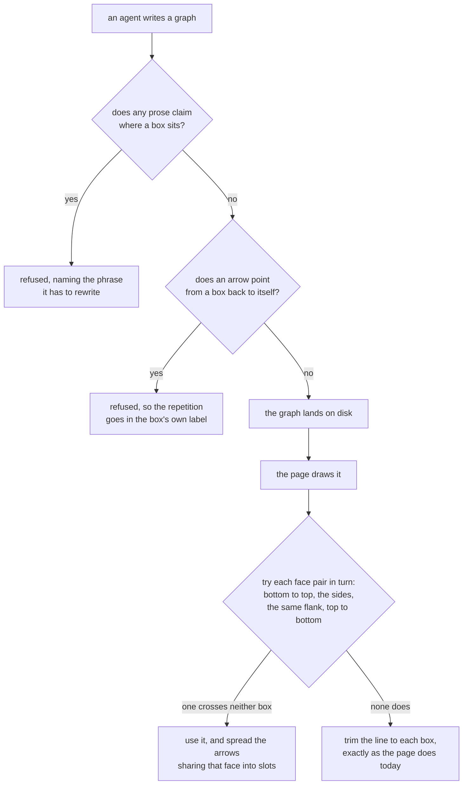

# How a graph reads: an explanation that claims no position, and arrows that enter the top and leave the bottom

**Idea:** `IDEA.md` — what this is for and why, in plain language. Read it first; it is
the north star this plan serves. Goal and Constraints live there, not here.

**Map:** `MAP.md` — how the viewer, the layout pass and the explanation check work today.

## Open Questions

None.

## Watch List

Empty apart from what round 1 reopened; see the Review Rounds table for the rest.

| # | Noticed | What needed looking into | Outcome |
|---|---------|--------------------------|---------|
| 1 | 2026-08-31 | `docs/plans/windows-support/` is an open plan on another branch with a position word in 4 of its 5 explanations | Settled: the refusal fires only on an agent write, so those files keep opening, reading and dragging. That plan's next redraw is refused, the agent rewrites the sentence, and the explanation sits outside the preservation contract so nothing else is disturbed |
| 2 | 2026-08-31 | Whether changing where an arrow meets a box interacts with a drawn group's boundary | Settled for the boundary itself: it is painted beneath every arrow (`viewer/index.html:1574`, asserted at `viewer/test/browser.spec.js:1990`). **Corrected by round 1:** the claim that only one test reads arrow geometry was wrong. See finding R1-9 and Spec section 5 |
| 3 | 2026-08-31 | Whether either suite passes on this machine | Settled: both green as of 2026-08-31 — 52 node tests, 51 browser tests, Playwright chromium present |
| 4 | 2026-08-31 | Doc sweep | Settled: `README.md` names the explanation panel only in an image's alt text and needs no change. Every doc edit is `protocol/graphs.md` and is itemised in the Spec |
| 5 | 2026-08-31 | The format's own vocabulary for the downhill rule is spatial | Settled, and **widened by round 1**: face vocabulary is spatial too. Round 2 removed the allow-list this once named. The live resolution is the Accepted Risk covering the format's own layout and face vocabulary, which is backticked inside a graph explanation |

## Decision Log

Append-only. A reversal is a new entry superseding the old, never an edit.

| # | Decision | Rationale | Source |
|---|----------|-----------|--------|
| 1 | An arrow from a box back into itself is refused at the write, not drawn | Today it passes validation, is dropped by `layout()`, renders as a zero-length path, and drops its label on the box's own text — a silent failure. A repetition is sayable in the label. Collin struck the arc arm on `graphs/an-arrow-back-into-itself.json` | user |
| 2 | An arrow stays one straight line; only where it meets each box changes | Bending would special-case the hit band, the endpoint handles and the whole label-placement ladder, all of which read a straight segment's two ends and its perpendicular | user |
| 3 | The port rule lives in `viewer/index.html`, not the layout pass | Which face an arrow meets is rendering. The server's own geometry exists for group boundaries and does not decide arrow ends | defaulted |
| 4 | "Not carrying the flow forward" means an arrow that points up a row, an arrow between two boxes on one row, or a pair with an arrow each way. Everything else is bottom-to-top | Those are the three cases the reader needs distinguished; anything finer is a rule nobody can see | defaulted |
| 5 | The fork rule applies to any node with more than one outgoing arrow, not only an `exclusive` one | The layout cannot read intent, and "then both" reads as badly staggered as "then either" | defaulted |
| 6 | The committed graphs of closed plans are not rewritten | A graph is disposable by design, and a refusal fires on a write, so a committed file keeps opening and reading exactly as it does now | defaulted |
| 7 | `viewer/test/fixtures/groups-basic.json` is rewritten to name its groups by content | `viewer/test/browser.spec.js:1649` PUTs that fixture back through the agent path with a byte-identical explanation, so a fixture written in position words would fail the new check inside the suite | defaulted |
| 8 | A childless arm of a fork drops to its deepest sibling's row; nothing else about layering changes | Measured over the pre-existing committed graphs: level forks go 38 → 41 of 46 with total height unchanged and no arrow travelling uphill. Cascading every shallower arm reaches 44 but nearly triples total height and does not settle in 2 of 13 graphs. Levelling unconditionally reaches 46 and spends the downhill rule | user |
| 9 | A positional claim in an agent's prose about its own picture is refused at the write, matched by a tight phrase list | Measured: the list catches 13 of the 16 committed explanations carrying one and fires on 14 of 1186 sentences of ordinary prose, nearly all genuinely positional. A refusal is the only signal that reliably reaches an agent's next action; a warning on a successful write relies on the same reading that already failed | user |
| 10 | Text inside quotation marks or backticks is exempt from the check | A graph about this rule has to be able to quote the phrase it forbids, and `graph-legibility/graphs/how-a-group-is-named.json` already carries a node label quoting "the left branch" | defaulted |
| 11 | The check reads `explanation` plus a group's `label` and `note`; a node's or edge's own `label` and `note` stay out | Measured over every prose field of every committed graph: group text gave 0 hits — though on the 16 pre-existing files that is vacuous, since they hold 10 groups and not one carries a `label` or `note`; the field is exercised only by the 5 untracked windows-support files, which hold 9 of each and also give 0, node and edge text gave 7 hits across the 16 pre-existing plus 5 untracked files — 5 wrong by eye: a file beside a file, a stage at the top of a stage, a directory beside a directory, and a label quoting the banned phrase. On the 16 alone it is 5 hits, and both genuine ones are off that corpus | user |
| 12 | Arrows leaving a face are pitched tighter than arrows arriving at one — `EDGE_FAN_OUT` 18, `EDGE_FAN_IN` 32 | A fork is one thing branching and should fan from roughly one place; a join is several independent things arriving and has to stay traceable. Logged late: settled in conversation at planning time and shipped in the Spec without an entry, which review round 1 caught as finding R1-8 | user |
| 13 | The forward test is the source's **bottom edge**, not its midline | The midline admits two boxes overlapping vertically and then draws a bottom-to-top arrow running upward — reachable by dragging, which is the exact case the comparison existed to handle. Verified: on a fresh layout both tests agree on all 318 edges, so the defect appears only after a drag | review-round-1 |
| 14 | The reciprocal-pair perpendicular fan is deleted, not retained | It shifts both endpoints perpendicular to the segment, which moves them off whatever face they were placed on — and for an equal-x pair on side faces, inside the boxes. Bundle slotting already separates duplicate and reciprocal arrows | review-round-1 |
| 35 | The constant relation is a source comment, not a test | Both constants are `const`s inside `index.html`'s single top-level script and neither is exposed on `window.__viewer`; `server.js` exports nothing. A test could only hardcode both sides and assert `12 > 8`, which is a claim about literals rather than a guard on the code | review-round-6 |
| 34 | Faces are chosen by preference and property, not by a rule per direction; supersedes Decisions 4, 18, 23 and 30 | Any fixed rule per direction eventually draws a line through one of the boxes it connects — a fresh `layout()` of a three-cycle does it with no dragging at all, and a committed graph shows the same. Trying the pairs in order and taking the first that crosses neither box is the "try" that was asked for, and `rectExit` is a fallback that cannot cross by construction. It also removes `MIN_FORWARD_GAP` entirely: a near-level forward pair fails the length check and moves on by itself | user |
| 33 | A back edge uses the sides where the sides are clean, and top-to-bottom where they are not | Collin asked for the sides for connections that are not the flow, and this keeps that wherever the geometry allows it. Of the three back-edge positions tested, one takes the sides and two take top-to-bottom because the sides cross a box | user |
| 32 | The perpendicular fan is deleted outright, restoring Decision 14 and superseding 29 | Decision 29 kept it for the rule-0 path; Decision 30 removed that path. Bundle slotting separates duplicate and reciprocal arrows even on overlapping boxes — `(204,28) → (96,81)` and `(204,46) → (96,113)` | review-round-5 |
| 31 | The anchor-distance post-check and `MIN_DRAW` are cut, superseding Decision 28 | Both lanes measured it a no-op: same-row boxes 8px apart give `(204,37) → (204,37)` by either route, because `rectExit` exits the same side face at the same clearance. Euclidean distance also cannot see inversion when unequal heights add perpendicular separation | review-round-5 |
| 30 | Rule 0 is cut, superseding Decision 22 | The centre-to-centre fallback is identical to the face choice wherever the boxes are near-adjacent, and strictly worse where they overlap — it buries both anchors where the face rule buries neither. A fallback that never helps and sometimes harms is not a fallback | review-round-5 |
| 29 | The reciprocal-pair perpendicular fan survives on the rule-0 path only | Rule 0 chooses no face, so there is nothing for the fan to push an anchor off — and without it two arrows between overlapping boxes coincide exactly, which is the defect Decision 14 was reacting to in the first place | review-round-4 |
| 28 | After the anchors are computed, a single post-check: anchors closer than `MIN_DRAW` 12 discard the face choice and fall back to centre-to-centre | Four rounds found four instances of one class — partial vertical overlap, touching boxes, an 8px vertical gap, an 8px horizontal gap — each patched on its own axis. A check on the computed anchors closes the class instead of a case at a time, and it is orthogonal to rule 0, which catches the different failure of an anchor landing inside the other box | review-round-4 |
| 27 | Nothing in this change touches layering; the whole layout-ordering section is cut, superseding Decisions 5 and 8 | The push-down was solving "a fork's arms should be level", which is not what was asked for — the ask was that arms not stack on top of each other. Measured over all 26 graph files in the repo — 16 pre-existing, 5 untracked windows-support, 5 this plan's own: 70 forks, 8 with arms on more than one row, and **zero** pairs sharing a column. The load-bearing figures are identical on all three corpora (16, 21 and 26 files): 8 staggered, 0 sharing a column, three pairs within one box width at exactly 159, 118 and 101 against a 200-wide box, and the face change in section 3 is what makes those read as a branch, since the arrows visibly diverge from one bottom edge | user |
| 26 | The arms-adjacent rider is cut with it | It only orders boxes within a row, so it never addressed arms landing on different rows — the actual concern — and it produced an ambiguity finding in each of rounds 2 and 3 | user |
| 25 | Decision 18 stands, but its supporting claim was false: no fixture reaches the vertical reciprocal case, so the test builds one | `cycle-layout.json` carries no `x`/`y`, and the browser harness stages fixture bytes straight to disk with no `PUT` (`viewer/test/browser.spec.js:26`), so `layout()` never runs and all five nodes serve at (0,0). The (460,140) positions I cited came from running `layout()` directly — the path a `PUT` takes, not the path the suite takes | review-round-3 |
| 24 | An unpaired mask delimiter masks nothing | Masking to end-of-string would let one stray quote exempt the rest of an explanation — a whole-check bypass reachable by a typo | review-round-3 |
| 23 | Rule 2's threshold is a named constant, `MIN_FORWARD_GAP` 20; supersedes Decision 17 | At a gap of exactly `2 * ANCHOR_CLEAR` the two anchors are equal and the path has zero length. A threshold derived from the clearance is off by one at its own boundary by construction; a constant with margin built in is not | review-round-3 |
| 22 | Two boxes overlapping on both axes choose no face at all and fall back to today's centre-to-centre `rectExit` | Every face rule degenerates on coincident boxes, and a drag reaches them in one gesture: 200-wide boxes at `x=0` and `x=100` put each anchor inside the other box, and boxes of different heights reach coincident centres at ordinary positions (116px at `y=0` and 74px at `y=21` both centre on 58). One fallback closes the whole class instead of a case per round | review-round-3 |
| 21 | "side by side" and "the same row" are restored to the deny-list; supersedes that half of Decision 20 | The round-2 reasoning for dropping them — that they name an arrangement rather than a box — is wrong: "the retry box is on the same row as the payment box" names two boxes exactly. The collision with the format's own vocabulary is the one already priced as an Accepted Risk | review-round-3 |
| 20 | The allow-list added by Decision 15 is removed; Decision 15 is superseded | Measured: it opened three holes on real positional claims — "the greyed box on the left edge", "sits at the top edge of the picture", "the answers arrive at the bottom" all refused without it and accepted with it — and its premise was wrong, since the check never reads markdown. Two deny patterns are dropped instead ("side by side", "the same row"), which the format uses for its own layout rule | review-round-2 |
| 19 | Quoted spans are masked character-for-character with U+0000, not deleted | Deleting makes a deny phrase's fate depend on whether the quote happened to sit between spaces; masking makes quoting interrupt a phrase consistently, and a length-preserving mask lets a match offset index the original so `detail` can quote what the agent actually wrote | review-round-2 |
| 18 | A reciprocal pair picks its faces by the pair's orientation — facing sides when horizontal, opposite flanks when vertical | A slot offset runs along the face it sits on, so it separates arrows only where the face axis is perpendicular to the segment. For two vertically stacked boxes both arrows land on one face, parallel to the offset, and stay collinear — reintroducing the overlap the deleted fan prevented. `cycle-layout.json` reaches it at (460,0) and (460,140) | review-round-2 |
| 17 | Rule 2 requires a gap of at least `2 * ANCHOR_CLEAR`, not merely non-overlapping boxes | An anchor sits 4px outside its face, so two boxes touching or separated by up to 7px select bottom-to-top and then draw upward — `a.y=0, h=74, b.y=74` gives anchors `y=78 → y=70`. Unreachable on a fresh layout, where the smallest gap is 24, and reachable by dragging | review-round-2 |
| 16 | Fixed-pitch anchor slots are kept; the projection alternative raised by review is not taken | Measured: projection clamps 63 of 636 arrow ends and leaves 5 of 194 same-face pairs exactly coincident, against zero by construction, and it has no pitch at all — so it cannot express the tighter-leaving/wider-arriving distinction that was the whole of Decision 12. Simpler, but it reverses a settled answer rather than simplifying it | user |
| 15 | The check runs an explicit allow-list before the deny-list, covering both arrow-direction and box-face vocabulary | Without it the deny-list refuses the very rule this change ships: "arrives at the top face", "lands on the top edge", "enters at the top" all match. A lookahead patch covers two of those three forms; an allow-list covers the class | review-round-1 |

## Spec

Two refusals and one rendering change, landing in one PR.

### 1. A positional claim in an agent's prose is refused

**Where it runs, and where it must not.** The check runs on the agent write path only —
inside `checkAgentWrite` (`viewer/server.js:1177`) or inline in `handleGraphPut` after
validation. It must **not** go in `validateGraph`. That function is reached by `parseDisk`
(`viewer/server.js:328`), which runs on every read: serving a graph (`:339`), the subtree
verdict walk (`:426`), container-child resolution (`:1026`, `:1049`, `:1058`), and the
page's own write (`:1227`). A refusal there would make the nine committed graphs that
already carry a position word — plus four more in the untracked `windows-support/` plan —
unopenable, undraggable, and unusable as containment parents. Nine, not eight: eight is the
count after discarding the acknowledged false catch, and a false catch blocks a read path
exactly as hard as a true one. Getting this wrong is the
single most damaging mistake available in this change.

Placement in `checkAgentWrite` also fixes the check's order relative to the group
refusals: `server.test.js:276`–`295` assert specific codes like `group-missing-node` and
`group-bad-shape`, and those all fire inside `validateGraph`, so they still win.

**Fields read:** the top-level `explanation`, and each group's `label` and `note`. A node's
or edge's `label` and `note` are not read.

**One masking pass runs before matching.** Replace every character of a quoted span with
U+0000, **preserving length**. Delimiters are backticks, straight double quotes, and
typographic double quotes (`“…”`). Nothing else is a delimiter — in particular **not** the
straight apostrophe and **not** `‘…’`, because U+2019 is the typographic apostrophe and both
forms are indistinguishable from a possessive. Stripping them exempts everything between any
two apostrophes: two of the sixteen explanations in the repo contain two or more, and the
bypass costs a real catch in `group-boxes/graphs/when-correct.json`.

**An unpaired delimiter masks nothing.** A lone backtick or double quote with no partner is
ordinary text, and the scan resumes at the character after it. Masking to the end of the
string instead would let one stray quote exempt the rest of the explanation — a whole-check
bypass reachable by a typo.

Masking rather than deleting settles two things a worker would otherwise have to invent. A
deny phrase can never match **across** a quoted span, so `the left \`review\` branch` is
accepted and `the left\`review\` branch` is accepted too — quoting interrupts a phrase,
consistently, instead of the answer depending on whether the quote happened to sit between
two spaces. And because the mask is length-preserving, a match offset in the masked string
indexes the original directly, which is how `detail` quotes the phrase the agent actually
wrote.

There is **no allow-list.** Round 1 added one and round 2 removed it: measured, it opened
three holes on real positional claims — including this plan's own motivating sentence, "the
greyed box on the left edge…", refused without it and accepted with it — while closing
nothing the deny-list needed closed. Its premise was also wrong. The check never reads
markdown, so `protocol/graphs.md` may describe the face rule in any words it likes; the only
exposure is a graph *explanation* about the face rule, and backticks already cover that.

**The deny-list:**

```
/\b(?:on|to|down|up|along) the (?:left|right)\b/i
/\bat the (?:top|bottom)\b/i
/\bthe (?:leftmost|rightmost|topmost|bottommost)\b/i
/\bdown the (?:middle|centre|center)\b/i
/\bthe (?:left|right|top|bottom|upper|lower|middle)(?:most)?[- ]?(?:hand )?(?:branch|arm|arms|box|boxes|node|nodes|column|cluster|group|half|side|path|row|one|ones|two|three|route)\b/i
/\bthe (?:\w+ )?(?:box|boxes|node|nodes|group|step|steps|arrow|arrows|answers?|options?) (?:above|below|beside)\b/i
/\bthe row (?:above|below)\b/i
/\b(?:above|below|beside|underneath) (?:it|them|that|these|those)\b/i
/\b(?:sits|sit|sitting|hangs|hang|hanging|runs|run|running|stands|stand|lands|land) (?:just )?(?:at|on|in|down|up)? ?the (?:top|bottom|left|right|middle|centre|center)\b/i
/\b(?:sits|sit|sitting|hangs|hang|hanging|stands|stand) (?:just )?(?:above|below|beside|under|underneath|next to)\b/i
/\bside by side\b/i
/\bthe same (?:row|column)\b/i
/\blisted (?:under|below|above) it\b/i
```

Pattern 6 carries `(?:\w+ )?` on purpose: without it "the three answers below" slips past,
and because the noun list is closed, "the section below" and "the file below" still pass.

**"side by side" and "the same row" stay on the list.** Round 2 dropped them on the reasoning
that they name an arrangement in general rather than any particular box; round 3 showed that
reasoning is wrong — "the retry box is on the same row as the payment box" names two boxes
exactly. They do collide with the format's own layout vocabulary, including
`protocol/graphs.md:334`'s "set side by side", but that is the collision already recorded as
an Accepted Risk and paid for with backticks. A live bypass is worse than a backtick.

**No pattern matches the format's downhill vocabulary**, which is why no carve-out is needed
for it: "points down the page", "travels downhill", "one row below its deepest parent" and
"an arrow never points back up the page" are all accepted by the list above as written.

**The refusal:** `422 positional-claim`. `detail` names the matched phrase quoted from the
original text, which the length-preserving mask makes a direct substring. When more than one
field matches, report the first in this order: `explanation`, then each group in `id` order,
`label` before `note`; `ids` carries the group id when the match was in a group, and is
absent for the explanation, which has no id.

**Known imprecision, accepted.** The list is a reflex-catcher, not a proof. Screened by eye
entry by entry, over the 16 graph files that predate this plan —
`git ls-files 'docs/plans/*/graphs/*.json' | grep -v how-a-graph-reads` — of which 11 carry an
`explanation` at all. The bare glob now returns 21, because this plan's own five graphs are
staged; every figure below is on the 16. It refuses 9 of those 11. The 2 it passes,
`diagram-sensitivity/graphs/dial-mechanism.json` and
`graph-legibility/graphs/pointing-at-a-phrase.json`, do not read as positional, so recall on
this corpus is effectively complete. One of the 9 is a false catch:
`diagram-sensitivity/graphs/narration-ownership.json` says "a file sitting beside the graph",
a filesystem claim rather than a claim about the picture. On the 5 untracked
`windows-support/` files it refuses 4 of 5. The form it is known not to reach, seen in the
wider corpus, is the one naming no noun — "the arrow to look at is the short one". The
inverted prose in section 4 covers that; a false catch costs one rewrite.

### 2. An arrow from a box back into itself is refused

`422 self-edge`, `ids: [edge.id]`. This one **does** belong in `validateGraph`, beside
`edge-missing-node` (`viewer/server.js:259`): it is structural, matching where `bad-kind`
and `edge-missing-node` already live, and no graph anywhere in the repo — committed plan or
test fixture — currently holds a self edge, so no read path breaks.

Today such an edge passes validation, is dropped by `layout()`, renders as a zero-length
path, and drops its label onto the node's own text.

**Delete the now-dead guard, both halves of it.** `layout()` filters
`edge.from !== edge.to && known.has(edge.from) && known.has(edge.to)`
(`viewer/server.js:483`) and carries a comment explaining why. `layout()` is reached only
from `retainDiskPositions` (`:704`) and `handleGraphPut` (`:1189`), both downstream of
`validateGraph` — which refuses a self edge once this change lands, and already refuses a
missing endpoint (`edge-missing-node`, `:259`). So neither half can fire. Remove the whole
filter and its comment, keeping the deduplication and sort that share the expression: those
are what make the same graph lay out identically however its arrays are ordered.

### 3. Which face an arrow meets, and where on it

All in `viewer/index.html`, replacing the `rectExit` calls at `:1165`. The line stays straight,
so the hit band, the endpoint handles and the label ladder keep reading a segment's two ends.

**Which faces.** Not a rule per direction — a preference list, and a property each candidate has
to satisfy. Six review rounds established that any fixed rule per direction eventually draws a
line through one of the boxes it connects, because a reader can put the boxes anywhere and the
layout itself produces overlapping x-ranges for a back edge.

Try these face pairs in order and take the first whose straight line **crosses neither box** and
is at least `MIN_DRAW` long:

1. the source's **bottom** to the target's **top** — skipped when the target is above, so a step
   forward never draws upward
2. the **facing sides** — the source's right to the target's left when the target is further
   right, mirrored when further left
3. the **same flank** — both right, then both left
4. the source's **top** to the target's **bottom**

If none passes, trim both ends with today's centre-to-centre `rectExit`
(`viewer/index.html:858`). That is the guaranteed-clean fallback rather than a case to reason
about: it trims the real line to each boundary, so it cannot cross a box by construction.

A **reciprocal pair** — arrows both ways between one pair of boxes — swaps 2 and 3, trying the
same flank before the facing sides, so a two-way relationship reads as a loop down one side
rather than one double-headed line. Every arrow of such a pair is ordered by edge id and takes
the next pair that passes, so three arrows between one pair of boxes is defined and not only
two. Duplicate arrows in the same direction are separated by slotting, below.

This is the "try" Collin asked for, not a guarantee: prefer the top and bottom for the flow, use
the sides for what is not the flow, and accept a worse-looking face over a broken one. A back
edge between two horizontally separated boxes still takes the sides. It falls past them only
where the sides would draw through a box — which a fresh `layout()` produces for any three-cycle,
putting the back edge's two boxes overlapping in x, so that the side pair leaves one box's outer
face, crosses back over both, and arrives at the other's outer face. Nodes paint before edges
(`viewer/index.html:1578` before `:1615`), so such a line is drawn over the boxes.

Verified against every box position the six review rounds produced: every normally laid out or
normally dragged pair picks a clean face pair, and only boxes overlapping or within 8px of each
other reach the fallback.

**Where on the face.** Bundle every arrow end by `(node, face)`. Order a bundle by the other
endpoint's centre along that face's axis — x for a top or bottom face, y for a left or right one
— then by edge id, so two arrows between the same pair of boxes still get separate slots. Anchors
are centred on the face at a fixed pitch:

```
EDGE_FAN_OUT = 18  // pitch for a bundle of departures
EDGE_FAN_IN  = 32  // pitch for a bundle containing any arrival
FACE_MARGIN  = 8   // clearance kept at each end of a face
ANCHOR_CLEAR = 4   // how far outside its face an anchor sits, matching rectExit today
MIN_DRAW     = 12  // shortest line worth drawing; shorter, and the next face pair is tried
```

A bundle containing an arrival uses `EDGE_FAN_IN`, because an arrowhead is the thing that needs
room. **Face length** is 200 (`NODE_W`) for a top or bottom face and `nodeHeight(n)` for a side.
**Usable length** is that minus `2 * FACE_MARGIN` — 184 for a top or bottom face. For `n` arrows,
if `(n - 1) * pitch` exceeds the usable length, the pitch shrinks to `usable / (n - 1)`.

**An anchor sits `ANCHOR_CLEAR` outside its face, not on it** — matching what `rectExit` does
today (`hw + 4`, `viewer/index.html:860`), which keeps an arrowhead from being buried under the
box border. `MIN_DRAW` must exceed `2 * ANCHOR_CLEAR`, or a candidate whose faces nearly touch
passes the length check while its anchors have already crossed. That relation belongs in a
comment beside the two constants, not in a test: both are `const`s inside `index.html`'s single
top-level script (`:225`), `window.__viewer` (`:1800`) exposes neither, and `server.js` exports
nothing — so a test could only hardcode both sides and assert `12 > 8`, which is a tautology
about literals rather than a guard on the code.

These five constants live in `viewer/index.html` alone. Unlike `GROUP_PAD` and its neighbours
they are not shared with the server, which draws no arrows, so they are not copied into
`protocol/graphs.md`.

**Delete the reciprocal-pair perpendicular fan** (`viewer/index.html:1176`), outright and with
no surviving path. It shifts both endpoints perpendicular to the segment, moving them off
whatever face they were placed on and, for an equal-x pair, inside the boxes. Slotting replaces
it: two arrows with the same `from` and `to` share an other-endpoint, so the edge-id tie-break
gives them adjacent slots at both ends — verified even on overlapping boxes, where two arrows
between (0,0) and (100,60) land on `(204,28) → (96,81)` and `(204,46) → (96,113)`.

**The label ladder's basis changes.** It derives its perpendicular from the centre-to-centre
delta (`dx`, `dy` at `index.html:1160`); it must use the anchor-to-anchor delta, or every label
offset skews.

**No fixture reaches the vertical reciprocal case today.** `cycle-layout.json` holds the repo's
only vertical two-cycle, but carries no `x`/`y`, and the browser harness stages fixture bytes
straight to disk without a `PUT` (`viewer/test/browser.spec.js:26`), so `layout()` never runs and
all five nodes serve at (0,0). The test for that branch builds its own graph through
`launchInline` (`viewer/test/browser.spec.js:40`), which writes caller-chosen positions to disk.

Measured context, with the metric and corpus stated so it can be reproduced — four review rounds
found the earlier wording did not allow that. Counting arrows that take face pair 1, reciprocal
pairs excluded, over the 16 pre-existing files plus the 5 untracked `windows-support/` ones — 21
in total, this plan's own graphs excluded — **87** faces carry more than one such arrow: 56 of
them two, 28 three, two four, one five. On the 16 alone, 67. Replaying today's `rectExit` over
the same 21, **2** of 47 arrival pairs at a shared box land within one 24px hit band, because
entry points fall out of each arrow's own direction. A single point per face would collapse all
87.

### 4. Documentation — all in `protocol/graphs.md`

- The `groups` field's position-word paragraph (`:124`) is **inverted**. It currently names
  the problem correctly and then tells the agent to keep the position word and mark it. It
  must say instead that an agent has no positional knowledge at the moment it writes an
  explanation — it is forbidden from sending coordinates and the layout runs after the
  write — so a set of boxes is named by what it is, and a reference points at that name.
- The write-time command (`:479`) is rewritten from "**Mark a position word, and define its
  group — or draw one.**" to "**Name a set of boxes by what it is, and define its group — or
  draw one.**" The trailing clause stays: it points the agent at a visible boundary as the
  alternative to a marked phrase, and dropping it would quietly remove that route.
- Both places that use "the left branch" as the worked example, including the
  reference-grammar example, get a content-named example instead. They teach the phrase.
- The layout paragraph (`:327`) gains the face rule from section 3. Its description of
  layering — "each box goes one row below its deepest parent" — is unchanged, because this
  plan no longer touches layering.
- The refusal table gains `positional-claim` and `self-edge`. Place them in the table's
  "rough order the server checks them": `self-edge` immediately after `edge-missing-node`,
  and `positional-claim` after `container-bad-name` — the **last** `validateGraph` refusal in
  that table, not after `group-unreferenced`. `bad-origin-value` (`viewer/server.js:172`) and
  `container-bad-name` (`:176`) are both `validateGraph` refusals listed after
  `group-unreferenced`, so placing it there would put it upstream of two checks it actually
  runs after.
- The header comment listing every code (`viewer/server.js:18`) gains both.

### 5. Fixture and test changes

Larger than one fixture. Every site below PUTs a positional explanation or group text through
the agent path and expects `200`, so it goes red the moment the refusal lands.

- `viewer/test/server.test.js` — 14 lines: `211`, `236`, `242`, `276`, `279`, `283`, `289`,
  `293`, `295`, `296`, `300`, `301`, `309`, `376`, all using "the left branch" / "the right
  branch" as filler. Rewrite to content-named phrases; what those tests assert is the refusal
  codes and the round-trip, not the wording.
- `viewer/test/fixtures/groups-basic.json` — **the group ids, the reference phrases, and the
  explanation body**, all three. Renaming only the phrases leaves the ids `left-branch` and
  `far-branch`, which is the "suite encodes the thing being banned" case; and the explanation
  also says "laid out far to the right", which the deny-list matches, while
  `browser.spec.js:1649` re-PUTs this fixture with a byte-identical explanation.
- The ids are hardcoded in 12 further places in `viewer/test/browser.spec.js` — `1418`,
  `1458`, `1461`, `1467`, `1487`, `1626`, `1657`, `1664`, `1668`, `1676`, `1714`, `1715` —
  plus the comment at `:1403`. All move together.

**Browser tests that read arrow geometry**, and so are in the blast radius of section 3. This
list corrects Watch List #2, which claimed there was one:

- `:280` parses every `path.edge-line`'s `d` and ties each label to its own line.
- `:322` measures leader-to-line perpendicular distance; `:341` asserts at least one leader
  exists, which depends on labels failing to fit.
- `:672` and `:811` derive a click point from `center(edgeLine(...))` — the rendered path's
  bounding box, which moves when its anchors move.
- `:713` clicks 9 device px off a line, derived from the label's perpendicular offset.
- `:766`–`:767` assert the two arrows of a reciprocal pair have distinct `y` and a shared `x`
  span. `e` and `f` carry disk positions (150,650) and (1050,650), so they are a *same-row*
  pair: under the orientation rule they take facing sides, their slots differ in y, and the
  assertion passes unchanged. It is listed because it reads arrow geometry, not because it
  needs rewriting — the reciprocal case that does change is the vertical one, which has no
  test today.
- `:2038` displaces an edge label clear of a group header.

**New node tests.** The refusal: `positional-claim` on an explanation, on a group `label`,
and on a group `note`; the `detail` string is a substring of the **original** text, not the
masked copy; when both the explanation and a group match, the explanation is reported and
`ids` is absent; when two groups match, the lower `id` is reported. The masking: a backticked
and a double-quoted phrase accepted; a phrase in typographic double quotes accepted; **a
possessive apostrophe does not exempt a following phrase** — `don't say the left branch; it
isn't valid` must be refused, and the same sentence with U+2019 must also be refused; a deny
phrase split by a quoted span with **no** surrounding space — `the left\`review\` branch` —
accepted; the spaced spelling is not the test, since deletion accepts that one too and only
the unspaced case distinguishes masking from deletion; an unpaired delimiter, a lone backtick
before `the left branch`, refused. The vocabulary:
"points down the page", "travels downhill" and "one row below its deepest parent" accepted;
"side by side" and "the retry box is on the same row as the payment box" **refused**, since
round 3 restored both patterns. A graph explanation needing either phrase backticks it, which
is the Accepted Risk about the format's own vocabulary. Scope: a node label carrying a position
word accepted. The read path: **a graph on disk carrying a position word still serves on
`GET` and still accepts a page write** — the guard from section 1. Plus `self-edge` refused, and the
existing downhill and determinism tests unchanged — this change no longer touches layering,
so those are regression guards rather than new coverage.

**New browser tests.** A forward arrow's endpoints sit `ANCHOR_CLEAR` outside the source's
bottom edge and the target's top edge; a back edge between two horizontally separated boxes uses
the side faces; a back edge between two boxes whose x-ranges overlap uses top-to-bottom instead,
because the sides would cross a box; **no drawn arrow's line passes through either box it
connects**, asserted over every committed graph rather than over a chosen pair; two arrows
between overlapping boxes get distinct slots at both ends, with no perpendicular fan anywhere; a same-row arrow and an upward arrow use side faces; a bundle of three arrows
on one face has three distinct anchors at the right pitch in the right order; two arrows with
the same `from` and `to` get adjacent slots; a vertically stacked reciprocal pair, built with
`launchInline` and explicit positions rather than from `cycle-layout.json`, runs down opposite
flanks rather than collinearly.

The one-time proof that the list catches 9 of 11 tracked explanations goes in the Log below,
not into a test — it is a grep, and a term-list check is not a permanent test.

### The flow

Authored rather than drawn from this plan's graphs: those five answer design questions —
what a self-arrow should do, how a positional claim is caught — rather than showing the
change's own flow. The prose above says everything this does.



### Non-goals

No change to layering: the layout assigns rows and columns exactly as it does today, and this
change only alters where an arrow meets a box. Straight lines only, no elbows. No arc for a self-arrow. No change to the
diagram-sensitivity dial, to verdicts, to preservation, or to containment. No rewrite of the
committed graphs belonging to closed plans. A node's or edge's own prose is not checked. No
re-layout of a position already on disk.

### What was struck

One rejection across this plan's graphs: `arc`, `one-bent-arrow` and `arc->bent` on
`graphs/an-arrow-back-into-itself.json` — the arc arm of the self-loop decision. Section 2 is
the answer it was struck in favour of: a refusal rather than the format's only bent arrow.

### Validation

```bash
cd viewer && npm test              # 52 tests before this change, green as of 2026-08-31
cd viewer && npm run test:browser  # 51 tests before this change, green as of 2026-08-31
```

Both must be green with the new tests added. The browser suite is the only thing holding
`viewer/server.js` and `viewer/index.html`'s duplicated geometry together, so a change to
either file that skips it is unverified.

## Accepted Risks

| Risk | Why accepted | Round |
|------|--------------|-------|
| The phrase list misses the subtle forms of a positional claim, and one of its 9 hits on the 16 pre-existing files is a false catch | It is a reflex-catcher backed by inverted prose, not a proof. Screened by eye rather than assumed; the residue is one rewrite per false catch and prose coverage for the misses | 1 |
| Two boxes dragged onto or against each other draw a degenerate arrow — zero-length, inverted, or with an anchor inside a box | True before this change and after it. An anchor sits 4px outside its face, so at an 8px gap the two clearances meet, and `rectExit`'s zero-direction branch already returns the box centre for both ends (`viewer/index.html:859`). Rounds 3 and 4 each added a fallback and round 5 measured both as no-ops: for near-adjacent boxes the fallback computes the same anchors, and for overlapping ones it buries both where the face rule buries neither. Fixing it means moving a box the reader placed, which the non-goals rule out | 5 |
| A graph explanation that describes the face rule in prose is refused, and has to backtick the phrase | Round 2 removed the allow-list that would have permitted it, after measuring that the allow-list opened three holes on real positional claims while closing nothing else. The check never reads markdown, so `protocol/graphs.md` states the rule freely; only a graph about the rule pays, and backticks cost one character each. Round 3 widened this from the face rule to the format's layout vocabulary too — "side by side" and "the same row" | 2 |
| The two halves of this change share no code, so a defect in the arrow geometry blocks the prose refusal from merging | Collin scoped both as one change, and they share `protocol/graphs.md`. Splitting buys independence at the cost of two review gates for one user-visible improvement | 1 |

## Review Rounds

### Round 1 — 2026-08-31

**Lanes:** GPT / gpt-5.6-sol, mechanics lens, thread `01a057b7-9269-7a83-8691-e333c897505c`;
Claude / default reviewer model, intent lens; cross-family: yes.

**Changed since Round N-1:** n/a (first round — whole Spec in scope)

| Lane | Reported | Finding | Lead verdict | Resolution |
|------|----------|---------|--------------|------------|
| both | blocking | R1-1 Forward-face test uses the source's midline, so two boxes overlapping vertically get a bottom-to-top arrow running upward | `upheld` | Verified: `a.y=0,h=74,b.y=40` passes the midline test and draws `y=74 → y=40`. On a fresh layout both tests agree on all 318 edges, so it appears only after a drag. Decision 13; Spec §4 rule 2 |
| both | blocking | R1-2 Retaining the reciprocal-pair perpendicular fan moves anchors off their faces, and inside the boxes for an equal-x pair | `upheld` | Verified at `index.html:1176`; `cycle-layout.json` reaches the equal-x case. Fan deleted — bundle slotting subsumes it. Decision 14; Spec §4 |
| GPT | blocking | R1-3 "Seeded adjacent" is unsatisfiable for overlapping forks with no priority rule | `downgraded` to major | The Spec already called the seed a seed, not a constraint, so "unsatisfiable" overstates the requirement — but layout determinism is a tested property (`server.test.js:704`), so the walk order is contractual. Fixed: ascending source id, first claim wins. Spec §3 |
| both | major | R1-4 Usable-face arithmetic self-contradictory: "minus `2 * FACE_MARGIN` — 200 for a top or bottom face" | `upheld` | 200 is the face length; usable is 184. Both now stated separately. Spec §4 |
| GPT | major | R1-5 Quote stripping has no apostrophe semantics, so a possessive exempts arbitrary prose — `don't use the left branch; it isn't valid` passes | `upheld` | Verified: 2 of 16 committed explanations have two or more apostrophes, and the bypass costs one real catch in `when-correct.json`. Straight apostrophe removed as a delimiter; a test now asserts the bypass is refused. Spec §1 |
| both | major | R1-6 The test-rewrite surface is far larger than the one fixture named | `upheld` | Enumerated: 14 lines in `server.test.js`, the fixture's group names **and** its explanation body ("laid out far to the right"), and two assertions in `browser.spec.js`. Spec §6 |
| Claude | major | R1-7 The deny-list refuses the face-rule vocabulary this same change ships, so a graph explaining it could not be drawn | `upheld` | Verified: "arrives at the top face", "lands on the top edge", "enters at the top" all match. Fixed with an allow-list pass rather than lookaheads, which covered only two of the three forms. Decision 15; Spec §1 |
| Claude | major | R1-8 Open Questions claimed all four settled, but Q4's answer (fan spacing) had no Decision Log entry while the Spec shipped both constants | `upheld` | Verified: no entry existed. Decision 12 added. The second half of the finding — that four graphs carry no verdicts — is `declined`: verdicts are Collin's to set by dragging, he answered in prose, and the exit gate requires prose accounting for `rejected` entries only |
| Claude | major | R1-9 RE-RAISE: Watch List #2's rationale understated the browser-suite blast radius; at least five tests read arrow geometry, not one | `upheld` | Verified at `:280`, `:322`, `:341`, `:713`, `:766`–`767`, `:2038`. `:766`–`767` assert the fan R1-2 deletes, so they need rewriting, not re-running. Watch List #2 corrected; Spec §6 lists all six |
| Claude | minor | R1-10 A simpler design: project today's direction-derived anchor onto the chosen face instead of fixed-pitch bundles | `user-decision` | Measured: projection clamps 63 of 636 ends and leaves 5 of 194 same-face pairs coincident, against zero by construction — and it cannot express the departures/arrivals distinction, so taking it reverses Decision 12. Raised as Q5; Collin kept fixed-pitch. Decision 16 |
| Claude | minor | R1-11 §3 buys 3 of 46 forks for a new layer-mutating pass, and §4 alone makes a stagger read as a fan | `declined` | This exact fork was put to Collin with these numbers, including "38 of 46, which is today" and the fan consequence stated, and he chose the push-down. Decision 8 |
| Claude | minor | R1-12 Three measurements do not reproduce: the 87-face breakdown sums to 85, "67 rows" is unreproducible, "twelve committed graphs" is 8 | `upheld` | All three real. The breakdown omitted "two carry four"; the row figure named no metric or corpus and is now stated as "identical before and after"; 8 committed plus 4 untracked. Spec §§1, 3, 4 |
| Claude | minor | R1-13 The explanation hits were never screened by eye, and at least one is a false catch | `upheld` | Verified: `narration-ownership.json`'s "a file sitting beside the graph" is a filesystem claim. Screened; recorded as a stated imprecision in §1 and an Accepted Risk |
| Claude | minor | R1-14 `PLAN.md` carries two contradictory Watch Lists, one truncated mid-cell | `upheld` | Real, and self-inflicted: a stale string index in the lead's own edit. The document was rewritten in full rather than patched |
| Claude | minor | R1-15 Four unstated details a worker must invent, including whether an anchor sits on the face or 4px outside as `rectExit` does today | `upheld` | All four now stated: the 4px clearance, multi-field refusal ordering, quoting the matched span from the original text, and bend points excluded from seeding. Spec §§1, 3, 4 |
| Claude | minor | R1-16 §2 leaves `layout()`'s self-edge filter unreachable and does not say whether to delete it | `upheld` | Verified: `layout()` is reached only from `:704` and `:1189`, both downstream of `validateGraph`. Clean cutover — the clause and its comment are deleted. Spec §2 |
| Claude | minor | R1-17 The two halves share no code; a defect in one blocks the other | `accepted-risk` | Collin scoped both as one change and they share `protocol/graphs.md`. Recorded in Accepted Risks |

### Round 2 — 2026-08-31

**Lanes:** GPT / gpt-5.6-sol, mechanics lens; Claude / default reviewer model, intent lens;
cross-family: yes.

**Changed since Round 1:**

- §1 — an allow-list pass added before the deny-list, covering arrow-direction and box-face
  vocabulary; quote stripping no longer treats the straight apostrophe as a delimiter; deny
  pattern 6 gains an optional intervening word; multi-field refusal ordering and
  quote-from-the-original stated; "twelve committed graphs" corrected to 8 committed plus 4
  untracked; a stated known-imprecision paragraph added.
- §2 — `layout()`'s now-dead self-edge filter is deleted rather than left.
- §3 — fork walk order (ascending source id, first claim wins) and the exclusion of bend
  points from seeding stated; the "67 rows" figure replaced with "identical before and after".
- §4 — the forward test moves from the source's midline to its bottom edge; the
  reciprocal-pair perpendicular fan is deleted rather than retained; face length and usable
  length separated; the 4px clearance stated; the 87-face breakdown corrected.
- §5 — where the two new codes sit in the refusal table's check order.
- §6 — the full test-rewrite surface enumerated (14 lines, the fixture's explanation body,
  two browser assertions), the six browser tests that read arrow geometry named, and new
  tests added for the apostrophe bypass, the allow-list, the read path and determinism.
- Decision Log entries 12–16; two Accepted Risks; the document rewritten in full after
  round 1 found two spliced Watch Lists.

| Lane | Reported | Finding | Lead verdict | Resolution |
|------|----------|---------|--------------|------------|
| GPT | blocking | R2-1 The round-1 allow-list erases part of a real positional claim before the deny-list sees it — "the box on the right edge" becomes "the box on ." and passes | `upheld` | Verified by running the passes. Allow-list deleted outright rather than patched; Decision 20 supersedes Decision 15 |
| Claude | blocking | R2-2 Deleting the fan reintroduces the collinear reciprocal pair at equal x: both arrows land on one face and the slot offset runs parallel to the segment | `upheld` | Verified: `cycle-layout.json` lays its two-cycle at (460,0) and (460,140). Slotting only separates where the face axis is perpendicular to the segment. Decision 18 — orientation-dependent side assignment |
| GPT | blocking | R2-3 The corrected forward test still draws upward for gaps of 0–7px, because an anchor sits 4px outside its face | `upheld` | Verified: `a.y=0, h=74, b.y=74` gives anchors `y=78 → y=70`. Unreachable on a fresh layout (smallest gap 24), reachable by dragging. Decision 17 — the test is a gap of at least `2 * ANCHOR_CLEAR` |
| Claude | major | R2-4 The allow-list did not cover "the same row" or "side by side", which are §3's and §4's own determining vocabulary and appear in `protocol/graphs.md:334` | `upheld` | Resolved by dropping both deny patterns rather than exempting them: they name an arrangement in general rather than pointing at a box. Decision 20; Spec §1 |
| Claude | major | R2-5 Allow pattern 4 blanks "the left edge"/"the top edge" ahead of the two strongest deny patterns, and pattern 5 exempts any subject | `upheld` | Same root as R2-1; resolved by the same deletion |
| GPT | major | R2-6 Quote removal does not define whether a deny phrase may span an exempt span, so the result depends on incidental whitespace | `upheld` | Verified both spellings behave differently under deletion. Decision 19 — mask with U+0000 preserving length, so quoting always interrupts and offsets map to the original |
| GPT | major | R2-7 Fork seeding is still ambiguous: whether a later fork may share a claimed arm, where a block is inserted, whether bend points sit inside one — and an equal-crossing sweep keeps the seed, so it is observable | `upheld` | Fully specified in §3, with the `{a,b},{b,c},{c,a}` conflict resolving to `[a,b][c]` and a test for it |
| Claude | minor | R2-8 The three-pass shape has outgrown the problem; the exceptions are three words and two phrases | `upheld` | Adopted — this is the deletion in R2-1. Back to one masking pass and one deny-list |
| Claude | minor | R2-9 Three sections say "committed" for three different corpora | `upheld` | Restated exactly: 16 tracked files / 11 explanations / 9 caught, 5 untracked windows-support / 5 / 4, and the 87-face count named as tracked-plus-untracked with the tracked-only figure of 67 given beside it |
| Claude | minor | R2-10 R1-12's correction is off by one — 9 committed hits, not 8 | `upheld` | Folded into R2-9's restatement. 8 was the count after removing the acknowledged false catch, which blocks a read path just as hard |
| Claude | minor | R2-11 "318 edges" and "636 arrow ends" reproduce against no current corpus, and the claim is structural anyway | `upheld` | Replaced with the structural argument: `LAYER_GAP` 140 against a tallest box of 116 means the smallest gap a fresh layout can produce is 24 |
| Claude | minor | R2-12 The apostrophe fix keeps `‘…’`, and U+2019 is the typographic apostrophe, so the bypass survives for curly-quoted prose | `upheld` | `‘…’` dropped from the delimiter set; backticks and both double-quote forms remain. A test covers the U+2019 spelling |
| Claude | minor | R2-13 §5's table placement contradicts its own rationale | `upheld` | Verified: `bad-origin-value` and `container-bad-name` are `validateGraph` refusals listed after `group-unreferenced`. Placement moved to after `container-bad-name` |
| Claude | minor | R2-14 "the two group names" is ambiguous between ids and phrases, and 11 further sites hardcode the ids | `upheld` | §6 now says ids, phrases and the explanation body, and lists all 12 sites plus the comment |
| Claude | minor | R2-15 §6's stated reason for touching `browser.spec.js:766-767` is wrong — `e`/`f` are a same-row pair whose assertion passes unchanged | `upheld` | Verified against their disk positions. Reason corrected: it is listed because it reads arrow geometry, and the reciprocal case that does change is the vertical one, which has no test today |
| GPT | minor | R2-16 The test list does not require assertions for original-text `detail`, field ordering, typographic quotes, or two edges sharing `from` and `to` | `upheld` | All four added to §6 |
| GPT | minor | R2-17 The blast-radius list omits `browser.spec.js:672` and `:811`, which derive click points from rendered edge paths | `upheld` | Verified both call `center(edgeLine(...))`. Added, along with `:1243` |
| GPT | minor | R2-18 §2 keeps the `known.has(...)` filter as live, but it is as unreachable as the self-edge clause | `upheld` | Verified: `edge-missing-node` (`viewer/server.js:259`) already guarantees both endpoints. Whole filter deleted; the deduplication and sort that share the expression stay |

### Round 3 — 2026-08-31

**Lanes:** GPT / gpt-5.6-sol, mechanics lens; Claude / default reviewer model, intent lens;
cross-family: yes.

**Changed since Round 2:**

- §1 — the allow-list is gone; two deny patterns dropped ("side by side", "the same row");
  quoted spans are masked with U+0000 preserving length rather than deleted, and `‘…’` is no
  longer a delimiter; refusal-ordering and original-text quoting restated on the mask; corpus
  figures restated per corpus.
- §2 — the whole dead filter is deleted, not just its self-edge half.
- §3 — the seeding order fully specified, including block insertion, shared arms and bend
  points.
- §4 — rule 2 now requires a gap of at least `2 * ANCHOR_CLEAR`; `ANCHOR_CLEAR` named as a
  constant and rule 2 stated in terms of it; a reciprocal pair picks faces by orientation;
  the empirical edge counts replaced with the structural argument; face counts attributed to
  their corpus.
- §5 — `positional-claim` moves to after `container-bad-name` in the refusal table.
- §6 — group ids added to the fixture rewrite with all 12 hardcoded sites; `:672`, `:811`
  and `:1243` added to the blast radius; `:766`–`767`'s reason corrected; new tests for the
  refusal contract, the mask, the seeding conflict and the vertical reciprocal pair.
- Decision Log 17–20 (20 supersedes 15); one further Accepted Risk.

| Lane | Reported | Finding | Lead verdict | Resolution |
|------|----------|---------|--------------|------------|
| GPT | blocking | R3-1 RE-RAISE: dropping "side by side" and "the same row" accepts concrete positional claims — "the retry box is on the same row as the payment box" | `upheld` | A valid re-raise: the round-2 rationale was factually wrong. Both patterns restored; the vocabulary collision is priced by the existing Accepted Risk. Decision 21 |
| GPT | blocking | R3-2 Rule 2 is still off by one — at an 8px gap the two anchors are equal and the path has zero length | `upheld` | Verified: `a.y=0, h=74, b.y=82` gives anchors `y=78 → y=78`. Replaced by `MIN_FORWARD_GAP` 20. Decision 23 |
| GPT | blocking | R3-3 The side rule misdraws horizontal overlaps: 200-wide boxes at `x=0` and `x=100` put each anchor inside the other box | `upheld` | Verified. Closed by rule 0 rather than another case. Decision 22 |
| Claude | blocking | R3-4 `cycle-layout.json` carries no positions and the browser harness never `PUT`s it, so the suite does not reach the vertical reciprocal case and `:1243` reads no arrow geometry | `upheld` | Verified: the fixture has no `x`/`y`, `stage()` writes bytes straight to disk, and `:1243` asserts only the explanation panel count. My (460,140) came from running `layout()` directly. The test builds its case with `launchInline`; `:1243` removed from the blast radius. Decision 25 |
| GPT | major | R3-5 The reciprocal orientation rule is undefined at `dx = dy = 0`, reachable with boxes of different heights | `upheld` | Verified: 116px at `y=0` and 74px at `y=21` both centre on 58. Subsumed by rule 0 — coincident centres implies overlap on both axes. Decision 22 |
| both | major | R3-6 The seeding recipe places only fork arms and bend points, leaving every other box in the row unspecified | `upheld` | Verified against `placeComponent` (`viewer/server.js:581`, `:633`) and the downhill fixture, where `far` sits alone in row 2. Raised as Q6, and overtaken by it: Collin's actual ask was that a fork's arms not stack on top of each other, which the push-down never addressed. The whole layout-ordering section is cut. Decisions 26 and 27 |
| Claude | major | R3-7 The masking pass does not say what an unterminated delimiter does, and the two answers differ by a whole-check bypass | `upheld` | An unpaired delimiter masks nothing. Decision 24; a test covers it |
| GPT | minor | R3-8 §6's split-span test uses the spaced spelling, which deletion also accepts, so it does not verify the masking fix | `upheld` | Changed to the unspaced `the left\`review\` branch`, which is the only spelling that distinguishes masking from deletion |
| Claude | minor | R3-9 §1's read-path warning says eight committed graphs while §1's own imprecision paragraph says nine | `upheld` | Nine, with the reason stated: eight was the count after discarding the false catch, which blocks a read path just as hard |
| Claude | minor | R3-10 Watch List #5 still records the face-vocabulary problem as handled by the allow-list — the last live reference to the removed pass | `upheld` | Rewritten to point at the Accepted Risk |
| Claude | minor | R3-11 §1 overstates its denominator — 11 is the number of tracked files carrying an `explanation` at all, not the number carrying a claim — and one quoted miss is from a file the list catches | `upheld` | Restated: 9 of 11 tracked explanations refused, the 2 passed do not read as positional, and the quoted miss corrected to the one form the list genuinely cannot reach |
| Claude | minor | R3-12 §4's 87-face count reproduces only if every edge counts as bottom-to-top; under the Spec's own rule it is 64 | `declined` | Recomputed under the Spec's own rule — reciprocal pairs and rule-0 overlaps excluded, `MIN_FORWARD_GAP` applied — and got exactly 87 with the stated breakdown on the 21-file corpus, 67 on tracked alone. The metric and corpus are now stated inline so the derivation is reproducible rather than asserted |
| Claude | minor | R3-13 §4's "2 pairs in 47" does not reproduce; replaying `rectExit` gives 5 of 84 tracked and 12 of 119 including untracked | `declined` | Recomputed: 2 of 47 on the 21-file corpus and 2 of 39 on tracked alone, counting arrival pairs at a shared box within one 24px hit band. Stated inline with the metric |
| Claude | minor | R3-14 §5 silently drops the "— or draw one" clause from the heading it rewrites | `upheld` | Verified against `protocol/graphs.md:479`. The clause is kept; it is what points the agent at a visible boundary as the alternative |

### Round 4 — 2026-08-31

**Lanes:** GPT / gpt-5.6-sol, mechanics lens; Claude / default reviewer model, intent lens;
cross-family: yes. Budget reset by Collin's decision on Q6.

**Changed since Round 3:**

- **The whole layout-ordering section is gone.** No push-down, no arm seeding; the layout
  assigns rows and columns exactly as it does today. Sections renumbered 1–5, and the change
  now touches `viewer/server.js` only for the two refusals.
- §1 — "side by side" and "the same row" restored to the deny-list; an unpaired mask
  delimiter defined as masking nothing; the read-path warning corrected to nine committed
  graphs; the imprecision paragraph restated against a named corpus with the denominator and
  the miss example corrected.
- §3 (was §4) — rule 0 added: two boxes overlapping on both axes choose no face and fall back
  to today's centre-to-centre trim; `MIN_FORWARD_GAP` replaces the derived threshold; the
  claim that the browser suite reaches the vertical reciprocal case is retracted and that
  test moved to `launchInline`; face and hit-band counts restated with their metric inline.
- §4 (was §5) — the "— or draw one" clause is kept in the rewritten heading.
- §5 (was §6) — the mask test uses the unspaced spelling, the one that distinguishes masking
  from deletion; `:1243` dropped from the blast radius; the layout tests removed with the
  section they covered.
- Decision Log 21–27 (21 supersedes half of 20, 23 supersedes 17, 26–27 supersede 5 and 8);
  `IDEA.md`'s "what good looks like" bullet about outcomes rewritten to match Decision 27.

| Lane | Reported | Finding | Lead verdict | Resolution |
|------|----------|---------|--------------|------------|
| GPT | blocking | R4-1 Rule 0 hands coincident centres to `rectExit`, whose zero-direction branch returns the centre for both ends, so the path is still zero-length | `downgraded` to minor | Verified at `viewer/index.html:859`. But that is today's behaviour for two boxes dragged onto each other, this change neither introduces nor worsens it, and fixing it means moving a box the reader placed — which the non-goals rule out. Recorded as an Accepted Risk; §3's wording corrected to claim only that rule 0 settles *face selection* |
| GPT | blocking | R4-2 Rule 0 does not fire for horizontally separated boxes, and rule 3 still produces a zero-length or reversed arrow — same-row boxes 8px apart put both side anchors at `x=204` | `upheld` | Verified. This is R3-2 on the other axis: I fixed the vertical threshold and never applied the reasoning to the horizontal. Closed by the post-check rather than a second threshold. Decision 28 |
| GPT | blocking | R4-3 The restored deny patterns make two required tests impossible — §5 demanded "side by side" and "two boxes on the same row" be accepted, while §1 refuses both | `upheld` | A contradiction I introduced restoring the patterns in round 3 without revisiting the test list. Both moved to the refused set, with the backtick route named |
| Claude | major | R4-4 §3 still claimed the threshold is stated in terms of `ANCHOR_CLEAR` "so the two cannot drift apart", which Decision 23 had rejected | `upheld` | Verified they can: at `ANCHOR_CLEAR` 10 the anchors coincide, at 12 they invert. Replaced with two independent constants and an invariant a test asserts |
| Claude | minor | R4-5 Rule 0 plus the unconditional deletion of the pair fan leaves two arrows between overlapping boxes exactly collinear | `upheld` | Real: neither slotting nor the orientation rule runs once rule 0 takes an edge. The fan survives on that path alone. Decision 29 |
| GPT | minor | R4-6 §5 does not test the `MIN_FORWARD_GAP` boundary itself, so an off-by-one threshold passes the listed cases | `upheld` | The boundary test is now the gap exactly at the constant and one pixel below it |
| both | minor | R4-7 RE-RAISE: the named corpus command does not reproduce its own figures — `git ls-files docs/plans/*/graphs/` returns 21 files, not 16 | `upheld` | Verified, and self-inflicted: the definition drifted the moment this plan's own five graphs were staged. The command now excludes them explicitly and every figure names its corpus |
| Claude | minor | R4-8 Decision 27's "70 forks over 21 graph files" does not reproduce; 70 needs all 26 files | `upheld` | Verified: 46 forks on the 16 pre-existing, 60 on 21, 70 on 26. The load-bearing figures — 8 staggered, 0 sharing a column, gaps of 159, 118 and 101 — are identical on all three, which is a stronger result and is now what the decision says |
| Claude | minor | R4-9 `IDEA.md` still frames the cut layout work as a live trade in both its Why and its Constraints | `upheld` | Both rewritten. The downhill rule is now described as a constraint to preserve, not a trade to settle |
| Claude | minor | R4-10 `IDEA.md` and `MAP.md` still say "nine of the fourteen committed graph explanations", the denominator round 3 corrected in the Spec | `upheld` | Both corrected to nine of eleven, and `MAP.md`'s open "it needs a decision" replaced with what was decided |
| Claude | minor | R4-11 Two pointers stale after renumbering: Watch List #2 cites "Spec section 6", and the Spec opens by counting two independent changes | `upheld` | Both fixed |
| Claude | — | Re-derived §1's corpus figures, §3's 87-face breakdown and the 2-of-47 hit-band count; all reproduce exactly, and all 258 fresh-layout edges take rule 2 | — | Confirms the two measurement findings declined in round 3, and confirms `IDEA.md`'s forward-arrow and fan-out bullets are delivered |

### Round 5 — 2026-08-31

**Lanes:** GPT / gpt-5.6-sol, mechanics lens; Claude / default reviewer model, intent lens;
cross-family: yes.

**Changed since Round 4:**

- §3 — a post-check added after anchor computation: anchors closer than `MIN_DRAW` 12 discard
  the face choice and fall back to centre-to-centre. Rule 0's rationale narrowed to the
  anchor-inside-the-other-box case. The "cannot drift apart" claim replaced by two independent
  constants and an asserted invariant. The perpendicular fan restored on the rule-0 path only.
- §5 — "side by side" and "the same row" moved from the accepted set to the refused set; a
  `MIN_FORWARD_GAP` boundary test added, plus the two new fallback cases.
- §1 — the corpus command now excludes this plan's own graphs, and every figure names its
  corpus.
- Decision Log 28–29; one further Accepted Risk (coincident centres stay zero-length).
- `IDEA.md` Why and Constraints rewritten; `IDEA.md` and `MAP.md` denominators corrected;
  `MAP.md`'s open layout question replaced with what was decided.

| Lane | Reported | Finding | Lead verdict | Resolution |
|------|----------|---------|--------------|------------|
| both | blocking | R5-1 The `MIN_DRAW` post-check is a no-op for the very case it was added for: same-row boxes 8px apart give `(204,37) → (204,37)` by the face rule *and* by the fallback | `upheld` | Verified independently — `rectExit` exits the same side face at the same clearance, so the fallback cannot differ. Post-check and `MIN_DRAW` cut. Decision 31 |
| GPT | blocking | R5-2 Euclidean anchor distance cannot see inversion when unequal heights add perpendicular separation — touching 116px and 74px boxes give anchors 22.5px apart, both buried and x-inverted | `upheld` | Verified, and the fallback is equally degenerate there: `(204,47) → (196,48)`, still buried and still inverted. Folded into the widened Accepted Risk rather than a third mechanism |
| GPT | blocking | R5-3 Restoring the fan on the rule-0 path still moves `rectExit` anchors inside boxes | `upheld` | Resolved by removing the path: with rule 0 cut there is nothing for the fan to apply to, so it is deleted outright and Decision 14 stands. Decision 32 |
| Claude | minor | R5-4 The stated invariant does not cover the coupling round 4 introduced; the real relation is `MIN_FORWARD_GAP − 2 * ANCHOR_CLEAR >= MIN_DRAW`, and `MIN_DRAW > 0` is a tautology | `upheld` | Moot once `MIN_DRAW` is cut. One invariant remains, `MIN_FORWARD_GAP > 2 * ANCHOR_CLEAR`, and it is a relation between two constants rather than a literal |
| Claude | minor | R5-5 "the second Accepted Risk" points at the wrong row in two places after round 4 inserted a risk above it | `upheld` | Both now name the risk instead of numbering it |
| Claude | minor | R5-6 `MAP.md` still carries a "9 of the 14 committed graphs" denominator in its side-face paragraph | `upheld` | Verified 21 of 186 edges and 9 files both reproduce; the corpus is 16, and now says so |
| Claude | minor | R5-7 Decision 29 reverses Decision 14 without a supersession marker, §3 still opens "Delete the fan", and no test guards the surviving fan | `upheld` | Resolved by deleting the fan outright: Decision 14 stands, 29 is marked superseded by 32, and §3's instruction is again unqualified |
| Claude | minor | R5-8 Decision 11's "group text gave 0 hits in 9" is on an undeclared corpus — the 16 pre-existing files hold 10 groups with **zero** `label`/`note` fields, so the field the check newly reads is unmeasured there | `upheld` | Verified exactly. Both Decision 11 and the Log now say the field is unmeasured on the 16 and exercised only by the 5 untracked files |
| both | minor | R5-9 The Log's phrasing contradicts §1 — it calls the corpus "16 committed explanations carrying a positional claim" and describes the misses as positional, where §1 says they are not | `upheld` | The Log now states the corpus command, the expected 9 of 11, and which two pass and why |

### Round 6 — 2026-08-31

**Lanes:** GPT / gpt-5.6-sol, mechanics lens; Claude / default reviewer model, intent lens;
cross-family: yes.

**Changed since Round 5:**

- §3 — **rule 0, the post-check and `MIN_DRAW` are all cut**, and the perpendicular fan is
  deleted outright with no surviving path. What remains is three face rules and five
  constants. Every degenerate configuration is now one Accepted Risk rather than a mechanism.
- §5 — the fallback tests replaced by a slot-separation test on overlapping boxes.
- Accepted Risks — the coincident-centres row widened to cover every near-adjacent and
  overlapping case, with the measurement showing why no fallback helps.
- Decision Log 30–32, superseding 22, 28 and 29 and restoring 14.
- The Log's one-time proof restated as a reproducible expected result, naming the corpus
  command and recording that group `label`/`note` is unmeasured on the 16 pre-existing files.
- `MAP.md`'s side-face denominator corrected to 16.

| Lane | Reported | Finding | Lead verdict | Resolution |
|------|----------|---------|--------------|------------|
| both | blocking | R6-1 Rule 3 sends an upward arrow between boxes whose x-ranges overlap out of *opposite* outward faces, so the line crosses both box interiors — and nodes paint before edges, so it is drawn over them | `upheld` | Found independently by both lanes, and reachable with no dragging at all: a fresh `layout()` of a three-cycle puts the back edge's ends at (149,280) and (260,0), and the side rule draws `(353,317) → (256,37)` straight through both. Confirmed on a committed graph too — `dial-mechanism.json`'s `c->fresh`. §3's "every normally-laid-out pair draws a clean arrow" was false, and the Accepted Risk does not reach boxes 280px apart. Resolution is Q7 |
| GPT | major | R6-2 The reciprocal rule names "the first" and "the second" arrow, but a legal pair can hold two arrows one way and one back | `upheld` | Verified: `validateGraph` forbids duplicate edge ids, not duplicate endpoint pairs, and §3 explicitly supports same-`from`/`to` duplicates. Folded into Q7's candidate ordering, where every arrow of a pair is ordered by edge id and takes the next clean pair |
| Claude | major | R6-3 §3 promises the constant invariant is "asserted by a test", but neither suite can read the constants — they are `const`s inside `index.html`'s script and `window.__viewer` exposes six other things | `upheld` | Verified at `viewer/index.html:225` and `:1800`; `server.test.js:28` records the same problem and hardcodes. The claim is withdrawn — the relation belongs in a source comment beside the constants, not in a test that would have to hardcode both sides and assert `20 > 8` |
| both | minor | R6-4 §3's measured-context paragraph still excludes "rule-0 overlaps", a mechanism the same section deleted | `upheld` | Pure debris from round 5's removal. The clause goes; the figure reproduces without it |
| both | minor | R6-5 The Log attributes 21-file prose-field counts to the 16-file corpus it names | `upheld` | Verified exactly: the 16 pre-existing files hold 186 node labels, 20 node notes and 186 edge labels with 4/1/**0** hits; 257/38/258 and 4/1/2 are the 21-file corpus, and both edge-label hits live only in untracked windows-support files. Decision 11's "7 hits of which 5 wrong" therefore rests partly off-corpus and is restated |
| GPT | minor | R6-6 RE-RAISE: the 87/67 face figures measure the wrong set; applying rules 1–3 yields 62 on 21 files and 48 on 16 | `declined` | Recomputed with the current rules, script recorded in the Log: 87 on 21 files with breakdown 56/28/2/1, and 67 on 16. The reviewer's 62/48 is not reproducible against `layout()` and `nodeHeight()` as the Spec defines them |
| GPT | minor | R6-7 RE-RAISE: "2 of 47" is now 3 of 47 | `declined` | Recomputed: 2 of 47 on 21 files and 2 of 39 on 16, counting arrival pairs at a shared box within one 24px band. The cited third pair does not fall under 24px with the target's real `nodeHeight` |
| Claude | minor | R6-8 Watch List #5 still numbers the Accepted Risk it points at, and now points at the wrong row | `upheld` | Missed when R5-5 fixed the other two instances. Now names the risk |

## Prior Work

| Spec item | State | Evidence (file:line) | Confidence |
|-----------|-------|----------------------|------------|
| none | | | |

## Implementation Tasks

| # | Objective | Ownership boundary | Lane | Session id | Validation | Status |
|---|-----------|--------------------|------|-----------|------------|--------|
| T1 | Spec 4 minus the server header comment: invert the position-word paragraph, rewrite the write-time command keeping "or draw one", replace both "the left branch" worked examples, add the face rule to the layout paragraph, add both refusal rows in check order | `protocol/graphs.md` | lead | n/a | read back | complete |
| T2 | Spec 1 and 2: the `positional-claim` refusal in `checkAgentWrite`, the `self-edge` refusal in `validateGraph`, deletion of `layout()`'s dead filter, the `server.js:18` code list, the 14 filler rewrites, and every new node test | `viewer/server.js`, `viewer/test/server.test.js` | GPT / gpt-5.6-terra | `01a05a53-174b-7a00-8e6f-8c67a830dccf` | `cd viewer && npm test` | complete |
| T3 | Spec 3 and the rest of Spec 5: face choice, bundle slotting, deletion of the perpendicular fan, the label ladder's anchor basis, the `groups-basic` fixture rewrite with its 12 call sites, and every new browser test | `viewer/index.html`, `viewer/test/browser.spec.js`, `viewer/test/fixtures/groups-basic.json` | Claude / sonnet | n/a (Agent tool) | `cd viewer && npm run test:browser` | complete |

## Log

- 2026-08-31 — One-time proof, run at planning time and again after round 1, not kept as a
  test, and the expected result a worker should reproduce. Corpus: the 16 graph files that
  predate this plan — `git ls-files 'docs/plans/*/graphs/*.json' | grep -v how-a-graph-reads` —
  of which 11 carry an `explanation`. The list refuses **9 of those 11**. The 2 it passes,
  `dial-mechanism.json` and `pointing-at-a-phrase.json`, do not read as positional, so nothing
  on this corpus is a miss; one of the 9 is a false catch (`narration-ownership.json`, "a file
  sitting beside the graph"). On the 5 untracked `windows-support/` files: 4 of 5, the pass
  being the one genuinely-missed form, "the arrow to look at is the short one". Other prose
  fields **on the same 16**: node `label` 4 hits in 186, node `note` 1 in 20, edge `label`
  **0** in 186. The 257/38/258 figures quoted through rounds 1–5 were the 21-file corpus, where
  the two edge-label hits ("the left one", "the right one") live — both in untracked
  `windows-support/` files. Of the 7 hits across both corpora, 5 are wrong by eye, which is what
  kept node and edge prose out of the check.
  Group `label`/`note` is **unmeasured** here: those 16 files hold 10 groups and not one
  carries either field; the 5 untracked files hold 9 of each and give 0 hits. Over 1186
  sentences of `protocol/*.md` as a false-positive proxy: 14 hits, nearly all genuinely
  positional.
- 2026-08-31 — Branch `how-a-graph-reads` cut from `main`. `docs/plans/windows-support/` is
  untracked work for a different branch and is excluded from every commit here.
