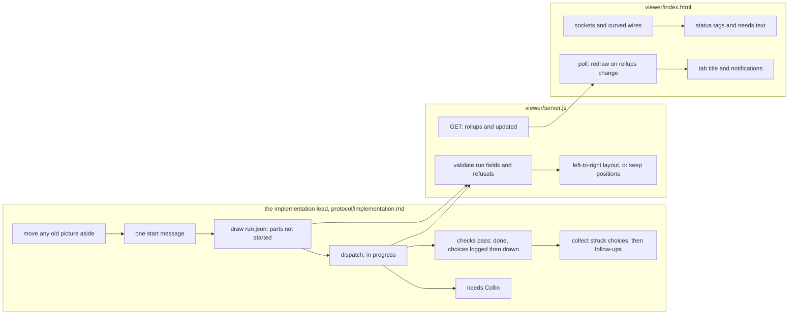

# Completion Report — A live picture of an implementation run

Written for a hostile reviewer: every claim checkable, no claim without evidence.

## What the change does



In words: the lead writes `graphs/run.json` through the server, which checks the new fields and
lays the picture out left to right. A write that changes only statuses keeps every box where it
was. On each read, the server adds the nested pictures' status summaries and the newest change
time. The page draws sockets made from the wires and status tags. It redraws when a nested
picture changes, and it flags a part that needs Collin in the tab title and with a notification.

## Spec coverage

| Spec item | Origin | Implemented at (file:line) | Validated by |
|-----------|--------|----------------------------|--------------|
| `run` switch, canonical position, omitted when false, non-boolean refused | this run | `viewer/server.js:140`, `:166-176` | `run.test.js` "legacy canonical bytes…", "run validation refuses…" (`unknown-schema`); existing `server.test.js` canonical round-trip |
| `task`/`status`/`needs` keys, canonical position, omitted on plain graphs | this run | `viewer/server.js:105-118`, `:198-201` | `run.test.js` "legacy canonical bytes…"; existing fixtures unchanged (`server.test.js:186-197`) |
| `store` and `choice` kinds | this run | `viewer/server.js:60`, `:213-215` | `run.test.js` "run validation refuses…" (`run-field`, `choice-shape`) |
| Refusals `run-field`, `run-field-shape`, `bad-status`, `status-without-task`, `needs-missing`, `needs-hidden`, `container-status`, `choice-shape` | this run | `viewer/server.js:213-234`, `:328-333` | `run.test.js` "run validation refuses each new schema violation" |
| `run-name`, `run-nesting` | this run | `viewer/server.js:1535-1546` | `run.test.js` "run validation refuses…", "run nesting and reserved names…" |
| Preservation exemption for the three keys; `/view` may not change them or `run` | this run | `viewer/server.js:371-372`, `:1495`, `:1513` | `run.test.js` "agent progress preserves ruled entries…" |
| `rollups` `{status, needs, cut}` for one-level children | this run | `viewer/server.js:413-435` | `run.test.js` "rollups, nesting, updated…" (all four statuses, needs list, run:false / missing / unreadable child) |
| `updated`, newest across the file and its children | this run | `viewer/server.js:438-446`, `:1649` | `run.test.js` "rollups, nesting, updated…" (touching the child moves `updated`) |
| Left-to-right layout, plain graphs unchanged | this run | `viewer/server.js:936-979`, `:981-982` | `run.test.js` "run layouts are left-to-right…"; every existing layout test in `server.test.js` and `render.spec.js` passes |
| Box height reservation | this run | `viewer/server.js:642-655`; `protocol/graphs.md:247` | read against the Spec formula; page copy in `viewer/index.html:1087-1110` |
| Keep positions when layout inputs unchanged | this run | `viewer/server.js:1548-1560`, `:1584` | `run.test.js` "run layouts…preserve drags for progress-only writes" (dragged box kept; added edge relays out) |
| List `run` field | this run | `viewer/server.js:1778-1782` | `run.test.js` "rollups, nesting, updated, and the list run path…" (valid, malformed, run:false) |
| Sockets made from wires, curved wires, no face slotting | this run | `viewer/index.html:1052-1068`, `:1574-1582`, `:1994-2016` | `run.spec.js` "sockets render named, unnamed and shared…" |
| Box contents: status line, label, needs (container first entry + "+N more"), socket rows, cut names with hover title | this run | `viewer/index.html:1087-1110`, `:1395-1458` | `run.spec.js` "sockets render…", "status tags and needs text render…", "a container shows its rollup…" |
| Status tags and borders, colour not the only signal | this run | `viewer/index.html:141-151`, `:1398-1402`, `:1468` | `run.spec.js` "status tags and needs text render…" |
| Container rollup status, `cut` message in detail panel | this run | `viewer/index.html:1070-1084`, `:1810-1820` | `run.spec.js` "a container shows its rollup status and needs, and a cut child explains itself…" |
| `choice` box: no status, normal controls, label only | this run | `viewer/index.html:1395-1458` | `run.spec.js` "status tags… and a choice box carries no status" |
| No task id on faces; task id in detail panel | this run | `viewer/index.html:1810-1811` | `run.spec.js` "status tags and needs text render…" |
| "updated N min ago" | this run | `viewer/index.html:256`, `:627-634` | `run.spec.js` "a child file's status change redraws…" |
| Redraw when `rollups` changes | this run | `viewer/index.html:2488-2505` | `run.spec.js` "a child file's status change redraws the open root without the root file changing" |
| Reserved-name 422 shows fatal; later success clears it | this run | `viewer/index.html:1121-1124`, `:2482`, `:2490` | `run.spec.js` "on a reserved-name path a removed file shows the fatal screen…", "a reserved-name file that no longer validates…" |
| Tab title prefix | this run | `viewer/index.html:600-603`, `:627-643` | `run.spec.js` "the title prefix appears and clears across polls" |
| One-time notification offer, remembered; one notification per node (file + id) newly needs-you | this run | `viewer/index.html:273-277`, `:356-358`, `:576-622` | `run.spec.js` "exactly one notification per node newly needs-you, including two nodes sharing an id in different files" |
| List page "run picture" link | this run | `viewer/list.js:85`, `:100-105` | `run.spec.js` "the list page shows a run picture link…" |
| `graphs.md` "Run pictures" section, key order, kinds, refusal table | this run | `protocol/graphs.md:713-863`, `:327-345`, `:247`, `:917-918` | read by the lead against the Spec |
| Stage 3: precondition accepts `implementing`; small-patch bypass | this run | `protocol/implementation.md:20-23`, `:25-29` | read against Spec |
| Stage 3: move aside at every start, one-sentence pointer | this run | `protocol/implementation.md:55-70` | read against Spec |
| Stage 3: brief closing section for choices | this run | `protocol/implementation.md:76-79` | read against Spec |
| Stage 3 step 1: ask once, start message, `Stage 3 started` line | this run | `protocol/implementation.md:89-103` | read against Spec |
| Stage 3 step 2: draw, `prior`, `--register-plan` again | this run | `protocol/implementation.md:105-122` | read against Spec |
| Stage 3 step 3: four states and when each is set; tell Collin | this run | `protocol/implementation.md:124-136` | read against Spec |
| Stage 3 step 4: `Choice:` Log line before the box; lead lists choices from the diff when missing | this run | `protocol/implementation.md:183-195` | read against Spec |
| Stage 3 step 5: collect struck choices from plain file reads, follow-ups, end-of-run list | this run | `protocol/implementation.md:204-216` | read against Spec |
| Stage 3 step 6: never block, 409 cap, end the picture on any other failure | this run | `protocol/implementation.md:138-146` | read against Spec |
| lanes.md "Checking a lane can log in"; exit-2 wording | this run | `protocol/lanes.md:240-252`, `:228-229` | read against Spec |

## Deviations from plan

None in behaviour. Choices the workers made that the Spec didn't settle, recorded in PLAN.md's
Log:

- Run-picture boxes show no kind tag and no fork tag (T2). The Spec's list of box contents
  doesn't include them, and the height reservation leaves no row for them. A consequence
  worth knowing: a `store` box on a run picture is recognisable only by its label.
- A loop-back wire's ends are only nearly horizontal. A single cubic curve can't be flat at
  both ends and also bow below both boxes (T2, `viewer/index.html:1574-1582`).
- Status borders: in progress uses a dash, done a thicker green line, and needs-you a tight
  red dash, over the existing single theme (T2).
- Age text rounds to the nearest minute. If storage throws, the notification offer counts as
  already answered (T2).
- The list page adds a fifth "Run" column (T2).
- The reserved-name check applies to files directly inside a directory named `graphs`. An
  unreadable child reports `children[name]: false` alongside `cut: true` (T1).
- The new prose carries no D-number citations, and the lead's steps are spread across the
  existing sections (T3).

This run was built under the Stage 3 rules as they stood before this change, so it drew no run
picture of itself.

## Routers

`protocol/AGENTS.md`: the rows for `implementation.md` and `graphs.md` now mention the run
picture. The root `AGENTS.md` is unchanged. Its viewer row lists files, and this change adds
tests but no page files. The `lanes.md` router row is unchanged, since what it says stays true.

## Validation evidence

On the merged branch (`b702612`):

```
$ node --test viewer/test/*.test.js
not ok 31 - a starter that loses the freed port registers through the new holder
# tests 131
# pass 130
# fail 1

$ npm --prefix viewer run test:browser
  220 passed (54.6s)

$ bash spine/test/run.sh        -> RESULT 80 passed, 0 failed
$ bash sensitivity/test/run.sh  -> RESULT 62 passed, 0 failed
$ bash seen/test/run.sh         -> exit 0
$ bash install/test/run.sh      -> RESULT 70 passed, 0 failed
```

The one failing test fails on the untouched branch too. Before any change it failed three
times out of three (PLAN.md Log, Stage 3 start). It tests a server port handoff this change
does not touch.

Not run: `./install.sh && ./install.sh`. It writes into the harness homes and restarts the
always-on viewer on this machine, so it is left for Collin to run.

## Known gaps / residual risks

- The rollup tests have no case where one child holds `needs-you` alongside `done` nodes. The
  precedence code was read and puts `needs-you` first (`viewer/server.js:417-418`).
- The always-on viewer is still running the old code until `./install.sh` runs, so a real
  run picture won't render there until then.
- The Accepted Risks in PLAN.md stand as written.

## Remediation rounds
