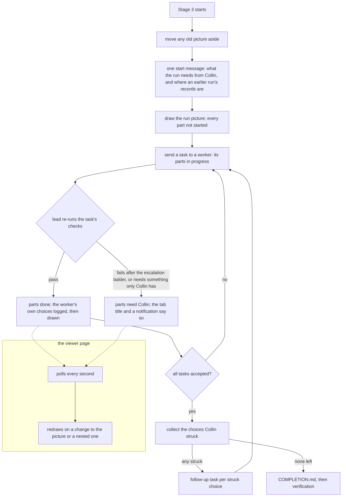

# A live picture of an implementation run

**Idea:** `IDEA.md` — what this is for and why, in plain language. Read it first; it is
the north star this plan serves. Goal and Constraints live there, not here, so they don't
get buried as this file grows.

## Open Questions

Ordered by leverage; discussed one at a time. A settled question moves to the Decision
Log and is deleted from here.

None.

## Watch List

Things noticed that need looking into — not yet decisions for the user. Written down the
moment they're spotted so they can't be forgotten, surfaced to the user one line at a
time as they appear, and emptied before Stage 1 exits.

Each item ends up settled by the agent (noted in the Log), promoted to an Open Question,
promoted to a Constraint or Accepted Risk, or waved off by the user.

| # | Noticed | What needs looking into | Raised to user? | Outcome |
|---|---------|-------------------------|-----------------|---------|
| W1 | 2026-09-25 | Target graph size is 10–25 boxes (`protocol/graphs.md:300-303`). A big plan's run picture could pass that. Check whether container boxes (one per subsystem) cover it, or whether the run picture needs its own limit | yes | Settled by the agent: D19 |
| W2 | 2026-09-25 | How much of `viewer/index.html` assumes rows run top to bottom, beyond the side-of-box arrow code (MAP.md, "Not checked"). This sizes Q2 and Q4 | no | Settled by the agent: the page's only direction assumption is which side of a box an arrow leaves from (`viewer/index.html:1010-1025`). Rows themselves are the server's layout (`viewer/server.js:568-893`), which a left-to-right picture needs turned on its side, box sizes included. Noted in the Log |

## Decision Log

Append-only. A reversal is a new entry superseding the old, never an edit.

| # | Decision | Rationale | Source |
|---|----------|-----------|--------|
| D1 | The run picture is a graph in the existing format and viewer, extended with new optional fields. It is not a separate file type or page | The viewer already has groups, container boxes, named data arrows, a one-second live refresh and Collin's rulings. A second format would duplicate about 5,000 lines of viewer and split the rules | defaulted |
| D2 | The picture is drawn at the start of Stage 3, once the lead has split the Spec into tasks, and lives at `docs/plans/<slug>/graphs/` like every other plan graph, committed with the plan | That is when the tasks and their boundaries first exist, and plan graphs already live there | defaulted |
| D3 | Four states per part: not started, in progress, done, needs Collin. In progress means the lead dispatched the work and it hasn't come back. Done means the lead's own re-run of the checks passed (`protocol/implementation.md:98-99`), not the worker's claim | Workers say nothing mid-run (MAP.md). "Done" on a worker's word would break the idea's rule that the picture never shows done when the lead's checks failed | user (states) / defaulted (meanings) |
| D4 | Needs Collin is set only when a part is blocked on something only Collin can supply, or has failed after the escalation ladder in `protocol/lanes.md` ran out. A retry or escalation that fixes it never shows | IDEA.md: rare, and only when relevant enough to show | user |
| D5 | Before dispatching any worker, the lead lists everything the run needs from Collin: tools the checks call, lanes and their logins (`protocol/lanes.md`), and any service access. It checks what it can and asks for all the missing items in one message. A task that depends on a missing item isn't dispatched until Collin says it's resolved | IDEA.md: blockers are raised at the start, not found mid-run | user (ask at start) / defaulted (what is checked) |
| D6 | When one part needs Collin, the lead keeps running the parts that don't depend on it | A single missing login shouldn't idle every independent worker | defaulted |
| D7 | Every worker brief gains a required report section listing the decisions the worker made that the brief didn't settle, each naming the part it affects. The lead adds them to the picture when it accepts that worker's result | Nothing reports these today (MAP.md). The picture can't show what nobody writes down | defaulted |
| D8 | A write that changes only status keeps every box where it is, including boxes Collin dragged. A write that adds, removes or rewires a part lays the picture out again | The lead updates status many times in a long run, and losing a drag on each update would make dragging useless. This narrows the rule that every write lays out fresh (`protocol/graphs.md`, "On the wire"), and only for status | defaulted |
| D9 | A new box kind, `store`, for a database, cache, or state file the change reads or writes | The idea asks to see which stores are touched. Today's `file` kind is a source file, and `external` is an outside system | defaulted |
| D10 | The lead opens the picture with `--show` and prints its URL at the start of the run. The plan's list-page entry links it | Same producer sequence every other graph uses (`protocol/graphs.md:507-525`) | defaulted |
| D11 | One box per piece of the design: a script, a rules document, a data file or store, an outside system. Each box names the task building it and takes its status from that task. Tasks are not drawn as boxes or groups | Only this shows what is wired to what and which stores get touched. Groups stay free for related parts of the design (IDEA.md) | user |
| D12 | A box's sockets are made from its wires. Every distinct named thing arriving on a `data` arrow becomes an input socket on the box's incoming side, and every distinct named thing leaving becomes an output socket on its outgoing side. Wires attach to those sockets. Nothing declares sockets separately | Sockets and wires can't disagree, and the lead has no second list to keep in sync through a long run | user |
| D13 | Two arrows carrying the same named thing into one box share one input socket, and one output socket can feed any number of wires. A `sequence` arrow, or a `data` arrow with no name for what it carries, attaches to one unnamed socket on each side rather than a named one | Follows from D12. An arrow with no name can't make a named socket, and giving each one its own blank socket would add clutter that carries no information | defaulted |
| D14 | A worker's own choice is drawn as its own small box, kind `decision`, wired to the part it affected. Collin can agree, strike, or leave it. Left alone counts as fine. Immediately before writing COMPLETION.md, the lead collects every struck choice, turns each into a follow-up task (whose part goes back to in progress), and writes COMPLETION.md only once those pass | Reuses the agree and strike Collin already does on plan graphs, keeps the run hands-off, and fixes a disagreement before verification instead of in it | user |
| D15 | A strike made after the lead's collection step isn't picked up automatically. The lead's end-of-run message says the window has closed, and a later strike is raised with the lead by hand | The collection has to happen at one fixed moment, or COMPLETION.md could never be written. The window runs the whole length of the run, which is what the idea asks for | defaulted |
| D16 | A follow-up task's own new choices appear the same way. The struck box stays struck on the picture, per the rule that a struck entry is never removed (`protocol/graphs.md:600-640`), and a follow-up's replacement choice gets a new box | Consistent with the existing verdict rules, and the struck box is the record of what Collin turned down | defaulted |
| D17 | Only the run picture uses the left-to-right layout, sockets and status. Planning and question graphs are unchanged | The top-to-bottom layout was just tuned across three plans. Moving other graphs over is a later, separate plan once Collin has lived with the new look | user |
| D18 | A run picture is marked by a new top-level field on the graph. The viewer uses the new layout, sockets and status display only when it is set. The new per-box fields (task id, status, what a needs-Collin part needs) are refused on any graph without it | One explicit switch keeps every existing graph byte-identical and stops the new fields leaking into planning graphs by accident | defaulted |
| D19 | A run picture past the 25-box target uses container boxes, one per group of related parts, each opening into its own child run picture. A container's status is rolled up from everything inside it: needs Collin if anything inside does, done only if everything is, not started only if nothing has started, otherwise in progress | The format's existing answer to a picture that's too big (`protocol/graphs.md:300-303`). The rollup makes the needs-Collin state impossible to hide inside a closed box | defaulted |
| D20 | Besides the picture and a message in the lead's turn, the open viewer tab signals a part that needs Collin: its title changes, and it raises a browser notification once he has allowed one | The viewer does the signalling, so it works the same whichever harness drives the run | user |
| D21 | Supersedes D14's box kind. A worker's own choice is drawn with a new kind, `choice`, allowed only on a run picture, not with `decision` | `decision` already means a fork in a flow, and a run picture can contain a real fork as a piece of the design. One kind for two meanings would make a struck fork look like a struck worker choice to the lead's collection step | defaulted |
| D22 | The run picture is always `docs/plans/<slug>/graphs/run.json`. Container children are `run-<group id>.json` beside it | A resumed or remediating lead has to find the picture without asking. Every other plan graph keeps having no fixed name | defaulted |
| D23 | Task id, status and what a stuck part needs sit outside the rules that protect Collin's rulings. The lead may change them on an agreed or struck box without resetting it. The page may never change them | Otherwise the lead couldn't mark an agreed box done without wiping Collin's agreement, and the picture would stall at the first ruling. Status is the lead's report, not a claim Collin rules on | defaulted |
| D24 | A run picture shows how long ago the lead last wrote it, taken from the file's modification time | If the lead's session dies, workers' boxes would otherwise say in progress forever. The age shows the picture has gone stale, which the idea's in-step rule needs | defaulted |
| D25 | The small-patch bypass (`protocol/implementation.md:22-24`) skips the run picture. The ask-at-start check (D5) still runs | A run short enough to skip the fan-out is short enough to watch in the terminal | defaulted |
| D26 | Viewer errors never stop the run. If a write to the picture is refused or the viewer is down, the lead says so in one line, keeps working, and the next update rewrites the whole picture from the task table | IDEA.md constraint: a broken picture must never stop or slow a run | defaulted |
| D27 | Arrows on a run picture are drawn as curves from socket to socket, with horizontal ends, as in Blender. Planning graphs keep straight lines | Sockets on the sides of boxes make straight lines cut through boxes. D17 keeps planning graphs unchanged | defaulted |
| D28 | Supersedes D3's meaning of in progress. A part is `in-progress` from dispatch until the lead accepts the task, which covers the lead's re-check of the result and any retry or escalation | Round 1 found no state covering a returned result under the lead's check. The work isn't done until it's accepted, so it is still being worked on | review-round-1 |
| D29 | `protocol/lanes.md` gains "Checking a lane can log in": the Codex preflight for GPT, no check for the Agent tool, and a one-word `claude -p` probe from Codex. Supersedes the Spec's earlier "lanes.md is untouched" | lanes.md had no Claude-side login check (`protocol/lanes.md:160-164`), so the ask-at-start step couldn't be done as written, and invocations may only live in lanes.md | review-round-1 |
| D30 | Supersedes D4's list. Needs Collin also covers a lane that returned nothing, since Stage 3 then stops and a person has to step in | Collin's stated intent was "something drastically wrong enough that I need to intervene". A stopped stage is that case | review-round-1 |
| D31 | A worker report missing the choices section is not treated as "none". The lead asks once more. If the section is still missing, the picture shows a "didn't report its own choices" box Collin can strike | Treating a missing section as "none" would silently empty the feature's main record | review-round-1 |
| D32 | Each accepted choice is also copied into PLAN.md's Log, so a lost picture can be redrawn from the Spec, the task table and the Log. Supersedes D26's "rewrite from the task table" | The task table alone doesn't hold the picture's structure or choices | review-round-1 |
| D33 | A container's rollup carries the `needs` entries of every stuck part inside it, and a `cut` flag for a walk stopped by depth or a cycle. `updated` is the newest time across the whole subtree | Round 1: a rolled-up needs-you box had no needs text to show or notify with, the depth rule had no defined result, and a child's progress left the root's age stale | review-round-1 |
| D34 | Run-picture boxes have a fixed internal layout: status line, label, up to three lines of needs, then socket rows, with long text cut and shown in full in the detail panel. The server always reserves the full height | The earlier formula counted sockets only. A reservation that doesn't depend on status keeps status-only writes from changing box sizes | review-round-1 |
| D35 | IDEA.md's Not doing amended: nothing on the page controls the run while it's going, except that a struck worker choice becomes a follow-up task at the end of the run. The build-instructions bullet gains "apart from those follow-up tasks" | Makes the idea match Q3's answer (D14). Raised in review round 1 | idea-change |
| D36 | Supersedes D31. A report without the choices section is filled in by the lead from the task's diff, which it already reads at integration, with `note` marking the list as the lead's. No lane is re-contacted | `lanes.md` has no Claude continuation, and adding one for this alone would be a new invocation path. The lead's diff read already happens | review-round-2 |
| D37 | A run picture nests one level only: `run.json` may hold containers naming `run-<id>` children, and those children hold none. Rollups read one child file, with no deep walk | Removes the depth-5 cutoff that could hide a stuck part, and removes cycles, with no loss. D19 only ever needed one level | review-round-2 |
| D38 | A choice is wired to its part by a `sequence` arrow labelled "chosen while building this" | Puts choices on the part's unnamed input socket under D13, so they never add named sockets | review-round-2 |
| D39 | On a run picture the page also redraws when `rollups` changes between polls | The page redraws only on the file's hash, and a child's progress doesn't change the root's hash | review-round-2 |
| D40 | A notification tracks a node by file and id together | Ids are unique only within one file | review-round-2 |
| D41 | On resume, an existing run picture is read back, never redrawn. Parts moved to Prior Work become `done` and unstarted ones `not-started` | Keeps Collin's rulings across an interrupted run | review-round-2 |
| D42 | A choice affecting parts in two files is drawn once, in the first named part's file, with the others named in its note | One choice, one ruling, and at most one follow-up task | review-round-2 |
| D43 | `run.json` and `run-*.json` are reserved: the server refuses them with `run: false` (`run-name`), and the list link and resume path both require `run: true`. Resume happens inside the existing reconcile step, before any dispatch, and the precondition sentence accepts `implementing` as a resume. Also supersedes D33's walk and depth wording, which D37 replaced: `cut` and `updated` are as the Spec states now | Round 3: a plain graph could hold the name, resume sat after dispatch, and D33 still described a walk that no longer exists. No plan graph is named `run*` today, so the reservation breaks nothing | review-round-3 |
| D44 | Best effort when the picture's file breaks. A file that goes missing or unreadable mid-run is left alone for the rest of the run, and Collin is told once. A fresh picture is drawn only at the next Stage 3 start or resume, and only when the file is missing. Supersedes D32's redraw-mid-run purpose; D32's Log copy stays, and it feeds the resume redraw | Every review round found a new gap in mid-run repair (lost boxes, a stuck tab, an unwritable corrupt file), all for a rare case. IDEA.md: the picture is the extra, the run is the job | user |
| D45 | Resume has two moments: read back during the existing reconcile step, re-tag after the new decomposition. Parts built before the run get task `prior`. A fresh drawing never writes into an existing child file. The lead collects strikes only from what it can read, and says what it couldn't. Reserved-name pages show a 422 as the fatal screen and recover when a later poll succeeds. Any read-back refusal other than `409` or unreachable gives up the picture for the run | Round 4: the re-tag had no task ids to use inside the reconcile step, a broken picture made step 5 impossible, and the page showed a corrupted file as a lost connection that never recovered | review-round-4 |
| D46 | On resume the lead runs `--open` on `run.json` before reading it back, and the read-back has four outcomes: valid, missing, viewer unreachable (retry at the next update), and unusable. Every `choice` from before the resume gets task `prior` | Round 5: an unregistered path would refuse a valid picture, the unreachable case contradicted step 6, and old choices' task ids could collide with new rows | review-round-5 |
| D47 | On resume, the old picture set is moved to `graphs/before-resume-<N>/` and a fresh one is drawn. Old strikes on choices are listed for Collin to strike again. Any viewer failure other than a `409` ends the picture for the run after one line, with no retries. Strike collection reads files directly, so it works after the picture has ended | Reuse drew new findings for three review rounds (4–6). Collin chose a fresh start (Q8) | user |
| D48 | The move-aside and fresh drawing happen at every Stage 3 start, not only a resume. Old strikes are found by scanning the `before-run-*` archive against Log markers ("reported" / "followed up"), so a crash can't lose them. A choice is logged before it's drawn. A `409` is retried at most three times in a row. The lead registers the plan again after step 2's `--open` | Round 7: a re-approved plan's old picture would have been reused; a crash between move and message lost strikes; the unordered writes could drop a choice; `409` had no cap; a cold start left no list entry | review-round-7 |
| D49 | Choices have stable ids (`r<N>-<task>-<n>`), and every Log line and marker keys on the id, not the label. The "reported" marker is dropped: old strikes are recomputed from the archive on every start and listed until followed up. A fresh drawing leaves out a followed-up choice, or one whose part is gone, and logs the latter. The Log line carries everything a redraw needs | Round 8: label matching could hide or lose strikes, the reported marker could suppress a strike Collin never saw or never re-struck, and a choice whose part was dropped by replanning couldn't be drawn legally | review-round-8 |
| D50 | After a restart, old choices aren't carried over. The lead lists the struck choices from the files it just moved aside, once, in step 1's message, and Collin raises any he still wants undone. No choice ids, markers or redraw of old choices. The Log keeps a plain record of each choice. Supersedes D49 and D48's carry-over parts | Carry-over bookkeeping failed review three rounds running (7–9). Collin chose report-only (Q9) | user |
| D51 | Step 1 always sends one start message, even when nothing is missing, and it carries the old-strikes list. A "Stage 3 started" Log line marks each run's records. Old strikes already followed up are marked as such. The Log line is written before the choice box. `prior` means "built before this run" | Round 10: the list rode on a message that might not be sent, old strikes that were already undone looked open, the end-of-run list couldn't tell runs apart, and `prior` misdescribed work that came with an adopted plan | review-round-10 |
| D52 | Supersedes D51's "already followed up" marking. After a restart, step 1's message carries two unmatched plain lists: the struck choices from the moved-aside files, and every choice the earlier run logged. It says some may already be followed up | Round 11: matching a strike to a follow-up row by file and id marked unfinished work as handled, and matched across runs. A choice logged but never drawn before a crash went unseen. Two plain lists need no matching and miss nothing | review-round-11 |
| D53 | Choice lines in the Log start with `Choice:`. The `Stage 3 started` line is written only after the start message is sent. The start message carries both restart lists, which read the `Choice:` lines from the latest `Stage 3 started` line to the end. The pointer to earlier follow-ups goes to the Log and COMPLETION.md | Round 12: step 1 and step 4 contradicted D52, the marker order could hide a crashed run's choices, the choice lines had no fixed form, and the old task rows the pointer named may be gone | review-round-12 |
| D54 | After a restart, the start message carries one sentence pointing to `graphs/before-run-<N>/` and the Log's `Choice:` lines, and nothing struck there is acted on unless Collin asks. The restart lists are removed. The `Stage 3 started` marker and `Choice:` lines remain for the end-of-run list | Restart reporting kept failing review. Collin chose to cut it (Q10) | user |
| D55 | The restart sentence also fires when an earlier `Stage 3 started` line exists with no files to move, and it names unfinished follow-up rows the earlier run left. `Choice:` and `Stage 3 started` sit after the Log's usual date dash | Round 13: a run whose picture never got written left logged choices with no pointer, and an unfinished follow-up would drop silently at reconcile | review-round-13 |

## Spec

The settled design. Bar: a fresh agent with no conversation history can implement from this
section alone. IDEA.md is the intent, and MAP.md is how things work today.



In words: every Stage 3 start moves any old picture aside and sends Collin one start
message. The lead then draws the picture with every part not started. Each task's parts go
to in progress when it is dispatched, and to done once the lead's own checks pass. At that
point the worker's own choices are logged, then drawn next to the parts they affected. A
part needs Collin only when the escalation ladder has run out, or when it's waiting on
something only he can supply. When every task is accepted, the lead turns each choice
Collin struck into a follow-up task, and only after those pass does it write COMPLETION.md.
Throughout, the open page polls and redraws, and it flags a part that needs Collin in the
tab title and with a notification.

### What gets built

A **run picture** is a plan graph (`protocol/graphs.md` format, `viewer/` server and page)
with one new top-level switch turned on. The implementation lead draws it at the start of
Stage 3 and keeps it current through the run. Only a run picture gets the new layout,
sockets, statuses and tab signal. Every other graph, including every graph already on
disk, renders and canonicalizes byte-identically to today (D1, D17, D18).

Five areas change:

1. `protocol/graphs.md`: the format additions below, in a new "Run pictures" section,
   plus the canonical key order and refusal table updated to match.
2. `viewer/server.js`: validation, canonical form, preservation, layout and GET additions.
3. `viewer/index.html` (and `viewer/list.js` for the one list link): rendering.
4. `protocol/implementation.md`: what the lead does. The brief requirement lives here,
   since this file owns brief contents.
5. `protocol/lanes.md`: one new section, "Checking a lane can log in", used by the lead's
   ask-at-start step (D29), and the exit-`2` line of its preflight rules reworded to match.
   Nothing else in it changes.

Routers that name these files are updated in the same change (`AGENTS.md` at the root,
`protocol/AGENTS.md`), per `protocol/implementation.md`'s router sweep.

### Format additions (`protocol/graphs.md`, `viewer/server.js`)

Top level: **`run`**, boolean, default `false`. Canonical position is directly after
`explanation`, so the top-level order is `schema`, `title`, `source`, `source_detail`,
`explanation`, `run`, `groups`, `nodes`, `edges`. Canonical bytes omit `run` when it is
`false`. This is the one key allowed to be absent on disk: it keeps every existing file
byte-identical, which the every-key rule would otherwise break. Any non-boolean is
`unknown-schema`.

Node, three new keys, canonical position directly after `graph` and before `x`:

- **`task`**: string or `null`. The Implementation Tasks row id (`T1`, `T4`…) of the task
  building this piece, or of the task whose worker made this choice. The one other value is
  `prior`, meaning built before this run (D45, D47). The server checks only that it is a
  non-empty string.
- **`status`**: one of `not-started`, `in-progress`, `done`, `needs-you`, or `null`.
- **`needs`**: string or `null`. What Collin has to do, in plain words with no commands
  or code terms ("log in to Codex again"). The exact command goes in the lead's turn
  message, not on the picture. Non-empty exactly when `status` is `needs-you`, and `null`
  otherwise.

The canonical node order becomes `id`, `label`, `kind`, `origin`, `was`, `exclusive`, `ref`,
`note`, `graph`, `task`, `status`, `needs`, `x`, `y`. On a graph with `run: false` the three
keys are omitted from canonical bytes when all are `null`, for the same byte-identity reason
as `run`.

New node kinds: **`store`** (a database, cache, or state file the change reads or writes),
valid on every graph (D9). **`choice`** (a worker's own decision), valid only when
`run: true` (D21).

Rules, each checked on every `PUT /graph`. The codes are new rows in the refusal table:

| Code | When |
|---|---|
| `run-field` | `run` is `false` and some node has non-null `task`, `status` or `needs`, or has kind `choice` |
| `run-field-shape` | `task` or `needs` is neither a non-empty string nor `null` |
| `bad-status` | `status` outside the four values and `null` |
| `status-without-task` | `status` non-null with `task` null, or the reverse, on a node that isn't a container or a `choice` |
| `needs-missing` | `status` is `needs-you` and `needs` is null or empty |
| `needs-hidden` | `needs` non-null while `status` isn't `needs-you` |
| `choice-shape` | a `choice` node with a null `task`, a non-null `status`, or no outgoing edge to a non-`choice` node |
| `container-status` | a container node (non-null `graph`) on a run picture with non-null `status`. Its status is always rolled up, never set |
| `run-name` | a file named `run.json` or `run-*.json` in a plan's `graphs/` directory is written with `run: false`. The names are reserved for run pictures (D43) |
| `run-nesting` | a run picture whose file isn't named `run.json` contains a container node, or a container on `run.json` names a child that doesn't match `run-[a-z0-9_-]+` (D37) |

A node with `task` and `status` both `null` is legal on a run picture. That is a store,
outside system or file the change touches but no task builds, and it renders with no status.

Preservation (D23): `task`, `status` and `needs` join `x`/`y` as fields
`sameExceptPosition` (`viewer/server.js:325`) ignores. An agent may change them on an
`agreed` or `rejected` entry without a reset. The page's `PUT /view` may never change them,
so a difference in any of the three is a `structural-difference` in `checkViewChanges`
(`viewer/server.js:1349`). `run` is compared like `title`.

GET `/wheelchair/graph` gains two keys, computed on each read and never written:

- **`rollups`**: for a run picture, maps each container node's `graph` name to
  `{status, needs, cut}` for that one child file (D19, D33, D37). A run picture nests only
  one level deep (`run-nesting` above), so the rollup reads one file and never walks
  further:
  - `status`: `needs-you` if any node in the child has it, else `done` if every node
    carrying a status is `done`, else `not-started` if every one is `not-started`, else
    `in-progress`. `null` when the child has no statused node, or is missing, unreadable,
    or not a run picture.
  - `needs`: every `needs-you` node in the child, as `{id, label, needs}` sorted by `id`.
    `[]` when there are none.
  - `cut`: `true` when the child is missing, unreadable, or not a run picture, which is
    exactly when `status` is `null` for a reason other than "nothing started or statused".
    Otherwise `false`.

  `{}` on a non-run graph.
- **`updated`**: milliseconds, the newest modification time among this file and its
  direct children (D24, D33). A child's progress therefore refreshes the root's age. On a
  non-run graph, just this file's.

Layout for a run picture (`positionGraph`, `layout` at `viewer/server.js:568`):

- **Left to right.** The same layered algorithm, groups first, with axes swapped. A layer
  is a column, every arrow points right after cycle-breaking, and crossing reduction orders
  boxes within a column. Box width and height swap roles in every spacing constant
  (`LAYER_GAP`, `NODE_PITCH`, `COMPONENT_GAP`, the group padding). Unconnected pieces sit
  in separate bands stacked down the page, not side by side.
- **Box contents and height (D34).** A run-picture box is `GROUP_NODE_W` wide. Top to
  bottom it holds: the status tag line (20px, absent when `status` and any rollup are
  null); the label, wrapped exactly as today (at most five lines of 24 characters, 16px
  each, with a container's shorter first line so it clears the child badge,
  `viewer/index.html:885-894`); on a `needs-you` box or a container rolled up to `needs-you`, the `needs` text
  (for a container, the first entry's `needs`, followed by "+N more" when there are
  others), wrapped to at most three lines of 24 characters with an ellipsis; then one 20px
  row per socket, taking the larger of the input and output counts. A socket name longer
  than 22 characters is cut with an ellipsis. The full text of anything cut is in the
  detail panel and the element's hover title. The page measures its real height from
  these parts. The server reserves the most it could ever be:
  `22 + 20 + 5×16 + 3×16 + 20 × max(1, inputs, outputs) + 14`. Because that reservation
  doesn't depend on status or `needs`, a status-only write never changes a box's reserved
  size. The numbers are stated once in `graphs.md`, next to `GROUP_PAD`, and copied into
  both files.
- **A write keeps positions when the layout's inputs are unchanged (D8).** The inputs are
  the set of node ids, each node's `graph` value, the set of edges as `(id, from, to,
  value)`, and each group's `id`, `visible` and members. If all of these equal what is on
  disk, every `x`/`y` is copied from disk, including dragged positions, and nothing is laid
  out. Otherwise the whole picture is laid out fresh, as today. Adding a `choice` box
  changes the node set, so it lays the picture out again and drops drags. That is recorded
  in Accepted Risks. This rule applies only to run pictures.

### Sockets and wires (`viewer/index.html`, D12, D13, D27)

For each box, computed on the page from the arrows. Nothing on disk:

- Each distinct non-null `value` among the box's incoming `data` arrows is one named
  **input socket**, down the box's left edge, sorted by value. Each distinct `value` on
  outgoing `data` arrows is one named **output socket** down its right edge.
- Incoming `sequence` arrows and `data` arrows with null `value` share one unnamed input
  socket, placed first. The same goes for outgoing arrows on the right. The unnamed socket
  exists only when such an arrow does.
- An arrow is drawn from its output socket on the `from` box to its input socket on the
  `to` box, as a cubic curve with horizontal tangents at both ends. An arrow whose `to` is
  not right of its `from` (a loop back) uses the same curve, bowed out below the two boxes.
- The socket's name is printed inside the box beside its dot. The arrow's own `label` is
  printed along the curve, as today. An `exclusive` box keeps its `if <label>` wording.
- Arrow slotting on a face (`viewer/index.html:253-263`) doesn't apply on a run picture:
  sockets replace it.

### Statuses and needs-you on the page (D3, D4, D20, D24)

- Each box with a status shows a text tag (`not started`, `in progress`, `done`,
  `needs you`), and each status has its own border treatment. Colour is never the only
  signal. The page has one theme today (no dark mode), and the colours fit it.
- A `needs-you` box also shows its `needs` text on the box, laid out as in "Box contents
  and height" above. A container rolled up to `needs-you` shows its rollup's first `needs`
  entry the same way. The detail panel lists every entry.
- A container box shows its rollup status as its status tag, taken from `rollups`. When
  `cut` is `true`, its detail panel says the picture inside it is missing, unreadable, or
  not a run picture.
- A `choice` box sits wired to the part it affected (D14), by a `sequence` arrow from the
  choice to the part, labelled "chosen while building this", so it joins the part's
  unnamed input socket (D38). It shows no status and carries
  the same agree and strike controls as any box. Its face carries only its plain-language
  label.
- No task id appears on any box face. The detail panel for a box shows its task id. The
  run picture's explanation panel names what each task id means, so a coined id is never
  bare on screen (`protocol/writing.md`, "Re-ground every label").
- The top bar shows "updated N min ago" from `updated`, refreshed with the poll.
- **Polling on a run picture (D39).** Today the page redraws only when the file's hash
  changes (`viewer/index.html:2090-2112`). On a run picture it also redraws when `rollups`
  differs from the previous poll, compared as canonical JSON, so a child's progress shows
  on the root without the root being rewritten. The age text updates on every poll. The
  hash stays the file's own, since writes depend on it. For a path whose file name is
  `run.json` or `run-*.json` (the reserved names, D43), a poll refused with a `422` shows
  the page's fatal screen with the error, the same way a `404` does today, rather than
  the "lost contact" notice (`viewer/index.html:2097-2102`). A later poll that succeeds
  clears the fatal screen and renders (`clearFatal`, `viewer/index.html:510`), so a tab
  left open recovers when a later Stage 3 start draws a fresh picture (D47).
- **Tab signal.** While the page shows a run picture, whenever the picture or its
  `rollups` contain at least one `needs-you`, the tab title is prefixed `needs you · `. It
  is removed when none remain. The first time the page shows a run picture, it offers one
  control to allow notifications, and it never asks again once Collin has answered. With
  permission granted, the page raises one browser notification each time a node turns
  `needs-you` on a poll, naming its label and its `needs`. That covers nodes in the shown
  picture and nodes listed in any rollup's `needs`. A node is identified by its file and
  its id together, since ids are unique only within one file (D40). A node that stays
  `needs-you` across polls doesn't notify again.
  Without permission, only the title changes. Nothing here applies to a graph with
  `run: false`.

### The list page (D10)

`GET /wheelchair/list` adds `run` to each plan entry: the absolute path of
`graphs/run.json` when that file exists and parses with `run: true`, and `null` otherwise. `viewer/list.js` shows a
"run picture" link on the plan's entry when `run` is non-null.

### What the lead does (`protocol/implementation.md`)

In this order, after the existing registration and precondition. Step 1 onward comes
after decomposition into the Implementation Tasks table. The start-of-run paragraph below
says which of its parts come earlier.

**At every Stage 3 start (D47, D48, superseding the reuse parts of D41, D45 and D46)**,
fresh or resumed, an old picture is never reused. On a resume, meaning status is already
`implementing`, the existing precondition sentence is reworded to accept this, as its
"Resuming an interrupted run" paragraph already assumes. A fresh start can also find an
old picture, for example a plan that verification sent back to planning and that was
approved again.

- *Move aside, during the existing reconcile step (or, on a fresh start, before step 1):*
  if any `run.json` or `run-*.json` exists in `graphs/`, the lead moves all of them
  together into `graphs/before-run-<N>/`, with a plain file move and no server call. `N`
  is the first number not already used. They keep their rulings there as a committed
  record. The viewer doesn't open them, since it serves only files directly in `graphs/`.
- *The earlier run, in step 1's message (D54, superseding the restart lists of D50, D52
  and D53):* when the move-aside step moved anything, or the Log already holds a
  `Stage 3 started` line (an earlier run began, even if its picture never got written),
  the start message says in one sentence where the earlier run's records are: the picture
  in `graphs/before-run-<N>/`, when files were moved, and its choices in the Log's
  `Choice:` lines. It adds that nothing struck there is acted on unless Collin asks. If
  the earlier run left unfinished follow-up rows in the Implementation Tasks table, the
  same sentence names them, since the reconcile step drops rows that aren't part of the
  Spec. The lead reads nothing else back for this. If Collin asks for an old choice to be
  undone, that is an ordinary request.
- *Fresh drawing, in step 2:* parts come from the Spec, statuses from the reconciled
  table. A part whose work moved to Prior Work as `pre-existing` gets task `prior` and
  `done`, and the explanation says `prior` means "built before this run", which covers
  work from an earlier run and work that came with an adopted plan.
  Everything else gets its new task id. The fresh picture shows only this run's choices.

1. **Ask once for everything the run needs (D5).** Before dispatching any worker, the lead
   lists what the run depends on that only Collin can supply: every command named in the
   briefs' validation lines that isn't on `PATH`, each lane the briefs use and whether it can
   log in (using `protocol/lanes.md`'s "Checking a lane can log in", D29), and any service,
   credential or access the Spec names. It checks what it can, then sends Collin one
   start message: all the missing items, with exact commands, or a line saying nothing is
   needed, plus, when an earlier run left records, the one sentence about the earlier run from the
   start-of-run paragraph (D51, D54). Once that message is sent, the lead writes a
   `Stage 3 started` line to the Log, which marks where this run's records begin for the
   end-of-run list (D53). A task that depends on a missing
   item isn't dispatched until Collin says it is resolved. Every other task goes ahead (D6).
   A family that fails its login check holds back only the tasks assigned to that family.
   They aren't rerouted to the other family, per the existing Lanes rule. This step replaces
   "stop and report" for a login found missing before any dispatch. Once workers are
   running, the existing rules apply unchanged. This step runs in the small-patch bypass too
   (D25).
2. **Draw the run picture (D2, D11, D22).** `docs/plans/<slug>/graphs/run.json`, with
   `run: true`, `source: plan-proposal`, and `source_detail` naming the plan's Spec. One box
   per piece of the design, each tagged with the task building it, status `not-started`, or
   `needs-you` with its `needs` for a task held back in step 1. Stores, outside systems and
   touched files that no task builds get boxes with no task. Related pieces sit in visible
   groups. Past 25 boxes, one container box per group opens into `run-<group id>.json`
   (D19). Labels follow `graphs.md`'s plain-language rule. The explanation names each task
   id's objective in a few words. The lead writes it with the producer sequence in
   `graphs.md` ("Writing a graph"), shows it with `--show`, and prints the URL (D10).
   Right after that `--open`, which starts the viewer if none was running, the lead runs
   `--register-plan` again. Stage 3's first registration does nothing when no viewer is
   running (`viewer/test/registration.test.js:119-123`), and without the second one the
   list page would have no entry to carry the run link (D48). The move-aside step leaves
   no `run*.json` behind, so every name step 2 writes is free. Skip
   this step and all picture updates below in the small-patch bypass (D25).
3. **Keep it current.** The lead rewrites the picture when a task is dispatched (its boxes
   go `in-progress`), and when the lead accepts the task after its own re-run of the checks
   passes (its boxes go `done`, D3). `in-progress` covers everything in between: the worker
   running, the lead re-checking its result, and any retry or escalation (D28). A worker's
   claim alone never sets `done`. A box goes `needs-you` in exactly three cases (D30): its
   task is blocked on something only Collin can supply; the escalation ladder in
   `protocol/lanes.md` has run out; or a lane returned nothing, so Stage 3 stops under its
   own Lanes rule (`protocol/implementation.md`, "Lanes") and Collin has to step in. `needs`
   then says what is needed. IDEA.md's "never shows something as being worked on after it
   came back" reads "came back" as accepted by the lead: a result still under the lead's
   check has not come back yet. A failure the lead
   recovers from, by a retry or an escalation that works, never shows (D4). Each of these
   moments is also where the lead reads the picture back first (`graphs.md`, "Reading a
   graph back"), so Collin's rulings are never overwritten. A `409` is handled as
   `graphs.md` says.
4. **Workers report their own choices (D7).** Every brief gains a required closing section:
   *"List each decision you made that this brief did not settle, one line each, naming the
   file or piece of the design it affected. Write 'none' if there were none."* When the lead
   accepts that worker's result, it adds one `choice` box per listed decision, wired to the
   part it affected, with `task` set to that task, a plain-language label, and the worker's
   own words in `note` (D21). Before drawing them, the lead notes each choice in
   PLAN.md's Log, one line each in the Log's usual `- <date> — ` form, with the text after
   the dash starting `Choice:` (as it does for `Stage 3 started`), naming its task, the part and the
   choice. The Log is written first, so a crash between the two writes never leaves a
   choice on the picture with no record. The lead reads these lines back in one place
   only, the end-of-run list in step 5. Nothing redraws from them (D48, D50, D54). A report
   with no such section is not accepted as `none` (D36, superseding D31). The lead already
   reads every task's diff at integration (`protocol/implementation.md`, "Integration and
   exit"). For a report without the section, it lists the choices it can see in that diff
   against the brief, and draws them the same way, with `note` saying the lead listed them
   because the worker didn't. No lane is re-contacted, so no new invocation is needed.
   Either way the Log records it: "worker didn't report its choices; the lead listed N",
   including when N is 0, so a missing report is never mistaken for "none" (D36).
5. **Collect struck choices before the write-up (D14, D15, D16).** Immediately before
   writing COMPLETION.md, the lead reads the run picture and every child it can read, and
   collects each `choice` whose `origin` is `rejected`. For this read it uses plain file
   reads of `run.json` and its children, not the viewer, so a picture ended under step 6
   is still read. A file that doesn't parse is skipped, and the end-of-run message names it
   so Collin can raise a strike by hand (D45, D47). Each becomes a new Implementation Tasks row
   (a follow-up task that undoes or redoes that choice, whose objective names the
   choice). Every part the choice affected,
   including parts in another file that its `note` names (D42), gets `task` set to the
   follow-up and its status set to `in-progress`, and the follow-up is dispatched and
   accepted like any other task. COMPLETION.md is written only once those pass, and its
   existing "Deviations from plan" section lists each struck choice and what replaced it.
   The struck `choice` box stays on the picture. A replacement choice gets a new id. The
   collection happens once. The end-of-run message lists every `Choice:` line in the Log
   since this run's `Stage 3 started` line, and
   tells Collin that strikes made from here on aren't picked up automatically, so he can
   still raise one with the lead by hand.
6. **Never block on the picture (D26, D44, D47, D48).** A `409` is the normal race,
   handled as `graphs.md` says, up to three times in a row on one update. A fourth counts
   as a failure. Any other failure, at any point in the run, ends the picture for
   the rest of this run. That covers `--open` printing no URL for any reason, a refused
   write or read-back, and a viewer that can't be reached. The lead says so once, in plain
   words, and writes nothing more to the picture. It never deletes, repairs or recreates a
   picture file mid-run, and there is no retry. The next Stage 3 start or resume draws a
   fresh one. The page shows that the picture is gone or broken (see "Polling on a run
   picture"). Choices keep going into the Log (D32), so the end-of-run message can still
   list them. The run's own gates stay exactly as they are.

The lead also tells Collin in its turn when a part turns `needs-you`, alongside the tab
signal (D20).

### Checking a lane can log in (`protocol/lanes.md`, D29)

A new section in `lanes.md`, the only place lane invocations live:

- **GPT lane:** `codex/preflight.sh`, as today. Exit `2` means it can't log in. Exit
  `0` or `1` means no login problem was found. That isn't proof, since a login revoked on
  the server still passes, and a failure found later is handled as a mid-run failure. The
  existing exit-`2` line, "No lane will authenticate; stop and report", becomes "No GPT lane
  will authenticate: dispatch none, and report", so it reads the same way as the
  ask-at-start step, which holds back GPT tasks and keeps the rest (D29).
- **Claude lane from Claude Code:** the Agent tool runs on the lead's own session, so it
  counts as logged in and needs no check.
- **Claude lane from Codex:** run `WHEELCHAIR_LANE=1 claude -p "Reply with the single word
  ok."`. Output of `ok`, ignoring case and surrounding whitespace, means logged in.
  Anything else, or a non-zero exit, is a login failure, reported with what it printed.

### Non-goals

From IDEA.md, restated for an implementer:
- Nothing on the page starts, stops or redirects a worker while the run is going. A strike
  changes nothing until the lead's collection step, which is the one place it leads to
  new work (IDEA.md, Not doing).
- COMPLETION.md's template, Stage 4 and the verifier are unchanged.
- There is no view into a running worker. In progress means dispatched and not yet
  accepted by the lead.
- Planning and question graphs, their layout, their straight arrows and their files are
  unchanged. Only `store` is new to them.
- No phone push or harness-specific notification.

### Edge cases

- A task that builds several pieces updates all their statuses in one write.
- A piece built by two tasks in sequence takes the currently active task's id. Its
  history is in the task table, not on the box.
- A `choice` that affects two pieces gets two edges. A `choice` goes in the same file
  as the part it affects, since edges join siblings only (`protocol/graphs.md`). One that
  affects parts in two files is drawn once, in the file of the first part the worker
  named. It is wired to the affected parts in that file, and its `note` names the others,
  so one choice always has exactly one box and one ruling (D42). `choice` boxes don't count toward the
  25-box split, which is decided once, when the picture is first drawn (D19).
- The lead writes while Collin is dragging or ruling. The page's write gets `409`, then
  re-reads and retries at once, up to eight times, as today
  (`viewer/index.html:438-475`). The lead's write gets `409` and follows the
  `graphs.md` rule.
- Collin strikes a design-piece box, not a `choice`. That ruling is kept under the normal
  rules, and it has no effect on the run. Only struck `choice` boxes are collected.
- A run picture whose file is deleted or corrupted mid-run is left alone for the rest of
  the run (step 6). An open tab shows it as gone or broken. At the next Stage 3 start, the old
  files are moved aside and a fresh picture is drawn at `run.json`, and an open tab recovers on its
  next poll.
- The notification permission is denied or unsupported. The title prefix still works.

### Validation

```bash
node --test viewer/test/*.test.js     # new server cases below, plus every existing one unchanged
npm --prefix viewer run test:browser  # new render cases below, Chromium and Firefox
bash spine/test/run.sh && bash sensitivity/test/run.sh && bash seen/test/run.sh && bash install/test/run.sh
./install.sh && ./install.sh && git status --porcelain   # stays empty
```

New server tests, in `viewer/test/`:
- Existing fixtures behave exactly as today: `canonical.json` round-trips byte-identical
  with no `run` or new node keys written, `noncanonical.json` still canonicalizes to
  `canonical.json`, and every refusal fixture still refuses with its current code.
- Each new refusal code fires on a minimal bad body.
- `status` changes on an `agreed` and on a `rejected` node are accepted without a reset.
  A `PUT /view` changing `status` is `structural-difference`.
- On a run picture, a write changing only `status`/`needs`/`task`/labels keeps every
  `x`/`y` from disk, including a dragged one. A write adding an edge relays out.
- Run-picture layout: for a chain A→B→C, `x` strictly increases along the chain and the
  `y` values are equal. On a plain graph the same chain lays out exactly as today.
- `rollups`: each of the four statuses and `null`, `needs` listing the child's
  `needs-you` nodes, and a missing child, an unreadable one and a non-run one (each status
  `null`, `cut: true`). A child with a `needs-you` node alongside `done` ones gives
  `needs-you`.
- `run-nesting`: a container inside `run-a.json` is refused, and a container on
  `run.json` naming `other` is refused.
- `updated` is the newest modification time across the root and a child. Touching only
  the child moves the root's `updated`.
- `list` carries `run` when `run.json` parses with `run: true`, and `null` when it is
  missing, doesn't parse, or has `run: false` (the last written by hand, since the server
  refuses it).
- `run-name`: writing `run.json` or `run-a.json` with `run: false` is refused.
- On a reserved-name path, a poll after the file is removed shows the fatal screen. A poll
  after it reappears clears it (browser test). A poll on a file that no longer validates
  shows the fatal screen with its error (browser test).

New browser tests: sockets render per the rules above (named, unnamed, shared); status
tags and `needs` text render; a container shows its rollup; the title prefix appears and
clears across polls; with a stubbed `Notification`, exactly one notification per node
newly `needs-you`, including two nodes that share an id in different files; the list
page shows a "run picture" link for a plan whose `run` is set and none for one whose `run`
is `null`; a child
file's status change redraws the open root without the root file changing. Every existing browser test passes unchanged, which is the check that
plain graphs render as they do today.

The `protocol/implementation.md` changes are prose, with no test suite (`AGENTS.md`,
"Verification"). The check is Stage 4 reading them against steps 1–6 and the "At every Stage 3 start" paragraph above,
for both a fresh start and a resume.

## Accepted Risks

Real issues consciously not fixed, each with the reason. Part of the spec, not review
scaffolding — an implementer should read these, and later review rounds must not
re-raise them.

| Risk | Why accepted | Round |
|------|--------------|-------|
| The tab signal only reaches Collin while a viewer tab is showing that run picture | Collin chose the viewer-side signal (D20) so it behaves the same from both harnesses. A phone push was the alternative, and it works from Claude Code only | planning |
| In progress means dispatched and not back, never how far a worker has got | Workers report nothing mid-run (MAP.md), and Collin accepted the lead-side view when confirming the idea | planning |
| Adding a `choice` box relays out the picture, dropping Collin's drags | Keeping positions across an added box needs incremental layout, which this format doesn't have. Drags still survive every status update, which is the frequent write (D8) | 1 |
| Choices from the last tasks may reach the collection step moments after they appear, with no real chance to be struck first | Waiting for Collin would make the run wait on him, against the idea. The end-of-run message lists every choice so he can still raise one by hand (step 5) | 1 |
| "Updated N min ago" can't tell a dead lead from one waiting on a long worker | The lead has no cheap heartbeat while it waits on a background worker. The age still catches the common failure, a picture that stopped moving, and the lead's own turn says what it is waiting on | 1 |
| A GPT login that passes the preflight can still fail mid-run (revoked on the server, or expiring after an exit-`1` transient failure) | The preflight reads stored expiry only. A later failure is a normal mid-run failure and shows as needs-you only if the existing rules make it one | 2 |
| After a restart, the earlier run's choices and Collin's strikes on them aren't listed. He looks them up in `graphs/before-run-<N>/` and the Log if he wants them | Restart reporting drew findings in every capped round since round 4. Collin chose the one-sentence pointer (Q10) | 12 |
| A strike made after the lead's collection step isn't acted on automatically | The collection must happen at one moment for COMPLETION.md to be written (D15). The end-of-run message says so | planning |

## Review Rounds

### Round 1 — 2026-09-25

**Lanes:** GPT / gpt-5.6-sol (mechanics lens); Claude / default reviewer model (intent lens); cross-family: yes.

**Changed since Round N-1:** n/a (first round — whole Spec in scope)

| Lane | Reported | Finding | Lead verdict | Resolution |
|------|----------|---------|--------------|------------|
| GPT | blocking | No truthful state while a returned result is being checked or remediated | upheld | D28: in progress lasts until accepted |
| GPT | blocking | A container rolled up to needs-you has no `needs` to show or notify with | upheld | D33: rollups carry the stuck parts' needs |
| GPT | blocking | A lost picture can't be rebuilt from the task table alone | upheld | D32: choices copied to the Log, and step 7 redraws from Spec, table and Log |
| GPT, Claude | blocking / minor | No Claude-side login check exists, but step 1 forbids a new one | upheld (blocking) | D29: lanes.md gains the check |
| GPT | blocking | A missing choices section counted as `none` silently defeats the record | downgraded to major | A worker still builds the right code, but the lead would lose the record. Fixed by D31 |
| GPT | blocking | Dead lane set to needs-you contradicts D4 | downgraded to minor | D4's list was narrower than Collin's stated intent ("drastically wrong enough that I need to intervene"), and a stopped stage is that case. Wording fixed by D30 |
| GPT | major | Rollup behaviour at the depth bound and on cycles undefined | upheld | D33: `cut` flag, visit-once walk, tests with expected results |
| GPT | major | `task`/`needs` types had no refusal code | upheld | `run-field-shape` added |
| GPT | major | "Every fixture re-canonicalizes byte-identically" is false for `noncanonical.json` | downgraded to minor | A worker would read the obvious intent. Checked `viewer/test/server.test.js:186-197`, wording fixed anyway |
| GPT | major | Root `updated` goes stale when only a child changes | upheld | D33: newest time across the subtree |
| GPT | major | Box height formula ignores label, status, needs and socket names | upheld | D34: fixed internal layout and a status-independent reservation |
| GPT | minor | The page retries a `409` at once, up to eight times, not on the next poll | upheld | Edge case corrected (`viewer/index.html:438-475`) |
| Claude | major | Strike-to-follow-up task contradicts IDEA.md's Not doing without a logged idea change | user-decision | Q6 → (a), IDEA.md amended (D35) |
| Claude | minor | Drags are lost whenever a choice box is added | accepted-risk | Accepted Risks, round 1. D8's rationale holds for status writes |
| Claude | minor | Last tasks' choices get almost no review window | accepted-risk | Accepted Risks, round 1. The end-of-run message lists every choice |
| Claude | minor | Choices can push a picture past 25 boxes mid-run, and which file a choice goes in was unstated | upheld | Edge cases: same file as its part, not counted toward the split |
| Claude | minor | `needs` example and choice box faces carry code words and task ids | upheld | `needs` is plain language, commands go in the lead's message, and no task id appears on a box face |
| Claude | minor | Updated age can't tell a dead lead from a long wait | accepted-risk | Accepted Risks, round 1 |
| Claude | minor | Step 1 hold-and-continue not reconciled with stop rules, and dead-lane rule misattributed to lanes.md | upheld | Step 1 now says a failed family holds back only its own tasks. Step 3 cites implementation.md's Lanes rule |

### Round 2 — 2026-09-25

**Lanes:** GPT / gpt-5.6-sol (mechanics lens); Claude / default reviewer model (intent lens); cross-family: yes.

**Changed since Round 1:**
- D28: in progress lasts from dispatch until the lead accepts the task (Spec step 3).
- D29: new "Checking a lane can log in" section for `protocol/lanes.md`, and step 1 now
  holds back only a failed family's tasks.
- D30: needs-you also covers a lane that returned nothing (step 3).
- D31: a missing choices section is asked for again, and otherwise shown as its own box
  (steps 4 and 5).
- D32: choices copied to the Log, and step 7 redraws a lost picture from Spec, table and Log.
- D33: `rollups` shape `{status, needs, cut}`, the walk rules, and `updated` across the
  subtree.
- D34: run-box internal layout and the server's height reservation.
- `run-field-shape` refusal, `needs` in plain words, no task id on box faces.
- Edge cases: which file a choice goes in, the 25-box count, the page's `409` retry.
- Validation: fixture wording, rollup and `updated` tests.
- D35: IDEA.md Not doing amended (the follow-up-task exception), and the Spec non-goal
  reworded to match.
- Accepted Risks: three new rows from round 1.

| Lane | Reported | Finding | Lead verdict | Resolution |
|------|----------|---------|--------------|------------|
| GPT | blocking | Step 1's hold-and-continue contradicts lanes.md's exit-2 "stop and report", which the Spec left untouched | downgraded to major | The stage docs own what follows (`protocol/lanes.md:160-164`), but the wording would still make a worker ask. The exit-2 line is reworded (D29 section) |
| GPT | blocking | Rollup precedence between needs-you and a missing or unreadable child undefined | upheld | D37: one-level rollup, precedence stated, tests added |
| GPT | blocking | A child's changes never redraw the root, because the page redraws on hash only | upheld | D39. Checked `viewer/index.html:2090-2112` |
| GPT | blocking | A choice duplicated into two files gives duplicate or inconsistent rulings | upheld | D42: drawn once |
| GPT | RE-RAISE blocking | The redraw sources still can't recreate the lost file's ids, groups and edges | downgraded to minor | The rationale was overstated, not wrong in effect: a redraw only needs to be correct, not identical. Step 7 now says it's a fresh drawing and states what carries over |
| GPT | blocking | The depth-5 cutoff can hide a deep needs-you part | upheld | D37: one level of nesting, so no cutoff exists |
| GPT | blocking | Notification identity by id alone collides across files | upheld | D40 |
| GPT, Claude | major | D31's continuation doesn't exist for Claude lanes in lanes.md | upheld | D36: the lead lists the choices from the diff instead |
| GPT | minor | A container's first label line is shorter than 24 characters | upheld | Box contents wording fixed |
| Claude | minor | D28 disagrees word for word with IDEA.md's "after it came back" | upheld | Step 3 states the reading. "Came back" means accepted, which keeps the idea's intent without a scope change |
| Claude | minor | Resume didn't say whether to redraw, or what status reconciled parts get | upheld | D41 |
| Claude | minor | Preflight exit 0 or 1 isn't proof of a working login | accepted-risk | Accepted Risks, round 2 |
| Claude | minor | A choice's arrow kind was unstated | upheld | D38 |

### Round 3 — 2026-09-25

**Lanes:** GPT / gpt-5.6-sol (mechanics lens); Claude / default reviewer model (intent lens); cross-family: yes.

**Changed since Round 2:**
- D36: a report missing the choices section is filled in by the lead from the diff (step
  4). Replaces D31's ask-again and the "didn't report" box, and step 5's handling of that
  box is removed.
- D37: run pictures nest one level only, with a new `run-nesting` refusal. `rollups`
  rewritten to read one child file, with new precedence and `cut` meaning.
- D38: a choice's arrow kind and label.
- D39: the page also redraws when `rollups` changes.
- D40: notification identity is file plus id.
- D41: resume reads the picture back and sets reconciled statuses (step 6).
- D42: a choice affecting two files is drawn once.
- Step 7: a redraw is a fresh drawing, and what carries over is stated.
- Step 3: how "came back" in IDEA.md is read.
- lanes.md: the preflight's exit-`2` line reworded, and exit `0`/`1` described as "no
  problem found".
- Box contents: a container's shorter first line.
- Validation: rollup, `run-nesting`, notification and child-redraw tests.
- Accepted Risks: one new row.

| Lane | Reported | Finding | Lead verdict | Resolution |
|------|----------|---------|--------------|------------|
| GPT | blocking | Resume is unreachable under the `approved`-only precondition, and ordered after dispatch | downgraded to major, upheld | The precondition tension already exists (`protocol/implementation.md:20-22` vs `:46`), so the plan isn't unimplementable. The ordering was really wrong. D43 moves resume into the reconcile step and rewords the precondition |
| GPT | blocking | A tab that saw the file vanish never recovers when it's redrawn | user-decision | Q7 → (a), D44: no mid-run redraw, so the tab's existing "gone" screen is correct |
| GPT | major | A plain graph named `run.json` would be misread on resume | upheld | D43: reserved names, `run-name` refusal |
| GPT | major | A corrupted run picture can't be rewritten, so step 7 loops or destroys it | user-decision | Q7 → (a), D44: the lead stops updating it and never touches the file |
| GPT | minor | "Couldn't be read" is wrong for a readable non-run child | upheld | Wording fixed |
| GPT | minor | No browser check for the list page's run link | upheld | Test added |
| Claude | minor | Resume statuses don't match Prior Work's states or re-tag new task ids | upheld | D43 resume paragraph |
| Claude | minor | D36 lets a missing report look like "none" | upheld | The Log records every missing report, including N = 0 |
| Claude | minor | D33 not marked superseded by D37 | upheld | D43 |
| Claude | minor | A struck two-file choice re-tags only one file's part | upheld | Step 5 re-tags every affected part |
| Claude | minor | The list link trusts the file name alone | upheld | D43: link requires `run: true` |

### Round 4 — 2026-09-25

**Lanes:** GPT / gpt-5.6-sol (mechanics lens); Claude / default reviewer model (intent lens); cross-family: yes.

Review budget reset by Collin's Q7 decision (`protocol/plan-review.md`, Exit).

**Changed since Round 3:**
- D43: `run-name` refusal, list link and resume both require `run: true`, resume moved
  inside the reconcile step before dispatch, precondition reworded, and D33's walk
  wording superseded.
- Resume paragraph: re-tagging parts with reconciled task ids, `pre-existing` gives
  `done`, `partial` gives `not-started`, and what happens to a missing or unreadable file.
- D44: best-effort handling of a broken picture file mid-run (step 6, edge case).
- Step 4: the Log records every missing report, including when the lead found none.
- Step 5: re-tags every part a struck choice affects, across files.
- The `cut` detail-panel wording, and the list-link browser test.

| Lane | Reported | Finding | Lead verdict | Resolution |
|------|----------|---------|--------------|------------|
| GPT | blocking | A broken picture leaves step 5 unable to collect strikes | upheld | D45: collect what's readable, and say what isn't |
| GPT | RE-RAISE blocking | A tab that saw the file vanish doesn't recover after a resume redraw, and `--show` won't open a new one | upheld | Evidence holds: failed polls still mark the path watched (`viewer/server.js:1446`), and nothing calls `clearFatal` on success. D45 adds recovery on reserved-name paths |
| GPT | blocking | A corrupted file shows as "lost contact", not an error screen | downgraded to minor | Real (`viewer/index.html:2097-2102`), but a worker would build the right mechanism. The Spec's claim about the page was wrong. Fixed in D45 |
| GPT, Claude | major | Resume re-tags inside the reconcile step, before new task ids exist | upheld | D45: two moments |
| GPT | major | A fresh root could collide with surviving child files that hold rulings | upheld | D45: never write into an existing child. Pick a free name |
| GPT | RE-RAISE minor | List tests don't cover `run: false` or malformed files | upheld | Tests added |
| Claude | minor | A `pre-existing` part's old task id may dangle or be reused | upheld | D45: task `prior` |
| Claude | minor | Step 6 names only two refusal codes, so other 422s retry forever | upheld | Step 6: any refusal other than `409` or unreachable |
| Claude | minor | A corrupted file is never redrawn, and the message doesn't say so | upheld | Step 6 and the edge case now say that deleting the file lets the next start draw a fresh one |
| Claude | minor | A readable `run.json` with `run: false` on resume is unhandled | upheld | Resume: treated as unusable |
| Claude | minor | Stale "steps 1–7" | upheld | Fixed |

### Round 5 — 2026-09-25

**Lanes:** GPT / gpt-5.6-sol (mechanics lens); Claude / default reviewer model (intent lens); cross-family: yes.

**Changed since Round 4:**
- D45 resume paragraph: two moments (read back in reconcile, re-tag after decomposition),
  unusable-file handling including `run: false`, task `prior`, and fresh drawings never
  writing into existing children.
- Step 5: collects strikes from what's readable, and reports what isn't.
- Step 6: any read-back refusal other than `409` or unreachable gives up the picture, and
  the message says deleting the file allows a fresh one.
- Polling on a run picture: reserved-name paths show a `422` as the fatal screen, and
  recover on a later successful poll.
- Edge case for a deleted or corrupted file. Validation: list, `run-name` and
  fatal-recovery tests. Step count.

| Lane | Reported | Finding | Lead verdict | Resolution |
|------|----------|---------|--------------|------------|
| Claude, GPT | major | Resume reads `run.json` without registering it, so a valid picture can be refused and dropped | upheld | D46: `--open` first. Checked `viewer/server.js:1443-1451` |
| Claude, GPT | major / minor | Resume's unusable rule catches both a missing file and an unreachable viewer, contradicting step 6 | upheld (major) | D46: four outcomes, each distinct |
| GPT | major | Old `choice` boxes' task ids can collide with new rows after resume | upheld | D46: `prior` |
| Claude | minor | `task`'s definition doesn't allow `prior` | upheld | Definition updated |

### Round 6 — 2026-09-25

**Lanes:** GPT / gpt-5.6-sol (mechanics lens); Claude / default reviewer model (intent lens); cross-family: yes.

**Changed since Round 5:**
- D46 resume paragraph: `--open` before the read-back, four distinct outcomes, and every
  pre-resume `choice` re-tagged `prior`, including choices redrawn from the Log.
- `task` field definition: the `prior` value.

This is round 3 of 3 since Collin's last decision (Q7).

| Lane | Reported | Finding | Lead verdict | Resolution |
|------|----------|---------|--------------|------------|
| Claude | major | Resume re-tagging covers `run.json` only, not choices and parts in child files | user-decision | Q8 → (a), D47 |
| GPT | blocking | A read-back that succeeds late never runs the re-tag, and a late fresh drawing mislabels current-run choices as `prior` | user-decision | Q8 → (a), D47 |
| GPT, Claude | blocking / minor | "`--open` printed no URL" also covers a refused registration or an older viewer, where graphs.md says stop, not retry | user-decision | Q8 → (a), D47 |

### Round 7 — 2026-09-25

**Lanes:** GPT / gpt-5.6-sol (mechanics lens); Claude / default reviewer model (intent lens); cross-family: yes.

Review budget reset by Collin's Q8 decision.

**Changed since Round 6:**
- D47 resume paragraph, rewritten: old `run*.json` set moved to
  `graphs/before-resume-<N>/`, fresh drawing, `prior` tagging, and old strikes listed
  (renamed `before-run-<N>` in round 7).
- Step 6 rewritten: any failure other than `409` ends the picture for the run, with no
  retries.
- Step 5: strike collection reads files directly.
- Step 2: free-name rule for children. Edge case for a deleted or corrupted file.

| Lane | Reported | Finding | Lead verdict | Resolution |
|------|----------|---------|--------------|------------|
| Claude | major | A fresh Stage 3 start can find an old `run.json`, and the create's `409` path would reuse its strikes | upheld | D48: move aside at every start. Free-name rule removed |
| Claude | minor | Strikes already followed up would be listed again after a resume | upheld | D48: Log markers |
| Claude | minor | Two rules still cited superseded D45 | upheld | Citations fixed |
| GPT | blocking | A crash between moving the files and reporting strikes loses the strikes | downgraded to major, upheld | Needs a crash in a narrow window, but a worker writing it as specified would lose data. D48: archive scan plus Log markers |
| GPT | major | The choice box and its Log line had no order, so a crash could drop a choice | upheld | D48: Log first |
| GPT | major | Repeated `409`s had no cap | upheld | D48: three in a row, then failure |
| GPT | major | On a cold start the list page has no plan entry for the run link | upheld | D48: register again after `--open`. Checked `viewer/test/registration.test.js:119-123` |

### Round 8 — 2026-09-25

**Lanes:** GPT / gpt-5.6-sol (mechanics lens); Claude / default reviewer model (intent lens); cross-family: yes.

**Changed since Round 7:**
- D48 "At every Stage 3 start" paragraph, rewritten: move aside at every start into
  `before-run-<N>`, archive scan for old strikes against Log markers, and the fresh
  drawing.
- Step 2: plan registered again after `--open`, and the free-name rule removed.
- Step 4: the Log is written before the picture. Step 5: a "followed up" Log line.
- Step 6: a `409` cap of three in a row.
- Citation fixes (D45 → D47).

Round 2 of 3 since Collin's Q8 decision.

| Lane | Reported | Finding | Lead verdict | Resolution |
|------|----------|---------|--------------|------------|
| Claude | major | A fresh drawing redraws already-followed-up choices as live ones | upheld | D49: left out |
| Claude, GPT | major / blocking | A logged choice whose part was removed by replanning can't be drawn legally | upheld (major) | D49: left out and logged. A worker would have had to ask, not build the wrong thing |
| Claude, GPT | major | Markers matched by label can hide or lose strikes | upheld | D49: stable ids |
| GPT | major | The reported marker can be written before Collin sees the message | upheld | D49: marker removed. The list is recomputed every start |
| GPT | major | A reported marker suppresses a strike Collin never re-struck | upheld | D49: listed until followed up |
| Claude | minor | The Log line lacks what a redraw needs | upheld | D49: full line format |
| Claude | minor | The section opener's ordering contradicts the move-aside step | upheld | Opener reworded |

### Round 9 — 2026-09-25

**Lanes:** GPT / gpt-5.6-sol (mechanics lens); Claude / default reviewer model (intent lens); cross-family: yes.

**Changed since Round 8:**
- D49: stable choice ids and the full Log line format (step 4), the "followed up" marker
  by id (step 5), the old-strike list recomputed every start with no "reported" marker,
  and fresh drawings leaving out followed-up choices and those whose part is gone.
- The section opener's ordering.

Round 3 of 3 since Collin's Q8 decision.

| Lane | Reported | Finding | Lead verdict | Resolution |
|------|----------|---------|--------------|------------|
| Claude, GPT | major | Run number `N` in choice ids can repeat when a run archived nothing | user-decision | Q9 → (a), D50 |
| Claude, GPT | major / blocking | Part ids don't survive a redraw, so logged choices can't be reconnected reliably | user-decision | Q9 → (a), D50 |
| Claude | major | A struck choice whose part is gone can't be struck again and is listed forever | user-decision | Q9 → (a), D50 |
| GPT | major | The followed-up marker can outlive a crashed follow-up task | user-decision | Q9 → (a), D50 |
| Claude | minor | Unre-struck old strikes are listed at every start forever | user-decision | Q9 → (a), D50 |
| Claude | minor | A redrawn choice's file is unstated | user-decision | Q9 → (a), D50 |
| Claude | minor | Restart bookkeeping for choices has drawn findings six rounds running; a smaller shape meets the idea | user-decision | Q9 → (a), D50 |

### Round 10 — 2026-09-25

**Lanes:** GPT / gpt-5.6-sol (mechanics lens); Claude / default reviewer model (intent lens); cross-family: yes.

Review budget reset by Collin's Q9 decision.

**Changed since Round 9:**
- D50: the start-of-run paragraph's old-strikes bullet is now report-only, and the fresh
  drawing no longer redraws old choices.
- Step 4: the choice id scheme and Log line format are removed. The Log keeps a plain
  record.
- Step 5: the followed-up marker is removed. Step 6: the Log sentence reworded.
- The `task` definition's `prior` wording. A new accepted risk.

| Lane | Reported | Finding | Lead verdict | Resolution |
|------|----------|---------|--------------|------------|
| Claude | major | The old-strikes list rides on step 1's message, which is only sent when something is missing | upheld | D51: always one start message |
| Claude | minor | Old strikes that were already followed up look open | upheld | D51: marked "already followed up" |
| Claude | minor | The end-of-run list can't tell this run's Log lines from a crashed run's | upheld | D51: "Stage 3 started" marker |
| Claude | minor | Validation still says "resume paragraph" | upheld | Reworded |
| GPT | RE-RAISE major | Log-before-picture ordering was lost in the rewrite | upheld | Restored in step 4 |
| GPT | blocking | `prior` misdescribes pre-existing work from an adopted plan | downgraded to minor | A wording issue: the value is legal, only the explanation was wrong. Fixed in D51 |

### Round 11 — 2026-09-25

**Lanes:** GPT / gpt-5.6-sol (mechanics lens); Claude / default reviewer model (intent lens); cross-family: yes.

**Changed since Round 10:**
- D51: step 1 always sends a start message, and writes a "Stage 3 started" Log line.
- Old strikes marked "already followed up", using follow-up row objectives that name the
  choice's file and id (step 5).
- Step 4: Log before picture, restored.
- End-of-run list scoped to this run's Log lines.
- `prior` wording. Validation wording.

Round 2 of 3 since Collin's Q9 decision.

| Lane | Reported | Finding | Lead verdict | Resolution |
|------|----------|---------|--------------|------------|
| Claude, GPT | major / RE-RAISE blocking | "Already followed up" marks unfinished follow-ups as handled, and matches across runs | upheld (major) | D52: marking removed. A worker would build a misleading label, not a broken run |
| Claude | minor | Prior Work has no objective column to match on | upheld | Moot under D52, since nothing is matched |
| Claude | minor | Unstruck choices from before a crash are never listed again | upheld | D52: the earlier run's logged choices are listed at restart |
| GPT | blocking | A choice logged but not drawn before a crash is never shown | upheld | D52: listed at restart from the Log |

### Round 12 — 2026-09-25

**Lanes:** GPT / gpt-5.6-sol (mechanics lens); Claude / default reviewer model (intent lens); cross-family: yes.

**Changed since Round 11:**
- D52: the "already followed up" marking is removed. At restart, step 1's message carries
  two unmatched lists: old strikes from the moved-aside files, and every choice the
  earlier run logged. It notes that some may already be followed up.
- Step 5: follow-up objectives name the choice, with no file-and-id matching.

Round 3 of 3 since Collin's Q9 decision.

| Lane | Reported | Finding | Lead verdict | Resolution |
|------|----------|---------|--------------|------------|
| GPT | blocking | Step 1 omits the second restart list, and step 4 says the Log is never read back, contradicting D52 | downgraded to major, upheld | Contradictory text a worker would stop on, not a wrong build. D53 aligns step 1 and step 4 |
| GPT, Claude | RE-RAISE major / minor | The `Stage 3 started` marker isn't ordered after the start message | upheld (major) | D53: written after the message |
| Claude | minor | Choice lines have no fixed marker | upheld | D53: `Choice:` |
| Claude | minor | The pointer to follow-up rows can lead nowhere | upheld | D53: points to the Log and COMPLETION.md |

### Round 13 — 2026-09-25

**Lanes:** GPT / gpt-5.6-sol (mechanics lens); Claude / default reviewer model (intent lens); cross-family: yes.

Review budget reset by Collin's Q10 decision.

**Changed since Round 12:**
- D53: `Choice:` line prefix, and the `Stage 3 started` line written after the start
  message.
- D54: the restart lists are replaced by one sentence in the start message (start-of-run
  paragraph, step 1), and step 4's read-back is limited to the end-of-run list.
- Accepted Risks: the restart-list row replaced.

| Lane | Reported | Finding | Lead verdict | Resolution |
|------|----------|---------|--------------|------------|
| GPT | RE-RAISE major | The restart pointer fires only when files were moved, missing logged choices from a run whose picture never got written | downgraded to minor | The trigger is stated exactly, so a worker wouldn't stop to ask. The consequence is a missing pointer after a rare double failure, and D54 already has Collin look records up himself. Fixed anyway (D55) |
| Claude | minor | Where `Choice:` sits in a Log line | upheld | D55 |
| Claude | minor | Unfinished follow-ups from a crashed run drop silently at reconcile | upheld | D55: named in the restart sentence |
| Claude | minor | "After a restart" wording, and a stale D32 citation | upheld | Fixed |

## Prior Work

Parts of the Spec already built before this plan reached Stage 3 — adopted from outside
with work already done, or left behind by an implementation run that died partway.

| Spec item | State | Evidence (file:line) | Confidence |
|-----------|-------|----------------------|------------|

## Implementation Tasks

Filled by Stage 3. One row per worker brief.

| # | Objective | Ownership boundary | Lane | Session id | Validation | Status |
|---|-----------|--------------------|------|-----------|------------|--------|
| T1 | Server side of run pictures: format fields, kinds and refusals, canonical omission, preservation and `/view` rules, `rollups`/`updated`, left-to-right layout with box reservation and the keep-positions rule, list `run` field, with server tests (Spec "Format additions", "The list page") | `viewer/server.js`, `viewer/test/run.test.js` (new), `viewer/test/fixtures/run-*.json` (new) | GPT / gpt-5.6-terra (worktree `iv-t1`) | | `node --test viewer/test/*.test.js` | dispatched |
| T2 | Page side of run pictures: sockets and curved wires, box contents, statuses, choice boxes, rollup polling, reserved-name fatal and recovery, age text, tab title and notifications, list link, with browser tests (Spec "Sockets and wires", "Statuses and needs-you on the page", "The list page") | `viewer/index.html`, `viewer/list.js`, `viewer/test/run.spec.js` (new) | Claude / sonnet (after T1 merges) | | `npm --prefix viewer run test:browser` | not started |
| T3 | The prose: `protocol/graphs.md` "Run pictures" section, key order and refusal table; `protocol/implementation.md` steps and start-of-run paragraph; `protocol/lanes.md` login section and exit-2 wording; routers | `protocol/graphs.md`, `protocol/implementation.md`, `protocol/lanes.md`, `AGENTS.md`, `protocol/AGENTS.md` | Claude / sonnet (worktree `iv-t3`) | | read against the Spec; `git diff --stat` | dispatched |

Session id = the `thread_id` of a `codex exec` lane, so remediation can resume it.

## Log

- 2026-09-25 — MAP.md written and shown; IDEA.md confirmed after Collin added the
  needs-him state and the ask-at-start rule.
- 2026-09-25 — Q1 settled (D11, a box is a piece of the design). W2 settled: the direction
  assumption lives in the server's row layout and the page's choice of arrow side, nothing
  else found in the page.
- 2026-09-25 — Q2 settled (D12, sockets made from the wires; D13 defaulted).
- 2026-09-25 — Q3 settled (D14, Collin can rule on worker choices; D15–D16 defaulted).
- 2026-09-25 — Q4 settled (D17, only the run picture changes). D18–D19 defaulted; W1
  settled by D19.
- 2026-09-25 — Q5 settled (D20, the viewer tab signals needs-you). D21–D27 defaulted in the
  final Spec pass. No rejected entries in any of the plan's graphs (none has a container).
  Status `ready-for-review`.
- 2026-09-25 — Plan review round 1 triaged: 12 upheld, 3 downgraded, 3 accepted risks, 1
  user-decision (Q6, an idea change). Spec updated with D28–D34. Round 2 waits on Q6.
- 2026-09-25 — Q6 settled: IDEA.md amended (D35). Starting review round 2.
- 2026-09-25 — Plan review round 2 triaged: 10 upheld, 2 downgraded, 1 accepted risk, no
  user decisions. Spec updated with D36–D42. Round 3 (the last before the cap) next.
- 2026-09-25 — Plan review round 3 triaged: two upheld majors (resume ordering and the reserved
  name, both fixed in D43) and a recurring recovery fork raised as Q7. Round 3 is not clean,
  so this is the cap: the fork goes to Collin, and the review budget resets once he settles it.
- 2026-09-25 — Q7 settled (D44, best effort). Review budget reset; round 4 started.
- 2026-09-25 — Plan review round 4 triaged: blockers and majors all upheld and fixed (D45),
  no user decisions. Round 5 (2 of 3 since Collin's Q7 decision) next.
- 2026-09-25 — Plan review round 5 triaged: three majors in the resume paragraph, all upheld and
  fixed (D46). Round 6 is the last before the cap.
- 2026-09-25 — Plan review round 6 triaged: every finding is in the resume-reuse path, which
  has drawn findings three rounds running. Cap reached (3 rounds since Q7). Raised as Q8.
- 2026-09-25 — Q8 settled (D47, a fresh picture on resume). Budget reset; round 7 started.
- 2026-09-25 — Plan review round 7 triaged: one blocking downgraded to major and all majors
  upheld and fixed (D48). Round 8 next.
- 2026-09-25 — Plan review round 8 triaged: all findings in choice bookkeeping across restarts,
  upheld and fixed (D49). Round 9 is the last before the cap.
- 2026-09-25 — Plan review round 9 triaged: every finding in restart bookkeeping for choices,
  three rounds running since Q8. Cap reached; raised as Q9.
- 2026-09-25 — Q9 settled (D50, report-only). Budget reset; round 10 started.
- 2026-09-25 — Plan review round 10 triaged: one major and one re-raised major upheld and fixed
  (D51), the rest minor. Round 11 next.
- 2026-09-25 — Plan review round 11 triaged: the round-10 marking reintroduced matching. Removed
  (D52). Round 12 is the last before the cap.
- 2026-09-25 — Plan review round 12 triaged: two majors (text contradictions, marker order)
  upheld and fixed (D53). Cap reached a third time; raised as Q10.
- 2026-09-25 — Q10 settled (D54, one-sentence restart pointer). Budget reset; round 13 started.
- 2026-09-25 — Plan review round 13 triaged: clean (no upheld blocking or major). Minors fixed
  (D55). Spec diagram drawn; status `approved`.
- 2026-09-25 — Stage 3 started. Three tasks: T1 (server, GPT) and T3 (prose, Claude) in parallel
  worktrees, then T2 (page, Claude) on top of T1. Baseline before any change: browser suite 202
  passed; server suite 124 of 125, with `lifecycle.test.js` "a starter that loses the freed port
  registers through the new holder" failing three times out of three on the untouched branch.
  That failure is pre-existing and out of scope.
