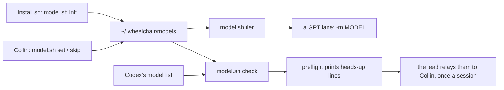

# Completion Report — Switch GPT models without editing wheelchair

Written for a hostile reviewer: every claim checkable, no claim without evidence.

## What the change does



The installer creates the pins file once. Every GPT lane gets its model from `model.sh <tier>`.
Before a GPT lane, the login check runs `model.sh check`, which compares Codex's model list with
the pins and prints a heads-up for a newer model or a new family. The exit code stays the token
check's. Collin's `set` and `skip` are the only things that change the pins.

## Spec coverage

| Spec item | Origin | Implemented at (file:line) | Validated by |
|-----------|--------|----------------------------|--------------|
| Pins file format, defaults table, seams | this run | `codex/model.sh:15-20`, `:30-33`, `:37-55`, `:71-76` | `codex/test/run.sh` "init writes shipped defaults", "reader defaults a missing tier" |
| `model.sh <tier>`, including malformed and missing files | this run | `codex/model.sh:220-228` | `codex/test/run.sh` "missing pins use Luna default", "malformed pins reader returns shipped default", "unknown tier exits 2" |
| `set`, `skip`, `init`, with lock and atomic write | this run | `codex/model.sh:79-101`, `:229-285` | `codex/test/run.sh` set, skip and init rows, including malformed-file refusal |
| Numeric version comparison (D4) | this run | `codex/model.sh:103-128` | `codex/test/run.sh` "6 equals 6.0", "6.1 beats 6", "6.10 beats 6.9" |
| Newer-model line, family word (D21), pinned models quiet (D14), skip (D10) | this run | `codex/model.sh:151-201` | `codex/test/run.sh` "normal heads-up uses the exact switch and skip form", "a pinned no-tier model stays quiet", "a later pinned-family model is offered for that tier", "skip offers the next newest model" |
| Unparseable pin (D20, D21) | this run | `codex/model.sh:173-190` | `codex/test/run.sh` "an unparseable pin uses its available-for line", "skipping the newest unparseable-pin candidate is quiet" |
| No-tier lines, capped at three (D9) | this run | `codex/model.sh:203-212` | `codex/test/run.sh` "tierless models use three newest lines and the remainder line" |
| Malformed-pins line, and missing, malformed and hidden-only caches (D3, D15, D20) | this run | `codex/model.sh:130-149`, `:152-155` | `codex/test/run.sh` cache cases and "malformed pins line prints even without a useful cache" |
| Preflight runs the heads-up, exit code unchanged (D3, D16) | this run | `codex/preflight.sh:35-36`, `:123-124` | `codex/test/run.sh` "preflight keeps exit 0 / 1 / 2 with a heads-up" (loopback stub, no network) |
| Installer creates the pins once (D1) | this run | `install.sh:86-90` | `install/test/run.sh` "codex-only install creates the default model pins", `codex_pins_preserved` case |
| lanes.md: tiers only, reader in every invocation, resume rule, heads-up relay (D5, D11, D12, D17, D18, D20, D21) | this run | `protocol/lanes.md:42`, `:56-62`, `:64-67`, `:117-121`, `:246-250` | read against the Spec. `grep -rniE "gpt-[0-9]" protocol/` shows only `lanes.md:68`, the labelled 5.6 measurement |
| implementation.md Lane record (D18, D21) | this run | `protocol/implementation.md:92-97` | read against Spec |
| plan-review.md and verification.md name Sol, with placeholders (D5, D20) | this run | `protocol/plan-review.md:33-36`, `protocol/verification.md:29`, `:35`, `:62` | read against Spec |
| Claude lanes unchanged (D7) | this run | no Claude invocation changed in `protocol/lanes.md` | `git diff` of `protocol/lanes.md` touches only GPT lines |
| Routers, README, CONTRIBUTING | this run | `AGENTS.md:57`, `:107`; `CONTRIBUTING.md:84`; `README.md:84`, `:90-91` | read |
| No allow-list grant (D19) | this run | `seen/set.sh` unchanged | `bash seen/test/run.sh` passes unchanged |

## Deviations from plan

None in behaviour. The workers' own choices are in PLAN.md's Log as `Choice:` lines and on the run
picture. Collin struck none of them.
- T1: `set` and `skip` rewrite the pins file in a fixed order, so comments Collin adds by hand are
  dropped. `skip` on a missing pins file creates the defaults first. The login check's failure
  cases are tested against a local stub.
- T2: six wording choices in the rule documents and the README.

## Routers

The root `AGENTS.md` now describes `codex/` as `prompts/`, `preflight.sh`, which also prints the
heads-up, and `model.sh`, the GPT model pins. Its Verification block gains
`bash codex/test/run.sh`. `protocol/AGENTS.md` is unchanged, since what it says about lanes.md
and the stage documents is still true.

## Validation evidence

On the merged `model-pins` branch:

```
$ bash codex/test/run.sh        -> RESULT 43 passed, 0 failed
$ bash install/test/run.sh      -> RESULT 72 passed, 0 failed
$ bash seen/test/run.sh         -> RESULT 18 passed, 0 failed
$ bash spine/test/run.sh        -> RESULT 80 passed, 0 failed
$ bash sensitivity/test/run.sh  -> RESULT 62 passed, 0 failed
$ node --test viewer/test/*.test.js -> 132 pass, 1 fail (the pre-existing lifecycle test, unchanged)
$ grep -rniE "gpt-[0-9]" protocol/
protocol/lanes.md:68:    against Sol's 91.5%). That was measured on `gpt-5.6-luna` and ...

$ ./codex/model.sh sol          # on this machine, no pins file yet
gpt-6.1-sol
$ ./codex/preflight.sh
preflight: token fresh (142h remaining)
exit 0                          # no heads-up: nothing Codex lists is newer than the pins
```

The browser suite wasn't run, because nothing under `viewer/` changed.

Not run: `./install.sh`. It would create `~/.wheelchair/models` on this machine and restart the
viewer service, so it is left for Collin. Until then the reader uses the shipped defaults, which
are the same four models.

## Known gaps / residual risks

- Pinning by hand-editing the file works, but the next `set` or `skip` drops any comments Collin
  added (T1's choice).
- The heads-up reaches Collin only through the lead relaying it (D11). A lead that skips the
  preflight never sees it, as `protocol/lanes.md` already requires it before the first GPT
  dispatch.

## Remediation rounds

### Remediation 1 — 2026-09-29

Verification round 1 found 2 gaps, listed verbatim in `REMEDIATION-1.md`.

- R1 (Luna, gpt-6-luna, the first lane dispatched through the pins): `visible_models` now also
  catches `ValueError` and `RecursionError` (`codex/model.sh:134`), and `check` wraps the heads-up
  so any unexpected error prints nothing and exits 0 (`:240-245`). A new test uses a 5,000-digit
  integer in the cache.
- R2 (sonnet): `protocol/lanes.md:56-62` says every lane's record, in any stage, names the tier
  and the `MODEL` value resolved before that call, and points to where implementation, review and
  verification record it.

Validation after remediation 1: `codex/test/run.sh` 45 passed, `install/test/run.sh` 72,
`seen/test/run.sh` 18, `spine/test/run.sh` 80, and `sensitivity/test/run.sh` 62, all 0 failed.
`grep -rniE "gpt-[0-9]" protocol/` shows only `protocol/lanes.md:73`, the labelled 5.6
measurement.
