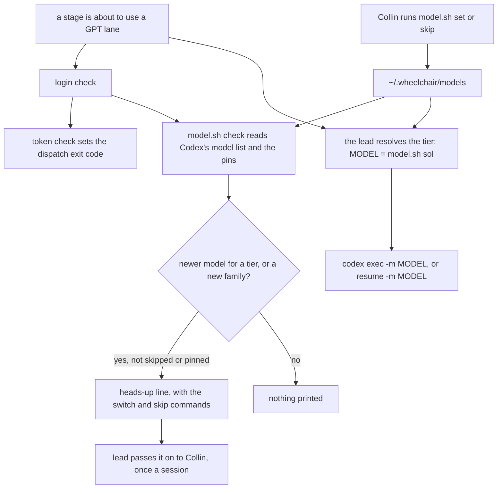

# Switch GPT models without editing wheelchair

**Idea:** `IDEA.md` — what this is for and why, in plain language. Read it first; it is
the north star this plan serves. Goal and Constraints live there, not here, so they don't
get buried as this file grows.

## Open Questions

Ordered by leverage; discussed one at a time. A settled question moves to the Decision
Log and is deleted from here.

None.

## Watch List

| # | Noticed | What needs looking into | Raised to user? | Outcome |
|---|---------|-------------------------|-----------------|---------|
| W1 | 2026-09-29 | Whether `models_cache.json` exists on a machine where Codex has never run, and how the heads-up behaves then (MAP.md, "Not checked") | no | Settled by the agent: a missing or unreadable cache prints nothing (D3), so it needn't exist. Noted in the Log |

## Decision Log

Append-only. A reversal is a new entry superseding the old, never an edit.

| # | Decision | Rationale | Source |
|---|----------|-----------|--------|
| D1 | The installer creates the pins with today's four models (Luna `gpt-6-luna`, Terra `gpt-5.6-terra`, Sol `gpt-6.1-sol`, Astra `gpt-6-astra`) and never overwrites a pin that already exists | A reinstall must not undo a switch Collin made | defaulted |
| D2 | When the pins are missing or a tier is absent, the reader falls back to those same four defaults, which ship in the repo | IDEA.md: an unpinned machine keeps working as it does today. A changed default reaches only new machines, so it is rare and still a PR | defaulted |
| D3 | The heads-up is printed by the login check (`codex/preflight.sh`), after its token check. It never changes the exit code, and any error reading Codex's model list prints nothing | IDEA.md constraint: the exit codes are the dispatch rule. A heads-up must never block a run | defaulted |
| D4 | "Newer" means the same tier name, visible in Codex's list, with a higher version number compared numerically part by part (`6.1` beats `6`, `6.10` beats `6.9`) | MAP.md, "Problems found": a string comparison gets this wrong | defaulted |
| D5 | The rule documents name tiers only. Every GPT invocation in `protocol/lanes.md` uses the reader for its model. The Lanes line in a review round and `verified-by` in COMPLETION.md record the model that actually ran | Those records are history, so they need the real model, not the tier | defaulted |
| D6 | Reasoning effort stays a flag on each lane, as today, not part of the pin | Effort is chosen per lane (`xhigh` is an escalation rung), not per model | defaulted |
| D7 | Claude lanes are unchanged | IDEA.md, Not doing | user |
| D8 | The pins live in one file, `~/.wheelchair/models`, one `tier = model` line per tier. One reader, `codex/model.sh <tier>`, prints the model, and every GPT lane, fresh or resumed, takes `-m "$(codex/model.sh <tier>)"` | One way of reading for both calls can't drift, and wheelchair's entries stay out of Codex's own config directory | user |
| D9 | The heads-up also mentions a model whose tier wheelchair doesn't know: visible in Codex's list, named `gpt-<version>-<word>` where the word is lowercase letters and isn't luna, terra, sol or astra. The line says it matches no tier and gives the command to pin it to one | The only way a new family reaches Collin. Internal and tierless models (`codex-auto-review`, `gpt-5.5`, hidden ones) fail the pattern or visibility and stay out | user |
| D10 | A skip command, `codex/model.sh skip <model>`, records the model in `~/.wheelchair/models`, and the heads-up never mentions it again. A newer model than a skipped one is still mentioned | Otherwise a model deliberately passed over nags every session | user |
| D11 | Collin never reads the login check's output directly: the lead does. So the lead passes each heads-up line on to Collin in its own turn, the first time it sees that line in a session, and never repeats it that session | The login check can run more than once a session (before the first dispatch and before each fan-out), and IDEA.md rules out nagging | defaulted |
| D12 | A resumed lane takes `-m "$(codex/model.sh <tier>)"` for the tier it was dispatched at, recorded next to its session id. If the pin changed since, the resume uses the new model for the same tier | IDEA.md: a switch reaches follow-ups to a running lane. The tier doesn't change, so lanes.md's rule against changing tier on a resume still holds | defaulted |
| D13 | The installer's existing grant for the wording script (`seen/set.sh`) also covers `codex/model.sh`, in Claude Code's allow list. The `~/.wheelchair` write grant it already gives covers the file | Otherwise Claude Code would ask Collin to approve a model lookup mid-run, which he has said he can't judge | defaulted |
| D14 | A model pinned to any tier is never mentioned by the heads-up, as a newer model or as matching no tier | Round 1: pinning a new-family model as the line suggested would otherwise re-mention it every session | review-round-1 |
| D15 | A malformed pins file produces a stdout heads-up line, which the lead relays, and `check` then compares against the defaults | Round 1: stderr is dropped by the preflight, so lanes could silently run the defaults | review-round-1 |
| D16 | The preflight captures the token check's exit code with `rc=0; … \|\| rc=$?` under `set -e` | Round 1: a plain call exits the script on 1 or 2 before the heads-up | review-round-1 |
| D17 | lanes.md's prose names no model generation beyond the labelled 5.6 measurements, and the validation grep is case-insensitive | Round 1: "GPT-6" in prose would go stale on the next generation, the thing IDEA.md rules out | review-round-1 |
| D18 | The lead resolves the model into a variable before each dispatch or resume, and records that value. A resume on a different model appends it to the Lane record | Round 1: resolving again at record time could name a model that didn't run | review-round-1 |
| D19 | Supersedes D13. No allow-list grant for `model.sh`, and `seen/set.sh` is unchanged | Round 1: Claude Code judges the whole `codex exec` command, which has no allow rule, so the grant saves no prompt | review-round-1 |
| D20 | Rule-document examples use placeholders (`<Tier> (<model>)`, `lane: <model>`), never real ids. The Terra "stays on 5.6" sentence and the old resume sentence are rewritten. The malformed-pins line names the path actually read and prints even when the cache is missing. A hand-set pin gets "is available for" wording. `implementation.md` is listed in What gets built | Round 2: examples with real ids would fail the Spec's own validation grep, and four smaller wording gaps | review-round-2 |
| D21 | A tier's family word follows its pin, so a new family pinned to a tier gets its later models offered for that tier. An unparseable pin considers only the single newest model of its family. The lanes.md lead-in sentence is replaced. The resume record's placeholders are distinct, and each further resume appends. The hand-set-pin line names the actual tier and keeps the switch and skip commands | Round 3 minors, fixed because they're cheap: nagging through skips on a hand-set pin, the wrong framing after a family is pinned, a stale lead-in, an ambiguous record, and a hard-coded tier | review-round-3 |

## Spec

The settled design. Bar: a fresh agent with no conversation history can implement from this
section alone. IDEA.md is the intent, and MAP.md is how things work today.



In words: before a GPT lane, the login check runs its token check, which alone sets the exit
code, and then `model.sh check`. That compares Codex's model list with the pins and prints a
heads-up for a newer model or a new family, unless it's skipped or already pinned. The lead
passes each line on to Collin once a session. Every lane gets its model from `model.sh <tier>`,
fresh or resumed. Collin's `set` and `skip` commands are the only things that change the pins.

### What gets built

1. `codex/model.sh`, new: the only reader and writer of the pins (D8, D10).
2. `codex/preflight.sh`: runs the heads-up after its token check (D3).
3. `install.sh`: creates the pins file when Codex is present and the file is absent (D1).
   `seen/set.sh` is not changed (D19, superseding D13).
4. `protocol/lanes.md`, `protocol/plan-review.md`, `protocol/verification.md`,
   `protocol/implementation.md`: tiers instead of
   model ids, and the reader in every GPT invocation (D5, D12). A heads-up relay rule (D11).
5. `codex/test/run.sh`, new: a fixture suite for `model.sh` and the preflight's heads-up.
6. Routers and README. The root `AGENTS.md` `codex/` row names `preflight.sh`, `model.sh` and
   `test/`, and its Verification block and `CONTRIBUTING.md`'s validation commands gain
   `bash codex/test/run.sh`. The README Install section says the installer creates the pins and
   how to switch.

### The pins file — `~/.wheelchair/models`

```
# wheelchair's GPT model pins. Change them with codex/model.sh.
luna = gpt-6-luna
terra = gpt-5.6-terra
sol = gpt-6.1-sol
astra = gpt-6-astra
skip = gpt-6.2-astra
```

- Well-formed means every line is blank, a `#` comment, or `key = value`. `key` is one of
  `luna`, `terra`, `sol`, `astra` or `skip`, and `value` matches `^[a-z0-9][a-z0-9._-]*$`. Each
  tier appears at most once, and `skip` any number of times. Spaces around `=` are optional.
- The shipped defaults (D1, D2) live in one place, a table at the top of `codex/model.sh`. They
  are the four above, without the skip line.
- The path is overridable for tests with `WHEELCHAIR_MODELS`, the same convention as
  `WHEELCHAIR_WORDING` (`protocol/seen.md`, "Test seams").

### `codex/model.sh`

Bash wrapping Python 3, like `seen/wording.sh`. Every write takes `flock` on
`~/.wheelchair/.lock`, the same lock the wording script uses, and replaces the file by
temp-file-and-rename.

| Command | Does | Exit |
|---|---|---|
| `model.sh <tier>` | Prints the pinned model for `luna`, `terra`, `sol` or `astra` on stdout. A missing file, or a tier missing from it, prints the default. A malformed file prints the default for that tier and one warning line on stderr | 0; 2 for an unknown tier |
| `model.sh set <tier> <model>` | Pins `<model>` for `<tier>`. It creates the file from the defaults if absent, and removes any `skip` line for that model | 0; 1 on a malformed file (unchanged); 2 on bad arguments |
| `model.sh skip <model>` | Adds a `skip` line unless one exists for that model | 0; 1 on a malformed file (unchanged); 2 on bad arguments |
| `model.sh init` | Creates the file from the defaults if absent, and does nothing if it exists. The installer's step | 0; 1 on a write failure |
| `model.sh check` | Prints the heads-up lines (below), or nothing | always 0 |

### The heads-up — `model.sh check`

It reads Codex's model list from `$CODEX_HOME/models_cache.json` (default
`~/.codex/models_cache.json`), overridable for tests with `WHEELCHAIR_MODELS_CACHE`. A missing,
unreadable or unexpected cache prints no model lines (D3). The malformed-pins line below
still prints, since it doesn't depend on the cache (D20). It considers only entries with
`visibility` `list`.

- **Parsing a model id.** `^gpt-(\d+(?:\.\d+)*)-([a-z]+)$` gives a version and a word. Versions
  compare numerically, part by part, and a missing part counts as 0, so `6` equals `6.0`,
  `6.1` beats `6`, and `6.10` beats `6.9` (D4).
- **A tier's family word (D21).** A tier's family word is the word of its pinned model when
  the pin parses, and the tier's own name otherwise. So pinning `gpt-7-nova` to Sol makes
  `nova` Sol's family, and a later `gpt-7.1-nova` is offered as newer for Sol.
- **A newer model for a tier.** For each tier, take the visible models whose word is that
  tier's family word. Drop any skipped model and any model currently pinned to any tier (D14).
  - With a parseable pin, also drop any not newer than the pin. If any remain, print one line
    for the newest:
    `heads-up: gpt-6.2-sol is newer than Sol's gpt-6.1-sol. Switch: <root>/codex/model.sh set sol gpt-6.2-sol (or <root>/codex/model.sh skip gpt-6.2-sol)`
  - With a pin that doesn't parse (a hand-set id), consider only the single newest visible
    model of that family, and print it only if it isn't skipped. Skipping it therefore quiets
    the line until a still-newer model appears (D21):
    `heads-up: <model> is available for <Tier>, which is pinned to <pin>. Switch: <root>/codex/model.sh set <tier> <model> (or <root>/codex/model.sh skip <model>)`
    Here `<Tier>` and `<tier>` are the tier the line is about.
- **A model that matches no tier (D9).** A visible model that parses, whose word isn't any
  tier's family word (D21), isn't skipped, and isn't pinned to any tier (D14):
  `heads-up: gpt-7-nova is available and matches no tier. Pin it: <root>/codex/model.sh set <tier> gpt-7-nova (or <root>/codex/model.sh skip gpt-7-nova)`
  At most three of these lines, newest first, then `heads-up: and N more that match no tier`.
- `<root>` is the absolute path of the checkout `model.sh` runs from.
- Lines come in tier order (luna, terra, sol, astra), then the no-tier lines.
- **A malformed pins file (D15).** `check` prints one line first,
  `heads-up: <pins path> is malformed, so every GPT lane is using the shipped defaults. Fix or delete it`,
  where `<pins path>` is the file actually read (so `WHEELCHAIR_MODELS` shows in tests) (D20),
  then compares the cache against the defaults. This line goes to stdout like the rest, so the
  lead relays it (D11). `model.sh <tier>` keeps its stderr warning.

### The login check — `codex/preflight.sh`

Replace the final `exec python3` with a plain call that keeps the lock held, and capture its
exit code without letting `set -e` end the script: `rc=0; python3 … || rc=$?` (D16). The
current script runs under `set -euo pipefail` (`codex/preflight.sh:24`), so an unguarded call
that exits 1 or 2 would stop before the heads-up. Then run `"$(dirname "$0")/model.sh" check`. Any failure of that is ignored, and its
stderr is dropped. Then exit with the saved code. The heads-up runs whatever the token check
returned, including exit 2. The exit codes and their meanings are unchanged (D3).

### The rules

- `protocol/lanes.md`, tier list: each tier is described by what it is for, as today, with no
  model id. The lead-in sentence at `protocol/lanes.md:59-60` ("The tiers keep their names
  across model generations. Luna, Terra, Sol and Astra below mean the models named here:") is
  replaced by one sentence saying the model for a tier comes from `codex/model.sh <tier>`, that
  the pins live in `~/.wheelchair/models`, and that the shipped defaults are in `codex/model.sh`
  (D21). The
  5.6 measurements quoted there stay, still labelled with the model they were measured on, and
  the prose around them names no later generation: "hasn't been re-measured for GPT-6" becomes
  "hasn't been re-measured on any later model", and so on (D17). The Terra entry's sentence
  about staying on 5.6 because GPT-6 has no Terra goes too. Which model fills a tier is the
  pins' business, not the rules' (D20).
- `protocol/lanes.md`, invocations: the lead resolves the model into a variable first,
  `MODEL=$(<wheelchair-root>/codex/model.sh sol)`, then passes `-m "$MODEL"`. The same applies
  on a resume, for the tier its lane was dispatched at (D12). That variable is what gets
  recorded, so the record always names the model that actually ran (D18). The existing
  sentence "`-m` repeats the model the lane already ran" (`protocol/lanes.md:119`) is replaced
  by "a resume passes `-m` for the tier the lane was dispatched at, resolved again", and the
  rest of that paragraph, about not changing tier on a resume, stays (D20).
- `protocol/lanes.md`, preflight: after the dispatch rule, the lead passes each `heads-up:` line
  on to Collin in its own turn, the first time it appears in the session, and not again that
  session (D11). A heads-up never changes the dispatch rule.
- `protocol/implementation.md`: the Lane column records the tier and the resolved model
  as `<Tier> (<model>)`, so a resume knows the tier (D12). A resume that resolves a
  different model appends it: `<Tier> (<first model>, resumed on <second model>)`, and each
  further resume on yet another model appends `, resumed on <model>` again (D18, D21). Every example in the
  rule documents uses these placeholders, never a real model id (D20).
- `protocol/plan-review.md` and `protocol/verification.md`: the reviewer and verifier are
  named by tier (Sol). The `**Lanes:**` line and `verified-by` record the resolved model that
  ran (D5). Their examples change to placeholders: `**Lanes:** GPT / Sol (<model>); …` at
  `protocol/plan-review.md:35`, and `lane: <model>` at `protocol/verification.md:62` (D20).

### Non-goals

As IDEA.md: Claude lanes, automatic switching, deciding where a new family belongs, and
changes to what tiers are for or how escalation works.

### Edge cases

- The cache lists a model newer than the pin, and Collin has already skipped an even newer
  one. The newest non-skipped model is mentioned.
- Collin pins a model that isn't in the cache, or pins one by hand. `model.sh <tier>` prints it
  as given, and the heads-up uses the parsing rule above.
- The pins file has one tier missing. That tier reads the default, and `check` compares
  against the default.
- A machine with Codex present but `~/.wheelchair` missing: `init` creates the directory.
- Two `set` calls at once: the lock serialises them.

### Validation

```bash
bash codex/test/run.sh      # new: model.sh commands, parsing, check lines, malformed-file behaviour, preflight exit codes unchanged with a heads-up
bash install/test/run.sh    # init creates the file once and never overwrites it
bash spine/test/run.sh && bash sensitivity/test/run.sh
grep -rniE "gpt-[0-9]" protocol/   # case-insensitive: only the labelled 5.6 measurements in lanes.md remain
```

`codex/test/run.sh` builds fixture caches and pins files under a temp directory through the two
seams. It covers every row of the command table, every heads-up line form (including a pinned
no-tier model staying quiet and the malformed-pins line), the numeric
comparison cases above, a missing, malformed and hidden-only cache, and preflight run against a
stub token file for each exit code with a heads-up present. The exit code must be unchanged
and the heads-up must print for all three codes.

## Accepted Risks

| Risk | Why accepted | Round |
|------|--------------|-------|

## Review Rounds

### Round 1 — 2026-09-29

**Lanes:** GPT / Sol (gpt-6.1-sol, mechanics lens); Claude / default reviewer model (intent lens); cross-family: yes.

**Changed since Round N-1:** n/a (first round — whole Spec in scope)

| Lane | Reported | Finding | Lead verdict | Resolution |
|------|----------|---------|--------------|------------|
| GPT | blocking | An unguarded plain call exits under `set -e` before the heads-up on exit 1 or 2 | upheld | D16. Checked `codex/preflight.sh:24` |
| Claude, GPT | blocking / minor | A pinned no-tier model is re-mentioned every session | upheld (blocking) | D14 |
| Claude | minor | `check` with malformed pins is undefined, and the fallback warning never reaches Collin | upheld | D15 |
| Claude | minor | lanes.md prose still says "GPT-6", and the grep is case-sensitive | upheld | D17 |
| Claude | minor | D13's grant saves no prompt, since the whole `codex exec` command is judged | upheld | D19 supersedes D13 |
| Claude, GPT | minor | The recorded model can differ from the one that ran after a mid-run switch | upheld | D18 |
| Claude | minor | plan-review.md and verification.md don't mention the preflight | declined | Both send the lead to `lanes.md` before launching (`protocol/plan-review.md:52`, `protocol/verification.md:30`), and lanes.md requires the preflight before the first GPT dispatch. A second statement would be the duplicate gate `protocol/AGENTS.md` warns against |

### Round 2 — 2026-09-29

**Lanes:** GPT / Sol (gpt-6.1-sol, mechanics lens); Claude / default reviewer model (intent lens); cross-family: yes.

**Changed since Round 1:** D14 (pinned models are never mentioned), D15 (malformed-pins line),
D16 (preflight exit-code capture), D17 (no generation names in lanes.md prose, and a
case-insensitive grep), D18 (the model is resolved into a variable and recorded, and a resume
appends the new model), D19 (no allow-list grant, superseding D13). What gets built, and
Validation, adjusted to match.

| Lane | Reported | Finding | Lead verdict | Resolution |
|------|----------|---------|--------------|------------|
| Claude, GPT | major / minor | Real model ids in the D18 examples fail the Spec's own grep, and the plan-review and verification examples have no stated replacement | upheld (major) | D20: placeholders |
| Claude | minor | The Terra "stays on 5.6" sentence escapes the grep and names a pin | upheld | D20 |
| Claude | minor | The old resume sentence contradicts D12 | upheld | D20: replaced |
| Claude | minor | The malformed-pins line hard-codes the path | upheld | D20 |
| Claude | minor | "Is newer than" is wrong for an unparseable pin | upheld | D20 |
| GPT | minor | The malformed-pins line against a missing cache is ambiguous | upheld | D20: it always prints |
| GPT | minor | What gets built omits implementation.md | upheld | Added |

### Round 3 — 2026-09-29

**Lanes:** GPT / Sol (gpt-6.1-sol, mechanics lens); Claude / default reviewer model (intent lens); cross-family: yes.

**Changed since Round 2:** D20. Placeholder examples in the rule documents, the Terra sentence
and the old resume sentence rewritten, the malformed-pins line wording and when it prints, the
wording for a hand-set pin, and implementation.md added to What gets built. This is round 3 of 3.

| Lane | Reported | Finding | Lead verdict | Resolution |
|------|----------|---------|--------------|------------|
| Claude | minor | An unparseable pin lets each skip bring up an older model | upheld | D21: only the single newest is considered |
| Claude | minor | A new family pinned to a tier gets its later models reported as matching no tier | upheld | D21: the family word follows the pin |
| Claude | minor | The lanes.md lead-in sentence has no replacement | upheld | D21 |
| Claude | minor | The resume record's placeholders are ambiguous | upheld | D21 |
| GPT | minor | The hand-set-pin line hard-codes Sol and drops the commands | upheld | D21 |

## Prior Work

| Spec item | State | Evidence (file:line) | Confidence |
|-----------|-------|----------------------|------------|

## Implementation Tasks

| # | Objective | Ownership boundary | Lane | Session id | Validation | Status |
|---|-----------|--------------------|------|-----------|------------|--------|
| T1 | The code: `codex/model.sh` (pins file, reader, set, skip, init, check with the heads-up rules), the preflight change, the installer's `init` step, and the fixture suite (Spec: pins file, model.sh, heads-up, login check, What gets built 1–3 and 5) | `codex/model.sh`, `codex/test/run.sh`, `codex/preflight.sh`, `install.sh`, `install/test/run.sh` | Terra (gpt-5.6-terra), worktree `mp-t1` | `01a0ef62-0735-7ee3-a93e-88e418fac54e` | `bash codex/test/run.sh && bash install/test/run.sh && bash seen/test/run.sh` | done — lead re-ran all four suites (43, 72, 18, 80 passed) and read the code; merged |
| T2 | The prose: tiers, not model ids, in the rule documents, with the reader in every GPT invocation, the heads-up relay rule, resume and record rules, placeholders; routers, README and CONTRIBUTING (Spec: The rules, What gets built 4 and 6) | `protocol/lanes.md`, `protocol/implementation.md`, `protocol/plan-review.md`, `protocol/verification.md`, `AGENTS.md`, `CONTRIBUTING.md`, `README.md` | Claude / sonnet, worktree `mp-t2` | | `grep -rniE "gpt-[0-9]" protocol/` shows only the labelled 5.6 measurements | done — lead re-ran the grep and read the diff; merged |

## Log

- 2026-09-29 — MAP.md written, then extended with Claude lanes. Collin chose GPT only.
  IDEA.md confirmed.
- 2026-09-29 — Q1 settled (D8, one wheelchair file and a reader).
- 2026-09-29 — Q2 settled (D9, a model matching no tier is mentioned).
- 2026-09-29 — Q3 settled (D10, skip command). W1 settled by D3. D11–D13 defaulted in the final
  Spec pass. No rejected graph entries. Status `ready-for-review`.
- 2026-09-29 — Plan review round 1 triaged: 2 blocking and 4 minor upheld and fixed (D14–D19),
  1 declined. Round 2 next. A first attempt at round 2 was launched before these fixes saved, then
  stopped and discarded.
- 2026-09-29 — Plan review round 2 triaged: one major (examples vs the grep) and six minor, all
  upheld and fixed in D20. Round 3 next.
- 2026-09-29 — Plan review round 3 triaged: clean (all minor, all fixed in D21). Spec diagram
  drawn. Status `approved`.
- 2026-09-29 — Stage 3 started. Nothing needed from Collin: every validation command is on
  PATH, the GPT preflight exit is 0, and the Claude lane runs from Claude Code. No earlier run
  picture existed to move aside.
- 2026-09-29 — Choice: T2 — lane rules — the heads-up paragraph states it prints whatever exit code the token check gave
- 2026-09-29 — Choice: T2 — lane rules — dropped the tier-specific clause from the resume sentence, since the new wording covers it
- 2026-09-29 — Choice: T2 — lane rules — reworded "GPT-6 or the other tiers" to "a later model or the other tiers"
- 2026-09-29 — Choice: T2 — stage rules — a Claude lane's Lane entry needs no model, since its aliases move on their own
- 2026-09-29 — Choice: T2 — stage rules — expanded plan-review.md's lead-in sentence so it matches the new Lanes example
- 2026-09-29 — Choice: T2 — routers and README — put the pins mention as a bullet in the README's existing outside-the-repo list
- 2026-09-29 — Choice: T1 — switch a tier, or skip a model — set and skip rewrite the pins file in a fixed order, dropping any hand-added comments
- 2026-09-29 — Choice: T1 — switch a tier, or skip a model — skip on a missing pins file first creates it from the defaults
- 2026-09-29 — Choice: T1 — fixture tests — the login-check exit 1 and 2 cases use a copied script pointed at a local stub, never the real token endpoint
- 2026-09-29 — T1 and T2 merged. No struck choices on the run picture. Validation green except
  the pre-existing lifecycle test. COMPLETION.md written. Status `verifying`. End-of-run choices:
  the nine `Choice:` lines above. A strike made on the picture from now on isn't picked up
  automatically.
- 2026-09-29 — Verification round 1: FAIL from both, 2 gaps. REMEDIATION-1.md written.
- 2026-09-29 — Remediation 1 done: R1 (Luna) and R2 (sonnet) merged. Suites green. Round 2 next.
