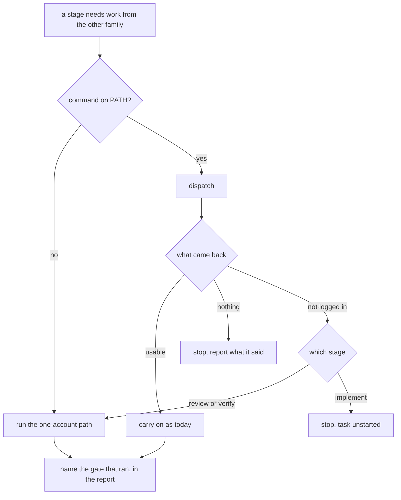

# Completion Report — It runs on whichever one of the two accounts you have

Written for a hostile reviewer: every claim checkable, no claim without evidence.



## Spec coverage

| Spec item | Origin | Implemented at (file:line) | Validated by |
|-----------|--------|----------------------------|--------------|
| §1 presence is the command on `PATH`, never a home directory | this run | `sensitivity/set.sh:16-25`, `install.sh:24-31` | `sensitivity/test/run.sh` 62/0; `install/test/run.sh` 12/0 |
| §1 `WHEELCHAIR_PRESENT` seam, `${VAR+x}` not `${VAR:-}` | this run | `sensitivity/set.sh:16`, `install.sh:24` | both suites; both-absent fixture only works under `+x` |
| §1 `WHEELCHAIR_*_HOME` say *where*, never *whether* | pre-existing (`set.sh`), this run (`install.sh`) | `sensitivity/set.sh:10-13`, `install.sh:20-22` | `install/test/run.sh` asserts an absent harness's home is not created |
| §2 ownership table: which file owns which rule | this run | `protocol/lanes.md:12`, `:125`; stage rules in the three stage docs | read-back; no rule stated twice |
| §3 lane-death detection and report belong to `lanes.md` | this run | `protocol/lanes.md:125-137` | read-back; boundary sentence forbids stage rules there |
| §3 announced authentication failure is the exception | this run | `protocol/lanes.md:133-137` | the three quoted strings verified present in `/usr/bin/codex` |
| §3 Stage 3 stops with the task **unstarted**, no reroute | this run | `protocol/implementation.md:65-68` | read-back |
| §4 one-account lens split; scheduling per family | this run | `protocol/plan-review.md:75-80` | read-back |
| §4 per-round `**Lanes:**` line; dead-lane cap exemption | this run | `protocol/plan-review.md:20-23`, `:133` | read-back |
| §4 verifier selection; Opus named only in `verification.md` | this run | `protocol/verification.md:23` | `grep Opus protocol/lanes.md` shows only the pre-existing escalation sentence |
| §5 credential conditional, dispatch and `resume` | this run | `protocol/lanes.md:32-38`, `:90-96` | read-back; both sites build the command array identically |
| §5 corrected `config.toml` reason; flag on every lane | this run | `protocol/lanes.md:69-76` | slot's `config.toml` read directly: project trust levels, no `model_reasoning_effort` |
| §5 never-concurrent restated on the credential | this run | `protocol/lanes.md:198-200` | `grep 'against one slot'` empty |
| §5 `lanes.md:93` interface rule becomes a pointer | this run | `protocol/lanes.md:117-118` | `grep 'never to a GPT lane' protocol/lanes.md` empty |
| §6 concurrency untouched beyond the two named edits | this run | `protocol/implementation.md:77-79` | one deferring clause; standing permission neither widened nor withdrawn |
| §7 `install.sh` renders per present harness; neither → non-zero, nothing written | this run | `install.sh:28-40` | exercised directly: exit 1, zero files created |
| §7 `WHEELCHAIR_SKIP_DEPS` | this run | `install.sh:67` | `install/test/run.sh` |
| §7 `set.sh` writes present homes only; all-or-nothing preserved | this run | `sensitivity/set.sh` | exercised directly: claude-only writes one file, codex file untouched |
| §7 one-harness level resolution; `--report` third outcome | this run | `sensitivity/set.sh` | exercised directly: `--report` names the absent harness |
| §8 `sensitivity/test/run.sh` all four combinations; existing cases pinned | this run | `sensitivity/test/run.sh` | 62/0, up from 47 before this run |
| §8 `install/test/run.sh` new | this run | `install/test/run.sh` | 12/0; added to `AGENTS.md:94` |
| §9 gate attribution, both stages, every run | this run | `protocol/plan-review.md:20-23`, `protocol/verification.md` | read-back; Stage 2 compares its two reviewers, Stage 4 compares verifier to implementer |
| §9 `verified-by` shape in the template | this run | `protocol/templates/COMPLETION.md:5`, `:12-25` | starts `[]`; shape shown as placeholder, not populated |
| §10 README opening; six stale spots; dependency list | this run | `README.md:3-7`, `:67-82`, `:119-121`, `:143`, `:221-223` | `grep 'cross-model\|GPT + Claude' README.md` empty |
| §10 new section on what one account costs | this run | `README.md:207-217` | read-back |
| §10 `protocol/sensitivity.md` six places incl. the in-marker line | this run | `protocol/sensitivity.md:10`, `:26-28`, `:57-58`, `:66-80`, `:86-92`, `:99-101` | installed copy diffed against source: identical but the substituted level line |
| §10 four routers, three skill descriptions, `adopt.md` | this run | `AGENTS.md`, `protocol/AGENTS.md`, `skills/AGENTS.md`, `sensitivity/AGENTS.md`, three `SKILL.md`, `protocol/adopt.md` | corrected descriptions observed live after reinstall |
| §10 two shell header comments | this run | `install.sh:1-14`, `sensitivity/set.sh:2` | read-back |

## Deviations from plan

**One, and it is an addition rather than a departure.** The README lane found two false claims
the Spec's §10 table did not list — `README.md:96-97` and `:104-111`, both in the install prose,
both the same "writes into both harnesses" claim two paragraphs above one the table *did* flag.
It corrected them under §10's stated rule. The Spec is explicit that its table is a starting point
and not a claim of completeness, so this is the mechanism working, not a deviation from it.

Nothing else departs from the Spec.

## Routers

`AGENTS.md`, `protocol/AGENTS.md`, `skills/AGENTS.md` and `sensitivity/AGENTS.md` were all
updated — each described the installer or the dial writer as touching both harness homes
unconditionally. `AGENTS.md:94` additionally gained `bash install/test/run.sh` in its Verification
section, because that suite is new.

No ownership moved between directories. One rule changed homes *within* `protocol/`: the
interface-placement rule now lives in `implementation.md` and `lanes.md:117-118` points at it,
which both files state.

## Validation evidence

```text
$ bash spine/test/run.sh
RESULT 80 passed, 0 failed

$ bash sensitivity/test/run.sh
RESULT 62 passed, 0 failed

$ bash install/test/run.sh
RESULT 12 passed, 0 failed

$ ./install.sh >/dev/null && ./install.sh >/dev/null && git status --porcelain
(exit 0 both runs; porcelain empty)

$ node --test 'viewer/test/*.test.js'
ℹ pass 29
ℹ fail 0

$ npm --prefix viewer run test:browser
25 passed (20.7s)
```

Behaviours exercised directly by the lead, not only through the suites:

```text
$ WHEELCHAIR_PRESENT= ... bash sensitivity/set.sh
diagram-sensitivity: neither claude nor codex is on this machine; nothing written
exit=0, files created: 0

$ WHEELCHAIR_PRESENT=claude ... bash sensitivity/set.sh --report
diagram-sensitivity: codex is not on this machine
diagram-sensitivity: high

$ WHEELCHAIR_PRESENT= ... bash install.sh
install.sh: neither claude nor codex is on PATH; installed nothing
exit=1, files created: 0

$ WHEELCHAIR_PRESENT=codex ... bash install.sh
claude home exists: no; codex prompts: 8; unsubstituted placeholders: 0

$ both present, levels disagreeing
set.sh: diagram-sensitivity levels disagree ... exit=1

$ claude only, same disagreeing files
set ask in <tmp>/c/CLAUDE.md; codex file still high, untouched
```

## Known gaps / residual risks

**The blocking validation has not run, and cannot run here.** Decision #18 requires one
`codex exec -m gpt-5.6-sol` lane to complete on a machine with no balancer slot and `CODEX_HOME`
unset, with its output pasted as evidence. Attempting it on this machine would refresh `~/.codex`
and rotate the single-use token away from the balancer's slot, bricking it
(`protocol/lanes.md:148-151` before this change; the rewritten Credentials section after it).

**This is recorded as outstanding, not claimed and not omitted**, per Spec §11. Stage 4 should
treat it as a gap: the change is not verified until somebody with a ChatGPT login and no balancer
has run it. A Claude-only machine cannot close it. A container with a fresh `codex login` counts.

**Untested by construction:** every one-account code path was exercised through
`WHEELCHAIR_PRESENT`, which is a seam, not a machine with one account. The seam is exercised;
the real configuration is not. That is what the outstanding item above buys.

**Not attempted:** the disagreement between `protocol/lanes.md:198-200` and
`protocol/implementation.md:77-79` about whether concurrent GPT lanes are safe. Spec §6 puts it
out of scope and it remains unresolved; `implementation.md` gained one deferring clause and
nothing more.

## Remediation rounds

None yet.
