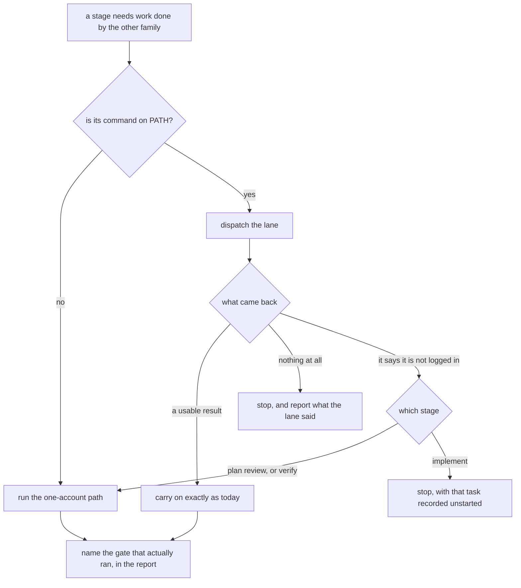

# Make this workflow run on somebody else's machine, with whichever one account they have

**Idea:** `IDEA.md` — what this is for and why, in plain language. Read it first; it is
the north star this plan serves. Goal and Constraints live there, not here.

## Open Questions

None. Every question is settled; see the Decision Log.

## Watch List

| # | Noticed | What needs looking into | Raised to user? | Outcome |
|---|---------|-------------------------|-----------------|---------|
| 1 | mapping | `protocol/lanes.md:52-59` says every lane must pass `-c model_reasoning_effort=high`; `protocol/implementation.md:66-69` says it needs no flag. Both in the tree now. | yes | settled — Decision Log #8 |
| 2 | mapping | Three skill descriptions promise cross-family behaviour or name specific models (`skills/plan-review/SKILL.md:3`, `skills/verify/SKILL.md:3`, `skills/implement/SKILL.md:3`). A description is what a harness reads to decide whether to fire a skill, so it is not inert — but `skills/AGENTS.md:5` says a wrapper carries no content. Need a line on which side of that rule a description sits. | yes | settled — Decision Log #16 |
| 3 | mapping | `sensitivity/test/run.sh` asserts the writer's both-files-or-neither behaviour. Reducing the target set to present harnesses changes what those assertions should say. | no | settled in Spec — assertions restated over the reduced target set, plus a case per present/absent combination |
| 4 | mapping | Never verified that `codex exec` works with `CODEX_HOME` unset against an ordinary `codex login`. The whole no-balancer path assumes it does. | yes | settled — Decision Log #18: blocking validation, and must not be attempted on a machine with the balancer |
| 5 | mapping | `README.md:205-207` lists both CLIs as dependencies with no note that either is optional. | yes | settled — Decision Log #15 |

## Decision Log

| # | Decision | Rationale | Source |
|---|----------|-----------|--------|
| 1 | The credential-portability fix is in scope alongside the one-account work | It blocks somebody with *both* accounts, so it is the flat blocker; it lives in the same file as the lane selection it would otherwise be split from | user |
| 2 | Which families are available is decided in `protocol/lanes.md`, in one new section | Every stage that farms work out already reads that file before launching anything, and it is the only place the invocations live. One edit point, no stage learns it separately | defaulted |
| 3 | Nothing is declared by hand — no settings file, no flag, no "tell it which accounts you have" | IDEA.md non-goal | user |
| 4 | Single-account checking of finished work: a fresh agent, same family, one tier above whoever built it. Where the builder was already at the top tier, a fresh agent at that same tier | The stage's larger half is that the checker never saw the conversation that produced the work, and that survives intact. The tier step reuses the escalation ladder already defined at `protocol/lanes.md:105-119` | user |
| 5 | Single-account plan review: still two attackers, both the same family, split by lens — one at the spec's mechanics, one at whether it still serves the idea | The stage already slants one lane toward intent (`protocol/plan-review.md:71-73`); single-account makes that slant what separates the lanes instead of the family | user |
| 6 | The three-round cap and the zero-blocking-zero-major exit bar are unchanged | Nothing about having one account justifies moving the gate; a different cap would be an untested guess | defaulted |
| 7 | The credential balancer is used when its slot directory is present and skipped when it is not | It is one machine's setup. Gating on the directory keeps today's behaviour there and takes the assumption out of everywhere else | user |
| 8 | `-c model_reasoning_effort=high` is passed on every lane unconditionally; `protocol/implementation.md`'s claim that no flag is needed is deleted | Passing it is correct on both paths and harmless on the one where the config file would have supplied it anyway. One rule beats two that disagree, and the reader stops needing to know which path they are on | defaulted |
| 9 | The installer and the sensitivity writer touch only the harnesses that are present. The writer keeps its all-or-nothing guarantee over the reduced set | IDEA.md requires nothing be written for an absent tool. The atomicity exists so the two files never disagree, and that reason is untouched by writing fewer of them | defaulted |
| 10 | A ChatGPT-only setup may send interface work to a GPT lane, with the cost stated at dispatch rather than the stage refusing | `protocol/lanes.md:93` forbids it today on quality grounds, which assumes an alternative exists. Refusing would make the tool unusable for that person; doing it silently breaks the idea's honesty requirement | defaulted |
| 11 | A one-account run still reaches `status: done`. Which gate it got is recorded in COMPLETION.md's frontmatter, not in a new status value | The status field is the state machine (`AGENTS.md:36-37`); a new value would make every stage's precondition check ambiguous to buy something a frontmatter line already buys | defaulted |
| 12 | With both accounts present, behaviour is byte-for-byte what it is today | IDEA.md non-goal | user |
| 13 | Availability is never checked up front. A lane is dispatched on the command being present; a lane that dies is what reveals the tool is unusable | The up-front check runs on every stage forever to catch a state that is rare and announces itself anyway, and the honest form of it is not cheap (`protocol/lanes.md:155-157`). The recovery path it avoids has to exist regardless | user |
| 14 | A lane that dies is retried once; dying the same way twice marks that family unavailable for the rest of the run, and the run says so and continues on the one-account path | Reuses the fails-twice shape the protocol already applies to implement briefs (`protocol/lanes.md:128-130`), and stops a transient failure from silently downgrading a run that had two accounts | defaulted |
| 15 | The README keeps `a different model family` as the headline and adds one clause naming the one-account form in the same sentence; the four later repetitions and the dependency list are corrected to match | The alternative wordings either pay the sentence's edge to fix what a clause fixes, or put the caveat where a top-only reader never goes | user |
| 16 | A skill's `description` is routing metadata, not content, and must stay accurate. Correcting one is not a breach of the wrappers-carry-nothing rule | A description is what a harness reads to decide whether to fire a skill at all. The rule exists so two harnesses cannot be given different *instructions*; a description gives none | defaulted |
| 17 | The one-account cost is stated where a check stage reports its verdict, as attribution rather than warning. The installer reports only which commands it installed, making no claim about accounts | Attribution is true when it is read and relevant when it is read, and does not become noise on repetition. An install-time claim about accounts can be confidently wrong, since decision #13 means nothing knows whether a present command is logged in | user |
| 18 | The change does not pass Stage 4 until one `codex exec` lane has run to completion on a machine with no balancer and `CODEX_HOME` unset, with its output pasted as evidence. It must not be attempted on a machine where the balancer is installed | If the assumption is wrong the failure is a quiet demotion to a weaker gate rather than an error, on the exact configuration this change exists to support. Probing it here is unsafe: refreshing `~/.codex` rotates the single-use token away from the balancer's slot (`protocol/lanes.md:148-151`) | user |
| 19 | Supersedes #12. With both accounts present, lane selection and gate strength are unchanged. The gate-attribution line and `verified-by` appear on **every** run, two-account included | Byte-for-byte was the wrong bar: recording that a gate *was* cross-family is worth as much as recording that it was not, and #12 as written told a worker to make the attribution one-account-only | review-round-1 |
| 20 | Supersedes the override carve-out. A harness is present when its command resolves on `PATH`; `WHEELCHAIR_*_HOME` says *where* a present harness's home is and never declares presence | Treating an override as presence made the required fixture cases unsatisfiable: absence could then only be expressed by unsetting the override, which falls back to the real `$HOME` files the suite is forbidden to touch (`sensitivity/test/run.sh:27-30`, `:269-270`). One definition also removes the `install.sh`/`set.sh` divergence | review-round-1 |
| 21 | GPT lanes are never run concurrently in any configuration. The Spec's earlier permission to parallelise them off the balancer is withdrawn | It was inverted. `protocol/lanes.md:152-154` sequences lanes because the balancer holds a refresh lock and a raw `codex exec` does not — so off the balancer there is no lock at all, against the same single-use token (`:135-138`). It granted concurrency on the racier configuration, and on the one never yet run | review-round-1 |
| 22 | Supersedes #4's tier rule. The one-account GPT verifier is always `gpt-5.6-sol` and the Claude verifier always Opus, whatever built the work; where `implemented-by` names several lanes, the implementing family decides | "One tier above the builder" resolved a Luna-built item to a Terra verifier, contradicting `protocol/lanes.md:49-50`, which reserves Sol for judgment lanes and names verification as one. It also had no answer for Fable or multi-lane values the template already permits | review-round-1 |
| 23 | `install.sh` gains the two home overrides and `WHEELCHAIR_SKIP_DEPS`, and a new `install/test/run.sh` covers it | The Spec asserted a validation with no seam to run it through: the installer writes to `~` directly with no override, and running it under a fake `HOME` re-runs the npm and Chromium steps into a cold cache. Either the seam exists or the validation was decoration | review-round-1 |
| 24 | Fixtures get an explicit test-only presence override; the production rule stays the command on `PATH` | The `PATH` route needs a hermetic symlink bin, because `set.sh` shells out to ~14 utilities living in `/usr/bin` beside `claude` and `codex`. A presence variable does not collide with the *home* overrides, which was #20's actual objection | review-round-2 |
| 25 | The Spec stops asserting a complete correction list. It states the rule — every place asserting the two-account form or unconditional both-homes behaviour — and gives the search that finds candidates, with the table as a starting point | Two hand-made lists, two rounds of misses. An inventory that claims completeness and is not is worse than one that says how to find the rest | review-round-2 |
| 26 | **Supersedes #21.** GPT lanes may run concurrently. The universal no-concurrency rule is withdrawn, and the concurrency question leaves this plan's scope entirely | Direct evidence, not inference: the codex binary (0.145.0) carries `client/src/oauth/refresh_lock.rs` and `client/src/oauth/store_lock.rs`, and `flock`. Codex serialises its own token refresh across processes. `protocol/lanes.md:152-154` generalised a failure history that belongs to Pi children sharing one `auth.json` — the thing the balancer was built for — onto a code path that handles it itself. #21 was built on that generalisation and inherited its error | review-round-2 |
| 27 | The pre-existing disagreement between `protocol/implementation.md:77-79` (parallel across worktrees) and `protocol/lanes.md:152-154` (never concurrent) resolves toward implementation.md. Correcting lanes.md is noted for a separate change, not made here | It is a real defect in the repo, but it is not what this plan is for, and it now needs an evidence-backed rewrite of the Credentials rationale rather than a one-line edit | review-round-2 |
| 28 | Q1 part one settled: the gate-attribution line and `verified-by` fire on **every** run, two-account included. `IDEA.md`'s non-goal is read as covering which gates a run gets, not what is recorded about them | Recording what checked a piece of work is a fact about the record, not a change in behaviour; a report that does not say what checked it is a hole at any account count | user |
| 29 | Q1 part two settled: the retry-and-mark-family-unavailable machinery is dropped entirely. A lane that returns no usable result ends its stage, which reports what the lane said | It inferred "this account is unusable" from "this lane died", and almost nothing that kills a lane is about credentials — a sleeping laptop would demote or halt a stage. The case it was built for announces itself in plain text (`no Codex credentials were found`, `Run codex login`), so nothing needs to be inferred | user |
| 30 | **Supersedes #26 and #27.** The evidence that `codex` serialises its own ChatGPT token refresh is withdrawn: `refresh_lock.rs` and `store_lock.rs` are `rmcp-client/src/oauth/`, which is OAuth against MCP servers, not the login credential — that lives under `login/src/auth/` with no lock beside it. The `lanes.md`/`implementation.md` disagreement is unresolved and stays out of scope | The claim was read off the wrong subsystem, and before that off a binary that is not the one on `PATH` (`/usr/bin/codex`, `codex-cli 0.149.0`, not the 0.145.0 release under `~/.codex/packages`). An out-of-scope item does not need a verdict; it needs to stop being asserted | review-round-3 |
| 31 | One-account plan review runs its two GPT reviewers sequentially. Claude reviewers stay parallel; a cross-family pair stays parallel | The plan would otherwise introduce a concurrent GPT dispatch that does not exist today, on the one configuration nobody has run, while the safety question is open. Cost is one round's wall-clock on a ChatGPT-only machine | review-round-3 |
| 32 | Supersedes #31 and extends it: on a machine where the GPT family is the only one, GPT lanes run one at a time everywhere, Stage 3's worktree parallelism included. A two-account machine is untouched | Sequencing reviewers while letting implementation fan out workers against the same `auth.json` is the same risk answered two different ways. The asymmetry is `IDEA.md:69-70` holding the both-accounts path fixed | review-round-4 |
| 33 | Supersedes #6's "cap unchanged" clause. The three-round cap and exit bar are unchanged except that a round ended by a dead lane is not counted, having produced no triage | #6 was written before the lane-death rule existed and is now false as stated. This is the defect class this plan rated major in Round 2; leaving it would be applying a rule to the reviewers and not to itself | review-round-4 |
| 34 | An announced authentication failure does not stop a check stage. It runs the one-account path and names the login failure in its gate line | The tool states its own condition in plain words, so this is not the inference from a dead lane that #29 rules out. The alternative — telling the person to take a command off `PATH` — is declaring accounts through the filesystem, which `IDEA.md:64-67` forbids, and halting on every attempt is the refusal `IDEA.md:41-44` forbids | review-round-4 |
| 35 | Supersedes #22's Claude half and #4. The one-account Claude verifier is named Opus in `protocol/verification.md`, not in `protocol/lanes.md:90-91`. Two-account verification keeps today's "default" reviewer model | `lanes.md:90-91` is family-agnostic, so naming Opus there strengthens two-account verification too — the non-goal `IDEA.md:69-70` holds and Decision #19 restates. That the two-account gate's strength depends on the caller's configuration is a real pre-existing weakness, and out of scope here | review-round-5 |
| 36 | Supersedes #32. Sequencing is not keyed on account count. `protocol/lanes.md:152-154`'s never-concurrent rule stays universal rather than being scoped to the balancer, and the one-account round runs its two GPT reviewers one at a time. `protocol/implementation.md:77-79` is not touched | #32 left the both-accounts-no-balancer machine — the plan's flat-blocker user — with no rule at all, and scoping the rule to the balancer would silently re-grant parallel raw `codex exec` on the untested configuration. Keeping it universal changes nothing anywhere, because it is what the file says today | review-round-5 |
| 37 | A check stage that loses one lane to an announced login failure after the other has already reported keeps the completed review as the lens it was briefed for, and runs one further lane under the missing lens in the surviving family | This was settled in Round 1 and deleted by the Round 3 rewrite. Restated here because #34 reopened the case | review-round-5 |
| 38 | `verified-by` carries `round`, `lane` and `checks`. The `relation` field is dropped | It was derived data stored beside its inputs: `lane` and `checks` already determine whether a pair is same-family, so `relation` could only ever disagree with them | review-round-5 |
| 39 | A Stage 3 worker lane that dies on an announced login failure stops the stage with that task recorded unstarted. It is **not** rerouted to the other family | The reroute was written in Round 5 with no decision behind it and no support in the log — #29 ends the stage, #34 covers only the check stages. It is also wrong on merits: on a two-account machine with one family logged out it would silently send interface work to a GPT lane, which #10 permits only on a ChatGPT-only machine and `IDEA.md:69-70` forbids here | review-round-6 |
| 40 | Supersedes #36's "leave it unchanged" clause. `protocol/lanes.md:152-154` is **rewritten** to state the rule on the credential rather than on the balancer, so it holds in both configurations. `protocol/implementation.md:77-79` gains one deferring clause rather than a rewrite | Leaving it verbatim does not make it universal: it says "never run them concurrently **against one slot**" and argues through the balancer's lease path, so off-slot a fresh reader applies nothing. #36's intent was that the rule not be scoped to the balancer, and reaching that needs an edit | review-round-6 |
| 41 | Supersedes #2's boundary as the Spec stated it. `protocol/lanes.md` owns detecting and reporting that a lane returned nothing; each stage file owns what that stage does about it | §3's per-stage rules — the check stages continuing on the one-account path, the mid-round lens rule, Stage 3 stopping — are stage rules, and `protocol/AGENTS.md:43-44` forbids landing them in two places | review-round-6 |

## Spec

Written in one pass from the Decision Log, not patched. Bar: a fresh agent with no
conversation history can implement from this section alone.

**Non-goals** are in `IDEA.md` and hold as written. Two matter enough to repeat where an
implementer meets them: nothing asks the person to declare which accounts they have (#3), and a
machine with both accounts present gets the same lane selection and the same gate strength as
today (#19). "Exactly as today" was #12's wording and #19 supersedes it: what a run *records*
about its gate does change, on every run — see §9.

The whole runtime shape, which the sections below say in words:



Drawn from `graphs/is-that-account-available.json`, the flow this plan settled first. The plan's
other graph records a scope decision rather than a flow, so it gets no diagram; the two options
struck on the availability graph are accounted for in prose in §3's "what was ruled out" and never
appear here, per `protocol/diagrams.md`.

### 1. What "present" means

A family is **present** when its command resolves on `PATH` — `claude`, or `codex`. That is the
only definition in this change, used by `protocol/lanes.md`, `install.sh` and
`sensitivity/set.sh` alike. Presence is never inferred from a home directory: a tool installed
but never run has no home yet, and an uninstalled one often leaves its home behind. Nothing is
checked beyond the command resolving, and nothing is declared by hand (#13, #20, #3).

A stage running inside a harness may assume its own family is present without looking; the check
only ever concerns the other one.

`WHEELCHAIR_CLAUDE_HOME` and `WHEELCHAIR_CODEX_HOME` keep the job they have today
(`sensitivity/set.sh:10-13`): they say *where* a present harness's home is. They never declare
presence (#20).

Tests need to express an absent harness without touching the real files the suite guards
byte-for-byte (`sensitivity/test/run.sh:27-30`, `:269-270`). `WHEELCHAIR_PRESENT` does that: a
comma-separated list of family commands — `claude`, `codex`, `claude,codex`, or the empty string
for neither — replacing the `PATH` check whenever it is **set**, empty included. The test is
`${WHEELCHAIR_PRESENT+x}`, not `${WHEELCHAIR_PRESENT:-}`, because the empty value is what the
both-absent fixture needs and a `:-` reading would send that case back to the ambient `PATH`.
Both `set.sh` and `install.sh` honour it. It is a testing seam, documented as one; production
never sets it (#24).

Manipulating `PATH` instead would need a hermetic symlink directory, because both scripts shell
out to utilities living in `/usr/bin` beside `claude` and `codex`. `WHEELCHAIR_PRESENT` is the
cheap answer; `WHEELCHAIR_SKIP_DEPS` below is the precedent for accepting a testing seam at all,
not an answer to this question.

### 2. Which file owns which rule

`protocol/AGENTS.md:43-44` forbids a rule having two homes, so this is stated rather than left to
a worker (#2):

| Rule | Owning file |
|---|---|
| What "present" means; how each family is invoked; how a caller tells that a lane returned nothing, including the announced-login-failure case | `protocol/lanes.md` — already "the only place invocations live" (`protocol/AGENTS.md:28`), and a failed spawn is part of that contract |
| What Stage 2 does when a lane returns nothing, including the mid-round lens rule; the one-account lens split; how a one-account round schedules its reviewers; the per-round lane line; the dead-lane cap exemption | `protocol/plan-review.md` |
| What Stage 4 does when a lane returns nothing; one-account verifier selection, including the Claude verifier's model; `verified-by`; gate attribution | `protocol/verification.md` |
| What Stage 3 does when a lane returns nothing; the missing tier on each side; interface work with no Claude lane | `protocol/implementation.md` |

The split for a lane that never reports is deliberate and is what #41 settles: `lanes.md` owns
*detecting and reporting* it, because that is part of dispatching; each stage file owns *what its
stage does about it*, because those are stage rules. The boundary is about stage rules, not
edits. `lanes.md` takes no rule about findings, verdicts or rounds. It does take everything about dispatching a lane, and this change edits it in
several places: the presence rule, the lane-death rule, the credential conditional and its
`resume` form, and the corrected reason behind the reasoning-effort flag. `lanes.md:93`'s
interface-work rule becomes a pointer to `implementation.md`, which owns it.

### 3. When a lane never reports

A dispatched lane that returns no usable result ends the stage. The stage reports which lane died
and what it said, and stops (#29).

Each stage keeps its own existing bar for "usable". Plan review wants a report, and one with zero
findings is a good report — `protocol/plan-review.md:60-61` says reporting nothing is acceptable,
so an empty finding list is a result, not a death. Verification wants a `VERDICT: PASS` or
`VERDICT: FAIL` line (`protocol/verification.md:41-43`). Implementation wants the deliverable its
brief named. A non-zero exit is a death everywhere.

No retrying, no rerouting, no carrying on with a thinner gate, and nothing remembered between
dispatches. A lane dying says almost nothing about an account — a suspended laptop, a network
blip, a closed terminal — so a stage that inferred "this family is unusable" from it would demote
or halt runs for reasons unrelated to accounts (#29).

**The one exception is a lane that reports it is not authenticated.** That is the tool stating its
own condition, not the stage inferring anything, so it sits outside #29. On the GPT side the
wording is explicit and verifiable — `no Codex credentials were found`, `Run codex login`,
`token could not be refreshed. Please log out and sign in again`, all present in the binary on
`PATH`. The Claude side has no equivalently quotable string, so the rule is stated
family-neutrally: *a lane that reports it is not authenticated*, judged by an agent reading the
message, which is how every other rule in `protocol/` is applied.

What follows from it, per stage (#34, #37):

- **Stage 2 and Stage 4** do not stop. They run the one-account path and name the login failure
  in the gate-attribution line. Halting on every attempt against an otherwise-working machine is
  the refusal `IDEA.md:41-44` forbids, and the obvious alternative — telling the person to take
  the command off `PATH` — is declaring accounts through the filesystem, which `IDEA.md:64-67`
  forbids.
- **If the other lane had already reported**, its review counts as the lens it was briefed for,
  and one further lane runs under the missing lens in the surviving family. The round is not
  restarted and the completed review is not discarded (#37).
- **Stage 3** stops, with that task recorded unstarted rather than attempted. Its escalation
  ladder is untouched — that ladder is about a lane that came back *wrong*, and a lane that never
  ran has nothing to escalate. The brief is **not** rerouted to the other family: on a
  two-account machine with one family logged out that would silently send interface work to a GPT
  lane, which #10 permits only where there is no Claude lane at all (#39).

Nothing persists. The next stage dispatches that family again and, if it is still logged out,
reads the same sentence and does the same thing.

### 4. One-account behaviour, per stage

**Plan review (Stage 2).** Two independent reviewers as today; with one family both come from it.
The lens replaces the family as what separates them: one attacks the Spec's mechanics —
ambiguity, missing lifecycle, contradictions with the code, unverifiable success criteria — and
one attacks whether the Spec still serves `IDEA.md`. That slant already exists at
`protocol/plan-review.md:71-73`; here it becomes the whole difference (#5).

Two Claude reviewers run in parallel. Two GPT reviewers run one after the other, because
`protocol/lanes.md` forbids concurrent GPT lanes and this round would otherwise be the first
place two of them run together (#36, #40). Whether that rule is *right* is unresolved and out of
scope — see §6; the point here is that the plan does not become the thing that first breaks it. A cross-family pair runs in parallel, as today.

The round writes one line naming the lanes it used, under the round heading rather than in the
findings table — the table gets a row per finding (`protocol/plan-review.md:81`), so a clean
round would otherwise leave no record of which gate ran, which is the round where it matters most
(#17). `protocol/templates/PLAN.md:62-75` gains the slot: a bold `**Lanes:**` line directly under
the round heading, naming each lane's family and model and whether the round was cross-family. A
template edit is a contract change (`protocol/AGENTS.md:46`), which is why the shape is specified.

The three-round cap and the exit bar are unchanged, except that a round ended by a dead lane is
not counted — it produced no triage (#33). That amends `protocol/plan-review.md:119-126`.

**Verification (Stage 4).** The checker still sees the plan, the completion claims and the repo,
and never the conversation that produced them. With one family (#22, #35):

- **GPT** — the verifier is `gpt-5.6-sol`, whatever built the work. Verification is already a
  judgment lane and Sol already its tier (`protocol/lanes.md:49-50`); a Luna-built item does not
  get a Terra verifier.
- **Claude** — the verifier is Opus, whatever built the work; where Opus built it, a fresh Opus
  with no shared context. **This is named in `protocol/verification.md`, not in
  `protocol/lanes.md:90-91`.** That line is family-agnostic and applies to every run, so naming
  Opus there would strengthen two-account verification as well, which `IDEA.md:69-70` and
  Decision #19 forbid. Two-account verification keeps today's "default" reviewer model (#35).
- **`implemented-by` naming several lanes** — `terra (lead: fable)`
  (`protocol/templates/COMPLETION.md:4`) — the family is the one that did the *implementing*, not
  the one that led.
- **Implementation spanning both families** — not a one-account run;
  `protocol/verification.md:14-18` applies unchanged. Unless one family is logged out: then the
  surviving family verifies both implementing lanes, two dispatches and two `verified-by`
  entries, and the gate line names the unreachable family. One verifier over both would hide that
  half the work got a same-family check.

A one-account run still reaches `status: done`; the set of status values does not change, so no
stage's precondition check moves (#11).

**Implementation (Stage 3).** Whichever side is missing takes its tiers with it:

- **Claude only** — the GPT side's three tiers (`protocol/lanes.md:37-50`) are gone, transcription
  included. Briefs that would have gone to Luna stay on Sonnet; the Claude side is already two
  tiers, not three (`protocol/lanes.md:95-98`), so nothing is invented and nothing drops to Haiku.
- **ChatGPT only** — interface and taste-sensitive work has no lane meant to take it, so it goes
  to a GPT lane and the lead states that cost at dispatch rather than the stage refusing (#10).
  Both `protocol/lanes.md:93` and `protocol/implementation.md:62-65` forbid this today on grounds
  that assume an alternative exists; `implementation.md` owns the rule and states the exception,
  and `lanes.md`'s copy becomes a pointer.

### 5. Which credential file is live

This reads as a question about the balancer and is not. `protocol/lanes.md:20-22` points
`CODEX_HOME` at `~/.bravo/codex-auth-balancer/accounts/1`, and what a lane gets from that is a
**directory** — the one holding the live `auth.json`. It gets none of the balancer's machinery:
`codex exec` never calls `prepareLaunch`, never takes a lease, never calls `syncBack`, so the lock
under `leases/refresh-locks/` is not involved. The rule is "point at whichever `auth.json` is
live", and the slot is simply where that is on one machine (#7).

If the slot directory exists, lanes use it as now. If not, `CODEX_HOME` is left **unset** — unset
rather than set to `~/.codex`, so somebody with their own reason to set it keeps it.

**The conditional covers `codex exec resume`.** `protocol/lanes.md:70-72` sets no `CODEX_HOME` at
all, which is wrong for a slot user in both directions: sessions live under `CODEX_HOME`, so a
resume without it cannot find its thread, and any refresh lands in the wrong store.

The Credentials section is rewritten to say which setup it describes rather than reading as
universal, with two corrections found by reading the machine rather than the doc:

- `protocol/lanes.md:52-55` says the slot "has no `config.toml`", and that is why
  `-c model_reasoning_effort=high` is mandatory. The slot **does** have one; it carries project
  trust levels and no `model_reasoning_effort`. The rule holds, the stated reason does not.
- The flag is passed on every lane in both configurations. `~/.codex/config.toml:2` already sets
  `model_reasoning_effort = "high"`, so passing it off-slot is correct and free (#8).
  `protocol/implementation.md:66-69`, which claims no flag is needed, is deleted — and so are the
  restated lane invocations above it at `:57-61`, which `protocol/AGENTS.md:40` already forbids a
  stage document from carrying. Same for the restatements on both sides at
  `protocol/plan-review.md:35` and `:36`, and `protocol/verification.md:14-15`, `:17` and `:51`.
  Each becomes a pointer to `lanes.md`.

**`protocol/lanes.md:152-154` is rewritten to hold in both configurations** (#40). Today it reads
"never run them concurrently **against one slot**" and argues through the balancer's lease path,
so a reader on the off-slot path this change creates applies nothing at all. Leaving it verbatim
would therefore silently grant parallel raw `codex exec` on the configuration nobody has run —
exactly what Round 1 rated blocking when the Spec granted it explicitly. It is restated on the
**credential** rather than on the balancer: GPT lanes are not run concurrently, because they
share one `auth.json` and a raw `codex exec` takes no lock on it, whether that file sits in the
balancer's slot or in `~/.codex`.

`protocol/implementation.md:77-79` gains one clause deferring to it — parallelise across
worktrees only where `lanes.md`'s credential rules allow — rather than a rewrite. That is not a
resolution of the disagreement in §6; it stops a stage document from reading as a standing
permission to do what the credential rule forbids.

### 6. Concurrency: unresolved, and not resolved here

`protocol/lanes.md:152-154` forbids concurrent GPT lanes; `protocol/implementation.md:77-79`
permits parallel lanes across worktrees. They disagree, and **this plan does not resolve it**.
Decision #30 records why an earlier claim that concurrency was safe was withdrawn: the locks cited
were `rmcp-client/src/oauth/`, OAuth against MCP servers, not the ChatGPT login under
`login/src/auth/`.

What follows is narrow: this change must not introduce a concurrent GPT dispatch that does not
exist today, and must not leave its own new off-slot path with no rule. Both are edits — §5
restates `protocol/lanes.md:152-154` onto the credential, and `protocol/implementation.md:77-79`
gains one deferring clause — but neither takes a side on whether concurrency is actually safe. The one-account round is exactly that risk — two `codex exec` processes against one
`auth.json` — so its two GPT reviewers run sequentially (#36). `protocol/implementation.md:77-79`
gains the one deferring clause §5 describes and nothing more — its standing permission to
parallelise is neither widened nor withdrawn here, and its disagreement with `lanes.md` about
whether concurrency is safe at all gets its own plan.

### 7. Installation

`install.sh` renders the Claude skills only when `claude` is present, the Codex prompts only when
`codex` is present, and reports which it found (#9). With neither, it prints what is missing and
exits non-zero having installed nothing: somebody with neither command has nothing to run this
from. With at least one, the viewer's npm dependencies and pinned Chromium install regardless —
the viewer is unrelated to which account anybody has. `WHEELCHAIR_SKIP_DEPS=1` skips those two
steps, a testing seam and not a user-facing option (#23).

`install.sh` also honours `WHEELCHAIR_CLAUDE_HOME` and `WHEELCHAIR_CODEX_HOME`, with the same
meaning they have in `set.sh` — *where* a present harness's home is (#23). It has none today:
`install.sh:20` hardcodes `mkdir -p ~/.claude/skills ~/.codex/prompts`. Without them §8's suite
cannot assert that an absent harness's home is not created, because it would have to watch the
real `~`.

Installing a harness afterwards needs a re-run, already true of every wrapper
(`README.md:92-96`); it needs a line saying so, not a mechanism.

It reports which wrappers it installed and where, and makes no claim about accounts — under #13 it
cannot know whether a command it found is usable (#17).

`sensitivity/set.sh` writes the block only into present harnesses' homes, keeping its
all-or-nothing guarantee over that reduced set, preflight and restore-on-failure intact (#9).
With one harness present the resolve-across-both step has one input and the level comes from that
file, or `default` if absent. With neither it reports and writes nothing — not an error, since
`install.sh` has already refused. Create-a-missing-target is unchanged: a **present** harness
whose file does not exist yet still gets it created holding just the block
(`sensitivity/set.sh:203-205`, guarded at `sensitivity/test/run.sh:73-75`). Presence and
file-existence stay separate questions. `--report` reads present harnesses' files only and gains a
third outcome: that harness is not on this machine.

### 8. Test suites

`sensitivity/test/run.sh` gains a case per present/absent combination including both-absent, via
`WHEELCHAIR_PRESENT`. **Its existing cases must be updated, not just added to** — every one
asserts against both targets (`:70`, `:75` and the level and equality cases), so once the writer
honours presence they would depend on the ambient environment and fail on a one-harness machine.
Each pre-existing case sets `WHEELCHAIR_PRESENT=claude,codex` explicitly, preserving exactly what
it asserts today. The real-file guard (`:27-30`, `:269-270`) is untouched.

`install/test/run.sh` is new, same fixture pattern as the two existing suites: home overrides,
`WHEELCHAIR_PRESENT`, `WHEELCHAIR_SKIP_DEPS=1`. It asserts that an absent harness's home is not
created, that a present one's wrappers land, that both-absent exits non-zero having written
nothing, and that a second run is idempotent. Added to the verification list in the root
`AGENTS.md` (#23).

### 9. What a check stage records

Stage 2 and Stage 4 each name, in the report they hand back, which gate ran. One line, as
attribution rather than warning, because it is a fact about that verdict and not advice. The two
stages record different things, because they are comparing different pairs:

- **Stage 2** names the families its two reviewers came from and whether they differed from each
  other. There is no builder to compare against — Stage 2 reviews a plan before Stage 3 builds
  anything.
- **Stage 4** names the verifier and whether its family differed from the implementer's:
  "checked by a fresh lane, same family as the builder". **On every run, two-account included** (#28, #19):
that a gate *was* cross-family is worth recording exactly as much as that it was not.

Stage 4 adds `verified-by` to `protocol/templates/COMPLETION.md`, a list with one entry per
verifier per round, appended and never overwritten — `protocol/verification.md:49-66` loops and
forbids erasing history, and what checked round 3 is not what checked round 1. A scalar key has
no append form, which is why it is a list (#38):

```yaml
verified-by:
  - round: 1
    lane: gpt-5.6-sol
    checks: sonnet
```

`lane` and `checks` together say whether that pair was cross-family, so no field restates it
(#38). A mixed-family round contributes two entries.

### 10. What the written description says

The README's opening keeps `a different model family` as the headline (#15) and covers the other
case in both halves of the sentence:

> ...plan against it one question at a time, have a **different model family** try to tear the
> plan apart — or, on one account, a fresh reviewer that never saw the conversation — build it
> with cheap worker lanes, then have a second one try to prove the result wrong.

"A second one" replaces "the other", which had no referent on one account.

**The rule, not the list, is the contract** (#25). Two hand-built inventories were assembled for
this Spec and each round of review found more that both had missed. So: *every place that asserts
the cross-family gate, names a specific lane as always available, describes the installer or the
dial writer as touching both harness homes, states unconditionally how lanes are scheduled, or
asserts that the balancer's slot is the only safe credential store.*
Plus the search that finds candidates:

```bash
grep -rniE "cross-(family|model)|opposite (model )?family|other model family|GPT \+ Claude|parallel|both files|both harness|two global|luna|terra|sonnet" \
  --include=*.md --include=*.sh . | grep -v docs/plans/
```

`--include=*.sh` is not decorative — but it is also not sufficient, and that is the honest limit
of this mechanism. `install.sh:2`, `:8`, `:12-14` and `sensitivity/set.sh:2` carry header comments
describing unconditional writes to both harness homes, and the patterns above match **none** of
them: `set.sh:2` says "both global harness files" and `install.sh:12-13` names the two paths
literally. They are in the table below because they were found by reading, and the rule is what
catches the rest. A search is a way to generate candidates, not a proof of coverage. Every hit is judged
against the rule; most are fine. The table below is what has been checked, a starting point and
not a claim of completeness:

| File | Lines | What is false after this change |
|---|---|---|
| `README.md` | 5-6 | the opening promise, replaced above |
| `README.md` | 66, 67, 68 | "parallel GPT + Claude", the Luna/Terra/Sonnet lane names, "cross-family verify" |
| `README.md` | 72, 79 | the writer as "the only writer of the two global instruction files"; `install.sh` writing "into both harnesses' always-on files" |
| `README.md` | 74-75 | `skills/` and `codex/prompts/` listed as both always rendered |
| `README.md` | 116, 118, 140 | "cross-model", "cross-family", and adoption's "cross-model gate" |
| `README.md` | 205-207 | both CLIs as dependencies: becomes one required, both unlocking the cross-family gates, Node required either way |
| `AGENTS.md` | 14-20, 47, 57 | the dial paragraph and the `install.sh` row, both describing unconditional writes to both homes |
| `protocol/AGENTS.md` | 24, 26, 33, 58-62 | "Parallel GPT and Claude"; "a verifier from the opposite model family"; the `sensitivity.md` row; the paragraph asserting both files receive the same region |
| `skills/AGENTS.md` | 48 | the writer described as touching both homes |
| `sensitivity/AGENTS.md` | 3-4, 6-7, 11, 18 | "the two global files"; the organizing idea resolving across both; "both files together, or neither"; the all-or-nothing boundary |
| `protocol/sensitivity.md` | 10-18, 28, 60-62, 72-80, 83-87, 102-104 | the writer's authoritative contract — see below |
| `protocol/plan-review.md` | 3, 30, 119-126 | "Adversarial cross-model review"; "Launch two **independent** reviewers in parallel"; the cap text the dead-lane exemption amends. `:30` and `:119-126` are matched by none of the search's alternatives and must be found by reading the file |
| `protocol/verification.md` | 3, 11-12 | "Cross-family blind review"; "The verifier comes from the **other** model family" |
| `protocol/lanes.md` | 29-31 | `CODEX_HOME` "points at the **balancer's slot directory**, not at `~/.codex` … the only safe form on a single account, and the explicit `-c model_reasoning_effort=high` is mandatory because of it" — false in both halves once the slot is conditional and the flag's reason is corrected. It sits in the GPT-lane section, not Credentials, and the rule below does not cover a credential claim, so it has to be found by reading |
| `protocol/implementation.md` | 62-65, 98 | the never-to-a-GPT-lane rule; "Stage 4 picks the opposite family from it" |
| `protocol/adopt.md` | 67 | the landing choice describing the review gate as cross-model |
| `install.sh` | 2, 8, 12-14 | header comments describing unconditional rendering into both harnesses |
| `sensitivity/set.sh` | 2 | "Render the diagram-sensitivity block into both global harness files" |
| `skills/plan-review/SKILL.md` | 3 | "parallel GPT + Claude reviewers" |
| `skills/verify/SKILL.md` | 3 | "a verifier from the opposite model family" |
| `skills/implement/SKILL.md` | 3 | names Terra, Luna and Sonnet |

`protocol/sensitivity.md` is the writer's authoritative contract and contradicts the reduced set in
six places: `:10-18` ("rendered into `~/.claude/CLAUDE.md` and `~/.codex/AGENTS.md` … nothing else
writes those files"), `:60-62` ("the bare command that reports and compares the two files"), the
resolve-across-both table (`:72-80`), the all-or-nothing sentence (`:83-87`), `--report` reading
both files (`:102-104`), and — this one needs care — **line 28, inside the rendered markers**
(`:20`–`:50`), which lands in every user's always-on instruction file and currently says "editing
one file leaves the other harness at the old level". All six are rewritten, the in-marker one
knowing it ships into a context window.

A skill's `description` is routing metadata — what a harness reads to decide whether to fire a
skill — not instructions, so correcting one does not breach `skills/AGENTS.md:7-9` (#16). The
Codex prompt wrappers carry no descriptions.

The README also gains a short section on what one account costs: two families fail differently,
that is most of why the check stages are worth running, and nothing in the one-account path
replaces it.

### 11. Validation

```bash
bash spine/test/run.sh
bash sensitivity/test/run.sh
bash install/test/run.sh
./install.sh && ./install.sh          # idempotent; git status --porcelain stays empty
node --test 'viewer/test/*.test.js'
npm --prefix viewer run test:browser
```

Plus, for this change specifically:

- `sensitivity/test/run.sh` covering all four present/absent combinations through
  `WHEELCHAIR_PRESENT`, every pre-existing case pinned to both-present, real-file guard intact.
- `install/test/run.sh` covering the same four combinations plus idempotency.
- **Blocking, and it cannot be done on this machine** (#18). One `codex exec -m gpt-5.6-sol` lane
  must run to completion on a machine with no balancer slot and `CODEX_HOME` unset, output pasted
  into COMPLETION.md as evidence. The model matters: Stage 2 and Stage 4 both rest on Sol being
  reachable from an ordinary `codex login` (`protocol/lanes.md:49-50`), and a cheaper tier proves
  nothing about it. Do **not** attempt this where the balancer is installed — refreshing
  `~/.codex` rotates the single-use token away from the slot and bricks it
  (`protocol/lanes.md:148-151`).

  **When, and by whom.** This runs **after** the implementation is built and **before** Stage 4
  concludes — the pasted output is evidence Stage 4 reads, not a confirmation after `done`. The
  natural runner is the person this change exists for, but *which account they have decides
  whether they can close it at all*: only somebody with a ChatGPT login can run a `codex exec`
  lane. A friend with Claude alone can prove the installer, the dial writer and both one-account
  gates, and cannot touch this one. A container with a fresh `codex login` and no balancer
  counts.

  **If Stage 3 finishes before that evidence exists**, it records the item as outstanding in
  COMPLETION.md rather than claiming or omitting it, and still hands off. Stage 4 treats a
  missing or outstanding entry as a gap, which is the correct outcome — the change is not
  verified until somebody has run it.

## Accepted Risks

| Risk | Why accepted | Round |
|------|--------------|-------|
| A one-account plan review and a one-account verification are weaker gates than the two-account versions. Two same-family lanes share failure modes, so a class of defect neither can see stays invisible. | This is the change's premise, not a defect in it — `IDEA.md` states that nothing recovers what a second family provides, and forbids any design that papers over it. The mitigations are that the checker still never sees the conversation that produced the work, and that the gate names itself where its verdict is read. Reviewers should not re-raise this as a finding. | pre-review |

## Review Rounds

### Round 1 — 2026-08-25

**Lanes:** GPT (`gpt-5.6-sol`, read-only, thread `01a03ba5-85bd-75f3-9b75-ff8493b886c1`) and
Claude (Agent tool, default model, read-only). Both families available; this round got the
full cross-family gate.

**Changed since Round N-1:** n/a (first round — whole Spec in scope)

Seventeen findings after merging the two lanes' overlap. Every one was checked against source
before triage; all seventeen were upheld, two of them at a lower severity than reported.

| Lane | Reported | Finding | Lead verdict | Resolution |
|------|----------|---------|--------------|------------|
| Claude | blocking | The required fixture cases are unsatisfiable: under "an override means present", absence can only be expressed by unsetting the override, which falls back to the real `$HOME` files the suite guards | upheld | Decision #20 — presence is `PATH`, overrides say *where*; fixtures express absence through `PATH` |
| Claude | blocking | "Off the balancer they may run in parallel" inverts the risk — off-balancer lanes are raw `codex exec` with no refresh lock at all, racing the same single-use token | upheld | Decision #21 — GPT lanes sequenced in every configuration |
| GPT | blocking | The balancer conditional misses `codex exec resume`, so remediation lanes still hit the wrong credential store | upheld | Conditional extended to `resume`; `protocol/lanes.md:70-72` gains it, and the "every GPT lane" claim is only true once it does |
| GPT | blocking | Decision #12's "byte-for-byte" contradicts adding `verified-by` and the attribution line, which fire on two-account runs | upheld, downgraded to major | Decision #19 supersedes #12. Downgraded because the Spec's own instruction was unambiguous; the contradiction sat in the log, so a worker stops and asks rather than building wrong |
| Claude | minor | Same finding, plus: `verified-by` format unspecified, and its behaviour across remediation rounds undefined | upheld, upgraded to major | Format specified as `<lane/model>, <same-family\|cross-family>`; rounds append, never overwrite |
| GPT | blocking | The proposed README sentence leaves "then have the other try to prove the result wrong" dangling in the one-account case | upheld, downgraded to major | Whole sentence rewritten covering both halves. Downgraded: a wrong artifact, but one sentence with unambiguous intent |
| GPT | blocking | The doc-correction inventory omits places that stay false | upheld, downgraded to major | Replaced with a verified 15-row table. Downgraded to match the Claude lane's identical finding, which listed more and called it major |
| Claude | major | Same, with a longer list including `protocol/sensitivity.md`, `protocol/adopt.md:67`, `protocol/plan-review.md:3` | upheld | Claude's list used; every line re-checked against the tree |
| GPT | major | Verifier selection undefined for Luna, Fable, and multi-lane `implemented-by` | upheld | Decision #22 |
| Claude | major | Same, plus: "one tier above" gives a Luna-built item a Terra verifier, contradicting Sol-for-verification at `protocol/lanes.md:49-50` | upheld | Decision #22 — the sharper half of the finding, and what made the tier rule wrong rather than merely incomplete |
| GPT | major | The retry rule has no transition when the two failures differ, and its empty-`-o` test does not apply to Claude lanes | upheld | Any second failure ends it; "no usable result" defined per family |
| Claude | major | Same, plus: nothing exempts the harness's own family, so on a one-account machine two failures leave zero dispatchable families and no stated behaviour | upheld | The stage stops and reports rather than continuing. This was the real hole — the fallback had no floor |
| Claude | major | Stage 2's mid-stage fallback undefined when one lane dies after the other has reported | upheld | The completed review counts as its lens; one further lane runs under the missing lens |
| Claude | major | "Present" defined two ways in one section, and a home-existence reading collides with the writer's create-missing contract | upheld | Folded into Decision #20; create-missing behaviour explicitly preserved |
| Claude | major | `protocol/sensitivity.md` never named, yet it is the writer's authoritative contract and contradicts the reduced set in four places — one inside the rendered markers, so it ships into every always-on file | upheld | All four in the correction table, with the in-marker line called out |
| Claude | major | `protocol/implementation.md:62-65` repeats the never-to-a-GPT-lane rule and was not in the edit list, leaving two files disagreeing | upheld | Added; `protocol/AGENTS.md:43-44` forbids exactly that |
| GPT | major | A clean round produces no table rows, so the durable record of which lanes ran disappears when review finds nothing | upheld | Per-round lane line, in the round's section rather than the findings table |
| Claude | major | The `install.sh` validation has no seam: it writes to `~` with no override, and a fake `HOME` re-runs npm and Chromium into a cold cache | upheld | Decision #23 |
| Claude | minor | The unavailability mark's scope says "run" where the graph says "stage", and "run" is never defined | upheld | Scoped to the stage, matching the graph |
| Claude | minor | The blocking off-balancer validation names no model, so it could be satisfied on a tier the check stages never use | upheld | Names `gpt-5.6-sol`, with the reason |
| Claude | minor | Three line citations in the Decision Log and Watch List point at the wrong bullets | upheld | Corrected: fails-twice is `:128-130`, the ladder `:105-119`, the mandatory flag `:52-59` |

**Note on the two lanes.** The GPT lane found the resume gap, which the Claude lane missed.
The Claude lane found both of the unsatisfiable-by-construction problems — the fixture cases
and the inverted concurrency permission — which the GPT lane missed, and consistently supplied
the sharper half of findings both raised. Neither lane alone would have produced a clean
round, which is the property this plan is about preserving.

### Round 2 — 2026-08-25

**Changed since Round 1:**

- **New section, "One definition of present"** — presence is the command on `PATH`, for both
  `install.sh` and `sensitivity/set.sh`; the two home overrides say *where*, never *whether*.
- **"When a lane turns out not to work" rewritten** — any second failure ends it (not only a
  matching one); "no usable result" defined separately for GPT and Claude lanes; a stage whose
  only available family fails twice now stops and reports instead of falling back to nothing.
- **Stage 2** — added the mid-round death case; withdrew the off-balancer parallel permission
  and replaced it with "GPT lanes are never concurrent in any configuration", with the reason.
- **Stage 4** — verifier selection replaced: Sol for any GPT-built work, Opus for any
  Claude-built work, and a rule for multi-lane `implemented-by`.
- **Stage 3** — `protocol/implementation.md:62-65` added to the files whose UI rule changes.
- **Credential balancer** — the conditional now covers `codex exec resume`; `CODEX_HOME` is
  left unset rather than set to `~/.codex`; the concurrency rule restated for both setups.
- **Installation** — `WHEELCHAIR_SKIP_DEPS` seam; what the level resolves to with one harness;
  create-missing behaviour explicitly preserved; `--report`'s third outcome.
- **New section, "Test suites"** — how absence is expressed in fixtures, and `install/test/run.sh`.
- **Gate attribution** — now stated to fire on every run including two-account; `verified-by`
  format specified; remediation rounds append; Stage 2 writes a per-round lane line outside the
  findings table.
- **"What the written description says"** — the README sentence rewritten across both halves;
  the correction list replaced with a 15-row table; `protocol/sensitivity.md` added, including
  the line inside the rendered markers.
- **Validation** — the off-balancer lane must be `gpt-5.6-sol`; `install/test/run.sh` added.

Thirteen findings after merging. Every one checked against source. Two blocking, six major,
three minor, and one genuine fork escalated to the user — which is what stops this round
being clean regardless of the fixes.

| Lane | Reported | Finding | Lead verdict | Resolution |
|------|----------|---------|--------------|------------|
| Claude | blocking | The one-account stage behaviour has no owning protocol file. The correction table omits `protocol/plan-review.md:30-38` and all of `protocol/verification.md` — the two documents an agent actually reads at run time — so a worker ships 15 corrected files while both stage docs still mandate the two-family gate. Decision #2 points at `lanes.md`, which `protocol/AGENTS.md:28` scopes to invocations, so a worker who guesses lands the rule there and trips `protocol/AGENTS.md:43-44` | upheld | Pending the fork below, since what the stage docs must say depends on it |
| GPT | blocking | `protocol/implementation.md:77-79` permits parallel lanes across worktrees, which the universal no-concurrency rule forbids; that file is not in the edit list | upheld | Pending the fork. Note this contradiction predates the change: worktrees do not isolate a credential, so `:77-79` and `protocol/lanes.md:152-154` have disagreed all along |
| Claude | major | Decision #19 and the retry machinery contradict `IDEA.md:53` and `:69-70`, which the Spec asserts hold as written. Round 1 superseded Decision #12 in the log, but #12's text *was* IDEA's non-goal verbatim and its source was `user` — so the contradiction moved from inside PLAN.md to PLAN.md-vs-IDEA.md. `protocol/verification.md:37` has Stage 4 check the idea's non-goals, so this is set up to fail its own verification | user-decision | Q1 below. A worker cannot amend a user-confirmed idea |
| Claude | minor | The retry apparatus does no work in the configuration this change exists for: on a one-account machine the absent family never resolves on `PATH`, so it is never dispatched and never marked. Its only live path is both-present-but-one-broken — the configuration the idea excludes | user-decision | Same fork. Raised as minor, but it is the sharper statement of the finding above |
| Claude | major | The Claude-lane death test misreads a clean Stage 2 round as a dead lane: `protocol/plan-review.md:60-61` says reporting nothing is acceptable, so a reviewer that correctly finds nothing is retried and on a second clean report marks its own family unavailable — inverting the exit bar at `:110-112` | upheld | The sharper half of the GPT lane's identical finding. "No usable result" must be defined per *stage*, not per family |
| GPT | major | Same, from the other side: a GPT verifier can return non-empty output lacking the mandatory `VERDICT:` line (`protocol/verification.md:41-43`) without tripping either stated GPT failure condition | upheld | Same fix |
| Claude | major | The `PATH`-based fixture route is the expensive answer to a question the Spec answered cheaply one paragraph earlier: `set.sh` shells out to ~14 utilities in `/usr/bin` alongside `claude` and `codex`, so a `PATH` excluding the commands needs a hermetic symlink bin. A test-only presence variable does not collide with the *home* overrides, which was Decision #20's actual stated reason | upheld | Decision #24 — production rule stays `PATH`; fixtures get an explicit test-only presence override, matching the `WHEELCHAIR_SKIP_DEPS` seam already accepted |
| Claude | major | Every existing case in `sensitivity/test/run.sh` asserts against both targets (`:70`, `:75`), so once the writer honours presence they depend on the ambient `PATH` of whoever runs the suite and fail on a one-harness machine | upheld | Each pre-existing case must pin presence explicitly; stated rather than left to "restated over the reduced target set" |
| Claude | major | Deleting `protocol/implementation.md:66-69` leaves the flagless invocations at `:57-61` with nothing correcting them — the silent fallback `protocol/lanes.md:52-55` warns about. Same omission at `protocol/plan-review.md:35`, `protocol/verification.md:17`, `:51` | upheld | Those invocations are restated lane calls, which `protocol/AGENTS.md:40` already forbids; they are removed rather than annotated |
| GPT | major | Decision #14 is unsuperseded and still says "same failure twice, scoped to the run" where the Spec says any two failures scoped to the stage | upheld | Superseded, pending the fork's effect on whether the rule survives at all |
| GPT + Claude | major | `verified-by` is specified as one scalar frontmatter field but told to append one entry per round; a scalar YAML key has no append form | upheld | Specified as a list, one entry per round |
| GPT | major | `same-family\|cross-family` is undefined when `implemented-by` names both families and `protocol/verification.md:18` runs both verifiers | upheld | Label is per verifier entry, not per report |
| GPT | major | The inventory is incomplete again: `protocol/sensitivity.md:10-18`, `:60-62`, `protocol/AGENTS.md:58-62`, `sensitivity/AGENTS.md:6-7`, `protocol/implementation.md:98` | upheld | Decision #25 — the Spec stops asserting a complete list and states the rule plus the search that finds candidates. Two hand-made lists, two misses |
| GPT | major | The stage-scoped unavailability mark has no durable storage, so a resumed session cannot know a family already failed twice | upheld, downgraded to minor | The Spec already states the mark does not persist; what was missing is one sentence saying a resumed stage starts from the presence rule again. A worker builds exactly what is written and it is correct |
| Claude | minor | Stage 2's per-round lane line has no slot in `protocol/templates/PLAN.md:62-75` | upheld | Template updated; a template edit is a contract change (`protocol/AGENTS.md:46`) and the parallel move was made for COMPLETION.md but not this |
| Claude | minor | Correction-table row cites `README.md:72, 79` for text that is at `:74-75` | upheld | Both cited lines do need correcting, but the row sends a worker to the wrong text — and the table claimed to be verified |
| Claude | minor | Four more citations off: `AGENTS.md:36-37` should be `:36-37`; `skills/AGENTS.md:5` should be `:7-9`; the graph path is repo-relative, not root; and `protocol/plan-review.md:76-78` names the exit code only, not an empty `-o` | upheld | All corrected. Round 1's citation sweep was incomplete |

**Round 2 does not close.** One finding is a `user-decision`, and `protocol/plan-review.md:110-112`
makes an open one disqualifying on its own. Both blocking findings depend on how it lands, so
they are recorded and not yet resolved — fixing them first would mean writing stage rules that
the fork could delete.

### Round 3 — 2026-08-25

**Changed since Round 2:**

- **The retry-and-mark-family-unavailable machinery is gone entirely** (Decision #29, user).
  Replaced by "When a lane does not come back": a lane that returns no usable result ends the
  stage, which reports what the lane said. Each stage keeps its own existing bar for what
  "usable" means. This collapses five Round 2 findings rather than fixing them.
- **New section, "Which file owns which rule"** — the Round 2 blocking finding. A table saying
  which rule lands in `lanes.md`, `plan-review.md`, `verification.md`, `implementation.md`.
- **Concurrency left scope entirely.** New "Out of scope: how lanes are scheduled" section
  recording that `protocol/lanes.md:152-154` is wrong on evidence, that
  `protocol/implementation.md:77-79` is right, and that fixing it is a separate plan.
- **"The credential balancer" is now "Which credential file is live"** — the balancer
  contributes a directory and none of its machinery to a `codex exec` lane; the rule is which
  `auth.json` is live. Includes a correction: `protocol/lanes.md:52-55` says the slot has no
  `config.toml` and it does.
- **Restated lane invocations are removed** from `protocol/implementation.md:57-61`,
  `protocol/plan-review.md:35`, `protocol/verification.md:17` and `:51`, not just annotated.
- **`verified-by` is a list**, one entry per verification round, with `relation` per entry so a
  mixed-family implementation records one `same-family` and one `cross-family` honestly.
- **Stage 2 writes a per-round lane line**, and `protocol/templates/PLAN.md` gains the slot.
- **`WHEELCHAIR_PRESENT` replaces the `PATH` fixture approach**, and every pre-existing
  `sensitivity/test/run.sh` case must now pin presence explicitly rather than only new ones
  being added.
- **The correction list stopped claiming completeness** — it is now a rule plus a `grep` plus a
  starting-point table. Miscited rows fixed, six rows added.
- **Graph verdicts superseded honestly**: three nodes on the approved path were reset from
  `agreed` to unruled carrying `was: "agreed"`, because the design moved underneath the wording
  the user approved.

Twenty-one findings after merging. Every one checked against source. Nothing declined.

| Lane | Reported | Finding | Lead verdict | Resolution |
|------|----------|---------|--------------|------------|
| Claude + GPT | blocking | The Spec's core section is gone. "One-account behaviour, per stage" — the lens split, verifier selection, and the missing-tier rules — was deleted by a Round 2 batch edit that replaced a range including it. The ownership table pointed at files for rules the Spec no longer contained | upheld | Restored, and extended to say what "the missing tier" means on each side |
| Claude + GPT | blocking | Dropping the retry machinery left installed-but-logged-out with no recovery: that family is dispatched every time, dies every time, and the stage stops every time. `IDEA.md:41-44` requires both stages do real work rather than refuse, and the plan's own graph struck an option for exactly this (`is-that-account-available.json`, node `a-fail`) | upheld | The stage names both ways out — log the tool in, or take it off `PATH`. Nothing remembered, nothing inferred; the message just has to be actionable |
| GPT | blocking | Concurrency cannot leave scope: one-account plan review applies the existing parallel-reviewers rule to two GPT lanes. And the evidence declaring concurrency safe is the wrong subsystem — `refresh_lock.rs`/`store_lock.rs` are `rmcp-client/src/oauth/`, MCP server OAuth, not ChatGPT login, which is `login/src/auth/` with no lock beside it | upheld | Decisions #30 and #31. Claim withdrawn; two GPT reviewers in a round now run sequentially so the plan introduces no concurrency that does not already exist |
| Claude + GPT | major | "When a lane does not come back" has no owning file, and the table says `lanes.md` gains the presence rule "and nothing else" | upheld | Given to `lanes.md` — a failed spawn is part of the contract it already owns — and the boundary sentence widened to say so |
| Claude | major | The lane-death rule reaches Stage 3 and collides with the escalation ladder: `protocol/lanes.md:105-119` re-briefs and escalates a lane that came back wrong, and `protocol/implementation.md:32-36` resumes a run that died partway | upheld | Scoped to the two check stages. A worker lane that produces the wrong thing is a different event from a lane that never reports |
| Claude + GPT | major | `verified-by` says one entry per round but a mixed-family round runs two verifiers (`protocol/verification.md:18`), and each is same-family to one implementer and cross-family to the other | upheld | One entry per verifier per round, each carrying `checks:` so `relation` compares a real pair. No report-level relation, because with two implementing families there is no single answer |
| Claude | major | `install/test/run.sh` must assert an absent harness's home is not created, and the Spec gives it no way to express absence — `WHEELCHAIR_PRESENT` was specified for `set.sh` only | upheld | `install.sh` honours it on the same terms and for the same reason: it shells out to `sed`, `basename`, `mkdir`, `npm`, `npx` |
| Claude | major | The changelog claims `protocol/templates/PLAN.md` gains a slot for the per-round lane line; the Spec never names that file | upheld | Specified: a bold `**Lanes:**` line under the round heading, naming each lane's family and model and whether the round was cross-family |
| GPT | major | `WHEELCHAIR_PRESENT` has two grammars — the definition says `both`, the test cases say `claude,codex` | upheld | One grammar: a comma-separated list of family commands |
| Claude | minor | A round ended by a dead lane still spends one of the three, so the suspended laptop that justified dropping retry permanently costs a round | upheld | A round that ended on a dead lane is not counted; it produced no triage |
| Claude | minor | `WHEELCHAIR_PRESENT` does not distinguish set-empty from unset, and the natural `:-` reading makes the both-absent fixture fall through to the ambient `PATH` | upheld | Specified as `${WHEELCHAIR_PRESENT+x}` |
| Claude | minor | The version behind the concurrency ruling is stale — `codex-cli 0.149.0` is installed, not 0.145.0 | upheld | Corrected, and it is what exposed the blocking finding above: the inspected binary was not the one on `PATH` |
| Claude | minor | Decision #15 says the README keeps `a different model family` as the headline; the proposed sentence demotes it to a parenthetical, which is the alternative #15 rejected | upheld | Sentence rewritten to match the decision |
| Claude + GPT | minor | The invocation-removal sweep lists only the GPT restatements, leaving the Claude ones duplicating `lanes.md` | upheld | `protocol/plan-review.md:36`, `protocol/verification.md:14-15`, `protocol/implementation.md:62-63` added |
| Claude | minor | The correction table omits `protocol/verification.md:3` and `:11-12`, and `:11-12` says *other* model family, which the supplied search does not match | upheld | Both added, with a note that the search misses `:11-12` |
| GPT | minor | The correction search covers Markdown only, so newly false comments in `install.sh:2,8,12-14` and `sensitivity/set.sh:2` go undiscovered | upheld | `--include=*.sh` added, with those four rows |
| Claude | minor | The largest new artifact is test scaffolding for a 52-line installer: two home overrides, a presence variable, a skip-deps flag and a new suite, to cover a four-line conditional. The cheaper answer — drop the claim, check by reading the diff — was never weighed | upheld, kept | Weighed and kept. "The installer does not create a home for a tool you do not have" is the idea's headline promise, and a behavioural guard on it is not a one-time proof. The seams are shared with `set.sh`, so the marginal cost is the suite alone |

**Round 3 does not close.** Three blocking and six major findings upheld. Two of the three
blocking findings were defects introduced by the previous round's fixes, which is the argument
for a fourth round rather than against one.

### Round 4 — 2026-08-25

**Changed since Round 3:**

- **"One-account behaviour, per stage" is back**, having been deleted by a Round 2 batch edit.
  It now also defines what "the missing tier" means on each side, and states that Stage 3's
  escalation ladder is untouched.
- **The lane-death rule is scoped to the two check stages**, given an owner (`lanes.md`, whose
  boundary sentence widened to say a failed spawn is part of its contract), and gains a case:
  an authentication failure names both ways out rather than only echoing the error.
- **The concurrency claim is withdrawn** (Decision #30). The lock modules cited were
  `rmcp-client/src/oauth/` — MCP server OAuth — not ChatGPT login. The disagreement between
  `protocol/lanes.md:152-154` and `protocol/implementation.md:77-79` is unresolved and out of
  scope.
- **Two GPT reviewers in one round now run sequentially** (Decision #31), so this change
  introduces no concurrent GPT dispatch that does not already exist. Claude reviewers and
  cross-family pairs are unchanged.
- **`verified-by` is one entry per verifier per round**, each carrying `checks:`, so a
  mixed-family round records two honest entries.
- **`WHEELCHAIR_PRESENT` has one grammar** (comma-separated family commands), a stated
  set-versus-unset rule (`${VAR+x}`), and is honoured by `install.sh` as well as `set.sh`.
- **`protocol/templates/PLAN.md` gains a specified slot** for the per-round lane line.
- **A round ended by a dead lane is not counted against the three-round cap.**
- **The correction search covers `.sh`**, and the table gained `protocol/verification.md:3` and
  `:11-12`, `install.sh:2,8,12-14`, `sensitivity/set.sh:2`, and the Claude-side invocation
  restatements.
- **The proposed README sentence was rewritten** to match Decision #15 rather than the
  alternative that decision rejected.

Thirteen findings after merging. **No blocking findings** — the first round without one. Four
major, nine minor, nothing declined.

| Lane | Reported | Finding | Lead verdict | Resolution |
|------|----------|---------|--------------|------------|
| Claude | major | The ownership table's "`lanes.md` gains … and nothing else" forbids three edits the Spec elsewhere requires in that file — the credential conditional and its `resume` form, the `config.toml` reason, and the interface rule at `protocol/lanes.md:93`. A worker doing the credential fix, which is the plan's flat blocker, hits an explicit prohibition | upheld | Boundary rewritten to be about *stage rules*, not edits, and the `lanes.md` edits enumerated |
| GPT | major | Claude-family verification requires Opus, but the Spec removes the Claude verifier invocation in favour of `lanes.md:90-91`, which gives reviewers "the default" — configuration-dependent | upheld | Same root as above. The verifier model is named explicitly in `lanes.md`: a gate whose strength depends on the caller's configuration is not a gate |
| GPT | major | Sequencing only Stage 2's reviewers leaves ChatGPT-only Stage 3 fanning out several `codex exec` workers against the same store — the same untested configuration, answered two different ways | upheld | Decision #32 — on a GPT-only machine, GPT lanes run one at a time everywhere. Two-account machines untouched, and that asymmetry is stated |
| Claude | major | Decision #31 has no ownership row, and the line it falsifies — `protocol/plan-review.md:30`, "Launch two **independent** reviewers in parallel" — is in neither the correction table nor the reach of the Spec's own search | upheld | Row added, `:30` added, and the correction rule broadened to cover unconditional scheduling claims |
| Claude + GPT | minor | The `WHEELCHAIR_PRESENT` grammar and set-versus-unset fixes recorded in Round 3 never reached the Spec — `:84` still carries the exact wording the finding cited, and `${…+x}` appears nowhere. The changelog asserts both landed | upheld | Landed properly this time. The Round 3 edit was a `str.replace` that no-opped on a line-break mismatch and reported success; every edit this round asserts its match first |
| Claude | minor | Both cross-references between the lane-death rule and Stage 3 point the wrong way, an artifact of restoring the deleted section *below* the rule that references it | upheld | Both corrected |
| Claude | minor | The second graph still tells the user the concurrency rule was withdrawn because "Codex serialises its own token refresh" — the claim Decision #30 retracts | upheld | Node rewritten with the correct account and the right binary version. It was `proposed`, so `protocol/graphs.md:432-439` permitted the edit |
| Claude | minor | The Spec claims the graph records the option-A supersession; it does not — `a` and `a-fail` are plain `rejected`, and the three reset nodes are all on the approved path | upheld | Prose corrected to say what the graph actually holds |
| Claude | minor, intent | The authentication-failure recovery offers "take its command off `PATH`", which is declaring accounts through the filesystem — ruled out by `IDEA.md:64-67`. And the announced-string case is available: run the one-account path and say so, which `IDEA.md:41-44` asks for | upheld | Decision #34. This is the better answer and the Spec had not weighed it. The tool stating its own condition is not the inference from a dead lane that #29 rules out |
| Claude | minor, simplicity | Two Spec passages are review archaeology duplicating the append-only Decision Log, against `protocol/templates/PLAN.md:46-48` defining the Spec as the settled design | upheld | Both cut to their operative sentence |
| Claude | minor | `protocol/sensitivity.md` is described as false "in four places" while the correction table lists six ranges, two of which are genuinely false and outside the count | upheld | Six, enumerated |
| Claude | minor | Decision #6 ("the three-round cap and exit bar are unchanged") is unsuperseded but no longer true — the Spec now exempts a round ended by a dead lane. This is the defect class the lead rated major for Decision #14 in Round 2 | upheld | Decision #33. Applying to itself the rule it applied to the reviewers |
| GPT | minor | Following the cited invocation removals still leaves stage documents duplicating `lanes.md` | upheld | Folded into the boundary rewrite above |

**Round 4 does not close** — four major findings upheld, so the exit bar at
`protocol/plan-review.md:110-112` is not met. All four are fixed. What changed this round is
the shape of what review is finding: no blocking defects, and the majors are consistency gaps
between sections rather than missing behaviour.

### Round 5 — 2026-08-25

**Changed since Round 4:**

- **The `lanes.md` boundary was rewritten.** It no longer says "and nothing else" — the
  boundary is about stage rules, not edits — and the several `lanes.md` edits this change
  requires are enumerated, including the credential conditional, the `resume` form, the
  `config.toml` reason, and the explicit Claude verifier model.
- **`protocol/lanes.md:90-91`'s "default" reviewer model is replaced by a named verifier**, so
  the gate does not depend on the caller's configuration.
- **GPT lanes sequence everywhere on a GPT-only machine** (Decision #32), not just in review —
  Stage 3's worktree parallelism included. Two-account machines are explicitly untouched.
- **An announced authentication failure no longer stops a check stage** (Decision #34): it runs
  the one-account path and names the login failure in its gate line. The earlier "take the
  command off `PATH`" advice is gone, being account-declaration through the filesystem.
- **Decision #6's cap clause is superseded** (#33) — a round ended by a dead lane is not
  counted.
- **`WHEELCHAIR_PRESENT` now actually carries its grammar in the Spec** — comma-separated
  family commands, `${WHEELCHAIR_PRESENT+x}` for set-versus-unset. The Round 3 edit had
  silently failed to apply.
- **Scheduling gained an ownership row**; `protocol/plan-review.md:30` joined the correction
  table; the correction rule now covers unconditional scheduling claims.
- **Two review-archaeology passages were cut** from the Spec to their operative sentence.
- **Cross-reference directions fixed**; `protocol/sensitivity.md` corrected from four places to
  six; the ruled-out prose now describes what the graph actually holds; and the second graph's
  withdrawn-concurrency node was rewritten.

Eleven findings after merging. One blocking, four major, six minor. The Claude lane reported
no blocking findings and stated that, absent its three majors, a worker could implement the
Spec as written.

| Lane | Reported | Finding | Lead verdict | Resolution |
|------|----------|---------|--------------|------------|
| GPT | blocking | The authentication-failure recovery covers Stages 2 and 4 only. Stage 3 on a machine with a logged-out family keeps dispatching worker briefs to it with nothing defined | upheld | Fixed. Stage 3's ladder is about a lane that came back *wrong*; a lane that never ran has nothing to escalate, so the brief moves to the other family, or the stage stops with the task recorded unstarted |
| GPT | major | The `verified-by` cardinality fix recorded in Round 3 never reached the Spec — it still said one entry per round two lines above "a mixed-family run produces two entries" | upheld | Fixed. The Round 3 search string assumed a line break that was not there |
| GPT | major | Mixed-family verification has no defined behaviour when one family is logged out | upheld | Fixed. The surviving family verifies both implementing lanes, two entries with different relations, and the gate line names the unreachable family |
| Claude | major | Naming Opus at `protocol/lanes.md:90-91` changes two-account behaviour: that line is family-agnostic, so it strengthens a two-account Claude verification whenever the caller is not already on Opus. Contradicts Decision #19 and `IDEA.md:69-70`, and the Spec picks neither reading | upheld | **Not yet fixed** — see the note below |
| Claude | major | Decision #32 keys sequencing on account count, leaving the both-accounts-no-balancer machine — the plan's flat-blocker user — with no rule, while the Credentials rewrite would scope `protocol/lanes.md:152-154` to the balancer and silently re-grant parallel raw `codex exec` on the untested configuration | upheld | **Not yet fixed** |
| Claude | major | Decision #34 reopens the mid-round case: on both-present-one-logged-out, Stage 2 launches a cross-family pair, the GPT lane dies on auth, and the one-account path is two lens-split reviewers — but one lane already ran under the non-lens-split brief. Round 1 resolved this; the Round 3 rewrite removed the sentence | upheld | **Not yet fixed** |
| Claude | minor | The auth carve-out is evidenced only for the GPT side, and a ChatGPT-only person with `claude` installed and logged out is precisely the case it exists for | upheld | Not yet fixed |
| Claude | minor | `is-that-account-available.json` is one supersession behind — nodes `c` and `fallback` still show the pre-#34 rule. The other graph was updated for the identical Round 4 finding; this one was not | upheld | Not yet fixed |
| Claude | minor | Decisions #32 and #33 have no ownership row, and `protocol/implementation.md:77-79` and `protocol/plan-review.md:119-126` are in neither the correction table nor the reach of the Spec's search | upheld | Not yet fixed |
| Claude | minor | `relation:` in `verified-by` is derived data stored beside its inputs — `lane` and `checks` already determine it, so it can disagree with them and cannot be right in a way they are not | upheld | Not yet fixed. A real simplification |
| Claude | minor | "an expensive answer to a question the `WHEELCHAIR_SKIP_DEPS` seam already answers cheaply" — that seam skips npm and Chromium and answers nothing about presence; the cheap answer is `WHEELCHAIR_PRESENT` | upheld | Not yet fixed |

**Round 5 does not close, and it is the third round since the last user decision, which is the
cap.** Seven findings are recorded here unfixed on purpose: three of the four majors are
consequences of Round 4's own fixes, and one is a Round 1 fix that a later rewrite deleted. That
is the third time a patch has reintroduced something an earlier round settled. The plan's design
is not what keeps failing — 34 decisions are settled and none has been reopened on evidence since
the fork. What keeps failing is this document's internal consistency under repeated in-place
editing. Brought to the user rather than patched again.

### Round 6 — 2026-08-25

**Changed since Round 5:** the Spec was **rewritten in one pass from the Decision Log** rather
than patched, at the user's direction. Five rounds of in-place editing had become the dominant
source of defects — three silently-failed edits, one deleted section, one deleted sentence, and
two fixes that contradicted decisions made rounds earlier. Reviewing a diff is not useful here;
the whole Spec is new text.

Four decisions were recorded first, resolving Round 5's open findings:

- **#35** — the Claude verifier's model is named in `protocol/verification.md`, not in
  `protocol/lanes.md:90-91`, which is family-agnostic and would have strengthened two-account
  verification against `IDEA.md:69-70`.
- **#36** — sequencing is no longer keyed on account count. `protocol/lanes.md:152-154` stays
  universal rather than being scoped to the balancer, which would have silently re-granted
  parallel raw `codex exec` on the off-slot configuration this change creates.
- **#37** — restores the Round 1 rule for a lane lost mid-round after the other reported.
- **#38** — `verified-by` drops `relation`; `lane` and `checks` already determine it.

Round 5's remaining minors are absorbed into the rewrite: the auth carve-out is stated
family-neutrally with its evidence base named, the ownership and correction tables gained the
missing rows, and the `WHEELCHAIR_SKIP_DEPS` mischaracterisation is gone.

A structural check ran before this round: every decision in the log is either cited in the Spec
or superseded by one that is. Decisions 1, 4, 6, 14, 21, 26, 27, 31 and 32 are absent from the
Spec. Eight are superseded; **#1 is not** — it is the scope decision putting the credential fix
in this plan, which §5 delivers without needing to cite it. The round-6 note originally called
all nine superseded, which was the same overstated-completeness pattern earlier rounds punished.

Ten findings after merging: one blocking, four major, five minor. Both lanes independently
verified that **every** `file:line` citation in the Spec resolves to what it claims, including
the two hardest — the balancer slot's `config.toml` and the three quoted codex auth strings — and
that the decision-log coverage matched the round's own structural claim. The Claude lane's
summary: "close to implementable; three gaps would stop a worker."

Every finding this round is a defect the rewrite itself introduced or carried forward. None is a
design hole.

| Lane | Reported | Finding | Lead verdict | Resolution |
|------|----------|---------|--------------|------------|
| GPT | blocking | Stage 3's authentication fallback reroutes a brief to the other family, which no decision supports — #29 ends the stage, #34 covers only the check stages — and which would silently send interface work to a GPT lane on a two-account machine | upheld | Decision #39. The stage stops with the task recorded unstarted; no reroute. The rule was invented in Round 5 without a decision behind it |
| GPT + Claude | major | §5 gives two contradictory instructions for `protocol/lanes.md:152-154` — that the rule "stays universal" and that it "is left saying what it says today". What it says today is scoped to the slot and argued through the balancer's lease path, so off-slot a reader applies nothing | upheld | Decision #40. The rule is rewritten onto the credential rather than the balancer. #36's "leave it unchanged" reasoning was wrong: reaching universality requires an edit |
| Claude | major | `install.sh` never gains the two home overrides that #23 requires and §8's suite depends on. §1 actively points away from it, and `install.sh:20` hardcodes both paths | upheld | Restored. Dropped by the rewrite — the failure mode a rewrite-from-log has, as against the failure modes it fixes |
| Claude | major | §3's per-stage authentication rules have no owning file: §2 gives `lanes.md` "what happens when a lane never reports" and then says it takes no rule about findings, verdicts or rounds — which is what those bullets are | upheld | Decision #41. `lanes.md` owns detecting and reporting; each stage file owns what its stage does about it. Ownership rows updated |
| GPT | major | The Spec's preamble cites superseded #12 and repeats "exactly as today", which §9 contradicts by changing what every two-account run records | upheld | Cites #19 only, worded as lane selection and gate strength. The contradiction the user settled, reintroduced by the rewrite |
| Claude | minor | `protocol/lanes.md:29-31` asserts the opposite of the new credential rule after this change and is caught by neither the table, the rule, nor the search — it sits in the GPT-lane section, not Credentials | upheld | Added to the table, and the rule gained a fifth category for credential claims |
| Claude | minor | §10 cites `sensitivity/set.sh:2` and `install.sh:12-14` as why `--include=*.sh` matters, but the Spec's own search matches neither — `set.sh:2` says "both global harness files" against a pattern of "both harness" | upheld | The passage now says plainly that the search is a way to generate candidates and not a proof of coverage, and that these two were found by reading |
| Claude | minor | §4 states the sequencing rationale as "because they share one `auth.json`", asserting a failure mode §6 calls unresolved | upheld | Restated: the existing rule forbids it, and the plan declines to become the first thing that breaks it |
| Claude | minor | `what-touches-the-two-account-path.json` node `gone` still carries #32's superseded account-count formulation. Same defect class as the Round 4 and Round 5 graph findings | upheld | Updated |
| Claude | minor | The Round 6 note claims all nine uncited decisions are superseded; #1 is not — it is a scope decision §5 delivers | upheld | Corrected in place, with the overstatement named. This is the pattern earlier rounds punished and I repeated it while claiming a structural check |

**Round 6 does not close.** All ten are fixed. What changed in character: rounds 1-3 found missing
behaviour and undefined cases; rounds 4-6 find provenance and internal consistency, and this round
both lanes confirmed every citation resolves against the tree.

### Round 7 — 2026-08-26

**Changed since Round 6:** ten fixes to the rewritten Spec, four of them carrying new decisions.

- **#39** — a Stage 3 lane that dies on an announced login failure stops the stage with that task
  unstarted. The reroute-to-the-other-family rule is gone; it had no decision behind it and would
  have sent interface work to a GPT lane on a two-account machine.
- **#40** — `protocol/lanes.md:152-154` is rewritten onto the credential rather than the
  balancer, because leaving it verbatim left the off-slot path with no rule at all.
  `protocol/implementation.md:77-79` gains one deferring clause.
- **#41** — `lanes.md` owns detecting and reporting that a lane returned nothing; each stage file
  owns what its stage does about it. Ownership rows updated accordingly.
- The preamble no longer cites superseded #12 or claims two-account runs are "exactly as today".
- `install.sh` regains `WHEELCHAIR_CLAUDE_HOME` and `WHEELCHAIR_CODEX_HOME`, dropped by the
  rewrite and required by #23 and §8.
- `protocol/lanes.md:29-31` added to the correction table; the correction rule gained a category
  for credential claims.
- §10 now says plainly that the search generates candidates and is not a proof of coverage, and
  that the two `.sh` rows were found by reading rather than by the search.
- §4's sequencing rationale no longer asserts a failure mode §6 calls unresolved.
- The second graph's `gone` node dropped #32's superseded account-count formulation.
- The Round 6 structural note corrected: eight of the nine uncited decisions are superseded, not
  nine — #1 is a scope decision §5 delivers.

Two findings. **Both lanes independently reported the same one**, and the Claude lane reported
nothing else — it stated that with that one sentence removed, a fresh agent can build this from
the Spec alone, and that there is nothing it would cut.

| Lane | Reported | Finding | Lead verdict | Resolution |
|------|----------|---------|--------------|------------|
| GPT + Claude | major | §5 and §6 give opposite instructions for `protocol/implementation.md:77-79` — §5 adds a deferring clause, §6 says it is "not edited in either direction". §6's heading ("untouched") is false for the same reason, since §5 also rewrites `protocol/lanes.md:152-154`. Decision #40 settles it; §6 was text that Round 6's own fix falsified | upheld | §6 rewritten: both edits named, neither taking a side on whether concurrency is safe. Heading changed to "unresolved, and not resolved here" |
| GPT | major | §9 requires Stage 2 to report whether the checker differed from "the builder", but Stage 2 reviews a plan before Stage 3 builds anything — and it contradicts §4, which already had Stage 2's version right | upheld | §9 split: Stage 2 records whether its two reviewers differed from each other; Stage 4 records whether the verifier differed from the implementer |

**What the Claude lane verified and found sound:** roughly 45 `file:line` citations across every
file the Spec touches, including the two it leans hardest on — the balancer slot's `config.toml`
and the three quoted auth strings in `/usr/bin/codex`. Nine of the ten Round 6 fixes landed
cleanly and broke nothing; the tenth produced the finding above. Decision-log coverage matches:
nine decisions uncited, eight superseded, #1 the scope decision §5 delivers. Nothing in the Spec
traces to no decision. On accretion: nothing it would cut, with §1's rationale for rejecting the
`PATH` route and §10's paragraph on the search not proving coverage both named as things a worker
needs so a settled choice is not re-litigated.

**Round 7 does not formally close** — two majors upheld, so `protocol/plan-review.md:110-112` is
not met. Both are fixed, and both were this document contradicting itself after a patch rather
than anything about the design. Brought to the user with that distinction rather than run again.

## Prior Work

| Spec item | State | Evidence (file:line) | Confidence |
|-----------|-------|----------------------|------------|
| The sensitivity writer already takes both harness home directories from overridable variables | partial | `sensitivity/set.sh:10-13` | high |

## Implementation Tasks

Sequenced, not parallel: one checkout, and two write-lanes in one checkout corrupt each other
(`protocol/lanes.md:101-104`). GPT lanes would have to sequence regardless — the rule this change
restates in §5.

Dependency order: the shell work is independent and goes first so a green suite exists early;
`lanes.md` is the hub the three stage docs point at, so it settles before they move; the doc sweep
needs the shell behaviour final; the README goes last and to a Claude lane, because its opening is
Collin's voice.

| # | Objective | Ownership boundary | Lane | Session id | Validation | Status |
|---|-----------|--------------------|------|-----------|------------|--------|
| 1 | `set.sh` and `install.sh` honour presence; new install suite; existing sensitivity cases pinned | `sensitivity/set.sh`, `sensitivity/test/run.sh`, `install.sh`, `install/test/run.sh` | terra | `01a04f12-5f15-7e63-84fe-436fd35d0839` | `bash sensitivity/test/run.sh` 62/0, `bash install/test/run.sh` 12/0, both re-run by the lead; behaviours exercised directly | done |
| 2 | `protocol/lanes.md`: presence rule, lane-death rule, credential conditional + resume, effort-flag reason, concurrency restatement, `:29-31`, `:93` pointer | `protocol/lanes.md` | terra | `01a04f18-d175-7983-9a22-c6fb032b8dbb` | grep assertions green; lead read the conditional at both dispatch and resume, the restated concurrency rule, the corrected flag reason, and the stage-rule boundary sentence | done |
| 3 | The three stage docs take their one-account rules and drop restated invocations | `protocol/plan-review.md`, `protocol/verification.md`, `protocol/implementation.md` | terra | `01a04f1c-36dd-7c82-a24b-e2ca58f70c14` | grep assertions green, re-run by the lead; Opus named only in `verification.md`; Stage 3's unstarted rule and the cap exemption read directly | done |
| 4 | `verified-by` into the completion template; `**Lanes:**` slot into the plan template | `protocol/templates/COMPLETION.md`, `protocol/templates/PLAN.md` | luna | | grep assertions in brief | pending |
| 5 | `protocol/sensitivity.md`'s six places, the four routers, three skill descriptions, `adopt.md:67`, two shell header comments | `protocol/sensitivity.md`, `AGENTS.md`, `protocol/AGENTS.md`, `skills/AGENTS.md`, `sensitivity/AGENTS.md`, `skills/*/SKILL.md`, `protocol/adopt.md`, header comments only in `install.sh`/`sensitivity/set.sh` | terra | | `bash sensitivity/test/run.sh`, `./install.sh` twice | pending |
| 6 | README: the opening sentence, the six stale spots, the dependency list, and a new section on what one account costs | `README.md` | sonnet | | read-back; prose per `protocol/writing.md` | pending |

## Log

Map written 2026-08-25 before the idea, per Stage 1. The proposal graph that started this
lives outside the plan, in the question cache, because it was drawn answering a question
before a slug existed.

**For whoever picks this up in a fresh session — the one thing that is easy to get wrong.**
Implementation can be completed entirely on this machine, but the plan cannot reach `done` here.
Decision #18 blocks Stage 4 on one `codex exec -m gpt-5.6-sol` lane having run on a machine with
no balancer slot, and that evidence has to be in COMPLETION.md before verification concludes —
not collected afterwards as a confirmation. See the last bullet of §11 for who can run it and
what to do if it is not available yet. Attempting it on this machine risks bricking the
credential; the Spec says so twice for that reason.

**Approved 2026-08-26** after seven review rounds, 89 upheld findings and none declined. The Spec
was rewritten from the Decision Log in Round 6 rather than patched further, because in-place
editing had become the dominant source of defects. Three nodes on
`graphs/is-that-account-available.json` sit at unruled carrying `was: "agreed"` — they were reset
twice as the design moved under wording the user had approved, and are waiting to be re-ruled.
Nothing depends on that; the record is incomplete until it happens.
