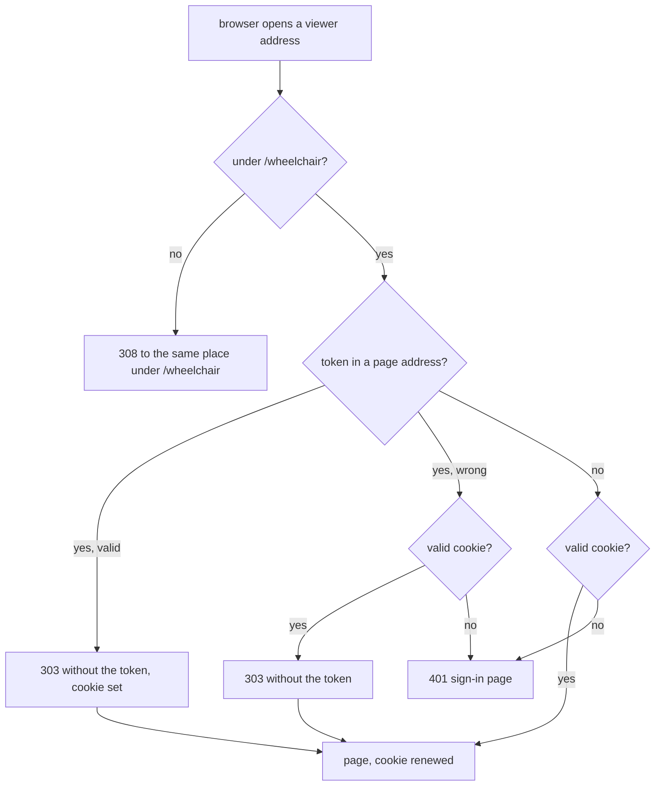

# Completion Report — The viewer remembers a device after its first visit

Written for a hostile reviewer: every claim checkable, no claim without evidence. Line
numbers are for `remember-me` at the commit that adds this file. The plan's Prior Work is
empty, so every row is `this run`.

## What the change does

Every viewer route now lives under `/wheelchair`, and the root redirects into it. A browser
that opens the bookmark link once is redirected to the same address without the token, and
that redirect sets an `HttpOnly` cookie holding an HMAC of the token. From then on the pages
work with the cookie alone, and none of them carries or sends the token. Agents keep reading
data with `?token=` and signing their registrations. The links they print carry no token,
while `--show` opens a token link in the local browser. The installer manages only the
viewer's own Tailscale mappings.



## Spec coverage

| Spec item | Origin | Implemented at (file:line) | Validated by |
|-----------|--------|----------------------------|--------------|
| Every route under `/wheelchair`; `/wheelchair` → `/wheelchair/`; everything else `308` with the moved body (#1, #2, #10) | this run | `viewer/server.js:45` (`VIEWER_PREFIX`), `:1928` (moved body) | `routes.test.js` "root routes move to /wheelchair and /wheelchair gains its trailing slash"; `pages.spec.js` "an old root bookmark…" |
| Cookie name, value (HMAC of the token over `wheelchair-remember-v1`) and attributes (`Path=/wheelchair; HttpOnly; Secure; SameSite=Lax; Max-Age=34560000`) (#5, #6, #7, #18) | this run | `viewer/server.js:46-47`, `:1209` (`rememberValue`), `:1227` | `routes.test.js` "GET /wheelchair/?token redirects without the token and sets the remember cookie attributes", "page responses renew the Lax cookie…" |
| Only page routes redirect a `token` and set or renew the cookie; a wrong token with a valid cookie redirects without it; neither is `401` (#3, #14, #16) | this run | `viewer/server.js:1638` (`redirectWithoutToken`), `:1646` (`handleDocs`), `:1660` (`handleRoot`) | `routes.test.js` "a wrong page token redirects with a valid cookie, but otherwise gets the sign-in page"; `pages.spec.js` "opening the ?token= URL lands on /wheelchair/…" |
| JSON routes answer `?token=` directly and never set the cookie (#14) | this run | JSON handlers in `viewer/server.js` | `routes.test.js` "JSON reads accept token directly and never set a remember cookie" |
| Cookie accepted for pages, JSON and `PUT`s with the unchanged `Origin` check; never as `?token=`, `X-Graph-Token` or a registration key; wrong or rotated cookies refused (#4, #5) | this run | `viewer/server.js` auth helpers | `routes.test.js` "a remember cookie reads the page, list, plan, document, and graph", "PUT graph and view accept a remember cookie only from a permitted origin", "a remember cookie is not a token, header token, or registration key", "wrong cookies and cookies from before a rotation are refused" |
| `401` sign-in page with the two sentences, under the list page's CSP (#20) | this run | `viewer/signin.html`, `viewer/server.js:1634` | `routes.test.js` "page responses renew the Lax cookie…, and anonymous pages explain sign-in"; `pages.spec.js` "a fresh context…gets the sign-in page" |
| Pages build prefixed URLs, never read or send the token (#8, #19) | this run | `viewer/index.html`, `viewer/list.js`, `viewer/doc.js`, `viewer/list.html`, `viewer/doc.html` | `pages.spec.js` "from the list, a graph and a plan document open, and a drag saves, with no token…" |
| Printed URLs: graph URLs tokenless, `--show` opens a token link locally, `--url` and `--rotate-token` print the prefixed bookmark (#9, #20, #23) | this run | `viewer/server.js:1762` (`viewerUrl`) and the `main` branches | `registration.test.js` "open and show print token-free prefixed graph URLs, while show opens the token link and url prints the bookmark"; `lifecycle.test.js` "--rotate-token prints the new prefixed bookmark for a current server" |
| Holder identification with the root `/whoami` fallback; pre-prefix holder handling (#15, #23, remote-viewer #85) | this run | `viewer/server.js:1816` (`identifyHolder`), `:1825` | `lifecycle.test.js` "a proof-valid pre-prefix holder is stopped only by stop and every other command reports the upgrade", "a no-proof pre-prefix holder stops only with its matching server start id and open refuses it" |
| Installer reads `tailscale serve status --json` and manages only the viewer's mappings; path-specific `--no-serve`; origin kept (#12, #17, #21, #22, #24, #26, #28) | this run | `install.sh:166` (`tailscale_mapping_states`), `:212` (`configure_tailscale_serve`), `:266` (`recorded_origin`), `:274` (`disable_service`) | `install/test/run.sh` (63 cases; 22 new, among them "--no-serve records false and keeps the origin for a retry", "--no-serve never suggests disabling every HTTPS mapping") |
| Tailscale forwarding behaviour (#27) | this run (probe) | Decision Log #27 | Probed on hearth 2026-09-23, with Collin running the two `sudo` commands |
| Documents (`protocol/graphs.md`, `README.md`) | this run | `protocol/graphs.md` step 1 and the refusals section; `README.md` viewer and serving sections | Read against the Spec |
| Blocking hearth checks (phone and laptop) | partly done | — | 2026-09-24. Collin added the `/wheelchair` mapping (`tailscale serve status` shows `/wheelchair proxy http://127.0.0.1:7373/wheelchair`). The served `/wheelchair/whoami` answers `200` with a `start_id`. On the phone in Firefox, a plain link was refused on a browser never remembered, the token link signed it in, and plain links worked afterwards. A rerun of `./install.sh` offered no `tailscale serve` command. Not yet done: the laptop, a link tapped from another website, an edit saved on the phone |

## Deviations from plan

- **The live viewer ran this code before verification, and before the `/wheelchair`
  Tailscale mapping existed.** Running the validation step `./install.sh && ./install.sh` on hearth, which is
  a serving machine, restarted the always-on service on the `remember-me` code. The installer
  had no terminal to ask on, so it printed the `/wheelchair` mapping command for later instead
  of running it. The existing `/` mapping forwards every path, so
  `https://hearth.taileb4e52.ts.net/wheelchair/…` already works through it. Checked:
  `/` answers `308` to `/wheelchair/`, `/wheelchair/whoami` answers `200` with a `start_id`,
  and `/wheelchair/` without a cookie answers `401`. Collin added the `/wheelchair` mapping
  on 2026-09-24 (see the coverage row for the checks done since).
- **Test fixes by the lead.** In `lifecycle.test.js`, an exit assertion expected an exit code
  from a process ended by `SIGTERM`; it now checks that the process exited. The
  lost-freed-port race test from remote-viewer was flaky under browser-suite load, so its
  `hang-on-sigterm` hook now writes an `.armed` marker and the test waits for it instead of a
  fixed 300 ms (`aa84b57`).

## Routers

`AGENTS.md` (root):
- The two `viewer/server.js` citations in the "Never check the viewer by starting a server by
  hand" paragraph were updated to `:2108-2109` and `:148`.
- The `viewer/` row now names `signin.html` and describes the sign-in page.
- The "No module-docstring rung" paragraph counts eight files. The first version of this
  report said the existing wording covered `signin.html`; verification round 1 showed it
  didn't, and remediation 1 fixed it.

No other router names a changed file or lost ownership.

## Validation evidence

Run by the lead on `remember-me` after the last merge, Node v20.19.2 on hearth.

```text
$ node --test viewer/test/*.test.js           # three runs, the last under browser-suite load
# pass 122 # fail 0
# pass 122 # fail 0
# pass 122 # fail 0

$ npm --prefix viewer run test:browser         # run alongside the unit runs above
  202 passed (1.1m)

$ bash install/test/run.sh      -> RESULT 63 passed, 0 failed
$ bash sensitivity/test/run.sh  -> RESULT 62 passed, 0 failed
$ bash spine/test/run.sh        -> RESULT 80 passed, 0 failed

$ ./install.sh && ./install.sh                 # tail of the second run
viewer: sudo tailscale serve --bg --set-path /wheelchair http://127.0.0.1:7373/wheelchair
viewer: run later: sudo tailscale serve --bg --set-path /wheelchair http://127.0.0.1:7373/wheelchair
https://hearth.taileb4e52.ts.net/wheelchair/?token=<redacted>
$ git status --porcelain                       # only the lead's AGENTS.md citation edit
 M AGENTS.md
```

## Known gaps / residual risks

- **The laptop checks, a link tapped from another website, and an edit saved on the phone
  are still to do.** The laptop was off on 2026-09-24.
- **The installer warns about lingering even when it is on.** On hearth, `Linger=yes`, yet a
  non-interactive `loginctl enable-linger` is refused, so the installer prints the `sudo`
  form and the warning. The check comes from remote-viewer (its Decision Log #32). It should
  read `loginctl show-user "$USER" -p Linger` first. That fix is outside this plan.
- **The token appeared once in this session's output**, in the bookmark the installer
  printed. It stayed on hearth and the tailnet. `node viewer/server.js --rotate-token` issues
  a new one if Collin wants.
- The plan's accepted risks stand: the first-visit URL may stay in history; two local viewers
  share one cookie; a future same-origin service could use the cookie.

## Remediation rounds

### Remediation 1 — 2026-09-24

Round 1 gate: the Claude default reviewer checked the GPT-built tasks (1, 3), and
gpt-5.6-sol checked the Claude-built tasks (2, 4). Both checks crossed families, and both
returned FAIL; the gaps are verbatim in `REMEDIATION-1.md`.

What changed:

- `identifyHolder` again requires `/whoami` to report an integer `pid` equal to `.server`'s
  before a proof-valid holder counts as ours.
- New tests: `PUT /wheelchair/graph` with the cookie, from a permitted and from a foreign
  `Origin`; the JSON body and content type of an anonymous `401`; a proof-valid holder with
  no `pid` is refused and never signalled.
- `AGENTS.md` names `signin.html` in the `viewer/` row and counts eight files.
- This report's Routers section and Known gaps were corrected to match what is true.

Validation, run by the lead:

```text
$ node --test viewer/test/*.test.js     -> # pass 125 # fail 0
$ npm --prefix viewer run test:browser  -> 202 passed (1.0m)
```

### Verification round 2 — 2026-09-24

Closure review by the same two verifiers, resumed. Both returned PASS, and both checks
crossed families. The lead then swept the documents: the `AGENTS.md` citations
(`viewer/server.js:2108-2109`, `:148`, `viewer/test/helpers/server.js:87`) still point at the
lines they describe. The lead also restarted hearth's viewer service so it runs the verified
code: `/wheelchair/whoami` answers `200` with a `start_id`, and `/` answers `308`.

