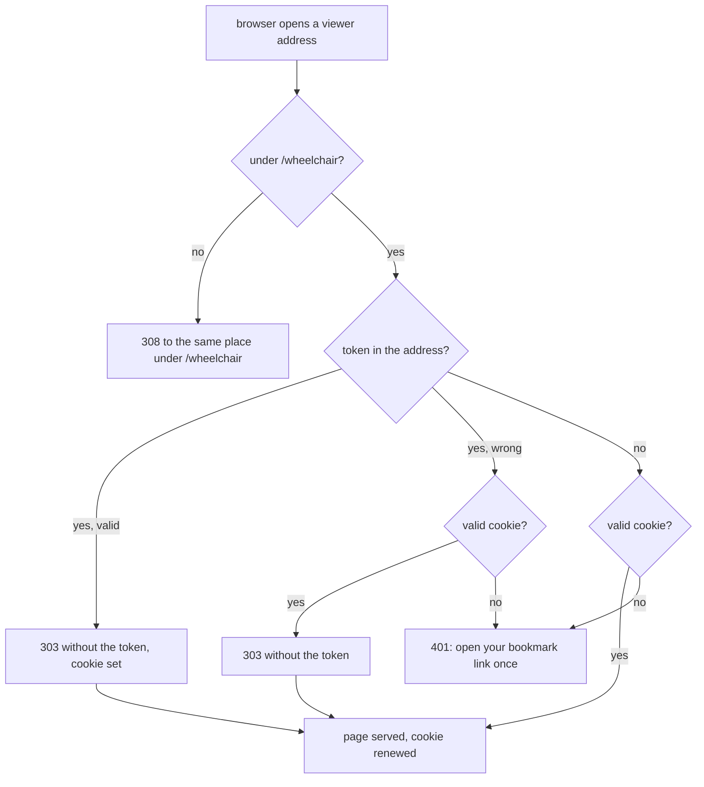

# The viewer remembers a device after its first visit

**Idea:** `IDEA.md` — what this is for and why, in plain language. Read it first; it is
the north star this plan serves. Goal and Constraints live there, not here, so they don't
get buried as this file grows.

## Open Questions

Ordered by leverage; discussed one at a time. A settled question moves to the Decision
Log and is deleted from here.

None. Every question is settled; see the Decision Log.

## Watch List

Things noticed that need looking into — not yet decisions for the user. Written down the
moment they're spotted so they can't be forgotten, surfaced to the user one line at a
time as they appear, and emptied before Stage 1 exits.

Each item ends up settled by the agent (noted in the Log), promoted to an Open Question,
promoted to a Constraint or Accepted Risk, or waved off by the user.

| # | Noticed | What needs looking into | Raised to user? | Outcome |
|---|---------|-------------------------|-----------------|---------|
| 1 | mapping | Whether `tailscale serve --set-path /wheelchair` strips the prefix before proxying. The design in Decision Log #2 is meant to work either way; it still needs a check on hearth. | yes | settled — probed on hearth 2026-09-23 (Decision Log #27): Tailscale strips the mount path and appends the rest to the target's path |
| 2 | mapping | Whether Chromium and Firefox store a cookie from `http://127.0.0.1:<port>`, and whether they accept `Secure` there. This is the address agents print on a laptop that isn't serving. | yes | settled — checked on hearth with Playwright 1.62.1: both store `Secure` and plain cookies set on a `303` from `http://127.0.0.1`, send them under `/wheelchair`, and not to `/other`. Decision Log #7 |
| 3 | mapping | Whether `tailscale serve` passes `Set-Cookie` and `Cookie` through unchanged. | yes | settled — probed on hearth 2026-09-23 (Decision Log #27): both pass through unchanged, and `Host` arrives as `hearth.taileb4e52.ts.net` |
| 4 | queue | Whether a URL the browser was redirected away from ends up in its history (Chromium and Firefox). The idea says the token leaves the history after the first visit. | yes | settled — Accepted Risks: the first-visit URL itself may be kept, which is what IDEA's "after that first visit" allows |

## Decision Log

Append-only. A reversal is a new entry superseding the old, never an edit.

| # | Decision | Rationale | Source |
|---|----------|-----------|--------|
| 1 | The viewer moves under `/wheelchair/`, leaving the root of the address free for a hub or another service. While nothing else is at the root, root requests redirect to the same place under `/wheelchair/` | Collin wants the root kept for a hub later. A cookie scoped to `/wheelchair` never reaches other paths on the same host, which a port-per-service layout couldn't guarantee | idea-change |
| 2 | The viewer answers every route under `/wheelchair/` itself: `/wheelchair/`, `/wheelchair/list`, `/wheelchair/assets/list.js`, and so on. `tailscale serve` maps `/wheelchair` to `http://127.0.0.1:<port>/wheelchair`, so a request lands correctly whether Tailscale strips the mount prefix or not. The same prefix applies on every machine, serving or not | One layout everywhere; Tailscale's prefix handling couldn't be checked without `sudo` (Watch List #1) | defaulted |
| 3 | The first visit with `?token=…` is answered by a redirect to the same address without `token`, and that redirect response sets the cookie. The page never sees the token in its address | The token never renders in a page or its address bar. A page-side history rewrite would leave it in the address bar at least once | defaulted |
| 4 | Reads accept either the cookie or `?token=`. Writes from the page (`PUT /graph`, `PUT /view`) accept either the cookie or the `X-Graph-Token` header, and keep today's `Origin` check. The cookie is `SameSite=Strict`. Agents' signed routes are unchanged | Agent links and old bookmarks keep working (IDEA). `SameSite=Strict` plus the `Origin` check stops another site from writing through a remembered browser | defaulted |
| 5 | The cookie holds a value derived from the token, not the token: hex HMAC-SHA256 keyed by the running server's token over the fixed label `wheelchair-remember-v1`. The server accepts a cookie only if it equals that value for the token it is running with | Rotation still invalidates every remembered device in one step, and a copied cookie can't sign an agent's registration or be pasted as `?token=` | user |
| 6 | The cookie lasts as long as browsers allow, `Max-Age=34560000` (400 days), and is set again on every page response to a request that authenticated, by cookie or by token | Nothing should ask for the token again until it is rotated (IDEA); rotation is the deliberate lock-out | user |
| 7 | The cookie is always `Secure`, on every machine | Checked on hearth: both browsers keep a `Secure` cookie from `http://127.0.0.1` (Watch List #2), so one attribute set works for served and local addresses alike | defaulted |
| 8 | The pages stop carrying the token. `index.html`, `list.js` and `doc.js` build every URL under `/wheelchair/` with no `token` and rely on the cookie; writes are same-origin `fetch` calls that send the cookie. A page still sends `X-Graph-Token` only if it was somehow opened with `?token=` and no redirect happened | After the first-visit redirect (#3) the page never knows the token, which is the point | defaulted |
| 9 | Every URL the commands print is under `/wheelchair/`: graph URLs `<base>/wheelchair/?path=…&token=…`, the bookmark `<base>/wheelchair/?token=…` | The first visit through any of them sets the cookie and drops the token (#3) | defaulted |
| 10 | Every old root route answers `308` to the same path and query under `/wheelchair`, including `/whoami` and the API routes, with a JSON body `{"error": "moved", "location": "<new path>"}`. Nothing at the root is served directly | IDEA: the viewer answers only under `/wheelchair/` apart from the redirect. A client following outdated instructions gets a non-200 with the new path in it, not silent success | defaulted |
| 11 | The commands identify a holder through `/wheelchair/whoami`. If that answers `308` or `404`, they ask `/whoami` at the root, which is how a viewer running code from before this change answers; such a holder has no `proof` and is handled as today's older-version rule says (remote-viewer #85) | Keeps the install-time upgrade path working across this change | defaulted |
| 12 | Serving setup maps both `/wheelchair` → `http://127.0.0.1:<port>/wheelchair` and `/` → `http://127.0.0.1:<port>`, so the root redirect reaches old bookmarks. The installer checks `tailscale serve status` for the `/wheelchair` mapping and, if it is missing, prints and offers the one `sudo` command, as today (remote-viewer #9). `--no-serve` prints the commands that remove both. When Collin later puts something else at the root, he replaces the `/` mapping himself and the viewer needs no change | The root mapping is the only thing keeping old links alive, and it is Collin's to reassign | defaulted |
| 13 | Blocking checks on hearth after setup: `curl -s https://hearth.taileb4e52.ts.net/wheelchair/whoami` returns the viewer's JSON (prefix handling, Watch List #1), and on the phone in Firefox the token link lands on `/wheelchair/` with no token in the address, a reload of `/wheelchair/` works, and an edit saves (cookies through `tailscale serve`, Watch List #3) | These can only be observed through the real `tailscale serve` | defaulted |
| 14 | Supersedes #3 and the renewal clause of #6 for non-page routes. Only the two HTML page routes, `/wheelchair/` and `/wheelchair/docs`, redirect a `?token=` and set or renew the cookie. The JSON routes (`/wheelchair/list`, `/plan`, `/doc`, `GET /graph`) answer a valid `?token=` directly, as today, accept the cookie too, and never send `Set-Cookie` | Agents read graphs back with `curl` and `?token=` (`protocol/graphs.md:580-584`) and must keep getting JSON; renewing on page loads is enough to keep a device remembered | review-round-1 |
| 15 | Supersedes #11. To identify a holder, a command calls `/wheelchair/whoami?nonce=…`. If the answer carries no `start_id`, whatever its status (the live pre-change server answers `401`), it calls `/whoami?nonce=…` at the root and applies the normal proof check to that answer. A root answer with a valid `proof` is our server running the pre-prefix code: `--stop` and `--stop --if-stale` handle it like any of our servers (its `code` differs, so `--if-stale` stops it), and every other command refuses it with the older-version message, exactly as remote-viewer #85 treats older code. A root answer with no `proof` is handled by #85's existing rule | The live server answers the prefixed route with `401` and gives a `proof` at the root (`viewer/server.js:1890-1891`, `/whoami` handler); the install-time upgrade depends on recognising it | review-round-1 |
| 16 | A request to a page route that carries a `token` parameter always redirects to the same address without it: with a valid token, the redirect sets the cookie; with an invalid token but a valid cookie, it redirects without touching the cookie; with neither, `401` | Otherwise a wrong or rotated token in an old link would stay in the address of a remembered device | review-round-1 |
| 17 | Supersedes the installer part of #12. The installer manages only mappings that point at the viewer's port. From `tailscale serve status` it reads the `/wheelchair` line and the `/` line by path. It offers the `/wheelchair` command, built from `$port`, when that line is missing, and the `/` command only when `/` has no mapping at all. It never offers to replace a `/` mapping that points elsewhere. `--no-serve` prints the removal command for `/wheelchair`, and for `/` only if `/` points at the viewer's port | Collin's future hub at the root must never be overwritten or removed by the viewer's installer | review-round-1 |
| 18 | Supersedes the `SameSite` value in #4: the cookie is `SameSite=Lax` | A token link opened from another site (a chat or mail page) would otherwise land on a `401`. `Lax` still withholds the cookie from cross-site `PUT`s, and those are also refused by the `Origin` check | review-round-1 |
| 19 | Supersedes the `X-Graph-Token` clause of #8: the pages never send `X-Graph-Token` and never read `token` from their address; they rely on the cookie alone | The redirect means a page never has a token in its address, so the fallback was dead code | review-round-1 |
| 20 | Supersedes the graph-URL part of #9. The graph URLs `--open` and `--show` print carry no token: `<base>/wheelchair/?path=…`. `--show` alone passes a token-bearing URL (`…&token=…`) to the local browser it launches, and never prints that URL. `--url` still prints the bookmark with the token. A page route reached with no valid cookie and no token answers `401` with a small HTML page (same CSP as `list.html`) saying this device isn't remembered yet and to open the bookmark once; JSON routes keep answering `401` JSON | Links carried to other devices stay token-free; the local browser on the machine running the command, which already holds the token on disk, keeps working even if never remembered | user |
| 21 | Supersedes the status-reading part of #17: the installer reads `tailscale serve status --json` and looks up `Web["<name>:443"].Handlers["/wheelchair"].Proxy` and `…Handlers["/"].Proxy`, where `<name>` is the served origin's host. A mapping "points at the viewer's port" when its `Proxy` is `http://127.0.0.1:$port` or starts with `http://127.0.0.1:$port/`. The fixture's `tailscale` shim emits that JSON shape | Text output has no stable format and the fixture's differs from hearth's; the JSON on hearth has exactly this shape | review-round-2 |
| 22 | `--no-serve` never prints the global `sudo tailscale serve --https=443 off`. It prints `sudo tailscale serve --https=443 --set-path /wheelchair off` when the `/wheelchair` mapping points at the viewer's port, and `sudo tailscale serve --https=443 --set-path / off` only when `/` does. When `tailscale` is missing or its status can't be read, it prints no command and says why | The global form would remove a future hub at `/`; the path form is Tailscale's documented per-path removal (checked on hearth as a blocking step) | review-round-2 |
| 23 | `--url` never refuses. Against a pre-prefix holder it prints the bookmark `<base>/wheelchair/?token=<.token's value>`, writes `a viewer from an older version is running; run ./install.sh` to stderr, and exits 0 | `--url` never starts or talks to a server beyond identifying it; the bookmark it prints is right once `./install.sh` has run, which the warning says to do | review-round-3 |
| 24 | The installer reads `tailscale serve status --json` with `node -e` (Node is already required), gets the host from `served_origin`, including in `--no-serve`, and treats a Handlers key of either `/wheelchair` or `/wheelchair/` as the prefix mapping. With no host name, `--no-serve` prints no command and says why | `sed` can't reliably walk nested JSON; Tailscale's key spelling for a set path was checked only for `/`; `--no-serve` needs the host to look anything up | review-round-3 |
| 25 | The mapping target defaults to `http://127.0.0.1:$port/wheelchair` (#2). If the blocking `curl …/wheelchair/whoami` check shows the request doesn't reach `/wheelchair/whoami` (for example it lands on `/wheelchair/wheelchair/whoami`, or on `/whoami`), the target becomes whichever of `http://127.0.0.1:$port/wheelchair` and `http://127.0.0.1:$port` makes that check pass. That is a one-line change in `install.sh`, and nothing in the viewer changes. The implementer records which form Tailscale needed in COMPLETION.md | Tailscale's joining of mount path and target path couldn't be checked without `sudo`; the viewer's prefix is the same either way | review-round-3 |
| 26 | Supersedes #24's `served_origin` clause for `--no-serve`: it takes the host from the origin recorded in `.serving`, read before `.serving` is overwritten, not from `served_origin`. With no recorded origin it prints no command and says the viewer isn't set up to serve, so there is nothing to remove | The origin is already on disk; `served_origin`'s messages describe setup failing, which is the wrong reason here | review-round-4 |
| 27 | Probed on hearth with a throwaway path-echo server (Collin ran the two `sudo` commands). `tailscale serve --set-path /wheelchair-probe http://127.0.0.1:<p>/wheelchair-probe` delivered `/wheelchair-probe/x` as `/wheelchair-probe/x`, `/wheelchair-probe` as `/wheelchair-probe`, and `/wheelchair-probe/a/b?q=1` intact: the mount path is stripped and the rest appended to the target's path. `Set-Cookie` and `Cookie` passed through unchanged. `tailscale serve status --json` recorded the mapping under the key `"/wheelchair-probe"`, with no trailing slash. `sudo tailscale serve --https=443 --set-path /wheelchair-probe off` removed only that mapping, leaving `/`. So the mapping is exactly `/wheelchair` → `http://127.0.0.1:$port/wheelchair`. Supersedes #25 (no fallback) and confirms #2, #22 and #24's key spelling | Collin chose to find out rather than design around the unknown (Q4) | user |
| 28 | `--no-serve` writes `{"serve": false, "origin": "<the recorded origin>"}`, keeping the origin when one was recorded. It reads the origin from `.serving` whether `serve` is `true` or `false`, so a rerun can print the removal commands again | A failed or skipped removal can be retried from the same record; anything but `serve: true` still means not serving (remote-viewer #44) | review-round-5 |

## Spec

The settled design, grown as decisions land. Bar: a fresh agent with no conversation
history can implement from this section alone — behavior, boundaries, edge cases,
non-goals, and concrete validation commands.

A Mermaid diagram of the flow belongs here, added by Stage 2 at approval — not while the
Spec is still churning. See `protocol/diagrams.md`.

A browser opening the viewer takes one of three paths. With a valid cookie, it gets the page
and the cookie is renewed. With a `token` in the address, it is redirected to the same
address without it; a valid token sets the cookie on that redirect. With neither, it gets
the "open your bookmark link once" page. Anything outside `/wheelchair` is redirected into
it. Tailscale forwards `/wheelchair/…` unchanged, and agents' data requests keep using the
token or a signature and never get a redirect.



### Where the viewer lives

Every route moves under the prefix `/wheelchair` on every machine, serving or not (Decision
Log #1, #2). The server serves `/wheelchair/` (list page, or the graph viewer with `path`),
`/wheelchair/list`, `/wheelchair/plan`, `/wheelchair/doc`, `/wheelchair/docs`,
`/wheelchair/graph` (GET and PUT), `/wheelchair/view`, `/wheelchair/register`,
`/wheelchair/watching`, `/wheelchair/whoami` and `/wheelchair/assets/list.js` and
`/wheelchair/assets/doc.js`, each behaving exactly as its root route does today apart from
authentication (below). `/wheelchair` without the trailing slash redirects to
`/wheelchair/`.

Every request to a path outside `/wheelchair` answers `308` with `Location` set to
`/wheelchair` plus the original path and query, and a JSON body
`{"error": "moved", "detail": "The viewer moved under /wheelchair.", "location": "<that location>"}`. Nothing is served at the root
(Decision Log #10). The pages' `<script src>` and every URL they build use the prefix.

Serving setup maps `/wheelchair` → `http://127.0.0.1:<port>/wheelchair` and keeps `/` →
`http://127.0.0.1:<port>` for the redirect (Decision Log #12). Tailscale strips the mount
path and appends the rest to the target's path, so `/wheelchair/list` arrives at the viewer
as `/wheelchair/list` (probed on hearth, Decision Log #27).

### The first visit and after

Only the two HTML page routes, `/wheelchair/` and `/wheelchair/docs`, take part in the
first-visit redirect (Decision Log #14). A request to one of them that carries a `token`
parameter is always answered with a `303` to the same path and query with `token` removed:
with a valid token, that response sets the cookie; with an invalid token but a valid cookie,
it redirects without touching the cookie; with neither, it is `401` (Decision Log #3, #16).
Later requests carry the cookie. The cookie is
`wheelchair_remember=<value>; Path=/wheelchair; HttpOnly; Secure; SameSite=Lax;
Max-Age=34560000` (Decision Log #4, #6, #7, #18). A page route's `200` response to a
request with a valid cookie sets it again, so it renews on every visit. Of the redirects,
only the valid-token one sets it. The JSON routes never send `Set-Cookie`.

The cookie's value is the hex HMAC-SHA256, keyed by the running server's token, of the fixed
label `wheelchair-remember-v1` (Decision Log #5). The server accepts a cookie only when it
equals that value for the token it is running with, compared in constant time. A rotation
changes the token and so invalidates every cookie at once. The cookie is never accepted as
`?token=`, as `X-Graph-Token`, or as the key for a signed route.

### Authentication per route

- Page routes (`/wheelchair/`, `/wheelchair/docs`): a valid cookie, or a `token`
  parameter handled by the redirect above. Otherwise `401` with a small HTML page, under the
  same CSP as `list.html`, whether the request had a wrong token or none. Its text is two
  sentences: "This browser isn't signed in to the viewer. Open your bookmark link once; if
  the token was rotated, get the new link with `node viewer/server.js --url`." (Decision
  Log #20).
- JSON read routes (`/wheelchair/list`, `/plan`, `/doc`, `GET /graph`) and unknown routes
  under the prefix: a valid cookie or a valid `?token=`, answered directly with no redirect
  and no `Set-Cookie`, so agents' `curl` read-back keeps working (Decision Log #14).
  Otherwise `401`, as today.
- `PUT /wheelchair/graph` and `PUT /wheelchair/view`: a valid cookie or a valid
  `X-Graph-Token`, and in both cases today's `Origin` check (`http://127.0.0.1:<port>` or
  the served origin) (Decision Log #4).
- `POST /wheelchair/register` and `GET /wheelchair/watching`: signed exactly as today; a
  cookie is ignored.
- `/wheelchair/whoami` and `/wheelchair/assets/*.js`: no authentication, as today.

### The pages

`index.html`, `list.js` and `doc.js` build every URL under `/wheelchair/` with no `token`
parameter, and rely on the cookie (Decision Log #8). Writes are same-origin `fetch` calls,
which send the cookie. The pages never read `token` from their address and never send
`X-Graph-Token` (Decision Log #19). The CSP on `list.html` and
`doc.html` is unchanged except for the prefixed script paths.

### The commands

Every printed URL is under `/wheelchair/`. `--open` and `--show` print
`<base>/wheelchair/?path=…` with no token, and `--url` prints the bookmark
`<base>/wheelchair/?token=…`, where `<base>` is the served origin or
`http://127.0.0.1:<port>` (Decision Log #9, #20). `--show` passes the same graph URL with
`&token=…` added to the local browser it launches, and never prints that form. The `401`
page a browser gets without a valid cookie is specified under "Authentication per route".
`--url` never refuses: against a pre-prefix holder it prints the bookmark from `.token`,
writes the older-version message to stderr, and exits 0 (Decision Log #23). All
their requests to the server use the prefixed routes. To identify a holder they call
`/wheelchair/whoami?nonce=…`. If the answer has no `start_id`, whatever its status, they call
`/whoami?nonce=…` at the root and apply the normal proof check to that answer (Decision Log
#15). The live pre-change viewer answers the prefixed route with `401` and the root one with
a valid `proof`. A root answer with a valid `proof` is our server running pre-prefix code:
`--stop` and `--stop --if-stale` treat it like any of our servers (its `code` differs, so
`--if-stale` stops it), `--url` prints the bookmark with a warning (Decision Log #23), and
every other command refuses it with the older-version message.
A root answer with no `proof` falls under remote-viewer Decision Log #85's existing rule.

### The installer

The installer manages only mappings that point at the viewer's port (Decision Log #17). It
reads the `/wheelchair` and `/` mappings from `tailscale serve status --json` (`Web["<name>:443"].Handlers[<path>].Proxy`;
a mapping points at the viewer's port when its `Proxy` is `http://127.0.0.1:$port` or starts
with `http://127.0.0.1:$port/`) (Decision Log #21). It offers
`sudo tailscale serve --bg --set-path /wheelchair http://127.0.0.1:$port/wheelchair` when the
`/wheelchair` line is missing, and `sudo tailscale serve --bg $port` only when `/` has no
mapping at all. It never offers to replace a `/` mapping that points anywhere else. It never
runs `sudo` silently (remote-viewer Decision Log #9). `--no-serve` never prints the global
`sudo tailscale serve --https=443 off`. It prints
`sudo tailscale serve --https=443 --set-path /wheelchair off` when the `/wheelchair` mapping
points at the viewer's port, and `sudo tailscale serve --https=443 --set-path / off` only
when `/` does. When `tailscale` is missing or its status can't be read, it prints no command
and says why (Decision Log #22). `--no-serve` reads the origin recorded in `.serving` to
find the host for that lookup, and does so before it writes `{"serve": false, "origin":
"<that origin>"}`, which keeps the origin so a rerun can print the commands again (Decision
Log #28). With no
recorded origin it prints no command and says the viewer isn't set up to serve, so there is
nothing to remove (Decision Log #26, which supersedes #24's use of `served_origin` there). The bookmark it prints comes from `--url`, so it is
the prefixed one (Decision Log #12).

### Documents

`protocol/graphs.md`: every URL and `curl` example moves under `/wheelchair/`, including
the `PUT` to `http://127.0.0.1:${PORT}/wheelchair/graph`, whose `Origin` stays
`http://127.0.0.1:${PORT}` (an origin carries no path). It also documents
the `308` an old root path now gets. Both examples of the line `--open` prints, the local
form (`graphs.md:481`) and the served form (`:485`), drop `&token=`, and "The line it prints carries the port and the token" becomes a statement that
the printed line carries no token, so the `PUT` reads the port and token from `.server`, as
step 1 already says. `README.md`: the address is
`https://hearth.taileb4e52.ts.net/wheelchair/`, the token link is needed once per device, and
the root is free for other services. Its sentence that every route needs the token
(`README.md:216`) becomes "the pages need the bookmark link once per browser; agents'
requests use the token or a signature". Its `sudo tailscale serve --bg 7373` instruction
(`:233`) becomes the two mapping commands the installer offers. `AGENTS.md`'s citations are updated where lines move.

### Not in this change

Per-device forgetting or a device list (Q1's third option, declined in Decision Log #5), a
hub at the root, and any change to agent authentication (IDEA, Not doing).

### Validation

```bash
node --test viewer/test/*.test.js
npm --prefix viewer run test:browser
bash install/test/run.sh
bash sensitivity/test/run.sh
bash spine/test/run.sh
./install.sh && ./install.sh               # idempotent; git status --porcelain stays empty
```

Every existing suite is updated for the prefix: the test helpers wait for
`http://127.0.0.1:<port>/wheelchair/` URLs, and the route tests use prefixed routes.

New unit cases: a `GET /wheelchair/?token=<valid>` answers `303` to the address without
`token` and sets the cookie with exactly the attributes above; a request with that cookie
and no token gets the page, the list, a plan, a document and a graph; `GET
/wheelchair/graph`, `/list`, `/plan` and `/doc` with a valid `?token=` answer JSON or Markdown
directly with no redirect and no `Set-Cookie`; a page route with a wrong `token` and a valid
cookie redirects without it and leaves the cookie alone, and with neither is `401`; a cookie from before
a rotation is refused `401` after it; a cookie for the right value is refused as `?token=`,
as `X-Graph-Token` and as a registration key; a wrong cookie with no token is `401`; `PUT
/wheelchair/graph` and `/view` accept the cookie with a good `Origin`, and refuse it with a
foreign one `403`; every root path, including `/whoami`, `/graph` and `/list`, answers `308`
with the prefixed `Location` and the JSON body; `/wheelchair` redirects to `/wheelchair/`;
a page response renews the cookie and a JSON response never sets it; the cookie is
`SameSite=Lax`; `--open` and `--show` print `/wheelchair/?path=…` with no token and
`--url` prints the bookmark with it; `--show` hands the browser opener (faked through
`WHEELCHAIR_BROWSER`) a URL with the token; a page route with no cookie and no token answers
`401` HTML carrying both sentences of that text and the CSP header, while a JSON route
answers `401` JSON; a holder that answers `/wheelchair/whoami`
with `401` and root `/whoami` with a valid `proof` is stopped by `--stop --if-stale` and
refused with the older-version message by `--open`; a holder whose root `/whoami` has no
`proof` falls under the remote-viewer #85 rule; the same pre-prefix holder is refused with
the older-version message by `--show`, `--register-plan` (warning, exit 0), `--rotate-token`
and `--service`, and `--url` prints the bookmark, writes the older-version message to stderr
and exits 0; `--rotate-token`
prints the prefixed bookmark `<base>/wheelchair/?token=…`.

New browser cases, in both projects: opening the `?token=` URL lands on `/wheelchair/` with
no `token` in `page.url()`; reloading `/wheelchair/` in the same context shows the list; a
fresh context opening `/wheelchair/` gets no list; from the list, a graph and a plan
document open, and a drag saves, with no `token` in any request URL (checked by recording
requests); an old root bookmark `/?token=…` ends on `/wheelchair/` with the cookie set.

Installer fixture cases: serving setup offers the `/wheelchair` mapping command when status
lacks it and not when present; it offers the `/` command only when `/` is unmapped, and
never when `/` points at another port; `--no-serve` prints the `/wheelchair` removal, and
the `/` removal only when `/` points at the viewer's port, and never the global
`--https=443 off`; the commands use `$port`; a Handlers key of `/wheelchair/` counts the same
as `/wheelchair`; `--no-serve` with `tailscale` missing, with no recorded origin, or with
`tailscale serve status --json` failing or printing malformed JSON, prints no command and
says why; serving setup calls `node … --url` last and prints its output last.

Blocking, on hearth, after `./install.sh --serve` and the new `sudo tailscale serve` step
(Decision Log #13):
- `curl -s -w '%{http_code}' https://hearth.taileb4e52.ts.net/wheelchair/whoami` answers
  `200` with a body containing `start_id` (a `308` body means the mapping is wrong);
- on the phone in Firefox, the new bookmark lands on `/wheelchair/` with no token in the
  address;
- typing `https://hearth.taileb4e52.ts.net/wheelchair/` later shows the list;
- an edit saves;
- the old bookmark still ends up on the list;
- on the remembered phone, an agent-printed link `https://hearth.taileb4e52.ts.net/wheelchair/?path=…`
  (no token) opens the graph;
- the same link, placed on another website opened in the phone's browser (for example a
  private gist or a webmail message read in the browser) and tapped there, also opens it
  (`Lax`, Decision Log #18);
- in a private window that was never remembered, the same link shows the "open the bookmark
  link once" page;
- after the `sudo` step, a second `./install.sh` run offers no `tailscale serve` command
  (Decision Log #24);
- repeat the phone checks on a laptop.

## Accepted Risks

Real issues consciously not fixed, each with the reason. Part of the spec, not review
scaffolding — an implementer should read these, and later review rounds must not
re-raise them.

| Risk | Why accepted | Round |
|------|--------------|-------|
| Two viewers on the same machine with different tokens (for example a second cache root on another port) share one `wheelchair_remember` cookie at `127.0.0.1`, because browsers don't separate cookies by port; opening one overwrites the other's | Only a development setup runs two viewers; opening the other's bookmark once restores it | 2 |
| A future service served at another path of `https://hearth.taileb4e52.ts.net` shares the viewer's origin, so its pages could call `/wheelchair/…` with the browser's cookie | Path scoping keeps the cookie from being sent to other paths, not from being used by same-origin code. Anything Collin serves there is his own. Serving it on another port or host would separate them | 2 |
| The first-visit URL, which carries the token, may be kept in a browser's history as the redirect source, and so may the URL `--show` opens in the local browser | Browsers differ on whether they record a redirect's source, and the token must arrive in some URL once. The `--show` case is on the machine that already holds the token on disk (Decision Log #20); links carried to other devices never carry it | 1 |
| A client following outdated instructions against a root route gets a `308` rather than working | Every route moves; the `308` body names the new path, and `protocol/graphs.md` is updated in the same change | — |

## Review Rounds

### Round 1 — 2026-09-23

**Lanes:** GPT / gpt-5.6-sol (mechanics lens, thread `01a0d12c-e213-7b20-b647-4eb6e182a1fb`); Claude / default reviewer model (intent lens); cross-family: yes.

Triage: 3 blocking and 2 major upheld, and one `user-decision` opened as Q3. Not clean; the upheld findings are fixed below.

**Changed since Round 0:** n/a (first round — whole Spec in scope)

| Lane | Reported | Finding | Lead verdict | Resolution |
|------|----------|---------|--------------|------------|
| GPT, Claude | blocking | Redirecting every token read breaks agents' graph read-back: `curl …/graph?path=…&token=…` (`protocol/graphs.md:580-584`) would get an empty `303` | upheld | Decision Log #14 |
| GPT, Claude | blocking | The old-viewer fallback fires only on `308`/`404`, but the live server answers `/wheelchair/whoami` with `401` (an unknown route checks the token first, `viewer/server.js:1890-1891`), so install-time stop can't recognise it. The live code's root `/whoami` also gives a `proof`, so it isn't "without proof" | upheld | Decision Log #15 |
| GPT | blocking | A valid cookie plus a wrong or rotated `?token=` authenticates without the redirect, leaving the token in the address | upheld | Decision Log #16 |
| GPT, Claude | blocking / major | RE-RAISE: agent-printed graph URLs keep `&token=`, so every later `--open`/`--show` link puts the token back in the address and possibly history; the accepted risk's "only the first visit" premise is false | user-decision | Checked: right (`viewer/server.js:1712`, Decision Log #9). IDEA's "links agents print keep working" and "no token in history after the first visit" pull against each other here. Open Question Q3 |
| GPT | major | The installer's behaviour once another service owns `/` is undefined: it would keep offering the viewer's root mapping and `--no-serve` would remove the other service's route | upheld | Decision Log #17 |
| GPT | major | "the `PUT` … and its `Origin`" move under `/wheelchair` contradicts the auth contract: an `Origin` has no path | upheld | Spec: the `Origin` stays `http://127.0.0.1:${PORT}` |
| Claude | minor | `SameSite=Strict` set on a `303`: a token link clicked from another site (chat, mail) is cross-site through the redirect, so the cookie isn't sent on the next hop and the first open shows `401` | upheld | Decision Log #18 |
| Claude | minor | Pages sending `X-Graph-Token` "when the address carries `?token=`" covers a case that can't occur | upheld | Decision Log #19 |
| Claude | minor | The installer's "already served" check greps the port, which the new mapping always contains; the new command hardcodes `7373` | upheld | Decision Log #17 |
| Claude | minor | Whether JSON read responses renew the cookie is unstated | upheld | Decision Log #14: only page responses set it |

### Round 2 — 2026-09-23

Review count reset: Collin settled Q3 (printed agent links drop the token).

**Lanes:** GPT / gpt-5.6-sol (mechanics lens, thread `01a0d174-57e9-7c50-9405-563c3caa67f4`); Claude / default reviewer model (intent lens); cross-family: yes.

Triage: 1 major upheld, so the round is not clean. It and every minor are fixed below.

**Changed since Round 1:**
- Decision Log #14–#20 and the Spec text they changed;
- only the page routes redirect and set the cookie;
- the JSON routes answer `?token=` directly;
- the old-viewer fallback on any answer without a `start_id`;
- page links with a wrong token redirect too;
- the installer manages only the viewer's own mappings;
- `SameSite=Lax`;
- the pages never handle the token;
- printed links carry no token, while `--show` opens a token link locally;
- the "open the bookmark once" `401` page;
- the updated IDEA line on agent links, the reworded accepted risk, and the new validation cases.

| Lane | Reported | Finding | Lead verdict | Resolution |
|------|----------|---------|--------------|------------|
| Claude | major | "Read the `/wheelchair` line and the `/` line of `tailscale serve status` by path" has no defined format; the real output (`|-- / proxy http://127.0.0.1:7373`) and the fixture (`install/test/run.sh:118`, one line with no path field) differ | upheld | Decision Log #21: parse `tailscale serve status --json` (on hearth: `Web` → `"hearth.taileb4e52.ts.net:443"` → `Handlers` → `"/"` → `Proxy`), and the fixture emits that shape |
| GPT, Claude | minor | `--no-serve`'s removal commands aren't given; carrying forward `sudo tailscale serve --https=443 off` would remove every mapping on 443, a future hub included | upheld | Decision Log #22 |
| Claude | minor | `protocol/graphs.md`'s `--open` example lines still show `&token=`, and "The line it prints carries the port and the token" would be false | upheld | Spec Documents names both |
| GPT, Claude | minor | README's "every route needs the token" (`README.md:216`) and the single `sudo tailscale serve --bg 7373` command (`:236`) become false | upheld | Spec Documents names both |
| Claude | minor | No hearth check opens an agent link on the remembered phone, on a device that isn't remembered, or from another app (what `Lax` is for) | upheld | Blocking hearth checks extended |
| Claude | minor | The page-route renewal rule ("set it again on every response that authenticated") contradicts "a wrong token with a valid cookie redirects without touching the cookie" | upheld | Spec: 200 page responses renew; of the redirects, only a valid-token one sets it |
| Claude | minor | A page route with an invalid token and no cookie: HTML or JSON, and "not remembered yet" is misleading after a rotation; the HTML-`401` rule sits under "The commands" | upheld | Spec: moved into "Authentication per route"; the page's text covers both cases |
| Claude | minor | `--rotate-token` prints its own bookmark (`viewer/server.js:1981`), untested for the prefix | upheld | Validation case added |
| Claude | minor | Two viewers on `127.0.0.1` with different tokens share one cookie (browsers don't separate by port) | accepted-risk | Accepted Risks |
| Claude | minor | A future service at the root shares the viewer's origin and could call `/wheelchair/…` with the browser's cookie; path scoping keeps the cookie from being sent, not from being used same-origin | accepted-risk | Accepted Risks; IDEA's claim is about what the viewer sets, which holds |
| GPT | minor | The pre-prefix holder's refusal is validated only for `--open` and `--stop --if-stale`, not `--url`, `--register-plan`, `--rotate-token` | upheld | Validation cases added |

### Round 3 — 2026-09-23

**Lanes:** GPT / gpt-5.6-sol (mechanics lens, thread `01a0d17c-9fb1-75d0-a043-392b7cc95039`); Claude / default reviewer model (intent lens); cross-family: yes.

Triage: 1 major upheld, so the round is not clean. It is the second round since Collin's last decision (Q3), so one more round is within the cap. Every finding is fixed below.

**Changed since Round 2:**
- Decision Log #21 (reading `tailscale serve status --json`, and the fixture shape);
- #22 (path-specific `--no-serve` removal, and never the global `off`);
- the cookie-renewal wording;
- the `401` HTML page moved into "Authentication per route", with rotation-aware text;
- the `graphs.md` and README items in Documents;
- the new blocking hearth checks (agent link on the phone, from another app, in a private window, and the removal syntax);
- the new validation cases for pre-prefix holders and `--rotate-token`'s bookmark;
- two new accepted risks.

| Lane | Reported | Finding | Lead verdict | Resolution |
|------|----------|---------|--------------|------------|
| GPT | major | `--url` against a pre-prefix holder: the Spec says every non-stop command refuses it, Validation says `--url` warns, and today's `--url` prints for any holder (`viewer/server.js:1985-1996`) | upheld | Decision Log #23 |
| GPT | minor | `--no-serve` with tailscale missing or unreadable has no fixture case | upheld | Fixture case added |
| Claude | minor | The fixture check "the bookmark printed is prefixed" can't fail, since the `node` shim prints a hard-coded URL | upheld | Replaced: the installer calls `--url` last and prints its output |
| Claude | minor | `--set-path /wheelchair` may be stored under `"/wheelchair"` or `"/wheelchair/"`; only `/` was checked; no hearth check reruns the installer after the `sudo` step | upheld | Decision Log #24; hearth rerun check added |
| Claude | minor | How the installer reads the nested JSON isn't said, and `--no-serve` never calls `served_origin` to get the host name | upheld | Decision Log #24 |
| Claude | minor | The `401` page's wording is given twice and the two disagree; Validation checks only one phrase | upheld | One wording, in "Authentication per route"; Validation checks both sentences |
| Claude | minor | The `Lax` hearth check (a link tapped in a native chat or mail app) doesn't exercise `Lax`, since a native app's navigation has no initiating site | upheld | The check now uses a link on another website opened in the browser |
| Claude | minor | The removal-syntax check ("`--help` or a dry run") can't confirm the command works | upheld | The check now removes and re-adds the `/wheelchair` mapping, and is Collin's to run |
| Claude | minor | `graphs.md` has two token-bearing examples (`:481`, `:485`), and the `308` body `{error, location}` breaks the doc's `{error, detail}` rule (`:678`) | upheld | Documents names both examples; the `308` body gains a `detail` |
| Claude | minor | #2's claim holds only if Tailscale strips the mount path; with no stripping and the target path appended, requests would reach `/wheelchair/wheelchair/…`, and there is no fallback if the `curl` check fails | upheld | Decision Log #25 |

### Round 4 — 2026-09-23

Third and last round of the budget since Collin's last decision (Q3).

**Lanes:** GPT / gpt-5.6-sol (mechanics lens, thread `01a0d183-7efc-75a3-b7a6-7d61c9bd2fab`); Claude / default reviewer model (intent lens); cross-family: yes.

Triage: 2 major findings, both about the Tailscale mapping target, opened as Q4; the minor ones are fixed. The round is not clean and the budget since Q3 is spent, so review stops and Q4 goes to Collin.

**Changed since Round 3:**
- Decision Log #23 (`--url` never refuses);
- #24 (JSON status read with `node -e`, the host from `served_origin`, both Handlers key spellings);
- #25 (the mapping-target fallback);
- the single `401` page wording;
- the `308` body's `detail`;
- the `graphs.md` examples;
- the reworked hearth checks (`Lax` from another website, removing and re-adding the mapping, the installer rerun);
- the new and replaced fixture and unit cases.

| Lane | Reported | Finding | Lead verdict | Resolution |
|------|----------|---------|--------------|------------|
| Claude | major | The hearth check that picks the mapping target passes on any JSON, and the viewer's own `308` body is JSON, so a wrong mapping would be recorded as right | user-decision | Checked: right. Folded into Q4 |
| GPT | major | #25's fallback can't be done as a one-line `install.sh` change: once the default mapping exists it counts as "pointing at the viewer", so the installer never offers a replacement, and changing it needs an unspecified removal and another `sudo` step | user-decision | Checked: right. Rounds 2, 3 and 4 each found a new hole in designing around Tailscale's unknown prefix handling. Open Question Q4 |
| Claude | minor | #25 assumes one of its two targets always passes; its own example (a request landing on `/whoami`) fails with both | user-decision | Folded into Q4 |
| Claude | minor | `served_origin`'s failure messages say "serving was not configured", which is wrong in `--no-serve`; the origin is already recorded in `.serving` | upheld | Decision Log #26 |
| GPT | minor | The `--url` exception still contradicts "every command other than the two stop forms refuses that holder" | upheld | Spec reworded: every command except the two stop forms and `--url` |
| GPT | minor | No fixture case for `tailscale serve status --json` failing or returning malformed JSON | upheld | Fixture case added |

### Round 5 — 2026-09-23

Review count reset: Collin settled Q4 by probing Tailscale on hearth.

**Lanes:** GPT / gpt-5.6-sol (mechanics lens, thread `01a0d1ad-c837-7153-b576-4af4898d636d`); Claude / default reviewer model (intent lens); cross-family: yes.

Triage: zero blocking and zero major upheld (one blocking downgraded to minor, with evidence, and fixed anyway). No `user-decision` open. The round is clean and the plan is approved.

**Changed since Round 4:**
- Decision Log #26 (`--no-serve` takes the host from `.serving`);
- #27 (Tailscale's behaviour, probed; #25's fallback deleted);
- the "Where the viewer lives" paragraph on the mapping;
- the `--url` wording in "The commands";
- the stricter `curl` success rule in the hearth checks;
- the unreadable-status fixture case;
- Watch List #1 and #3 settled.

| Lane | Reported | Finding | Lead verdict | Resolution |
|------|----------|---------|--------------|------------|
| GPT | blocking | `--no-serve` overwrites `.serving` with `{"serve": false}`, dropping the only recorded host, so a rerun after a failed removal can't print the removal commands again | downgraded to minor | Checked: real, but nothing is built wrong. The server and installer still treat the machine as not serving (remote-viewer #44), and `tailscale serve status` shows any leftover mapping for removal by hand. The only loss is reprinting a command. Fixed anyway: Decision Log #28 |
| Claude | minor | `--no-serve`'s host source and ordering aren't in the Spec's installer section; #26 doesn't say it supersedes #24 | upheld | Spec installer section and #26 reworded |
| Claude | minor | `README.md:236` should be `:233` | upheld | Fixed |
| Claude | minor | The remove-and-re-add hearth check repeats what the probe (#27) proved, at the cost of two `sudo` steps | upheld | Check removed |

## Prior Work

| Spec item | State | Evidence (file:line) | Confidence |
|-----------|-------|----------------------|------------|

## Implementation Tasks

Filled by Stage 3. One row per worker brief.

| # | Objective | Ownership boundary | Lane | Session id | Validation | Status |
|---|-----------|--------------------|------|-----------|------------|--------|
| 1 | Server: `/wheelchair` prefix, root `308`s, cookie auth and first-visit redirect, `401` sign-in page, prefixed and token-free printed URLs, `--show`'s local token URL, `/whoami` fallback | `viewer/server.js`, new `viewer/signin.html`, `viewer/test/*.test.js`, `viewer/test/helpers/`, `viewer/test/hooks/`, `viewer/test/fixtures/` | GPT / gpt-5.6-terra, worktree `rm-server` | `01a0d208-a37f-7413-9ae3-b568d39f8cf2` | `node --test viewer/test/*.test.js` | done — resumed once for the pre-prefix tests; lead fixed one exit assertion |
| 2 | Pages: prefix everywhere, no token in pages; browser suites updated and the new browser cases | `viewer/index.html`, `viewer/list.html`, `viewer/list.js`, `viewer/doc.html`, `viewer/doc.js`, `viewer/test/*.spec.js` | Claude / sonnet, after 1 | Claude agent (main checkout) | `npm --prefix viewer run test:browser` | done, `2f09afa` |
| 3 | Installer: JSON status reading, `/wheelchair` mapping offer, root only when unmapped, path-specific `--no-serve`, origin kept | `install.sh`, `install/test/run.sh` | GPT / gpt-5.6-terra, worktree `rm-installer` | `01a0d208-b8fc-7d00-9348-703f2571dd82` | `bash install/test/run.sh`; `bash sensitivity/test/run.sh` | done |
| 4 | Documents: `protocol/graphs.md`, README, AGENTS.md | `protocol/graphs.md`, `README.md`, `AGENTS.md`, `CONTRIBUTING.md` | Claude / sonnet, worktree | Claude agent (worktree) | `bash spine/test/run.sh` | done, `d5eea43` |

## Log

- 2026-09-23: IDEA confirmed with the `/wheelchair/` layout (Decision Log #1).
- 2026-09-23: Planning finished. No graphs were drawn for this plan, so there are no
  `rejected` entries to account for. Status set to ready-for-review.
- 2026-09-23: Plan review round 1 upheld 3 blocking and 2 major findings (fixed) and opened
  Q3 (whether printed agent links carry the token). Status back to planning until Collin
  answers.
- 2026-09-23: Q3 settled by Collin: printed agent links drop the token, `--show` opens a
  token link locally (Decision Log #20, and IDEA's agent-links line updated to match).
  Status back to ready-for-review; review rounds count again from here.
- 2026-09-23: Plan review stopped after round 4, the third round since Q3, with Q4 open
  (Tailscale's path handling, the recurring finding of rounds 2–4). Status back to planning.
- 2026-09-23: Q4 settled by probing Tailscale on hearth (Decision Log #27). Status back to
  ready-for-review; review rounds count again from here.
- 2026-09-23: Round 5 clean. Spec diagram drawn. Status set to approved.
- 2026-09-23: Stage 3 done. 122/122 unit (three runs, one under load), 202/202 browser,
  installer 63/63, sensitivity 62/62, spine 80/80. The validation run of `./install.sh`
  restarted hearth's service on this code, and the live viewer works under `/wheelchair/`
  through the existing root mapping. The `/wheelchair` mapping command and the phone and
  laptop checks remain for Collin. Status set to verifying.
- 2026-09-24: Stage 4 done. Round 1 FAIL from both cross-family verifiers (REMEDIATION-1.md);
  round 2 PASS from both. Docs swept; hearth's service restarted on the verified code.
  Status set to done. Still open for Collin: the laptop checks, a link tapped from another
  website, and an edit saved on the phone.

