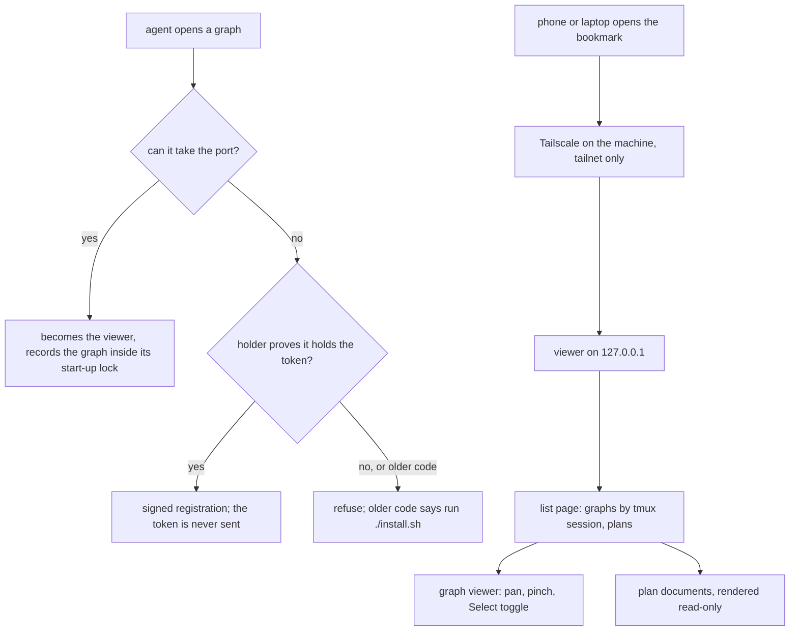

# Completion Report — See and rule on hearth's graphs from a phone or laptop

Written for a hostile reviewer: every claim checkable, no claim without evidence.

Line numbers are for `remote-viewer` at `1556cb8`. All of it is `this run`: the plan's Prior
Work section is empty.

## What the change does

An agent that opens a graph tries to take the viewer's port. If it gets the port, it becomes
the viewer and records the graph itself. If the port is taken, it checks that the holder can
prove it holds the token, then registers the graph with a signed request that never carries
the token. A holder that can't prove it, including a viewer running older code, is refused.
On a machine that opted in at install, Tailscale forwards `https://<name>.ts.net` to that
viewer, and a phone or laptop opens the list page, graphs grouped by tmux session, and
read-only plan documents.



## Spec coverage

| Spec item | Origin | Implemented at (file:line) | Validated by |
|-----------|--------|----------------------------|--------------|
| One server per machine; agents reuse the always-on one (#4, #72) | this run | `viewer/server.js:2019-2040` (listen, then identify the holder and reuse or refuse) | `lifecycle.test.js` "simultaneous delayed listeners elect one server and print one token", "--service takes over an open server without changing port or token" |
| Served origin accepted on writes; listen stays on 127.0.0.1 (#8) | this run | `viewer/server.js:1234` (`requirePutAuth`), `:1702` (`servedOrigin`), `listen` in `startServer` `:1855` | `lifecycle.test.js` "serving origin is accepted for PUT and drives the bookmark URL", "only localhost and served origins write, and serve false prints localhost" |
| Serving decided once at install; `.serving` records either answer (#10–#12, #44, #53, #54) | this run | `install.sh:116` (`has_display`), `:106-114` (`WHEELCHAIR_TTY` seam), the decision block at the end of `install.sh` | `install/test/run.sh` "headless yes/no/non-terminal", "a display records a declined serving choice", "--no-serve records false instead of removing the choice", "a serving re-run asks nothing" |
| Origin from `tailscale status --json`; missing tailscale or empty name writes nothing (#11) | this run | `install.sh:137` (`served_origin`) | `install/test/run.sh` "missing tailscale writes no serving decision", "an empty tailscale DNS name writes no serving decision" |
| URLs printed with the served origin when `serve: true` (#13, #44) | this run | `viewer/server.js:1710` (`viewerUrl`), `:1702` | `lifecycle.test.js` "only localhost and served origins write, and serve false prints localhost" |
| Lasting token by hard-link claim; `--rotate-token`; `--url` (#14, #15, #48, #49, #57) | this run | `viewer/server.js:1651` (`claimToken`), `:1692` (`ensureToken`), `:1968` (rotate), `:1978` (`--url`) | `lifecycle.test.js` "the token lasts across a restart…", "two simultaneous first starts end with one .token", "--url never listens and reports the running token after a timed-out rotation" |
| Listen-first start-up; `.server` as information, self-repaired; mutex around listen and start-up writes (#72, #74, #75, #77) | this run | `viewer/server.js:1855` (`startServer`), `:1823` (`writeServerRecord`), `/whoami` handler in `startServer`, `:1847` (`afterListenStartup`) | `lifecycle.test.js` "a stale .server never blocks listen and a live server repairs a deleted record before whoami", "SIGKILL leaves stale .server…"; `registration.test.js` "a failed listener never changes either pre-existing list" |
| `/whoami` with `pid`, `code`, nonce `proof`; identity by proof (#80, #83, #91) | this run | `viewer/server.js:1753` (`proofFor`), `:1761` (`identifyHolder`), `:1834` (`currentCode`) | `lifecycle.test.js` "/whoami supplies pid and code, and proof only for a nonce", "a copied start id with a made-up pid and no proof is foreign" |
| Stopping: `--stop`, `--if-stale`, exit codes, 5 s pid wait, older-code rule for `--stop` only (#73, #76, #85, #90, #91, #92) | this run | `viewer/server.js:1800` (`stopServer`), `:1791` (`waitForPidExit`) | `lifecycle.test.js` "stop treats a refused connection as no viewer…", "--stop exits 1 against a foreign listener", "--stop waits five seconds then fails when the server ignores SIGTERM", "--stop --if-stale keeps current code and stops a changed server copy", "an older server is stopped only by --stop…", "stopping refuses a mismatched .server pid" |
| Service mode: takeover, three-takeover bound (#17, #47, #76) | this run | `viewer/server.js:2030-2036` | `lifecycle.test.js` "--service takes over an open server…", "--service gives up after three takeovers" |
| Shutdown order and start-up rollback (#60, #78) | this run | `viewer/server.js:1829` (`removeOwnServerRecord`), rollback and close handlers in `startServer` `:1855` | `lifecycle.test.js` "a post-bind .server rename failure rolls back listener and record" |
| Silent-holder 2 s retry (#82, #84) | this run | `viewer/server.js:1761` (`identifyHolder` retry), `:1991-2000` (`--register-plan` grace) | `lifecycle.test.js` "--open waits a closing server out and succeeds"; `registration.test.js` "register-plan has a two-second no-server grace…" |
| Server is the only writer; signed `POST /register` (#61–#63, #67, #69, #81, #88) | this run | `viewer/server.js:1253` (`requireSignedAuth`), `:1285` (`handleRegister`), `:1926` (`signedRegistration`), `:1847` (own registration) | `registration.test.js` "open, show, and register-plan use the server registration writer", "register rejects unsigned, stale, foreign-origin, and out-of-scope paths", "twenty concurrent opens all land…", "simultaneous first opens register their own paths and a later plan", "a port thief after proof receives a signature but never the token" |
| Signed `/watching` for `--show` (#93) | this run | `viewer/server.js:1938` (`alreadyWatched`), `/watching` handler in `startServer` | `registration.test.js` "show signs watching without sending the token" |
| Session and harness labels (#5, #19, #52, #58) | this run | `viewer/server.js:1715` (`sessionLabel`), `:1727` (`harnessLabel`) | `registration.test.js` "--open records the caller tmux session…", "a failing tmux lookup records a null session", "show overwrites open session and harness metadata…", "the nearest codex process wins over inherited CLAUDECODE and a claude ancestor" |
| Path limits, checked again on every read and write (#66, #68, #70) | this run | `viewer/server.js:1150` (`validGraphPath`), `:1183` (`validPlanPath`) | `registration.test.js` "registration rejects every out-of-scope plan and graph path before open reaches a port", "a registered graph replaced by an external symlink is refused on GET and PUT", "a plan first graph creates its missing graphs directory and registers" |
| `.plans` and `--register-plan`; never starts a server (#21, #23, #50, #71, #87) | this run | `viewer/server.js:1077` (`registerPlanPath`), `:1991-2008` | `registration.test.js` "--register-plan is best effort and never starts a server" |
| Pruning: newer of `added` and mtime; rewrite only on removal; hourly from the list (#7, #24, #59) | this run | `viewer/server.js:1049` (`pruneRegistry`), `:1062` (`pruneRegistries`) | `registration.test.js` "pruning uses the newer graph mtime and added…"; `server.test.js` "registered paths are pruned by age at startup" (backdates mtime); `routes.test.js` "list-build pruning writes only when it removes entries…" |
| List page route and `/list` JSON: grouping, ordering, ended sessions, quoted attach, children left out (#6, #16, #18, #20, #45) | this run | `viewer/server.js:1576` (`handleList`), `:1503` (`tmuxSessions`) | `routes.test.js` "/list groups and orders opened graphs, marks ended sessions, quotes attach commands, and skips absent children"; `pages.spec.js` cases 1–3 |
| Plan routes `/plan`, `/doc`, `/docs`; status with comment stripped (#22, #25, #26, #56) | this run | `viewer/server.js:1585` (`handlePlan`), `:1591` (`handleDoc`), `:1604` (`handleDocs`), `:1482` (`documentPath`), `:1441` (`registeredPlanPath`) | `routes.test.js` "/plan lists Markdown at every depth in byte order…", "/doc returns 404 for non-Markdown files, parent paths, and a symlink leading outside its plan"; `pages.spec.js` case 4 |
| CSP on the new pages, `/assets/` without a token, per-request reads (#39, #42, #43) | this run | `viewer/server.js:1601`, `:1610` (`handleAsset`) | `routes.test.js` "/docs and the root list have CSP…", "/assets/list.js needs no token…", "a page changed on disk is served changed…", "every other route requires a token while /whoami remains available"; `pages.spec.js` case 5 |
| List page rendering (#18, #20, #26) | this run | `viewer/list.js:56` (`renderGraphItem`), `:66` (`renderSession`), `:86` (`renderPlansTable`), `:4` (5 s poll) | `render.spec.js` list cases; `pages.spec.js` cases 1–4 |
| Document page and built-in Markdown renderer; safe links (#27, #28, #42, #56) | this run | `viewer/doc.js` (renderer; `resolveLink` at `:280`, `appendLink` at `:305`) | `render.spec.js` document cases (features, frontmatter, same-plan links, `javascript:`, raw HTML, `..`, wide tables); `pages.spec.js` case 4 |
| Touch: viewport, one-finger pan, pinch, second finger, `pointercancel`, Select toggle (#29, #30, #95) | this run | `viewer/index.html:3`, `:233` (toggle), `:564` (`pickAdditive`), `:1858` (`interruptGesture`), `:1888` (`pinchMove`), `:2034` (`pointercancel`) | `touch.spec.js` (9 cases, both browsers) |
| Narrow top bar below 600 px (#35) | this run | `viewer/index.html:46` | `touch.spec.js` "no horizontal page scroll at 390px…"; `pages.spec.js` case 7 |
| Chromium and Firefox projects; test scripts (#33, #41, #94) | this run | `viewer/playwright.config.js`, `viewer/package.json` | the 192-test run below (96 per browser) |
| Systemd unit, linger, `tailscale serve` prompt, bookmark at the end, `--no-serve` (#9, #32, #37, #38, #40) | this run | `install.sh:173` (`configure_service`), `:160` (`configure_tailscale_serve`), `:201`, `:209` (`disable_service`) | `install/test/run.sh` "the rendered service unit has the specified exact contents", "a refused linger request prints the visible sudo recovery command", "a declined tailscale serve prompt…", "serving setup prints the bookmark last", "--no-serve stops and removes the user unit but keeps the token" |
| Installer stops a stale viewer right after the harness check; both browsers installed (#85, #90–#92, #94) | this run | `install.sh:44`, `:96` | `install/test/run.sh` "every successful harness check runs stale-viewer stop first", "a stale-viewer stop failure warns and installation finishes", "neither harness does not run the stale-viewer check", "dependency installation requests both browser engines" |
| Agent-facing contract in `protocol/graphs.md` (#36, #89) | this run | `protocol/graphs.md` step 1 (the `bad-path`, refusal and older-version paragraph; lockfile-only port and token) | read against the Spec; no test suite covers protocol documents (`AGENTS.md`, verification section) |
| `--register-plan` step in the five stage documents (#21, #71, #87) | this run | `protocol/planning.md:31`, `protocol/plan-review.md:13`, `protocol/implementation.md:12`, `protocol/verification.md:14`, `protocol/adopt.md:31` | read against the Spec |
| README, CONTRIBUTING, AGENTS.md (#33, #86, #94) | this run | `README.md` ("Reaching it from a phone or another laptop"), `CONTRIBUTING.md:64`, `AGENTS.md` viewer row and verification block | read against the Spec |
| Blocking checks on hearth: phone and laptop in Firefox, `Origin` through `tailscale serve`, Funnel off, reboot survival | not done | — | Not run in Stage 3. It needs `./install.sh --serve`, the one-time `sudo tailscale serve --bg 7373`, and Collin on the phone and a laptop. See Known gaps |

## Deviations from plan

- `AGENTS.md` lists seven files in the `viewer/` row (the six pages and scripts plus
  `playwright.config.js`). The Spec's "Files that change" said "must list six". The seventh is
  the new config file, which also lives in `viewer/`, so the router names it.
- `--register-plan` prints its warnings with a `Warning: ` prefix, for example
  `Warning: a viewer from an older version is running; run ./install.sh`. The Spec gives the
  message text without saying whether it is prefixed. `--open`, `--show` and `--service` print
  it unprefixed (`viewer/server.js:2038`).
- `--stop` against a holder that gives no proof and whose `start_id` does not match `.server`
  prints the older-version message and exits 1 (`viewer/server.js:1804`), instead of the
  generic "cannot identify" message. The Spec asks only for exit 1 with a message there.
- Task 1's `ignore-sigterm` test hook was fixed by the lead (`viewer/test/hooks/lifecycle.js`).
  As written, it removed every `SIGTERM` listener, which restores the signal's default action
  and kills the process. It now keeps a no-op listener. This is test-only.

## Routers

- `AGENTS.md` (root): the `viewer/` row and the "No module-docstring rung" paragraph now name
  the seven files. The `install.sh` row mentions the serving decision and the stale-viewer
  stop. The verification block uses the unquoted Node glob and says the browser suite runs in
  Chromium and Firefox. The "Never check the viewer by starting a server by hand" paragraph
  now says a start reuses one of our servers found on the port, citing
  `viewer/server.js:2030-2031` and `:147`, instead of describing lockfile reuse.
- `protocol/AGENTS.md`, `sensitivity/AGENTS.md`, `spine/AGENTS.md`: unchanged. No ownership
  moved, and none of them names a file this change altered in a way that makes it false.

## Validation evidence

All run by the lead on `remote-viewer` after the last merge, Node v20.19.2 on hearth.

```text
$ npm --prefix viewer run test:browser
  192 passed (59.5s)

$ node --test viewer/test/*.test.js
# tests 102
# pass 102
# fail 0

$ bash install/test/run.sh
RESULT 41 passed, 0 failed

$ bash sensitivity/test/run.sh
RESULT 62 passed, 0 failed

$ bash spine/test/run.sh
RESULT 80 passed, 0 failed

$ ./install.sh && ./install.sh    # run twice; last lines of output
viewer deps: installed
viewer chromium: installed
diagram-sensitivity: set default in /home/collin/.claude/CLAUDE.md and /home/collin/.codex/AGENTS.md
diagram sensitivity: installed
viewer: no display and no terminal; serving was not configured
$ git status --porcelain          # only the lead's AGENTS.md edit, since committed as 1556cb8
 M AGENTS.md

$ node viewer/server.js --stop --if-stale
No viewer running.
```

Baseline before any change (from PLAN.md's Log): 64/64 browser tests in Chromium and in
Firefox, 55/55 unit tests.

## Known gaps / residual risks

- **Not yet run: the blocking hearth checks.** These are the Spec's Validation paragraph
  starting "Blocking, on hearth": opening the list and ruling on a graph from `firefly` and a
  laptop in Firefox, `tailscale serve` passing `Origin` through, Funnel off, the address
  unreachable off the tailnet, and the bookmark surviving a reboot. They need the one-time
  `sudo` step and Collin on the devices. Until they pass, `Origin` pass-through in particular
  is untested.
- **The installer's "no display and no terminal" branch fired in the lead's own run.**
  Running `./install.sh --serve` from an agent shell would set up serving without a prompt,
  and the `tailscale serve` step would then print the command instead of asking. That is by
  design (#9, #54), but it means Collin should run the serving setup from his own terminal.
- **`viewer/test/pages.spec.js` can leak servers if its setup fails partway.** After the
  worker's earlier attempts, six test servers were found still running under
  `viewer/test/.tmp/pages-*`. The lead stopped them. Two later full runs left none. A failure
  inside `buildWorld` after its server starts has no cleanup.
- **`~/.cache/agent-graphs/.registered` on hearth was written by older code** (another
  session drew a graph at 14:06 today). Its entries lack `session` and `harness`, so they
  would list under "not in tmux", labelled `other`, until opened again.
- The accepted risks in PLAN.md stand unchanged.

## Remediation rounds

### Remediation 1 — 2026-09-23

Round 1 gate: the Claude default reviewer checked the GPT-built tasks (1, 2, 3, 6), and
gpt-5.6-sol checked the Claude-built tasks (4, 5, 7, 8). Both checks crossed families. Both
returned FAIL; the gaps are verbatim in `REMEDIATION-1.md`.

What changed:

- `--rotate-token` and service takeover no longer stop a viewer running older code; only
  `--stop` does (`viewer/server.js`, `stopServer` takes `allowOlderStop`, passed `true` only
  from the `--stop` branch of `main`). `--rotate-token` now refuses it with the upgrade
  message and exits 1.
- `--register-plan` retries a silent holder for 2 s (`identifyHolder` with
  `retrySilent: true`).
- A no-op `afterServiceStop()` step in `main`, between a service's stop and its re-listen,
  gives the tests a place to pause. Production never replaces it.
- New and strengthened tests: old-version viewer refused by `--rotate-token` and left
  running; `--register-plan` against a silent holder that starts answering; `--rotate-token`
  and `--stop` leave `.server` to the exiting server; shutdown releases the port before
  removing only its own `.server`; a starter that loses the freed port registers through the
  new holder; a refused `POST /register` leaves both lists byte-identical; the old-version
  fixture answers `404` to `/register`, is refused by `--register-plan`, is stopped by
  `--stop --if-stale`, and never receives the token in any URL or header; `--service` runs
  into its three-takeover limit against four successive holders and exits 1, with the
  fourth left running.
- `README.md:85`, `:198`, `:213` now describe the viewer's several pages and the lasting
  token (`6fe74fd`).

Validation, run by the lead after the last change:

```text
$ node --test viewer/test/*.test.js
# tests 109
# pass 109
# fail 0

$ npm --prefix viewer run test:browser
  192 passed (1.0m)

$ bash install/test/run.sh      -> RESULT 41 passed, 0 failed
$ bash sensitivity/test/run.sh  -> RESULT 62 passed, 0 failed
$ bash spine/test/run.sh        -> RESULT 80 passed, 0 failed
```
