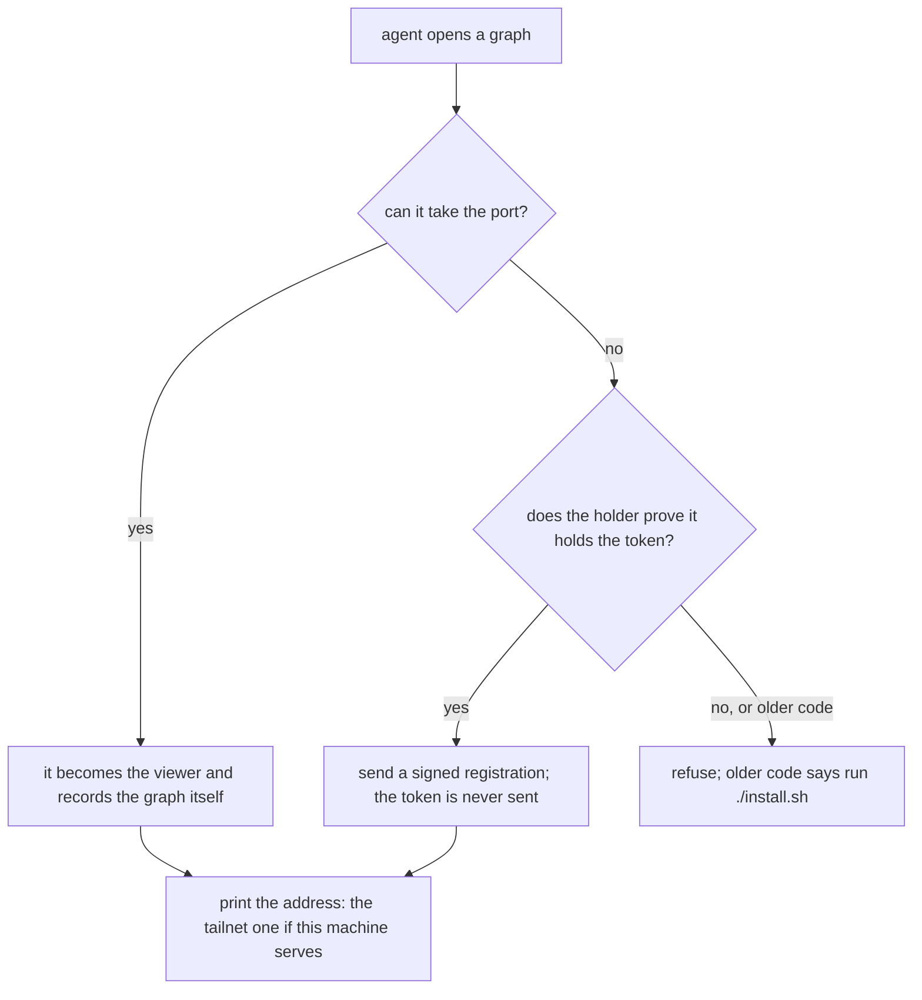
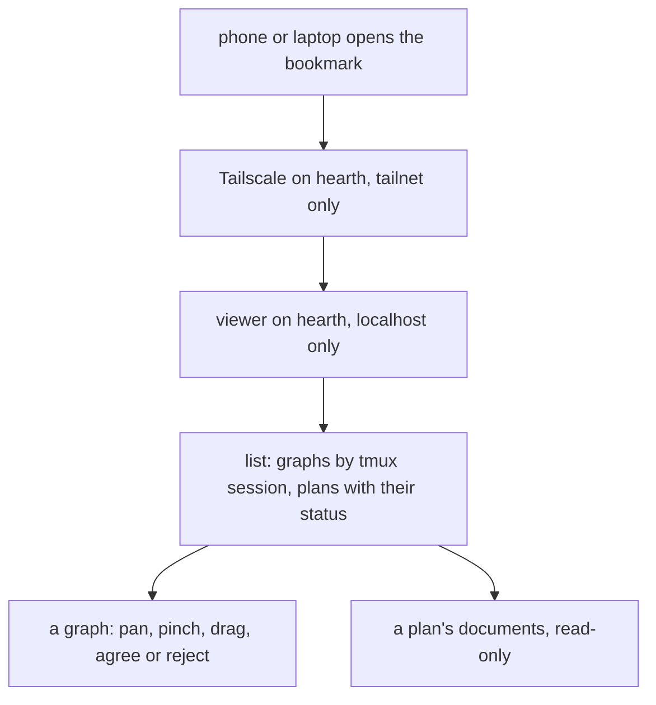

# See and rule on hearth's graphs from a phone or laptop

**Idea:** `IDEA.md` — what this is for and why, in plain language. Read it first; it is
the north star this plan serves. Goal and Constraints live there, not here, so they don't
get buried as this file grows.

## Open Questions

Ordered by leverage; discussed one at a time. A settled question moves to the Decision
Log and is deleted from here.

None. Every question is settled; see the Decision Log.

## Watch List

Things noticed that need looking into — not yet decisions for the user. Written down the
moment they're spotted so they can't be forgotten, surfaced to the user one line at a
time as they appear, and emptied before Stage 1 exits.

Each item ends up settled by the agent (noted in the Log), promoted to an Open Question,
promoted to a Constraint or Accepted Risk, or waved off by the user.

| # | Noticed | What needs looking into | Raised to user? | Outcome |
|---|---------|-------------------------|-----------------|---------|
| 1 | mapping | Hearth has Node v20.19.2, and the repo was developed against Node 26 (`README.md:234`). Run the viewer suites on hearth to find out whether anything depends on a newer Node. | yes | settled — Decision Log #33, #34: `server.test.js` passes 55/55 on Node 20 when named explicitly; the quoted glob fails there; browser suite blocked by missing system libraries |
| 2 | mapping | What environment a Codex CLI session sets, so `--open` can label a graph Claude or Codex. Claude sets `CLAUDECODE=1`. | yes | settled — Decision Log #31 |
| 3 | mapping | Lingering is off for `collin` (`Linger=no`), so a systemd user service stops at logout. Turning it on (`loginctl enable-linger`) may need `sudo`. | yes | settled — Decision Log #32 |
| 4 | mapping | Whether `tailscale serve` passes the browser's `Origin` header through unchanged. The write check depends on it. | yes | settled — blocking validation on hearth, Spec "Validation" |
| 5 | queue | If the always-on service is down, an agent's `--open` starts its own server with a random token, and the service's later start "reuses" it and exits (`server.js:1376-1378`). Under systemd that's a restart loop, and the token breaks bookmarks. The lasting token and the service's startup both have to cover it. | yes | settled — Decision Log #14, #17 |
| 6 | queue | `/whoami` is unauthenticated (`server.js:1388`) and would be reachable over the tailnet. It returns only a random start id; check nothing else relies on it staying local. | yes | settled — only `existingServer` and `stopServer` call it (`server.js:1314`, `:1334`, `:1356`), always over `127.0.0.1`; the start id grants nothing without the token. No change |
| 7 | queue | How the viewer's top bar and side panel lay out at phone width. Only the input handling was read (`viewer/index.html:1789-1800`), not the layout. | yes | settled — Decision Log #35 |

## Decision Log

Append-only. A reversal is a new entry superseding the old, never an edit.

| # | Decision | Rationale | Source |
|---|----------|-----------|--------|
| 1 | No graphs are drawn during this plan's planning turns on hearth; flows are described in text | Nothing drawn on hearth can be seen until this feature exists | user |
| 2 | The page also shows the workflow's plan documents, read-only | Reading IDEA/PLAN in a phone terminal is impractical; editing stays with agents and the terminal | idea-change |
| 3 | The feature isn't hearth-specific. Every machine runs the same code; becoming reachable is opt-in per machine. A laptop with a screen keeps today's behavior unless it opts in | Collin asked whether it would work the same on a laptop; hearth-only code would fork the viewer | idea-change |
| 4 | There is one server per machine. The always-on service is the existing `server.js` with the same cache root and port, and agents' `--open`/`--show` find it through the existing lockfile and reuse it. No second server | Collin asked that existing routes reuse the new serving path rather than a parallel system; the lockfile reuse at `server.js:1376-1378` already does this | user |
| 5 | Session and harness are recorded when `--open` registers a graph, in that graph's entry in `.registered`, not in the graph file | `--open` runs in the agent's shell, where the tmux and harness environment is visible. The graph file drops unknown fields, and the entry already exists per graph | defaulted |
| 6 | Whether a session is still running is checked against tmux each time the list is built | The list is only accurate if it asks tmux at the moment of viewing; a stored flag goes stale | defaulted |
| 7 | Registry retention stays 30 days (`REGISTERED_MAX_AGE`, `server.js:38`) | Nothing in the idea needs a different window | defaulted |
| 8 | Other devices reach the viewer through `tailscale serve` (HTTPS on the machine's tailnet name, forwarding to `127.0.0.1:<port>`). The server keeps listening on `127.0.0.1` only, and its write check accepts the served `https://<tailnet name>` origin alongside `http://127.0.0.1:<port>` | HTTPS and reboot survival with no certificate work, and no new network exposure in the server itself. Binding the tailnet address gives plain HTTP and boot ordering; SSH forwarding is impractical on a phone | user |
| 9 | Setup never runs `sudo` silently. The one-time `tailscale serve` command is run by the person, or by the installer only after it says so and asks | `sudo` changes the machine's network setup outside this repo's tree; the person should see it happen | defaulted |
| 10 | Whether a machine serves is decided once, at install. `./install.sh` checks for a display and, when there is none, asks whether to set the machine up as an always-on viewer. `--serve` opts in without asking and `--no-serve` declines without asking. After that, whether the machine serves is read from what setup wrote, never guessed at runtime | A per-call guess misfires (an SSH session into a laptop looks headless); asking once lets a person confirm it | user |
| 11 | The choice is recorded as `<cache-root>/.serving`, JSON holding the served origin (for example `{"origin": "https://hearth.taileb4e52.ts.net"}`), written by the installer. The server reads it at start | The server already keeps its state in the cache root, and the suites isolate by `--cache-root` (`viewer/test/helpers/server.js:87`), so this needs no new configuration location or test seam | defaulted |
| 12 | Re-running `./install.sh` on a machine already serving keeps serving and asks nothing. With no terminal to ask on, the installer never opts in and says why | The installer is documented as idempotent (`install.sh:1`); a repeat run must not re-ask or silently change mode | defaulted |
| 13 | Opening a browser stays best-effort and unchanged. On a serving machine the URL it opens is the served one | It already fails quietly on a machine with no screen (`server.js:1438-1449`), and on a laptop that serves, the served address opens fine locally | defaulted |
| 14 | The token lasts across restarts. It is generated once into `<cache-root>/.token` (mode 0600) by whichever server start finds it missing, and every later start uses it instead of a fresh random one. It changes only through an explicit rotate | A bookmark must survive reboots; any process on the machine can reach `127.0.0.1`, so dropping the token would drop today's protection too | user |
| 15 | `node viewer/server.js --rotate-token` writes a new token and stops the running server (the same identity check as `--stop`), so the next start picks it up. Every existing bookmark then needs the new URL | A running server holds its token in memory; stopping it is the only way the change takes effect without a second code path | defaulted |
| 16 | `GET /` with a valid token and no `path` returns the list page. With a `path` it returns the viewer exactly as today. The list's links carry the token | The bookmark is the root address plus the token; the page already carries the token in every URL it builds (`viewer/index.html:350-356`) | defaulted |
| 17 | The always-on service starts the server in a service mode that takes over from a server an agent started while the service was down: if the lockfile's server answers `/whoami`, it stops that server with the `--stop` identity check and claims the lock, rather than reusing it and exiting | Under systemd, reuse-and-exit means an endless restart loop (`server.js:1376-1378`). With a lasting token and the same port, an open page doesn't notice the takeover | defaulted |
| 18 | Graphs are grouped under the tmux session name the agent ran in. Graphs opened outside tmux go under "not in tmux" | It's the name Collin acts on (`tmux attach -t <name>`); the harness label distinguishes two agents sharing one session | user |
| 19 | `--open` finds the session name with `tmux display-message -p -t "$TMUX_PANE" '#S'` when `TMUX` is set, and records `session: null` otherwise or if that command fails. The harness is `claude` when `CLAUDECODE=1`, `codex` by the rule Watch List #2 settles, else `other` | Both are visible in the agent's own shell, which is where `--open` runs; a failed lookup must not fail the open | defaulted |
| 20 | Groups are ordered by their newest graph, newest first; graphs within a group newest first. A group whose session is no longer in `tmux list-sessions` is marked ended and shows no attach command | Matches IDEA's "newest first"; an attach command for a dead session would fail | defaulted |
| 21 | Each workflow stage (`/plan`, `/plan-review`, `/implement`, `/verify`, `/adopt`) registers its plan directory with the viewer when it runs, along with the tmux session and harness | It shows exactly the plans the workflow touched, needs no configuration, and can say which session is working on a plan | user |
| 22 | The page serves every `.md` file under a registered plan directory, at any depth, found by reading the directory when asked. There is no fixed list of document names | Collin: "we might add more stuff later". A new document type then appears with no viewer change | user |
| 23 | Registration is `node viewer/server.js --register-plan <plan dir>`, written into a `plans` section of `.registered` keyed by the plan directory's real path, holding `added`, `session` and `harness` found as in Decision Log #19. It is best-effort: a failure prints a warning and never stops the stage | Mirrors how `--open` registers a graph; a viewer problem must not block planning or implementation | defaulted |
| 24 | Registered plans are pruned on the same 30-day rule as graphs, counted from the last registration | Decision Log #7; a plan no stage has touched in 30 days has left active work | defaulted |
| 25 | A requested document is served only if its real path (after resolving symlinks) is inside the registered plan directory's real path and ends in `.md`. Anything else is `404` | Keeps a symlink or `..` from reaching files outside the plan | defaulted |
| 26 | The list shows each plan's status from `status:` in its `PLAN.md` frontmatter, or "no PLAN.md" when there is none | The status field is the workflow's state machine (`AGENTS.md`), so it is the one-word answer to "where does this plan stand" | defaulted |
| 27 | Plan documents are rendered by a small renderer written into the viewer: headings, paragraphs, bullet and numbered lists, tables, fenced and inline code, bold and italic, links. Mermaid blocks show as code. No new dependency | Covers what the workflow's documents use; drawn Mermaid can be added later without undoing this | user |
| 28 | The server sends a document as raw Markdown (`GET /doc?plan=<dir>&file=<relative path>&token=<t>`) and the page renders it. HTML written inside a document is shown as text, never run. A link to another `.md` in the same plan opens it in the page; other links stay ordinary links. Frontmatter shows as a small key/value block at the top. Wide tables and code blocks scroll sideways inside their own box | The page holds the token, so a document must never be able to run script in it. Rendering in the page keeps the server a file-handler, as it is for graphs | defaulted |
| 29 | On a touchscreen, one finger on empty canvas pans and two fingers pinch-zoom. A Select toggle in the toolbar switches one-finger drag on empty canvas to box-select and makes a tap add or remove an entry from the selection. Mouse behavior is unchanged | Panning is the most frequent action on a small screen, and a visible toggle is easier to find than a gesture | user |
| 30 | Touch is detected per pointer (`pointerType === 'touch'`), never by device. The Select toggle is shown when `(pointer: coarse)` matches or a touch pointer has been seen. Pinch zooms about the two fingers' midpoint within the existing `MIN_ZOOM`/`MAX_ZOOM`. The page gains `<meta name="viewport" content="width=device-width, initial-scale=1">` | A laptop with a touchscreen keeps the mouse behavior for the mouse; the zoom limits are already defined | defaulted |
| 31 | The harness is `claude` when `CLAUDECODE=1`; otherwise `--open` walks its ancestor processes (`/proc/<pid>/stat` for the parent, `/proc/<pid>/comm` for the name) and answers `codex` if one is named `codex`, else `other`. Where `/proc` is absent (macOS), `claude` or `other` | No Codex environment variable was verified. The ancestor walk needs nothing from Codex and works for both harnesses | defaulted |
| 32 | Serving setup runs `loginctl enable-linger "$USER"`. If that is refused, it prints the `sudo` command, warns that the service will stop at logout until it is run, and carries on | Decision Log #9: no silent `sudo`; the viewer still works while logged in | defaulted |
| 33 | The viewer's unit-suite command becomes `node --test viewer/test/*.test.js` (unquoted, expanded by the shell), in `viewer/package.json`, `AGENTS.md` and `CONTRIBUTING.md` | The quoted glob fails on Node 20 ("Could not find"), while the shell-expanded list works on 20 and 26. The always-on machine runs 20 | defaulted |
| 34 | The browser suite needs Chromium's system libraries. On hearth they are missing (`libnspr4.so`), and installing them (`sudo npx --prefix viewer playwright install-deps chromium`) is Collin's one-time step before Stage 3 | The phone work is only checkable in the browser suite; the install needs `sudo`, so per Decision Log #9 the person runs it | defaulted |
| 35 | Below 600px of width, the top bar hides the legend and source text, and the controls scroll sideways inside the bar rather than being clipped. The explanation panel stays full width | The bar is a fixed 48px with `overflow: hidden` holding six buttons (`viewer/index.html:14-16`, `:211-218`), so on a phone the controls would be cut off and unreachable | defaulted |
| 36 | On every machine, agents read the port and token from the lockfile (`<cache-root>/.server`), never by parsing them out of the printed URL. `protocol/graphs.md` step 1 says so, and its `PUT` examples keep sending to `http://127.0.0.1:<port>` with that `Origin` | On a serving machine the printed URL is `https://<name>.ts.net/?…` and carries no port; `graphs.md:474-478` currently offers parsing the URL as one of two ways | defaulted |
| 37 | Serving setup is Linux-with-systemd only. Elsewhere `--serve` prints that serving isn't supported on this platform and installs everything else | Every machine that needs it today is Linux; a launchd or Windows service is a separate piece of work | defaulted |
| 38 | The service is a systemd user unit, `~/.config/systemd/user/wheelchair-viewer.service`, rendered by the installer: `ExecStart=<absolute node path> <clone>/viewer/server.js --service`, `Environment=WHEELCHAIR_NO_BROWSER=1`, `Restart=always`, `RestartSec=2`, `WantedBy=default.target`. Each installer run on a serving machine rewrites it, reloads systemd and restarts the service | `Restart=always` is what makes `--rotate-token` and `--stop` come back up; restarting on every install run is what makes a `git pull` take effect, since a running server runs the code it was started with (`AGENTS.md`, verification section) | defaulted |
| 39 | The list page is a new file, `viewer/list.html`, and plan documents a new file, `viewer/doc.html`. `index.html` stays the graph viewer. New JSON routes: `GET /list?token` (graph groups and plans) and `GET /plan?dir&token` (a plan's `.md` files). The list page polls `/list` every 5 seconds | Keeps the 1955-line graph page from growing two unrelated screens; polling is how the graph page already stays current | defaulted |
| 40 | `--no-serve` on a machine already serving turns serving off: it stops and removes the unit, deletes `.serving`, and prints the `sudo tailscale serve --https=443 off` command for the person to run. `.token` is kept | The installer's choice must be reversible without hand-editing; the tailscale step stays the person's per Decision Log #9 | defaulted |
| 41 | Supersedes #33 for `viewer/package.json` only: its script is `node --test test/*.test.js` (unquoted, relative to `viewer/`). `AGENTS.md` and `CONTRIBUTING.md` use `node --test viewer/test/*.test.js` from the repo root | npm runs a package's scripts from the package directory | review-round-1 |
| 42 | Documents are rendered by building DOM nodes with `textContent`, never by assigning document text to `innerHTML`. A link gets an `href` only when it is `http:`, `https:` or a relative path to a `.md` file in the same plan; any other target is shown as plain text. The list and document pages carry no inline script and are served with `Content-Security-Policy: default-src 'none'; script-src 'self'; style-src 'self' 'unsafe-inline'; connect-src 'self'; img-src 'self' data:; base-uri 'none'; form-action 'none'; frame-ancestors 'none'` | Escaping HTML alone leaves `javascript:` links executable on a page that holds a write token | review-round-1 |
| 43 | Page routes: `GET /docs?plan=<dir>&token=<t>` returns `viewer/doc.html` (token checked, plan registered). `GET /assets/<name>` serves a fixed list of the new pages' scripts (`list.js`, `doc.js`), with no token, since they are code, not data. Any other name is 404 | Supersedes the unrouted "links to `viewer/doc.html`" in #39; external scripts are what the CSP in #42 requires | review-round-1 |
| 44 | `.serving` records both answers: `{"serve": true, "origin": "https://…"}` or `{"serve": false}`. The installer asks only when the file is absent and there is no display. `--serve` and `--no-serve` overwrite it. The server and URL builders treat anything but `serve: true` with an origin as not serving | Supersedes the opted-in-only shape in #11; a decline must be remembered too, or "decide once" re-asks | review-round-1 |
| 45 | The list shows only graphs whose `.registered` entry has `opened: true`, meaning a graph named by `--open`. Child graphs are reached through their parent's container node in the viewer, as today, and never appear as their own list entries | Children have no `--open` of their own and so no session; they belong under the graph that contains them | review-round-1 |
| 46 | Every read-modify-write of `.registered` or `.plans`, by the server or by any CLI command, happens under `<cache-root>/.registry.lock`: created with exclusive create, retried every 50 ms for up to 3 s, and removed as stale if older than 10 s. The server keeps its in-process mutex as well | The server's mutex doesn't cover the separate `--open` and `--register-plan` processes | review-round-1 |
| 47 | Service-mode takeover: send `SIGTERM` to the lockfile's verified pid, poll until that pid is gone for up to 5 s, then enter the normal claim loop. If the pid outlives the wait, exit 1 with a message and let systemd retry. Service mode never unlinks the lock itself while the old process lives | Claiming before the old process has exited can lose the new lock to the old one's close handler, or hit `EADDRINUSE` | review-round-1 |
| 48 | `.token` is created the way the lockfile is: write a temp file, then hard-link it into place, which fails if the file already exists (`claimLock`, `server.js:1275-1300`). A starter that loses reads the winner's file. This happens before the lock is claimed. `--rotate-token` replaces the file by atomic rename | Two starters that both find the file missing must end with one token | review-round-1 |
| 49 | `node viewer/server.js --url` prints the bookmark address, `<served origin or http://127.0.0.1:<port>>/?token=<t>`, reading `.serving` and `.token`. It never starts a server. Serving setup ends by printing it, and `--rotate-token` prints the new one | Nothing else ever shows the person the address the idea depends on | review-round-1 |
| 50 | Supersedes the storage in #23: registered plans live in their own file, `<cache-root>/.plans` (mode 0600), a map from plan directory real path to `{added, session, harness}`, pruned by the same 30-day rule. `.registered` keeps its current format | A `plans` key inside `.registered` would be pruned and walked as a graph path by the existing code | review-round-1 |
| 51 | `--register-plan`, `--url` and `--rotate-token` never start a server; `main()` handles them before `startServer` and they exit | Starting a server from a stage step would hang the stage in the foreground | review-round-1 |
| 52 | Supersedes #31: the harness is the nearest ancestor process named exactly `claude` or `codex` (`/proc/<pid>/comm`), checked up the parent chain; `other` if none. `CLAUDECODE=1` decides only where `/proc` is absent | A Codex lane started by a Claude lead inherits `CLAUDECODE=1`; the nearest ancestor is the one actually running | review-round-1 |
| 53 | Supersedes the file handling in #40: `--no-serve` on a serving machine writes `{"serve": false}` instead of deleting `.serving`. The rest of #40 stands | A deleted file means "never asked", which brings the question back | review-round-2 |
| 54 | `.serving` is written whenever a choice is made: an answer at the prompt, `--serve` or `--no-serve`, or a first run with a display present, which records `{"serve": false}` without asking. A run with no display and no terminal makes no choice and writes nothing, so the question stays open for a run where a person can answer | "Decide once" needs every decision recorded, and must never record a decision nobody made, such as an agent running the installer on hearth for validation | review-round-2 |
| 55 | Supersedes the stale rule in #46: the registry lock file holds its owner's pid, and is removed as stale only when that pid is gone (`process.kill(pid, 0)` gives `ESRCH`). There is no age limit. Waiting stays capped at 3 s | A live owner is never robbed, however long its operation; a crashed owner's lock is cleared at once | review-round-2 |
| 56 | The document page is `/docs?plan=<dir>&file=<path relative to the plan>&token=<t>`. With no `file`, it shows `PLAN.md`, then `IDEA.md`, then the first `.md` in path order, whichever exists first. A relative link resolves against the directory of the document it appears in. If the result is a `.md` file inside the plan, it becomes a `/docs` link for that file; anything else is plain text | Documents can sit at any depth, so the base has to be the current document, the same as a browser or a Markdown viewer | review-round-2 |
| 57 | `--rotate-token` stops the running server the way service takeover does (#47): `SIGTERM`, wait up to 5 s for the pid to exit, never unlink `.server` while it lives. If the pid outlives the wait, the new token file stays in place and the command says the server must be restarted | Today's stop path unlinks the lock right after `SIGTERM` (`server.js:1358-1359`), which a concurrent `--open` can race | review-round-2 |
| 58 | Both `--open` and `--show` write session and harness into the entry, from the environment they run in | `--show` rebuilds the same entry (`server.js:1454-1457`) and runs from the same agent shell | review-round-2 |
| 59 | Pruning while the service runs happens at most once an hour, from the list build, and rewrites a file only if something was removed. An entry's age for pruning is the newer of its `added` and its file's modification time (for a plan, the newest `.md` in it) | A 5 s rewrite loop is waste, and a graph or plan still being changed must not be pruned from under its reader | review-round-2 |
| 60 | The server's shutdown path calls `server.close()` first and removes `.server` only after the port is released, and only if the lockfile still holds this server's `start_id`. The `error` handler removes the lockfile under the same `start_id` check | Removing the lock while still holding the port lets a concurrent starter claim the lock and then fail to bind, or have its lock deleted by the old process (`server.js:1404-1412`) | review-round-3 |
| 61 | Supersedes #46 and #55; there is no registry lock. While a server is running, it is the only process that writes `.registered` and `.plans`. `--open`, `--show` and `--register-plan` send their registration to it with `POST /register`, and it applies each one under its in-process mutex. Only when no server answers does a command write the file directly, as `--open` does today before it becomes the server | Three review rounds found a new race in each version of the file lock. With one writer there's nothing to race, and on an always-on machine a server is always running | user |
| 62 | `POST /register` takes the same `X-Graph-Token` and `Origin: http://127.0.0.1:<port>` checks as a `PUT` (`requirePutAuth`). The body is `{"kind": "graph", "path", "opened", "session", "harness"}` or `{"kind": "plan", "path", "session", "harness"}`, with paths absolute. It answers `{"ok": true}`. A command reads the port and token from the lockfile | It changes what the server will let an agent write, so it needs the write check; the commands already run on the machine and can read the lockfile | defaulted |
| 63 | A command decides whether a server is running with the same test `--open` uses today (`existingServer`, `server.js:1310-1340`, including its startup grace). If one is running and the `POST` fails, the command does not fall back to writing the file. `--open` and `--show` exit 1 with the error, and `--register-plan` warns and exits 0 | Falling back to a direct write while a server is running would bring the race back | defaulted |
| 64 | A command that wrote a list file directly checks for a running server once more right afterwards. If one now answers, it sends the same registration with `POST /register`. Registration is idempotent. A server's start-up prune, like every prune, rewrites a file only if it removed something | A server that started between the command's check and its write may have saved an older snapshot. Resending after the server is listening puts the entry back, and the server only listens after its start-up prune | review-round-4 |
| 65 | If `POST /register` answers `404 no-route`, the running server predates this version. The command stops it, using the same identity check and wait-for-exit as `--rotate-token` (#57), prints one line saying it did, and carries on as if no server was running | A server keeps running the code it was started with (`AGENTS.md`, verification section), so after an update the old one would otherwise break every `--open` | review-round-4 |
| 66 | `POST /register` accepts a plan path only if it is an existing directory whose real path ends in `/docs/plans/<slug>`, with `<slug>` matching `^[a-z0-9_-]+$`. It accepts a graph path only if it ends in `.json` and its real parent directory is a plan's `graphs/` directory (`…/docs/plans/<slug>/graphs`) or lies inside the cache root. Anything else is `400 bad-path`. The same limits apply when a command writes a file directly | Registration decides what the token can read and write. Graphs and plans live only in those places (`protocol/graphs.md`, "Where graph files live"), so nothing legitimate is refused | review-round-4 |
| 67 | Supersedes #64, the direct-write parts of #61 and #63, and #51 for `--register-plan`. No command ever writes `.registered` or `.plans`; only a server does. `--open` and `--show` with no server running become the server, as today, and the new server records their registration itself under its mutex, after claiming the lock and its start-up prune and before it listens. `--register-plan` with no server running starts one in the background, detached with its output discarded, the same way `protocol/graphs.md` starts one, waits up to 5 s for it to answer, then sends `POST /register`. If no server answers in time, it warns and exits 0 | #64 left a command's direct write as a second writer (round 5). A server started in the background also keeps a laptop's viewer running after #65 stops an old one | review-round-5 |
| 68 | A graph path is checked by its own real path when the file exists, and by its real parent directory otherwise. Either way the result must lie in an allowed place (#66) | A symlinked `graphs/x.json` would otherwise let the token read or write a file outside the plan (`readRaw`, `server.js:336-343`) | review-round-5 |
| 69 | Every command checks its path against #66/#68 before it starts or reaches any server, and refuses with `bad-path` (exit 1; for `--register-plan`, a warning and exit 0). A starter whose `startServer` returns `reused` sends its registration with `POST /register` like any command that found a running server. `--register-plan`'s background server gets the same `--cache-root` and `--port` the command was run with | Round 6: the claim loser was left unregistered, and a background start without those flags reached the real default server from a test | review-round-6 |
| 70 | The path limits of #66/#68 are applied again on every read and write of a graph or document, against the file's real path at that moment, not only at registration | A registered path can be replaced by a symlink afterwards | review-round-6 |
| 71 | Supersedes the background start in #67: with no server running, `--register-plan` starts one only if it has just stopped an older server (#65), so the machine is left with a viewer as before. Otherwise, with no server running, it registers nothing, prints nothing, and exits 0. The stages' next run on a machine with a server registers the plan | On a serving machine the service is always up, so the plan is always registered there. On a laptop a stage run shouldn't leave a viewer running where none ran before (IDEA: "unchanged") | review-round-6 |
| 72 | The port decides which process is the server. A starter reads or creates `.token` (#48), then tries to listen on `127.0.0.1:<port>`. If the listen succeeds, it is the server; it writes `.server` by temp file and rename as an information file holding `pid`, `port`, `token` and `start_id`, and removes it on exit only if it still holds its own `start_id`. If the listen fails with `EADDRINUSE`, it asks `GET /whoami` on that port: an answer carrying a `start_id` means one of our servers holds the port, and anything else means a foreign process holds it. Nothing ever deletes `.server` to make way for itself, and there is no claim loop and no start-up grace. Supersedes the lockfile-claim parts of #4, #17, #47, #57, #60 and #69 | The operating system allows one listener per address and frees the port when its owner dies, so there is no stale lock to clear. Every review round had found a race in clearing one. The lasting token means a command no longer needs `.server` to authenticate | user |
| 73 | `/whoami` answers `{"start_id", "pid"}`. Stopping a server (`--stop`, `--rotate-token`, service takeover, #65) takes the pid from `/whoami`. For an older server whose `/whoami` has no `pid`, it takes the pid from `.server` only if that file's `start_id` matches, and otherwise refuses and says which process holds the port. Then `SIGTERM`, wait up to 5 s for the pid to exit and the port to free, as before | Identity has to come from the process actually holding the port. `.server` is only trusted where it agrees with that process | defaulted |
| 74 | A new server holds its mutex from before it listens until its start-up prune and its own registration are done, so an early `POST /register` waits instead of racing them | Once the port is bound, other starters reach the server immediately | defaulted |
| 75 | A listener counts as ours only if its `/whoami` `start_id` equals the `start_id` in `.server`, as today. A server that finds `.server` missing, or holding a different `start_id`, rewrites it with its own values before answering `/whoami`; it is the only process that can hold the port, so this can't overwrite a live server's record. Supersedes the identity rule in #72 and #73. When stopping, the pid comes from `.server` and must equal the pid `/whoami` reports | Only a process that can read the `0700` cache root can know the `start_id`, so a foreign listener run by another user can't pass. The self-repair keeps `protocol/graphs.md` step 1 working if `.server` goes missing under a live server | review-round-7 |
| 76 | Stopping a server waits only for its pid to exit, up to 5 s. The caller then tries to listen once more. If that fails, it checks the holder as in #75: `--open`, `--show` and `--register-plan` register through the holder if it is ours, and `--service` takes over again, at most three times in a row before exiting 1 for systemd to retry. `--stop` and `--rotate-token` are done once the pid has exited | Another starter can take the freed port before the waiter looks, so each caller needs a defined next step, and service mode needs a bound so it doesn't fight agents forever | review-round-7 |
| 77 | Supersedes the ordering in #67 and #74: a starter writes nothing to `.registered` or `.plans` until its listen has succeeded. The new server takes its mutex, then listens, then, inside the mutex, runs the start-up prune and records its own registration, then releases the mutex. A starter whose listen fails has written nothing | A loser that pruned before listening would be a second writer | review-round-7 |
| 78 | If anything in the new server's start-up fails after the listen succeeds (writing `.server`, the prune, its own registration), it closes the listener, removes `.server` if it holds its own `start_id`, prints the error and exits 1. A command that became the server this way exits 1 like any failed `--open` | A process left listening with start-up unfinished would be found by every later command and refuse or corrupt their work | review-round-8 |
| 79 | When a command stops an old server under #65 and the pid outlives the 5 s wait, `--open` and `--show` exit 1 saying the old viewer didn't stop, and `--register-plan` warns and exits 0. When the pid does exit, `--open` and `--show` try to listen as in "Becoming the server". `--register-plan` never listens itself: it starts the #71 background replacement and then waits up to 5 s for a holder of the port that passes the #80 check, registering through it, whichever process won the port. A background replacement that loses the port exits 0 without doing anything | Each of the three commands needs a defined outcome for both results of the wait, and `--register-plan` must never be a foreground server | review-round-8 |
| 80 | Supersedes the identity rule in #75: a listener counts as ours only if it proves it holds the token. A command calls `GET /whoami?nonce=<32 random hex>`, and our server answers `{"start_id", "pid", "proof"}` with `proof` = HMAC-SHA256 of the nonce, keyed by the token it is running with. The command checks the proof against `.server`'s token, and against `.token`'s if they differ. `/whoami` without a nonce answers as today. An older server gives no `proof`; it counts as ours only for #65's stop, and only if its `start_id` and `.server`'s match | A `start_id` is public through `/whoami`, so it proves nothing; only a process holding the token can produce the proof, and the token never leaves the command | review-round-8 |
| 81 | A registering command sends the token of the server it has just verified: the token whose proof matched under #80. `.token` is read only by a process becoming the server. Supersedes the token source in #62 | After a rotation still waiting for a restart, the running server holds the old token, so `.token`'s value would be refused | review-round-8 |
| 82 | A listen that fails with `EADDRINUSE` and gets no `/whoami` answer is retried, listen then `/whoami`, every 100 ms for up to 2 s, before the holder counts as foreign | A server that is shutting down can hold the port for a moment after it stops answering, for example during the installer's service restart | review-round-8 |
| 83 | Supersedes #81's "`.token` is read only by a process becoming the server": any command may read `.token` and `.server` to check a proof. The order is `/whoami` first, then `.server`, so a server's self-repair of a missing `.server` (#75) has happened before the command reads it. A token is sent only to a holder whose proof matched it | #80's check needs both files, and reading `.server` after `/whoami` lets the self-repair help | review-round-9 |
| 84 | `--register-plan` gets the same 2 s grace as #82: when `/whoami` doesn't answer, it retries every 100 ms for up to 2 s before concluding no server is running | Otherwise a stage run during the installer's service restart registers nothing | review-round-9 |
| 85 | Viewers still running older code are dealt with at install time only. `./install.sh`, on every run and on every machine, stops any running viewer server before it finishes, using `--stop`. `--stop` counts a holder as ours if it passes the proof check (#80), or if it gives no `proof` and its `start_id` matches `.server`'s, which is today's `--stop` check. To everything else, a holder with no `proof` is foreign, and the refusal says "a viewer from an older version is running; run ./install.sh". Supersedes #65, the background replacement in #67 and #71, the old-server parts of #79, and #80's "only for #65's stop" exception, which now belongs to `--stop` | Three review rounds found the automatic upgrade path contradicting the identity rules. Doing it once, at install, takes the whole cross-version path out of the commands | user |
| 86 | `CONTRIBUTING.md` and `README.md` add "after pulling a change under `viewer/`" to when `./install.sh` must be re-run | #85 relies on that step, and `CONTRIBUTING.md:64` doesn't ask for it today | defaulted |
| 87 | With no server running, `--register-plan` does nothing and exits 0 (after #84's grace). It never starts a server | With #71's background replacement gone, nothing needs `--register-plan` to start one | defaulted |
| 88 | `POST /register` is signed, not token-bearing. The command sends `X-Graph-Timestamp` (Unix milliseconds) and `X-Graph-Signature`, which is HMAC-SHA256 keyed by the verified server's token over the timestamp, a newline, and the exact body bytes. The server accepts it if the signature matches its token and the timestamp is within 60 s of its clock, then applies `requirePutAuth`'s `Origin` rule. A replayed registration only repeats an idempotent write. Supersedes the token header of #62 and #81 for this route only; `PUT /graph` and `PUT /view` are unchanged | The token never leaves the command, so a listener that takes the port after the proof check learns nothing it can use | review-round-10 |
| 89 | The agent-facing contract in `protocol/graphs.md` drops "may stop an older viewer" and documents the refusal "a viewer from an older version is running; run ./install.sh". An agent that sees it tells Collin and stops drawing; it never runs `./install.sh` itself | The installer writes into harness homes and global instruction files outside the repo (`install.sh:1-15`), which an agent must not trigger on its own | review-round-10 |
| 90 | `--stop` exit codes: nothing listening on the port (a stale `.server` included) prints "No viewer running." and exits 0; a holder that is ours, stopped within the wait, exits 0; a foreign or unidentified holder, or a pid that outlives the wait, exits 1 with a message. The installer runs the stop as `… --stop --if-stale || echo "viewer: warning — …" >&2`, so a failure warns and the installer carries on | The installer runs under `set -e`; a machine with no viewer running is the ordinary case and must succeed | review-round-10 |
| 91 | `/whoami` also returns `code`, the first 12 hex characters of the SHA-256 of `server.js` as that process loaded it. `--stop --if-stale` stops the holder only if it gives no `proof` (older code) or its `code` differs from the current `server.js`'s; otherwise it prints "Viewer is current." and exits 0. The installer uses `--if-stale`; the service restart on a serving machine is unchanged | Stopping a current viewer on every install run breaks open pages on a laptop for nothing; only a viewer running different code needs stopping | review-round-10 |
| 92 | Supersedes #85's "stops any running viewer server" with #91: the installer stops a running viewer only if it runs different code. The rest of #85 stands | #91 narrowed it; the log records the reversal explicitly | review-round-11 |
| 93 | `GET /watching`, which only `--show` calls, takes the same signed form as `POST /register` (#88): `X-Graph-Timestamp` and `X-Graph-Signature` over the timestamp, a newline, and the request's path and query. It no longer takes `token` in the query | `--show` would otherwise send the token in plain text to whatever holds the port | review-round-12 |
| 94 | The browser suite runs in both Chromium and Firefox. A new `viewer/playwright.config.js` defines two projects, `chromium` and `firefox`, and `npm --prefix viewer run test:browser` runs both. `install.sh` installs both browsers (`playwright install chromium firefox`). The blocking checks on hearth are done in Firefox on the phone `firefly` and in Firefox on a laptop | Collin uses Firefox on the laptops and the phone. Checked on hearth before this entry: the existing 64 browser tests pass in Firefox unchanged, and Playwright's Firefox gives touch pointers and matches `(pointer: coarse)` under `hasTouch` | user |
| 95 | Multi-finger cases (pinch, a second finger during a drag) are driven by dispatching `PointerEvent`s with `pointerType: 'touch'` and distinct `pointerId`s on the canvas from inside the page, the same way in both browsers. Single taps use `page.touchscreen` | Playwright's touchscreen only taps; dispatched pointer events are the one method that behaves the same in Chromium and Firefox | defaulted |

## Spec

The settled design, grown as decisions land. Bar: a fresh agent with no conversation
history can implement from this section alone — behavior, boundaries, edge cases,
non-goals, and concrete validation commands.

A Mermaid diagram of the flow belongs here, added by Stage 2 at approval — not while the
Spec is still churning. See `protocol/diagrams.md`.

Two flows, each also said in the prose that follows. First, an agent opening a graph: the
command tries to take the viewer's port. If it gets the port, it becomes the viewer and
records the graph itself. If the port is taken, it checks that the holder can prove it holds
the token, then registers the graph with a signed request. A holder that can't prove it,
including a viewer running older code, is refused.



Second, Collin on a phone or laptop: the bookmark goes to Tailscale on hearth, which only
answers devices on the tailnet and passes the request to the viewer on hearth itself. The
list page shows graphs by tmux session and the registered plans; from there a graph opens
in the viewer, and a plan's documents open read-only.



### One server per machine

The always-on service runs `viewer/server.js` against the default cache root
(`~/.cache/agent-graphs`) and port. Agents keep running `--open` and `--show` exactly as
`protocol/graphs.md` describes. When the service is up, their listen on the port fails,
`/whoami` shows the service, and they register through it and print its URL (Decision Log
#4, #72).

### Reaching the server from other devices

A machine that has opted in runs `tailscale serve --bg <port>`, so Tailscale answers
`https://<machine>.<tailnet>.ts.net` (on hearth, `https://hearth.taileb4e52.ts.net`) and
forwards each request to `http://127.0.0.1:<port>`. The server's listen address is unchanged
(`server.js:1417`). `requirePutAuth` (`server.js:1092-1098`) accepts either
`http://127.0.0.1:<port>` or the machine's served origin, and nothing else (Decision Log #8).
The one `sudo` step is visible to the person, never silent (Decision Log #9).

### Deciding whether a machine serves

`./install.sh` decides once (Decision Log #10). With no flag, if the machine has no display
(Linux: neither `DISPLAY` nor `WAYLAND_DISPLAY` set; macOS is always treated as having one)
and no `.serving` file exists yet, it asks on the terminal whether to set the machine up as an
always-on viewer. `--serve` sets it up without asking; `--no-serve` skips it without asking.
A re-run on a serving machine asks nothing and keeps serving; with no terminal it never opts in
and prints why (Decision Log #12).

Setting up writes `<cache-root>/.serving` as `{"serve": true, "origin": "…"}`; declining,
at the prompt or with `--no-serve`, writes `{"serve": false}` (Decision Log #11, #44). The
installer asks only when the file is absent and there is no display. A run with no
`.serving` file and a display present records `{"serve": false}` without asking. A run with no display and no terminal
writes nothing, so the question waits for a run a person can answer (Decision Log #54).

Serving setup takes the origin from `tailscale status --json` (`Self.DNSName`, trailing dot
dropped, prefixed with `https://`). If `tailscale` is missing or the name is empty, it prints
why, writes nothing and skips the rest of serving setup, while the installer carries on with
everything else. Otherwise it writes `.serving`, installs and starts the always-on service,
and runs or prompts for the one-time `tailscale serve` step (Decision Log #9).

The server reads `.serving` at start and adds the origin to the write check when it says
`serve: true`. Whichever process builds a URL (the short-lived `--open`/`--show` client,
which computes the URL itself at `server.js:1459-1460`, and `--url`) also reads `.serving`
and uses the origin instead of `http://127.0.0.1:<port>` when serving. Anything other than
`serve: true` with an origin means not serving (Decision Log #44). Browser launching is
otherwise unchanged (Decision Log #13).

### The token

The server's token lasts across restarts (Decision Log #14). Before trying to listen, a
start that finds no `<cache-root>/.token` generates one (32 random bytes, hex, mode 0600) and
creates the file the way `claimLock` creates the lockfile today, a temp file hard-linked into
place, so exactly one starter wins and a loser reads the winner's value (Decision Log #48).
Every start uses the file's value, and `.server` carries the same value.
`--rotate-token` replaces the file by atomic rename, then stops the running server as
described in "Becoming the server" below. It prints the new bookmark address. If the pid
outlives the wait, it says the server must be restarted (Decision Log #15, #49, #57, #73).
`--stop` stops the server the same way. If the pid outlives the wait, it prints that the
server did not exit and exits 1. `node viewer/server.js --url` prints the
bookmark address, `<origin>/?token=<t>`, where the origin is the served one or
`http://127.0.0.1:<port>`. When one of our servers answers on the port, the token printed is
the one in `.server` (written by that server), and `--url` warns if it differs from `.token`,
which means a rotation is waiting for a restart. `--url`, `--rotate-token` and `--register-plan` never start a server (Decision Log #51,
#87). `GET /?token=<t>` with no `path`
is the list page; with a `path` it is the viewer, unchanged (Decision Log #16).

### Becoming the server

The port decides (Decision Log #72). A starter first reads or creates `.token`, then tries
to listen on `127.0.0.1:<port>`:

- **The listen succeeds.** This process is the server. It takes its mutex before calling
  `listen`. Once the listen has succeeded, and still inside the mutex, it writes `.server`,
  runs the start-up prune and records its own registration, and only then releases the
  mutex, so an early `POST /register` waits for them. A starter writes nothing to
  `.registered` or `.plans` before its listen succeeds (Decision Log #74, #77). `.server` is
  written by temp file and rename and holds `pid`, `port`, `token` and `start_id`. It is
  information for `--stop`, `--url` and `protocol/graphs.md` step 1, not a lock. A server
  that finds `.server` missing, or holding another `start_id`, rewrites it with its own
  values before answering `/whoami` (Decision Log #75). On shutdown it calls `server.close()`
  first and removes `.server` afterwards, only if the file still holds its own `start_id`
  (Decision Log #60).
- **The listen fails with `EADDRINUSE`.** The starter asks
  `GET /whoami?nonce=<32 random hex>` on that port. Our server answers `{"start_id", "pid",
  "code", "proof"}`, where `proof` is HMAC-SHA256 of the nonce keyed by the token it is
  running with, and `code` is described under stopping, below.
  The holder is ours only if the proof checks out against `.server`'s token, or against
  `.token`'s if the two differ (Decision Log #80). Then the starter sends its registration
  with a signed `POST /register`, keyed by the token whose proof matched, which never sends
  the token itself (Decision Log #81, #88; "One writer for the lists"). If
  nothing answers, the starter retries (listen, then `/whoami`) every 100 ms for up to 2 s,
  since a server that is shutting down can hold the port briefly (Decision Log #82). Any
  other answer, or still none, means a foreign process holds the port. The starter refuses,
  the way today's code refuses a lockfile owned by another live process (`server.js:1379`).

If anything in a new server's start-up fails after its listen succeeds (writing `.server`,
the prune, its own registration), it closes the listener, removes `.server` if it holds its
own `start_id`, prints the error and exits 1 (Decision Log #78).

Nothing ever deletes `.server` to make way for itself. There is no claim loop and no
start-up grace. The lockfile-claim code (`claimLock`, `existingServer` and the loop in
`startServer`, `server.js:1275-1340`, `:1369-1382`) goes, except that `claimLock`'s
hard-link technique is kept for `.token`.

`/whoami` without a nonce answers `{"start_id": …, "pid": …, "code": …}`; a server running older code
answers without `pid` or `proof`. Stopping a server (`--stop`, `--rotate-token`, service
takeover) first confirms it is ours as above. `--stop` alone also counts a holder with no
`proof` as ours if its `start_id` matches `.server`'s, which is today's `--stop` check, so
the installer can stop a server running older code (Decision Log #85). To every other
command a holder with no `proof` is foreign, and the refusal says "a viewer from an older
version is running; run ./install.sh". The pid comes from `.server`, and when `/whoami` reports a `pid` too, the two must match. Otherwise it refuses and says a process it can't
identify holds the port. It then sends `SIGTERM` and waits up to 5 s for that pid to exit
(Decision Log #73, #75). After the wait, the caller tries to listen once more. If that
fails, it checks the new holder the same way: `--open` and `--show` register through it if it
is ours, and `--service` takes over again, at most three times in a row before exiting 1
for systemd to retry. `--stop` and `--rotate-token` are done once the pid has exited
(Decision Log #76). `--register-plan` never stops or starts a server.

### The always-on service

The service runs the server in a service mode, `--service` (Decision Log #17). If its
listen fails and `/whoami` shows one of our servers on the port, for example one an agent
started while the service was down, service mode stops it as above and tries to listen
again, up to three takeovers in a row (Decision Log #76). If the old server outlives the
wait, the port is held by a foreign process, or the takeovers run out, it exits 1 with a
message and systemd retries after `RestartSec` (Decision Log #47, #72).

### One writer for the lists

There is no lock file (Decision Log #61). Only a server ever writes `.registered` and
`.plans`, and it makes every change under its in-process mutex (`withMutex`), which already
covers its own pruning and child-graph registration. No command writes either file
(Decision Log #67).

`--register-plan` checks whether a server is running by asking `GET /whoami` on the port,
retrying every 100 ms for up to 2 s if nothing answers (Decision Log #84). Whenever a
command calls `/whoami`, it reads `.server` and `.token` after the answer arrives, and signs
only for a holder whose proof matched (Decision Log #83, #88). `--open` and `--show` call
`/whoami` only after their listen fails.
`--open` and `--show` find out by trying to listen, as in "Becoming the server". When one of
our servers holds the port, they send their registration to it with `POST /register`. The
request never carries the token. It carries `X-Graph-Timestamp` (Unix milliseconds) and
`X-Graph-Signature`, which is HMAC-SHA256 keyed by the verified server's token (Decision Log
#81) over the timestamp, a newline and the exact body bytes, plus
`Origin: http://127.0.0.1:<port>`. The server accepts the request if the signature matches
its token and the timestamp is within 60 s of its clock, and checks the `Origin` with
`requirePutAuth`'s rule, which accepts either `http://127.0.0.1:<port>` or the served origin
(Decision Log #62, #88). A bad signature or stale timestamp is `401`. The body is
`{"kind": "graph", "path": <absolute>, "opened": true, "session": <name or null>,
"harness": "claude"|"codex"|"other"}` or `{"kind": "plan", "path": <absolute plan dir>,
"session": …, "harness": …}`. The server resolves the path, applies the change, and answers
`{"ok": true}`, `400 bad-body` for a malformed body, or `400 bad-path` for a path outside
the allowed places (Decision Log #66): a plan must be an existing directory whose real
path ends in `/docs/plans/<slug>` with `<slug>` matching `^[a-z0-9_-]+$`; a graph must end in
`.json`, and its real path (if the file exists) or its real parent directory (if not) must lie
in a plan's `graphs/` directory or inside the cache root (Decision Log #68). A server applies
the same limits to the registration it records for its own `--open`. If a server is running
and the `POST` fails, the command does not write the file itself: `--open` and `--show` exit 1 with the
error, and `--register-plan` warns and exits 0 (Decision Log #63).

If a foreign process holds the port, including a viewer running older code (Decision Log
#85), nothing writes the file: `--open` and `--show` refuse, and `--register-plan` warns and
exits 0.

When `--open` or `--show` wins the port, it becomes the server, as `--open` does today
(`server.js:1454-1458`), except that the registration moves inside the server: the new
server records the entry under its mutex before releasing it (Decision Log #74). A starter
that finds the port taken by one of our servers sends its registration with
`POST /register` (Decision Log #69, #72). Every command checks its path
against the limits above before starting or reaching any server (Decision Log #69).

With no server running (after the 2 s grace of Decision Log #84), `--register-plan` does
nothing and exits 0. It never starts a server (Decision Log #87). A server's start-up prune,
like every prune, rewrites a file only if it removed something.

The limits are applied again on every read and write of a graph or document, against the
file's real path at that moment (Decision Log #70).

### Session labels

`--open` and `--show` both record, in the graph's `.registered` entry alongside `added` and
`opened`, the tmux session they ran in (if any) and which harness ran them (Decision Log #5,
#58). The session name
comes from `tmux display-message -p -t "$TMUX_PANE" '#S'` when `TMUX` is set; with no tmux, or
if that command fails, it is `null` and the open goes ahead. The harness is found by walking
up the parent chain through `/proc/<pid>/stat` and taking the nearest process whose
`/proc/<pid>/comm` is exactly `claude` or `codex`; `other` if none. Only where `/proc` is
absent does `CLAUDECODE=1` decide `claude` (Decision Log #52). A re-open of an already-registered path overwrites both with the
current values.

The list shows only graphs whose entry has `opened: true`. Child graphs, which the server
registers itself with `opened: false` (`server.js:1017`), are reached through their
parent's container node, as today (Decision Log #45). The list groups graphs under their
session name, with `null` shown as "not in tmux" (Decision Log #18). A graph's age is its
file's modification time, so an agent redraw or a drag moves it up. Groups are ordered by
their newest graph, newest first, and graphs within a group newest first. Each graph shows its harness. Whether a session is still
running is looked up with `tmux list-sessions -F '#S'` each time the list is built
(Decision Log #6); if tmux isn't installed or has no server, every session counts as ended.
A running session shows `tmux attach -t '<name>'`, with the name single-quoted and any `'`
in it written as `'\''`. An ended one is marked ended and shows no command (Decision Log
#20).

### Plan documents

Each stage document under `protocol/` (`planning.md`, `plan-review.md`,
`implementation.md`, `verification.md`, `adopt.md`) gains one step, run as soon as the plan
directory exists (at the start for the stages that take a slug, right after creating it for
adoption). The step first states how to find the workflow root, the same rule
`protocol/graphs.md:425-431` uses: the document is being read at `<root>/protocol/<file>.md`,
so `WHEELCHAIR` is that path with `/protocol/<file>.md` dropped. It then runs
`node "$WHEELCHAIR/viewer/server.js" --register-plan <repo>/docs/plans/<slug>` (Decision Log
#21). The command returns promptly and never runs a server in the foreground. It registers
through a running server if there is one; with none running it does nothing and exits 0
(One writer for the lists, above; Decision Log #87). That command
records the plan directory's real path in `<cache-root>/.plans`, through the server when one
is running (One writer for the lists, above), with `added`, `session` and
`harness` found the same way as for a graph (Decision Log #23, #50). A repeat registration updates
all three. The server sets `added` from its own clock when it applies a registration, so a
replayed signed request (within #88's 60 s window) only refreshes it. The command never
fails the stage: on any error it prints one warning line and exits 0. The stage document
tells the agent to pass any such warning on to Collin in its turn, including "a viewer from
an older version is running; run ./install.sh", and carry on with the stage.
Plans are pruned by the 30-day rule, with age measured as in Decision Log #59.

The list page shows registered plans alongside the graph groups, newest registration first,
each with its slug, repo directory name, status from `PLAN.md` frontmatter or "no PLAN.md"
(Decision Log #26; the value is the text after `status:` with any trailing `#` comment and
whitespace removed), and session. Opening a plan lists every `.md` file under its directory at any depth, read from
disk at that moment, so a new kind of document appears with no viewer change (Decision Log
#22). A document is served only when its real path lies inside the plan directory's real
path and ends in `.md`; anything else is `404` (Decision Log #25). Documents are read-only in
the browser.

The server sends a document as raw Markdown from `GET /doc?plan=<dir>&file=<relative
path>&token=<t>` under the same token check as `GET /graph`. The page renders it with a small
built-in renderer: headings, paragraphs, bullet and numbered lists, tables, fenced and inline
code, bold, italic and links (Decision Log #27). Mermaid blocks show as code. The renderer
builds DOM nodes and sets text with `textContent`; document text never reaches `innerHTML`,
so HTML inside a document shows as text. A link gets an `href` only if it is `http:`,
`https:`, or a relative path that, resolved against the directory of the current document,
lands on a `.md` file inside the plan. That link becomes
`/docs?plan=<dir>&file=<resolved path>&token=<t>`. Any other target is shown as plain text
(Decision Log #42, #56). Frontmatter shows as a key/value block at the top.
Wide tables and code blocks scroll sideways inside their own box, and the page itself never
scrolls sideways (Decision Log #28).

### The list page

`GET /?token=<t>` with no `path` returns `viewer/list.html` (Decision Log #16, #39).
`GET /docs?plan=<dir>&file=<path relative to the plan>&token=<t>` returns `viewer/doc.html`
for a registered plan. With no `file` it shows `PLAN.md`, then `IDEA.md`, then the first `.md`
by byte order of its path relative to the plan, whichever exists first (Decision Log #56). A
plan with no `.md` file shows "no documents". A `file` that doesn't exist is `404 not-found`.
`GET /assets/list.js` and `GET /assets/doc.js` serve those pages' scripts without a token;
any other `/assets/` name is 404 (Decision Log #43). `list.html` and `doc.html` contain no
inline script and are sent with the Content-Security-Policy in Decision Log #42. `index.html`
is unchanged in this respect. Every page and script (`index.html`, `list.html`, `doc.html`,
`list.js`, `doc.js`) is read from disk on each request, as `index.html` is today
(`server.js:1248`), so a pull that changes only a page takes effect without a restart. That
is why `--if-stale` needs to hash only `server.js`.

The list page polls `GET /list?token=<t>` every 5 seconds. That route returns the graph groups built from
`.registered` (Session labels, above) and the registered plans (Plan documents, above). Each
graph links to `/?path=<graph>&token=<t>`, the viewer exactly as today. Each plan links to
`/docs?plan=<plan dir>&token=<t>`, whose page calls `GET /plan?dir=<plan dir>&token=<t>` for the list
of its `.md` files, then `GET /doc` for one of them. `/plan`, `/docs` and `/doc` refuse a
directory not in `.plans` with `403 not-registered`. A registered graph whose file no longer
exists is omitted from the list, and so is a plan whose directory no longer exists. Every prune, whether at server start (`pruneRegistered`, `server.js:991-999`) or from
the list build, measures age as below. Because the
service rarely restarts, building the list also prunes `.registered` and `.plans` by the
30-day rule, at most once an hour, rewriting a file only if something was removed. An entry's
age for pruning is the newer of its `added` and its file's modification time; for a plan, the
newest `.md` in it (Decision Log #59). A wrong or missing token gets `401` on every route
except two: `/assets/list.js` and `/assets/doc.js` (code, not data; Decision Log #43), and
`/whoami` (`server.js:1388`), which stays unauthenticated as today because discovery, reuse,
`--stop` and service takeover call it (`whoami`, `server.js:1256-1270`).

### On a phone

The pages carry `<meta name="viewport" content="width=device-width, initial-scale=1">`.
In the graph viewer, a touch pointer on empty canvas pans with one finger, and two fingers
pinch-zoom about their midpoint within `MIN_ZOOM` and `MAX_ZOOM` (Decision Log #29, #30). A
Select toggle in the toolbar, shown when `(pointer: coarse)` matches or a touch pointer has
been seen, makes a one-finger drag on empty canvas a box-select and a tap on an entry add it
to or remove it from the selection, which is what shift does with a mouse. Dragging a box and
the approve/reject buttons work as they do now. Touch pointers are tracked by `pointerId`. A
second finger landing during a one-finger pan, box drag or box-select ends that gesture where
it stands (a dragged box keeps its new position and is saved as today) and starts a pinch.
Lifting back to one finger doesn't resume anything until a new touch starts. A
`pointercancel` on the canvas ends any gesture in progress the same way. Mouse and keyboard behavior is unchanged,
including on a touchscreen laptop. Below 600px wide, the top bar hides the legend and source
text, and the controls scroll sideways inside the bar (Decision Log #35).

### The service and the installer

On Linux with systemd (Decision Log #37), serving setup renders
`~/.config/systemd/user/wheelchair-viewer.service` with `ExecStart=<absolute node path>
<clone>/viewer/server.js --service`, `Environment=WHEELCHAIR_NO_BROWSER=1`,
`Restart=always`, `RestartSec=2` and `WantedBy=default.target`. It then runs
`systemctl --user daemon-reload`, `enable --now` and `restart` on every installer run
(Decision Log #38), and ends by printing the bookmark address from `--url` (Decision Log #49).
On every run that passes the harness check, serving or not, right after that check
(`install.sh:32-35`) and before anything else, the installer runs
`node "$ROOT/viewer/server.js" --stop --if-stale || echo "viewer: warning — could not stop the running viewer" >&2`.
`--if-stale` stops the holder only if it runs different code: it gives no `proof` (older
code), or the `code` in its `/whoami` answer, the first 12 hex characters of the SHA-256 of
`server.js` as that process loaded it, differs from the current file's. Otherwise it prints
"Viewer is current." (Decision Log #85, #91). `--stop` prints "No viewer running." and exits 0
when nothing listens on the port, a stale `.server` included, and exits 1 with a message for
a foreign or unidentified holder or a pid that outlives the wait (Decision Log #90). A
refused connection counts as nothing listening at once. Only a connection that opens but
gets no valid answer is retried, every 100 ms for up to 2 s, before the holder counts as
foreign. After a stop on a machine that isn't serving, an agent's next `--open` starts a
fresh viewer.

Serving setup also runs `loginctl enable-linger "$USER"`, and if that is refused it prints
the `sudo` form and warns (Decision Log #32). If `tailscale serve status` doesn't already
show the port being served, the installer prints `sudo tailscale serve --bg <port>` and asks
before running it. If the person declines, the installer prints the command to run later
(Decision Log #9). `--no-serve` on a serving machine reverses all of this except the token
(Decision Log #40, #53).

The installer's fixture suite (`install/test/run.sh`) gets PATH-shimmed stand-ins for
`systemctl`, `loginctl`, `tailscale`, `sudo` and `node` that record their arguments (the
`node` shim answers `--stop --if-stale` with exit 0 by default, and with exit 1 in one case
that asserts the installer warns and finishes), and it asserts
for each case: no display with a yes answer, no display with a no answer (then a re-run
asking nothing), no display with no terminal, `--serve`, `--no-serve` on a serving machine,
a plain re-run on a serving machine asking nothing and leaving it serving, every run that
passes the harness check calling `--stop --if-stale` right after it and before anything else
(against the stand-in `node`), and a display
present asking nothing and recording `{"serve": false}`, `--serve` with `tailscale` missing
writing nothing, and `--no-serve` leaving `{"serve": false}` rather than no file. The real harness homes and real services stay untouched,
as the suite already requires.

### Agent-facing contract

`protocol/graphs.md` changes in three places. Step 1 reads the port and token from the
lockfile only (Decision Log #36). The printed URL may be `https://<name>.ts.net/…`, and it
is still what gets printed to Collin. And `--open` now also records the session (no new
step for the agent), and three new outcomes are documented: `--open` refuses a path outside
a plan's `graphs/` directory or the cache root with `bad-path` (which the rules in "Where
graph files live" never produce); `--open` exits 1 if a running server refuses its
registration; and `--open` may refuse with "a viewer from an older version is running; run ./install.sh".
The contract tells an agent that sees that refusal to tell Collin and stop drawing, and never
to run `./install.sh` itself, since the installer writes outside the repo (Decision Log #89). Each stage document gains the `--register-plan` step (Plan documents,
above).

### Files that change

`viewer/server.js`, `viewer/index.html`, new `viewer/list.html` and `viewer/doc.html`,
new `viewer/list.js` and `viewer/doc.js`, `viewer/test/*`, `install.sh`, `install/test/run.sh`, `protocol/graphs.md`,
`protocol/planning.md`, `protocol/plan-review.md`, `protocol/implementation.md`,
`protocol/verification.md`, `protocol/adopt.md`, `viewer/package.json`, `README.md`,
`CONTRIBUTING.md` (also for Decision Log #86), new `viewer/playwright.config.js`
(Decision Log #94), and `AGENTS.md`, whose table says `viewer/` is two files and must list
six. Wrappers under `skills/` and `codex/prompts/` do not change.

### Not in this change

Sending commands from the browser, editing documents in the browser, drawn Mermaid,
and one page covering several machines (IDEA.md, Not doing). Serving on macOS or Windows is
left out by Decision Log #37 (see Accepted Risks).

### Validation

```bash
bash install/test/run.sh
bash sensitivity/test/run.sh
bash spine/test/run.sh
node --test viewer/test/*.test.js          # unquoted: works on Node 20 and 26 (Decision Log #33)
npm --prefix viewer run test:browser       # Chromium and Firefox (Decision Log #94); needs their system libraries (Decision Log #34)
./install.sh && ./install.sh               # idempotent, keeps the current serving choice; git status --porcelain stays empty
```

The existing start-up prune test (`server.test.js:1102-1107`) backdates `old.json`'s
modification time with `utimes` as well as its `added`, since #59 ages an entry by the newer
of the two. The existing tests of the lockfile claim loop, stale-lock recovery and start-up grace
(`server.test.js:954-988` and the cases around them) are rewritten for listen-first start-up
rather than kept. New unit cases in `viewer/test/server.test.js`: the token survives a restart and changes
only on `--rotate-token`; `.serving`'s origin is accepted on `PUT` and any other origin is
refused with `403 bad-origin`; the printed URL uses the served origin when `.serving` says
`serve: true` with an origin, and `http://127.0.0.1:<port>` when it says `serve: false`;
`--service` takes over from a server started by `--open` without changing the port or token;
`--open` records session and harness (tmux faked through `PATH`) and records `null` when tmux
is absent or fails; `--show` after `--open` records session and harness from its own environment, replacing
`--open`'s; a process chain with a
`codex` ancestor nearer than `claude`, run with `CLAUDECODE=1` inherited, is labelled `codex`;
`--rotate-token` waits for the old server to exit and leaves `.server` to it; a server's
shutdown releases the port before removing `.server`, and never removes a lockfile holding
another `start_id`; `/docs` with no `file` picks `PLAN.md`, then `IDEA.md`, then byte order,
and a link in `notes/a.md` to `b.md` resolves to `notes/b.md`; pruning keeps an entry whose
`added` is over 30 days old but whose file changed within 30 days, and an open list page
rewrites neither file more than once an hour; with a server running, `--open`,
`--show` and `--register-plan` write through `POST /register`, and leave the files untouched
when the `POST` is refused; `POST /register` with no signature is `401`, and with a foreign
`Origin` is `403`; twenty concurrent `--open` calls against a running server all land in
`.registered`; with no server running, several simultaneous first `--open` calls (forced
through the suite's existing fault hooks, as at `server.test.js:135`, `:178`, `:1012`) and a
`--register-plan` against the resulting server all end up in the lists, including the
starters that found the port taken; exactly one of several simultaneous starters listens,
with the race forced by a `--require` hook that delays the `listen` callback (the same
`--require` technique as the suite's existing hooks, `server.test.js:134-180`); a starter
whose listen fails has written neither list file;
after a server is killed with `SIGKILL`, leaving a stale `.server`, the next `--open`
listens at once without touching the stale file first; a `.server` deleted under a live
server is rewritten by it before its next `/whoami` answer, and later commands then find it;
a foreign listener on the port, including one that answers `/whoami` with a made-up
`start_id` and `pid`, makes `--open` refuse, is never signalled, and is left running;
`/whoami` returns `pid`; stopping a server whose `.server` pid differs from its `/whoami`
pid is refused; a starter that loses the freed port to another starter after a stop
registers through it; `--service` gives up after three takeovers in a row (these two
cases are forced with a `--require` hook that delays the re-listen after a stop's wait); a
small fake old-version server fixture (it answers `/whoami` without `pid` or `proof`, and
`404` to `POST /register`) is stopped by `--stop` and by `--stop --if-stale` when its
`start_id` matches `.server`'s,
and refused with the "older version … run ./install.sh" message, with no token sent, by
`--open`, `--show`, `--register-plan` and `--service`; a start-up that fails after binding (forced by a hook making the
`.server` rename fail) closes the port, removes its own `.server` and exits 1; a listener
answering `/whoami` with a copied `start_id` but no valid `proof` is treated as foreign and
never receives the token; after a timed-out `--rotate-token`, `--open` registers with the
running server's token and succeeds; an `--open` during a service restart waits out the
closing server and succeeds; `--register-plan` with no server running starts nothing and
exits 0, including after its 2 s grace; a registered graph path replaced
by a symlink leading outside the allowed places is refused on the next read and write;
`POST /register` refuses `/`, a `.md`-rich directory outside `docs/plans/<slug>`, a
symlinked plan directory resolving elsewhere, a `graphs/x.json` symlink to a file outside
the allowed places, and a `.json` outside the allowed places, with `400 bad-path`, and a
server started by `--open` on such a path refuses it the same way; `--stop` leaves `.server` to the exiting server; `--register-plan` records a plan and never exits non-zero; `/list`
groups, orders and marks ended sessions as specified, and leaves out `opened: false` children;
`/plan` lists `.md` files at any depth and refuses an unregistered directory; `/doc` returns
`404` for a non-`.md` file, a `..` path and a symlink leading out of the plan; `/whoami` still
answers with no token; `--url` prints the bookmark and starts nothing; two simultaneous first
starts end with one `.token`; `--stop` with nothing listening and a stale `.server` prints
"No viewer running." and exits 0; `--stop --if-stale` leaves a current server running and
stops one whose `code` differs; `POST /register` with a bad signature, or a timestamp over
60 s off, is `401`; a listener that takes the port after the proof check receives a
signature but never the token (forced by a `--require` hook in the command that pauses
between the proof check and the `POST`, while the test stops the server and binds a fake
listener that records the request); `--stop` exits 1 against a foreign listener (a plain
`net` server on the port) and against a server that ignores `SIGTERM` (a `--require` hook that
removes the server's own `SIGTERM` listener once it is installed) once the 5 s wait runs out;
`--show` against a running server sends `/watching` signed and never with the token; `--stop` against a closed port
returns at once; a
`.serving` of `{"serve": false}` is treated as not serving; `list.html` and `doc.html` carry
the CSP header.

New browser cases in `viewer/test/browser.spec.js`. With a touch-enabled context in the graph
viewer: one-finger pan on empty canvas, two-finger pinch within the zoom limits, a second
finger during a box drag switching to pinch, the Select toggle's box-select and tap-to-add, and
mouse drag still box-selecting. On the list page: groups by session in the specified order,
the Claude/Codex label, the quoted attach command, the ended marking, and a newly opened graph
appearing within one poll. On the document page: every listed Markdown feature renders, a
same-plan link opens in the page, a `javascript:` link and raw HTML show as text, and
frontmatter shows as a block. At 390px wide, each of the three pages has no horizontal page
scroll. Every browser case runs in both the `chromium` and `firefox` projects (Decision Log
#94). Multi-finger cases dispatch touch `PointerEvent`s with distinct `pointerId`s inside the
page, and single taps use `page.touchscreen` (Decision Log #95).

Blocking, on hearth, after `./install.sh --serve`, done in Firefox on the phone `firefly` and
repeated in Firefox on a laptop (Decision Log #94): from the phone, open
`https://hearth.taileb4e52.ts.net/?token=…` and see the list; open a graph and mark one entry
agreed, confirming the write isn't refused as `bad-origin` (this is what checks that
`tailscale serve` passes `Origin` through); run
`node viewer/server.js --register-plan "$PWD/docs/plans/remote-viewer"` from the repo root,
since this plan predates the stage step, then open its documents from the list and read
PLAN.md;
confirm `tailscale funnel status` lists `hearth.taileb4e52.ts.net` as `(tailnet only)` with
no entry saying `Funnel on`, and that the address does not load from the phone with
Tailscale switched off; reboot hearth and confirm the same bookmark still
opens.

## Accepted Risks

Real issues consciously not fixed, each with the reason. Part of the spec, not review
scaffolding — an implementer should read these, and later review rounds must not
re-raise them.

| Risk | Why accepted | Round |
|------|--------------|-------|
| A tmux session renamed after a graph was drawn shows its old name, marked ended | tmux has no stable session id worth exposing; re-opening the graph records the new name | — |
| The token sits in the bookmark URL and so in each device's browser history | Only tailnet devices can reach the address, and `--rotate-token` exists | — |
| Serving is set up only on Linux with systemd (Decision Log #37), though IDEA says any machine can opt in | Every machine that needs it today is Linux; the code path elsewhere still runs the viewer as today | 1 |
| A foreign process listening on the viewer's port blocks the viewer until it goes away | The same as today: the viewer never adopts or kills a process it can't identify as its own | review-round-6 |
| Deleting `~/.cache/agent-graphs` turns serving off until `./install.sh` runs again | The cache root is already where the server's state lives (Decision Log #11); re-running the installer restores it | — |

## Review Rounds

### Round 1 — 2026-09-23

**Lanes:** GPT / gpt-5.6-sol (mechanics lens, thread `01a0cf96-5c4d-7a22-91fc-ebb0b139da59`); Claude / default reviewer model (intent lens); cross-family: yes.

Triage: 2 blocking and 9 major upheld (one blocking downgraded to major), so the round is not clean. Every upheld finding is fixed below.

**Changed since Round 0:** n/a (first round — whole Spec in scope)

| Lane | Reported | Finding | Lead verdict | Resolution |
|------|----------|---------|--------------|------------|
| GPT | blocking | "401 on every route" would lock `/whoami`, which discovery, reuse, `--stop` and takeover call unauthenticated | upheld | Spec: `/whoami` stays unauthenticated (The list page) |
| GPT, Claude | blocking / major | `viewer/package.json` runs from `viewer/`, so `viewer/test/*.test.js` there resolves nowhere (`viewer/package.json:7`) | upheld | Decision Log #41 |
| GPT, Claude | blocking / minor | `$WHEELCHAIR` is defined only in `protocol/graphs.md:425-431`; no stage document sets it | downgraded to major | A worker can copy `graphs.md`'s rule, but would have to stop and ask where it goes. Fixed: Plan documents states the rule per stage document |
| GPT | blocking | "Other links are ordinary links" leaves `javascript:` links live on a page holding the token; no CSP on HTML today (`server.js:1248`) | upheld | Decision Log #42 |
| GPT, Claude | major | The list links to `viewer/doc.html`, but no route serves it; the server 404s everything unnamed (`server.js:1402`) | upheld | Decision Log #43 |
| GPT | major | `.serving` exists only when opted in, so a decline is indistinguishable from never asked and gets re-asked | upheld | Decision Log #44 |
| GPT, Claude | major | Derived child graphs get `{added, opened:false}` with no session (`server.js:1019-1021`); the Spec didn't say how the list treats them | upheld | Decision Log #45 |
| GPT | major | `.registered` is read-modify-written by the server and by `--open` with no shared lock (`server.js:974-1006`); more writers make lost entries likelier, and a lost graph entry also refuses writes as `not-registered` | upheld | Decision Log #46 |
| GPT | major | Service takeover doesn't wait for the old process to exit; `stopServer` unlinks the lock right after `SIGTERM` while the old process's close handler unlinks it again (`server.js:1358-1359`, `:1405-1411`) | upheld | Decision Log #47 |
| GPT | major | Two starters that both find `.token` missing can write different tokens | upheld | Decision Log #48 |
| GPT, Claude | major | Nothing prints the bookmark address; `viewerUrl` with no path has no token (`server.js:1342-1345`) | upheld | Decision Log #49 |
| GPT, Claude | major / minor | The validation `./install.sh --no-serve && ./install.sh --no-serve` turns serving off on a serving machine | upheld | Validation now runs `./install.sh && ./install.sh`; a serving-rerun case added |
| Claude | major | "A `plans` section of `.registered`" collides with that file's flat graph-path map: `pruneRegistered` would delete it and graph loops would treat it as a path (`server.js:991-999`, `:1008-1056`) | upheld | Decision Log #50 |
| Claude | minor | `--register-plan` routed through `main()` would start a server and hang a stage (`server.js:1451-1464`) | upheld | Decision Log #51 |
| Claude | minor | `/plan?dir=` wasn't restricted to registered plan directories | upheld | Spec: `/plan` and `/docs` refuse unregistered directories with `403 not-registered` |
| Claude | minor | The URL for `--open`/`--show` is computed in the short-lived client (`server.js:1459-1460`), not the server, so "the server reads `.serving`" is the wrong process | upheld | Spec: whichever process builds a URL reads `.serving` |
| Claude | minor | Pruning runs only at server start (`server.js:1383`), and the service rarely restarts | upheld | Spec: pruning also runs each time `/list` is built |
| Claude | minor | "Newest first" doesn't name the timestamp | upheld | Spec: a graph's file modification time; a plan's last registration |
| Claude | minor | A Codex lane started from a Claude lead inherits `CLAUDECODE=1` and would be labelled `claude` | upheld | Decision Log #52 |
| Claude | minor | "Serving on macOS or Windows" is attributed to IDEA.md's Not doing, which doesn't list it | accepted-risk | Attribution corrected to Decision Log #37; the narrowing is in Accepted Risks and raised with Collin |
| Claude | minor | A lasting token also applies on machines that never opt in | declined | Nothing a person sees changes: the URL an agent prints still works for as long as the server runs. One token rule everywhere means opting in later keeps existing links working. Leaked-URL lifetime is covered by `--rotate-token` |
| GPT, Claude | minor | Validation doesn't cover the list's grouping, document rendering, same-plan links, refresh, or phone readability; "390px" names no page | upheld | Validation lists the cases and names each page |
| GPT | minor | The touch rules don't say what happens when a second finger lands mid-drag, or on `pointercancel` | upheld | Spec: On a phone |
| GPT | minor | The attach command doesn't quote the session name | upheld | Spec: single-quoted, with embedded quotes escaped |
| Claude | minor | Several cited `server.js` lines are off by one | declined | Checked: `server.js:1417` is `server.listen`, `:1388` the `/whoami` route, `:1376-1378` the reuse branch, `:1314` the `whoami` call. The cited lines are right |

### Round 2 — 2026-09-23

**Lanes:** GPT / gpt-5.6-sol (mechanics lens, thread `01a0cfa3-207f-7750-bead-c4cda9fa69bb`); Claude / default reviewer model (intent lens); cross-family: yes.

Triage: 2 blocking and 5 major upheld (one blocking downgraded to major), so the round is not clean. Every upheld finding is fixed below.

**Changed since Round 1:** Decision Log #41–#52 and the Spec text they changed:
- the test command in `viewer/package.json` (#41);
- how documents are rendered, which link targets are allowed, and the Content-Security-Policy (#42);
- the new `/docs` and `/assets/` routes (#43);
- `.serving` recording a decline (#44);
- the list showing only `opened: true` graphs (#45);
- the new section "The registry lock" (#46);
- how the service takes over from an agent-started server (#47);
- creating `.token` exclusively (#48);
- `--url` and the bookmark address (#49);
- plans stored in `.plans` (#50);
- which commands never start a server (#51);
- harness detection by nearest ancestor process (#52);
- `/whoami` staying unauthenticated;
- `/plan`, `/docs` and `/doc` refusing unregistered plans;
- which process reads `.serving`;
- pruning on each list build;
- the age and ordering rules;
- quoting in the attach command;
- how stage documents find the workflow root;
- touch gestures when a second finger lands, and on `pointercancel`;
- the new installer and validation cases;
- the Linux-only accepted risk.

| Lane | Reported | Finding | Lead verdict | Resolution |
|------|----------|---------|--------------|------------|
| GPT | blocking | `--no-serve` both deletes `.serving` (#40) and writes `{"serve": false}` (#44); deleting it brings the question back | upheld | Decision Log #53 |
| GPT, Claude | major | A first install with a display, or with no terminal, doesn't say what it records, so "decide once" either re-asks or records a decline nobody made | upheld | Decision Log #54 |
| GPT, Claude | blocking / minor | "`401` on every route except `/whoami`" contradicts the tokenless `/assets/` scripts | upheld | Spec: `/assets/` added to the exceptions |
| GPT | blocking | A 10 s stale rule lets a live registry lock be stolen during a long operation, such as a subtree cleanup that reads graph files (`server.js:1028-1055`) | downgraded to major | Stealing needs an operation over 10 s under the lock, which no specified path takes in practice, so a worker wouldn't build the wrong thing. Fixed anyway: Decision Log #55 |
| GPT, Claude | major / minor | `/docs?plan=` can't name a file, and relative `.md` links have no base | upheld | Decision Log #56 |
| GPT | major | `--rotate-token` reuses today's stop path, which unlinks `.server` while the old process still holds the port (`server.js:1358-1359`) | upheld | Decision Log #57 |
| Claude | major | `--show` goes through the same `registerPath` call (`server.js:1454-1457`), which rebuilds the entry, so it would wipe session and harness | upheld | Decision Log #58 |
| GPT | minor | No test pins that a nearer `codex` ancestor beats an inherited `CLAUDECODE=1` | upheld | Validation case added |
| GPT, Claude | minor | RE-RAISE: child registration is at `server.js:1017`, not `:1019-1021` | upheld | Cite corrected. The `/whoami` cite `:1256-1270` is the client helper that discovery calls, which is what that sentence refers to; the route cite `:1388` was added beside it |
| Claude | minor | "It polls `/list`" reads as `index.html` after the inserted sentence | upheld | Reworded |
| Claude | minor | The origin sentence lost its subject, and nothing says what `--serve` does when `tailscale` is missing or `Self.DNSName` is empty | upheld | Spec and fixture case: `--serve` then stops serving setup with a message, writes nothing, installs the rest |
| Claude | minor | `status:` carries a trailing `# …` comment (`protocol/templates/PLAN.md:3`) | upheld | Spec: the comment is stripped |
| Claude | minor | Pruning on every 5 s list build rewrites both files and, going by `added`, can drop a graph under active review | upheld | Decision Log #59 |
| Claude | minor | The hearth check reads this plan's documents, but this plan isn't registered before the stage documents change | upheld | Validation: run `--register-plan` for this plan first |

### Round 3 — 2026-09-23

**Lanes:** GPT / gpt-5.6-sol (mechanics lens); Claude / default reviewer model (intent lens); cross-family: yes.

Triage: 1 blocking and 1 major upheld (both fixed below), and one `user-decision` opened as Q8. The round is not clean, and it is the third triaged round, so review stops here and the recurring finding goes to Collin (`protocol/plan-review.md`, Exit).

**Changed since Round 2:** Decision Log #53–#59 and the Spec text they changed:
- `--no-serve` writes `{"serve": false}` (#53);
- when `.serving` is written, and when it isn't (#54);
- the registry lock's stale rule, now based on whether its pid is alive (#55);
- the `/docs` `file` parameter, the default document, and how relative links resolve (#56);
- how `--rotate-token` stops the server (#57);
- `--show` recording session and harness (#58);
- how often pruning runs and what age it measures (#59);
- `/assets/` added to the tokenless routes;
- stripping the comment from `status:`;
- `--serve` when `tailscale` is missing;
- the list-polling wording;
- the child-registration cite;
- the new unit, fixture and hearth validation cases.

| Lane | Reported | Finding | Lead verdict | Resolution |
|------|----------|---------|--------------|------------|
| GPT | blocking | The pid-based registry lock can still be stolen: two waiters that both see the same dead pid can each remove the lock, the second removing the first's fresh one; a reused pid can make a dead owner look alive | user-decision | Checked against the Spec's lock text: the race is real. This is the third round in a row to find a race in the file-lock coordination (round 1: no lock; round 2: age-based stealing; round 3: pid-based stealing). The pattern points at a design fork rather than a wording fix, so it is Open Question Q8. Closed by Decision Log #61: the server is the only writer |
| GPT | blocking | The server's `SIGTERM` handler unlinks `.server` before `server.close()` (`server.js:1409-1412`), and its error handler unlinks unconditionally (`:1404-1405`). During a rotation or takeover, a concurrent `--open` can claim the lock while the old listener still holds the port | upheld | Decision Log #60 |
| GPT, Claude | major / minor | Plan retention has two rules: "30 days without a registration" (Plan documents) and #59's newer of registration and newest `.md` | upheld | Plan documents now defers to #59 |
| Claude | minor | The start-time prune (`pruneRegistered`, `server.js:991-999`, `:1383`) still ages by `added` alone, against #59 | upheld | Spec: every prune, at start or from the list, uses #59's age |
| Claude | minor | The unit case "`--show` after `--open` keeps session and harness" contradicts #58's overwrite | upheld | Case reworded: `--show` replaces both from its own environment |
| Claude | minor | "The printed URL uses the served origin when `.serving` exists" contradicts #44, where `{"serve": false}` also exists | upheld | Case reworded to `serve: true` with an origin, and a `serve: false` case added |
| Claude | minor | The pid lock doesn't say how the pid gets into the file before a waiter reads it | user-decision | Folded into Q8 with the lock race above. Closed by Decision Log #61: there is no lock |
| Claude | minor | "The first `.md` in path order" doesn't define the order; a plan with no documents and a `file` naming a missing one aren't covered | upheld | Spec: byte order of the relative path; a plan with no `.md` shows "no documents"; a missing `file` is `404 not-found` |
| Claude | minor | "A first run with a display" means "no `.serving` file present", not a first install | upheld | Reworded |
| Claude | minor | After a timed-out `--rotate-token`, `--url` prints a token the running server rejects | upheld | Spec: `--url` prints the token the live server holds (from the lockfile) when one is running, and warns if it differs from `.token` |
| GPT | minor | Validation doesn't pin the default document order, nested link resolution, `--show` replacing metadata, or the pruning rules | upheld | Cases added (the lock cases wait on Q8) |

### Round 4 — 2026-09-23

Review count reset: Collin settled Q8 (how processes coordinate writes to the lists), so this is the first round of a new budget of three.

**Lanes:** GPT / gpt-5.6-sol (mechanics lens); Claude / default reviewer model (intent lens); cross-family: yes.

Triage: 2 major upheld (one reported blocking, downgraded), so the round is not clean. Every upheld finding is fixed below.

**Changed since Round 3:**
- Decision Log #60 (the server's shutdown order and the `start_id` check);
- #61–#63 and the section "One writer for the lists", which replaces "The registry lock";
- the `POST /register` route, its checks, and failure without fallback;
- plan retention deferring to #59;
- every prune using #59's age;
- the `--show`, `serve: true`/`false`, default-document, missing-`file` and `--url`-token wording;
- the new validation cases;
- the accepted risk for commands registering with no server running.

| Lane | Reported | Finding | Lead verdict | Resolution |
|------|----------|---------|--------------|------------|
| GPT | blocking | RE-RAISE: the no-server accepted risk is wrong about serving machines. A command can find no server, then a starting service claims the lock and its start-up prune saves an older snapshot over the command's direct write (`server.js:1375-1383`) | downgraded to major | Checked: the re-raise is right, and the accepted risk's rationale was factually wrong. The window is milliseconds, the loss can be recovered by opening the graph again, and a worker could build what's written, so it is major rather than blocking. Fixed by Decision Log #64; the accepted risk is reworded |
| Claude | major | After an update, a server still running the old code answers `/whoami` but returns `404 no-route` to `POST /register` (`server.js:1402`). By #63, every `--open` then exits 1, breaking graph drawing on a laptop until someone stops the server | upheld | Decision Log #65 |
| Claude | minor | `existingServer` can return `foreign` (a live process that isn't ours holds the lock, `server.js:1379`), and "no server answers" didn't say how commands treat it | upheld | Spec: `foreign` is refused as today, and nothing writes the file |
| Claude | minor | `POST /register` accepts any absolute path. With the bookmark token, a tailnet visitor could register `/` as a plan and read every `.md` on the machine, or make any `.json` path writable | upheld | Decision Log #66 |
| Claude | minor | `--stop` still unlinks `.server` right after `SIGTERM` (`server.js:1358-1359`), the race #57 and #60 fix elsewhere | upheld | Spec: `--stop` uses the same wait-for-exit lifecycle |
| Claude | minor | Nothing validates "nothing is reachable from outside the tailnet"; a Funnel setup would pass | upheld | Hearth check: `tailscale funnel status` shows nothing, and the address doesn't load from the phone with Tailscale off |

### Round 5 — 2026-09-23

**Lanes:** GPT / gpt-5.6-sol (mechanics lens); Claude / default reviewer model (intent lens); cross-family: yes.

Triage: 2 blocking and 2 major upheld, so the round is not clean. Every upheld finding is fixed below.

**Changed since Round 4:**
- Decision Log #64 (resending after a direct write);
- #65 (stopping a server that predates `POST /register`);
- #66 (where registered paths may point);
- how `foreign` is treated;
- `--stop`'s wait-for-exit;
- the reworded no-server accepted risk;
- the new unit cases;
- the Funnel and off-tailnet hearth checks.

| Lane | Reported | Finding | Lead verdict | Resolution |
|------|----------|---------|--------------|------------|
| GPT | blocking | RE-RAISE: #64's resend doesn't close the start-up race. A command reads the list, a new server saves an entry from another command, then the command saves its stale copy over it. Resending the command's own entry can't bring the other one back (`server.js:974-1006`) | upheld | Checked: right. Any direct write by a command is a second writer. Decision Log #67 removes direct writes entirely |
| GPT | blocking | On a laptop, `--register-plan` stopping an old server (#65) and then exiting leaves no viewer running until the next `--open`, against IDEA's unchanged local viewer | upheld | Decision Log #67: `--register-plan` with no server starts one in the background |
| GPT | major | #66 resolves only a graph's parent directory, so a `graphs/x.json` that is itself a symlink could point outside the allowed places; `readRaw` follows it (`server.js:336-343`) | upheld | Decision Log #68 |
| GPT | minor | The path limits were only tested through `POST /register`, not on the direct-write path | upheld | Moot after #67 (there is no direct write); cases added for the limits on a server's own start-up registration |
| Claude | major | `tailscale funnel status` never "shows nothing" on a correctly served machine: it prints the serve config with each host marked `(tailnet only)` or `(Funnel on)`. Today it prints `No serve config` | upheld | Hearth check: the host is listed as `(tailnet only)` and no entry says `Funnel on` |
| Claude | minor | #62 names only the `127.0.0.1` origin for `POST /register`, while the Spec says "the way `requirePutAuth` does", which also accepts the served origin | upheld | Spec: `requirePutAuth`'s rule, both origins |
| Claude | minor | The agent-facing contract doesn't mention `bad-path` refusals, exit 1 on a refused registration, or the old-server notice | upheld | Agent-facing contract extended |
| Claude | minor | `--stop` doesn't say what happens when the pid outlives the wait | upheld | Spec: it says so and exits 1 |
| Claude | minor | #59's age rule breaks `server.test.js:1102-1107`, which sets `added` 31 days back on a file written just now | upheld | Validation: that test backdates the file's modification time with `utimes` |
| Claude | minor | The race case "a direct write followed by a server starting" doesn't say how the race is forced | upheld | Replaced after #67 with cases that force concurrency through the suite's existing fault hooks |

### Round 6 — 2026-09-23

Third and last round of the budget that restarted after Q8.

**Lanes:** GPT / gpt-5.6-sol (mechanics lens); Claude / default reviewer model (intent lens); cross-family: yes.

Triage: 1 blocking and 1 major upheld (both fixed below), and one `user-decision` opened as Q9. The round is not clean, and it is the third triaged round since Collin's last decision, so review stops here and the recurring finding goes to Collin.

**Changed since Round 5:**
- Decision Log #67 (no command writes the lists; the server records its own `--open`; `--register-plan` starts a background server);
- #68 (checking a graph path by its own real path);
- `POST /register` accepting both origins;
- `--stop`'s timeout behaviour;
- the extended agent-facing contract;
- the reworded accepted risk (two servers starting at once);
- the Funnel check;
- the new and replaced validation cases;
- the note on reworking `server.test.js:1102-1107`.

| Lane | Reported | Finding | Lead verdict | Resolution |
|------|----------|---------|--------------|------------|
| GPT | blocking | RE-RAISE: the two-starters risk is worse than recorded. Starter B can delete A's freshly claimed lock, A binds first, then B's bind failure removes B's lock, leaving A listening with no `.server`. Later commands can't find A and can't bind, so graph drawing breaks until A is killed; "opening again restores it" is false (`server.js:1310-1312`, `:1375-1381`, `:1415-1417`) | user-decision | Checked: right, and the accepted risk's rationale was wrong. It is the sixth round to find a race in how processes coordinate through the lockfile, so it is Open Question Q9 rather than another patch. Closed by Decision Log #72: the port decides |
| GPT, Claude | blocking / major | A starter that loses the claim takes `startServer`'s reuse branch (`server.js:1377-1378`) and exits without registering, since only the winner records its own entry | upheld | Decision Log #69 |
| Claude | major | The background start for `--register-plan` drops `--cache-root` and `--port`, so a suite run would start or reach the real default server | upheld | Decision Log #69 |
| GPT, Claude | minor | Plan documents still says `--register-plan` runs in the foreground and "never starts a server", against #67 | upheld | Reworded |
| GPT | minor | #68 checks a graph's real path only when it is registered; a registered path later swapped for an out-of-tree symlink stays readable and writable | upheld | Decision Log #70 |
| Claude | minor | Nothing says what a new server does when its own `--open` path fails #66/#68 | upheld | Decision Log #69: the path is checked before any server is started or reached |
| Claude | minor | #67 makes every stage run start a long-lived viewer on a laptop, which is more than IDEA's "unchanged" allows, just to cover the old-server case; a narrower rule would do | upheld | Decision Log #71 |
| Claude | minor | "A hook that fails any write from a non-server process" names a seam that doesn't exist | upheld | Case replaced by an outcome check |

### Round 7 — 2026-09-23

Review count reset: Collin settled Q9 (the port decides which process is the server), so this is the first round of a new budget of three.

**Lanes:** GPT / gpt-5.6-sol (mechanics lens); Claude / default reviewer model (intent lens); cross-family: yes.

Triage: 1 blocking and 4 major upheld, so the round is not clean. Every upheld finding is fixed below.

**Changed since Round 6:**
- Decision Log #69–#74;
- the new section "Becoming the server", which replaces lockfile claiming;
- the rewritten "The always-on service";
- the changes to "The token" and "One writer for the lists";
- `--register-plan` starting a server only to replace one it stopped;
- path limits checked before any server is reached, and again on every read and write;
- the replaced accepted risk;
- the rewritten and new validation cases.

| Lane | Reported | Finding | Lead verdict | Resolution |
|------|----------|---------|--------------|------------|
| GPT | blocking | RE-RAISE: any listener answering `/whoami` with a `start_id` counts as ours, so `--stop` or takeover could signal a pid a foreign process reports. Today's code checks the start id against `.server` first (`server.js:1314-1316`, `:1356-1358`) | upheld | Decision Log #75 |
| GPT, Claude | major / minor | "The token" still says `--register-plan` starts a background server whenever none runs, against #71 | upheld | Reworded to #71 |
| GPT, Claude | major / minor | `.server` is "information only", yet `protocol/graphs.md` step 1 reads the port and token from it, and a validation case deletes it under a live server | upheld | Decision Log #75: the server rewrites a missing `.server` before answering `/whoami`; the deletion case now checks that |
| GPT | major | The stop wait requires the pid to exit *and* the port to free, but another starter can take the port in between, and what each caller does then is undefined | upheld | Decision Log #76 |
| Claude | major | #67's "before it listens" survives, and the Spec's "Before listening it takes its mutex…" reads as prune-then-listen, so a losing starter might write the lists | upheld | Decision Log #77 |
| Claude | minor | The simultaneous-start case names fault hooks that only fire on the removed `.server` claim | upheld | Validation names the new seam: a `--require` hook that delays the `listen` callback |
| Claude | minor | Plan documents points to "One writer for the lists, below", which comes before it | upheld | Now "above" |
| Claude | minor | Service mode's second listen failing wasn't covered | upheld | Decision Log #76 |

### Round 8 — 2026-09-23

**Lanes:** GPT / gpt-5.6-sol (mechanics lens); Claude / default reviewer model (intent lens); cross-family: yes.

Triage: 1 blocking and 3 major upheld, so the round is not clean. Every upheld finding is fixed below.

**Changed since Round 7:**
- Decision Log #75 (identity by matching `start_id`, and self-repair of a missing `.server`);
- #76 (what each caller does after a stop, and service mode's three-takeover bound);
- #77 (nothing written before the listen succeeds);
- the matching edits to "Becoming the server", "The always-on service" and "The token";
- the new validation cases and the `--require` listen-delay seam.

| Lane | Reported | Finding | Lead verdict | Resolution |
|------|----------|---------|--------------|------------|
| GPT | blocking | Listen-first start-up has no rollback: if writing `.server`, the prune or the self-registration fails after the bind, the process keeps listening with start-up unfinished, since `main()` only sets `exitCode` (`server.js:1467-1469`) | upheld | Decision Log #78 |
| GPT | major | If an old server outlives the 5 s wait under #65, "carry on as if no server was running" is impossible for `--open`, `--show` and `--register-plan`, and no outcome is given | upheld | Decision Log #79 |
| Claude | major | `--register-plan`'s replacement path still counts any `start_id` answer as ours and ignores `.server`, against #75, so it could send the token to any listener | upheld | Decision Log #79; the paragraph now uses the #75/#80 check |
| Claude | major | #76 tells `--register-plan` to "listen once more", which would make it a foreground server (#51, #71), and doesn't say what the background replacement does if it loses the port | upheld | Decision Log #79 |
| Claude | minor | The Spec names three token sources for registering commands (`.token`, the lockfile in #62, `.server` for `--url`); after a timed-out rotation every `--open` would send the new token and be refused | upheld | Decision Log #81 |
| Claude | minor | #75's rationale is false: `/whoami` hands out the `start_id` with no token, so a listener run by another user could learn it and answer as ours after a crash | upheld | Decision Log #80 (proof of the token instead of a matching `start_id`); #75's rationale is superseded |
| Claude | minor | Two #76 cases name no seam for forcing their race | upheld | Validation names a fake old-version server fixture and a `--require` hook delaying the re-listen after a stop |
| Claude | minor | With no start-up grace, an `--open` that arrives while a restarting service is still closing sees `EADDRINUSE` with no `/whoami` answer and refuses outright | upheld | Decision Log #82 |

### Round 9 — 2026-09-23

Third and last round of the budget that restarted after Q9.

**Lanes:** GPT / gpt-5.6-sol (mechanics lens); Claude / default reviewer model (intent lens); cross-family: yes.

Triage: 1 major upheld (fixed below) and one `user-decision` opened as Q10, covering the blocking finding and the findings that depend on it. The round is not clean, and it is the third triaged round since Collin's last decision, so review stops here and the recurring finding goes to Collin.

**Changed since Round 8:**
- Decision Log #78 (rollback when start-up fails after the bind);
- #79 (outcomes after a stop for each command, and `--register-plan` never listening);
- #80 (identity by proof of the token);
- #81 (which token a registering command sends);
- #82 (the 2 s retry on a silent holder);
- the matching Spec edits in "Becoming the server" and "One writer for the lists";
- the new validation cases and seams.

| Lane | Reported | Finding | Lead verdict | Resolution |
|------|----------|---------|--------------|------------|
| GPT, Claude | blocking / major | The old-server path (#65) can't be reached. It fires on `404` to `POST /register`, but under #80/#81 a server with no `proof` is foreign, so no `POST` is sent to it, and `--service` never registers at all. The current server answers exactly that way (`server.js:1388-1400`) | user-decision | Checked: right. It is the third round in a row where the rule for servers still running older code has collided with the identity rules, so it is Open Question Q10. Closed by Decision Log #85: upgrade at install time only |
| Claude | major | The fake old-server cases contradict the Spec. `--service`, `--stop` and `--rotate-token` would all call a pre-update server foreign, so the service would refuse to take over an agent-started pre-update server and systemd would retry in a loop (the problem #17 and Watch List #5 set out to prevent) | user-decision | Same fork; folded into Q10 |
| GPT, Claude | major / minor | #81 says only a process becoming the server reads `.token`, but #80 has every command check the proof against `.token`, and the order of reading `.server` and calling `/whoami` isn't given | upheld | Decision Log #83 |
| Claude | minor | `--register-plan` never listens, so #82's 2 s retry doesn't cover it; during a service restart it would register nothing | upheld | Decision Log #84 |
| Claude | minor | The #79 outcomes have no validation cases, and nothing says how a background replacement that loses the port exits 0 instead of 1 | user-decision | Depends on Q10 (the background replacement exists only for the old-server path) |

### Round 10 — 2026-09-23

Review count reset: Collin settled Q10 (viewers running older code are handled at install time only), so this is the first round of a new budget of three.

**Lanes:** GPT / gpt-5.6-sol (mechanics lens); Claude / default reviewer model (intent lens); cross-family: yes.

Triage: 1 blocking and 3 major upheld (one more blocking downgraded to major), so the round is not clean. Every upheld finding is fixed below.

**Changed since Round 9:**
- Decision Log #83–#87;
- the removal of the automatic old-server path (#65) and of `--register-plan`'s background replacement;
- `--stop` recognising a server running older code;
- the installer stopping any running viewer on every run;
- `--register-plan`'s 2 s grace and its never starting a server;
- the order of `/whoami` and the file reads;
- the CONTRIBUTING and README additions;
- the rewritten validation cases.

| Lane | Reported | Finding | Lead verdict | Resolution |
|------|----------|---------|--------------|------------|
| GPT | blocking | The proof check and the token-bearing `POST /register` are separate requests. The verified server could exit and a foreign listener take the port in between, then receive the token | downgraded to major | Checked: the gap is real (`server.js:1256-1268` is a standalone request). It needs a foreign listener run by another user to bind the port within milliseconds of our server exiting, and a worker could build what's written, so it is major rather than blocking. Fixed by Decision Log #88: the registration no longer carries the token at all |
| GPT, Claude | blocking / major | The agent-facing contract still says `--open` may stop a viewer running older code (removed by #85), and leaves out the refusal agents will actually see | upheld | Decision Log #89 |
| GPT, Claude | major | The installer now runs `--stop` on every run, but `--stop`'s result with nothing listening, a stale `.server`, or a foreign holder is undefined, and `install.sh` runs under `set -e` (`install.sh:16`), so a failure would stop it partway | upheld | Decision Log #90 |
| Claude | minor | The fixture case "against the stand-in `node`" names a shim the suite doesn't have | upheld | Spec: `node` added to the fixture's PATH shims |
| Claude | minor | Stopping the viewer on every install run breaks open viewer pages on a laptop for no reason when its code is current | upheld | Decision Log #91 |
| GPT | minor | "Every command calls `/whoami` first" reads as a probe before `--open` even tries to listen | upheld | Reworded: whenever a command calls `/whoami`, it reads the files after |

### Round 11 — 2026-09-23

**Lanes:** GPT / gpt-5.6-sol (mechanics lens); Claude / default reviewer model (intent lens); cross-family: yes.

Triage: 1 blocking and 1 major upheld, both left-over wording from round 10's changes, so the round is not clean. Every upheld finding is fixed below.

**Changed since Round 10:**
- Decision Log #88 (signed registrations; the token never leaves the command);
- #89 (the agent-facing contract on the older-version refusal);
- #90 (`--stop` exit codes, and the installer carrying on when it fails);
- #91 (`/whoami` `code` and `--stop --if-stale`);
- the reworded `/whoami`-then-files rule;
- the `node` fixture shim;
- the new validation cases.

| Lane | Reported | Finding | Lead verdict | Resolution |
|------|----------|---------|--------------|------------|
| GPT, Claude | blocking / minor | "Becoming the server" still says the registration carries the token (#81), against #88's signed, tokenless request; a validation case still expects a tokenless request to be `401` | upheld | Both reworded to #88: the registration is signed, and an unsigned one is `401` |
| GPT, Claude | major / minor | Both `/whoami` response shapes in the Spec leave out #91's `code`, which `--stop --if-stale` needs | upheld | Both shapes now include `code` |
| GPT | minor | A replayed signed registration isn't a pure no-op: `added` would move | upheld | Spec: the server sets `added` from its own clock when it applies a registration; a replay inside the 60 s window only refreshes that, which is harmless |
| GPT | minor | `--stop`'s two exit-1 paths (foreign holder, pid outliving the wait) have no validation case | upheld | Cases added, with the seams named |
| Claude | minor | The installer paragraph was spliced mid-thought, the stop's place in `install.sh` isn't given, and the fixture says "before it finishes" where the Spec says "first" | upheld | Spec: the stop runs right after the harness check (`install.sh:32-35`), before anything else; the fixture wording matches |
| Claude | minor | The installer line uses the relative path `viewer/server.js`; `install.sh` builds every path from `$ROOT` (`install.sh:18`) | upheld | Now `"$ROOT/viewer/server.js"` |
| Claude | minor | #91 narrows #85's "stops any running viewer" without saying it supersedes it | upheld | Decision Log #92 |
| Claude | minor | The listener-after-proof case and the no-listener `--stop` case name no seam, and it's unstated whether `--stop` waits out #82's grace | upheld | Seams named; `--stop` treats a refused connection as nothing listening at once, and retries 2 s only when something is connected but not answering |
| Claude | minor | The identity layer (nonce proofs, signed registrations, code hashes) is more than a single-user machine's threat needs | declined | Each piece closes a finding upheld with evidence in an earlier round (#80 in round 8, #88 in round 10, #91 in round 10); removing one reopens that finding. It is all decided and buildable, and none of it is visible to Collin |
| Claude | minor | The stage-document step gives no rule for what an agent does with `--register-plan`'s older-version warning | upheld | Spec: the agent passes the warning on to Collin in its turn and carries on with the stage |

### Round 12 — 2026-09-23

Third and last round of the budget that restarted after Q10.

**Lanes:** GPT / gpt-5.6-sol (mechanics lens); Claude / default reviewer model (intent lens); cross-family: yes.

Triage: zero blocking and zero major; four minor findings, all upheld and fixed below. No `user-decision` is open. The round is clean, and the plan is approved.

**Changed since Round 11:**
- the "Becoming the server" wording on signed registrations;
- `code` in both `/whoami` shapes;
- the unsigned-registration case;
- `added` taken from the server's clock;
- the installer stop's placement, path and wording;
- Decision Log #92;
- `--stop`'s handling of a refused connection versus a silent one;
- the stage documents passing warnings on;
- the new seams and cases for `--stop` and for the listener-after-proof race.

| Lane | Reported | Finding | Lead verdict | Resolution |
|------|----------|---------|--------------|------------|
| Claude | minor | `--show` still calls `alreadyWatched`, which sends the token in plain text as `GET /watching?…&token=` (`server.js:1426-1437`, `:1462-1463`), so #88's "the token never leaves the command" doesn't hold for `--show` | upheld | Decision Log #93 |
| GPT, Claude | minor | "Every run" calls `--stop --if-stale`, but the no-harness case exits inside the harness check first (`install.sh:32-35`) | upheld | Reworded to every run that passes the harness check |
| Claude | minor | `--if-stale` hashes only `server.js`, and nothing says the new pages are read from disk per request as `index.html` is (`server.js:1248`) | upheld | Spec: every page and script is read from disk on each request |
| GPT | minor | A no-op `SIGTERM` listener doesn't make the server ignore the signal, since its own close listener still runs (`server.js:1409-1414`) | upheld | The seam now removes the server's own `SIGTERM` listener |

## Prior Work

| Spec item | State | Evidence (file:line) | Confidence |
|-----------|-------|----------------------|------------|

## Implementation Tasks

Filled by Stage 3. One row per worker brief.

| # | Objective | Ownership boundary | Lane | Session id | Validation | Status |
|---|-----------|--------------------|------|-----------|------------|--------|
| 1 | Server lifecycle and identity: lasting token, listen-first start-up, `/whoami` with nonce proof and `code`, `.server` as information with self-repair, `--stop`/`--if-stale`/`--rotate-token`/`--url`/`--service`, shutdown order, start-up rollback, silent-holder grace, `.serving` origin and URLs | `viewer/server.js` (lifecycle and auth), `viewer/test/server.test.js`, `viewer/test/helpers/`, new `viewer/test/lifecycle.test.js`, new `viewer/test/hooks/` | GPT / gpt-5.6-terra, worktree `rv-server` | `01a0d06d-2827-7ab0-83c7-97c78b0be201` | done — remediated once (17 missing test cases; lead fixed the ignore-sigterm hook), `e2bf049` |
| 2 | Registration and the lists: signed `POST /register` and `/watching`, the server's own registration, session and harness, `.plans` and `--register-plan`, path limits, pruning | `viewer/server.js` (registration), new `viewer/test/registration.test.js`, `viewer/test/hooks/` | GPT / gpt-5.6-terra, worktree `rv-server`, after 1 | `01a0d07d-500c-7a91-976b-82e4d056ac6f` | as task 1 | done — remediated once (missing plan `graphs/` directory bug; 13 missing test cases), `ed25735` |
| 3 | Page and document routes: `/` list page, `/list`, `/plan`, `/doc`, `/docs`, `/assets/`, CSP, per-request reads | `viewer/server.js` (routes), new `viewer/test/routes.test.js` | GPT / gpt-5.6-terra, worktree `rv-server`, after 2 | `01a0d090-0dc0-7510-b8c1-e9aa57948504` | as task 1 | done, `605e1ca` |
| 4 | Graph viewer on touch: viewport tag, one-finger pan, pinch, Select toggle, second-finger and cancel handling, narrow top bar; Playwright config for Chromium and Firefox; package test scripts | `viewer/index.html`, new `viewer/playwright.config.js`, `viewer/package.json`, new `viewer/test/touch.spec.js` | Claude / sonnet, worktree | Claude agent (worktree `worktree-agent-ac9337bde14a0fbb7`) | done, `c1a1b96` |
| 5 | List and document pages with the built-in Markdown renderer | new `viewer/list.html`, `viewer/list.js`, `viewer/doc.html`, `viewer/doc.js`, new `viewer/test/render.spec.js` | Claude / sonnet, worktree | Claude agent (worktree `worktree-agent-aba6edcfb2edfe1b1`) | done, `9ce03ad` |
| 6 | Installer: serving decision, `.serving`, systemd unit, linger, `tailscale serve` prompt, `--no-serve`, `--stop --if-stale`, both browsers; fixture suite | `install.sh`, `install/test/run.sh` | GPT / gpt-5.6-terra, worktree `rv-installer` | `01a0d06d-302f-7630-8151-5fbd310fdf24` | done, `6c696a3` |
| 7 | Documents: `protocol/graphs.md` contract, the `--register-plan` step in five stage documents, README, CONTRIBUTING, AGENTS.md | `protocol/graphs.md`, `protocol/planning.md`, `protocol/plan-review.md`, `protocol/implementation.md`, `protocol/verification.md`, `protocol/adopt.md`, `README.md`, `CONTRIBUTING.md`, `AGENTS.md` | Claude / sonnet, worktree | Claude agent (worktree `worktree-agent-ad349f27b785d5655`) | done, `0ecd269`; AGENTS.md "never start a server by hand" paragraph left for the router sweep |
| 8 | End-to-end browser cases for the list and document pages through the real server, and any glue they expose | new `viewer/test/pages.spec.js`; fixes in `viewer/list.js`, `viewer/doc.js` | Claude / sonnet, after 3, 4, 5 | Claude agent (main checkout) | `npm --prefix viewer run test:browser` | done, `546e7a5` |

## Log

- 2026-09-23: IDEA confirmed with two scope additions (Decision Log #2, #3).
- 2026-09-23: Two scripted edits truncated this file after the Decision Log; the Spec and
  trailing sections were rebuilt from the session. No decision was lost.
- 2026-09-23: Planning finished. No graphs exist under `graphs/` (Decision Log #1), so there
  are no `rejected` entries for the Spec to account for. Status set to ready-for-review.
- 2026-09-23: Plan review stopped after round 3, the cap, with Q8 open (a race in the
  file-lock design, found in a new form in each round). Status back to planning until Collin
  answers. The review budget resets once Q8 is settled.
- 2026-09-23: Q8 settled by Collin: the server is the only writer (Decision Log #61-#63).
  Status back to ready-for-review. Review rounds count again from here.
- 2026-09-23: Plan review stopped after round 6, the third round since Q8, with Q9 open (the
  lockfile races recurring). Status back to planning until Collin answers.
- 2026-09-23: Q9 settled by Collin: the port decides which process is the server (Decision
  Log #72-#74). Status back to ready-for-review. Review rounds count again from here.
- 2026-09-23: Plan review stopped after round 9, the third round since Q9, with Q10 open
  (handling servers still running older code). Status back to planning until Collin
  answers.
- 2026-09-23: Q10 settled by Collin: upgrade at install time only (Decision Log #85-#87).
  Status back to ready-for-review. Review rounds count again from here.
- 2026-09-23: Round 12 clean (zero blocking, zero major). Spec diagrams drawn. Status set to
  approved. Before Stage 3, Collin needs to run
  `sudo npx --prefix viewer playwright install-deps chromium` on hearth (Decision Log #34).
- 2026-09-23: Collin ran `install-deps chromium firefox`. Baseline before implementation:
  64/64 browser tests in Chromium and 64/64 in Firefox, 55/55 server tests on Node 20, and
  the install, sensitivity and spine suites pass. Collin then asked for Firefox coverage on
  laptop and phone: Decision Log #94-#95 and an IDEA constraint. These entries add
  validation only, after approval. They change no behaviour in the Spec, so no new review
  round was run; Stage 4 verifies them like everything else.
- 2026-09-23: Stage 3 done. All eight tasks merged into `remote-viewer`; 192/192 browser
  tests (Chromium and Firefox), 102/102 unit tests, installer 41/41, sensitivity 62/62,
  spine 80/80, `./install.sh` twice idempotent. The blocking hearth checks are not yet run;
  they need Collin's `sudo` step and devices (COMPLETION.md, Known gaps). Status set to
  verifying.
- 2026-09-23: A lead script had overwritten the outcome cells of Watch List #2 and #3 and
  of Decision Log #8 with task statuses (commit `c245f40`); restored from `c245f40~1`.
- 2026-09-23: Stage 4 done. Round 1 FAIL from both cross-family verifiers (REMEDIATION-1.md);
  round 2 PASS from gpt-5.6-sol and one remaining gap from the Claude verifier
  (REMEDIATION-2.md); round 3 PASS. Docs swept (`AGENTS.md` citation and env-variable list).
  Status set to done. The blocking hearth checks (phone and laptop in Firefox, `Origin`
  through `tailscale serve`, Funnel off, reboot survival) remain for Collin to run.

