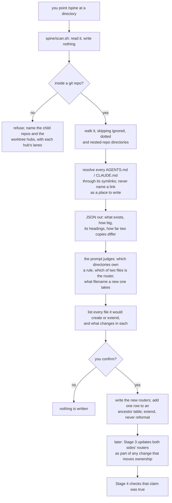

# Completion Report — A router document in every directory that owns a rule

Written for a hostile reviewer: every claim checkable, no claim without evidence.

## What the change actually does



Two things are code: refusing a target outside a git repository, and resolving a write
target through its symlinks. Everything between them is judgement, and the confirm step is
where a person checks it. That split is the whole design — truncating a real router through
a link is the only irreversible mistake available here, so that one operation has
assertions behind it and nothing else pretends to.

## Spec coverage

| Spec item | Origin | Implemented at (file:line) | Validated by |
|-----------|--------|----------------------------|--------------|
| §1 `git init`, `.gitignore`, one baseline commit capturing the repo as it stood | this run | commit `6b8e58a` (37 paths, zero under `spine/`); `.gitignore:1` | `git rev-list --count HEAD` (6 when the gate ran, more since — the gate is `>= 2`); root-commit grep, with a negative control below |
| §2 `protocol/routers.md` — the format, defined once | this run | `protocol/routers.md:1-94`; creation list `:21-49`; root additions `:47-49` | read-through against §2; five reference citations re-checked against the live files |
| §2 guidance for creation, never a conformance test | this run | `protocol/routers.md:12-19` | stated first in the file, ahead of the list it governs; grounded in the reference's own non-conforming `tests/AGENTS.md` |
| §2 no line cap, 22–133 as orientation only | this run | `protocol/routers.md:51-55` | verified against the reference: min 22 (`repair_coordination/`), max 133 (root) |
| §2 navigation order, docstring rung only where the convention exists | this run | `protocol/routers.md:57-63` | reference's own justification re-read at its `AGENTS.md:62` |
| §2 graphify policy, per-clone claim conditional on being true | this run | `protocol/routers.md:65-84` | exercised for real in §7 below: the claim was false here until `.gitignore:2` was added |
| §2 hard rules — no line numbers, no exhaustive lists, no Mermaid | this run | `protocol/routers.md:86-94` | `grep -ril mermaid` over all four written routers returns nothing |
| §3 `spine/scan.sh` — one path in, JSON out, writes nothing anywhere | this run | `spine/scan.sh:1-284` | `spine/test/run.sh`, 44 assertions, exit-code gated |
| §3 refuse a target outside a git repo, naming child repos **and** `.repo.git` hubs with lanes | this run | `spine/scan.sh:72-115`; refusal JSON `:106` | `run.sh` asserts non-zero exit and the exact repo/hub/lane sets |
| §3 resolve every candidate through symlinks; never emit a link path as a write target | this run | `spine/scan.sh:141-176`, `:226-227` | both symlink directions asserted, plus `! test -L` over every write target in a report |
| §3 report size, heading list, and a unified-diff line count for two real files | this run | `spine/scan.sh:120-131` (headings), `:177-190` (diff count) | the two-file fixture shares its first three non-blank lines, so an opening-lines implementation fails the assertion |
| §3 the script chooses nothing between two real files, and never aborts | this run | `spine/scan.sh:177-190`, `:226-227` | asserted for both the differing and the byte-identical fixtures; exercised live against the reference repo, below |
| §3 exclusions: git-ignored, dotted, nested working tree — each reported once, not descended into | this run | `spine/scan.sh:255-270` | `__pycache__`, `node_modules`, an ignored data dir, and a nested checkout each asserted with its reason |
| §3 unmanaged surfaces reported, never read, never written | this run | `spine/scan.sh:169-171` | asserted present in the report and absent from every write target |
| §4 which directories earn a router; the boundary-sentence guard; no ratio or threshold | this run | `protocol/spine.md:84-100` | applied for real in §7 and in both reference calibrations below |
| §4 coverage naming — created routers only, immediate children only | this run | `protocol/spine.md:106-116` | of the 16 non-earning directories in the tree, the four routers name the 11 that are an immediate child of a created router |
| §4 the pointer row — nearest ancestor **that has a directory table**, at any depth | this run | `protocol/spine.md:118-135` | calibration 3 below, the only verification this rule has |
| §4 filenames are stated in the pre-write list, never inferred | this run | `protocol/spine.md:72-76`, `:150` | the §7 confirm step stated `AGENTS.md` and its reason, and the user chose it |
| §5 `protocol/spine.md` — the run sequence, separate from the format | this run | `protocol/spine.md:1-218`; sequence `:16-31` | `install.sh` registers `/spine` in both harnesses |
| §5 `scan.sh` invoked by absolute path | this run | `protocol/spine.md:18-19` | matches how every other wrapper hardcodes the path to this repo |
| §5 the pre-write list, then stop | this run | `protocol/spine.md:144-160` | the §7 run presented all nine items and blocked on the user before writing |
| §5 extend and correct, never reformat | this run | `protocol/spine.md:137-142` | calibration 3: the reference's root router came back byte-identical apart from the one restored row |
| §5 re-running proposes nothing; no stale-reference detection | this run | `protocol/spine.md:162-169` | second scan of this repo finds all four routers, nothing skipped, no gaps |
| §5 the two thin wrappers point at the procedure | this run | `skills/spine/SKILL.md:6`, `codex/prompts/spine.md:1` | `./install.sh` twice — `/spine` registered as skill and prompt, tree unchanged |
| §6 the upkeep rule in Stage 3, before COMPLETION.md is written | this run | `protocol/implementation.md:87-92` | sits between the read-the-diff paragraph and the write-COMPLETION paragraph; names `routers.md` |
| §6 Stage 4 gains the Routers check; its general sweep untouched | this run | `protocol/verification.md:39-41`; general sweep still at `:47-48` | diff is additive; the only removed line is the one that got extended |
| §6 the COMPLETION template gains a Routers **section**, not a table row | this run | `protocol/templates/COMPLETION.md:27-33` | a section, since that file's only table is one row per spec item |
| §7 this repo gets its own routers — root, `protocol/`, `skills/`, `spine/` | this run | `AGENTS.md:1-94`, `protocol/AGENTS.md:1-54`, `skills/AGENTS.md:1-41`, `spine/AGENTS.md:1-47` | exactly four, which is what §7 predicts; each 41–94 lines, inside the reference's range |
| §7 `graphify-out/` added so the per-clone claim is true | this run | `.gitignore:2`; the claim at `AGENTS.md:67-68` | the run added the rule rather than asserting it unverified; surfaced at the confirm step |
| §8 README's Layout tree and Usage block | this run | `README.md:18-21` (new protocol files), `:27-28` (`spine/`), `:31` (`spike/`), `:61-64` and `:76-88` (Usage) | §8 required `spine/` and `spike/`, both present; the tree was since completed with `docs/plans/`, this repo's own routers and `protocol/AGENTS.md`, and the slugs-only claim no longer implies `/adopt` is the sole path-taker |
| §8 `protocol/diagrams.md` gains a router row and stops naming `MAP.md` as the only terminal-read document | **pre-existing** | `protocol/diagrams.md:14`, `:19` | landed before this run; re-verified — the row is present and `:19` reads "MAP.md **and router documents**" |
| §9 all nineteen edge cases | this run | `protocol/spine.md:171-198` | 19 rows, one per §9 row; 8 of them additionally asserted in `run.sh` |
| §10 non-goals that bind implementation | this run | `protocol/spine.md:200-218` | the four standing prohibitions plus the five removed-in-review items; none reintroduced |
| §11 the validation block | this run | run below, with output pasted | all four gates pass; gate 2 shown to be non-tautological |
| §11 fixtures under `mktemp -d`, outside every repo, fresh per run | this run | `spine/test/run.sh:7` and its `trap` | nothing is ever written inside this repo, so no fixture router can be committed or loaded as live guidance |
| §11 `scan.sh` invoked once per case, each case its own target root | this run | `spine/test/run.sh:173-184` | 12 case roots, each scanned separately |

## Validation evidence

### The plan's four gates

```
=== GATE 1: baseline is not the only commit ===
PASS (6 commits)          # at the moment the gate ran; committing this report and
                          # the remediation round added more. The gate asserts >= 2.

=== GATE 2: root commit contains no spine/ path ===
PASS

=== GATE 3: install.sh idempotent, no tree change ===
both runs exit 0
PASS identical output across runs
PASS install.sh changed nothing tracked
claude skill: /adopt
claude skill: /implement
claude skill: /plan
claude skill: /plan-review
claude skill: /spine
claude skill: /verify
codex prompt: /adopt
codex prompt: /implement
codex prompt: /plan
codex prompt: /plan-review
codex prompt: /spine
codex prompt: /verify

=== GATE 4: scanner assertions ===
exit=0
RESULT 44 passed, 0 failed
```

Gate 2 was wrong in four consecutive review rounds, so it was checked in both directions
rather than just run. Applied to the commit that *does* add `spine/`:

```
$ git show --pretty=format: --name-only 799a847 | head -5
spine/scan.sh
spine/test/run.sh
$ if ! git show --pretty=format: --name-only 799a847 | grep -q '^spine/'; then echo "would-PASS => TAUTOLOGY"; else echo "correctly FAILS => gate is real"; fi
correctly FAILS => gate is real

$ ROOT=$(git rev-list --max-parents=0 HEAD)
$ git show --pretty=format: --name-only "$ROOT" | grep -c .
37
$ git show --pretty=format: --name-only "$ROOT" | grep -c '^spine/'
0
```

A first attempt at this negative control used `HEAD~3`, which is a merge commit —
`git show --name-only` prints nothing for a merge by default, so the control reported a
false tautology. The rerun above uses a non-merge commit.

### Calibration 1 — the reference repo, where the answer should be "nothing"

```
$ ./spine/scan.sh ~/src/almanac
directories considered: 65
directories holding a routing file: 20
excluded: 55   ({'git-ignored': 54, 'dotted': 1})

two-real-file directories:
  '.'  realCount=2 identical=False diffLines=136 writeTarget=None
      AGENTS.md   size=8292   headings=7
      CLAUDE.md   size=199    headings=0
      notes: ['two real routing files differ — the prompt must propose which is the router']

skipped: []
unmanaged: []
```

This is the case that killed two earlier designs. The root holds a real 8292-byte
`AGENTS.md` beside a real 199-byte `CLAUDE.md`, and both previous attempts to decide
between them in code refused to run here. The scanner reports both and picks nothing, and
the evidence separates them at a glance: 7 headings against 0. Decision 50's replacement of
opening lines with heading lists is doing real work — these two files' opening lines would
not have distinguished them.

Of the 45 directories without a routing file, **none earn one**: `docs/` and everything
under it is covered by the root router's own row for it, `src/` is the level the reference
deliberately skips, and the ~30 `tests/` directories are covered by `tests/AGENTS.md`'s
Layout table and `tests/invariants/AGENTS.md`. `tests/fixtures/` and `tests/fixtures/writer/`
are tracked and unnamed by their existing router — reported as an observation and **not**
edited, which is the outcome §4 requires. So the run proposes zero new routers and zero
edits, including no extension of the `tests/` Layout table it would otherwise want to
extend. That is the expected outcome.

### Calibration 2 — this repo, from zero

```
$ ./spine/scan.sh "$PWD"
directories considered: 20      routers found: 0
excluded: [('.git', 'dotted')]
unmanaged: none        two-real-file directories: none
```

Four routers proposed and written after confirmation — root, `protocol/`, `skills/`,
`spine/` — which is exactly §7's prediction. `codex/`, `docs/` and `spike/` are named by the
root; `templates/` by `protocol/`; the six command directories by `skills/`; `test/` by
`spine/`. Second scan after writing:

```
  .            writeTarget=AGENTS.md            size=3989
  protocol     writeTarget=protocol/AGENTS.md   size=2995
  skills       writeTarget=skills/AGENTS.md     size=1885
  spine        writeTarget=spine/AGENTS.md      size=2196
routers found: 4      any skipped/two-file dirs: []
```

Every directory that should have a router has one, so a re-run proposes nothing — §5's
re-run rule, checked rather than asserted.

### Calibration 3 — the pointer row, which nothing else verifies

Setup per §11: clone the reference, delete one package's router **and** its row from the
root table. Deleting only the router leaves the row in place and the rule never fires.

```
  router deleted
  root-table row deleted
$ scan → repair_coordination candidates: []   writeTarget: None
```

The nearest ancestor router is `src/almanac/AGENTS.md`, whose only table is
`File | Role` — not a directory table. The nearest ancestor *holding* one is the repo root,
four levels up, which is what decision 52 predicts. Wrote a fresh router from the format
(not a restore of the deleted text) and added the one row:

```
=== VERDICT ===
router recreated: yes
root router byte-identical to the original: YES — nothing else in the file changed
recreated router is a real file, not a link: yes
--- git status ---
 M src/almanac/repair_coordination/AGENTS.md
--- rescan ---
  repair_coordination writeTarget: src/almanac/repair_coordination/AGENTS.md
  total directories with a routing file: 20
```

`git status` no longer lists the root router at all, which is stronger than a diff: the
restored row is byte-exact and nothing else in that 133-line file moved. The throwaway clone
was deleted afterwards; the real reference repo has no router written today (its one
modified router dates from 2026-08-19 and is somebody else's in-flight work).

### Defects the review loop caught, with the lanes' own suite passing

Both were found by reading the code after the lane reported 41/41 green.

**A backslash in a heading produced invalid JSON while the script still exited 0.** The
case arm was `'\\')`, which in a bash `case` matches a two-character string and therefore
never matches the single character being tested. Backslashes reached the output unescaped:

```
$ printf '# trailing backslash \\\n' > AGENTS.md
$ scan.sh . | grep -o 'headings":\[[^]]*\]'
headings":["# trailing backslash \"]
$ python3 -c "import json;json.load(open('/tmp/bad.json'))"
json.decoder.JSONDecodeError: Expecting ',' delimiter: line 2 column 43
```

The trailing backslash escapes the closing quote and the whole document stops parsing —
the worst shape available, since `/spine` would be acting on a failed parse. Fixed at
`spine/scan.sh:27` (`\\)`), and a fixture plus assertion added at
`spine/test/run.sh:165-169`, `:275-279`. Proven to fail against the bug and pass against
the fix:

```
--- suite against the reintroduced bug ---
FAIL escaping stdout is valid JSON
FAIL a backslash, a quote and a tab in a heading survive as valid JSON
RESULT 42 passed, 2 failed        (exit 1)
--- restored ---
RESULT 44 passed, 0 failed
```

**A one-time proof shipped as a permanent test.** The lane's last assertion grepped
`scan.sh`'s own source for `mktemp|touch|mkdir|cp|mv|rm|truncate`. That is a string-absence
gate: it proves nothing about behaviour, breaks on any innocuous rename, and the behavioural
check beside it — hash the fixture tree before and after every scan — already proves the
script writes nothing. Removed, and replaced with an umbrella hash over the entire fixture
tree across all twelve scans (`spine/test/run.sh:171`, `:284-286`), which additionally
catches a write landing beside a case root rather than inside one.

**A latent `set -e` landmine.** `((diff_lines++))` returns exit status 1 when the
pre-increment value is zero, so the first counted diff line would kill the enclosing shell.
It survived only because the function runs inside a command substitution, where bash happens
not to apply errexit; moving that call anywhere else would have broken the diff count
silently. Rewritten as an assignment at `spine/scan.sh:187`.

## Deviations from plan

**A candidate resolving outside the target tree reports `size: null` and `headings: []`
rather than the external file's size and headings.** The Spec says a directory in that state
is skipped and reported and the link is never followed; it does not say whether the external
file is measured. The lane chose not to read it at all, and that is the right reading of
"never follow or repair" — the resolution alone identifies the unsafe condition. Recorded
because it is a real narrowing of what a report contains.

**The JSON schema is fixed by this run, not by the Spec.** §3 states what `scan.sh` must
report but not in what shape. The lead's brief pinned the exact keys, null/empty conventions
and the `AGENTS.md`-first diff ordering, and the same schema block was handed to the lane
writing `protocol/spine.md` so the script and its documentation could not drift. It is
documented at `protocol/spine.md:39-58`. This is the "write the missing decision into the
brief" move Stage 3 endorses, and it is what kept the scanner on the workhorse tier.

**The `/spine` procedure was executed by the lead rather than through the registered
command.** §7's calibration needs `/spine`, which per README does not exist until
`install.sh` has run *and* the session has restarted. Rather than defer the Spec's own
deliverable to a later session, the lead followed `protocol/spine.md` directly — scan,
classify, draft, present the pre-write list, block for confirmation, write. That is what the
slash command does; the wrapper only points at the file. The wrapper's own registration is
verified separately in gate 3.

Nothing else differs. No coverage ratio, denominator, filename inference, reference
extraction or stale-reference detection was reintroduced; no existing routing document was
reformatted or measured against the format; no write happened without confirmation.

## Routers

Four created, none extended, because this repo had none: `AGENTS.md` at the root plus
`protocol/AGENTS.md`, `skills/AGENTS.md` and `spine/AGENTS.md`. They are a Spec deliverable
(§7), not incidental upkeep, and the reasoning per router is in the calibration-2 section
above.

What each leaf makes true, beyond what the root states: `protocol/` owns the rule that
`lanes.md` is the only place a lane invocation lives and a stage document never restates
one; `skills/` owns the rule that a wrapper's frontmatter `description` is trigger text the
harness matches on rather than documentation; `spine/` owns the rule that `scan.sh`
classifies structure and never content, and that no fixture is ever written inside this
repo because both harnesses would load it as live guidance.

The root router's graphify policy asserts that a graph cannot carry a contract because
`graphify-out/` is gitignored. That was false when the router was drafted, so the run added
the rule (`.gitignore:2`) rather than dropping the claim — surfaced at the confirm step and
chosen by the user. This is the conditional the format file describes, exercised on its own
first case.

## Known gaps / residual risks

**Four judgements are checked by a person at the confirm step, not in CI**: does this
directory own a rule, is the boundary sentence real, is the filename right, and which of two
real routing files is the router. This is the plan's stated accepted risk. All four were
exercised for real in this run — three calibrations, one of them a write against a copy of
the reference — but a scripted assertion for any of them would be testing the script rather
than the judgement.

**A heading list and a diff count cannot surface a single changed line inside a shared
section.** Confirmed live: the reference root's two files differ by 136 counted lines and
their heading lists separate them cleanly, but one edited line at the tail of a shared
section is invisible to both signals. A person is told two live routers disagree and by how
much, which is enough to go and look. The plan accepts this.

**`scan.sh` builds JSON with shell string handling rather than a serializer**, because the
Spec's own constraint is that it depend on nothing beyond git, coreutils and diff. The
escaping is now exercised by an assertion covering a backslash, a quote and a tab, and that
assertion is proven to fail against a broken escaper. The residual risk is a byte class
nobody has thought of; the umbrella JSON-validity check across all twelve fixtures is the
backstop.

**The upkeep rule only fires for work routed through this workflow.** Ordinary edits are
covered by the general sweep at `protocol/verification.md:47-48` and by global instructions.
Reaching further would mean a git hook, which is a different change. Plan-accepted.

**`/spine` refuses every target outside a git repository**, which includes all five lane
workspaces on this machine and the workspace-of-workspaces above them. The refusal names the
child repositories, the `.repo.git` hubs and each hub's lanes, so the next command is
obvious. Plan-accepted, and the refusal shape is asserted in the suite.

**Not verified by me:** whether the routers in the atlas repos follow the reference's
shape. `/spine` has not been pointed at any of them. The two repos it has run against are
the reference and this one.

## Remediation rounds

None yet.
