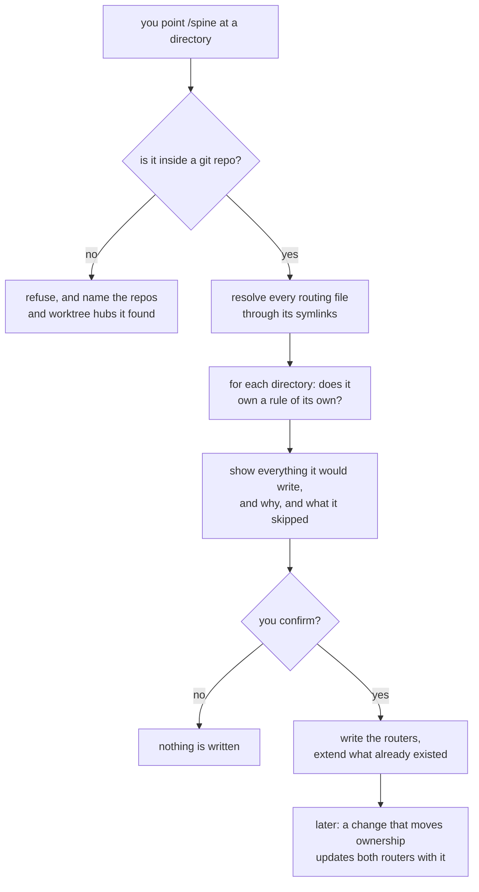

# A router document in every directory that owns a rule

**Idea:** `IDEA.md` — what this is for and why, in plain language. Read it first; it is the
north star this plan serves. Goal and Constraints live there, not here.

Split out of `editable-node-graphs` on 2026-08-22. That plan's Round 1 review found the two
halves share no mechanism, so they ship separately. This half lands first — it brings the repo
under git and ships `spine/scan.sh`, and the sibling plan's `viewer/` router depends on the format
defined here.

## Open Questions

None.

## Watch List

| # | Noticed | What needs looking into | Raised to user? | Outcome |
|---|---------|-------------------------|-----------------|---------|
| 1 | 2026-08-22 | Repos may carry routing documents under names beyond `AGENTS.md`/`CLAUDE.md` — graphify's CLI can write `.cursorrules`, `GEMINI.md`, `.github/copilot-instructions.md` and others. Unchecked. | no | folded into the Spec's detection step, which reads the repo rather than assuming two names |
| 2 | 2026-08-22 | This repo is not under git, so nothing here has a revert path. | yes | settled — `git init` moved into this plan under decision 22, since it now ships a script and lands first |

## Decision Log

| # | Decision | Rationale | Source |
|---|----------|-----------|--------|
| 53 | **A heading list is a human-readable summary, not a byte-faithful channel.** The scan does not promise that two files render distinguishably. A candidate **whose headings** carry bytes that cannot be represented is flagged in its directory's notes and its heading list declared unreliable. Scoped to the heading list because that is what the report carries: a malformed byte elsewhere in the file changes nothing the report says, since sizes are byte counts and the diff line count is computed by `diff` itself. NUL is flagged separately, wherever it appears, because bash drops it before any rendering | Three remediation rounds went into chasing a fidelity guarantee the Spec never asked for. Two encodings were claimed collision-free and both were wrong: `\xHH` collided with text spelling it out, and U+FFFD collides with itself because it is ordinary valid UTF-8. The heading list exists to tell a real 8292-byte router from a 199-byte pointer beside it — both ordinary markdown. A corrupted router is a file to flag, not one to transcribe faithfully, and the flag is machinery the NUL case already needed | user (verification round 3) |
| 1 | Routers are the spine; graphify is an opt-in supplement and never the source for "where does X live" or "what owns Y" | Already settled and written down in almanac's root `AGENTS.md`: `graphify-out/` is gitignored so it is per-clone and cannot carry a contract, and a point-in-time snapshot misroutes silently once stale | user |
| 2 | Router documents follow almanac's shape — title, owned-by, one organizing idea, flow, file/role table, boundaries, test pointers | It is the reference implementation, proven across 20 directories | user |
| 3 | No line numbers and no exhaustive file lists | almanac's own maintenance section names this as the staleness failure it designed out | defaulted |
| 4 | Both a backfill command (`/spine <path>`) and folded-in upkeep | Different problems: one-time coverage versus stopping rot | user |
| 5 | `/spine` is documentation-only — no plan, no review gate — but lists every file it will create or extend, and what changes in each, before writing | A repo-wide pass writing a dozen router files unsupervised is the risk; a confirm step costs one turn | defaulted |
| 6 | `/spine` writes a graphify-policy section into every root router it creates | The graphify skill's query-first default is global, and a per-repo root router is the only thing that overrides it in practice today | defaulted |
| 7 | Never write to a hardcoded filename. Resolve what already exists, edit the real file behind any symlink, and follow the repo's own dominant convention when creating | Verified: `atlas-engine/CLAUDE.md → AGENTS.md`, `src/work/AGENTS.md → CLAUDE.md` (inverse), almanac uses a real root `CLAUDE.md` pointer. A fixed filename truncates a real router through a link | review-round-1 |
| 8 | A directory earns a router when it has a rule of its own, not when it groups files | Verified: almanac's `tests/` tree is 33 directories with 2 routers. A blocklist rule yields ~31 there, which is the outcome the idea rules out | review-round-1 |
| 9 | The upkeep step is **added to** `protocol/implementation.md`'s "Integration and exit" section; it does not exist today | Verified: that file has three sections (Lead role, Lanes, Integration and exit) and no documentation sweep. The sweep the original Spec referred to lives in the global `CLAUDE.md`, which is a different surface from this workflow's protocol | review-round-1 |
| 10 | Fixture routers live in a directory created outside the repo at test time, never committed | Both harnesses load `AGENTS.md`/`CLAUDE.md` hierarchically, so a committed fixture becomes live guidance for any agent working in that subtree | review-round-1 |
| 12 | `/spine` refuses a lane workspace root and names the lanes it found. It takes a path to a working tree; a workspace root is not one | Detecting `.repo.git`, or `LANES.md` beside lane directories, or a top-level document declaring itself a workspace router, is a couple of lines and makes the destructive case impossible. Walking in would mean deciding which branches get a router none of them asked for — a branching question, not a router question | user (review-round-1) |
| 13 | Supersedes decision 9. The upkeep step **extends** the existing sweep at `protocol/verification.md:45`; it does not create a new gate in Stage 3 | Decision 9's premise was wrong. That line already reads "Sweep docs the change made stale (CLAUDE.md/AGENTS.md, repo skills, touched docs) before any PR opens." A second gate two stages earlier would leave a worker with two overlapping instructions and neither marked authoritative | review-round-1 |
| 14 | `Owned by` links the **nearest ancestor router**, not a literal `../`, and a directory never earns a router because a descendant does | almanac has no `src/AGENTS.md` while `src/almanac/AGENTS.md:3` links `../../AGENTS.md`. The old rule would have forced a router at `src/`, producing the router-per-folder outcome the idea rules out | review-round-1 |
| 15 | The leaf format's elements are guidance for a router being **created**, never a conformance test applied to one that exists. `Owned by` is included only when an ancestor router exists | `Owned by` appears in 1 of the 20 reference routers, so the mandatory version was generalized from n=1 — and applied as a test it would flag the exemplar's own `tests/AGENTS.md` as non-conforming | review-round-1 |
| 16 | No line cap. Observed range in the reference is 22-133 lines and is stated as orientation only | The 20-100 rule was failed by the reference root router at 133 lines, while root routers are required to carry strictly more than leaves. A worker would have written a cap the exemplar fails or dropped required sections | review-round-1 |
| 17 | A new router takes the filename of its nearest ancestor router's real file, falling back to `AGENTS.md` | Replaces a repo-wide filename count, which had no boundary outside a git repo and gave the wrong answer where both symlink directions coexist: in `atlas-api` the count reads CLAUDE.md 2-1, so new leaves would get the opposite name from the root | review-round-1 |
| 18 | Two real, differing routers at a repo root stops the whole run, not just that directory | Verified on `work/beacon`: `AGENTS.md` (7088 bytes) and `CLAUDE.md` (8925 bytes) both real and differing. Skipping only that directory orphans every child's `Owned by` link | review-round-1 |
| 19 | The deterministic half of `/spine` is a script the prompt calls: `spine/scan.sh`. Detection, `realpath` resolution, filename inheritance, exclusion, the coverage ratio and the workspace verdict are all code with real assertions. The prompt keeps only judgment and prose | The single irreversible failure — truncating a real router through a symlink — was left to prompt discipline, and the Spec's own assertions (`test -L` passes, `realpath` unchanged) are script assertions handed to a human to eyeball | review-round-1 |
| 20 | Exclusions come from `git check-ignore` plus dotted directories, with the explicit list as fallback outside a git repo | The hand-maintained list omitted `.venv`, `.git`, dotdirs and `graphify-out/`, leaving the coverage ratio's denominator set by how much fixture data a repo happens to carry | review-round-1 |
| 21 | A skipped directory must be named by the router that covers it, and that router gains a line for it | This is the mechanism the reference uses to hold 2 routers across 33 test directories: `almanac/tests/AGENTS.md:11-23` is a Layout table naming every non-earning child in one line each. Without it a skipped directory vanishes from the deliverable | review-round-1 |
| 22 | `git init` moves to this plan, which lands first, and it creates `.gitignore`. The sibling plan appends to it | This plan now ships a script, so it is no longer markdown-only and its "exposure is small" rationale no longer holds. The repo becoming a git repo belongs to whichever change lands first | review-round-1 |
| 52 | Two rules, separated. **Coverage naming**: a created router names its *immediate* children that earned none. **The pointer row**: the nearest ancestor router *that has a directory table* gains a row, at whatever depth | Conflating them broke the exception — `src/almanac/AGENTS.md` has no directory table, so a strict nearest-ancestor reading routed the row nowhere. The reference root table lists a path four levels deep, so a directory table is about reachability, not adjacency; the immediate-only guard belonged to the other rule | review-round-6 |
| 50 | For a directory holding two real routing files, `scan.sh` reports each file's size, its **heading list**, and a unified-diff line count between them — not its opening lines | Verified that opening lines carry no signal in the one case this exists for: beacon's two routers open identically and differ by 35 insertions deeper in. Headings plus a diff count let the prompt say which is the superset and name what disagrees, so the confirm step is a real gate rather than a rubber stamp | review-round-5 |
| 51 | `scan.sh` excludes any directory that is a git working tree distinct from the target's — `git -C <dir> rev-parse --show-toplevel` differing from the target's toplevel — and reports each as a nested repository, not a candidate | Deleting the container predicate removed a guard along with dead code. A tracked submodule is neither git-ignored nor dotted, so nothing stopped the walk crossing into another repository and proposing routers there, against §10's binding non-goal | review-round-5 |
| 47 | The §4 exception is verified by a **calibration run**, not by `run.sh`: a copy of almanac with one package's router deleted, where `/spine` must recreate it and restore the root table's row, changing nothing else | Asserting it in `run.sh` is impossible — it needs a write and a judgment, and `scan.sh` writes nothing. Neither existing calibration exercised the exception | review-round-5 |
| 48 | The refusal message names child directories that are **either** a git repository **or** a worktree hub carrying `.repo.git`, and for a hub it names the lanes inside | Verified: the 5 hubs under `~/src/work` holding the real targets are not git repositories, so naming only repositories omits the half a person needs | review-round-5 |
| 49 | Supersedes 41. `scan.sh` never chooses between two real files, byte-identical or not; it reports both and the prompt proposes | 41 predates 42 and survived it, leaving §11 requiring a choice §3 forbids | review-round-5 |
| 46 | An existing root router **gains a row** pointing at a router `/spine` creates, when that router already has a directory table. Nothing else in the file changes | Settles Q1. A table that omits a router which now exists is factually wrong, and correcting facts is the one edit to an existing router §5 already permits. It is also the only option that keeps IDEA.md's promise that existing routing documents end up improved — and atlas-engine, atlas-infra and atlas-api are all partially covered, so this is the normal case | user (review-round-4) |
| 42 | Pointer recognition and the conflict abort are both **removed**. `scan.sh` reports each candidate with its size and opening lines; the prompt judges which file is the router; the pre-write list states the choice and the person confirms | Two attempts at encoding this in the script both aborted on the calibration repo. Whether a file contains a router or points at one is a judgment, and the plan's own architecture puts judgment in the prompt behind a confirm step | review-round-4 |
| 43 | The container predicate is **removed**. The git-repo requirement already refuses every live container shape; when that check fails, the message notes whether the immediate children are repositories and names them | Verified that `~/src/work` and `~/src/work/atlas-engine` are both outside a git repo, so the predicate had no population left except submodule parents, which it would wrongly refuse. Deleting beats fixing a quantifier for a case that cannot occur | review-round-4 |
| 44 | `scan.sh` now has **one** job: resolve every candidate through symlinks and never emit a link path as a write target. §11 asserts only what it emits | Both lanes found validation asserting a classification the script does not perform. One job, asserted exactly, is the shape that stops this recurring | review-round-4 |
| 45 | The graphify policy section states the gitignore fact **only when it is true**, and `/spine` adds `graphify-out/` to `.gitignore` when it is missing, or omits the claim | A documentation-only command was being told to assert a contract it never verified — and this repo's own `.gitignore`, created in §1 with only `node_modules/`, would have made §7's root router false on arrival | review-round-4 |
| 38 | Neither plan writes `viewer/`'s router. Once `viewer/` exists, a `/spine` run covers it | The sibling's north star disclaims router production and §7 here runs before that directory exists, so assigning it to either plan contradicts something. Covering it with the command afterwards is what the command is for, and it keeps both plans' non-goals intact | review-round-3 |
| 39 | A pointer document has an exact grammar: after stripping blank lines and headings, its entire content is a single line whose only substance is a reference to the other candidate file in the same directory. Nothing about length | \"Roughly fifteen lines\" and \"essentially a link\" are not implementable, and this predicate decides whether the scanner edits a target or aborts — the one place in the script where being wrong is destructive | review-round-3 |
| 40 | The file-to-role table names the directory's entry points and the files carrying a constraint — not every file | §2 required one line per file while also prohibiting exhaustive lists for large packages, which cannot both hold. Naming what a reader must know is the rule the reference actually follows | review-round-3 |
| 41 | *Superseded by 49.* Two byte-identical real routing files were to be resolved to `AGENTS.md` by the script | Identical content means no information is lost by choosing one | review-round-3 |
| 30 | **Scope cut, user decision at the three-round cap.** The coverage ratio, the denominator machinery, filename inheritance, per-router reference extraction and stale-reference detection are all removed. `spine/scan.sh` keeps two jobs: resolve the write target through symlinks, and refuse a container directory | The ratio produced a defect in each of three rounds, and four of this round's nine substantive findings are defects inside the reporting half. `protocol/plan-review.md` treats review that will not converge in three rounds as an unresolved fork rather than grounds for another round, and this was it | user (review-round-3) |
| 31 | Supersedes decision 17. There is no filename inheritance. The pre-write list states the filename it will use and why; the confirm step settles it | Verified that inheritance produces the wrong answer at the one place it matters: `src/work/CLAUDE.md` documents that the symlink direction inverts below it, so inheriting from that ancestor names every child repo's router backwards. The guessing existed to avoid asking a question the confirm step asks anyway | user (review-round-3) |
| 32 | Container refusal uses a structural predicate — a directory whose immediate children are themselves git repositories or worktree hubs — not a string match on a title | Verified: `src/work` has no `.repo.git`, no `LANES.md`, and a title that does not match the string the old rule sought, so `/spine` would have walked 11 directories and written through the symlink its own router warns about | user (review-round-3) |
| 33 | The coverage-naming rule applies only to routers `/spine` **creates**, and names **immediate children** only. For an existing router an unnamed child is reported as an observation, never an edit | Resolves the blocking contradiction with \"an existing router is never measured against the format\", and matches the reference, where the root names `docs/` and nothing beneath it | review-round-3 |
| 34 | `/spine` requires the target to be inside a git repository. Exclusions are `git check-ignore` plus dotted directories; the explicit fallback list is removed | The fallback branch had no fixture and no assertion, and requiring git removes the branch rather than testing it. §1 brings this repo under git before its own routers are written | review-round-3 |
| 35 | Procedure and format are separate files: `protocol/spine.md` holds the run sequence, `protocol/routers.md` the format. Wrappers point at the procedure | Every existing wrapper points at a procedure file — `skills/plan/SKILL.md` at `planning.md`, `skills/verify/SKILL.md` at `verification.md`. The run sequence had nowhere to live | review-round-3 |
| 36 | `scan.sh` is invoked by absolute path | `/spine` runs with a foreign repo as cwd, so a relative path resolves nowhere. Matches how every skill hardcodes the absolute path to this repo | review-round-3 |
| 37 | A conflict at the target root aborts the run and names both files and which to consolidate; a conflict deeper skips that directory and reports it | The rule was scoped to the target root only, leaving depth unspecified — and beacon's 150-line `AGENTS.md` against its 184-line `CLAUDE.md` is the ordinary copy-then-drift case, which deserves a remedy rather than a bare refusal | review-round-3 |
| 23 | A **pointer document** is recognized before the conflict check: a routing file under ~15 lines whose content is essentially a link to another routing document in the same directory. The target is the router; the pointer is left untouched. Only two *substantive* differing files abort the run | Verified: almanac's root has a real 8292-byte `AGENTS.md` and a real 199-byte `CLAUDE.md` pointing at it. Without this step the abort rule refuses to run on the plan's own calibration repo | review-round-2 |
| 24 | **Excluded** and **covered** are separate categories. Excluded directories are never considered and are outside the coverage denominator. Covered directories are considered, count in the denominator, earn no router, and must be named in their nearest ancestor router's coverage list | The old Spec required a grouping directory to be both named by its covering router and absent from the denominator, which is impossible. Caches and build output are excluded; a directory that merely groups files is covered | review-round-2 |
| 25 | The candidate set is exactly `AGENTS.md`, `CLAUDE.md`, and any filename already used as a router elsewhere in the target tree. Other tools' surfaces — `.cursorrules`, `GEMINI.md`, `.github/copilot-instructions.md`, `.kiro/` — are neither read nor written, and an existing one is reported in the pre-write list as an unmanaged surface | "Every candidate" was undefined, and the dotted-directory exclusion silently made `.github/` unreachable. Naming the boundary makes that a stated scope decision rather than an accident | review-round-2 |
| 26 | `scan.sh` also emits, per existing router, the file paths and child directory names it references | The re-run rule needs stale references and missing coverage lines detected deterministically; without this output that detection falls back into the prompt, contradicting the split | review-round-2 |
| 27 | Supersedes decision 13. The upkeep rule lands in **Stage 3** (`protocol/implementation.md`, Integration and exit, before COMPLETION.md is written) **and** the Stage 4 verifier confirms it. Both, with different jobs | Verified: `implementation.md:87-93` writes COMPLETION.md and hands off, while `verification.md:45` runs only after PASS. Decision 13 moved the rule wholesale to Stage 4, leaving the implementer with a template row and no rule behind it | review-round-2 |
| 28 | Fixtures live in a `mktemp -d` tree under the system temp directory, outside every repo. `spine/test/.tmp/` is dropped, along with its `.gitignore` entry | The Spec asserted both locations. One had to go, and outside-every-repo is the one that keeps a fixture router from ever being loaded as live guidance | review-round-2 |
| 29 | This repo gets its own routers as a Spec deliverable: a root router plus `protocol/` and `skills/`, produced by running `/spine` here after install. That run is the real calibration | IDEA.md names this repo's routerlessness as part of the problem, and the Spec built the tooling without ever pointing it at the repo it lives in | review-round-2 |
| 11 | The module-docstring rung is included in a root router's navigation order only when the repo actually has that convention | almanac justifies it on "~86% of modules in `src/`" carrying constraint docstrings — something that repo built deliberately, not a general property | review-round-1 |

## Spec

Three deliverables: a format definition, a scan script plus the command that drives it, and an
upkeep line added to an existing sweep.



The diagram restates the sections below and carries nothing they do not. The two steps in code are
resolving symlinks and refusing a non-repo; everything between them is judgement, checked by you at the
confirm step.

### 1. `git init` first

Before anything else, `git init` and one commit capturing the repo exactly as it stands —
`protocol/`, `skills/`, `codex/prompts/`, `docs/plans/`, `spike/`, `install.sh` and `README.md`. That is the revert point. Create `.gitignore`
holding `node_modules/`; the sibling plan appends its own entries. No test fixture path is
gitignored, because no fixture is ever written inside the repo.

This plan owns it because it lands first and is the first to ship executable code.

### 2. `protocol/routers.md` — the format, defined once

Both the command and the upkeep step read the format from here.

A router being **created** carries:

- A title naming the directory and what it is, in one line.
- A link to the **nearest ancestor router**, when one exists. Not a literal `../` — the nearest
  ancestor that actually has a router, which may be several levels up.
- One organizing idea, stated as a rule the directory obeys.
- The flow as a plain arrow chain in a fenced block, when the directory has one. **Never Mermaid** —
  routers are read in terminals, which is the general rule `protocol/diagrams.md` already states for
  terminal surfaces. That file's table gains a router row so the two cannot drift.
- A file-to-role table naming the directory's **entry points and the files that carry a
  constraint** — not every file. One line each, giving the constraint rather than the
  implementation. This is what keeps the table from becoming the exhaustive list the hard rules
  below prohibit; a package of forty files gets the handful a reader must know about.
- Boundaries: what must never happen here, each with its reason.
- A line for each child directory that does not have its own router (see section 4).
- Test pointers.

A **root** router additionally carries the concept that explains the layout, a
directory-to-router table, the navigation order, a graphify policy section, and verification
commands.

**These are guidance for creation, never a conformance test.** An existing router is never
measured against this list. The reference's own `tests/AGENTS.md` has no ancestor link, no single
stated organizing idea, titles its boundaries "Rules", and leads with commands — and it is
correct as it stands. A `/spine` run must not want to "fix" it.

No line cap. The reference runs 22 to 133 lines; that range is orientation, not a rule.

The navigation order is `router → grep → graphify last`. A module-docstring rung is inserted only
where the repo has that convention, evidenced by a count the router states.

The graphify policy section states that routers are the spine and graphify an opt-in supplement;
that it must never answer "where does X live" or "what owns Y"; that a stale graph misroutes
silently; and that it earns its place only on blast radius, distance between far-apart concepts, and
community structure, every result confirmed in source.

The per-clone claim is **conditional on being true**. `graphify-out/` is gitignored in
almanac but not everywhere, and `/spine` is documentation-only. So either it adds
`graphify-out/` to the repo's `.gitignore` as part of the run — surfaced in the pre-write list like
any other change — or it omits the sentence. It never asserts an ignore rule it did not verify. This
repo is the live example: §1 creates a `.gitignore` holding only `node_modules/`, so a root router
claiming otherwise would be false on arrival.

Hard rules that remain: no line numbers, no exhaustive file lists for large packages, ownership
and boundaries rather than implementation.

### 3. `spine/scan.sh` — the one thing that must not be guessed

Writing through a symlink and truncating a real router is the only irreversible mistake here, so that
one operation is code with assertions. Everything else is the prompt's, checked by a person at the
confirm step. The script takes a path, writes JSON to stdout, and writes nothing anywhere. It is
invoked by absolute path —
`~/src/wheelchair/spine/scan.sh` — because `/spine` runs with a
foreign repo as its working directory, the same way every skill hardcodes the absolute path to
`protocol/`.

**Its job.** For each directory, resolve every candidate routing document with `realpath` and report:
which candidates exist, which are symlinks, where each resolves, the size of each real file, and its
**heading list**.

The heading list is a **human-readable summary, not a byte-faithful channel** (decision 53). It is
there so the prompt can tell a real router from a pointer beside it — a superset against three lines
of prose — and both of those are ordinary markdown. The scan does not promise that any two files
render distinguishably. A candidate whose content carries bytes that cannot be represented, meaning
NUL or malformed UTF-8, is flagged in its directory's notes and its heading list declared unreliable;
the reader is told to go and look rather than handed a rendering that quietly lost the difference. Where a directory holds two real files, also report a unified-diff line count between
them. A link path is **never** emitted as a write target.

Headings and a diff count rather than opening lines, because opening lines are exactly what fails on the
case this evidence exists for: beacon's `AGENTS.md` and `CLAUDE.md` share byte-identical first three
non-blank lines and differ by 35 insertions further down. A heading list shows which file is the superset
and where the extra material sits; a diff count shows how far apart they are. Together they let the
prompt propose an answer a person can check, which is the whole justification for moving that judgment
out of the script. That is the whole
contract, and §11 asserts exactly it.

The candidate set is `AGENTS.md` and `CLAUDE.md`. Other tools' surfaces are neither read nor written;
where one is reachable it is reported as an **unmanaged surface** so a person knows it may drift.
`.github/copilot-instructions.md` and `.kiro/` are not reachable, because dotted directories are
excluded from the walk — a stated scope decision, and the report does not claim to cover them.

**What it deliberately does not do.** It does not decide which of two real files is the router, and it
does not abort on finding two. Encoding that judgment was tried twice — a substantive-versus-pointer
distinction, then an exact length-and-content grammar — and both aborted on almanac, whose
root holds a real 8292-byte `AGENTS.md` beside a real 199-byte `CLAUDE.md` that is three lines of
prose around a link. Whether a file *contains* a router or *points at* one is a judgment. The script
reports both with sizes, heading lists and a diff count; the prompt says which it believes is the router
and why;
the pre-write list carries that choice and the person confirms it. beacon — a 7088-byte `AGENTS.md`
against an 8925-byte `CLAUDE.md`, one a near-superset of the other — is handled the same way, as a
judgment surfaced for confirmation rather than a refusal.

**Exclusions.** `git check-ignore`, dotted directories, and **any directory that is a git working tree
distinct from the target's** — compared by `git -C <dir> rev-parse --show-toplevel` against the target's
toplevel. Each is reported as a nested repository rather than as a candidate. A tracked submodule is
neither ignored nor dotted, so without this the walk crosses into another repository and proposes routers
inside it, which §10 forbids. Deleting the container predicate removed this guard along with the dead
code around it. `/spine` requires the target to be inside a
git repository. When that check fails it names every immediate child that is **either a git
repository or a worktree hub carrying `.repo.git`**, and for a hub it names the lanes inside. Both
halves matter: of `~/src/work`'s twelve children, five are repositories and five are hubs, and it
is the hubs — `atlas-api`, `atlas-data`, `atlas-engine`, `atlas-infra`,
`atlas-intel` — that hold the real targets. Naming only repositories omits exactly the
half a person needs. `~/src/work` and `~/src/work/atlas-engine` are both outside any git
repo; `atlas-engine/development` is a worktree and resolves.
There is no separate container predicate: the git requirement already covers every live shape, and a
predicate over "children are repos" would wrongly refuse an ordinary repository containing a
submodule.

Nothing else. No coverage ratio, no denominator, no filename inference, no reference extraction, no
pointer grammar and no conflict abort — decisions 30, 42 and 43.

### 4. Which directories get a router

A directory earns one when it **has a rule of its own** — a boundary a reader must know before
editing there, an ownership claim, or a convention differing from its parent. A directory that
merely groups files does not, and a directory never earns one because a descendant did.

That judgment is the prompt's, and the confirm step is where it is checked. For each proposed
router, the pre-write list states **the one boundary sentence the parent does not already state**.
A proposal that cannot produce that sentence is not a router. This is the whole guard — there is no
ratio, no threshold, and no second mechanism.

**Coverage naming, for created routers only.** A router `/spine` creates names its **immediate**
child directories that did not earn their own, one line each — the mechanism the reference uses to
hold 2 routers across 33 test directories, where `tests/AGENTS.md` carries a Layout table of its
children. Immediate only: `almanac/AGENTS.md` names `docs/` and nothing beneath it, though
`docs/` holds ten tracked descendants.

For an **existing** router, a child that earned no router is reported as an observation and never
edited in. `tests/AGENTS.md` names eight children while `tests/fixtures/` and `tests/fixtures/writer/`
are tracked and unnamed; adding those would be measuring an existing file against the format, which §2
forbids. Surfacing and leaving alone is the resolution.

**One exception, and it is narrow.** When `/spine` creates a router, the nearest ancestor router **that
has a directory table** gains a row pointing at it. Depth is not a constraint here and must not be: the
reference's own root table lists `src/almanac/records/timeline/`, four levels down,
because a directory table exists for reachability from the entry point rather than to describe adjacency.
That is a different job from the coverage naming above, which is immediate-only. Conflating the two
routed the row nowhere — `src/almanac/AGENTS.md` has no directory table, only a `File | Role`
one, so every package beneath it would have been reported as an omission instead.

Where no ancestor has a table, the omission is reported and nothing is edited. Inventing a table would be
reformatting.

In the reference this is unambiguous rather than merely well-defined: across all 20 routers the only
directory tables are the root's, `tests/AGENTS.md` and `tests/invariants/AGENTS.md`, so for any package
under `src/` the nearest ancestor holding one is the root itself. Not a rewrite, not a reformat, not a
coverage audit — one row naming a file that now exists. A table omitting a router which is present is
factually wrong, and §5 already permits correcting facts. Without this a created router is unreachable
from the entry point, which breaks IDEA.md's promise that existing routing documents end up improved.

The guard: the row is added only when the ancestor already has such a table, only pointing at a router
this run created, and **nothing else in the file changes**. If there is no table, the omission is
reported instead — inventing one would be reformatting.

**Filenames.** Nothing is inferred. The pre-write list states the filename each new router will use
and why, and the confirm step settles it. Inheriting from the nearest ancestor was tried and
removed: `src/work/CLAUDE.md` states that the symlink direction inverts below it, so
inheritance names every child repo's router backwards — and the guess existed only to avoid asking
a question the confirm step already asks.

### 5. `/spine <path>` — the command

Procedure and format live in separate files, the way every existing command already works:
`protocol/spine.md` holds the run sequence, `protocol/routers.md` the format. `skills/spine/SKILL.md`
and `codex/prompts/spine.md` are thin pointers to the **procedure** — `skills/plan/SKILL.md` points
at `planning.md`, `skills/verify/SKILL.md` at `verification.md`, and the run sequence otherwise has
nowhere to live. It takes a path, not a slug, and is outside the plan `status:` state machine.

Sequence: run `scan.sh` by absolute path; stop if it aborted; classify each candidate directory
against section 4; draft what it would write; present the full list — files to create or extend,
the change in each, the boundary sentence per proposal, the filename chosen for each new router and
why, **which candidate it believes is the router in any directory holding two, and why**, every
directory not earning one, any unmanaged surface, and any row it will add to an ancestor table — and
stop.
Nothing is written until a person confirms.

Existing content is **extended and corrected, never reformatted**. The only permitted edits to an
existing file are additions and factual corrections. Reordering sections, rewriting prose that is
still true, and normalizing toward section 2's shape are all out of scope.

**Re-running on a covered repo** proposes nothing unless a directory now lacks a router it should
have. Detecting stale references inside existing routers is not attempted: the extraction had no
resolution rule and false-fired on the reference repo, where `tests/invariants/AGENTS.md` names
paths in a Source column that do not resolve against its own directory. A router going stale is
caught by the upkeep step at the moment the change is made, which is where it belongs.

### 6. Upkeep

The rule lands in **two** places because they do different jobs, and putting it in only one leaves
a hole. `protocol/implementation.md:87-93` writes COMPLETION.md and hands off to Stage 4, while the
existing sweep at `protocol/verification.md:45` — "Sweep docs the change made stale
(CLAUDE.md/AGENTS.md, repo skills, touched docs) before any PR opens" — runs only after PASS. So an
implementer given only the Stage 4 hook fills in a template row for a rule they were never told.

**Stage 3**, in `protocol/implementation.md`'s Integration and exit, *before* COMPLETION.md is
written — this is the rule an implementer acts on, and it names `protocol/routers.md` so they can
see what a router should look like:

> A change that moves ownership between directories updates the routers on both sides as part of
> this change. A change that adds or removes a file updates that directory's router only if it
> changes what the directory owns, or if the router named that file. A router that is now false is
> fixed here.

**Stage 4** keeps its existing general sweep untouched and gains one check: that the **Routers
section** in COMPLETION.md is true. The general sweep at `verification.md:45` still covers documentation broadly;
this adds a specific check rather than replacing it.

Two files carry the record. `protocol/templates/COMPLETION.md` gains a short **Routers** section —
not a row in its Spec-coverage table, whose rows are one per spec item — because
`protocol/implementation.md:88` tells lanes to write from that template and editing prose alone
would leave every future completion without it. And `protocol/verification.md`'s verifier brief
gains the corresponding check.

### 7. This repo gets its own routers

IDEA.md names this repo's routerlessness as part of the problem, so the Spec closes it rather than
building tooling and pointing it only at someone else's tree. After install, `/spine` runs here and
lands a root router plus one each for `protocol/`, `skills/` and `spine/`. `viewer/` is not covered here —
it does not exist yet, and the sibling plan disclaims router production, so a later `/spine` run
covers it once that directory lands. That is the command doing its job rather than either plan
reaching outside its own scope — `protocol/` is described by
README as the single source of truth for the stage definitions, and `skills/` owns the wrapper
convention, so both hold rules of their own. `codex/prompts/` is covered by the root, not given its
own.

`spike/` is throwaway and its own README says so, so it earns no router; `docs/` holds plans, not
decisions. `spine/` **does** earn one — it holds `scan.sh`, whose contract is a rule of its own — so the
calibration expects **four** routers here, not three. All of it is named in the pre-write list rather than
silently omitted, and a run producing a different set is a failed calibration rather than a judgement call
for whoever is watching.

That run is the real calibration. Running against almanac only proves `/spine` proposes
approximately nothing on an already-covered tree; running here proves it produces something correct
from zero.

### 8. Also updated

`README.md`'s Layout block is a top-level tree that enumerates every `protocol/*.md`, and its Usage
block lists every command including the assertion that "The four stage commands take slugs only" —
which `/spine`, taking a path, contradicts. Both are updated, and the tree gains the new top-level
`spine/` directory alongside `protocol/`, `skills/` and `codex/prompts/`, and `spike/` is listed with
a one-line note that it is throwaway.

`protocol/diagrams.md`'s table gains a row for routers: plain-text arrow chain, never Mermaid.

### 9. Edge cases

| Case | Behavior |
|---|---|
| Target is not inside a git repository | Refuse, naming every immediate child that is a git repository **or** a `.repo.git` hub, with each hub's lanes listed. This is the workspace-root case |
| `CLAUDE.md` is a symlink to `AGENTS.md` | `AGENTS.md` is the write target; the link is untouched |
| `AGENTS.md` is a symlink to `CLAUDE.md` | `CLAUDE.md` is the write target; the link is untouched |
| Two real routing files in one directory | Both reported with sizes, heading lists and a unified-diff line count. The prompt proposes which is the router and why; the person confirms. Never an abort |
| Two byte-identical routing files in one directory | Reported as a duplicate for consolidation. The script picks nothing |
| A nested git working tree or submodule inside the target | Excluded from the walk and reported as a nested repository. Never a candidate |
| Symlink broken, or resolving outside the target tree | Skip the directory and report. Never follow or repair |
| Existing router in a foreign style | Additions and factual corrections only. Never reformatted, never measured against the format |
| Existing router omits a child that earned no router | Reported as an observation. Not edited |
| Existing ancestor router has a directory table and `/spine` creates a router below it | One row added pointing at the new router. Nothing else in the file changes |
| Existing ancestor router has no directory table | Reported, not edited. Adding a table would be reformatting |
| Directory owns no rule | Earns no router. Named by the router `/spine` creates above it, if it creates one |
| Directory is excluded (git-ignored or dotted) | Not considered, reported with its reason |
| A reachable unmanaged surface (`GEMINI.md`, `.cursorrules`) | Reported. Never read, never written |
| Nearest ancestor router is several levels up | That is the link target. No intermediate router is created |
| No ancestor router anywhere | The root gets one first, so children have something to link |
| Filename for a new router | Stated in the pre-write list with its reasoning. Never inferred |
| `graphify-out/` not gitignored in the target | Add the rule as part of the run, or omit the per-clone sentence. Never assert it unverified |
| Second run on a covered repo | Empty write list unless a directory now lacks a router it should have |

### 10. Non-goals that bind implementation

No rewriting or reformatting existing routing documents. No conformance-testing an existing router
against section 2. No editing one to add a child that earned no router — the single permitted edit is §4's
exception: one row in the table of the nearest ancestor router **that has a directory table**, pointing at
a router this run created. Not the nearest ancestor router — the nearest one holding a table, which in the
reference is the repo root for every package under `src/`. No router in a directory that only
groups files. No line numbers, exhaustive file lists, or Mermaid in a router. No unattended writes.
No walking into a container or lane workspace. No work on diagrams or the graph viewer, which is the
sibling plan.

Explicitly removed in Round 3 and not to be reintroduced: a coverage ratio or any threshold on how
many routers a tree should have; a denominator distinction between excluded and covered directories;
filename inference from an ancestor router; extraction of the paths and children an existing router
mentions; and stale-reference detection on a re-run. Each existed to enrich a report, and between
them they produced a defect in all three review rounds.

### 11. Validation

```bash
test $(git rev-list --count HEAD) -ge 2                      # baseline is not the only commit
! git show --pretty=format: --name-only $(git rev-list --max-parents=0 HEAD) | grep -q '^spine/'
./install.sh && ./install.sh                                # idempotent; git status --porcelain empty
bash spine/test/run.sh                                      # exit-code-gated assertions
```

The history shape is asserted rather than eyeballed: more than one commit, and no `spine/` path in the
root commit. The negation and the `--pretty=format:` both matter — `grep -qv` succeeds on commit
metadata whatever the paths are, which is why this line was wrong in three consecutive rounds.

`spine/test/run.sh` builds its fixture tree with `mktemp -d` under the system temp directory —
outside every repo. Nothing is ever written inside this repo, so no fixture router can be committed
and no harness can load one as live guidance. Each run starts from a fresh directory, so there is no
reset step and no gitignored fixture path.

`run.sh` invokes `scan.sh` **once per case**, each case being its own target root — otherwise a
root-scoped rule cannot be asserted on a directory that is a child of the fixture tree.

Every fixture root except the workspace-shape one is `git init`ed and given a `.gitignore`, because
exclusions run through `git check-ignore` and an un-ignored fixture would test nothing. The
workspace-shape case is deliberately outside any git repo — that is the condition it tests.

The cases are: a directory outside any git repo whose children are a mix of repositories and
`.repo.git` hubs (the `~/src/work` shape); a root with two real differing routing files; a root with two **byte-identical**
routing files; a root with a real router and a real short pointer beside it; a directory holding a reachable `GEMINI.md`; a nested git working tree inside the target; a directory with `CLAUDE.md` symlinked to a real `AGENTS.md`; one with
`AGENTS.md` symlinked to a real `CLAUDE.md`; a broken symlink; a directory that only groups files; a
`__pycache__` and a `node_modules`; a git-ignored data directory.

Script assertions, exit-code gated:

- A target outside a git repo is refused non-zero, and the report names both the child repositories
  **and** the `.repo.git` hubs, with each hub's lanes listed.
- Two real routing files in one directory are both reported, with sizes, heading lists and a diff count,
  and neither aborts the run.
- The router-plus-pointer root likewise does not abort, and both files appear in the report.
- Every reported write target is a real file, never a link path — asserted with `! test -L` on each.
  (The separate assertion that an existing symlink survives untouched does use `test -L`.)
- A fixture containing a nested git working tree is reported as a nested repository and contributes no
  candidates.
- For the two-real-files fixture, the report carries both heading lists and a diff line count. That
  fixture's two files are given **identical first three non-blank lines**, so an implementation still
  reporting those produces evidence that cannot distinguish them and the assertion fails.
- Every reported candidate carries its size and heading list, so the prompt has what it
  needs to propose which is the router.
- Both symlink cases report the **real** file as the write target and the link path never appears
  as one. `test -L` still passes afterwards and `realpath` is unchanged.
- The broken symlink is reported and skipped.
- `scan.sh` emits valid JSON on stdout, writes nothing anywhere, and leaves the fixture tree
  byte-identical — asserted by hashing the tree before and after.
- An unmanaged surface (`GEMINI.md`, `.cursorrules`) present in the tree appears in the output as
  such, and never as a write target.
- Two byte-identical routing files in one directory are reported as a duplicate for consolidation,
  and the report names no write target — the script chooses nothing (decision 49).
- `__pycache__`, `node_modules` and the git-ignored directory are excluded, each with its reason.
- Nothing outside the fixture tree was written, and the fixture tree is byte-identical after a
  scan — `scan.sh` writes nothing.

What remains human-read is the judgment: given the scan output, are these the directories that own a
rule, is each boundary sentence real, is each proposed filename right, and — where a directory holds
two real routing files — is the one it picked the router. That last is the whole justification for
deleting the pointer grammar, so it is named here and in §5's pre-write list rather than left implied. Two calibration
runs check it. `/spine` on almanac should propose approximately nothing, because that tree
is already covered — and it must not propose edits to existing routers, including the `tests/`
Layout table it would otherwise want to extend. `/spine` on this repo should produce the root,
`protocol/` and `skills/` routers of section 7, proving it works from zero rather than only that it
stays quiet.

A third calibration covers §4's exception, which neither of the others touches: copy almanac, delete one
package's router **and its row from the root table**, then run `/spine`. It must recreate the router and
restore the row, leaving the rest of the root router byte-identical. Deleting only the router leaves the
row in place and the exception never fires, so both deletions are the setup. This is the only verification the
exception has, and it is human-read for the same reason as the rest — it needs a write and a judgment,
which `scan.sh` does not do.

`/spine` does not exist until `install.sh` has run and the session has restarted, per README. The
implementing lane runs `spine/test/run.sh`, which needs neither; the `/spine`-level calibration is
a separate step after install.

## Accepted Risks

| Risk | Why accepted | Round |
|------|--------------|-------|
| Outside this workflow, in a repo with no root router, the graphify skill's query-first default still applies and nothing overrides it | Fixing it properly means editing global agent instructions — a wider blast radius than this plan. `/spine` closes the gap for every repo it touches | planning |
| Four judgments are checked by a person at the confirm step rather than in CI: does this directory own a rule, is the boundary sentence real, is the filename right, and which of two real routing files is the router | All four are an agent reading a directory and proposing; a scripted assertion would test the script. The one destructive operation — resolving a write target through symlinks — is in `scan.sh`, exit-code gated | rounds 1, 3, 5 |
| `/spine` refuses any target outside a git repository, which includes every lane workspace and the workspace-of-workspaces | The refusal names the child repositories, the hubs, and each hub's lanes, so the next command is obvious. Handling a workspace directly means deciding which branch a router belongs on — a branching question, not a router one | round 3, narrowed round 5 |
| A heading list and a diff count cannot surface a single changed line inside a shared section, which is what actually makes one of two overlapping routers stale | Verified on beacon: the heading lists do separate them, but one changed line at the tail is invisible to both signals. A full diff would make the pre-write list unreadable; the person is told two live routers disagree and by how much, which is enough to go and look | round 6 |
| Two live differing routers in one directory are surfaced for a person to resolve, not resolved automatically | Which of two overlapping instruction sets is authoritative is a judgment about intent. The scan now reports headings and a diff count so the choice is checkable rather than a guess, but consolidating them is the person's call and may mean deleting content | round 5 |
| The upkeep step only fires for work routed through this workflow | Ordinary edits outside the four stages are covered by the generic sweep at `protocol/verification.md:45` and the global instructions. Reaching further would mean a git hook, which is a different change | round 1 |

## Review Rounds

### Round 1 — 2026-08-22

**Changed since Round N-1:** n/a (first round — whole Spec in scope)

**Status: incomplete.** The GPT lane could not run (credential revoked), so this round is
single-lane and must be re-run against a working GPT lane before the plan reaches `approved`.

Theme: the Spec generalized a format and a repo shape from one example. `Owned by` came from a
single file, the line cap contradicts the exemplar, the parent rule forces routers the reference
deliberately omits, and five of the target repos are worktree workspaces whose top-level
`AGENTS.md` is a lane map rather than a code router. Separately, the upkeep step was built on a
premise I recorded as verified and which was wrong.

| Lane | Reported | Finding | Lead verdict | Resolution |
|------|----------|---------|--------------|------------|
| claude | blocking | §2 ("a directory that merely groups files does not" get a router) and §6's edge case ("parent has no router but a child earns one → create the parent's first") give opposite answers for the same directory, and the edge case wins on most repos | `upheld` | Verified: almanac has no `src/AGENTS.md`, and `src/almanac/AGENTS.md:3` links `../../AGENTS.md`, skipping the level my edge case would force. Fix: `Owned by` targets the nearest ancestor router, not literal `../`. |
| claude | major | Decision 9's premise is factually wrong — this protocol already has a documentation sweep naming exactly this surface, so the Spec adds a second, unreconciled gate | `upheld` | Verified: `protocol/verification.md:45` reads "Sweep docs the change made stale (CLAUDE.md/AGENTS.md, repo skills, touched docs) before any PR opens". My decision 9 concluded from grepping `implementation.md` alone. The upkeep rule extends the existing Stage 4 sweep instead of creating a rival. |
| claude | major | §1 makes `Owned by` mandatory for every non-root router and decision 2 calls the shape "proven across 20 directories", but it appears in exactly 1 of the 20 | `upheld` | Verified: `grep -rl 'Owned by' --include=AGENTS.md` in almanac returns 1 file — `records/timeline/AGENTS.md:3`, the single router MAP.md derived the shape from. The format was generalized from n=1. |
| claude | major | The "20–100 lines" hard rule is violated by the reference root router, while root routers are required to carry strictly more than leaves | `upheld` | Verified: `wc -l almanac/AGENTS.md` is 133, and the root `CLAUDE.md` pointer is 3. A worker either writes a cap the exemplar fails or drops required sections. |
| claude | major | Five target repos are worktree workspaces where each lane subdirectory is a full checkout, so `/spine <repo>` walks N identical trees and proposes the same router N times on N branches | `upheld` | Verified: `.repo.git` exists in `work/{atlas-api,atlas-engine,atlas-data,atlas-infra,atlas-intel}`. Neither the exclusion list nor the edge-case table mentions worktrees. |
| claude | major | In those repos the top-level `AGENTS.md` is a lane map, not a code router, and §3 rule 2 would have `/spine` append a graphify policy, directory table, navigation order and verification commands to it | `upheld` | Verified: `work/atlas-engine/AGENTS.md:1-5` — "Local Workspace Router … It is a router, not a checkout: each lane directory is a separate git worktree." The actual repo router is `development/AGENTS.md`. Nothing in the Spec distinguishes the two document kinds. |
| claude | major | "Both exist as real files → skip the directory" collides with "repo has no routers → create the root first", orphaning every child's `Owned by` | `upheld` | Verified: `work/beacon/AGENTS.md` (7088 bytes) and `beacon/CLAUDE.md` (8925 bytes) are both real and differ. The root is skipped and children have no parent to reference. |
| claude | major | "Follow the repo's dominant convention — count existing real routers by filename" is undefined outside a git repo and gives the wrong answer where both symlink directions coexist | `upheld` | Verified in `work/atlas-api`: root real `AGENTS.md` with `CLAUDE.md → AGENTS.md`, but `dev/` and `prod/` are real `CLAUDE.md` with `AGENTS.md → CLAUDE.md`. The count reads CLAUDE.md 2-1, so new leaves get the opposite name from the root. And this repo has no git boundary for "across the repo" to mean anything. |
| claude | major | The coverage-ratio guard has an undefined denominator, so its verdict is set by how much fixture data a repo happens to carry | `upheld` | The exclusion list omits `.venv`, `.git`, dotdirs, `graphify-out/` and data-fixture trees, so "directories considered" is not a defined quantity. I did not re-derive the reviewer's 393-vs-63 counts; the defect does not depend on them. Its proposed fix — skip anything git-ignored — is repo-general and replaces the hand-maintained list. |
| claude | major | The Spec never requires a parent router to account for its non-earning children, which is the exact mechanism the reference uses to hold 2 routers across 33 directories | `upheld` | Verified: `almanac/tests/AGENTS.md:11-23` is a Layout table naming `invariants/`, `browser/`, `e2e/`, `integration/`, `migration/`, `property/`, `unit/`, `support/` with one line each. Without this, a skipped directory vanishes from the deliverable entirely. |
| claude | major | The one irreversible failure mode — writing through a symlink and truncating a real router — is left to prompt discipline with no automated guard, and the Spec's own assertions are script assertions handed to a human to eyeball | `upheld` | Candidate detection, `realpath` resolution, the convention count, the exclusion list and the ratio are all deterministic. Splitting them into a script `/spine` calls makes the safety-critical part testable and leaves the prompt only the judgment — does this directory own a rule, and drafting the prose. This does not dispute the accepted risk that an agent prompt cannot be CI-gated; it removes that half from the prompt. |
| claude | major | "`COMPLETION.md` gains a line" names no file, while every other deliverable is named by path | `upheld` | The template is `protocol/templates/COMPLETION.md` and `protocol/implementation.md:88` tells lanes to write from it, so editing only the prose leaves every future COMPLETION.md coming from a template with no such row. `protocol/verification.md`'s verifier brief is not updated to check it either. |
| claude | minor | The upkeep step only fires inside `/implement`, so "not as a follow-up someone forgets" holds only for work routed through this workflow | `upheld` | Ordinary edits are covered only by the generic sweeps at `protocol/verification.md:45` and the global `CLAUDE.md`. Related to the decision-9 finding above and resolved with it. |
| claude | minor | The "draft it and see if it only restates the parent" test is self-graded by the agent that wants to write routers, and asks for N throwaway drafts on a large tree | `upheld` | The reference states a checkable discriminator instead — `almanac/AGENTS.md:9-11`, "split by **authority** — who is allowed to declare a thing true". Requiring the pre-write list to state, per proposal, the one boundary sentence the parent does not already state gives a person something to check. |
| claude | minor | §1's leaf format would flag the exemplar's own `tests/AGENTS.md` as non-conforming, so `/spine` would want to "correct" the file the plan holds up as proof | `upheld` | Verified: `tests/AGENTS.md` has no `Owned by`, no single stated organizing idea, titles its boundaries "Rules", and leads with verification commands. Resolved by sharpening the addition-versus-reformatting boundary. |
| claude | minor | `README.md` is not in the deliverable list, though it enumerates every `protocol/*.md`, lists every command, and asserts "The four stage commands take slugs only" while `/spine` takes a path | `upheld` | Checked: README's Layout and Usage blocks are exhaustive, so both go stale. The new sweep is about routers, not repo docs, so nothing catches it. |
| claude | minor | Validation says "Run `/spine <fixture>`" but `/spine` does not exist until `install.sh` runs and the session restarts, so the implementing lane cannot run its own validation | `upheld` | `install.sh` globs `skills/*/` so no edit is needed, but it must execute; README states running sessions must restart to pick up new registrations. |
| claude | minor | Re-running `/spine` on an already-covered repo is unspecified, and it is the likely common case | `upheld` | "Existing content is extended and corrected" read literally means a second run proposes edits to all 20 existing routers rather than reporting coverage as satisfied. |
| claude | minor | §1 says "a plain arrow chain in a fenced block" but never forbids Mermaid in a router | `upheld` | The sibling plan lists routers as plain-text-only in its own table, so the prohibition currently lives only there. `protocol/routers.md` must carry it to survive independently. |
| claude | minor | IDEA.md names "this repo has none at all" as part of the problem and the Spec never closes it | `upheld` | No router is produced for `wheelchair`, whose `protocol/` (README: "the single source of truth") and `skills/` plainly own rules. The first router here would arrive via the sibling plan's `viewer/`. |
| gpt | — | Lane not run: `~/.codex/auth.json` refresh token still revoked | `n/a` | `auth_mode: chatgpt` with no `OPENAI_API_KEY` fallback; the balancer's credential rotated 2026-08-22T21:46 and `~/.codex` still holds the 08-16 token. Round 1 is single-lane and incomplete. |

### Round 2 — 2026-08-22

**Changed since Round 1:** the whole Spec was rewritten under Round 1's twenty remediations
(decisions 12-22), so this round covered it entire. GPT lane only — the Claude lane reviewed the
pre-remediation Spec in Round 1 and re-running it is Round 3's job.

Theme: three findings are contradictions inside the rewritten Spec, two are Round 1 items I
recorded as remediated and did not actually fix. The pointer-recognition gap is the sharpest — the
abort rule I added to protect against conflicting routers would refuse to run on the one repo the
plan names as its calibration case.

| Lane | Reported | Finding | Lead verdict | Resolution |
|------|----------|---------|--------------|------------|
| gpt | blocking | The root-conflict rule cannot tell a textual pointer from two competing routers, so the mandated calibration repo aborts | `upheld` | Verified: almanac's root holds a real 8292-byte `AGENTS.md` and a real 199-byte `CLAUDE.md` that only links to it. §8 says a pointer is left as is, but no pointer-recognition step runs *before* the abort check, so `/spine` on the calibration repo would refuse to start. |
| gpt | blocking | A grouping directory has mutually exclusive required outcomes — named by its covering router, yet excluded from the coverage denominator | `upheld` | Two different ideas were conflated: a directory never *considered* (caches, build output) and one considered but *covered by its parent*. A grouping directory is the second and belongs in the denominator. |
| gpt | major | Candidate routing-document detection is still undefined despite the watch list claiming it was folded into the Spec | `upheld` | §3 says "every candidate" without naming the set, and the dotted-directory exclusion means `.github/copilot-instructions.md` can never be reached. A worker must invent whether these documents block or receive edits. |
| gpt | major | `scan.sh`'s stated outputs do not cover what the re-run rule needs | `upheld` | §5's re-run rule detects stale file/child references and missing coverage lines, but §3 emits no parsed references or covering-router relationships — contradicting the claim that everything except judgment and prose is in the script. |
| gpt | major | Router upkeep is attached too late and is absent from Stage 3, so an implementer never receives the rule before claiming completion | `upheld` | Verified: `protocol/implementation.md:87-93` writes COMPLETION.md and hands off to Stage 4; the hook at `verification.md:45` runs only after PASS. The plan edits only the template and the verifier brief, so the row exists with no rule behind it. |
| gpt | major | The fixture location is impossible as written | `upheld` | §10 says `mktemp -d` creates the tree outside every repo and then says the same tree lives under `spine/test/.tmp/`, with §1's `.gitignore` reinforcing the second reading. I wrote both. |
| gpt | major | Round 1's finding that this repo itself stays routerless was not remediated | `upheld` | The Spec builds the format, the scanner and the command, then calibrates only against almanac. IDEA.md names this repo's routerlessness as part of the problem and nothing in the Spec closes it. |
| gpt | minor | Both plan introductions still call `router-spine` markdown-only | `upheld` | Contradicts its own `spine/scan.sh` deliverable and decision 22, which moved executable code and `git init` here. The sibling's intro repeats it. |
| gpt | minor | Validation does not verify the required initial-history shape | `upheld` | §1 requires a distinct baseline commit capturing the pre-change repo, but the only gate checks a clean worktree; baseline and implementation could land in one commit and still pass. |

### Round 3 — 2026-08-22

**Changed since Round 2:** decisions 23-29 and the Spec sections they rewrote —

- §3 gained pointer recognition before the conflict check, a defined candidate set with other
  tools' surfaces explicitly out of scope, and a per-router references output.
- §3's exclusions split into *excluded* (never considered, outside the denominator) and
  *covered* (considered, no router, named by an ancestor). §4 and §11 follow that split.
- §6 moved the upkeep rule into Stage 3 as well as Stage 4, superseding decision 13.
- §7 is new: this repo gets its own routers, as the second calibration case.
- §11 fixtures moved to a system temp directory outside every repo, and the history-shape
  assertion replaced the bare clean-worktree check.
- §1 dropped `spine/test/.tmp/` from `.gitignore`; the intro no longer calls this plan
  markdown-only.

Both lanes this round. Rounds 1 and 2 were single-lane — Claude saw only the original Spec, GPT
only the round-1 remediation — so the whole Spec is in scope for the Claude lane as well as the
changes above.

| Lane | Reported | Finding | Lead verdict | Resolution |
|------|----------|---------|--------------|------------|
| claude | blocking | §2 says an existing router is never measured against the format, while §4/§5 require it to gain a line for every covered child | `upheld` | Verified: `almanac/tests/AGENTS.md` names 8 children but `tests/fixtures/` and `tests/fixtures/writer/` are tracked and unnamed. §4 says add two lines; §2 says never measure the file. Resolved by scoping the coverage rule to routers `/spine` creates. |
| claude | major | The ancestor search has no upper bound, so a repo under `work/` inherits from the workspace-of-workspaces signpost and gets the wrong filename | `upheld` | Verified: `src/work/CLAUDE.md` is a real 4154-byte document whose own text reads "Everywhere below this root the direction inverts: `AGENTS.md` is real, `CLAUDE.md` is the symlink." Inheriting from it names every new router the documented opposite of its own repo's convention. Filename inheritance is cut entirely. |
| claude | major | "Every covered directory is named by the router that covers it" read literally makes a router enumerate its whole subtree | `upheld` | Verified: `almanac/AGENTS.md:57` names `docs/` and nothing under it, while `docs/` holds 10 tracked descendants. Decision 21's own evidence is immediate children only. Now stated as immediate children. |
| claude | major | The ~1-in-4 coverage-ratio threshold is failed by the reference implementation | `upheld` | Verified: 20 routers over 65 considered directories in almanac is 1 in 3.25, so the guard fires on the designated calibration repo. Same defect class as Round 1's line cap. The ratio is cut. |
| claude | major | The third workspace-refusal clause has no defined predicate, and it is the only guard on the one target where the destructive case is live | `upheld` | Verified: `src/work` has no `.repo.git` and no `LANES.md`, its `AGENTS.md` is a symlink to a real `CLAUDE.md`, and its title is "# atlas Local Workspace" — not the string the rule looks for. `/spine` there would walk 11 directories and write through that symlink. Replaced with a structural predicate. |
| claude | major | The per-router references output has no resolution rule and false-fires on the calibration repo | `upheld` | Verified in principle against `tests/invariants/AGENTS.md`, which mentions paths in a Source column that do not exist relative to its own directory. The references output and stale-reference detection are cut. |
| claude | major | The command's procedure has no home file | `upheld` | §5 points both wrappers at `protocol/routers.md`, which §2 defines as the *format*. Every existing wrapper points at a procedure file — `skills/plan/SKILL.md` at `planning.md`, `skills/verify/SKILL.md` at `verification.md`. A new `protocol/spine.md` holds the procedure. |
| claude | major | `spine/scan.sh` is named only as a relative path, but `/spine` runs with a foreign repo as cwd | `upheld` | Every `skills/*/SKILL.md` hardcodes the absolute path to this repo, and the sibling plan states the same for its server. Now specified as an absolute path. |
| claude | major | The conflict rule is scoped to "the target root", leaving a conflict at depth unspecified — and the fixture cases are children, not roots | `upheld` | Now stated at both depths: a conflict at the target root aborts the run; deeper, it skips that directory and reports. The fixture harness invokes the scan once per case root. |
| claude | minor | The Stage 3 upkeep blockquote carries no pointer to the format file | `upheld` | An implementer told "a router that is now false is fixed here" has no route to what a router should look like. |
| claude | minor | `protocol/templates/COMPLETION.md` has no table a routers row belongs in | `upheld` | Its only table is Spec coverage, one row per spec item. A named section is added instead of a row. |
| claude | minor | README's Layout block is a top-level tree and the new `spine/` directory is not added to it | `upheld` | §8 updated the protocol list and the command list but not the tree itself. |
| claude | minor | `protocol/diagrams.md` shipped since Round 2 and the Spec never reconciles with it | `upheld` | Its table gains no router row, and §2's reason for locating the Mermaid ban — "so it survives independently" — is stale now that a diagram convention exists. The general terminal-surface fallback already agrees, so it is a duplicate rather than a collision. |
| claude | minor | The history-shape check is unrunnable as commented | `upheld` | `git show --stat` on the root commit necessarily shows all pre-existing files, so "baseline adds no new files" is false for any root commit, and neither command has a pass criterion. |
| claude | minor | Only the git branch of the exclusion rule is asserted; the explicit-list fallback has no fixture | `upheld` | Resolved by removing the fallback: `/spine` now requires a git repo. |
| claude | minor | `/spine` refuses much of the target population and gives the person nothing to do next | `upheld` | Four lane workspaces are refused and beacon aborts on the conflict rule — 150-line `AGENTS.md` against a 184-line `CLAUDE.md`, the ordinary copy-then-drift case. The workspace abort at least lists the lanes; the conflict abort specified no output and no remedy. |
| claude | minor | Accreted complexity with a cleaner shape under it: the ratio is the sole consumer of the denominator machinery and its only use is a soft prompt nudge | `upheld` | It produced a defect in each of three rounds. Cutting it removes the threshold, the denominator precision and the fallback list while keeping the covered-naming rule, which decision 21 justifies independently. |
| claude | minor | Intent verdict: the format and the upkeep rule are the right instrument and cheap; the scan script is justified by two things — resolving the write target through a symlink and refusing a workspace — and the rest exists to feed a report | `upheld` | The strongest evidence is that four of the nine substantive findings this round are defects inside the reporting half. This is the finding the cut acts on. |
| claude | minor | This PLAN.md's Spec carries no Mermaid diagram | `upheld` | `protocol/diagrams.md` puts it at approval in Stage 2, and this plan is not approved. It gets drawn when the round is clean, not now. |
| gpt | blocking | `viewer/`'s router has no owner: the sibling's north star disclaims router production, its Spec assigns it there anyway, and §7 here runs before `viewer/` exists | `upheld` | Verified: `editable-node-graphs/IDEA.md:68` reads "Not producing or maintaining router documents", while that plan's §6 says it writes one. Resolved by decision 38 — neither plan writes it; a `/spine` run covers `viewer/` once it exists, which is what the command is for. |
| gpt | major | Pointer recognition is safety-critical but specified with subjective thresholds inside a script required to be deterministic | `upheld` | "Roughly fifteen lines" and "essentially a link" are not implementable predicates, and this decides whether the scanner edits a target or aborts. Replaced with an exact grammar in decision 39. |
| gpt | major | The creation format requires "one line per file" while prohibiting exhaustive file lists for large packages, with no threshold or selection rule | `upheld` | Verified both instructions live in §2 at once. A worker cannot satisfy both on a large package. Decision 40 replaces the per-file rule with a selection rule. |
| gpt | major | Conflict behavior leaves two *identical* real files at the root undefined, so the required single write target cannot be determined | `upheld` | The rule covers only two differing substantive files. Identical files lose no information, so decision 41 makes it a non-conflict with a reported duplicate. |
| gpt | major | The unmanaged-surface output has no assertion, so a worker can omit it and pass every gate | `upheld` | That output survived the cut; the reference extraction it was grouped with did not. §11 gains the assertion. |
| gpt | blocking | The density guard measures current routers rather than the proposed result | `declined` | Resolved before this lane reported: the coverage ratio is removed entirely by decision 30. No threshold remains to miscount. |
| gpt | blocking | `scan.sh` must classify the grouping fixture as covered, which is a judgment §4 assigns to the prompt | `declined` | Resolved by decisions 30 and 33: the excluded/covered denominator is gone and coverage naming applies only to routers `/spine` creates, so the script makes no such classification. |
| gpt | blocking | Existing-router handling is contradictory — never conformance-tested, yet required to gain every missing child line | `declined` | Same finding the Claude lane raised as blocking this round and already resolved by decision 33: for an existing router an unnamed child is an observation, never an edit. |
| gpt | major | Candidate detection is non-operable: "any filename already serving as a router" gives no registry or content predicate | `declined` | Resolved by the cut: the candidate set is now exactly `AGENTS.md` and `CLAUDE.md`. |
| gpt | major | Round 2's new scanner outputs are not validated — references, stale references, JSON validity, stdout-only | `downgraded` | The references and stale-reference outputs no longer exist (decision 30). The surviving gaps are the unmanaged-surface assertion, upheld above, plus JSON-validity and stdout-only assertions, which §11 gains. |
| gpt | major | The history-shape check cannot prove its claim, since a root commit necessarily shows every baseline file as added | `declined` | Correct about the original wording and already fixed in the cut: the check now asserts more than one commit and that the root commit does not contain `spine/`, which is provable. |

### Round 4 — 2026-08-22

**Result: not clean — 4 blocking upheld.** Both lanes independently reached the pointer-grammar and
validation-mismatch findings, which is the strongest signal so far that those were real rather than
reviewer noise. The remediation below deletes two things rather than repairing them.

**Changed since Round 3:** the scope cut (decisions 30-41) and the sections it rewrote. Nobody has
reviewed the plan in this state — the Round 3 GPT lane read the pre-cut Spec.

- §3 shrank from an eight-part scanner to two jobs: refuse a container, never write through a
  symlink. Removed outright: the coverage ratio, the excluded-versus-covered denominator, filename
  inheritance, per-router reference extraction, stale-reference detection. §10 names them as not to
  be reintroduced.
- Container refusal became a structural predicate (children are git repos or worktree hubs) instead
  of a string match on a document's title.
- Pointer recognition gained an exact grammar; conflicts are defined at two depths; byte-identical
  files are not a conflict.
- §4 dropped every threshold. The boundary-sentence test at the confirm step is now the only guard,
  coverage naming applies to created routers only and to immediate children only, and filenames are
  stated in the pre-write list rather than inferred.
- §5 split procedure (`protocol/spine.md`) from format (`protocol/routers.md`); `scan.sh` is invoked
  by absolute path.
- §6 puts upkeep in Stage 3 *and* Stage 4. §7 is new. §11 is exit-code gated and invokes the scan
  once per fixture case.

Both lanes. The cut is the thing to attack: is what remains coherent, and did removing the
reporting half leave a hole.

| Lane | Reported | Finding | Lead verdict | Resolution |
|------|----------|---------|--------------|------------|
| claude | blocking | The pointer grammar rejects the very file it was written for, so `/spine` aborts on its own calibration repo | `upheld` | Verified: almanac's `CLAUDE.md` leaves 3 lines after stripping blanks and headings, carrying two imperative sentences. Substantive by my own rule, so the root has two substantive differing files. This is the Round 2 blocking finding recreated by the Round 3 grammar fix. |
| gpt | blocking | Same finding, independently | `upheld` | Both lanes reached it from the same file. Resolved by decision 42 — the grammar goes, the judgment moves to the prompt. |
| claude | blocking | §11 asserts a grouping-directory classification that `scan.sh` no longer produces | `upheld` | I declined this in Round 3 on the grounds the script makes no such classification. The decline was right about the script and wrong about §11, which still asserted it. Resolved by decision 44. |
| gpt | blocking | Same finding, independently | `upheld` | `run.sh` invokes only `scan.sh` and cannot assert a judgment the Spec assigns exclusively to the prompt. |
| claude | major | The container predicate has no quantifier and does not fire on its own motivating case | `upheld` | Verified: `src/work` has 12 immediate children, 10 repos and 2 not, so the universal reading is false there. |
| gpt | blocking | The container predicate is undefined for the mixed-child shape — all-children misses the case, any-child falsely rejects an ordinary repo with one nested repository | `upheld` | Sharper than the Claude lane's version and correctly severed. Combined with the finding below, the predicate is deleted outright by decision 43. |
| claude | minor | Both live container shapes are already refused by the git-repo requirement added in the same cut, leaving only submodule parents — legitimate targets it would wrongly refuse | `upheld` | Verified: `git -C ~/src/work rev-parse` and `git -C ~/src/work/atlas-engine rev-parse` both fail. The predicate has no live population. This is what makes deletion right rather than repair. |
| gpt | blocking | A created root router can be made to state a false `graphify-out/` contract | `upheld` | §2 mandates saying `graphify-out/` is gitignored while `/spine` is documentation-only and never verifies or adds that rule — and §1 creates this repo's `.gitignore` with only `node_modules/`, so §7's root router would carry a false claim about this very repo. Resolved by decision 45. |
| gpt | major | Conflict remediation names a file to consolidate into, but filename inference was removed and the run aborts before the confirm step | `upheld` | beacon's 7088-byte `AGENTS.md` against its 8925-byte `CLAUDE.md` has no deterministic choice available. Moot under decision 42, which removes the abort. |
| claude | major | A router `/spine` creates is unreachable from an existing root router — three rules give opposite answers, and it drops the one IDEA promise about improving existing documents | `user-decision` | Adding a row to an existing directory table is arguably a factual correction rather than reformatting, but it is a promise in the idea. Promoted to Q1. |
| claude | major | Container refusal and the git precondition are both refusals with no stated precedence, which decides whether the container assertion is even reachable | `upheld` | Moot under decision 43: there is one refusal now. |
| claude | minor | The history-shape gate is a tautology and always passes | `upheld` | `grep -qv '^spine/'` matches commit metadata, so it succeeds regardless. Fourth round in a row this line has been wrong; fixed with `! … | grep -q`. |
| gpt | minor | Same finding, independently | `upheld` | Both lanes verified it against a scratch repo. |
| gpt | minor | The planned router row leaves `protocol/diagrams.md` internally contradictory | `upheld` | That file says `MAP.md` is the terminal exception and everything else is read rendered, which a router row makes false. Fixed in `diagrams.md` directly. |
| claude | minor | §3 promises to report `.github/copilot-instructions.md` and `.kiro/` as unmanaged surfaces while excluding dotted directories, so they can never be seen | `upheld` | The promise is narrowed to what is reachable. |
| claude | minor | Nothing excludes `__pycache__` or `node_modules` once the explicit list was removed, yet §11 asserts they are excluded with reasons | `upheld` | In a fresh fixture with `git init` and no `.gitignore` neither is ignored. The fixture now writes a `.gitignore`, so the assertion is about the git branch it actually tests. |
| claude | minor | The Spec's picture of this repo is out of date in three places | `upheld` | `codex/prompts/` missing from the baseline enumeration, and `spike/` unaccounted for in both the calibration prediction and the README tree. |
| claude | minor | §6 contradicts itself one paragraph apart on whether COMPLETION.md gains a section or a row | `upheld` | Section, not row — its only table is one row per spec item. |
| claude | minor | §11's two-levels-up ancestor fixture has no assertion and nothing computes ancestors any more | `upheld` | Dead fixture case, removed. |
| claude | minor | Intent verdict: the cut landed on the right shape; the one dropped promise is improving existing documents | `noted` | Feeds Q1. |

### Round 5 — 2026-08-22

**Changed since Round 4:** decisions 42-46. Mostly deletions.

- §3 went from two jobs to one. The **container predicate is gone** — verified that both live
  container shapes are outside a git repo and therefore already refused, leaving only submodule
  parents, which it would wrongly refuse. The **pointer grammar and conflict abort are gone** — two
  attempts at encoding "is this a router or a pointer to one" both aborted on the calibration repo, so
  the script now reports both candidates with sizes and opening lines and the prompt proposes which is
  which for confirmation.
- §2's graphify policy is conditional: `/spine` adds `graphify-out/` to `.gitignore` or omits the
  per-clone claim. It never asserts an ignore rule it did not verify.
- §4 gains one narrow exception to never-edit-an-existing-router: an ancestor router that already has a
  directory table gains one row pointing at a router this run created, with nothing else changed.
- §11 asserts only what `scan.sh` emits. The coverage-classification assertion is gone, fixture roots
  are `git init`ed with a `.gitignore`, and the history check is `! … | grep -q` — `grep -qv` matched
  commit metadata and always passed, wrong in three consecutive rounds.
- Smaller: baseline commit enumeration includes `codex/prompts/`, COMPLETION.md gains a section not a
  row, `spike/` accounted for in the calibration and the README tree, edge-case table rewritten.

Attack the deletions: is what remains coherent, and did removing the container predicate, the pointer
grammar or the conflict abort leave a hole. Reporting nothing is an acceptable outcome.

| Lane | Reported | Finding | Lead verdict | Resolution |
|------|----------|---------|--------------|------------|
| claude | blocking | §11's new assertion for the §4 exception cannot be run: it needs a write and a prompt judgment `scan.sh` never performs, and it contradicts §11's own byte-identical assertion | `upheld` | I added that assertion this round and it is self-contradictory. Fixed by decision 47 — the exception is verified by a calibration run, and neither existing calibration exercised it. |
| claude | blocking | Round 4's upheld blocking finding was not remediated: §11 still carries the coverage-classification assertion verbatim while this round's Changed-since list claims it is gone | `upheld` | Second time a remediation note of mine has overstated what I did. Removed for real. |
| claude | major | §10's non-goals forbid exactly what §4's new exception requires | `upheld` | Traces to decision 33 and was never narrowed for 46. The two could not both be implemented. |
| claude | major | The judgment decision 42 moved into the prompt appears in neither definition of the confirm step | `upheld` | The deletion's whole justification was that a person sees the choice, and nothing showed it to them. Now named in §5's pre-write list and §11's human-read list. |
| claude | major | §11 requires `scan.sh` to pick a write target between two byte-identical files, which §3 forbids | `upheld` | Decision 41 predates 42 and survived it. Superseded now by 49. |
| claude | minor | §5's pre-write list still enumerates "any skipped conflict", machinery decision 42 deleted | `upheld` | Removed; a worker could have read it as licence to reinstate conflict skipping. |
| claude | minor | §2 and §8 instruct a `protocol/diagrams.md` edit that already landed, and Prior Work is empty so nothing says so | `upheld` | Recorded in Prior Work. |
| claude | minor | §11 still lists the dead two-levels-up fixture and duplicates two assertions | `upheld` | Removed. |
| claude | minor | Two Accepted Risks rows describe machinery deleted this round | `upheld` | Rewritten to name the judgment that replaced it. |
| claude | minor | The refusal message replacing the container predicate would omit the lane hubs, which is where the real targets live | `upheld` | Verified: of `~/src/work`'s 12 children, 5 are git repos and 5 are `.repo.git` hubs that are not repos — and the hubs hold the real targets. Fixed by decision 48. |
| claude | minor | §4's exception says "an existing ancestor router", not the nearest | `upheld` | Narrowed to the nearest ancestor holding a table. |
| claude | minor | §1's baseline enumeration omits `README.md` | `upheld` | Added. |
| claude | — | **Readiness: it has landed, not been cut past usefulness.** All four IDEA promises retain a mechanism; the deletions removed report enrichment and two script predicates that failed on the calibration repo, none of which the idea asked for | `noted` | It verified decision 43 beyond the two repos I checked — all five hubs and `~/src/work` fail `git rev-parse` — and ran the history-shape gate against a scratch repo both ways, confirming the four-round defect is fixed. |
| gpt | blocking | §11 still requires the harness to exercise command-level edits and ownership judgments while §3 limits the script to read-only metadata | `upheld` | Same finding as the Claude lane this round, reached independently. Already fixed in the round-5 close-out, which ran after this lane reported. |
| gpt | blocking | RE-RAISE: removing the conflict abort leaves two live differing routers unresolved, and size-plus-opening-lines cannot expose the disagreement | `upheld` | Verified, and the re-raise is correct: beacon's `AGENTS.md` and `CLAUDE.md` have **byte-identical first three non-blank lines** and differ by 35 insertions. The evidence I chose to hand the prompt carries no signal for the one case it exists to serve. Fixed by decision 50. |
| gpt | blocking | Deleting the container predicate left no nested-repository boundary, so `/spine` walks into a submodule | `upheld` | A tracked submodule is neither git-ignored nor dotted, so nothing excluded it — and §10's binding non-goal says no walking into a container. Deleting the predicate removed the guard along with the dead code. Fixed by decision 51. |
| gpt | major | §4's exception does not say which ancestor table receives the row when several have one | `upheld` | Fixed in the close-out — narrowed to the nearest ancestor holding a table. |
| gpt | minor | `test -L` succeeds when the target **is** a symlink, so the no-link-target assertion is inverted | `upheld` | Real, and mine from the close-out. Fixed to `! test -L`. |

### Round 6 — 2026-08-23

**Changed since Round 5:** decisions 47-51 and the close-out.

- §3's two-real-files report changed from size-and-opening-lines to size, **heading list** and a
  unified-diff line count — because beacon's two routers open with byte-identical first three lines and
  differ by 35 insertions, so the old evidence carried no signal for the one case it exists to serve.
- §3 excludes **nested git working trees** (toplevel differing from the target's) and reports them as
  nested repositories. Deleting the container predicate in Round 4 had removed this guard along with the
  dead code, leaving nothing to stop the walk crossing into a submodule.
- §4's exception narrowed to the **nearest** ancestor holding a table; §10's non-goal narrowed so it no
  longer forbids what §4 requires; §5's pre-write list now names the candidate-versus-router choice.
- §11: the assertions requiring prompt behaviour are gone, `test -L` negated for write targets, fixture
  roots `git init`ed with a `.gitignore`, dead fixture removed, and a third calibration added for the
  row-adding exception (a copy of almanac with one router deleted).
- §1 baseline includes `README.md`; §6 says section not row; decision 41 marked superseded by 49.

This plan has had five rounds and one lane already called it ready. **Reporting nothing is the expected
outcome if it is done** — say so plainly. Only report what a worker would genuinely trip over.

| Lane | Reported | Finding | Lead verdict | Resolution |
|------|----------|---------|--------------|------------|
| claude | major | §11 still asserts `scan.sh` picks the write target between two byte-identical files, which §3 and decision 49 forbid | `upheld` | Third time a line has survived a decision meant to delete it. Removed; the byte-identical case is a reported duplicate with no script-side choice. |
| claude | major | §4's exception names an ambiguous recipient, and the strict reading makes the third calibration unrunnable | `upheld` | Verified: `src/almanac/AGENTS.md`'s only table is `File \| Role`, so a package beneath it has no ancestor-with-a-table until the repo root. Also verified the fix — the reference root table lists `src/almanac/records/timeline/`, four levels deep, so depth is normal. Two rules were conflated; separated by decision 52. |
| claude | major | The third calibration's setup does not delete the root-table row, so the exception never fires | `upheld` | Deleting only the router leaves the row in place and nothing to restore. Setup corrected. |
| claude | minor | Decision 50 is not propagated: several places still say "opening lines" | `upheld` | A worker following decision 50 literally would fail their own assertions. All occurrences replaced. |
| claude | minor | §9's edge-case table is stale against decisions 48 and 51 | `upheld` | The refusal row omitted the `.repo.git` hubs and their lanes, and there was no row for the nested-working-tree exclusion. |
| claude | minor | §11's fixture list has lost text and contradicts its own setup rule | `upheld` | "a bare directory owning a clear" was a fragment — I ate `rule whose nearest ancestor router is two levels up;` when removing that dead case. And "each fixture root is `git init`ed" cannot hold for the outside-a-git-repo case. |
| claude | — | **Verified with no finding:** the nested-working-tree predicate is implementable and does not false-fire; the history gate passes and fails correctly; `install.sh` needs no edit for the new wrappers; §6's three anchors are accurate; `protocol/diagrams.md` already carries the router row; the sibling boundary holds both directions; §4's exception is tightly fenced; and the beacon heading lists genuinely separate the two files | `noted` | The residual is an accepted risk below: one changed line at the tail is what makes `AGENTS.md` stale, and headings cannot show it. |
| gpt | blocking | §11 still required `AGENTS.md` as the write target for two byte-identical files, forcing the choice §3 forbids | `upheld` | **Fourth round this line has survived a decision meant to delete it** — raised in Round 5 by the Claude lane, recorded upheld, and the removal was written into a close-out script that aborted before its write. Removed and verified: the only remaining "`AGENTS.md` is the write target" is the symlink row, where it resolves a link rather than choosing between two real files. |

### Round 7 — 2026-08-24

**Changed since Round 6:** decision 52 and the close-out. Small, and mostly deletions.

- **Decision 52** separated two rules that had been conflated: coverage naming is *immediate children*;
  the pointer row goes to the nearest ancestor *that has a directory table*, at any depth. The strict
  reading had routed the row nowhere at all, because `src/almanac/AGENTS.md` has only a
  `File | Role` table — while the repo root's table lists a path four levels deep, which is what proves
  depth is normal for a directory table.
- The third calibration's setup now deletes the root-table row as well as the router, or the exception
  never fires and there is nothing to restore.
- Decision 50 propagated: no section still says "opening lines"; §3, §9 and §11 all carry heading lists
  and a diff count.
- §9 gained rows for the `.repo.git` hubs in the refusal message and for the nested-working-tree
  exclusion. A truncated fixture clause was repaired.
- **The byte-identical write-target line was removed** — the fourth round it had survived a decision
  meant to delete it. Verified: the only remaining "`AGENTS.md` is the write target" is the symlink row,
  where it resolves a link rather than choosing between two real files.

Rounds 5 and 6 both found only stragglers of that kind — lines outliving their own deletion — rather
than design problems, and a Round 5 lane judged the plan landed with all four IDEA promises holding a
mechanism.

**Reporting nothing is the expected outcome.** Say so plainly if it is done. Report only what a worker
would genuinely trip over; at seven rounds, padding severity costs more than a missed nit — a plan that
cannot be declared finished never ships.

| Lane | Reported | Finding | Lead verdict | Resolution |
|------|----------|---------|--------------|------------|
| claude | minor | §7/§11's calibration gives a verdict for every top-level directory except `spine/`, which this plan itself creates | `upheld` | Same straggler class as `spike/`, which Round 5 caught in this exact prediction. A worker would have had to decide unprompted whether a fourth router means pass or fail. |
| claude | minor | §11 asserts the byte-identical-duplicate behaviour but no fixture creates a byte-identical pair | `upheld` | An assertion with nothing to run it against. Fixture added. |
| gpt | major | §10's non-goal still routes the pointer row to "the nearest ancestor's existing table", dropping decision 52's qualifier and contradicting §4 | `upheld` | The Claude lane missed this one. §4 says nearest ancestor *that has a directory table*; §10 said nearest ancestor full stop, which routes it to a router with no table and reports an omission instead of adding the row. |
| claude | — | **Ready to implement.** Neither Claude finding stops or misdirects a worker | `noted` | It verified the recurring write-target defect is genuinely gone: every surviving "write target" line is the symlink resolution, the negative assertion that a link path is never emitted, or the explicit no-choice rule. |
| claude | — | Decision 52 is **stronger than the plan claims** | `noted` | Across all 20 reference routers the only directory tables are the root's, `tests/AGENTS.md:13` and `tests/invariants/AGENTS.md:52` — so for any `src/` package the nearest ancestor holding one is unambiguously the root. Recorded in §4. |

## Prior Work

| Spec item | State | Evidence (file:line) | Confidence |
|-----------|-------|----------------------|------------|
| §2/§8: `protocol/diagrams.md` gains a router row and stops naming `MAP.md` as the only terminal-read document | pre-existing | `protocol/diagrams.md:14`, `:19` | high |

| Spec item | State | Evidence (file:line) | Confidence |
|-----------|-------|----------------------|------------|

## Implementation Tasks

Lanes T2 and T3 ran concurrently across separate git worktrees — T2 on branch
`spine-script` at `/tmp/rs-spine-wt`, T3 on `master` in the main checkout — because
`lanes.md` forbids two write-lanes in one checkout. T4 is a GPT lane and therefore
sequenced after T2 rather than run beside it, since concurrent `codex exec` calls race the
single account's one-shot refresh token.

| # | Objective | Ownership boundary | Lane | Session id | Validation | Status |
|---|-----------|--------------------|------|-----------|------------|--------|
| T1 | §1: `git init`, `.gitignore` holding `node_modules/`, one baseline commit capturing the repo as it stood | repo root | lead | — | `test $(git rev-list --count HEAD) -ge 2`; no `spine/` path in the root commit | completed |
| T2 | §3 + §11: `spine/scan.sh` (read-only, JSON to stdout, resolves every candidate through symlinks, never emits a link path as a write target) and `spine/test/run.sh` (fixture harness, exit-code gated) | `spine/` only | terra (worktree `spine-script`) | `01a0356e-2da3-7250-b79b-99397a22e204` | `bash spine/test/run.sh` — 44 assertions, exit-code gated | completed |
| T3 | §2 + §5: `protocol/routers.md` (the format), `protocol/spine.md` (the run sequence), and the two thin wrappers | `protocol/routers.md`, `protocol/spine.md`, `skills/spine/`, `codex/prompts/spine.md` | sonnet | — | `./install.sh` registers `/spine`; no Mermaid in either doc; read-through against §2/§4/§5 | completed |
| T4 | §6 + §8: the router-upkeep rule into Stage 3, the Routers check into the Stage 4 verifier brief, a Routers section into the COMPLETION template, and README's Layout tree and Usage block | `protocol/implementation.md`, `protocol/verification.md`, `protocol/templates/COMPLETION.md`, `README.md` | luna | `01a03579-b06b-7ea1-b826-8c38dae0bb63` | anchor greps; `git diff` shows only the named lines | completed |
| T5 | §7: run the `/spine` procedure against this repo — four routers expected (root, `protocol/`, `skills/`, `spine/`) | new router files; `.gitignore` if `graphify-out/` is added | lead | — | four routers, each with a boundary sentence its parent does not state; user confirm before any write | |

Every GPT brief carried the fails-twice guardrail. T2's brief fixed the JSON schema, which
the Spec deliberately leaves open — that decision belonged in the plan and writing it into
the brief is what kept T2 on the workhorse tier instead of pushing it to Sol. T4's brief
carries every insertion point and every word of new text verbatim, which is what makes it
transcription-tier.

## Log

- 2026-08-22 — Split out of `editable-node-graphs` after its Round 1 review found the router
  half and the viewer half share no mechanism. Decisions 1-6 carried over; 7-11 are Round 1
  remediations.
