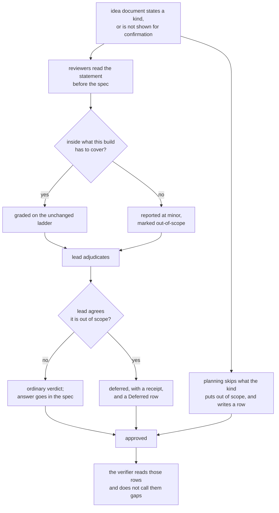

# What was built

A plan now states what kind of build it is, review grades coverage against that statement,
and work skipped because of it lands in a Deferred section the next plan can start from.

Seventeen edits across seven files, all documentation under `protocol/` plus one README line.
`protocol/implementation.md:11-13`'s small-patch bypass applies: a couple of files, nothing
parallelizable, so no lanes were dispatched for the edits themselves. Lanes *were* dispatched
for the behavioral validation, where blindness is the point.



# Spec coverage

| Spec item | Where | Origin | Evidence |
|---|---|---|---|
| `templates/IDEA.md` gains the section, sentences inside an HTML comment | `protocol/templates/IDEA.md:28-39` | this run | Section sits after **What good looks like**, before **Not doing**; both sentences appear only inside the comment |
| `templates/IDEA.md` carries no match rule | `protocol/templates/IDEA.md` | this run | `grep -c "first non-blank"` returns 0 |
| `templates/PLAN.md` gains Deferred between Spec and Accepted Risks | `protocol/templates/PLAN.md:53-64` | this run | Four columns incl. `Source`; legend names `planning`/`review-round-N`/`adopted` |
| `templates/PLAN.md` verdict legend gains `deferred`, evidence sentence names deferrals | `protocol/templates/PLAN.md:93-94` | this run | Six values; "Downgrades, declines and deferrals cite evidence" |
| `planning.md` Step 2 owns the match rule and the gate | `protocol/planning.md:53-65` | this run | Comment stripping, exact sentences, the further-prose requirement, the strict fallback |
| `planning.md` decide-don't-ask filter gains the coverage rule | `protocol/planning.md:80-85` | this run | Out-of-scope behavior is a decision to skip, not a queue question; writes a `planning` row |
| `planning.md` "Recording answers" gains the Deferred write | `protocol/planning.md:~170` | this run | Same turn as the Decision Log append, `Source: planning` |
| `planning.md` scope-change list gains the section | `protocol/planning.md:~205` | this run | "What / Why / What good looks like / How solid this has to be / Not doing" |
| `adopt.md` writes a fixed sentence verbatim | `protocol/adopt.md:~28-33` | this run | Names `planning.md` Step 2 as the definition; explains why a paraphrase reaches no gate |
| `adopt.md` marks the inference outside the section | `protocol/adopt.md:~35-38` | this run | Stated as the one exception to "mark every inferred line"; refers to the rule without restating it |
| `adopt.md` sets `IDEA.md` status explicitly | `protocol/adopt.md:~41` | this run | `draft` while inferred, `confirmed` after the landing question |
| `adopt.md` routes inherited deferred work | `protocol/adopt.md:~53` | this run | `Source: adopted`, flagged as a proposal reviewers may attack |
| `plan-review.md` brief gains the scope paragraph after `:64-65` | `protocol/plan-review.md:67-79` | this run | Inside the brief block, after "Reporting nothing is an acceptable outcome" |
| The brief points at the rule with an absolute path | `protocol/plan-review.md:76-77`, note at `:88-95` | this run | `<wheelchair-root>/protocol/planning.md`; lead substitutes the root |
| `plan-review.md` verdict table gains `deferred` | `protocol/plan-review.md:126` | this run | Single line, matching every existing row |
| `plan-review.md` evidence rule gains `deferred` | `protocol/plan-review.md:129-137` | this run | "downgrade, decline, or defer"; scope-not-severity paragraph and the disagreement branch follow |
| `plan-review.md` act-on-the-verdicts list gains the clause | `protocol/plan-review.md:144` | this run | `deferred` moves to Deferred with `Source: review-round-N` |
| `plan-review.md` settled-findings sentence, Source-limited | `protocol/plan-review.md:78-84` | this run | Review-round rows settled; `planning`/`adopted` rows explicitly open to attack |
| Exit gate unchanged, `deferred` does not count against it | `protocol/plan-review.md:154-156` | this run | One sentence added; the zero-blocking-zero-major wording is untouched |
| `verification.md` verifier brief gains the line | `protocol/verification.md:68` | this run | "a deferred entry is not a gap" |
| `README.md` enumeration gains Deferred | `README.md:182` | this run | Enumeration kept intact, as the Spec required |

# Deviations from the Spec

**One, and it was caught by the Spec's own structural check.** My first `adopt.md` draft
restated the match mechanism — "the match reads the section's first non-blank line after
comments are stripped" — instead of pointing at it. Structural check 3 greps that exactly one
file in the repo states the rule; it returned two. Rewritten to refer without repeating; the
grep now returns one. This is the Round 5 blocking defect reappearing in the implementation of
its own fix, caught by the guard written against it.

**One addition beyond the file list**, under `protocol/implementation.md:87-92`'s router-upkeep
rule: `protocol/AGENTS.md` gained a Boundaries bullet recording that `planning.md` Step 2 owns
the match rule and that other stages point at it. `planning.md` gained ownership of a
cross-stage rule, which is an ownership change, and the router is where a future agent looks
before writing a second copy.

# Validation

## Regression guards

```
$ bash install/test/run.sh
RESULT 12 passed, 0 failed

$ bash sensitivity/test/run.sh
RESULT 62 passed, 0 failed
```

Re-run after every edit, including the router change. Neither observes this change — they are
guards, and the Spec says so.

## Structural checks

All pass. Notable results:

```
$ grep -rln "first non-blank" protocol/ README.md skills/ codex/
protocol/planning.md                    # exactly one file states the rule

$ grep -rln "People are going to depend on this" protocol/ README.md
protocol/planning.md
protocol/templates/IDEA.md              # the rule, and the template comment; nowhere else

$ grep -rln "accepted-risk" protocol/ README.md skills/ codex/
protocol/templates/PLAN.md
protocol/plan-review.md                 # verdict names leaked nowhere; the legend edit completes the surface
```

## Behavioral checks

Two fixtures built by hand, identical Specs, differing only in their idea document's statement.
Both deleted afterward. Reviewers were fresh agents given only the brief the edited
`plan-review.md` now dictates, with the root substituted.

**Check 1 — the contrast. Passes, on two independent omissions.**

| Omission (identical spec text) | `_fixture-durable` | `_fixture-demo` |
|---|---|---|
| No error path at all | `blocking` — "the stated kind makes error legibility the point of the build" | `minor`, `OUT-OF-SCOPE:` — "correct to skip for a file the author opened beforehand; a durable version needs every one of them named" |
| CSV parsing fidelity | `blocking` — a line-counter "returns a wrong number with no indication anything went wrong" | `minor`, `OUT-OF-SCOPE:` — "irrelevant for a hand-checked demo file, decisive the moment input isn't controlled" |

Neither returned "no finding", which the Spec makes a failure on both sides.

**The result that most needed checking, and was not designed for.** On the demo fixture the
header-row ambiguity came back `major`, not relaxed — "the single number is the entire
deliverable." That is D18 working: the stated kind narrows what the spec must cover, and inside
that narrowed scope the ladder is untouched. The demo got a cheaper review without getting a
vaguer one, which is the thing D4 and D13→D18 exist to protect.

**Check 3 — the disagreement branch. Passes.** A hand-written wrong scope call
(`OUT-OF-SCOPE:` on the header-row question) was overruled by the lead: ordinary verdict, answer
folded into the Spec, **no Deferred row**. The genuinely out-of-scope failure-lifecycle finding
took `deferred` with a receipt citing `IDEA.md:24-26` and **did** get a row. Both halves behave
as specified. Worth recording that the demo reviewer had independently graded the header
question `major` without help — the synthetic wrong call had to be supplied.

**Check 4 — adoption. Passes.** A fresh agent, told only to follow `adopt.md` against an
external document stating no kind, produced an `IDEA.md` whose section opens
`**People are going to depend on this.**` verbatim followed by six lines of its own prose;
`status: draft`; the inference recorded in the Decision Log and its report, **not** inside the
section. Verified mechanically by applying the shipped rule to the file it wrote:

```
first non-blank after comment strip: "**People are going to depend on this.** Paying customers' in"
matches a fixed sentence: True
further author lines present: True (6)
=> states a kind: True
```

**Check 5 — the matcher on the likely half-edit. Passes**, folded into check 1. The demo
fixture carried the correct sentence *and* the template's unreplaced comment. The reviewer's
first line: "stripping HTML comments from IDEA.md's 'How solid this has to be' leaves a first
non-blank line beginning exactly `**This is a demo.**`". The half-edit that broke Round 5's two
disagreeing matchers now resolves deterministically.

Both reviewers cited `protocol/planning.md:53-65` by line, meaning they opened the rule through
the absolute pointer from a lane whose working directory was the target repo. That is Round 6's
blocking finding verified end to end.

## Not checkable, stated rather than dressed up

Stage 1's Step 2 refusal cannot be exercised end to end: `protocol/planning.md:24-29` runs Step 2
only on the New path, and on that path the agent writing the section from the template is the
same one being tested for refusing a malformed one. Verified by reading the file. Checks 4 and 5
are its behavioral surrogates and both passed.

Check 2 — a verifier producing no `GAP` for a Deferred row — was **not** run in isolation.
This plan itself carries a `planning` row in Deferred and goes to Stage 4 next, so the check is
exercised for real rather than against a fixture. If the verifier reports that row as a gap, the
`verification.md` edit did not land.

# Residual risks

- **Round 6's four major fixes were never reviewed.** Carried from the plan's Accepted Risks.
  They landed after the last lane returned and the plan was approved on that triage. The
  behavioral checks above exercise two of the four (the absolute path, and the further-prose
  requirement in the match rule); the other two are validation-section wording.
- **`grep`-based structural checks are one-time proofs, not tests.** Nothing stops a future
  edit from writing a second copy of the match rule. The `protocol/AGENTS.md` boundary bullet is
  the durable guard; the greps proved the state once, here.
- **The demo path costs more reviewer output than the durable path**, carried from Accepted
  Risks — visible in the fixture run, where the demo reviewer produced two `OUT-OF-SCOPE:` lines
  a suppressing reviewer would not have written. Words, not rounds.
