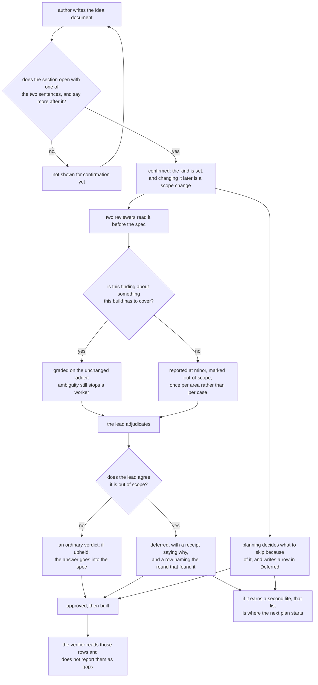

# A plan says how solid its thing has to be, and review believes it

**Idea:** `IDEA.md` — what this is for and why, in plain language. Read it first; it is
the north star this plan serves. Goal and Constraints live there, not here, so they don't
get buried as this file grows.

## Open Questions

Ordered by leverage; discussed one at a time. A settled question moves to the Decision
Log and is deleted from here.

*Empty — Q1-Q4 settled in Stage 1 (D6, D7, D9, D10); Q5 settled by the user after Round 3 (D23).*

## Watch List

Things noticed that need looking into — not yet decisions for the user. Written down the
moment they're spotted so they can't be forgotten, surfaced to the user one line at a
time as they appear, and emptied before Stage 1 exits.

Each item ends up settled by the agent (noted in the Log), promoted to an Open Question,
promoted to a Constraint or Accepted Risk, or waved off by the user.

| # | Noticed | What needs looking into | Raised to user? | Outcome |
|---|---------|-------------------------|-----------------|---------|
| W1 | 2026-09-19 | `protocol/lanes.md` is unread. In scope only if Q1 lands on changing the round shape. | yes | settled — D6 left the round shape alone, so `lanes.md` is out of scope and stays unread |
| W2 | 2026-09-19 | The in-flight `separate-the-record` plan is reorganizing the same `PLAN.md` sections a Deferred section would land in. Sequencing risk between two uncommitted plans. | yes, before Stage 1 began | settled — that plan is still `status: draft`, and it splits the spec from the record rather than renaming sections. Deferred is spec-side (like Accepted Risks, which its own template line already calls "part of the spec"); the `deferred` row in the Review Rounds table is record-side. No collision, whichever lands first |
| W4 | 2026-09-19 | `separate-the-record`'s IDEA.md measures the existing plans: "no plan has finished in fewer than five rounds." That is evidence the review loop runs long for reasons other than a missing bar, which is the assumption D6 rests on. | yes | settled — promoted to Accepted Risks. The mitigation already exists: the round-shrinking lever is in Deferred with a stated trigger, so the risk is instrumented rather than ignored |
| W3 | 2026-09-19 | `skills/plan-review/SKILL.md:3` spells out "capped at three before escalating" in its description, so any loop-shape change has to update it. | yes | settled — D6 leaves the cap and the two-reviewer round untouched, so every claim in that description stays true |

## Decision Log

Append-only. A reversal is a new entry superseding the old, never an edit.

| # | Decision | Rationale | Source |
|---|----------|-----------|--------|
| D1 | The statement of what the build is for lives in `IDEA.md`, not as an argument to the review command. | Both reviewers are already told to read `IDEA.md` first (`protocol/plan-review.md:48`), so it arrives with no change to either brief — and it is a statement of intent, which is what that document holds. | user |
| D2 | The severity ladder's wording does not change. The reviewer brief points at the idea's statement rather than restating the bar. | `protocol/AGENTS.md:43-45` forbids a second gate for a rule that already has one; the ladder is already consequence-based and correct. | defaulted |
| D3 | Deferred work does not reuse the Accepted Risks section. | That section means "real, consciously not fixed" and is closed to re-raising (`protocol/templates/PLAN.md:54-60`). Overloading it would make a deferred item invisible to the plan that later needs it. | defaulted |
| D4 | Stage 1's exit bar — a fresh agent could implement from the Spec alone — is unchanged at either bar. | A vaguer spec does not save review time, it moves the cost into implementation, where a worker guesses instead of asking. | defaulted |
| D5 | Everything else about a rough plan's artifacts is unchanged: `MAP.md` still gets written, the Spec still gets its diagram at approval, `COMPLETION.md` is still required. | The idea's goal is proportionate review, not a thinner paper trail; the artifacts are what make the deferred list readable later. | defaulted |
| D6 | The stated bar changes how reviewers grade findings and nothing else. The round keeps two reviewers and the cap of three. Shrinking the round at the rough bar becomes this plan's first deferred item. | Review exits on the lead's triage rather than a counter (`protocol/plan-review.md:124-126`), so correct grading should already end a rough plan's review at one round. Cutting to one reviewer would trade away the mechanics-versus-intent split — the whole reason there are two — for a saving nothing has yet measured. | user |
| D7 | Deliberately-skipped work lands in a new Deferred section of `PLAN.md`, writable directly by Stage 1 and reached from Stage 2 by a new lead verdict alongside the existing five. | The verdict is what makes the review half of the list complete rather than dependent on the lead remembering; Stage 1 writing to the same section costs nothing on top. The stub-plan alternative hands off better but creates a follow-on plan speculatively, which nothing else in this workflow does. | user |
| D8 | The verdict and the section are both called `deferred` / Deferred. | It sits in a closed set the lead already reads — `upheld`, `downgraded`, `declined`, `accepted-risk`, `user-decision` — and reads unambiguously beside `accepted-risk`, which is the one it is most likely to be confused with. | defaulted |
| D9 | The statement governs review and verification. Implementation is untouched. | The verifier already reads both documents, so "review only" does not leave it ignorant — it leaves it correctly reporting knowingly-skipped work as a gap, and verification is the one stage with no cap on its loop (`protocol/verification.md:98-100`). Implementation needs nothing: a brief takes its scope from the Spec, which already reflects the bar by approval. | user |
| D10 | The statement is required, written as prose rather than a one-word label. Stage 1 will not present the idea document for confirmation without it. | Two gates read it and the later one uses it to decide whether a skipped item is a gap, so an optional field would be a hole in both. Prose because the sentence carries its own reason, which is what a reviewer grading a borderline finding needs, and a label would be the only jargon in a file whose rule is plain language throughout. | user |
| D11 | `deferred` may not be applied to a finding the lead upholds as blocking or major, and it carries the same evidence obligation as `downgraded` and `declined`. | Without the ceiling it is an escape hatch that approves a rough plan carrying a defect that breaks the rough build itself. Without the receipt it becomes a second, unpoliced way to end a round, which falsifies `protocol/plan-review.md:107-109`. | review-round-1 |
| D12 | `deferred` is available at either stated kind, not only the rough one. | Once D11 caps it at non-blocking, restricting it to rough plans buys nothing — a real finding worth recording for later is worth recording at either kind. This plan is itself a durable plan with a Deferred entry, so the restriction was already contradicted by its first example. | review-round-1 |
| D13 | The stated kind scopes the `blocking` rung only. `major` — a worker would have to stop and ask — is unaffected by it. | Ambiguity is ambiguity at any bar; relaxing that rung would let reviewers downgrade spec-ambiguity findings on rough plans, which contradicts D4 and moves the cost into implementation. | review-round-1 |
| D14 | A statement that is not clearly the rough one reads as the strict one. | A hedged sentence otherwise gets bucketed by the lead mid-triage, which is the reviewing side choosing the bar — the idea's second non-goal. | review-round-1 |
| D15 | The kind is set at idea confirmation; changing it afterwards is a scope change under `protocol/planning.md:175-181`, which gains the new section in its list. | That procedure already exhaustively names the sections a scope change covers, so omitting the new one leaves a planning agent with no rule. | review-round-1 |
| D16 | Verification's only change is the Deferred-section line in the verifier brief. D9's "governs verification" is narrowed to that. | The discriminator between skipped and failed work is the Deferred section, not the statement. Claiming more would have required inventing verification behavior to justify the claim. | review-round-1 |

| D17 | No sixth verdict. The five stay as they are. A finding the lead relaxes by citing the stated kind — under `downgraded` or `declined` — gets a Deferred row in addition to whatever verdict it took. Supersedes the verdict half of D7, and supersedes D8, D11 and D12. | A verdict is a severity judgement; a Deferred row is a record. Making them one token forced a choice between two verdicts that land in different places, and left the same finding recorded or not depending on which a lead picked. Splitting them removes the ceiling rule, the disposal edit, the `:105` edit and the template legend change — about half this change's surface — and the receipt obligation it needed is one `downgraded`/`declined` already carry (`protocol/plan-review.md:105-106`). | review-round-2 |
| D18 | The stated kind scopes **what the Spec must cover**, not which severity rung applies. Inside that scope both rungs are untouched; outside it there is no finding to grade. Supersedes D13. | D13 split the ladder per rung, which fails because the exit gate counts blocking and major together and the same defect can be written under either. Scoping coverage instead is one idea rather than two, keeps implementability and ambiguity bar-independent, and matches what the idea actually says — a demo need not handle what a demo never does. | review-round-2 |
| D19 | A Stage 1 Deferred entry does not stand reviewers down. Only a finding the lead has adjudicated is settled against re-raising. | Otherwise planning can park anything, including what a reviewer would call blocking, and the brief tells reviewers not to look. That is the escape hatch D11 was created to close, reopened on the planning side — both lanes found it independently. | review-round-2 |
| D20 | The statement **opens** with one of two fixed phrases and then continues in the author's own words. Supersedes D14's hedge rule; an absent statement still reads as the strict kind. | It keeps D10's reason — the sentence still carries its own why — while removing classification from the lead's judgement entirely, so a hedged opening cannot happen rather than needing a tie-breaker rule. | review-round-2 |
| D21 | One name throughout: **the stated kind**. Every file the change touches uses it. | Four names for one thing across documents agents read cold, with no conversation to disambiguate them. | review-round-2 |
| D22 | Adoption sets `IDEA.md`'s `status` explicitly. | `protocol/adopt.md` does not mention `status` anywhere today (verified by grep), so D15's rule — the kind is fixed at confirmation — has no anchor on the adoption path. | review-round-2 |

| D23 | Both planning and review produce Deferred rows. Reviewers **report** work the stated kind puts out of scope, as `minor` tagged out-of-scope, rather than staying silent about it; the lead records each one. A provenance column on the table says who wrote each row, which is what makes D19's attackable-versus-settled rule applicable. | An author's own list is exactly the list of things they already thought about; the adversarial half is the part with no substitute. Reporting out-of-scope work as `minor` rather than suppressing it also dissolves the `downgraded`-versus-`declined` question — nothing is relaxed, so no verdict has to route anything — which is what three rounds kept tearing on. | user |

| D24 | **`deferred` returns as a sixth lead verdict, reversing D17.** Its entry condition is a judgement about *scope*, not severity: the lead agrees the work falls outside what the idea says this build must cover. It gets its own row in the verdict table and its own clause in the act-on-the-verdicts list, exactly parallel to `accepted-risk`; it does not block the exit gate; and it carries a receipt citing why the work is out of scope (D11's substance, kept). If the lead disagrees and thinks the work is in scope, the finding takes its ordinary verdict path and nothing goes to Deferred. | Round 4 found the same hole from both lenses: tying the Deferred row to a verdict *outcome* loses the item whenever the outcome differs. Tied to "upheld at `minor`", an over-severed finding the lead correctly downgrades disappears; and `upheld`'s own action is "update the Spec", which is the opposite of deferring. Four rounds have now shown that "real, but deliberately not going into the Spec" is a disposition, and this protocol gives a disposition its own verdict — `accepted-risk` is the proof, and it is the nearest neighbour. D17 removed the verdict to escape a routing ambiguity between `downgraded` and `deferred`; D23 dissolved that ambiguity by other means, so the verdict can return without it. | review-round-4 |
| D25 | Scope is set by the idea's **whole** statement — the fixed opening sentence plus the author's own prose about what the build has to do and for whom — not by the opening sentence alone. A reviewer reports out-of-scope work once per distinct area, not once per unhandled case. | Round 4: anchored to the opening sentence alone, "outside the stated kind" reads as "every unhandled case on a demo", which would make the brief's out-of-scope reporting unbounded and contradict `protocol/plan-review.md:64-65`'s "reporting nothing is an acceptable outcome". The fixtures already rely on the prose being decisive; the brief has to say so. | review-round-4 |

## Spec

The settled design, grown as decisions land. Bar: a fresh agent with no conversation
history can implement from this section alone — behavior, boundaries, edge cases,
non-goals, and concrete validation commands.



In words, so a reader with no renderer gets the whole thing: the author opens the section with
one of two exact sentences and keeps writing; until they do, the idea is not shown for
confirmation. What they write sets what the plan has to cover. Work skipped because of it gets
written down as they decide. Reviewers read that before the spec; anything inside the stated
coverage is graded exactly as it is today, and anything outside it is reported at `minor` and
marked out-of-scope rather than suppressed. The lead rules on each: agreeing means `deferred`,
a receipt, and a row; disagreeing means an ordinary verdict and, if upheld, the answer lands in
the spec. The verifier later reads those rows and does not call them gaps, and if the thing
earns a second life they are where the next plan begins.

### The idea, in one paragraph

A plan states which kind of build it is. Review reads that to decide what the Spec has to
cover, and work the plan knowingly skips because of it goes in a Deferred section the next
plan can start from — written there both by the author, as they decide, and by the lead, from
what reviewers report as out of scope (D23).

**This section is organised by file, and each file's block is the authority for what changes
in that file.** Two rounds upheld the same defect three times: a rule stated in Spec prose
that no file edit carried, so it would have shipped nowhere. Prose here explains; the per-file
blocks specify. The **Validation** section at the end is the exception and binds too — it is
instruction to the implementer about how to check the work, not a description of a shipped
file.

**One name for the thing** (D21): **the stated kind**, in the files agents execute. Not in
`templates/IDEA.md`, whose own standing rule is "Plain language throughout. No jargon"
(`protocol/templates/IDEA.md:13`) — that file says it in plain words, which is also what D10
decided.

---

### `protocol/templates/IDEA.md`

Add this section, after **What good looks like**, before **Not doing**, verbatim:

```markdown
## How solid this has to be

<!-- Replace this whole block, comment included, with ONE of the two sentences below as a
     plain paragraph — no list marker — then keep going in your own words.

     **This is a demo.**  (then: what it has to do convincingly, and for whom)
     **People are going to depend on this.**  (then: who, and what breaks for them if it is
     wrong)

     Review reads this to decide what the plan has to cover. Work you knowingly skip because
     of it belongs in the plan's Deferred section. -->
```

The two sentences live **inside an HTML comment**, so an unedited or half-edited idea document
contains no matchable statement rather than one or both of them.

**Scope comes from the whole section** (D25): the sentence says which kind, the author's prose
that follows says what this build actually has to do and for whom, and that prose is what a
reviewer measures coverage against.

No other edit. In particular the match rule itself does **not** go in this file — see
`protocol/planning.md` below, which owns it.

### `protocol/templates/PLAN.md`

**1.** Add a Deferred section between Spec and Accepted Risks, verbatim:

```markdown
## Deferred

Work this plan left undone because of the kind of build it states. Not "not worth fixing" —
that is Accepted Risks. This is what the next plan starts from if this one earns a second life.

| Source | What was skipped | Why it is out of scope here | What it would take |
|---|---|---|---|
|   |   |   |   |

`Source` is `planning`, `review-round-N`, or `adopted`. It is what tells a later reviewer which
rows it may argue with: a `planning` or `adopted` row is a proposal and is fair game; a
`review-round-N` row was adjudicated by the lead and is settled.
```

**2.** The verdict legend at `:79-81` gains `deferred`, becoming six values, **and** its
evidence sentence — currently "Downgrades and declines cite evidence" — becomes "Downgrades,
declines and deferrals cite evidence", matching the third receipt-bearing verdict.

### `protocol/planning.md`

**This file owns the match rule.** It is written here once and every other stage points at it,
because `protocol/AGENTS.md:43-45` forbids a second gate for a rule that already has one — and
an earlier draft of this Spec wrote the matcher twice, in wordings that disagreed on the most
likely half-edit. That was Round 5's blocking finding, and stating it once is the fix.

**1.** Step 2 (`:44-51`) gains the rule and the gate together:

> **What counts as a statement of the kind.** In the idea document's "How solid this has to be"
> section, strip HTML comments, then take the first non-blank line. The section states a kind
> only if that line begins with
> `**This is a demo.**` or `**People are going to depend on this.**` — those exact characters,
> `**` markers and final period included, with no list marker, blockquote marker or heading
> before them. Anything else — an empty section, a first line that begins some other way, or
> the template's comment left unreplaced — states no kind. The section must also carry at least
> one further non-blank line of the author's own words after that sentence: the sentence says
> which kind, and the words after it say what this build actually has to do and for whom, which
> is what a reviewer measures coverage against (D25). A section holding the sentence and nothing
> else states no kind either.
>
> Do not present the idea document for confirmation until the section states a kind. Every
> later stage reads that same rule from here; where a stage has to act on a section that states
> none, it reads it as **People are going to depend on this.**

**2.** Step 3, the decide-don't-ask filter (`:57-64`): the stated kind bounds what the Spec has
to cover. A question about behaviour the idea's statement puts out of scope is not a question
for the queue — it is a decision to skip, and it gets a `planning` row in Deferred.

**3.** "Recording answers" (`:150-157`): a decision that parks work writes its Deferred row —
`Source: planning` — in the same turn it appends to the Decision Log.

**4.** "Changing the idea" (`:175-181`): add the new section to the enumerated list of sections
whose change is a scope change (D15).

### `protocol/adopt.md`

**1.** Step 4 (`:25-29`): the new section joins what adoption infers, and adoption writes one of
the two sentences **verbatim** as defined by `protocol/planning.md`'s match rule — a synthesized
paragraph matching neither would reach no gate, because an adopted plan never runs Step 2
(`protocol/planning.md:28-29`).

**2.** That step's existing instruction — "**Mark every inferred line**" (`protocol/adopt.md:27-28`)
— gains one exception: the kind statement is marked in the **gap report** (step 7, `:52-54`) and
in the landing question (`:56-62`), not ahead of the sentence inside the section. Precisely: the
match reads the first non-blank line after comments are stripped, so a marker placed *before* the
sentence breaks it, while a comment marker or a trailing one would not. Keeping the mark out of
the section entirely is the simple rule that cannot be got wrong. Without this exception the
shipped file says both "mark every inferred line" and "do not mark this one".

**3.** Set `IDEA.md`'s `status` explicitly — `draft` when the kind was inferred, `confirmed`
only once the user has answered the landing question (D22).

**4.** Step 5 (`:30-38`): deferred work carried in from an external document goes in Deferred
with `Source: adopted`.

### `protocol/plan-review.md`

**1.** The brief gains one paragraph, inserted **after** `:64-65` ("Reporting nothing is an
acceptable outcome; padding severity is not"):

> The idea document's "How solid this has to be" section says what kind of build this is and, in
> the author's own words, what it has to do and for whom. Together those set **what the Spec has
> to cover** — not how hard you grade what it does cover. Inside that scope the ladder above
> applies exactly as written: ambiguity is still `major`, a Spec that could not be implemented is
> still `blocking`. Outside it, do not stay silent and do not grade it as a defect: report it
> once per distinct area, at `minor`, beginning the finding `OUT-OF-SCOPE:`, so it can be written
> down for whoever picks this up later. One line per area, not per unhandled case. Whether the
> section states a kind at all, and what to do when it does not, is decided by the rule in
> `<wheelchair-root>/protocol/planning.md` Step 2. Read it there.

**That path is absolute, and the lead substitutes the root when composing the brief** — the same
derivation `protocol/graphs.md:411-416` and `protocol/spine.md:19-22` already teach, taken from
the absolute path this file was itself read at. A relative `protocol/planning.md` resolves
nowhere: a reviewer lane runs with the **target** repo as its working directory
(`protocol/lanes.md:32` passes `-C "$PWD"`), and `protocol/` exists only in the wheelchair clone.
`install.sh:4-5` states that rule for the same reason, and `protocol/spine.md:22` calls it "the
same reason every skill in this repo hardcodes the absolute path to `protocol/`". An earlier
draft justified a relative path by "the reviewer has repo access" — that is the wrong repo, and
the failure would have been silent: a reviewer that cannot open the rule falls back to strict and
reads every demo plan as something people depend on.

The brief also does **not** restate the no-kind fallback. Stating it in both places is Round 5's
defect one level down, and it is what made the "exactly one place states this" claim false.

**2.** The verdict table (`:97-103`) gains a sixth row. One line, like every existing row:

```
| `deferred` | Real, and outside what this build's stated kind has to cover. Record why; promote to the Spec's Deferred section. Future rounds must honor it. |
```

**3.** The act-on-the-verdicts list (`:111-115`) gains the matching clause, parallel to the one
already there for `accepted-risk`: *`deferred` moves to Deferred with `Source: review-round-N`.*

**4.** The evidence rule at `:105-106` — "You may not downgrade or decline a finding you have not
checked" — gains `deferred`. That paragraph is hard-wrapped at ~88 columns and lines 105-106 are
already 87 characters, so **the whole `:105-109` paragraph will reflow**; that is expected and
permitted. What must not change is its *meaning*: the anti-rationalization warning at the end of
it stands as written, unqualified, and this Spec adds nothing to it.

**5.** The settled-findings sentence (`:67-70`) gains `deferred` and the Deferred section —
**limited to rows whose `Source` is a review round.** A `planning` or `adopted` row is a proposal
reviewers may attack freely (D19).

**The exit gate at `:124-126` is unchanged**, and `deferred` does not count against it, exactly
as `accepted-risk` does not.

**No ceiling, stated deliberately.** D11 gave the earlier verdict a severity ceiling; D24 kept
its receipt and drops the ceiling, because `deferred` is now a judgement about scope rather than
about severity — a finding that is genuinely outside what this build must cover is not a `major`
being waved through, it is not a finding about this build at all. This does mean `deferred`
inherits the property `accepted-risk` has had since before this plan: a lead can move a real
finding off the exit gate. The receipt at `:105-106` is what polices both, and the idea's
non-goal about the reviewing side reaching for a lower standard is satisfied by the receipt, not
by a ceiling.

**The disagreement branch.** A finding the reviewer tagged `OUT-OF-SCOPE:` that the lead judges
to be *in* scope does not take `deferred`. It takes whichever ordinary verdict fits, and if that
is `upheld` it goes into the Spec like any other upheld finding, with no Deferred row. The
reviewer's scope call is a report; the lead's is the ruling, and it is the one carrying the
receipt. This is explanation of the verdict table above, not a separate edit.


### `protocol/verification.md`

One edit. The verifier brief (`:61-74`) gains: *the plan's Deferred section lists work the plan
knowingly did not do; a deferred entry is not a gap.*

Nothing else in Stage 4 moves — same verifier selection, same falsify-the-claims posture, same
remediation loop, same stopping rule. D16 narrowed D9 to exactly this: the discriminator is the
Deferred **section**, which the verifier already reads as part of `PLAN.md`
(`protocol/verification.md:35-36` hands it that path; `:61` is where its brief sends it to
`IDEA.md`). The statement itself gets no separate rule here.

Why one line is worth it: without it the verifier reads the Deferred list and correctly reports
every entry as a gap. That is one FAIL, one remediation document holding the whole gap list
(`protocol/verification.md:80-81`) — not one round per gap — and the loop does stop when a gap
survives twice. But stopping that way means declaring the plan defective over work it
deliberately chose not to do.

### `README.md`

`:181-182` enumerates `PLAN.md`'s sections — "question queue, watch list, decision log, spec,
accepted risks, review rounds, prior work, implementation tasks". Add Deferred to that list, in
place, keeping the enumeration.

`:178-180` is a prose gloss on `IDEA.md` that already omits Why and Constraints, so it does not
go stale by the file gaining a section. Leave it.

An earlier draft of this Spec claimed nothing outside `protocol/` described any of this. That
was wrong, and the wrong claim is why the file was missing from the plan at all.
`CONTRIBUTING.md` and the root `AGENTS.md` were checked and genuinely mention neither.

### `protocol/implementation.md` and the wrappers — no change

Implementation takes its scope from the Spec, which already reflects the stated kind by
approval (D9).

`skills/plan/SKILL.md`, `skills/plan-review/SKILL.md` and `skills/verify/SKILL.md` need no edit
because **they name no verdicts and no idea-document sections at all** — each is a three-line
pointer plus a description of its stage. plan-review's description covers the two-reviewer
round and the cap of three, both untouched (D6). An earlier draft justified this by saying its
"five-verdict framing" stays true; that reason was false, and the conclusion happens to survive
it. Confirm by reading them; do not edit.

---

### What does not change

Stage 1's exit bar — a fresh agent could implement from the Spec alone — holds at either kind
(D4), and D18 is what protects it: the stated kind narrows what the Spec covers, never how
clearly it has to say it. `MAP.md`, the approval-time diagram, and `COMPLETION.md` are all
still written (D5). The review round keeps two reviewers, both lenses, the
zero-blocking-and-zero-major exit gate, and the cap of three (D6). One verdict is added
(D24) and none is removed or redefined — an earlier draft said none was added at all, which
D17 made true and D24 made false again.

### Validation

Documentation-only: there is no behavior to unit-test, and the repo's router says so
(`protocol/AGENTS.md:52-55`). This section binds on the implementer even though it describes no
shipped file.

**Regression guards.** Both must stay green. Neither observes this change, and saying so is the
point — a green run here is not evidence the change is right.

```bash
bash install/test/run.sh      # installs into temporary harness homes and asserts idempotence
bash sensitivity/test/run.sh  # the one region this change must not disturb
```

An earlier draft instead ran `./install.sh && ./install.sh && git status --porcelain`. That can
never pass in a tree holding untracked plan directories, cannot show wrapper drift because
`install.sh:20-21` points the render at `$HOME/.claude` and `$HOME/.codex` rather than the repo,
and its `npm --prefix viewer install` (`:71`) can dirty `viewer/package-lock.json`, which is not
in `.gitignore`.

**Structural checks, run once at implementation** — a grep proves each at zero maintenance cost,
where a permanent term-list test would be a vocabulary assertion. One per file block above:

- `protocol/templates/IDEA.md` holds the new section, and its two exact sentences appear **only
  inside an HTML comment**; the match rule does **not** appear in this file.
- `protocol/templates/PLAN.md` holds the Deferred section with its four columns including
  `Source`, shows six verdicts at `:79-81`, and its evidence sentence names deferrals.
- `protocol/planning.md` carries all four edits, and the match rule appears in Step 2 **and
  nowhere else in the repo** — `grep -rn "first non-blank" protocol/` returns exactly one file.
  A second copy is the Round 5 blocking defect returning.
- `protocol/adopt.md` carries all four, including the exception qualifying its existing
  "**Mark every inferred line**" at `:27-28`.
- `protocol/plan-review.md` carries all five: the brief paragraph after `:64-65` with
  `OUT-OF-SCOPE:` and a **pointer** to planning.md's rule rather than a restatement of it; the
  sixth verdict row as a single line; the `deferred` clause inside the `:111-115` list;
  `deferred` in `:105-106`'s evidence rule; and the `Source`-limited settled-findings sentence.
  `:105-109` will reflow — that is expected — but its closing anti-rationalization warning must
  read exactly as it does now. `:124-126` is unchanged.
- `protocol/verification.md` carries the brief line.
- `README.md:181-182` lists Deferred, with the enumeration intact.

**Behavioral checks.** Two fixtures, built by hand so the state under test is not produced by
the agent under test. Both carry the identical Spec; they differ by their idea document's
statement and by nothing else:

> **Shared Spec**, in both plans: *"A command `report` prints a one-line summary of a CSV file
> given as its only argument. It reads the file, counts rows, and prints `<name>: <n> rows`."*
> Neither Spec says anything about a file that is missing, unreadable, or not CSV, and neither
> says whether a header row counts toward `<n>`.
>
> `docs/plans/_fixture-demo/IDEA.md` — statement: `**This is a demo.**` followed by *"It gets
> run once on stage, by me, against a file I have already checked into the repo and opened
> beforehand. Nobody else ever invokes it."* Deferred holds one `planning` row.
>
> `docs/plans/_fixture-durable/IDEA.md` — statement: `**People are going to depend on this.**`
> followed by *"Support runs it against files customers upload, several times a day."* Deferred
> is empty.
>
> Both are scaffolding; delete them after. The two omissions are deliberately different: the
> malformed-input one is unambiguously out of scope in the demo fixture and in scope in the
> durable one, while the header-row one is inside **both** fixtures' scope, since both promise
> a row count.

1. **The contrast.** A Stage 2 reviewer on `_fixture-durable` reports the missing
   malformed-input handling as a finding that stands. On `_fixture-demo` the same omission comes
   back prefixed `OUT-OF-SCOPE:` at `minor`. **"No finding at all" is a failure on both** — on
   the durable fixture the bar did not land; on the demo fixture the reviewer suppressed rather
   than reported, which is the Round 3 hole reopening.
2. **The record.** Triaging that `_fixture-demo` finding as `deferred` writes a Deferred row
   with `Source: review-round-1`, and the plan still reaches `approved`. If the row does not
   appear, the `:111-115` clause did not land.
3. **The disagreement branch**, tested at the triage step with a hand-written finding rather
   than by hoping a reviewer mis-tags. Hand the lead this line against `_fixture-demo`:
   `OUT-OF-SCOPE: minor — the Spec never says whether a header row counts toward <n>`. That call
   is wrong — the fixture's own prose promises a row count, so the question is inside its scope —
   and the shipped brief would have a compliant reviewer report it `major` instead, which is why
   the finding is supplied rather than elicited. Expected: the lead rules it in scope, gives it
   an ordinary verdict, the answer goes into the Spec, and **no** Deferred row appears. Two
   earlier drafts got this check wrong in opposite ways: one re-triaged a settled finding, asking
   a compliant lead to contradict its own fixture; the other set a premise a compliant reviewer
   would never produce, so the check passed vacuously.
4. **Adoption.** Run `/adopt` against a hand-written external document with no statement of kind.
   The synthesized `IDEA.md` must contain one of the two exact sentences as its section's first
   non-blank line, must carry `status: draft`, and the inference must be marked in the gap report
   and landing question rather than inside the section.
5. **The matcher, on the likely half-edit.** An idea document whose section contains the correct
   sentence **and** the template's unreplaced comment states a kind — the comment is stripped
   before the first-non-blank-line test. Run this against a Stage 2 reviewer and against
   `/adopt`, the two paths that can be handed a prepared document. Not against Stage 1, for the
   reason below. Two wordings that disagreed on exactly this case is what Round 5 caught.

**What is not checkable, stated rather than dressed up.** Stage 1's Step 2 refusal cannot be
exercised end-to-end: `protocol/planning.md:24-29` runs Step 2 only on the New path, and on that
path the agent that writes the section from the template is the same one being tested for
refusing a malformed one. Resume and adopted both skip it. So the Step 2 rule is verified by
reading the file, and checks 4 and 5 — which exercise the same rule on the two paths that *can*
be handed a prepared document — are its behavioral surrogates.

An earlier draft asked the implementer to confirm a demo plan reaches `approved` "with at least
one finding triaged `deferred`." That is not a test: nothing guaranteed a plan would produce a
finding that *should* be relaxed, so the only way to pass it on demand was for the lead to
choose the verdict — the exact behavior `protocol/plan-review.md:107-109` exists to catch. The
four checks above replace it with a contrast between two fixtures that differ by one paragraph.


## Deferred

Work this plan left undone because of the kind of build it states. Not "not worth fixing" —
that is Accepted Risks. This is what the next plan starts from if this one earns a second life.

| Source | What was skipped | Why it is out of scope here | What it would take |
|---|---|---|---|
| planning | Shrinking the review round itself — one reviewer, one round — when a plan states the demo kind. | D6: review exits on the lead's triage rather than a counter, so correct grading alone should end a demo plan's review at one round. Cutting to one lens would trade away the mechanics-versus-intent split for a saving nothing has measured. | Real runs of demo plans showing the loop does not stop early. Then: a round-shape rule in `protocol/plan-review.md`, `protocol/lanes.md` read and probably edited, and `skills/plan-review/SKILL.md:3` updated, since its description states the cap. |

## Accepted Risks

Real issues consciously not fixed, each with the reason. Part of the spec, not review
scaffolding — an implementer should read these, and later review rounds must not
re-raise them.

| Risk | Why accepted | Round |
|------|--------------|-------|
| Round 6's four major fixes were not themselves reviewed. They landed after the last lane returned, and the plan was approved on that triage rather than on a seventh round. | Each is local and contained — a path made absolute, a clause added to a rule, two validation checks rewritten — and none touches the design, which the intent lane's coherence pass confirmed holds together. Against that: six rounds of evidence that my edits to this document introduce roughly one new local inconsistency per round, so the honest expectation is that something small is wrong in them. Stage 4 verifies against the Spec, and these fixes are *in* the Spec, so a defect here surfaces as an implementation that cannot satisfy its own validation rather than as silent breakage. | 6 |
| The demo path costs a reviewer *more* output than the durable path for the same Spec: out-of-scope areas get reported and each one the lead defers takes a receipt, where a durable plan produces neither. | It is words, not rounds — nothing here gates the exit, so it does not lengthen review. And it is the price of D23, which the user chose knowingly: the alternative was reviewers staying silent, which loses the record entirely. The Stage 1 accepted risk below covers grading speed and was written before D23 existed, so this is its missing half rather than a duplicate. | 5 |
| Correct grading alone may not shorten the loop. Every plan this repo has produced took at least five rounds, measured in `docs/plans/separate-the-record/IDEA.md` — at a bar that was never in question. If the length comes from something else (the record growing without bound, which is what that plan is about), a rough plan will still grind. | This change is still right regardless: a reviewer told what the build is for grades more accurately whether or not it also grades faster, and the idea's goal is proportionate review rather than fast review. The lever that would address it directly is already written into Deferred with the trigger that would promote it — real rough-plan runs where the loop does not stop early. | Stage 1 |

## Review Rounds

Reported severity is the reviewer's opinion; the lead verdict
(`upheld`/`downgraded`/`declined`/`accepted-risk`/`deferred`/`user-decision`) is what gates the
exit. Downgrades, declines and deferrals cite evidence. This plan uses the six-value set its own
Spec introduces, from Round 4 onward.

### Round 1 — 2026-09-19

**Lanes:** GPT / gpt-5.6-sol, mechanics lens; Claude / default reviewer model, intent lens;
cross-family: yes.

**Changed since Round N-1:** n/a (first round — whole Spec in scope)

| Lane | Reported | Finding | Lead verdict | Resolution |
|------|----------|---------|--------------|------------|
| mechanics | blocking | `deferred` can exempt a finding upheld as blocking or major, so a rough plan could be approved carrying a defect that breaks the demo itself. | upheld | Checked: the Spec said a deferred finding "is real at its reported severity and does not block the exit gate" with no ceiling. Once severity is already bar-relative, a `blocking` finding on a rough plan means the demo itself won't work. D11 closes it. |
| intent | major | `deferred` is a receipt-free way to end a round; `protocol/plan-review.md:105-106` binds only `downgraded` and `declined`, and `:107-109` claims downgrading is the only termination path. | upheld | Checked both lines; the claim at `:107-109` becomes false after this change. D11 gives `deferred` the same evidence obligation and the Spec now edits that sentence. |
| intent | major | Triage-against-the-bar collides with the existing warning that downgrading most findings means the lead is rationalizing (`protocol/plan-review.md:107-109`), and that line was not in the edit list. | upheld | Real contradiction in the post-change file. Added to the plan-review.md edits: a downgrade citing the stated kind is expected and its receipt is what distinguishes it. |
| intent | blocking | The `IDEA.md` template text the Spec dictates says verification uses *the statement* to separate skipped from failed work, but the Spec gives verification only the Deferred-section rule. | upheld | Correct — the discriminator is the section, not the statement. Template text rewritten; D16 narrows the claim. |
| intent | major | The `verification.md` files-touched row promises a "pointer" and an "absent-statement rule" the Spec body never describes, so it is not implementable, and D9's "governs verification" is unsupported. | upheld | Checked the Spec body: it describes only the Deferred line. D16 narrows D9 rather than inventing verification behavior to justify it. |
| intent | major | The reviewer-brief pointer relaxes the whole ladder including `major` ("a worker would have to stop and ask"), which is bar-independent; D4 says the opposite but lives in the Decision Log, which no reviewer reads. | upheld | The sharpest finding of the round. The bar scopes the `blocking` rung only. D13. |
| intent | major | Deferred findings must not be re-raised, but the brief's settled-findings sentence (`protocol/plan-review.md:67-70`) names only `declined` and `accepted-risk`, and that edit is missing from the table. | upheld | Verified. Added, and extended to cover Stage 1 entries, which no reviewer was told were settled at all. |
| intent | major | A hedged statement ("mostly a demo, though the API might stick around") has no tie-breaker, so the lead buckets it mid-triage — the idea's own non-goal about who picks the bar. | upheld | D14: anything not clearly the rough statement reads as the strict kind. |
| mechanics + intent | major | `protocol/adopt.md` synthesizes `IDEA.md` and lands a plan at `approved` or `ready-for-review` without ever running planning.md Step 2, so the stated enforcement has a hole and adopt.md's own section list goes stale. | upheld | Verified at `protocol/adopt.md:25-29`, `:64-68`. Added to the files-touched table. |
| mechanics | major | Stage 1 must record parked work in Deferred, but the only planning.md change specified is the confirmation gate; "Recording answers" has no Deferred action. | upheld | Verified at `protocol/planning.md:150-157`. Added. |
| mechanics | major | The Spec never says whether the kind is immutable after confirmation; `protocol/planning.md:175-181` exhaustively names the mutable sections and omits the new one. | upheld | Verified. D15 routes it through the existing scope-change procedure. |
| mechanics | major | The `deferred` verdict is added to the protocol but the template's verdict legend stays at five values, contradicting itself in every new plan. | upheld | Verified at `protocol/templates/PLAN.md:79`. Added to the template edit. |
| mechanics + intent | blocking | The validation commands cannot pass and cannot observe the change: `git status --porcelain` can never be empty here, `install.sh` renders into `$HOME` not the repo, and `npm --prefix viewer install` can dirty an untracked-but-not-ignored lockfile. | upheld | Verified `install.sh:44-63`, `:71`, and `.gitignore`. Validation section rewritten from scratch. |
| mechanics + intent | major | The end-to-end criterion — a rough plan reaching `approved` with at least one `deferred` finding — is nondeterministic and satisfiable only by the lead choosing a verdict to pass the test. | upheld | Correct, and it is the exact failure `protocol/plan-review.md:107-109` exists against. Replaced with a fixture-based check. |
| intent | major | The Spec's scope claim is wrong: `README.md:178-183` enumerates both `IDEA.md`'s contents and `PLAN.md`'s sections, and both go stale. | upheld | Verified directly. My earlier grep missed it because the README writes "accepted risks" unhyphenated. README added to the files-touched table. |
| intent | minor | A simpler shape: reuse `downgraded` — already receipt-bound — plus one routing sentence, instead of a sixth verdict. | declined | Checked `protocol/plan-review.md:105-106` and `:113`. Once severity is bar-relative the finding arrives `minor`, so there is nothing to downgrade; `deferred` is a sibling of `accepted-risk` (disposal into a durable section), not of `downgraded` (severity correction). The finding's real substance — the missing evidence obligation — is adopted in full as D11. |
| intent | minor | The Deferred section's shape is unspecified: the Spec says two fields, this plan's own instance uses three columns. | upheld | Template now fixes the three columns. |
| intent | minor | Stage 1's Deferred write has no bar restriction while the Stage 2 verdict is rough-only, and this plan is itself a durable plan using the mechanism. | upheld | The inconsistency is real and points the other way: once D11 caps `deferred` at non-blocking, the rough-only restriction buys nothing. D12 drops it. |
| mechanics + intent | minor | Two citations say the opposite of the prose: `protocol/verification.md:98-100` does stop the loop after two surviving rounds, and `:35-36` does not mention `IDEA.md` (that is `:61`). | upheld | Both verified. "No cap at all" was simply wrong; corrected throughout, and the argument restated without it. |

### Round 2 — 2026-09-19

**Lanes:** GPT / gpt-5.6-sol, mechanics lens; Claude / default reviewer model, intent lens;
cross-family: yes.

**Changed since Round 1:**

- The `IDEA.md` template text: the thing that separates skipped work from failed work is the
  Deferred section, not the statement. Rewritten.
- `protocol/adopt.md` added as the second door into `IDEA.md`, with its own rule.
- Changing the kind after confirmation now routes through `planning.md`'s existing
  scope-change procedure; the section joins that procedure's enumerated list.
- A hedged statement reads as the strict kind, not as the lead's call.
- The statement scopes the `blocking` rung only; `major` is explicitly out of its reach.
- `plan-review.md:107-109`'s downgrade warning is now edited rather than left contradicting
  the new expected path.
- `deferred` gained a ceiling (never on a finding upheld blocking or major), the same evidence
  obligation as `downgraded`/`declined`, and availability at either kind.
- The settled-findings sentence gains `deferred` and the Deferred section, including Stage 1's
  entries.
- The template's verdict legend gains the sixth value; the Deferred section's shape is fixed at
  three columns.
- `planning.md`'s "Recording answers" gains the Deferred write.
- Verification narrowed to one brief line; the "no cap at all" claim removed and both miscited
  line ranges corrected.
- `README.md` added to the files-touched table; the "nothing outside `protocol/`" claim
  withdrawn.
- The Validation section replaced entirely.

| Lane | Reported | Finding | Lead verdict | Resolution |
|------|----------|---------|--------------|------------|
| mechanics + intent | blocking | Stage 1's Deferred write has no ceiling, and the Spec then tells reviewers Stage 1 entries are settled — so planning can park anything, including what a reviewer would call blocking, and the brief stands reviewers down on it. Recreates the escape hatch D11 closed on the other route. | upheld | Both lanes found it independently from opposite directions. D19: a Stage 1 entry is a proposal review may attack; only a lead-adjudicated finding is settled. The "including Stage 1's entries" clause is deleted, not qualified. |
| intent | major | `deferred` has a ceiling and a receipt but no **disposal** — `protocol/plan-review.md:111-115` is the list saying what each verdict does to the document, and nothing added `deferred` to it. A worker could add the verdict, pass all four structural checks, and never be told to write the Deferred row. | upheld | Verified at `:111-115`. Dissolved entirely by D17, which removes the verdict rather than completing it. |
| intent | major | Nothing decides between `downgraded` and `deferred` for the same relaxed finding, and they land in different places — so whether the next plan gets its written list depends on which the lead picks. This also contradicts Round 1's decline rationale, which claimed a bar-relaxed finding "arrives `minor`, so there is nothing to downgrade," against the new text making bar-based downgrading the expected path. | upheld | The contradiction is mine and it is real: both happen, depending on whether the reviewer internalized the kind. D17 resolves it by making the Deferred row orthogonal to the verdict. |
| intent | minor | Simpler shape, and not the one declined in Round 1: drop the sixth verdict; say instead that any finding the lead relaxes against the stated kind gets a Deferred row alongside whatever verdict it took. Removes the ceiling rule, the `:105` edit, the disposal edit, the template legend change, and half the settled-findings edit. | upheld | Correct that Round 1's decline answered a different proposal — "reuse `downgraded` as the routing token", not "keep the verdicts, record the row". Adopted as D17. Reported `minor` and left there: a worker could have built the complex version. It is adopted because it is better, not because it blocks. |
| intent | major | D13's per-rung split is too coarse. The exit gate is zero blocking **and** zero major, most findings are major, and the same defect is relaxable or not depending on which rung a reviewer happened to write it under. | upheld | Right, and the proposed correction is better than mine: the stated kind scopes **what the Spec must cover**, not which rung applies. In scope, both rungs are untouched; out of scope, there is no finding. D18 supersedes D13. |
| mechanics | major | The `blocking` rung has two clauses — "build the wrong thing, **or could not implement it as written**" — and the Spec scopes only the first, leaving a worker to decide about the second. | upheld | Verified at `protocol/plan-review.md:58`. D18 makes the question moot: implementability is bar-independent and stays whole. |
| intent | major | D14's hedge rule and the absent-statement default live in the Spec's prose and in no file edit row, so the Round 1 repair would not ship. | upheld | The same defect class as the two this round already upheld, and the third time it has appeared. Fixed structurally — see the Spec's new shape — and D20 dissolves the hedge case rather than writing a rule for it. |
| mechanics | major | Adoption never defines when its synthesized `IDEA.md` becomes `confirmed`, and D15's scope-change rule depends on that transition. | upheld | Stronger than reported: `protocol/adopt.md` does not mention `status` anywhere (verified by grep). D22 makes adoption set it explicitly. |
| mechanics + intent | major | The replacement validation still does not work: no fixture exists for behavior 2, no plan is at `status: verifying`, and the structural checks omit the reviewer-brief pointer and the downgrade-warning edit. | upheld | Round 1 promised a fixture and named none. The Validation section now names the fixture and what to build it from. |
| intent | minor | The `deferred` receipt is phrased in terms of a bar that does not exist at the strict kind. | upheld | Dissolved by D17: at the strict kind nothing is relaxed against the kind, so nothing routes from review. |
| intent | minor | The template says "not a label" and then supplies two bold labels, which this plan's own idea document reuses verbatim. Requiring the statement to **open** with one of the two phrases and continue in the author's words keeps D10's prose reason and dissolves the hedge problem. | upheld | Adopted as D20. It removes a judgment call from two independent reviewers, which is worth more than the stylistic purity of "no labels". |
| intent | minor | The README row overstates: `:178-180` is a prose gloss that does not go stale; only `:181-182` enumerates. The structural check also reads as "delete the enumeration", the opposite of the intent. | upheld | Both corrected. |
| intent | minor | Three names for one thing across files agents read cold: "How solid this has to be", "stated kind", "at the kind of build it stated", "bar". | upheld | D21 fixes one name — **the stated kind** — used in every file the change touches. |
| mechanics | minor | The `$HOME` citation range omits the lines that establish `claude_home`/`codex_home` as `$HOME` destinations. | upheld | Verified: `install.sh:20-21`. Citation corrected. |
| mechanics | minor | "Each gap then costs a remediation round" contradicts the cited lifecycle — one FAIL writes one remediation document holding the whole gap list, and re-verifies them together. | upheld | Verified at `protocol/verification.md:80-81`. Prose corrected. |

### Round 3 — 2026-09-19

**Lanes:** GPT / gpt-5.6-sol, mechanics lens; Claude / default reviewer model, intent lens;
cross-family: yes.

**Changed since Round 2:**

- **The sixth verdict is gone** (D17). `deferred` no longer exists as a verdict. A finding the
  lead relaxes by citing the stated kind takes `downgraded` or `declined` as it always would,
  and *additionally* gets a Deferred row. This removed the ceiling rule, the disposal edit, the
  `:105` edit, and the template's verdict-legend change.
- **The per-rung split is gone** (D18). The stated kind now scopes *what the Spec must cover*;
  inside that scope both severity rungs are untouched.
- **A Stage 1 Deferred row no longer settles anything** (D19). Only a lead-adjudicated finding
  is protected from re-raising.
- **Classification is now a literal string match** (D20). The idea section must open with one of
  two exact sentences; the hedge-judgement rule is gone.
- **One name throughout** (D21): "the stated kind".
- **Adoption sets `IDEA.md`'s `status` explicitly** (D22) — that file mentions `status` nowhere
  today.
- **The Spec is restructured file-first.** Each file gets a block that is the authority for what
  changes in it; prose explains but specifies nothing. This is a direct response to the same
  defect being upheld three times across two rounds: a rule stated in Spec prose that no file
  edit carried.
- The Validation section names the fixture it needs, and its third check is now a contrast
  between two plans rather than a single run a lead could satisfy by choosing a verdict.
- Two more miscitations corrected (`install.sh:20-21` for the render targets; one remediation
  document per FAIL, not one per gap).

**Outcome: not clean, and the cap is reached.** Triage upholds one blocking and six major.
Three of them are one unresolved fork wearing different clothes — see Q5, which this round
opened. Per `protocol/plan-review.md:133-140`, review stops here and the fork goes to the user;
the round budget resets once it is settled.

| Lane | Reported | Finding | Lead verdict | Resolution |
|------|----------|---------|--------------|------------|
| mechanics | blocking | A compliant reviewer treats out-of-scope work as "not a finding" and stays silent, but only a finding reaching triage produces a Deferred row — so review-discovered omissions evaporate instead of reaching the handoff the idea requires. | user-decision | This is D18's cost, and it is the third form of the same seam failing. Q5. |
| intent | minor | The same thing from the other side: the better the brief works, the less review contributes to Deferred, so the idea's "argued away as unimportant" half has no reliable producer. | user-decision | Same fork. Reported minor, but it is the same defect as the blocking above and is adjudicated with it. Q5. |
| mechanics + intent | major | Edits 2 and 4 to `plan-review.md` contradict each other on which verdict a kind-based relaxation takes. Under D18 an out-of-scope item is "not a defect", which is `declined` — and `declined` is honored by future rounds while `downgraded` is only "fixed if cheap" and is not in the don't-re-raise list. | user-decision | Verified at `protocol/plan-review.md:99-101`, `:111-115`. Structurally identical to the Round 2 finding against `downgraded`-vs-`deferred`, one substitution later. Q5. |
| mechanics + intent | major | The Deferred table has no provenance column, so the adjudicated-only settled rule (D19) is unapplicable — a reviewer cannot tell a Stage 1 row from a lead-written one. Accepted Risks solved this with a `Round` column. | upheld | Real regardless of how Q5 lands, but what the column must record depends on it. Fix deferred to the Q5 resolution rather than guessed at now. |
| intent | major | D18 says the stated kind governs what the Spec must cover, and the Spec is written in Stage 1 — but no `planning.md` edit carries that rule, and nothing upstream authorizes or triggers the "decision that parks work" the recording rule fires on. | upheld | The fourth appearance of this defect class, and the first one the file-first restructure did not catch — because the missing rule belongs to a file block that exists. Being fixed in the planning.md block. |
| intent | major | The literal-string match (D20) never defines the string: where the fixed part ends, whether the `**` markers count, and — the likely real case — what happens when a half-edited idea document still holds **both** bullets, which the template ships into every new plan. A first-match reader calls that a demo. | upheld | Sharp and correct. The template must ship a placeholder that is neither sentence, and the match must be defined against the bold sentence including markers. |
| intent | major | Validation check 1 has no reachable procedure: `planning.md` Step 2 runs only on the New path — resume continues at the first open question, adopted goes to Step 3 — so the bad state cannot be induced on an existing plan, and on a new one the agent writing the section is the one being tested for refusing it. | upheld | Verified at `protocol/planning.md:24-29`. The check is replaced by one against a hand-written fixture idea document. |
| mechanics | major | Validation check 3 has no definite strict-side outcome: only the opening sentence differs between the two fixtures, while the author's following prose is what sets scope, so the same omission can be legitimately out of scope in both. | upheld | Correct. Both fixtures must be specified in full, with the omitted input explicitly inside the strict one's stated scope. |
| mechanics | major | The authority rule says nothing outside a file block specifies a requirement, but the structural checks and the fixture live only in Validation prose — so a worker must ask whether they bind. | upheld | My own framing was too absolute. The rule governs what changes in shipped files; Validation is instruction to the implementer and binds as such. One sentence. |
| intent | minor | The Deferred-row rule is placed "after the verdict table", but `:111-115` is where document-actions live, and a lead following that list is never told to write the row. | upheld | Round 2's disposal finding recurring: D17 removed the verdict, not the need for the action to live where actions live. |
| intent | minor | D21 puts the agent term "the stated kind" verbatim into `templates/IDEA.md`, whose own rule is "Plain language throughout. No jargon" — contradicting D10's rationale, which rejected a label for exactly that reason. | upheld | Verified at `protocol/templates/IDEA.md:13`. The term is for the files agents execute; the idea template says it in plain words. |
| intent | minor | Only one fixture is named; the durable twin is unnamed — the same omission Round 2 upheld against Round 1. And check 3's pass condition includes "no finding", which a reviewer returning nothing for unrelated reasons satisfies. | upheld | Both fixtures named and specified; the disjunction removed. |
| mechanics + intent | minor | The no-change block's stated reason is false: `skills/plan-review/SKILL.md` has no "five-verdict framing" — it names no verdicts at all. The conclusion (no edit) still holds. | upheld | Verified. Reason corrected. |

### Round 4 — 2026-09-19

**Lanes:** GPT / gpt-5.6-sol, mechanics lens; Claude / default reviewer model, intent lens;
cross-family: yes.

The three-round cap counts rounds since the last user decision (`protocol/plan-review.md:138-140`).
Q5 was settled by the user after Round 3, so the budget reset and this is round 1 of the new
allowance.

**Changed since Round 3:**

- **D23 settles who produces the Deferred list: both.** Reviewers no longer stay silent about
  out-of-scope work — they report it as `minor` prefixed `OUT-OF-SCOPE:`, and the lead records
  each one. This closes Round 3's blocking finding, where a compliant reviewer's silence meant
  the record was never written.
- **The verdict question is removed rather than answered.** An out-of-scope item arrives
  `minor` and is upheld `minor`, so nothing is downgraded and nothing is declined.
  `protocol/plan-review.md:105-109` is now **unchanged** — both of the earlier drafts' edits to
  it are dropped, including the weakening of the anti-rationalization warning.
- **The Deferred table gains a `Source` column** (`planning` / `review-round-N`), which is what
  makes D19's attackable-versus-settled rule applicable to a reviewer reading it cold.
- **The Deferred-row action moved into the `:111-115` act-on-the-verdicts list**, where
  document-actions live. Rounds 2 and 3 both upheld this against earlier placements.
- **The literal-string match is defined**: the bolded sentence including `**` markers and final
  period, first non-blank text in the section. The template now ships a **placeholder** first
  line, so an unedited idea document holds neither sentence rather than both — the
  first-match-wins hole Round 3 found.
- **`planning.md` gains the coverage rule** in the decide-don't-ask filter, so D18 has a home in
  the stage that writes the Spec, and the "decision that parks work" has something upstream
  authorizing it.
- **"The stated kind" is out of `templates/IDEA.md`**, whose own rule forbids jargon; the term
  is used only in files agents execute.
- **Validation:** both fixtures fully specified and differing by one sentence, check 1 rewritten
  against hand-edited fixtures (Step 2 only runs on the New path), "no finding" made an explicit
  failure rather than a pass, and a fourth check added for the Deferred row D23 buys.
- The authority rule now states that Validation binds too, and the wrapper block's false
  "five-verdict framing" reason is replaced.

**Outcome: not clean.** Both lanes reported blocking, and both blocking findings are the same
defect seen from opposite sides: the Deferred row was tied to a verdict *outcome*, so it is lost
whenever the outcome differs. D24 reverses D17 and gives the disposition its own verdict, which
is what the protocol already does for `accepted-risk`.

| Lane | Reported | Finding | Lead verdict | Resolution |
|------|----------|---------|--------------|------------|
| intent | blocking | The Deferred clause sits inside the act-on-the-verdicts list, whose `upheld` action is "update the Spec" — so the same list tells a lead both to put out-of-scope work into the Spec and to defer it. `accepted-risk`, the other "real but don't fix it in the Spec" disposition, needed its own verdict and its own clause there, which is direct evidence the list does not absorb a route-it-elsewhere action. | upheld | Verified at `protocol/plan-review.md:111-113`. D24. |
| mechanics | blocking | The Deferred write fires only when the lead upholds at `minor`, so an `OUT-OF-SCOPE:` finding a reviewer over-severs and the lead correctly downgrades disappears — reported severity is explicitly the reviewer's opinion. | upheld | Same root cause from the other side, and the more general statement of it: any rule keyed to the verdict outcome loses the item when the outcome moves. D24 keys it to a scope judgement instead. |
| intent | major | Nothing defines what puts work outside scope. Anchored to the opening sentence alone, every unhandled case on a demo is nominally out of scope, which makes the brief's reporting rule unbounded and collides with `:64-65`'s "reporting nothing is an acceptable outcome". The fixtures already rely on the author's prose being decisive. | upheld | D25: scope is the whole statement, and reporting is once per distinct area rather than once per case. |
| intent | major | `upheld` carries no evidence obligation, so an unpoliced uphold-at-minor would permanently stand reviewers down — D11's rationale returning after the Spec dropped the `:105-106` edit as unnecessary. And a lead who thinks an out-of-scope call is wrong has no verdict to say so. | upheld | Both closed by D24: `deferred` carries the receipt and joins `:105-106`, and the disagreement branch is now written out explicitly. |
| intent + mechanics | major | The template's editing instruction does not produce the shape the matcher requires: "delete the other one" leaves the chosen bullet's list marker and the trailing boilerplate, and the two sentences shipped as list items force the author to know to strip `- `. The plan's own exemplar is a bare paragraph the template cannot yield. | upheld | Fixed by putting the two sentences **inside an HTML comment**, so whatever survives editing is either a paragraph the author wrote or nothing. That also closes Round 3's both-present hole at the source rather than by rule. |
| mechanics | major | The both-present rule is stated in the `templates/IDEA.md` block but not carried into the reviewer brief's text, which defaults only on "no kind, or does not open with one of the two sentences". | upheld | Brief text now covers missing, none, and more than one. |
| mechanics | major | Adoption must visibly mark the inferred kind, but the Spec does not say where without breaking the first-non-blank match. | upheld | The marker goes in the gap report and the landing question, where every other inferred line already is. Also added: adoption must write one of the two sentences verbatim, since an adopted plan never runs Step 2. |
| mechanics | major | Validation behavior 1 still has no runnable entry path — a new Stage 1 run writes its own idea document and immediately presents it; resume and adopted skip Step 2. | upheld | Correct, and the honest answer is that this one is not behaviorally checkable. It is now stated as a read-level check with adoption as its behavioral surrogate, rather than written as a run that cannot happen. |
| mechanics | major | The fixtures are still underspecified — no actual Spec, no Deferred-row contents, and "prepared file" does not establish that malformed input is impossible. | upheld | Both fixtures now carry a concrete shared Spec and concrete prose that makes the omission unambiguously out of scope in one and in scope in the other. |
| intent | minor | Existing plans have no Deferred section, and nothing tells a Stage 2 lead to create one before writing a row. | upheld | Covered by the verdict's disposal clause, which promotes to the section the way `accepted-risk` already does. |
| intent + mechanics | minor | The `Source` legend omits `adopted`, and the claim that it mirrors the Decision Log is false — that column carries `defaulted`, not `planning`. | upheld | `adopted` added, the mirroring claim dropped, and `adopt.md` gains the rule that routes an inherited deferred item. |
| intent | minor | The brief paragraph's insertion point is unfixed; it could land either side of `:64-65`, the line it is most in tension with. | upheld | Pinned to after `:64-65`. |

### Round 5 — 2026-09-19

**Lanes:** GPT / gpt-5.6-sol, mechanics lens; Claude / default reviewer model, intent lens;
cross-family: yes.

**Changed since Round 4:**

- **`deferred` is a verdict again (D24), reversing D17.** Sixth row in the verdict table, own
  clause in the act-on-the-verdicts list, added to `:105-106`'s evidence rule, and the exit gate
  untouched — the same shape `accepted-risk` already has. Its entry condition is a **scope**
  judgement by the lead, not a severity outcome, which is what both of Round 4's blocking
  findings turned on.
- **The disagreement branch is written out**: a finding the reviewer tagged `OUT-OF-SCOPE:` that
  the lead judges in scope takes an ordinary verdict and produces no Deferred row.
- **Scope is the whole statement (D25)**, opening sentence plus the author's prose, and
  out-of-scope work is reported once per area rather than once per unhandled case.
- **The two exact sentences now live inside an HTML comment in the template**, so an unedited or
  half-edited idea document contains no matchable statement rather than one or both. This
  replaces the placeholder-line approach and closes the list-marker problem at the same time.
- **Adoption writes one of the two sentences verbatim**, marks the inference in the gap report
  and landing question rather than inside the section, and routes an inherited deferred item to
  `Source: adopted`.
- **The brief paragraph is pinned after `:64-65`**, and its default covers missing, neither, and
  both.
- **Validation:** fixtures fully specified with a concrete shared Spec that makes the omission
  unambiguously out of scope in one and in scope in the other; a third check for the
  disagreement branch; a fourth for adoption; and Step 2's refusal stated plainly as *not*
  behaviorally checkable, with adoption as its surrogate.

**Outcome: not clean.** Two blocking, four major, six minor — all upheld. Both lanes found the
same blocking defect independently. The character of the findings has changed, though: Rounds
1-4 found design defects, Round 5 found **editorial** ones — two pieces of text I wrote that say
slightly different things about the same rule, and a test scenario that contradicts its own
fixture. The intent lane's coherence pass explicitly confirms the design itself now holds
together.

| Lane | Reported | Finding | Lead verdict | Resolution |
|------|----------|---------|--------------|------------|
| intent + mechanics | blocking | The Spec ships two matchers that disagree. The authoritative rule is "first non-blank line, after HTML comments are stripped"; the reviewer-brief text is a whole-section scan with no comment stripping that also fails on "more than one" match. An author who writes the sentence and leaves the template comment in place gets a valid demo statement under one and the strict fallback under the other — the likeliest half-edit, failing silently on the path the idea exists for. The authoritative rule was also self-contradictory: a first-line test cannot yield "more than one such line". | upheld | Both lanes, independently. Fixed at the root rather than by reconciling the wordings: `protocol/planning.md` Step 2 now **owns** the match rule, and the reviewer brief points at it. That is `protocol/AGENTS.md:43-45`'s own rule — never a second gate for something that already has one — which writing the matcher twice violated. A structural check now greps that exactly one file states it. |
| mechanics | blocking | The disagreement-branch check asks a compliant lead to contradict its own fixture: it declares the demo's malformed-input omission unambiguously out of scope, settles it `deferred`, then asks for a re-triage of that same finding as in-scope and `upheld`. | upheld | Correct — the check was incoherent. Replaced with a second omission (whether a header row counts toward the row count) that is inside **both** fixtures' scope, so a reviewer tagging it `OUT-OF-SCOPE:` has made a call the lead genuinely must overrule. |
| intent | major | The authoritative match definition is carried into no shipped file — Stage 1's gate points at a rule no Stage 1 agent reads, and it cannot go in the template outside a comment without tripping the Spec's own structural check. The plan's five-times-upheld defect class, now surviving *inside* a file block rather than outside one. | upheld | Same fix: the rule is now written into `protocol/planning.md` Step 2 as shipped text, not described in Spec prose. |
| intent + mechanics | major | "No verdict is added, removed, or redefined" is left over from D17 and contradicts D24 and three of the Spec's own file blocks. | upheld | Corrected, and the correction says which decision made it false, since the Decision Log is append-only and a worker cannot date the prose. |
| intent | major | Edit 4 and the "`:107-109` unchanged" check are mutually unsatisfiable: `:105-106` are 87 characters against an ~88 wrap, so adding `deferred` reflows the whole paragraph through `:109`. | upheld | Verified by measuring the lines. The check now guards the paragraph's *meaning* — the anti-rationalization warning reads exactly as it does now — and states that reflow is expected and permitted. |
| intent + mechanics | major | The adoption marker rule contradicts `protocol/adopt.md:27-28`'s existing "**Mark every inferred line**", which the Spec never names, so the shipped file would say both things. The supporting citation was also wrong — the gap report is step 7 at `:52-54`. | upheld | Both verified. The adopt.md block now qualifies `:27-28` explicitly and cites `:52-54`. |
| intent | minor | D24's "(D11's substance, kept)" is ambiguous about whether the severity ceiling returns with the receipt, and the shipped verdict row has none — so a lead can move a real finding off the exit gate, which is the property `accepted-risk` has always had but which the Spec asserts the parallel to without noticing it inherits. | upheld | Sharp. Now stated deliberately: no ceiling, because `deferred` is a scope judgement rather than a severity one; the receipt polices it, as it already polices `accepted-risk`. |
| intent | minor | The proposed verdict row is shown wrapped across two blockquote lines; a Markdown table row must be one line, as every existing row is. | upheld | Shown as a single line in a fenced block now, so it cannot be transcribed wrapped. |
| mechanics | minor | The template's verdict legend gains `deferred` but its evidence summary still names only downgrades and declines. | upheld | Both halves of the legend edit now specified. |
| mechanics | minor | This plan's own Review Rounds legend still lists five verdicts. | upheld | Updated, with a note that it uses the six-value set from Round 4 onward. |
| intent | minor | The disagreement branch is explanation rather than an edit — correctly omitted from the structural checks — but Validation tested it, so the check could not fail. | upheld | Subsumed into the check-3 rewrite, which now tests a scenario the shipped text actually decides. |
| intent | minor | D23's reporting obligation makes the demo path cost more reviewer output and more lead receipts than the durable path, and the Stage 1 accepted risk predates D23 so does not cover it. | upheld | Promoted to Accepted Risks as its missing half. Words, not rounds — nothing here gates the exit. |

### Round 6 — 2026-09-19

**Lanes:** GPT / gpt-5.6-sol, mechanics lens; Claude / default reviewer model, intent lens;
cross-family: yes.

**Scope note:** this round is deliberately narrow. Round 5's blocking finding was a rule written
twice in two wordings, and the fix **relocated** that rule rather than reconciling the copies.
A relocation is exactly where dangling references survive, so that is what this round is for.

**Changed since Round 5:**

- **`protocol/planning.md` Step 2 now owns the match rule**, stated once as shipped text. The
  reviewer brief **points at it** instead of restating it, and `templates/IDEA.md` carries none
  of it. A structural check greps that exactly one file in the repo states it.
- The rule itself is now internally coherent: strip HTML comments, take the first non-blank
  line, require it to begin with one of the two exact sentences. The "or holds more than one"
  clause is gone — a first-line test cannot produce it.
- `protocol/adopt.md`'s existing "**Mark every inferred line**" at `:27-28` is explicitly
  qualified rather than silently contradicted, and the gap-report citation is corrected to
  `:52-54`.
- The `:105-109` reflow is acknowledged as expected; the check now guards that paragraph's
  meaning rather than its bytes.
- `deferred` has **no severity ceiling**, stated deliberately, with the inherited
  `accepted-risk` property named rather than glossed.
- The verdict row is shown as a single line; the template's evidence sentence and this plan's
  own verdict legend both updated to six values.
- Validation check 3 replaced: the disagreement branch is now tested on an omission that is
  inside *both* fixtures' scope, so the lead's ruling genuinely differs from the reviewer's. A
  fifth check covers the half-edit the two matchers used to disagree about.
- The reporting-cost asymmetry D23 introduced is promoted to Accepted Risks.

**Outcome: clean.** Triage upholds zero blocking and zero major, and no `user-decision` is open.
Four major findings arrived and all four were fixed in this round rather than carried — the gate
is the triage, and after the fixes nothing blocking or major stands. The intent lane's own
closing read was "fix the three majors and this is ready"; the mechanics lane found no blocking
for the first time in six rounds.

| Lane | Reported | Finding | Lead verdict | Resolution |
|------|----------|---------|--------------|------------|
| intent | major | The relocated rule is unreachable from the reviewer brief in any repo but this one: a reviewer lane runs with the **target** repo as its working directory, and `protocol/` exists only in the wheelchair clone, so a relative `protocol/planning.md` resolves nowhere. The failure is silent and lands on the path the idea exists for — a reviewer that cannot open the rule falls back to strict and reads every demo plan as something people depend on. | upheld → fixed | Verified against `protocol/lanes.md:32` (`-C "$PWD"`), `install.sh:4-5` ("a command runs with some other repo as its working directory, so a relative path resolves nowhere"), and `protocol/spine.md:22` ("the same reason every skill in this repo hardcodes the absolute path"). The brief now carries `<wheelchair-root>/protocol/planning.md` with the lead substituting the root, the derivation `protocol/graphs.md:411-416` already teaches. My justification — "the reviewer has repo access" — was citing the wrong repo. |
| intent | major | Nothing shipped requires the author's prose that D25 makes scope depend on. Step 2's gate tested only the opening sentence, so `**This is a demo.**` alone passes, leaving the reviewer an empty prose half to measure coverage against — reproducing the unbounded out-of-scope reporting D25 exists to close. The requirement lived only in Spec prose in a block ending "No other edit". | upheld → fixed | The sixth appearance of this defect class, now inside the relocated rule itself. Step 2's rule now requires at least one further non-blank line of the author's words, and says why. |
| mechanics + intent | major | Validation check 3 could not fail and could not be run on demand: its premise was a reviewer tagging the header-row omission out-of-scope, but the shipped brief has a compliant reviewer report that as `major` instead, so the premise never arises and the check passes vacuously. Round 5's own upheld minor surviving the rewrite that claimed to subsume it. | upheld → fixed | Correct twice over. The check now hands the lead a written-out finding and tests the triage step alone, rather than waiting for a reviewer to make a mistake. Two drafts got this wrong in opposite directions; the third tests the one act that actually differs. |
| mechanics | major | Validation check 5 was not runnable against Stage 1 for the same reason check 1 is not — New writes its own idea document and presents it; Resume and Adopted skip Step 2. | upheld → fixed | Check 5 now runs against a Stage 2 reviewer and `/adopt`, the two paths that can be handed a prepared document, and the not-checkable paragraph names both as the surrogates. |
| mechanics | minor | The relocation still stated the no-match fallback twice — planning owns it, and the brief repeated it — making the "exactly one place" claim false. | upheld → fixed | The same defect one level down. The brief now points at the rule for both halves. |
| intent | minor | The relocated rule opened with an undefined antecedent: "strip HTML comments from **the section**", in a file that never names "How solid this has to be". | upheld → fixed | Named. |
| intent | minor | The adopt.md exception shipped a false reason — an inline marker does *not* break the match in general; a comment marker is stripped and a trailing one leaves "begins with" intact. Only a marker ahead of the sentence breaks it, and `protocol/AGENTS.md:6-8` makes a rule's reason load-bearing. | upheld → fixed | Sharp. The reason now states the actual mechanism and why the blanket rule is still the one to write. |

Parts of the Spec already built before this plan reached Stage 3.

| Spec item | State | Evidence (file:line) | Confidence |
|-----------|-------|----------------------|------------|

## Implementation Tasks

Filled by Stage 3. One row per worker brief.

| # | Objective | Ownership boundary | Lane | Session id | Validation | Status |
|---|-----------|--------------------|------|-----------|------------|--------|

## Log

Free-form running notes: deviations discovered mid-implementation, scope events,
anything a future session needs that fits nowhere above.

- 2026-09-19 — D6's parked item has moved out of this log into the Deferred section D7
  created. This plan is the first user of its own mechanism, and the entry came from Stage 1
  rather than from a reviewer — which is what ruled out the verdict-only shape in Q2.
- 2026-09-19 — At approval, the three graphs under `graphs/` were discarded rather than
  refreshed. All entries were `proposed` — nobody ruled on any of them — and all three described
  designs that five rounds superseded: the sixth verdict that was removed and then restored, the
  per-rung severity split that D18 replaced, and a deferral path that predates D23. A graph is
  disposable by design (`protocol/graphs.md`), and a committed picture that lies is worse than
  none. The Spec's Mermaid diagram, drawn at approval per `protocol/diagrams.md`, carries the
  settled flow.
- 2026-09-19 — Checked whether any test asserts the template's section names before
  proposing a new one: `install/test/run.sh` and `sensitivity/test/run.sh` are the only
  test scripts, and neither greps for `Accepted Risks`, `Review Rounds`, or `Watch List`.
  Adding a section to `templates/PLAN.md` trips nothing.
