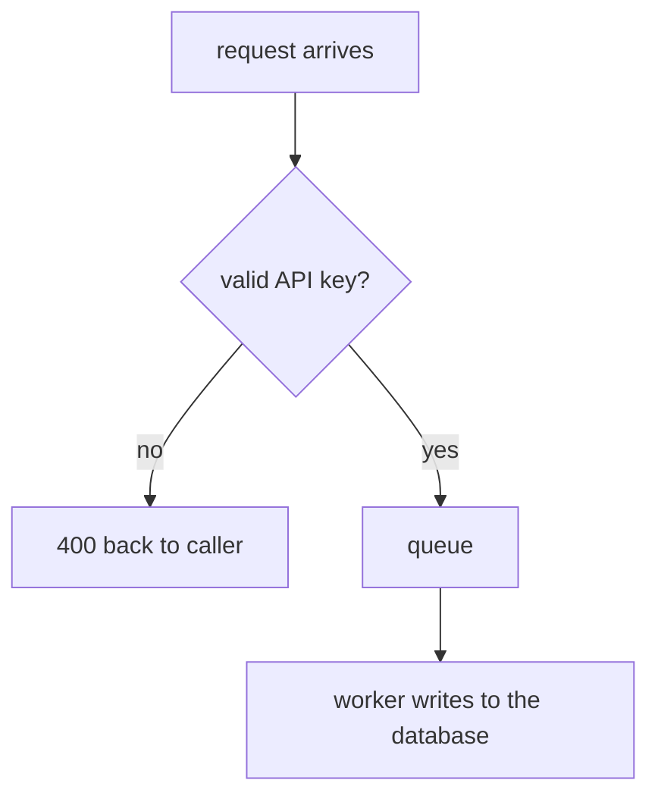

# Diagrams in documents

Collin reads visually. A document that describes a flow should show it. This file says where a
diagram goes, what kind, and what keeps it from lying.

## Which kind, and why

The choice is made by where the document is read, not by preference.

| Document | Diagram |
|---|---|
| `MAP.md` | Plain-text arrow chain. **No Mermaid** — see `map.md` |
| `IDEA.md` | None. Plain language, no design detail to draw |
| Routers (`AGENTS.md`/`CLAUDE.md`) | Plain-text arrow chain. No Mermaid |
| `PLAN.md` | Mermaid, in the Spec section, drawn at approval |
| `COMPLETION.md` | Mermaid, freely |
| `REMEDIATION-N.md` | Mermaid, freely |

`MAP.md` and router documents are read in a terminal while someone decides what to ask next or what
a directory owns, so a Mermaid block in either is a wall of syntax where a picture should be. The
rest are read rendered.

Outside these documents the same reasoning applies: rendered surface gets Mermaid, terminal
surface gets an arrow chain in a fenced block.

## Two rules

**A diagram is redundant with its prose.** Whatever it shows, the surrounding words already say.
A reader with no renderer — a terminal, a diff, a `cat` — must get the whole picture without it.
This is what makes a diagram free to add: it can never be the only place something is written.

**A diagram is drawn when its document stops changing, or it is not there.** A picture of a
design that has moved on is worse than no picture, for the same reason a router that lies is
worse than no router: someone acts on it. So a diagram belongs at the point a document is
finalized, never mid-churn.

For `PLAN.md` that point is **approval, not the Stage 1 exit pass.** Stage 2 rewrites the Spec
for every upheld finding, so a diagram drawn when planning ends is stale before anyone reads it.
Stage 2 draws or refreshes it immediately before setting `status: approved`.

## No cap

There is no budget and no earn-its-place test. A reader who does not want a diagram skips it. The
only constraint is the two rules above — which is a constraint on upkeep, not on quantity.

## Writing one

Keep it to the shape of the flow: what happens, in order, with the branches that matter. Boxes
and arrows. If it needs a legend it is too complicated — split it, the same way `map.md` says to
split a plain-text one.

Label a node with **what happens, in plain language** — not with the system's own vocabulary. A
diagram whose boxes read `ServiceImpl` and `HandlerFactory` tells a reader nothing the file list
would not, but a box reading "admission is a gate, not a coercion" is no better: it is a
compression written for someone already inside that module, and a diagram exists for the reader who
is not. Say "accept it as a real measurement, or refuse", and let the precise phrasing live in the
prose beside the diagram.

That makes a diagram drawn from a router or a docstring a **translation**, not an extraction, which
is more work than it looks and the main reason a generated diagram reads badly.

That renders, and the sentence "a request comes in, gets checked for an API key, then goes on a
queue where a worker writes it to the database" says the same thing. Both, always.

## Authoring a Spec diagram from a graph

A plan's graph — `docs/plans/<slug>/graphs/<name>.json` — is the input when one exists. Draw
the Spec's Mermaid from it rather than from scratch.

Show the **top level only**, marking which nodes hold a child graph underneath. Anyone who
wants the detail opens that graph directly.

Two independent flows — two files in `graphs/` that no `graph` field references — get one
diagram each. No cap applies beyond the one above: two flows are two pictures.

It is authored, not generated: no merge rule, no origin filter, no label escaping. A person
is drawing a picture from a picture.

`rejected` entries are left out. They are accounted for in prose instead, by the exit gate in
`planning.md` — which is why that gate walks every graph reachable through a container even
though the diagram itself only ever shows the top level: a rejection buried in a child graph
still needs a sentence, even though it never appears on the canvas.

A visible group in the graph is drawn in the Mermaid as a `subgraph` carrying the group's
`label`. Containment is unaffected and still shows the top level only.

A diagram drawn from a router or a docstring, above, is a translation, not an extraction —
the source's own compressions have to be unpacked for a reader outside that module. A graph
is the same translation one step further along: its labels are already plain-language
behaviour, not the codebase's own vocabulary, so of the three inputs this is the cheap one.
